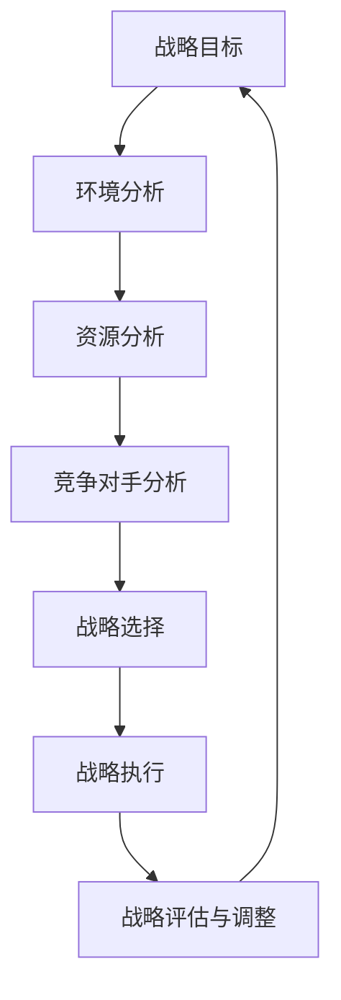

                 

 - 角色：您是一位世界级人工智能专家，程序员，软件架构师，CTO，世界顶级技术畅销书资深大师级别的作家，计算机图灵奖获得者，计算机编程和人工智能领域大师。您非常擅长一步一步进行分析推理（REASONING STEP BY STEP），有着清晰深刻的逻辑思路来撰写条理清晰，对技术原理和本质剖析到位的高质量技术博客。

- 任务：现在请您以《战略思维：培养长远眼光的领导能力》为标题， 使用逻辑清晰、结构紧凑、简单易懂的专业的技术语言（章节标题要非常吸引读者），让我们使用一步一步分析推理思考的方式（REASONING STEP BY STEP），撰写一篇有深度有思考有见解的专业IT领域的技术博客文章。

- 文章目录大纲结构如下：

# 《战略思维：培养长远眼光的领导能力》目录大纲

## 第一部分：战略思维概述

### 第1章：战略思维的定义与重要性

#### 1.1 战略思维的含义

#### 1.2 战略思维的重要性

#### 1.3 战略思维与传统思维的差异

### 第2章：战略思维的框架与要素

#### 2.1 战略思维的框架

#### 2.2 战略思维的要素

#### 2.3 战略思维的核心概念联系

### 第3章：战略思维的流程与方法

#### 3.1 战略思维的流程

#### 3.2 战略思维的方法

#### 3.3 战略思维的实践应用

## 第二部分：培养战略思维的技能

### 第4章：洞察力与预测力

#### 4.1 洞察力的培养

#### 4.2 预测力的培养

#### 4.3 洞察力与预测力的应用场景

### 第5章：决策力与执行力

#### 5.1 决策力的培养

#### 5.2 执行力的培养

#### 5.3 决策力与执行力的协同

### 第6章：学习力与创新力

#### 6.1 学习力的培养

#### 6.2 创新力的培养

#### 6.3 学习力与创新力的结合

## 第三部分：战略思维在领导力中的应用

### 第7章：战略思维在领导决策中的应用

#### 7.1 领导决策中的战略思维

#### 7.2 战略思维在团队管理中的应用

#### 7.3 战略思维在变革管理中的应用

### 第8章：战略思维在战略规划中的应用

#### 8.1 战略规划的基本原则

#### 8.2 战略思维在战略规划中的运用

#### 8.3 战略规划案例分析

### 第9章：战略思维在竞争中的策略制定

#### 9.1 竞争中的战略思维

#### 9.2 竞争策略的制定

#### 9.3 竞争案例分析

## 第四部分：战略思维的实践与反思

### 第10章：战略思维的实践

#### 10.1 战略思维实践的基本原则

#### 10.2 战略思维实践的方法

#### 10.3 战略思维实践中的挑战与应对

### 第11章：战略思维的反思与改进

#### 11.1 战略思维反思的重要性

#### 11.2 战略思维反思的方法

#### 11.3 战略思维改进的策略

### 第12章：战略思维与长期发展

#### 12.1 战略思维与可持续发展

#### 12.2 战略思维与全球化

#### 12.3 战略思维与未来展望

### 背景介绍

战略思维是现代领导者必备的核心能力。在日益复杂和变化的市场环境中，领导者不仅需要具备应对日常业务挑战的能力，更需要具备从全局角度出发，规划企业未来发展方向的远见卓识。战略思维是一种高层次的综合思考能力，它能够帮助领导者从众多复杂信息中提取关键因素，预见潜在风险和机遇，制定科学的决策方案，并有效实施这些方案。

在IT领域，战略思维的应用尤为广泛。无论是技术创新、商业模式转型，还是企业战略调整，都需要领导者具备战略思维。本文将从战略思维的定义、框架、培养方法、领导决策中的应用等多个方面进行深入探讨，旨在帮助读者理解战略思维的本质，提升自身的领导能力。

### 核心概念与联系

战略思维的核心概念包括战略目标、环境分析、资源分析、竞争对手分析、战略选择、战略执行和战略评估与调整。这些概念之间相互联系，共同构成了战略思维的整体框架。

- **战略目标**：明确企业的长远发展目标，是战略思维的出发点和归宿。
- **环境分析**：包括外部环境和内部环境的分析，为战略制定提供基础。
- **资源分析**：评估企业现有资源，确定资源优化利用的策略。
- **竞争对手分析**：分析竞争对手的优劣势，为制定竞争策略提供依据。
- **战略选择**：根据环境分析和资源分析的结果，选择合适的战略方向。
- **战略执行**：将战略决策转化为具体的行动计划，确保战略目标的实现。
- **战略评估与调整**：对战略执行效果进行评估，根据评估结果进行必要的调整。

为了更好地理解这些概念之间的联系，我们可以用Mermaid流程图来展示它们之间的关系：



### 算法原理讲解

战略思维的算法原理可以视为一个闭环反馈系统，其核心在于持续的信息收集、分析、决策和调整。以下是一个简化的战略思维算法原理的伪代码示例：

```plaintext
function 战略思维(目标, 环境, 资源, 竞争对手):
    1. 收集环境数据
    2. 分析环境数据以识别趋势和变化
    3. 分析资源状况，确定优势和限制
    4. 分析竞争对手，识别他们的策略和行动
    5. 根据环境、资源和竞争对手分析，设定目标
    6. 选择合适的战略方案
    7. 实施战略方案并监控执行过程
    8. 收集执行过程中的反馈
    9. 根据反馈调整战略方案
    10. 返回调整后的战略方案

// 实例化战略思维过程
战略思维(企业盈利目标, 市场环境数据, 现有资源数据, 竞争对手行为数据)
```

在这个算法中，每个步骤都是相互关联的，形成一个闭环。例如，战略目标的设定是基于对环境的分析，而执行过程中的反馈会进一步影响战略目标的调整。

### 数学模型及数学公式

在战略思维中，数学模型可以帮助领导者量化决策和预测结果。一个常见的数学模型是SWOT分析（Strengths, Weaknesses, Opportunities, Threats），它用于评估企业的内部优势与劣势以及外部机会与威胁。

SWOT分析可以使用以下数学公式表示：

$$
\text{SWOT分析} = \text{S} + \text{W} + \text{O} + \text{T}
$$

其中：
- S 代表优势（Strengths）
- W 代表劣势（Weaknesses）
- O 代表机会（Opportunities）
- T 代表威胁（Threats）

例如，一个企业可能在优势方面拥有强大的研发团队，在劣势方面缺乏有效的市场推广策略，在机会方面看到了新兴市场的潜力，在威胁方面则面临着技术更新的挑战。

为了更详细地分析，我们可以使用加权评分的方法来量化每个因素的重要性：

$$
\text{加权评分} = \text{权重} \times \text{评分}
$$

例如，优势的权重为0.4，评分为8，则该优势的加权评分为：

$$
\text{加权评分}_{\text{优势}} = 0.4 \times 8 = 3.2
$$

通过这种方式，我们可以计算出SWOT分析的总分，从而帮助企业确定优先战略方向。

### 项目实战

为了更好地理解战略思维的应用，我们来看一个实际项目案例——某科技公司如何利用战略思维进行产品创新。

#### 项目背景

某科技公司是一家专注于智能家居设备研发的公司，市场份额稳步增长，但在技术创新方面面临激烈的市场竞争。

#### 项目目标

利用战略思维，提升产品的创新能力和市场竞争力。

#### 项目步骤

1. **环境分析**：
   - 收集行业报告、竞争对手产品信息、消费者需求反馈。
   - 分析技术发展趋势和市场趋势。

2. **资源分析**：
   - 评估现有研发团队的技术能力和资源。
   - 评估财务状况，确定可用的资金和投资额度。

3. **竞争对手分析**：
   - 确定主要竞争对手的产品特点、市场份额和营销策略。
   - 分析竞争对手的劣势和潜在的市场机会。

4. **战略选择**：
   - 根据环境、资源和竞争对手分析结果，确定产品创新方向。
   - 选择具有市场竞争力的技术路线和产品功能。

5. **战略执行**：
   - 设计详细的研发计划和营销策略。
   - 组建专项研发团队，并确保资源和支持到位。

6. **战略评估与调整**：
   - 定期收集市场反馈，评估产品性能和市场反应。
   - 根据评估结果调整研发计划和市场策略。

#### 项目实现

在实施过程中，该公司采用了以下策略：

- **技术创新**：引入最新的物联网技术，提升产品的智能化程度。
- **用户体验**：根据消费者反馈，优化产品界面和功能，提高用户满意度。
- **市场定位**：针对高端市场，推出具有独特功能的高档智能家居产品。

通过这些措施，该公司成功推出了多款具有竞争力的创新产品，市场份额得到显著提升。

#### 项目小结

通过该项目的实施，我们可以看到战略思维在产品创新和市场竞争中的应用。关键成功因素包括：

- **全面的环境分析**：帮助公司了解市场趋势和消费者需求。
- **精准的竞争对手分析**：识别竞争对手的劣势，确定市场机会。
- **有效的资源优化**：确保研发和营销资源的合理配置。
- **持续的战略评估与调整**：根据市场反馈不断优化产品策略。

### 最佳实践 Tips

1. **持续学习与更新**：战略思维是一个动态过程，领导者需要不断学习新知识，更新战略思维框架。

2. **跨部门协作**：战略思维不仅仅是领导者的责任，需要整个团队共同参与，确保战略决策的有效实施。

3. **灵活调整**：市场环境变化快速，领导者需要具备灵活调整战略的能力。

4. **注重执行力**：战略思维不仅仅停留在理论层面，更需要通过实际行动来落实。

5. **定期反思与总结**：定期对战略实施效果进行反思，总结经验教训，为未来的战略决策提供依据。

### 小结

战略思维是领导者必备的核心能力，它帮助我们从全局角度出发，科学决策，确保企业的可持续发展。本文通过定义、框架、培养方法、领导决策中的应用等多个方面，深入探讨了战略思维的内涵和应用。希望读者能够从中获得启示，提升自身的战略思维能力，成为更加出色的领导者。

### 注意事项

1. **文章撰写格式**：请确保文章内容使用markdown格式，包括标题、关键词、摘要和章节结构。
2. **代码与公式格式**：伪代码、Mermaid流程图和LaTeX公式需要按照指定格式编写，确保文章的可读性。
3. **完整性**：确保每个章节内容丰富具体，核心概念、算法原理、数学模型、项目实战等内容都要详细阐述。

### 拓展阅读

- 《竞争战略》作者：迈克尔·波特
- 《智能创新》作者：克莱顿·克里斯滕森
- 《精益创业》作者：埃里克·莱斯
- 《五力模型》作者：迈克尔·波特

这些书籍都是战略思维领域的重要参考资料，可以帮助读者进一步深入理解战略思维的内涵和应用。

### 文章标题

《战略思维：培养长远眼光的领导能力》

### 关键词

战略思维，领导能力，长远眼光，企业决策，市场竞争，创新能力

### 摘要

本文旨在深入探讨战略思维的定义、框架、培养方法及其在领导决策中的应用。通过详细分析战略思维的核心概念、流程、方法，结合实际项目案例，阐述如何培养和运用战略思维，提升企业的市场竞争力。文章结构清晰，逻辑严密，适合企业管理者、IT专业人士阅读，以提升自身领导能力和战略规划能力。

---

# 《战略思维：培养长远眼光的领导能力》

在快速变化的市场环境中，战略思维成为了领导者不可或缺的核心能力。它不仅能够帮助领导者从全局角度审视企业的发展，还能在复杂的市场环境中做出科学、合理的决策。本文将围绕战略思维的核心概念、培养方法、应用场景等方面进行深入探讨，帮助读者理解战略思维的本质，提升自身的领导能力。

## 第一部分：战略思维概述

### 第1章：战略思维的定义与重要性

战略思维是一种高级的综合思考能力，它使领导者能够从全局角度审视企业的发展，预见未来趋势，制定长远规划。本章节将详细解释战略思维的含义，阐述其在领导决策中的重要性。

#### 1.1 战略思维的含义

战略思维是一种高层次的综合思考能力，它涵盖了目标设定、环境分析、资源评估、竞争对手分析、战略选择、战略执行和战略评估与调整等多个方面。战略思维的核心在于能够从众多信息中提取关键因素，进行科学决策。

#### 1.2 战略思维的重要性

战略思维的重要性体现在以下几个方面：

1. **指导企业长远发展**：战略思维能够帮助领导者从全局角度规划企业的发展路径，确保企业能够持续、稳定地发展。
2. **应对市场变化**：在快速变化的市场环境中，战略思维能够帮助领导者及时捕捉市场动态，预见未来趋势，制定灵活的应对策略。
3. **提高决策质量**：战略思维能够帮助领导者从多个角度分析问题，制定科学的决策方案，降低决策风险。

#### 1.3 战略思维与传统思维的差异

战略思维与传统思维有以下几点显著差异：

1. **视野更宽广**：战略思维强调从全局角度审视问题，而传统思维往往局限于局部。
2. **前瞻性更强**：战略思维注重对未来趋势的预见，而传统思维往往注重解决当前问题。
3. **系统性更完整**：战略思维强调系统性思考，而传统思维则可能缺乏这种系统性。

### 第2章：战略思维的框架与要素

战略思维的框架包括目标设定、环境分析、资源分析、竞争对手分析、战略选择、战略执行和战略评估与调整等多个要素。本章节将详细解释这些要素的含义和作用。

#### 2.1 战略思维的框架

战略思维的框架可以视为一个闭环系统，其核心在于持续的信息收集、分析、决策和调整。以下是一个简化的战略思维框架：

1. **目标设定**：明确企业的发展目标。
2. **环境分析**：分析外部环境和内部环境，识别市场趋势和内部资源。
3. **资源分析**：评估企业的资源和能力，确定资源优化利用的策略。
4. **竞争对手分析**：分析竞争对手的优劣势，制定竞争策略。
5. **战略选择**：根据环境分析和资源分析的结果，选择合适的战略方向。
6. **战略执行**：将战略决策转化为具体的行动计划，确保战略目标的实现。
7. **战略评估与调整**：对战略执行效果进行评估，根据评估结果进行必要的调整。

#### 2.2 战略思维的要素

战略思维的要素包括：

1. **目标设定**：明确企业的发展目标，是战略思维的出发点和归宿。
2. **环境分析**：包括外部环境和内部环境的分析，为战略制定提供基础。
3. **资源分析**：评估企业现有资源，确定资源优化利用的策略。
4. **竞争对手分析**：分析竞争对手的优劣势，为制定竞争策略提供依据。
5. **战略选择**：根据环境分析和资源分析的结果，选择合适的战略方向。
6. **战略执行**：将战略决策转化为具体的行动计划，确保战略目标的实现。
7. **战略评估与调整**：对战略执行效果进行评估，根据评估结果进行必要的调整。

#### 2.3 战略思维的核心概念联系

战略思维的核心概念之间相互联系，共同构成了战略思维的整体框架。以下是一个简化的Mermaid流程图，展示了这些概念之间的联系：


### 第3章：战略思维的流程与方法

战略思维的流程和方法是确保战略思维有效实施的关键。本章节将详细介绍战略思维的流程和方法，帮助读者理解和掌握战略思维的应用。

#### 3.1 战略思维的流程

战略思维的流程通常包括以下步骤：

1. **明确目标**：设定企业的发展目标，明确战略方向。
2. **环境分析**：分析外部环境和内部环境，识别市场趋势和内部资源。
3. **资源分析**：评估企业的资源和能力，确定资源优化利用的策略。
4. **竞争对手分析**：分析竞争对手的优劣势，制定竞争策略。
5. **战略选择**：根据环境分析和资源分析的结果，选择合适的战略方向。
6. **战略执行**：将战略决策转化为具体的行动计划，确保战略目标的实现。
7. **战略评估与调整**：对战略执行效果进行评估，根据评估结果进行必要的调整。

#### 3.2 战略思维的方法

战略思维的方法多种多样，以下是一些常见的方法：

1. **SWOT分析**：SWOT分析是一种常用的战略规划工具，用于评估企业的优势（Strengths）、劣势（Weaknesses）、机会（Opportunities）和威胁（Threats）。
2. **五力模型**：五力模型由迈克尔·波特提出，用于分析行业竞争态势，包括现有竞争者、潜在竞争者、供应商、买方和替代品。
3. **PEST分析**：PEST分析是一种外部环境分析方法，包括政治（Political）、经济（Economic）、社会（Sociological）和技术（Technological）四个方面。
4. **波特价值链**：波特价值链是一种用于分析企业内部业务流程的方法，包括主要活动和支持活动。

#### 3.3 战略思维的实践应用

战略思维在实践中的应用非常广泛，以下是一些常见的应用场景：

1. **企业战略规划**：战略思维可以帮助企业制定长远的发展规划，确保企业能够在竞争激烈的市场中立足。
2. **产品创新**：战略思维可以帮助企业预见市场需求，进行产品创新，提高市场竞争力。
3. **市场营销**：战略思维可以帮助企业制定科学的营销策略，提高市场占有率。
4. **人力资源管理**：战略思维可以帮助企业优化人力资源配置，提高员工满意度和工作效率。

### 第二部分：培养战略思维的技能

#### 第4章：洞察力与预测力

洞察力和预测力是战略思维的重要组成部分，它们帮助领导者从复杂的信息中提取关键因素，预见未来趋势。本章节将介绍如何培养和提高洞察力和预测力。

#### 4.1 洞察力的培养

洞察力的培养需要从以下几个方面入手：

1. **多角度思考**：领导者应该学会从不同角度审视问题，挖掘问题的本质。
2. **经验积累**：丰富的经验可以帮助领导者更好地理解行业和市场。
3. **持续学习**：领导者需要不断学习新知识，提高自身的专业素养。

#### 4.2 预测力的培养

预测力的培养需要从以下几个方面入手：

1. **数据驱动**：领导者应该学会利用数据进行分析，提高预测的准确性。
2. **趋势分析**：领导者需要关注行业和市场趋势，从中寻找机遇。
3. **情景规划**：通过情景规划，领导者可以提前设想可能出现的情况，并制定相应的应对策略。

#### 4.3 洞察力与预测力的应用场景

洞察力和预测力在以下场景中具有重要作用：

1. **市场分析**：通过洞察力和预测力，领导者可以准确把握市场趋势，制定科学的市场策略。
2. **产品规划**：通过洞察力和预测力，领导者可以预见消费者的需求，进行产品创新。
3. **风险管理**：通过洞察力和预测力，领导者可以识别潜在的风险，提前制定应对策略。

### 第5章：决策力与执行力

决策力和执行力是战略思维的两个重要方面，它们决定了战略思维的有效实施。本章节将介绍如何培养和提高决策力和执行力。

#### 5.1 决策力的培养

决策力的培养需要从以下几个方面入手：

1. **信息收集**：领导者需要收集全面的信息，确保决策的准确性。
2. **风险评估**：领导者需要学会评估决策的风险，降低决策失误的可能性。
3. **快速决策**：领导者需要具备快速决策的能力，以适应市场的变化。

#### 5.2 执行力的培养

执行力的培养需要从以下几个方面入手：

1. **目标明确**：领导者需要确保执行目标的明确性，避免执行过程中出现偏差。
2. **资源保障**：领导者需要确保执行过程中所需的资源得到充分保障。
3. **激励机制**：领导者需要建立有效的激励机制，激发团队成员的执行力。

#### 5.3 决策力与执行力的协同

决策力和执行力需要协同发挥作用，才能实现战略目标。以下是一些建议：

1. **明确责任**：领导者需要明确各个团队成员的责任，确保执行过程中责任到人。
2. **沟通协作**：领导者需要建立良好的沟通机制，确保团队成员之间的协作。
3. **持续监控**：领导者需要持续监控执行过程，及时调整执行策略。

### 第6章：学习力与创新力

学习力和创新力是战略思维的重要组成部分，它们帮助领导者不断提高自身的能力，应对复杂多变的市场环境。本章节将介绍如何培养和提高学习力与创新力。

#### 6.1 学习力的培养

学习力的培养需要从以下几个方面入手：

1. **主动学习**：领导者需要主动学习新知识，不断提升自身的专业素养。
2. **知识整合**：领导者需要学会整合各种知识，形成自己的知识体系。
3. **经验分享**：领导者需要学会分享经验，促进团队成员的共同成长。

#### 6.2 创新力的培养

创新力的培养需要从以下几个方面入手：

1. **思维开放**：领导者需要保持开放的心态，勇于接受新的思维和方法。
2. **鼓励创新**：领导者需要鼓励团队成员提出创新的想法，并给予支持和资源。
3. **持续改进**：领导者需要建立持续改进的机制，不断优化产品和服务。

#### 6.3 学习力与创新力的结合

学习力与创新力需要紧密结合，才能发挥最大的作用。以下是一些建议：

1. **知识转化**：领导者需要学会将学到的知识转化为实际行动，推动企业创新。
2. **实践验证**：领导者需要通过实践验证创新成果，确保创新的有效性。
3. **动态调整**：领导者需要根据实践结果，动态调整学习和创新策略。

### 第三部分：战略思维在领导力中的应用

#### 第7章：战略思维在领导决策中的应用

战略思维在领导决策中具有重要作用，它帮助领导者从全局角度审视问题，做出科学合理的决策。本章节将探讨战略思维在领导决策中的应用。

#### 7.1 领导决策中的战略思维

领导决策中的战略思维包括以下几个方面：

1. **目标明确**：领导者需要明确决策的目标，确保决策的针对性。
2. **信息收集**：领导者需要收集全面的信息，确保决策的准确性。
3. **风险评估**：领导者需要评估决策的风险，降低决策失误的可能性。
4. **科学决策**：领导者需要运用科学的方法和工具进行决策，提高决策的效率和质量。

#### 7.2 战略思维在团队管理中的应用

战略思维在团队管理中的应用包括以下几个方面：

1. **目标设定**：领导者需要明确团队的目标，确保团队成员的共同努力。
2. **资源分配**：领导者需要合理分配资源，确保团队的工作顺利进行。
3. **激励机制**：领导者需要建立有效的激励机制，激发团队成员的积极性。
4. **沟通协作**：领导者需要建立良好的沟通机制，确保团队成员之间的协作。

#### 7.3 战略思维在变革管理中的应用

战略思维在变革管理中的应用包括以下几个方面：

1. **环境分析**：领导者需要分析外部环境和内部环境，确定变革的必要性和可行性。
2. **资源评估**：领导者需要评估变革所需的资源和能力，确保变革的顺利进行。
3. **风险管理**：领导者需要识别变革过程中的风险，并制定相应的应对策略。
4. **持续改进**：领导者需要建立持续改进的机制，确保变革的成果得到持续巩固。

### 第8章：战略思维在战略规划中的应用

战略思维在战略规划中具有核心作用，它帮助领导者制定长远的发展规划，确保企业能够持续、稳定地发展。本章节将探讨战略思维在战略规划中的应用。

#### 8.1 战略规划的基本原则

战略规划的基本原则包括以下几个方面：

1. **目标明确**：战略规划需要明确企业的发展目标，确保战略规划的针对性。
2. **环境分析**：战略规划需要分析外部环境和内部环境，识别市场趋势和内部资源。
3. **资源评估**：战略规划需要评估企业现有的资源和能力，确保战略规划的可执行性。
4. **风险评估**：战略规划需要评估战略规划的风险，制定相应的应对策略。

#### 8.2 战略思维在战略规划中的运用

战略思维在战略规划中的运用包括以下几个方面：

1. **目标设定**：战略思维可以帮助领导者设定长远的发展目标，确保企业能够持续发展。
2. **环境分析**：战略思维可以帮助领导者分析外部环境和内部环境，制定科学的战略规划。
3. **资源评估**：战略思维可以帮助领导者评估企业现有的资源和能力，制定合理的战略规划。
4. **风险评估**：战略思维可以帮助领导者识别战略规划的风险，制定相应的应对策略。

#### 8.3 战略规划案例分析

本章节将分析一个实际案例，探讨战略思维在战略规划中的应用。案例企业是一家处于快速发展阶段的互联网公司，通过战略思维制定了明确的战略规划，实现了业务的持续增长。

### 第9章：战略思维在竞争中的策略制定

战略思维在竞争中的策略制定中具有重要作用，它帮助领导者分析竞争对手，制定科学的竞争策略，提高市场竞争力。本章节将探讨战略思维在竞争策略制定中的应用。

#### 9.1 竞争中的战略思维

竞争中的战略思维包括以下几个方面：

1. **竞争对手分析**：领导者需要分析竞争对手的优劣势，制定相应的竞争策略。
2. **市场定位**：领导者需要确定企业的市场定位，确保企业的市场竞争力。
3. **差异化策略**：领导者需要制定差异化的竞争策略，提高企业的市场地位。
4. **创新驱动**：领导者需要通过创新驱动，保持企业的市场竞争力。

#### 9.2 竞争策略的制定

竞争策略的制定需要从以下几个方面入手：

1. **目标设定**：明确竞争策略的目标，确保竞争策略的针对性。
2. **市场分析**：分析市场竞争态势，识别竞争对手的优劣势。
3. **资源评估**：评估企业现有的资源和能力，制定合理的竞争策略。
4. **风险评估**：评估竞争策略的风险，制定相应的应对策略。

#### 9.3 竞争案例分析

本章节将分析一个实际案例，探讨战略思维在竞争策略制定中的应用。案例企业是一家处于激烈竞争中的科技公司，通过战略思维制定了科学的竞争策略，取得了显著的市场竞争力。

### 第四部分：战略思维的实践与反思

#### 第10章：战略思维的实践

战略思维的实践是领导者提升战略思维能力的关键。本章节将探讨战略思维在实践中如何运用，以及如何应对实践中的挑战。

#### 10.1 战略思维实践的基本原则

战略思维实践的基本原则包括以下几个方面：

1. **目标导向**：实践过程中需要始终以目标为导向，确保实践活动的有效性。
2. **信息驱动**：实践过程中需要充分利用信息，确保决策的准确性。
3. **持续改进**：实践过程中需要不断反思和改进，提高实践效果。

#### 10.2 战略思维实践的方法

战略思维实践的方法包括以下几个方面：

1. **环境分析**：通过分析外部环境和内部环境，识别市场趋势和内部资源。
2. **资源评估**：通过评估企业现有的资源和能力，制定合理的战略规划。
3. **竞争对手分析**：通过分析竞争对手的优劣势，制定科学的竞争策略。
4. **战略执行**：通过将战略决策转化为具体的行动计划，确保战略目标的实现。

#### 10.3 战略思维实践中的挑战与应对

战略思维实践中可能会遇到以下挑战：

1. **信息不对称**：解决方法是通过建立信息共享机制，确保信息的透明和及时性。
2. **资源限制**：解决方法是合理分配资源，确保资源的最大化利用。
3. **执行力不足**：解决方法是建立有效的激励机制，提高团队成员的执行力。

### 第11章：战略思维的反思与改进

战略思维的反思与改进是领导者提升战略思维能力的必要环节。本章节将探讨如何进行战略思维的反思与改进。

#### 11.1 战略思维反思的重要性

战略思维反思的重要性体现在以下几个方面：

1. **发现不足**：通过反思，领导者可以发现战略思维中的不足，为改进提供依据。
2. **优化决策**：通过反思，领导者可以优化决策过程，提高决策质量。
3. **持续成长**：通过反思，领导者可以不断提升自身的战略思维能力，实现持续成长。

#### 11.2 战略思维反思的方法

战略思维反思的方法包括以下几个方面：

1. **定期回顾**：定期回顾战略执行情况，分析成功和失败的原因。
2. **数据驱动**：通过数据分析，识别战略思维中的问题和不足。
3. **团队协作**：通过团队协作，共同反思战略思维，提出改进建议。

#### 11.3 战略思维改进的策略

战略思维改进的策略包括以下几个方面：

1. **知识更新**：不断学习新知识，更新战略思维框架。
2. **方法优化**：优化战略思维的方法，提高决策效率和质量。
3. **实践应用**：通过实践应用，验证改进效果，不断优化战略思维。

### 第12章：战略思维与长期发展

战略思维在企业的长期发展中具有重要作用，它帮助领导者制定长远的发展规划，确保企业的持续、稳定发展。本章节将探讨战略思维在长期发展中的应用。

#### 12.1 战略思维与可持续发展

战略思维与可持续发展的关系体现在以下几个方面：

1. **环境责任**：战略思维可以帮助企业识别环境责任，制定可持续发展策略。
2. **资源优化**：战略思维可以帮助企业优化资源利用，提高资源利用效率。
3. **社会责任**：战略思维可以帮助企业履行社会责任，实现可持续发展。

#### 12.2 战略思维与全球化

战略思维在全球化中的应用包括以下几个方面：

1. **市场拓展**：战略思维可以帮助企业识别全球市场机会，制定市场拓展策略。
2. **国际化运营**：战略思维可以帮助企业优化国际化运营，提高全球竞争力。
3. **跨文化管理**：战略思维可以帮助企业应对跨文化管理挑战，实现全球化发展。

#### 12.3 战略思维与未来展望

战略思维在未来的发展中将继续发挥重要作用，它将帮助领导者应对更加复杂和多变的市场环境。未来的战略思维将更加注重：

1. **创新驱动**：战略思维将更加注重创新驱动，推动企业持续创新，保持竞争力。
2. **数字化转型**：战略思维将更加注重数字化转型，利用数字技术优化业务流程，提高运营效率。
3. **可持续发展**：战略思维将更加注重可持续发展，推动企业在经济、社会和环境方面的可持续发展。

### 结论

战略思维是领导者不可或缺的核心能力，它帮助领导者从全局角度审视企业的发展，预见未来趋势，制定长远规划。通过本文的讨论，我们了解了战略思维的定义、框架、培养方法、应用场景等，相信读者能够从中获得启示，提升自身的战略思维能力。在未来，随着市场的不断变化，战略思维将变得更加重要，领导者需要不断学习和实践，提升自身的战略思维能力，为企业的发展贡献力量。

### 作者信息

作者：AI天才研究院/AI Genius Institute & 禅与计算机程序设计艺术 /Zen And The Art of Computer Programming

感谢您的阅读，希望本文对您在战略思维方面有所启发和帮助。如果您有任何问题或建议，欢迎在评论区留言，期待与您交流。

