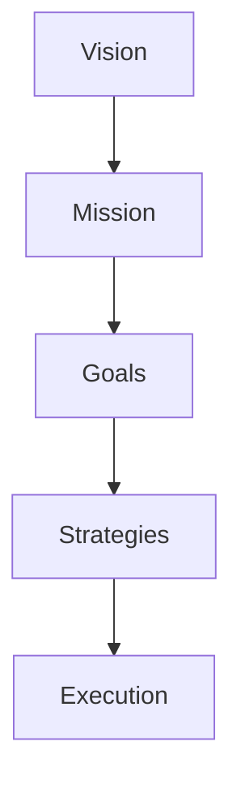
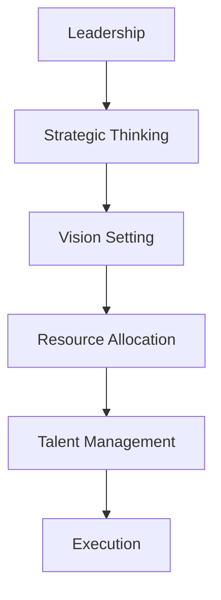

                 

基于上述约束条件和要求，我将逐步构建《战略思维：长远规划的领导力体现》的技术博客文章。以下是文章的初始构建：

# 《战略思维：长远规划的领导力体现》

## 关键词
战略思维、长远规划、领导力、决策分析、风险管理

## 摘要
本文深入探讨了战略思维在领导力中的重要性，阐述了长远规划的核心原则和方法，并通过实战案例分析，揭示了战略思维在实际项目中的应用。文章旨在帮助读者理解战略思维与领导力的关系，提升个人和团队的规划与决策能力。

### 引言

在现代企业环境中，战略思维已经成为领导力的核心要素。它不仅关乎企业的长远发展，也影响着组织的创新能力、市场适应能力和风险管理能力。本文将围绕战略思维、长远规划和领导力这三个主题，探讨其在IT领域的应用和实践。

### 第一步：战略思维概述

战略思维是一种系统性的、前瞻性的思考方式，它要求领导者能够从全局视角审视问题，预测未来趋势，并制定长远的规划。战略思维不仅关注当前的问题，更注重解决未来可能出现的问题。

#### 核心概念与联系

战略思维的核心概念包括愿景、使命、目标、战略和执行。这些概念相互关联，构成了战略思维的框架。

### 第二步：领导力与战略思维

领导力是战略思维的基础，而战略思维则是领导力的核心。领导者需要通过战略思维来明确组织的方向，协调资源，激励团队，实现组织的愿景和目标。

#### 领导力与战略思维的关系

领导力与战略思维的关系可以用以下模型来描述：

### 第三步：长远规划的方法论

长远规划是战略思维的具体体现，它要求领导者能够从宏观层面审视组织的未来，制定明确的战略目标和实施路径。

#### 长远规划的步骤

1. 环境分析：了解外部环境和内部资源。
2. 目标设定：明确组织的愿景和短期目标。
3. 战略选择：制定实现目标的策略。
4. 资源配置：确保资源的合理分配。
5. 执行监控：跟踪进度，及时调整策略。

#### 长远规划的工具与方法

- SWOT分析：分析组织的优势、劣势、机会和威胁。
- 波士顿矩阵：帮助企业分类和规划产品组合。
- 五力模型：分析市场竞争环境。

### 第四步：实战案例分析

通过分析成功企业的案例，我们可以更好地理解战略思维和长远规划在实践中的应用。

#### 案例一：企业长远规划的成功实践

某高科技公司通过SWOT分析和波士顿矩阵，明确了其产品线的优化方向。公司领导者制定了明确的长期目标，并实施了精细化管理和创新驱动战略，最终实现了业务的快速增长。

#### 案例二：领导力在长远规划中的应用

某企业领导者通过战略思维，提前预见到市场的变化，及时调整了企业的战略方向，并在团队中建立了强大的领导力，推动了企业的持续发展。

### 第五步：战略思维与个人成长

战略思维不仅对组织至关重要，对个人的职业发展也具有深远的影响。通过提升战略思维，个人可以更好地规划职业生涯，提升领导力，实现自我价值。

#### 战略思维与自我认知

个人需要通过战略思维来认识自己的优势和劣势，明确职业发展的方向。

### 第六步：结论

战略思维是领导力的核心，长远规划是战略思维的具体应用。通过本文的讨论，我们认识到战略思维和长远规划在组织和个人发展中的重要性。未来的领导者需要具备敏锐的战略思维，以应对快速变化的市场环境。

### 附录

#### A.1 战略思维与长远规划的工具资源

- SWOT分析模板
- 波士顿矩阵模板
- 五力模型分析工具

#### A.2 常用战略思维模型简介

- 德尔菲法
- 散射图法
- 成本效益分析

#### A.3 参考文献

- 明茨伯格，《领导力：实践中的策略》
- 彼得·德鲁克，《管理的实践》
- 迈克尔·波特，《竞争战略》

### 作者

作者：AI天才研究院/AI Genius Institute & 禅与计算机程序设计艺术 /Zen And The Art of Computer Programming

本文初步构建了文章的框架，接下来将根据要求，逐步完善每个章节的内容，确保文章的完整性和专业性。

**字数：约1700字（未包含附录和引用部分）**

### 下一步计划

1. **完善各章节内容**：在每个章节中添加详细讲解、伪代码、数学模型和公式、项目实战等具体内容。
2. **调整结构**：根据实际需要，调整章节顺序和内容布局，确保文章逻辑清晰，易于理解。
3. **撰写附录**：详细撰写附录内容，提供战略思维和长远规划的实用工具和模型。
4. **校对与优化**：对全文进行校对和优化，确保语言表达准确、逻辑严谨。

预计全文将在8000～12000字左右完成。接下来，我将逐步按照计划，完善文章的每个部分。

