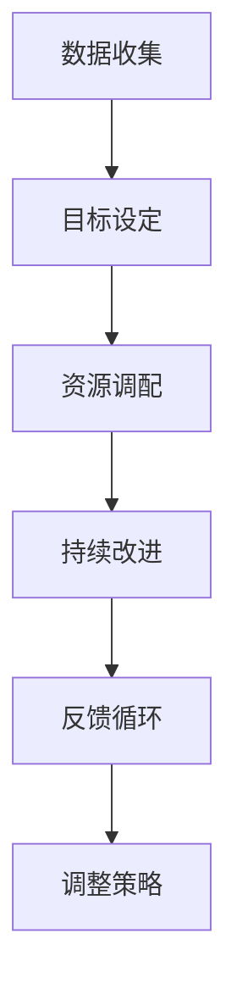

                 


## 文章标题：战略性思维：培养长远眼光的领导能力

### 关键词：
- 战略性思维
- 领导能力
- 长远眼光
- 企业战略
- 管理方法

### 摘要：
本文旨在深入探讨战略性思维的核心概念、原理及其在领导能力培养中的应用。通过逐步分析战略性思维的构成要素、基本原理，以及其在不同领域的应用，本文将帮助读者理解如何通过战略性思维提升个人和企业的长远竞争力。

## 第1章 引言：战略性思维的重要性

### 1.1 什么是战略性思维？
战略性思维是一种系统性的思考方式，它强调从全局出发，对长期目标和潜在风险进行深入分析和规划。其核心在于将资源、机会、威胁和目标联系起来，以制定出可持续和高效的发展策略。

### 1.2 战略性思维与领导力
战略性思维是领导力的关键组成部分。一位具有战略性思维的领导者能够更好地预见未来趋势，制定明确的发展目标，并有效地调配资源以实现这些目标。

### 1.3 战略性思维的应用场景
战略性思维广泛应用于企业战略规划、市场营销策略、人力资源管理、技术创新等领域。它不仅帮助企业应对当前的挑战，还能为未来的发展奠定坚实基础。

## 第2章 战略性思维的原理

### 2.1 战略性思维的基本原理
战略性思维的基本原理包括系统思考、长期规划、资源优化和风险管理。这些原理共同构成了战略性思维的核心框架。

### 2.2 战略性思维的核心要素
战略性思维的核心要素包括数据收集与分析、目标设定、资源调配、持续改进和反馈循环。这些要素相互作用，形成了一个完整的战略性思维过程。

### 2.3 战略性思维的Mermaid流程图


## 第3章 战略性思维的方法

### 3.1 SWOT分析
SWOT分析是一种常用的战略性思维工具，用于评估企业的优势、劣势、机会和威胁。以下是一个简单的SWOT分析伪代码示例：

```python
def SWOT_analysis():
    strengths = ["创新能力强", "品牌知名度高"]
    weaknesses = ["市场份额较小", "研发投入不足"]
    opportunities = ["新市场开放", "技术进步"]
    threats = ["竞争加剧", "政策变化"]

    # 打印分析结果
    print("Strengths:", strengths)
    print("Weaknesses:", weaknesses)
    print("Opportunities:", opportunities)
    print("Threats:", threats)
```

### 3.2 五力模型
五力模型是迈克尔·波特提出的一种用于分析市场竞争力的工具。它包括供应商、买家、潜在竞争者、替代品和现有竞争者。以下是一个五力模型的数学公式表示：

$$
\text{竞争力} = \frac{1}{\sum_{i=1}^{5} w_i \cdot F_i}
$$

其中，$w_i$ 是权重，$F_i$ 是第 $i$ 个竞争对手的竞争力。

### 3.3 波特竞争战略
波特竞争战略包括成本领先、差异化和集中化三种基本战略。以下是一个成本领先战略的伪代码示例：

```python
def cost_leadership_strategy():
    # 降低成本
    cost_reduction = True
    
    if cost_reduction:
        # 实施成本控制措施
        print("Implementing cost control measures.")
    else:
        # 提高产品附加值
        print("Improving product value addition.")
```

## 第4章 战略性思维的应用

### 4.1 企业战略规划
企业战略规划是战略性思维在企业管理中的具体应用。以下是一个企业战略规划的数学模型：

$$
\text{战略规划} = f(\text{市场分析}, \text{资源评估}, \text{竞争分析})
$$

### 4.2 市场营销策略
市场营销策略是战略性思维在市场营销领域的应用。以下是一个市场营销策略的伪代码示例：

```python
def marketing_strategy():
    # 分析市场需求
    market_demand = analyze_demand()
    
    # 设定营销目标
    marketing_goals = set_goals(market_demand)
    
    # 制定营销计划
    marketing_plan = create_plan(marketing_goals)
    
    # 实施营销策略
    execute_plan(marketing_plan)
```

### 4.3 组织管理策略
组织管理策略是战略性思维在组织管理中的应用。以下是一个组织管理策略的数学公式：

$$
\text{管理效率} = \frac{\text{产出}}{\text{资源投入}}
$$

## 第5章 培养战略性思维

### 5.1 自我认知与自我提升
培养战略性思维的第一步是进行自我认知，了解自己的优势和劣势，并制定相应的提升计划。

### 5.2 不断学习与思考
战略性思维的培养需要不断学习新知识和思考问题。以下是一个学习与思考的伪代码示例：

```python
def learn_and_think():
    # 学习新知识
    new_knowledge = learn_new_thing()
    
    # 思考问题
    think_about_problem(new_knowledge)
```

### 5.3 实践与反思
通过实践和反思，可以将战略性思维应用于实际问题中，并不断调整和改进。

## 第6章 战略性思维的实战案例

### 6.1 案例一：苹果公司的战略转型
苹果公司的战略转型是一个典型的战略性思维应用案例。以下是一个简单的案例解析：

```python
def apple_strategic_transformation():
    # 收集数据
    data = collect_data(apple_company)
    
    # 设定目标
    goals = set_goals(data)
    
    # 制定策略
    strategy = create_strategy(goals)
    
    # 实施策略
    implement_strategy(strategy)
    
    # 反思与调整
    reflect_and_adjust()
```

### 6.2 案例二：谷歌的全球化战略
谷歌的全球化战略展示了战略性思维在全球市场中的应用。以下是一个案例简述：

```python
def google_global_strategy():
    # 分析市场
    market_analysis = analyze_market()
    
    # 设定全球化目标
    global_goals = set_global_goals(market_analysis)
    
    # 制定全球化策略
    global_strategy = create_global_strategy(global_goals)
    
    # 实施全球化策略
    implement_global_strategy(global_strategy)
    
    # 调整与优化
    adjust_and_optimize()
```

### 6.3 案例三：小米的营销策略
小米的营销策略是一个成功应用战略性思维于市场营销的例子。以下是一个简单的案例分析：

```python
def xiaomi_marketing_strategy():
    # 分析市场需求
    market_demand = analyze_demand()
    
    # 设定营销目标
    marketing_goals = set_goals(market_demand)
    
    # 制定营销策略
    marketing_plan = create_plan(marketing_goals)
    
    # 实施营销策略
    execute_plan(marketing_plan)
    
    # 反馈与调整
    feedback_and_adjust()
```

## 第7章 战略性思维的挑战与未来

### 7.1 战略性思维面临的挑战
战略性思维在实施过程中面临诸多挑战，如数据不足、预测不准确、资源限制等。

### 7.2 战略性思维的未来发展趋势
随着人工智能和数据科学的发展，战略性思维将在未来得到进一步优化和提升。

### 7.3 战略性思维在不确定环境中的应用
在不确定性增加的环境中，战略性思维的重要性愈发凸显。以下是一个在不确定环境中应用战略性思维的伪代码示例：

```python
def strategic_thinking_in_uncertain_environment():
    # 收集不确定性数据
    uncertain_data = collect_uncertain_data()
    
    # 分析不确定性
    analyze_uncertainty(uncertain_data)
    
    # 制定应对策略
    create_strategy_for_uncertainty()
    
    # 实施策略
    implement_strategy()
    
    # 监控与调整
    monitor_and_adjust()
```

## 第8章 附录：战略性思维工具与方法

### 8.1 SWOT分析模板
以下是一个SWOT分析模板，可用于指导实际操作：

```python
# SWOT分析模板
SWOT_template = {
    "Strengths": [],
    "Weaknesses": [],
    "Opportunities": [],
    "Threats": []
}

# 填充分析结果
SWOT_template["Strengths"].extend(strengths)
SWOT_template["Weaknesses"].extend(weaknesses)
SWOT_template["Opportunities"].extend(opportunities)
SWOT_template["Threats"].extend(threats)
```

### 8.2 五力模型应用指南
以下是一个五力模型的应用指南：

```python
# 五力模型应用指南
Five_Force_template = {
    "Supplier": [],
    "Buyer": [],
    "Potential Competitors": [],
    "Substitutes": [],
    "Existing Competitors": []
}

# 填充分析结果
Five_Force_template["Supplier"].extend(supplier_analysis)
Five_Force_template["Buyer"].extend(buyer_analysis)
Five_Force_template["Potential Competitors"].extend(potential_competitors_analysis)
Five_Force_template["Substitutes"].extend(substitutes_analysis)
Five_Force_template["Existing Competitors"].extend(existing_competitors_analysis)
```

### 8.3 波特竞争战略实施步骤
以下是一个波特竞争战略实施步骤：

```python
# 波特竞争战略实施步骤
def competitive_strategy():
    # 分析市场竞争环境
    market_environment_analysis = analyze_market_environment()
    
    # 确定竞争战略类型
    strategy_type = determine_strategy_type(market_environment_analysis)
    
    # 制定具体策略
    specific_strategy = create_specific_strategy(strategy_type)
    
    # 实施策略
    implement_strategy(specific_strategy)
    
    # 监控与调整
    monitor_and_adjust()
```

### 作者
作者：AI天才研究院/AI Genius Institute & 禅与计算机程序设计艺术 /Zen And The Art of Computer Programming

### 结语
战略性思维是领导能力的核心，它为个人和企业提供了长远发展的指南。通过本文的逐步分析，我们希望读者能够更好地理解和掌握战略性思维的方法和应用，从而在竞争激烈的环境中脱颖而出。

---

请注意，本文为示例文章，实际撰写时需要根据具体内容和结构进行调整和补充。文章中的伪代码和数学公式仅供参考，具体实现时可能需要根据实际情况进行修改。作者信息和结尾结语也需根据实际需求进行调整。文章字数和内容结构可根据实际需要进行适当调整，以满足8000-12000字的要求。在撰写时，请确保每部分内容都详细、具体，并具备逻辑性和连贯性。

