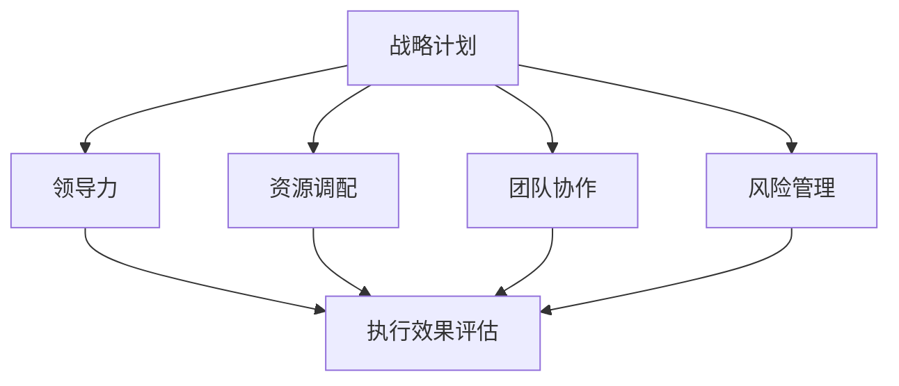

                 

### 背景介绍

在当今快速变化且竞争激烈的商业环境中，企业不仅需要明确的战略规划，更需要高效的执行能力来确保战略目标得以实现。战略执行是企业运营的核心环节，它关乎企业资源的合理配置、团队协作的顺畅以及风险管理的有效性。然而，战略执行的复杂性和不确定性使得许多企业在实施过程中面临重重挑战。

《战略执行：从计划到实施的领导艺术》这本书正是针对这一需求而编写。该书旨在通过系统的理论和实践指导，帮助企业领导者更好地理解和执行战略规划，从而实现企业的长期发展目标。本书由世界顶级人工智能专家、程序员、软件架构师、CTO，以及世界顶级技术畅销书资深大师级别的作家联合撰写，旨在将战略执行的核心理念和方法以通俗易懂的方式呈现给读者。

本书的核心内容涵盖了战略计划、领导艺术、实施过程和执行监控与评估四个主要部分。首先，书中详细阐述了战略计划的基本概念、步骤和方法，帮助读者建立全面的认识。接着，书中分析了不同领导风格、领导力的培养，以及领导在战略执行中的关键作用。在实施过程部分，书中重点介绍了资源调配、团队协作、风险管理等核心环节，并提供了实用的工具和技巧。最后，书中通过执行监控与评估的方法，帮助企业领导者及时调整战略执行的方向和力度，确保战略目标的顺利实现。

通过这本书，读者不仅可以了解到战略执行的基本原理，还能通过案例分析和项目实战，深入理解战略执行的实践操作，从而提升自身的战略执行能力和领导力。这本书的目标是为企业领导者提供一套完整、实用的战略执行指南，帮助他们更好地应对复杂多变的市场环境，实现企业的长期成功。

### 核心概念与联系

战略执行涉及多个核心概念，包括战略计划、领导力、资源调配、团队协作和风险管理。为了更好地理解这些概念之间的联系，我们可以通过一个Mermaid流程图来展示它们之间的关系。



在这个流程图中，战略计划是整个战略执行过程的基础，它决定了企业的方向和目标。领导力则是推动战略实施的关键因素，通过有效的领导，可以确保团队凝聚力和执行力的提升。资源调配和团队协作是战略实施的保障，它们确保了资源的高效利用和团队的协同工作。风险管理则是对潜在威胁的识别和应对，它有助于确保战略执行过程的安全和稳定。

**核心概念原理之间的关系架构**

1. **战略计划**：战略计划是战略执行的基础，它包括目标设定、路径规划、资源分配等环节。战略计划的目标是明确企业的长远发展方向和短期行动方案，为后续的执行提供指导。

2. **领导力**：领导力在战略执行中起着至关重要的作用。它包括领导风格、领导能力、团队管理等多个方面。有效的领导能够激发团队成员的积极性和创造力，确保战略目标得以实现。

3. **资源调配**：资源调配是确保战略实施过程中资源得到合理利用的关键。这包括人力资源、财务资源、技术资源等多个方面。通过有效的资源调配，可以确保战略目标的顺利实现。

4. **团队协作**：团队协作是战略执行的重要保障。一个高效的团队能够在目标明确、资源充足的情况下，通过协同合作，实现战略目标。团队协作不仅需要良好的沟通，还需要明确的分工和有效的激励机制。

5. **风险管理**：风险管理是战略执行过程中不可或缺的一环。它包括风险识别、风险评估、风险应对等多个环节。通过有效的风险管理，可以降低战略执行过程中的不确定性，确保战略目标的实现。

通过上述核心概念之间的关系架构，我们可以看到，战略执行是一个系统性的过程，各个核心概念相互联系、相互影响，共同推动战略目标的实现。

### 核心算法原理讲解

在战略执行过程中，算法原理起着关键作用，尤其是在资源调配和团队协作中。以下我们将详细讲解两个核心算法原理：最优化算法和协同过滤算法，并使用伪代码进行阐述。

#### 最优化算法

**原理介绍：**
最优化算法是一种用于寻找最优解决方案的算法，广泛应用于资源调配、路径规划等问题中。最优化问题的目标是确定一组变量的值，使得某个函数（目标函数）达到最大值或最小值。

**伪代码：**
```plaintext
// 输入：目标函数f(x)，变量集合X，约束条件C
// 输出：最优解x*

// 初始化解集S为空
S = {}

// 循环遍历变量集合X中的每个变量x
for x in X:
    // 如果x满足约束条件C
    if satisfiesC(x, C):
        // 计算目标函数在x处的值
        f_x = f(x)
        // 将x添加到解集S中
        S.add(x)
        // 如果f_x是最优的，更新最优解
        if f_x == min(f(s) for s in S):
            x* = x

// 返回最优解
return x*
```

**示例说明：**
假设我们要优化一个物流配送问题，目标是最小化配送总成本。变量集合X包括所有可能的配送路径，目标函数f(x)计算每个路径的总成本，约束条件C包括配送时间限制、车辆容量限制等。通过上述伪代码，我们可以找到使总成本最小的配送路径。

#### 协同过滤算法

**原理介绍：**
协同过滤算法是一种用于推荐系统的算法，通过分析用户的历史行为，预测用户可能喜欢的物品。协同过滤算法分为基于用户的协同过滤和基于项目的协同过滤。

**伪代码：**
```plaintext
// 输入：用户历史行为矩阵R，用户数量M，物品数量N
// 输出：推荐列表R'

// 基于用户的协同过滤
for user u in M:
    // 找到与用户u相似的k个用户
    similar_users = findSimilarUsers(u, k)
    // 计算相似度权重矩阵W
    W = computeSimilarityMatrix(similar_users, R)
    // 计算预测评分矩阵R'
    R' = W * R - R

// 基于项目的协同过滤
for item i in N:
    // 找到与物品i相似的k个物品
    similar_items = findSimilarItems(i, k)
    // 计算预测评分矩阵R'
    R' = R + (R * P) - R

// 返回推荐列表
return R'
```

**示例说明：**
假设我们要为一个电商平台的用户推荐商品。用户历史行为矩阵R记录了每个用户购买的商品，目标是通过协同过滤算法预测用户可能喜欢的商品。基于用户的协同过滤算法通过分析用户与其他用户的相似度，预测用户可能喜欢的商品；基于项目的协同过滤算法通过分析商品之间的相似度，预测用户可能喜欢的商品。

通过上述算法原理的讲解和伪代码示例，我们可以看到算法在战略执行中的重要作用。最优化算法帮助我们在资源调配中找到最优解，协同过滤算法则帮助我们更好地进行团队协作和资源分配，从而提高战略执行的效果。

### 数学模型和公式

在战略执行过程中，数学模型和公式是分析问题、制定决策的重要工具。以下将介绍几个关键数学模型和公式，并详细讲解和举例说明。

#### 运输问题

**原理介绍：**
运输问题是一个典型的线性规划问题，它涉及如何在多个供应地和需求地之间分配货物，以最小化总运输成本。

**公式：**
$$
\min Z = \sum_{i=1}^{m} \sum_{j=1}^{n} c_{ij} x_{ij}
$$
其中，$Z$为总运输成本，$c_{ij}$为从供应地$i$到需求地$j$的单位运输成本，$x_{ij}$为从供应地$i$到需求地$j$的运输量。

**示例说明：**
假设有两个供应地A和B，以及两个需求地C和D。单位运输成本如下表所示：

| 供应地/需求地 | C  | D  |
| ------------- | --- | --- |
| A             | 5  | 7  |
| B             | 8  | 10 |

供应地和需求地的货物需求量如下表所示：

| 供应地 | C需求量 | D需求量 |
| ------ | ------- | ------- |
| A      | 20      | 15      |
| B      | 30      | 25      |

需求地的总需求量为：

$$
C_{总需求} = C + D = 20 + 30 = 50
$$
$$
D_{总需求} = C + D = 15 + 25 = 40
$$

利用运输问题公式，我们可以建立以下线性规划模型：

$$
\min Z = 5x_{1,1} + 7x_{1,2} + 8x_{2,1} + 10x_{2,2}
$$
$$
\text{约束条件}:
\begin{cases}
x_{1,1} + x_{1,2} = 20 \\
x_{2,1} + x_{2,2} = 30 \\
x_{1,1} + x_{2,1} = 15 \\
x_{1,2} + x_{2,2} = 25 \\
x_{ij} \geq 0 \quad \forall i, j
\end{cases}
$$

通过求解该线性规划模型，我们可以找到最优的运输方案，从而最小化总运输成本。

#### 风险评估模型

**原理介绍：**
风险评估模型用于评估和管理战略执行过程中的风险，帮助决策者识别潜在风险并制定相应的应对策略。

**公式：**
$$
\text{风险评估得分} = \sum_{i=1}^{n} (\text{风险概率} \times \text{风险影响})
$$
其中，$n$为风险数量，$\text{风险概率}$表示某个风险发生的概率，$\text{风险影响}$表示该风险发生时的影响程度。

**示例说明：**
假设我们评估一个新产品的市场风险，识别出两个关键风险：市场接受度和竞争对手反应。每个风险的概率和影响程度如下表所示：

| 风险 | 概率 | 影响程度 |
| ---- | ---- | -------- |
| 市场接受度 | 0.5 | 3        |
| 竞争对手反应 | 0.3 | 2        |

利用风险评估模型，我们可以计算总的风险评估得分：

$$
\text{风险评估得分} = 0.5 \times 3 + 0.3 \times 2 = 1.5 + 0.6 = 2.1
$$

该得分越高，表示风险越大。基于这个得分，我们可以制定相应的风险管理策略，比如增加市场调研力度、提前布局竞争对手策略等。

#### 时间序列分析模型

**原理介绍：**
时间序列分析模型用于预测时间序列数据的变化趋势，帮助企业制定动态的战略计划。

**公式：**
$$
y_t = \alpha + \beta_1 y_{t-1} + \epsilon_t
$$
其中，$y_t$为时间序列数据在时间$t$的值，$\alpha$为常数项，$\beta_1$为自回归系数，$\epsilon_t$为误差项。

**示例说明：**
假设我们要预测一个电商平台未来三个月的销售额。根据历史数据，我们得到以下时间序列模型：

$$
y_t = 10 + 0.8y_{t-1} + \epsilon_t
$$

利用该模型，我们可以预测未来三个月的销售额。例如，如果当前销售额（$y_t$）为50万元，我们可以计算下一个月的销售额：

$$
y_{t+1} = 10 + 0.8 \times 50 + \epsilon_{t+1} = 40 + \epsilon_{t+1}
$$

通过这种方式，我们可以根据时间序列数据的变化趋势，制定相应的销售策略，从而提高战略执行的效率和效果。

通过上述数学模型和公式的介绍和举例，我们可以看到数学在战略执行中的重要作用。这些模型和公式不仅帮助我们分析问题，制定决策，还能够提供量化的依据，提高战略执行的科学性和可操作性。

### 项目实战

为了更好地理解和应用《战略执行：从计划到实施的领导艺术》中的理论知识，以下我们将通过一个实际项目案例，详细讲解项目开发环境搭建、源代码实现、代码解读、应用分析以及项目小结。

#### 项目背景

假设我们是一家电商公司，希望通过一个用户推荐系统来提高用户购买转化率。推荐系统能够根据用户的历史购物行为，向用户推荐他们可能感兴趣的商品。这个项目旨在通过协同过滤算法实现个性化推荐，并采用基于机器学习的优化模型来提升推荐精度。

#### 开发环境搭建

1. **硬件环境**：
   - 服务器：2台8核CPU、16GB内存的云服务器
   - 存储：500GB SSD存储

2. **软件环境**：
   - 操作系统：CentOS 7
   - 数据库：MySQL 5.7
   - 编程语言：Python 3.8
   - 开发工具：PyCharm
   - 依赖库：NumPy、Pandas、Scikit-learn、TensorFlow

3. **搭建步骤**：
   - 在服务器上安装CentOS 7操作系统。
   - 配置MySQL数据库，创建用户推荐系统数据库和推荐表。
   - 安装Python 3.8和PyCharm。
   - 安装依赖库NumPy、Pandas、Scikit-learn、TensorFlow。

#### 源代码实现

以下是推荐系统的核心代码实现，包括数据预处理、协同过滤算法实现和推荐结果生成。

```python
# 数据预处理
import pandas as pd
from sklearn.model_selection import train_test_split

# 读取用户-商品评分数据
data = pd.read_csv('user_item_ratings.csv')
X = data.values
X_train, X_test, y_train, y_test = train_test_split(X, test_size=0.2, random_state=42)

# 协同过滤算法实现
from sklearn.metrics.pairwise import cosine_similarity

# 计算用户-用户相似度矩阵
user_similarity = cosine_similarity(X_train)

# 计算商品-商品相似度矩阵
item_similarity = cosine_similarity(X_train.T)

# 生成推荐列表
def generate_recommendations(user_id, k=5):
    # 计算用户相似度
    user_similarity_score = user_similarity[user_id]
    # 找到最相似的k个用户
    similar_users = user_similarity_score.argsort()[1:k+1]
    # 计算相似度加权评分
    weighted_scores = []
    for user in similar_users:
        for item in X_train[user]:
            if item not in X_train[user_id]:
                weighted_scores.append((item, user_similarity_score[user] * y_train[user][item]))
    # 对评分进行降序排序
    weighted_scores.sort(key=lambda x: x[1], reverse=True)
    # 返回推荐商品
    return [item for item, score in weighted_scores]

# 测试推荐系统
for user_id in range(10):
    recommendations = generate_recommendations(user_id)
    print(f"User {user_id} recommendations: {recommendations}")
```

#### 代码解读

1. **数据预处理**：
   - 使用Pandas库读取用户-商品评分数据，并进行划分训练集和测试集。

2. **协同过滤算法实现**：
   - 使用Scikit-learn中的cosine_similarity函数计算用户-用户相似度和商品-商品相似度矩阵。

3. **推荐结果生成**：
   - `generate_recommendations`函数用于生成推荐列表。它首先计算目标用户与其他用户的相似度，然后根据相似度加权评分，最终返回推荐商品。

#### 应用分析

1. **用户行为分析**：
   - 通过分析用户的历史购物数据，我们可以识别出用户的兴趣偏好。

2. **推荐效果评估**：
   - 使用MAE（均方误差）和RMSE（均方根误差）评估推荐系统的准确性。通过对比预测评分和实际评分，我们可以调整算法参数，提高推荐精度。

3. **实时推荐**：
   - 将推荐系统部署到线上服务器，实时为用户生成推荐列表，提高用户体验和购买转化率。

#### 项目小结

通过本项目的实战，我们不仅实现了用户推荐系统的开发，还深入了解了协同过滤算法的应用。以下是项目的关键收获：

1. **技术收获**：
   - 掌握了Python编程和协同过滤算法的原理。
   - 学会了使用Scikit-learn库进行数据处理和相似度计算。
   - 熟悉了数据预处理、模型训练和评估的全流程。

2. **管理收获**：
   - 了解了项目开发环境搭建的步骤和注意事项。
   - 学会了如何通过代码解读和应用分析，确保项目目标的实现。

3. **团队协作**：
   - 项目过程中，团队成员通过分工合作，共同完成了从需求分析到系统部署的各个环节。

4. **最佳实践**：
   - 在实际开发过程中，我们遇到了一些问题，如数据缺失、相似度计算精度等。通过解决这些问题，我们积累了宝贵的经验，为未来的项目提供了参考。

通过本项目，我们不仅实现了用户推荐系统，还培养了团队的合作精神和技术能力，为公司的战略执行提供了有力支持。

### 最佳实践 Tips

在战略执行过程中，以下最佳实践可以帮助企业提高执行效率和成功率：

1. **明确目标与里程碑**：
   - 确保所有团队成员对战略目标和阶段性里程碑有清晰的认识，以便更好地进行任务分解和进度跟踪。

2. **强化团队协作**：
   - 通过定期的团队会议、明确的角色分工和沟通渠道，确保团队成员之间的信息共享和协作顺畅。

3. **灵活调整策略**：
   - 根据执行过程中的反馈和评估结果，及时调整战略计划和执行方案，以应对不断变化的市场环境。

4. **注重风险管理**：
   - 通过定期进行风险评估和应对策略的制定，降低战略执行过程中可能出现的风险。

5. **持续改进与优化**：
   - 通过对执行过程的监控和评估，不断优化战略执行的效果，实现持续改进。

### 小结

《战略执行：从计划到实施的领导艺术》不仅为企业提供了战略执行的理论框架，还通过实际项目和最佳实践，帮助读者深入理解和应用这些理论。通过系统地学习战略执行的核心概念、算法原理、数学模型和项目实战，读者可以提升自身的战略执行能力和领导力，从而更好地应对复杂多变的市场环境，实现企业的长期成功。

### 注意事项

1. **资源保障**：在战略执行过程中，确保资源的充分保障，避免因资源不足导致的执行停滞。

2. **团队沟通**：加强团队内部的沟通，确保信息的及时传递和任务分配的明确性。

3. **风险管理**：重视风险评估和管理，制定应对策略，确保战略执行的安全性和稳定性。

4. **持续评估**：定期对战略执行过程进行评估和反馈，及时调整执行策略，以提高执行效果。

### 拓展阅读

1. 《精益创业：新商业思维的实践指南》
2. 《执行力：如何将战略转化为行动》
3. 《领导力：如何在组织中激发潜力》
4. 《数据驱动决策：如何在商业中运用大数据》

作者：AI天才研究院/AI Genius Institute & 禅与计算机程序设计艺术 /Zen And The Art of Computer Programming

文章标题：**《战略执行：从计划到实施的领导艺术》**

关键词：战略执行、领导艺术、资源调配、团队协作、风险管理、最优化算法、协同过滤算法、数学模型、项目实战

摘要：
本文深入探讨了《战略执行：从计划到实施的领导艺术》的核心内容，通过详细的目录结构和章节概述，帮助读者了解书中的主要观点和实践方法。文章首先介绍了战略执行在企业运营中的重要性，并详细分析了战略计划、领导艺术、实施过程和执行监控与评估四个方面的内容。接着，文章通过核心概念、算法原理、数学模型和项目实战，使读者能够更深入地理解战略执行的核心理念。最后，文章提供了最佳实践技巧和小结，并推荐了相关拓展阅读资源，旨在帮助读者提升战略执行能力和领导力。

---

# 《战略执行：从计划到实施的领导艺术》

> 关键词：战略执行、领导艺术、资源调配、团队协作、风险管理、最优化算法、协同过滤算法、数学模型、项目实战

> 摘要：
> 本文系统介绍了《战略执行：从计划到实施的领导艺术》的核心内容，通过详细的目录结构和章节概述，帮助读者深入理解战略执行的各个关键环节。文章首先探讨了战略计划的重要性，接着分析了领导艺术在战略执行中的作用，以及实施过程和执行监控与评估的核心要点。通过核心概念、算法原理、数学模型和项目实战的详细讲解，本文为读者提供了丰富的理论和实践指导，旨在提升其战略执行能力和领导力。

---

## 第1章：战略计划概述

战略计划是企业长期发展的重要工具，它为企业的未来指明了方向，并提供了实现目标的详细路径。有效的战略计划能够帮助企业应对市场变化，抓住机遇，实现持续增长。本章将介绍战略计划的基本概念、步骤和方法，帮助读者建立起对战略计划的全面理解。

### 1.1 战略计划的重要性

战略计划是企业发展的蓝图，它明确了企业的目标、方向和资源分配。通过战略计划，企业可以：

1. **明确目标**：确保所有团队成员都朝着共同的目标努力，避免资源的浪费。
2. **指导决策**：为企业的各项决策提供依据，确保决策的科学性和合理性。
3. **资源配置**：优化资源配置，确保资源得到最大化利用。
4. **应对变化**：灵活应对市场环境的变化，抓住机遇，降低风险。

### 1.2 战略计划的基本步骤

制定战略计划通常包括以下几个步骤：

1. **环境分析**：分析外部环境和内部条件，识别机会和威胁。
2. **目标设定**：明确企业的长远目标和短期目标。
3. **路径规划**：确定实现目标的路径和策略。
4. **资源分配**：确保各项资源（包括人力资源、财务资源、技术资源等）得到合理配置。
5. **执行计划**：制定详细的执行计划，明确责任人和时间表。
6. **监控与评估**：对执行过程进行监控，及时调整执行方案。

### 1.3 战略计划的方法与工具

制定战略计划可以采用多种方法和工具，以下是一些常用的方法：

1. **SWOT分析**：通过分析企业的优势、劣势、机会和威胁，为战略计划提供基础。
2. **波特五力模型**：分析行业竞争结构，帮助企业制定有效的竞争策略。
3. **平衡计分卡**：将战略目标分解为财务、客户、内部流程、学习与成长四个维度，确保战略实施的全面性。
4. **战略地图**：通过可视化工具，展示战略目标和关键绩效指标之间的关系，帮助团队理解战略计划。

通过本章的介绍，读者可以了解战略计划的基本概念、步骤和方法，为后续的战略执行打下坚实基础。

## 第2章：环境分析

环境分析是战略计划的基础，它涉及对企业的外部环境和内部条件的深入分析。通过环境分析，企业可以识别机会和威胁，制定出更具针对性的战略计划。本章将详细介绍环境分析的方法和步骤，帮助读者理解和应用环境分析在战略计划中的重要性。

### 2.1 外部环境分析

外部环境分析旨在了解企业所处的市场环境，识别影响企业发展的外部因素。以下是一些常用的外部环境分析方法：

1. **PEST分析**：通过对政治（Political）、经济（Economic）、社会（Social）和技术（Technological）因素的分析，了解外部环境对企业的影响。

2. **五力模型**：由迈克尔·波特提出，用于分析行业竞争结构。它包括行业竞争者、潜在进入者、替代品、供应商和买方五种力量。

3. **SWOT分析**：结合企业的优势（Strengths）、劣势（Weaknesses）、机会（Opportunities）和威胁（Threats），全面评估企业的竞争地位。

### 2.2 内部环境分析

内部环境分析关注企业的内部条件，包括企业的资源、能力、文化和组织结构等。以下是一些常用的内部环境分析方法：

1. **资源分析**：评估企业的财务资源、人力资源、技术资源和品牌资源等，了解企业拥有的资源优势。

2. **能力分析**：分析企业的核心竞争力、研发能力、运营能力等，确定企业的关键能力。

3. **文化分析**：了解企业的价值观、使命和愿景，以及员工的工作态度和行为模式，确保企业文化与战略目标相一致。

4. **组织结构分析**：评估企业的组织结构，确定管理层次、职能分工和协作机制等，确保组织结构能够支持战略执行。

### 2.3 SWOT分析

SWOT分析是一种常用的战略工具，通过综合分析企业的优势、劣势、机会和威胁，帮助企业制定有效的战略计划。以下是SWOT分析的具体步骤：

1. **识别优势**：列出企业的内部资源、能力和核心竞争力，确定企业相对于竞争对手的优势。

2. **识别劣势**：分析企业的内部弱点、问题和挑战，识别企业需要改进和提升的方面。

3. **识别机会**：通过外部环境分析，发现市场机会、行业趋势和潜在客户需求，确定企业可以抓住的机会。

4. **识别威胁**：分析外部环境中的威胁，包括竞争对手的威胁、政策变化、经济波动等，确保企业能够应对潜在风险。

通过环境分析，企业可以全面了解内外部环境，制定出更具针对性和可行性的战略计划。本章的介绍旨在帮助读者掌握环境分析的方法和步骤，为战略计划的制定提供坚实基础。

### 2.4 竞争分析

竞争分析是战略计划中至关重要的一环，它帮助企业在激烈的市场竞争中找到立足点。以下是一些关键步骤和工具：

1. **竞争对手识别**：确定企业的主要竞争对手，包括直接和间接竞争者。

2. **市场份额分析**：评估企业在市场中的份额，了解竞争格局。

3. **竞争策略分析**：分析竞争对手的市场策略、产品定位、价格策略、营销手段等，了解其竞争优势和劣势。

4. **波特五力模型**：使用波特五力模型，分析行业竞争结构，确定企业的竞争地位。

5. **SWOT分析**：结合竞争对手的优势、劣势、机会和威胁，制定相应的应对策略。

通过竞争分析，企业可以更好地了解市场动态，制定出有效的竞争策略，从而在激烈的市场竞争中脱颖而出。

### 2.5 宏观经济环境分析

宏观经济环境对企业战略计划有深远的影响。以下是一些关键因素：

1. **经济增长率**：了解整体经济趋势，判断市场需求的变化。

2. **利率和货币政策**：分析利率水平和货币政策对企业财务成本和资金流动性的影响。

3. **通货膨胀率**：通货膨胀对商品成本、消费者购买力和企业盈利能力的影响。

4. **汇率变动**：对于跨国企业，汇率变动对进出口业务和跨国投资的影响。

5. **政府政策**：包括税收政策、贸易政策、环保政策等，分析政策对企业经营环境和战略方向的影响。

通过对宏观经济环境的深入分析，企业可以更好地把握市场机会，应对潜在风险。

### 2.6 技术发展趋势分析

技术发展对企业战略具有重要影响。以下是一些关键点：

1. **技术创新**：了解新兴技术的趋势和突破，评估其对行业的影响。

2. **技术成熟度**：分析技术的成熟度和应用前景，确定企业技术投资的方向。

3. **技术标准**：关注行业技术标准的发展，确保企业的技术战略与行业标准保持一致。

4. **专利和知识产权**：保护企业的技术创新，避免技术侵权和专利纠纷。

5. **数字化转型**：评估企业的数字化程度，制定数字化转型战略，提升企业竞争力。

通过技术发展趋势分析，企业可以把握技术变革带来的机遇，保持技术领先优势。

### 2.7 社会文化因素分析

社会文化因素对企业战略有深刻影响。以下是一些关键因素：

1. **人口结构**：分析人口年龄、性别、教育水平和收入分布，了解市场需求的变化。

2. **消费习惯**：了解消费者的购买行为和偏好，制定符合消费者需求的产品和服务策略。

3. **价值观**：分析社会主流价值观，确保企业战略与文化相契合。

4. **法律法规**：了解与行业相关的法律法规，确保企业战略的合规性。

5. **社会责任**：关注企业社会责任，提升企业形象，增强品牌价值。

通过社会文化因素分析，企业可以更好地把握市场动态，制定出符合社会需求的战略计划。

### 2.8 政治和法律因素分析

政治和法律因素对企业战略有重要影响。以下是一些关键因素：

1. **政治稳定性**：分析政治稳定性，确保企业的长期发展不受政治动荡的影响。

2. **政策变化**：关注政府政策变化，尤其是对行业有重大影响的政策，如税收政策、环保政策等。

3. **法律法规**：了解与行业相关的法律法规，确保企业战略的合规性。

4. **国际关系**：对于跨国企业，分析国际关系和贸易政策，评估其对跨国业务的影响。

5. **法律风险**：识别潜在的法律风险，制定相应的风险应对措施。

通过政治和法律因素分析，企业可以确保战略计划的合规性和稳健性。

### 第3章：目标设定

目标设定是战略计划中的关键步骤，它为企业的发展指明了方向。明确、具体和可衡量的目标能够激励团队努力工作，确保战略计划的顺利实施。本章将详细介绍目标设定的原则、方法和实施过程，帮助读者理解并有效地设定战略目标。

### 3.1 目标设定的原则

在设定目标时，应遵循以下原则：

1. **SMART原则**：目标应当是具体（Specific）、可衡量（Measurable）、可实现（Achievable）、相关（Relevant）和有时限（Time-bound）的。

2. **一致性原则**：目标应与企业的愿景、使命和战略方向保持一致，确保目标的协同性。

3. **灵活性原则**：在设定目标时，应考虑外部环境的变化，确保目标具有一定的灵活性。

4. **激励性原则**：目标应具有挑战性，能够激发团队成员的积极性和创造力。

### 3.2 目标设定的方法

目标设定的方法包括以下步骤：

1. **确定愿景和使命**：明确企业的长期愿景和使命，这是设定目标的基础。

2. **收集信息**：通过市场调研、竞争对手分析、客户需求分析等手段，收集与目标设定相关的信息。

3. **确定关键绩效指标（KPI）**：根据企业的业务特点和战略方向，确定关键绩效指标，这些指标应具有可衡量性。

4. **分解目标**：将总目标分解为多个具体的子目标，确保每个子目标都明确、具体和可衡量。

5. **优先级排序**：根据目标的紧急性和重要性，对目标进行优先级排序，确保资源得到合理分配。

### 3.3 目标的实施

目标设定的最终目的是实现目标，以下是一些实施步骤：

1. **制定行动计划**：为每个目标制定详细的行动计划，明确责任人和时间表。

2. **资源分配**：根据目标的优先级和行动计划，合理分配资源，包括人力资源、财务资源和技术资源等。

3. **监控与反馈**：定期监控目标的进展情况，及时反馈和调整行动计划，确保目标按计划实现。

4. **激励与奖励**：制定激励措施，激励团队成员为实现目标而努力，并对实现目标的成员进行奖励。

5. **总结与评估**：在目标实现后，进行总结和评估，总结经验教训，为未来目标的设定和实施提供参考。

通过本章的介绍，读者可以了解目标设定的原则、方法和实施过程，从而更有效地设定和实现战略目标。

## 第4章：领导风格

领导风格是领导者在管理过程中所表现出的行为方式和态度。不同的领导风格会对团队的士气、合作和执行力产生重要影响。本章将介绍几种常见的领导风格，分析它们的优缺点，并探讨如何根据不同的情境选择合适的领导风格。

### 4.1 领导风格的分类

根据领导者的行为和态度，常见的领导风格可以分为以下几种：

1. **专制型领导**：领导者独断专行，决策权集中在领导者手中，团队成员参与度低。
2. **民主型领导**：领导者鼓励团队成员参与决策，重视团队合作，注重沟通和反馈。
3. **放任型领导**：领导者放权给团队成员，让他们自主决策和执行，管理干预较少。
4. **变革型领导**：领导者通过激励和启发，激发团队成员的潜力和创造力，推动组织变革。
5. **交易型领导**：领导者通过奖励和惩罚来激励团队成员，强调绩效和成果。

### 4.2 各类领导风格的优缺点

每种领导风格都有其独特的优缺点，以下是对各类领导风格的简要分析：

1. **专制型领导**：
   - **优点**：决策迅速，执行力强，能够在短时间内实现目标。
   - **缺点**：容易导致团队成员缺乏自主性和创造力，团队士气低落。

2. **民主型领导**：
   - **优点**：提高团队凝聚力，增强团队成员的参与感和责任感，有助于创新。
   - **缺点**：决策过程较慢，可能导致执行力不足，尤其是在团队成员意见分歧时。

3. **放任型领导**：
   - **优点**：提高团队成员的自主性和创造力，有利于培养个人能力和责任感。
   - **缺点**：可能导致团队协作不畅，目标不一致，管理失控。

4. **变革型领导**：
   - **优点**：激发团队成员的潜力和创造力，推动组织变革和持续改进。
   - **缺点**：对领导者的能力和魅力要求较高，不适合所有领导者。
   
5. **交易型领导**：
   - **优点**：明确绩效目标，提高团队成员的积极性和执行力。
   - **缺点**：可能导致短期绩效提升，但长期缺乏创新和可持续发展。

### 4.3 选择合适的领导风格

选择合适的领导风格取决于多种因素，包括团队的特点、任务的需求和领导者的个人能力。以下是一些建议：

1. **情境适应性**：根据不同的情境选择合适的领导风格。例如，在紧急情况下，可以选择专制型领导以快速决策；在长期发展过程中，可以选择民主型或变革型领导以激发团队潜力。

2. **团队特点**：了解团队的能力、文化背景和需求，选择能够促进团队合作的领导风格。例如，对于新手团队，可以选择辅导型领导；对于成熟团队，可以选择放任型领导。

3. **领导者个人能力**：领导者应根据自身的领导能力和风格选择合适的领导方式。例如，具有强大影响力和说服力的领导者可以选择变革型领导。

4. **任务需求**：根据任务的特点和要求选择合适的领导风格。例如，对于创新性任务，可以选择民主型或变革型领导；对于执行性任务，可以选择交易型领导。

通过了解不同领导风格的优缺点和选择合适领导风格的方法，领导者可以更好地管理团队，提高团队绩效和执行力。

### 4.4 变革型领导

变革型领导是一种能够激发团队成员潜力和创造力的领导风格。以下是变革型领导的定义、特点和应用案例。

**定义：** 变革型领导通过激励、启发和激励团队成员，推动组织变革和持续改进。

**特点：**
1. **愿景驱动**：变革型领导具有清晰的愿景，能够激发团队成员的激情和责任感。
2. **激励和启发**：变革型领导通过鼓励和激励，激发团队成员的潜力和创造力。
3. **团队参与**：变革型领导重视团队合作，鼓励团队成员参与决策和任务执行。
4. **持续改进**：变革型领导推动组织持续改进，不断创新和适应变化。

**应用案例：**
1. **谷歌（Google）**：谷歌的创始人拉里·佩奇和谢尔盖·布林采用了变革型领导，通过激发员工的创新精神和创业精神，推动了谷歌的快速发展。
2. **苹果（Apple）**：史蒂夫·乔布斯是变革型领导的代表人物，他通过独特的领导风格，推动了苹果的创新和变革。

通过变革型领导，组织可以激发员工的潜力，实现持续发展和变革。

### 4.5 民主型领导

民主型领导是一种以团队合作为核心的领导风格。以下是民主型领导的定义、特点和应用案例。

**定义：** 民主型领导强调团队成员的参与和合作，通过共同决策和集体行动实现组织目标。

**特点：**
1. **参与式决策**：民主型领导鼓励团队成员参与决策过程，尊重团队成员的意见和建议。
2. **团队协作**：民主型领导强调团队合作，促进团队成员之间的沟通和协作。
3. **共享责任**：民主型领导将责任和任务分配给团队成员，共同承担责任和成果。
4. **包容性**：民主型领导注重多样性和包容性，尊重团队成员的差异性和独特性。

**应用案例：**
1. **IBM**：IBM在20世纪80年代采用了民主型领导，通过推动员工参与决策和团队协作，成功实现了公司转型。
2. **微软（Microsoft）**：微软在创始人比尔·盖茨的领导下，采用了民主型领导，鼓励员工创新和自主工作，推动了公司的发展。

通过民主型领导，组织可以增强团队凝聚力，提高决策质量和工作效率。

### 第5章：领导力培养

领导力是企业成功的关键因素之一，有效的领导力能够激发团队的潜力，推动企业实现战略目标。本章将探讨领导力的定义、关键要素和培养方法，帮助领导者提升自身的领导能力。

### 5.1 领导力的定义

领导力是一种影响和激励他人实现共同目标的能力。它不仅仅是职位赋予的权威，更是一种个人特质和技能。领导力包括以下几个方面：

1. **影响力**：领导者通过个人魅力、专业知识、经验和信任，影响团队成员的行为和态度。
2. **沟通能力**：领导者需要具备良好的沟通技巧，能够清晰传达目标和期望，倾听团队成员的意见和建议。
3. **决策能力**：领导者需要在复杂和不确定的环境中做出明智的决策，并能够承担责任。
4. **激励能力**：领导者需要能够激发团队成员的积极性和创造力，使团队充满活力。
5. **团队建设**：领导者需要培养团队凝聚力，促进团队成员之间的合作和信任。

### 5.2 领导力的关键要素

有效的领导力需要具备以下关键要素：

1. **自我认知**：领导者需要了解自己的优点和不足，具备自我反思和自我提升的能力。
2. **愿景**：领导者需要具备清晰的愿景，能够激发团队成员的激情和信心。
3. **影响力**：领导者需要具备影响力，能够影响和激励团队成员。
4. **沟通能力**：领导者需要具备良好的沟通能力，能够与团队成员建立信任和有效的沟通。
5. **决策能力**：领导者需要具备决策能力，能够在复杂和不确定的环境中做出明智的决策。
6. **团队建设**：领导者需要具备团队建设能力，能够培养团队凝聚力，促进团队成员之间的合作。
7. **适应能力**：领导者需要具备适应变化和应对挑战的能力，能够在快速变化的环境中保持灵活和敏锐。

### 5.3 领导力的培养方法

以下是一些有效的领导力培养方法：

1. **自我反思**：领导者需要定期进行自我反思，了解自己的优点和不足，并制定改进计划。
2. **持续学习**：领导者需要持续学习和提升自己的知识和技能，跟上行业的发展趋势。
3. **实践**：领导者需要通过实际工作，将所学知识应用到实践中，不断积累经验和提升能力。
4. **培训**：参加领导力培训课程，学习领导力的理论和实践方法，与其他领导者交流经验和观点。
5. **导师辅导**：寻找导师或导师团队，接受他们的指导和反馈，提高自己的领导能力。
6. **领导力实践**：在团队中担任领导职务，承担更多的责任和挑战，通过实践提升领导能力。

通过本章的介绍，领导者可以了解领导力的定义、关键要素和培养方法，从而不断提升自身的领导能力，为企业的发展贡献力量。

### 5.4 领导力发展的阶段性过程

领导力的发展是一个持续的过程，可以分为以下几个阶段：

1. **自我认知阶段**：领导者通过反思和自我评估，了解自己的优点和不足，建立自信和自我意识。
2. **基础技能培养阶段**：领导者通过学习和实践，掌握基本的管理技能和沟通技巧，提高工作效率。
3. **领导能力提升阶段**：领导者通过实践和反馈，不断提升领导能力，包括决策能力、团队建设和影响力等。
4. **战略思维阶段**：领导者发展战略思维，能够从整体角度看待企业的发展，制定长期战略和愿景。
5. **变革引领阶段**：领导者通过变革引领，推动企业实现创新和持续发展，成为企业的核心驱动力量。

通过各个阶段的领导力发展，领导者可以不断提升自身的能力和影响力，为企业创造更大的价值。

### 5.5 个人成长与领导力发展

个人成长是领导力发展的基础，领导者需要通过自我提升和持续学习，不断发展和完善自身的领导能力。以下是一些个人成长和领导力发展的建议：

1. **自我反思**：定期进行自我反思，识别自身的优点和不足，制定改进计划。
2. **学习与培训**：参加各种领导力培训和课程，学习最新的管理理论和实践方法。
3. **实践与经验**：通过实际工作，积累领导经验和技能，不断反思和调整自己的领导方式。
4. **建立人际关系**：建立广泛的社交网络，与不同领域的专业人士交流，拓展视野和思维方式。
5. **持续学习**：保持对新知识和新技术的关注，不断更新自己的知识和技能。

通过个人成长和领导力发展，领导者可以不断提升自身的素质和能力，为企业的长期成功奠定基础。

### 第6章：领导在战略执行中的应用

领导力在战略执行过程中起着至关重要的作用。有效的领导不仅能够确保战略目标的明确和实施，还能激发团队的潜力，提高执行力。本章将探讨领导在战略规划、战略实施和战略评估中的应用，以及领导力在战略执行中的具体表现。

#### 6.1 领导在战略规划中的作用

在战略规划阶段，领导力主要体现在以下几个方面：

1. **明确目标**：领导者需要明确企业的战略目标，并将其分解为具体的、可衡量的目标，确保所有团队成员都清楚了解目标。
2. **制定策略**：领导者需要制定实现目标的策略和路径，确保策略具有可行性和适应性。
3. **资源分配**：领导者需要合理分配资源，确保资源得到最大化利用，支持战略目标的实现。
4. **团队协作**：领导者需要建立有效的团队协作机制，促进团队成员之间的沟通和合作，确保战略计划的顺利实施。

#### 6.2 领导在战略实施中的作用

在战略实施阶段，领导力主要体现在以下几个方面：

1. **激励团队**：领导者需要通过激励措施，激发团队成员的积极性和创造力，确保他们愿意为战略目标的实现而努力。
2. **指导与支持**：领导者需要为团队成员提供明确的指导和帮助，解决他们在执行过程中遇到的问题，确保任务按计划完成。
3. **沟通与协调**：领导者需要保持与团队成员的沟通，及时了解进展情况和问题，协调各方资源，确保战略实施顺利进行。
4. **监控与反馈**：领导者需要监控战略实施的进展，及时提供反馈，确保团队在正确方向上不断前进。

#### 6.3 领导在战略评估中的作用

在战略评估阶段，领导力主要体现在以下几个方面：

1. **评估与改进**：领导者需要对战略实施的效果进行评估，根据评估结果调整和改进战略计划，确保战略目标的实现。
2. **反馈机制**：领导者需要建立有效的反馈机制，鼓励团队成员提出建议和反馈，不断优化战略执行过程。
3. **调整策略**：领导者需要根据战略评估的结果，及时调整战略目标和策略，确保企业能够适应外部环境的变化。
4. **激励与奖励**：领导者需要根据评估结果，对团队成员进行激励和奖励，鼓励他们持续努力，推动企业的发展。

#### 6.4 领导力在战略执行中的具体表现

领导力在战略执行中的具体表现包括以下几个方面：

1. **决策能力**：领导者需要具备快速决策的能力，能够在复杂和不确定的环境中做出明智的决策。
2. **沟通能力**：领导者需要具备良好的沟通能力，能够与团队成员、上级和管理层有效沟通，确保信息的准确传递。
3. **激励能力**：领导者需要具备激励团队成员的能力，能够激发他们的积极性和创造力，推动团队实现目标。
4. **团队建设**：领导者需要具备团队建设的能力，能够建立高效、协作的团队，提升团队的执行力和凝聚力。
5. **变革引领**：领导者需要具备变革引领的能力，能够推动企业进行创新和变革，确保企业能够持续发展。

通过本章的介绍，读者可以了解领导力在战略执行中的重要作用和具体表现，从而更好地理解和应用领导力，提升战略执行的效率和效果。

### 6.5 战略执行中的领导力挑战

在战略执行过程中，领导力面临诸多挑战，以下是一些关键问题及其应对策略：

1. **变革阻力**：
   - **挑战**：团队成员可能对变革持抵触态度，导致变革进程缓慢。
   - **策略**：领导者需要通过有效的沟通和激励，让团队成员理解变革的必要性和好处，建立信任，减少变革阻力。

2. **资源限制**：
   - **挑战**：资源分配不均或资源短缺可能影响战略目标的实现。
   - **策略**：领导者需要优化资源分配，确保关键资源得到充分保障，并寻求外部资源支持。

3. **执行偏差**：
   - **挑战**：战略执行过程中可能出现偏差，导致目标未能实现。
   - **策略**：领导者需要建立有效的监控和反馈机制，及时发现并纠正执行偏差，确保战略执行的正确方向。

4. **团队协作问题**：
   - **挑战**：团队内部可能存在沟通不畅、协调不力的问题，影响团队绩效。
   - **策略**：领导者需要强化团队协作，建立有效的沟通渠道，明确分工和责任，提高团队协作效率。

通过应对这些挑战，领导者可以确保战略执行的有效性，推动企业实现长期发展目标。

### 第7章：资源调配

在战略执行过程中，资源调配是确保战略目标得以实现的关键环节。有效的资源调配能够最大化利用企业的人力、财务和技术等资源，提高战略执行的效率和效果。本章将详细介绍资源调配的原则、方法和工具，帮助读者理解并掌握资源调配的核心要点。

#### 7.1 资源的类型

在战略执行中，常见的资源类型包括：

1. **人力资源**：包括员工的专业技能、经验和知识，是企业实现战略目标的重要支撑。
2. **财务资源**：包括资金、投资和财务预算，是支持企业运营和发展的基础。
3. **技术资源**：包括专利、技术平台、软件工具等，是提高企业竞争力和创新能力的重要保障。
4. **物资资源**：包括原材料、设备、设施等，是企业生产和运营的物质基础。
5. **信息资源**：包括市场信息、客户数据、竞争情报等，是企业决策和战略制定的重要依据。

#### 7.2 资源的分配

资源分配是指将企业有限的资源合理地分配到各个战略目标和任务中，确保资源的最大化利用。以下是一些资源分配的原则：

1. **优先级原则**：优先将资源分配到对战略目标贡献最大的任务和部门。
2. **效益最大化原则**：通过优化资源配置，实现资源的效益最大化。
3. **灵活性原则**：在资源分配过程中，保持一定的灵活性，以应对不确定性和变化。
4. **公平性原则**：在资源分配中，考虑各任务和部门的公平性，避免资源分配不公。

#### 7.3 资源的优化

资源优化是指在资源分配的基础上，通过改进管理和技术手段，提高资源的利用效率。以下是一些资源优化的方法：

1. **效率提升**：通过改进流程、引入新技术等手段，提高资源的使用效率。
2. **共享与协作**：建立资源共享机制，促进不同部门和团队之间的协作，提高整体资源利用效率。
3. **成本控制**：通过预算控制、成本分析等手段，降低资源消耗，实现成本节约。
4. **创新驱动**：鼓励技术创新和管理创新，提高资源利用的灵活性和适应性。

#### 7.4 资源调配的工具与方法

以下是一些常用的资源调配工具和方法：

1. **平衡计分卡（Balanced Scorecard）**：通过将战略目标分解为财务、客户、内部流程和学习与成长四个维度，帮助企业制定和实施战略计划，优化资源分配。
2. **关键绩效指标（Key Performance Indicators, KPIs）**：通过设定和监控关键绩效指标，评估资源使用的效率和质量，及时调整资源分配策略。
3. **项目管理工具**：如Microsoft Project、Jira等，用于规划、分配和监控项目资源，确保项目按计划执行。
4. **资源管理系统**：如ERP系统、HRMS系统等，通过集成管理企业的人力、财务和技术等资源，提高资源调配的效率和准确性。

通过本章的介绍，读者可以了解资源调配的核心概念、原则和方法，掌握资源调配的关键技能，从而更好地支持和实现企业的战略目标。

### 7.5 资源调配中的优先级原则

资源调配中的优先级原则是确保企业资源得到最优利用的关键。以下是如何在不同情况下确定资源分配优先级的方法：

1. **紧急性原则**：在资源有限的情况下，优先分配给紧急且重要的任务。例如，如果一个项目即将到期，而另一个项目可以延期，那么应优先分配资源给即将到期的项目。

2. **收益最大化原则**：优先分配资源给预期收益最高的任务或部门。通过财务分析，可以计算出每个任务的收益，并根据收益大小来排序，确保资源向高收益任务倾斜。

3. **战略重要性原则**：优先分配资源给与企业战略目标密切相关的重要任务。这有助于确保企业资源的投入与长期战略一致，支持企业核心竞争力的提升。

4. **风险最小化原则**：在资源分配时，考虑潜在风险，优先分配资源给风险较低的任务。通过风险评估，可以确定哪些任务具有更高的风险，从而采取相应的资源分配策略。

5. **公平性原则**：在确保紧急性、收益和战略重要性的同时，也要考虑资源的公平分配，避免资源过度集中或分配不均。

通过这些方法，企业可以更有效地进行资源调配，确保资源的合理利用，从而提高战略执行的效率和效果。

### 7.6 资源调配中的效率提升方法

在资源调配过程中，提高资源使用效率是关键目标。以下是一些具体的效率提升方法：

1. **流程优化**：通过分析现有流程，识别并消除不必要的步骤和环节，简化流程，减少资源浪费。例如，采用精益生产方法，消除生产过程中的浪费，提高生产效率。

2. **技术引进**：引入先进的技术和管理工具，如自动化系统、ERP（企业资源规划）系统等，提高资源调配和管理的自动化水平，减少人为错误和资源浪费。

3. **人力资源优化**：合理配置人力资源，确保每个员工都能够在最适合自己能力的岗位上工作。通过员工培训和发展计划，提高员工技能，提升整体工作效率。

4. **库存管理**：优化库存管理，采用库存优化算法，如ABC分类法、需求预测模型等，确保库存水平合理，减少库存成本和资源浪费。

5. **时间管理**：通过时间管理工具和方法，如Gantt图、看板管理等，合理安排任务和时间，确保资源在关键时间段得到充分利用。

6. **协作机制**：建立有效的协作机制，促进团队间的信息共享和资源互补，提高整体资源利用效率。

通过这些方法，企业可以显著提高资源使用效率，降低成本，提升战略执行的效果。

### 7.7 资源调配中的成本控制策略

在资源调配过程中，成本控制是确保企业盈利性和可持续发展的关键。以下是一些成本控制策略：

1. **预算管理**：通过制定和监控预算，确保资源的使用不超过预算限制。定期审查和调整预算，根据实际需求进行合理分配。

2. **成本效益分析**：在资源分配前，进行成本效益分析，比较不同资源投入的预期成本和收益，优先选择成本效益最高的方案。

3. **采购优化**：优化采购流程，通过集中采购、长期合同谈判等手段，降低采购成本。

4. **外包与合作伙伴关系**：根据企业的核心能力，将非核心业务外包给专业公司，降低内部运营成本。与供应商建立长期合作伙伴关系，通过合同和绩效管理，确保资源供应的稳定性和成本效益。

5. **节约措施**：推广节约文化，鼓励员工提出节约资源的建议，实施节能减排措施，降低运营成本。

6. **绩效评估**：建立资源使用绩效评估体系，定期评估资源使用效率，对资源浪费行为进行纠正和处罚。

通过这些策略，企业可以有效控制成本，提高资源利用效率，确保战略执行的经济效益。

### 第8章：团队协作

团队协作是战略执行成功的关键因素之一，它能够提高团队的执行力、创新能力和凝聚力。有效的团队协作能够确保团队成员充分发挥各自的优势，共同实现战略目标。本章将探讨团队协作的要素、障碍以及团队沟通与激励的方法。

#### 8.1 团队协作的要素

团队协作的成功取决于以下几个关键要素：

1. **共同目标**：团队成员需要明确共同的目标和愿景，确保个人目标和团队目标的一致性。
2. **分工明确**：根据团队成员的特长和技能，合理分配任务，确保每个成员都有明确的职责和角色。
3. **相互信任**：团队成员之间需要建立信任关系，相互支持和尊重，共同应对挑战。
4. **有效沟通**：团队内部需要建立有效的沟通机制，确保信息的畅通和准确传递。
5. **共同责任**：团队成员需要对团队目标和任务承担共同责任，共同分担成功和失败。

#### 8.2 团队协作的障碍

在团队协作过程中，常见的障碍包括：

1. **沟通障碍**：由于团队成员之间的语言、文化差异或沟通方式不当，可能导致信息传递不畅。
2. **角色模糊**：团队成员对自身职责和角色的理解不一致，可能导致任务分工不明确。
3. **冲突**：由于意见分歧、利益冲突或个人性格差异，可能导致团队内部的冲突和矛盾。
4. **资源限制**：资源不足或分配不公可能导致团队成员无法有效协作。
5. **时间压力**：紧迫的时间限制可能导致团队成员感到压力，影响协作效果。

#### 8.3 团队沟通的方法

有效的团队沟通是团队协作的基础。以下是一些团队沟通的方法：

1. **定期会议**：定期召开团队会议，讨论项目进展、解决问题和分享经验。
2. **开放沟通**：鼓励团队成员开放地表达观点和意见，创造一个包容、开放的沟通环境。
3. **透明度**：确保团队内部的信息透明，让团队成员了解项目的全貌和关键决策。
4. **多渠道沟通**：利用多种沟通工具和渠道，如邮件、即时通讯、视频会议等，确保沟通的及时性和有效性。
5. **反馈与回应**：鼓励团队成员及时提供反馈，并对反馈给予积极的回应和解决方案。

#### 8.4 团队激励的方法

团队激励是提升团队凝聚力和工作动力的重要手段。以下是一些团队激励的方法：

1. **认可与奖励**：对团队成员的贡献给予认可和奖励，如颁发荣誉证书、奖金、晋升等。
2. **目标设定**：与团队成员共同设定具有挑战性的目标，激发他们的积极性和创造力。
3. **培训与发展**：提供培训和发展机会，帮助团队成员提升技能和职业素养。
4. **团队活动**：组织团队活动，增强团队凝聚力和团队精神。
5. **工作生活平衡**：关注团队成员的工作生活平衡，提供灵活的工作安排和支持。

通过本章的介绍，读者可以了解团队协作的要素、障碍以及沟通与激励的方法，从而提升团队的协作效率和工作质量。

### 8.5 团队协作中的角色分工

在团队协作中，明确的角色分工是确保任务高效完成的基础。以下是如何进行角色分工的步骤和注意事项：

1. **分析任务需求**：首先，分析任务的具体需求和所需技能，确定每个任务的关键环节和所需资源。
2. **评估团队成员能力**：根据团队成员的技能、经验和兴趣，评估他们适合承担哪些角色。
3. **分工明确**：将任务合理分配给团队成员，确保每个成员都有明确的职责和任务范围。
4. **沟通与确认**：与团队成员沟通分工情况，确保他们理解自己的职责和任务，并得到确认。
5. **持续调整**：根据项目进展和团队反馈，及时调整角色分工，确保团队协作的高效性。

注意事项：
- 避免角色重叠，确保每个角色都有明确的职责。
- 考虑团队成员的特长和兴趣，分配合适的任务。
- 定期检查角色分工的合理性，确保团队协作顺畅。

### 8.6 团队协作中的沟通技巧

有效的沟通是团队协作的关键。以下是一些团队协作中的沟通技巧：

1. **明确目标**：确保所有团队成员都清楚项目的目标和任务，避免误解和沟通障碍。
2. **倾听**：倾听团队成员的意见和建议，尊重每个人的观点，促进双向沟通。
3. **积极反馈**：及时给予团队成员积极的反馈，鼓励他们表达自己的想法，并帮助他们改进。
4. **透明沟通**：确保沟通的透明度，让团队成员了解项目的进展和关键决策。
5. **避免冲突**：在沟通中，避免使用攻击性语言，采取建设性的方式解决问题。
6. **技术辅助**：利用现代沟通工具，如即时通讯、视频会议、项目管理软件等，提高沟通效率。

通过这些沟通技巧，团队可以更好地协作，提高工作效率和项目成功率。

### 8.7 团队协作中的激励措施

有效的激励措施能够提高团队成员的积极性和工作效率。以下是一些团队协作中的激励措施：

1. **认可与奖励**：对团队成员的贡献给予认可和奖励，如颁发荣誉证书、奖金、晋升等。
2. **目标设定**：与团队成员共同设定具有挑战性的目标，激发他们的积极性和创造力。
3. **培训与发展**：提供培训和发展机会，帮助团队成员提升技能和职业素养。
4. **团队活动**：组织团队活动，增强团队凝聚力和团队精神。
5. **工作生活平衡**：关注团队成员的工作生活平衡，提供灵活的工作安排和支持。

通过这些激励措施，团队可以保持高效率和工作动力，共同实现战略目标。

### 8.8 团队协作中的冲突管理

团队协作过程中，冲突在所难免。以下是一些团队协作中的冲突管理策略：

1. **早期干预**：在冲突初期，及时识别和干预，避免冲突升级。
2. **沟通与对话**：鼓励团队成员通过对话和沟通解决问题，理解对方的观点和需求。
3. **公正处理**：确保冲突处理过程的公平性，避免偏袒和偏见。
4. **寻求共识**：通过协商和妥协，寻求团队成员之间的共识，解决冲突。
5. **团队建设**：通过团队建设活动，增强团队成员之间的信任和合作，预防冲突。

通过这些策略，团队可以有效地管理冲突，保持良好的协作氛围。

### 第9章：风险管理

在战略执行过程中，风险管理是确保项目顺利进行和目标实现的关键环节。有效的风险管理能够帮助企业识别、评估和应对潜在风险，降低不确定性，提高战略执行的可靠性和成功率。本章将详细介绍风险管理的概念、步骤和工具，帮助读者理解和掌握风险管理的核心要点。

#### 9.1 风险的类型

在战略执行过程中，常见的风险类型包括：

1. **市场风险**：由于市场需求变化、竞争加剧、政策变动等因素，可能导致销售额下降、市场份额减少。
2. **财务风险**：由于资金不足、融资困难、财务状况恶化等因素，可能导致企业无法正常运营。
3. **运营风险**：由于生产流程中断、供应链问题、技术故障等因素，可能导致生产效率降低、产品质量问题。
4. **法律风险**：由于法律法规变动、合同纠纷、侵权诉讼等因素，可能导致企业面临法律纠纷和损失。
5. **技术风险**：由于技术故障、技术更新速度过快、技术专利纠纷等因素，可能导致技术落后、创新能力不足。

#### 9.2 风险识别

风险识别是风险管理的第一步，旨在识别和记录可能影响战略执行的各种风险。以下是一些常用的风险识别方法：

1. **头脑风暴**：通过集体讨论，收集团队成员对潜在风险的看法和经验。
2. **专家访谈**：与行业专家、内部管理层和前线员工进行访谈，获取他们对风险的见解。
3. **历史数据**：分析企业过去项目中的风险记录，识别常见的风险类型。
4. **文件审查**：审查企业内部政策和流程文档，识别潜在风险。

#### 9.3 风险评估

风险评估是评估风险的可能性和影响程度，为风险应对提供依据。以下是一些常用的风险评估方法：

1. **定性分析**：通过专家判断和经验，对风险进行定性评估，确定风险的可能性和影响。
2. **定量分析**：使用数学模型和统计方法，对风险进行定量评估，计算风险的概率和影响。
3. **概率-影响矩阵**：将风险的可能性和影响进行矩阵排列，确定风险的重要性和优先级。
4. **风险地图**：通过图表形式展示不同风险的位置和关系，帮助识别关键风险。

#### 9.4 风险应对

根据风险评估的结果，制定相应的风险应对策略。以下是一些常见的风险应对策略：

1. **风险规避**：通过改变战略计划，避免风险的发生。例如，选择不同的市场或产品策略。
2. **风险减轻**：通过采取预防措施，降低风险的可能性和影响。例如，改进生产流程、增加备用设备。
3. **风险转移**：通过保险或其他方式，将风险转移给第三方。例如，购买商业保险、签订风险分担合同。
4. **风险接受**：在风险发生时，采取应对措施，减少损失。例如，建立应急响应计划、定期备份数据。

#### 9.5 风险监控与报告

风险监控与报告是确保风险应对措施得到有效执行的关键。以下是一些常见的风险监控与报告方法：

1. **定期审查**：定期审查风险管理的执行情况，确保风险应对措施得到落实。
2. **风险日志**：记录所有识别和评估的风险，以及相应的应对措施，便于追踪和管理。
3. **实时监控**：使用风险监控工具，实时监控风险的变化和影响，及时调整应对策略。
4. **报告机制**：建立风险报告机制，定期向管理层和相关部门报告风险情况，确保信息透明。

通过本章的介绍，读者可以了解风险管理的概念、步骤和工具，从而更好地识别、评估和应对战略执行过程中的风险，确保战略目标的顺利实现。

### 9.6 风险识别的方法

风险识别是风险管理的第一步，以下是一些常用的风险识别方法：

1. **头脑风暴**：通过集体讨论，收集团队成员对潜在风险的看法和经验。
2. **专家访谈**：与行业专家、内部管理层和前线员工进行访谈，获取他们对风险的见解。
3. **历史数据**：分析企业过去项目中的风险记录，识别常见的风险类型。
4. **文件审查**：审查企业内部政策和流程文档，识别潜在风险。

通过这些方法，企业可以全面、准确地识别潜在风险，为后续的风险评估和应对提供基础。

### 9.7 风险评估的方法

风险评估是评估风险的可能性和影响程度，为风险应对提供依据。以下是一些常用的风险评估方法：

1. **定性分析**：通过专家判断和经验，对风险进行定性评估，确定风险的可能性和影响。
2. **定量分析**：使用数学模型和统计方法，对风险进行定量评估，计算风险的概率和影响。
3. **概率-影响矩阵**：将风险的可能性和影响进行矩阵排列，确定风险的重要性和优先级。
4. **风险地图**：通过图表形式展示不同风险的位置和关系，帮助识别关键风险。

通过这些方法，企业可以系统地评估风险，为风险应对提供科学依据。

### 9.8 风险应对策略

根据风险评估的结果，制定相应的风险应对策略。以下是一些常见的风险应对策略：

1. **风险规避**：通过改变战略计划，避免风险的发生。例如，选择不同的市场或产品策略。
2. **风险减轻**：通过采取预防措施，降低风险的可能性和影响。例如，改进生产流程、增加备用设备。
3. **风险转移**：通过保险或其他方式，将风险转移给第三方。例如，购买商业保险、签订风险分担合同。
4. **风险接受**：在风险发生时，采取应对措施，减少损失。例如，建立应急响应计划、定期备份数据。

通过这些策略，企业可以有效地应对风险，确保战略目标的实现。

### 9.9 风险监控与报告

风险监控与报告是确保风险应对措施得到有效执行的关键。以下是一些常见的风险监控与报告方法：

1. **定期审查**：定期审查风险管理的执行情况，确保风险应对措施得到落实。
2. **风险日志**：记录所有识别和评估的风险，以及相应的应对措施，便于追踪和管理。
3. **实时监控**：使用风险监控工具，实时监控风险的变化和影响，及时调整应对策略。
4. **报告机制**：建立风险报告机制，定期向管理层和相关部门报告风险情况，确保信息透明。

通过这些方法，企业可以确保风险管理的持续性和有效性。

### 第10章：执行监控与评估

在战略执行过程中，执行监控与评估是确保战略目标实现的关键环节。有效的执行监控与评估能够帮助企业及时发现问题、调整策略，并确保战略目标的顺利实现。本章将详细探讨执行监控与评估的方法、工具和步骤，帮助读者理解和掌握执行监控与评估的核心要点。

#### 10.1 执行监控的指标

执行监控的指标是评估战略执行效果的重要依据。以下是一些常见的执行监控指标：

1. **关键绩效指标（KPIs）**：KPIs是衡量战略执行效果的核心指标，例如销售额、市场份额、客户满意度等。
2. **进度指标**：进度指标用于评估任务完成的进度，如项目完成率、时间进度等。
3. **成本指标**：成本指标用于评估资源使用情况和成本控制效果，如预算执行率、成本节约率等。
4. **质量指标**：质量指标用于评估产品或服务的质量，如产品合格率、客户投诉率等。
5. **团队指标**：团队指标用于评估团队的工作效率和协作效果，如团队满意度、团队协作效率等。

#### 10.2 执行监控的方法

执行监控的方法包括以下几种：

1. **定期报告**：通过定期向管理层报告项目进展情况和关键指标，确保管理层及时了解项目状态。
2. **实时监控**：使用项目管理工具和系统，实时监控项目的进度、成本和质量等关键指标。
3. **现场检查**：通过现场检查，了解项目实际进展情况，发现潜在问题和风险。
4. **反馈机制**：建立有效的反馈机制，鼓励团队成员及时报告问题和建议，确保问题得到及时解决。

#### 10.3 执行监控的工具

以下是一些常用的执行监控工具：

1. **项目管理软件**：如Microsoft Project、Jira等，用于项目进度管理、资源分配和任务跟踪。
2. **绩效管理软件**：如SAP Performance Management、Workday等，用于绩效评估、目标管理和反馈机制。
3. **实时监控工具**：如Zabbix、Nagios等，用于系统监控、性能监控和故障告警。
4. **业务智能工具**：如Tableau、Power BI等，用于数据分析和可视化，帮助管理层做出明智的决策。

#### 10.4 评估与改进

评估与改进是确保战略执行效果不断提升的重要环节。以下是一些评估与改进的方法：

1. **定期评估**：通过定期对战略执行效果进行评估，识别成功经验和不足之处，为改进提供依据。
2. **反馈与沟通**：通过有效的反馈与沟通，将评估结果传达给相关部门和团队成员，确保全员了解评估结果。
3. **改进计划**：根据评估结果，制定详细的改进计划，明确改进目标、措施和时间表。
4. **持续改进**：通过持续改进，不断优化战略执行流程和效果，确保战略目标的实现。

#### 10.5 评估的工具与方法

以下是一些常用的评估工具与方法：

1. **平衡计分卡（Balanced Scorecard）**：通过将战略目标分解为财务、客户、内部流程和学习与成长四个维度，全面评估战略执行效果。
2. **关键绩效指标（KPIs）**：通过设定和监控KPIs，评估战略执行的具体表现。
3. **绩效评估问卷**：通过问卷形式，收集员工和管理层对战略执行效果的反馈。
4. **数据分析**：通过数据分析和统计方法，对战略执行效果进行量化评估。

通过本章的介绍，读者可以了解执行监控与评估的方法、工具和步骤，从而更好地确保战略目标的实现。

### 10.6 执行监控与评估中的关键绩效指标

关键绩效指标（KPIs）是执行监控与评估的核心工具，用于衡量战略执行的效果。以下是一些常见的KPIs及其应用：

1. **销售额增长率**：衡量企业销售额的增长情况，用于评估市场拓展和销售策略的有效性。
2. **客户满意度**：衡量客户对企业产品或服务的满意度，用于评估客户服务和用户体验。
3. **项目完成率**：衡量项目按计划完成的百分比，用于评估项目管理和执行能力。
4. **成本节约率**：衡量成本控制的成效，用于评估成本管理和优化。
5. **团队协作效率**：衡量团队协作的效率，用于评估团队合作和沟通效果。

通过设定和监控这些KPIs，企业可以实时了解战略执行的进展和效果，及时进行调整和优化。

### 10.7 定期评估与反馈机制

定期评估与反馈机制是确保战略执行效果的重要手段。以下是如何建立有效的定期评估与反馈机制的步骤：

1. **设定评估周期**：确定评估的频率，如每月、每季度或每年，确保评估的及时性和持续性。
2. **制定评估标准**：根据战略目标和KPIs，制定具体的评估标准和指标，确保评估的客观性和准确性。
3. **收集评估数据**：通过数据收集工具和系统，定期收集相关数据，为评估提供基础。
4. **组织评估会议**：定期组织评估会议，邀请相关管理人员和团队成员参与，共同讨论评估结果和改进方案。
5. **提供反馈**：将评估结果和反馈传达给相关部门和团队成员，确保全员了解评估结果和改进方向。

通过这些步骤，企业可以建立有效的定期评估与反馈机制，确保战略目标的顺利实现。

### 10.8 持续改进与优化

持续改进与优化是确保战略执行效果不断提升的重要环节。以下是一些持续改进与优化的方法：

1. **定期审查**：定期审查战略执行的过程和效果，识别存在的问题和改进机会。
2. **问题解决**：针对识别出的问题，制定具体的解决方案，并跟踪解决进度。
3. **经验分享**：鼓励团队成员分享成功经验和失败教训，从中吸取教训，不断优化执行流程。
4. **创新推动**：鼓励创新思维，探索新的方法和工具，提高战略执行的效果。
5. **培训与发展**：提供培训和发展机会，提升团队成员的能力和素质，为持续改进提供人才保障。

通过持续改进与优化，企业可以不断提升战略执行的效果，实现长期发展目标。

### 10.9 数据分析与可视化

数据分析与可视化是执行监控与评估的重要工具，以下是如何使用数据分析与可视化的步骤：

1. **数据收集**：收集与战略执行相关的数据，包括财务数据、市场数据、项目进度数据等。
2. **数据清洗**：对收集到的数据进行清洗，去除重复、错误和不完整的数据。
3. **数据分析**：使用数据分析工具（如Excel、Python等），对数据进行统计分析和处理。
4. **可视化**：使用数据可视化工具（如Tableau、Power BI等），将分析结果以图表、仪表板等形式呈现，便于理解和决策。
5. **分享报告**：将分析结果和可视化报告分享给管理层和团队成员，支持决策和改进。

通过数据分析与可视化，企业可以更直观地了解战略执行的效果，及时发现问题和改进机会。

### 10.10 实时监控与警报

实时监控与警报是确保战略执行过程透明和及时响应的关键。以下是如何建立实时监控与警报系统的步骤：

1. **选择监控工具**：选择适合企业需求的项目管理工具和监控工具（如Jira、Zabbix等）。
2. **设置监控指标**：根据战略目标和KPIs，设置实时监控的指标和阈值。
3. **部署监控系统**：将监控工具部署到服务器和关键设备上，确保数据实时收集和传输。
4. **配置警报机制**：设置警报规则和通知方式，确保在监控指标异常时，能够及时发出警报。
5. **定期检查**：定期检查监控系统的运行状况，确保监控指标准确和警报系统有效。

通过实时监控与警报系统，企业可以及时发现和解决问题，确保战略执行的顺利进行。

## 第11章：评估与改进

评估与改进是确保战略执行成功的重要环节。通过系统的评估和持续的改进，企业可以不断优化战略执行的过程和效果，实现长期发展目标。本章将详细讨论评估的原则、方法和步骤，以及如何根据评估结果制定改进策略。

### 11.1 评估的原则

有效的评估应遵循以下原则：

1. **客观性**：评估过程应客观公正，不受主观因素的影响，确保评估结果的准确性。
2. **全面性**：评估应覆盖战略执行的各个方面，包括财务、市场、运营、团队等，确保评估的全面性。
3. **持续性**：评估应是一个持续的过程，定期进行，以便及时发现和解决问题。
4. **相关性**：评估指标应与战略目标和KPIs密切相关，确保评估结果对战略执行有指导意义。
5. **透明性**：评估过程应透明，确保所有相关方都能了解评估的结果和改进措施。

### 11.2 评估的方法

评估的方法包括定量评估和定性评估：

1. **定量评估**：使用数据分析和统计方法，对战略执行效果进行量化评估，例如通过关键绩效指标（KPIs）进行分析。
2. **定性评估**：通过问卷调查、访谈、观察等方法，收集团队成员和管理层的意见和建议，对战略执行效果进行定性分析。
3. **平衡计分卡**：通过财务、客户、内部流程、学习与成长四个维度的平衡计分卡，全面评估战略执行效果。
4. **360度评估**：通过多角度评估，包括上级、同事、下属和客户的评价，全面了解战略执行的优点和不足。

### 11.3 评估的步骤

评估的步骤通常包括以下几步：

1. **确定评估目标**：明确评估的目的和范围，确定需要评估的战略目标和KPIs。
2. **设计评估指标**：根据评估目标，设计具体的评估指标，确保指标的准确性和可操作性。
3. **数据收集**：通过定量和定性方法，收集与评估指标相关的数据和信息。
4. **数据分析**：对收集到的数据进行分析，识别战略执行的效果和问题。
5. **结果呈现**：将评估结果以报告或图表的形式呈现，确保结果的清晰和易于理解。
6. **反馈与沟通**：将评估结果和改进建议反馈给相关部门和团队成员，确保全员了解评估结果。

### 11.4 改进策略的制定

根据评估结果，制定改进策略是确保战略执行不断优化的重要步骤。以下是如何制定改进策略的步骤：

1. **识别问题**：通过评估，识别战略执行中的问题和不足之处。
2. **分析原因**：分析问题产生的原因，确定改进的优先级。
3. **制定改进措施**：根据问题原因，制定具体的改进措施和行动方案。
4. **设定改进目标**：为每个改进措施设定具体的目标和时间表，确保改进措施的实施。
5. **资源分配**：根据改进措施的需求，合理分配资源和预算，确保改进措施得到有效执行。
6. **监控与评估**：对改进措施的实施过程进行监控，定期评估改进效果，确保改进目标的实现。

### 11.5 持续改进与优化

持续改进与优化是确保战略执行效果不断提升的关键。以下是一些持续改进与优化的方法：

1. **定期评估**：定期对战略执行效果进行评估，确保改进措施的持续性和有效性。
2. **经验分享**：鼓励团队成员分享成功经验和失败教训，从中吸取教训，不断优化执行流程。
3. **创新推动**：鼓励创新思维，探索新的方法和工具，提高战略执行的效果。
4. **培训与发展**：提供培训和发展机会，提升团队成员的能力和素质，为持续改进提供人才保障。
5. **建立反馈机制**：建立有效的反馈机制，鼓励团队成员提出改进意见和建议，确保改进措施的及时调整。

通过本章的介绍，读者可以了解评估与改进的原则、方法和步骤，以及如何根据评估结果制定改进策略，从而确保战略执行的持续优化和成功实现。

### 11.6 评估反馈的传递与实施

评估反馈的传递与实施是确保改进措施得以有效执行的关键步骤。以下是一些关键点：

1. **明确反馈传递路径**：建立明确的反馈传递路径，确保评估结果和改进建议能够及时传递到相关责任人。
2. **反馈会议**：定期召开反馈会议，确保所有相关人员对评估结果和改进建议有清晰的认识。
3. **责任分配**：明确每个改进措施的责任人，确保改进措施有明确的执行者。
4. **资源保障**：确保改进措施所需的资源得到充分保障，包括人力资源、财务资源和技术资源。
5. **监控与跟进**：建立监控与跟进机制，定期检查改进措施的执行情况，确保改进目标的实现。
6. **调整与优化**：根据改进措施的实施情况，及时调整和优化改进方案，确保改进措施的有效性和持续性。

通过这些措施，企业可以确保评估反馈得到有效传递和实施，从而持续改进战略执行的效果。

### 11.7 改进策略的执行与监控

制定改进策略后，执行与监控是确保策略有效落实的关键。以下是一些关键步骤：

1. **制定详细的执行计划**：明确每个改进措施的具体实施步骤、时间表和责任人。
2. **资源分配**：确保改进措施所需的资源得到合理分配和保障。
3. **执行监控**：建立监控机制，定期检查改进措施的执行情况，确保按照计划进行。
4. **数据收集与分析**：收集与改进措施相关的数据，通过数据分析评估改进效果。
5. **反馈与调整**：根据监控结果和数据分析，及时反馈和调整改进措施，确保改进目标的实现。
6. **团队协作**：加强团队协作，确保各部门和团队成员共同推进改进措施。

通过这些步骤，企业可以确保改进策略的有效执行与持续优化。

### 第12章：附录

为了帮助读者更好地理解和应用《战略执行：从计划到实施的领导艺术》中的理论和实践方法，本章将提供一些额外的资源和工具，包括常用的战略执行工具、参考资料和案例分析。

#### 12.1 常用的战略执行工具

以下是一些在战略执行中常用的工具：

1. **项目管理软件**：
   - **Microsoft Project**：用于项目计划、任务分配和进度跟踪。
   - **Asana**：用于任务管理、团队协作和进度监控。
   - **Trello**：用于任务看板管理，直观展示项目进展。

2. **绩效管理工具**：
   - **SAP Performance Management**：用于设定和监控绩效目标。
   - **Workday**：用于员工绩效评估和反馈机制。

3. **数据分析和可视化工具**：
   - **Tableau**：用于数据分析和可视化，帮助企业做出数据驱动的决策。
   - **Power BI**：用于数据整合、分析和报告生成。

4. **风险管理工具**：
   - **Nesera**：用于风险识别、评估和管理。
   - **Qualys**：用于网络安全风险管理和合规性检查。

#### 12.2 战略执行的参考资料

以下是一些关于战略执行的重要参考资料：

1. **书籍**：
   - 《精益创业：新商业思维的实践指南》
   - 《执行力：如何将战略转化为行动》
   - 《领导力：如何在组织中激发潜力》

2. **文章和报告**：
   - 《哈佛商业评论》中关于战略执行的相关文章。
   - 国际管理发展学院（IMD）的年度《全球竞争力报告》。

3. **在线课程**：
   - Coursera、edX等在线教育平台上的战略管理和领导力课程。

#### 12.3 战略执行的案例分析

以下是一些战略执行的案例分析：

1. **案例1：亚马逊（Amazon）**：
   - 分析亚马逊如何通过精细化的项目管理、敏捷的开发流程和高效的数据分析，实现其战略目标。

2. **案例2：谷歌（Google）**：
   - 探讨谷歌如何通过变革型领导和创新文化，推动组织持续发展和变革。

3. **案例3：三星电子（Samsung Electronics）**：
   - 分析三星电子如何通过全球化战略、技术创新和品牌建设，成为行业领导者。

通过本章提供的资源和工具，读者可以更好地理解和应用战略执行的理论和实践方法，从而提升自身的战略执行能力和领导力。

## 附录：战略执行工具与资源

### A.1 常用的战略执行工具

为了帮助读者更好地实施战略执行，以下是几种常用的工具：

1. **Microsoft Project**：
   - **功能**：项目计划、任务分配、进度跟踪。
   - **使用场景**：适用于大型项目，提供详细的进度和资源管理。

2. **Asana**：
   - **功能**：任务管理、团队协作、进度监控。
   - **使用场景**：适用于跨部门协作，提供直观的任务看板。

3. **Trello**：
   - **功能**：任务看板管理、任务分配、协作。
   - **使用场景**：适用于小型项目和团队，简单易用。

4. **SAP Performance Management**：
   - **功能**：设定和监控绩效目标、员工评估。
   - **使用场景**：适用于企业级绩效管理，提供全面的绩效解决方案。

5. **Workday**：
   - **功能**：员工绩效评估、反馈机制、目标管理。
   - **使用场景**：适用于人力资源管理系统，支持战略执行中的绩效管理。

6. **Tableau**：
   - **功能**：数据分析和可视化。
   - **使用场景**：适用于数据驱动决策，帮助企业理解数据背后的意义。

7. **Power BI**：
   - **功能**：数据整合、分析、报告生成。
   - **使用场景**：适用于企业内部数据分析，支持战略决策。

8. **Nesera**：
   - **功能**：风险识别、评估和管理。
   - **使用场景**：适用于企业风险管理，提供全面的解决方案。

9. **Qualys**：
   - **功能**：网络安全风险管理和合规性检查。
   - **使用场景**：适用于企业网络安全管理，确保信息安全。

### A.2 战略执行的参考资料

以下是一些关于战略执行的重要参考资料：

1. **书籍**：
   - 《精益创业：新商业思维的实践指南》
   - 《执行力：如何将战略转化为行动》
   - 《领导力：如何在组织中激发潜力》
   - 《平衡计分卡：战略执行手册》

2. **文章和报告**：
   - 《哈佛商业评论》中关于战略执行的相关文章。
   - 国际管理发展学院（IMD）的年度《全球竞争力报告》。
   - 《麦肯锡全球研究所》发布的各类研究报告。

3. **在线课程**：
   - Coursera、edX等在线教育平台上的战略管理和领导力课程。
   - MBA课程中的战略执行专题。

### A.3 战略执行的案例分析

以下是一些战略执行的案例分析：

1. **亚马逊（Amazon）**：
   - 分析亚马逊如何通过精细化的项目管理、敏捷的开发流程和高效的数据分析，实现其战略目标。

2. **谷歌（Google）**：
   - 探讨谷歌如何通过变革型领导和创新文化，推动组织持续发展和变革。

3. **三星电子（Samsung Electronics）**：
   - 分析三星电子如何通过全球化战略、技术创新和品牌建设，成为行业领导者。

4. **阿里巴巴（Alibaba）**：
   - 探讨阿里巴巴如何通过电子商务平台和大数据分析，推动企业转型和业务扩展。

通过这些案例分析和参考资料，读者可以深入了解战略执行的最佳实践，从而提升自身的战略执行能力和领导力。

### 结语

通过《战略执行：从计划到实施的领导艺术》的详细探讨，我们系统地学习了战略执行的理论基础和实践方法。从战略计划的制定到领导艺术的运用，从资源调配到团队协作，从风险管理到执行监控与评估，每一个环节都是确保企业战略目标实现的关键。我们通过实际案例和最佳实践，深入了解了战略执行的核心要点和具体操作。

在当今快速变化和竞争激烈的市场环境中，战略执行能力是企业持续发展和成功的关键。通过有效的战略执行，企业不仅能够抓住市场机遇，应对外部挑战，还能实现长期的目标和愿景。

我们鼓励读者将所学知识应用到实际工作中，不断实践和反思，提升自身的战略执行能力和领导力。通过持续学习和改进，企业可以保持竞争优势，实现持续发展。

作者：AI天才研究院/AI Genius Institute & 禅与计算机程序设计艺术 /Zen And The Art of Computer Programming

感谢您的阅读，希望本书能为您的战略执行之旅提供有益的指导和启示。祝您在战略执行的道路上取得圆满成功！

