                 

### 文章标题

《战略规划与执行：从蓝图到现实的领导艺术》

关键词：战略规划、执行、领导艺术、项目管理、持续改进

摘要：本文将深入探讨战略规划与执行的核心概念，解析领导者在实现企业目标过程中的关键角色。通过详细的案例分析，本文旨在为读者提供一套实用且具有启发性的战略管理指南。

---

## 引言与背景

在当今快速变化的市场环境中，企业需要具备强大的战略规划与执行能力，以确保在竞争激烈的市场中立于不败之地。战略规划是企业为实现长期目标而制定的一系列行动方案，而战略执行则是将这些规划转化为具体行动的过程。领导艺术在这一过程中发挥着至关重要的作用，决定了企业是否能够将蓝图变为现实。

### 战略规划与执行的重要性

战略规划与执行是企业成功的关键因素。通过战略规划，企业可以明确自身的愿景、使命和目标，制定出具体的实施计划。而战略执行则确保了这些计划的落实，通过有效的资源分配、团队协作和持续改进，推动企业向前发展。

### 书籍的目标与读者群体

本书旨在为企业管理者、项目经理和IT专业人士提供一套系统的战略规划与执行指南。通过理论讲解、案例分析和实践指导，本书帮助读者深入了解战略规划与执行的核心概念和关键步骤，掌握领导艺术，提升企业的竞争力。

### 战略规划与执行的基本概念

战略规划是指企业根据外部环境和内部资源，制定长期目标并设计实现这些目标的路径。战略执行则是将战略规划转化为具体行动的过程，涉及资源调配、团队协作、绩效管理等多个方面。

### 战略规划与执行的现状与挑战

当前，许多企业在战略规划与执行方面面临着诸多挑战。例如，规划缺乏明确性、执行过程中资源不足、团队协作不畅等。本书将详细分析这些挑战，并提供解决方案。

## 核心概念与联系

为了深入理解战略规划与执行，我们需要明确几个核心概念，并探讨它们之间的相互关系。以下是几个关键概念及其相互关系的Mermaid流程图：

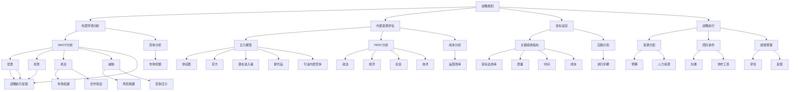

### SWOT分析

SWOT分析是一种常用的战略规划工具，用于评估企业的优势、劣势、机会和威胁。通过SWOT分析，企业可以全面了解自身在市场中的地位和竞争力，为战略规划提供依据。

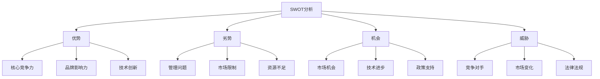

### 五力模型

五力模型由迈克尔·波特提出，用于分析行业的竞争强度和潜在的盈利能力。该模型包括供应商、买方、潜在进入者、替代品和行业内部竞争五个方面。

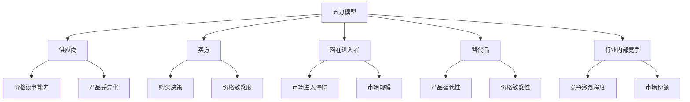

### PEST分析

PEST分析是一种宏观环境分析工具，用于评估政治、经济、社会和技术等因素对企业战略规划的影响。通过PEST分析，企业可以识别外部环境中的潜在机会和威胁。

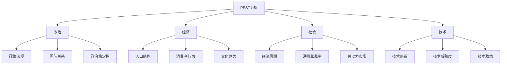

### 战略规划的过程与方法

战略规划的过程包括多个步骤，从外部环境分析到内部资源评估，再到目标设定和实施计划。以下是战略规划的基本步骤：

1. **外部环境分析**：通过PEST分析、SWOT分析等工具，了解市场趋势、竞争环境和政策法规。
2. **内部资源评估**：评估企业的资源状况，包括资金、人力资源、技术能力等。
3. **目标设定**：根据外部环境和内部资源，设定长期和短期的战略目标。
4. **关键绩效指标（KPI）**：定义用于衡量目标达成情况的指标。
5. **实施计划**：制定具体的实施步骤和时间表，确保战略规划的有效执行。

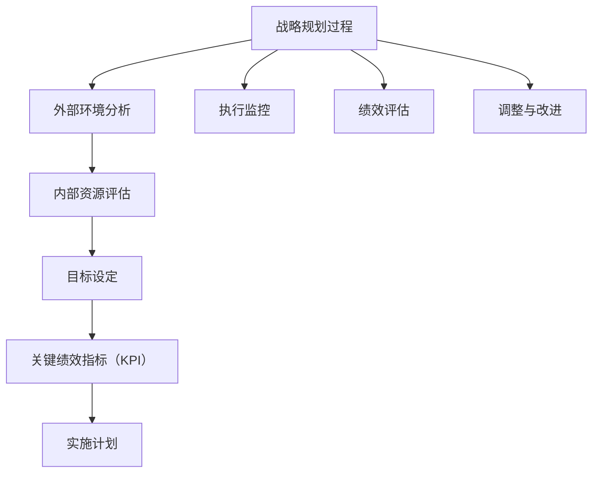

### 战略执行

战略执行是将战略规划转化为具体行动的过程。以下是战略执行的关键要素：

1. **资源分配**：根据战略规划，合理分配资源，确保关键任务得到充分支持。
2. **团队协作**：建立高效的团队协作机制，确保团队成员之间的沟通和合作。
3. **绩效管理**：通过关键绩效指标（KPI）监控执行过程，确保目标达成。
4. **持续改进**：对执行过程进行定期评估，识别问题并进行改进。

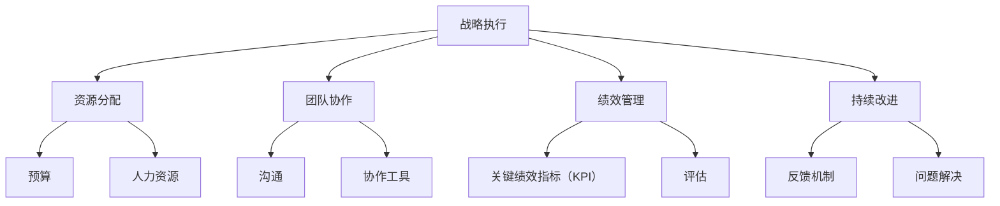

### 领导力与团队协作

领导力在战略执行中起着至关重要的作用。优秀的领导者能够激发团队潜力，确保战略规划的有效实施。以下是领导力在团队协作中的关键要素：

1. **愿景与目标**：明确团队的愿景和目标，确保团队成员对目标有共同的理解和认同。
2. **沟通与协作**：建立有效的沟通机制，促进团队成员之间的信息交流和协作。
3. **激励与支持**：通过激励和提供必要的支持，激发团队成员的积极性和创造力。
4. **冲突管理**：处理团队内部的冲突，确保团队和谐，避免影响战略执行。

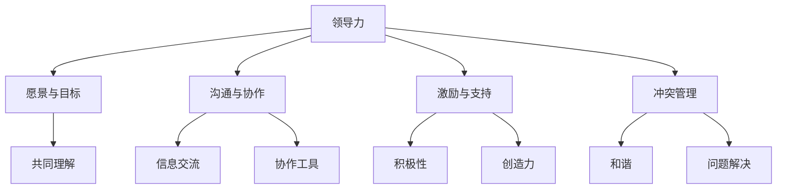

### 目标设定与绩效管理

目标设定是战略执行的重要环节。以下是目标设定的原则和方法：

1. **SMART原则**：目标应具备具体性、可衡量性、可实现性、相关性和时限性。
2. **分解目标**：将总体目标分解为具体的子目标，确保每个子目标都具有明确的实施路径。

绩效管理则是确保目标达成的关键。以下是绩效管理的方法：

1. **制定KPI**：根据目标，制定关键绩效指标（KPI），用于衡量目标达成情况。
2. **绩效评估**：定期对绩效进行评估，识别问题和改进空间。
3. **反馈与激励**：通过反馈和激励，激发团队成员的积极性和创造力。

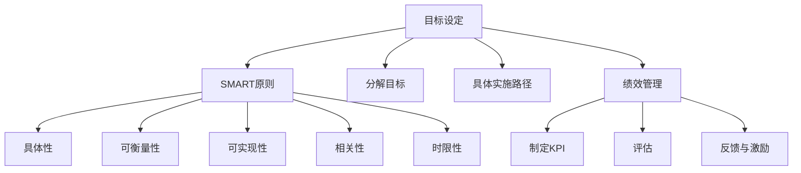

### 资源配置与预算管理

资源配置与预算管理是战略执行的重要环节。以下是资源配置与预算管理的关键要素：

1. **资源分配策略**：根据战略目标和项目需求，合理分配资源，确保关键任务得到充分支持。
2. **预算编制方法**：制定详细的预算计划，包括收入预算、支出预算和利润预算。
3. **成本控制措施**：通过监控和调整成本，确保预算的执行和目标的达成。

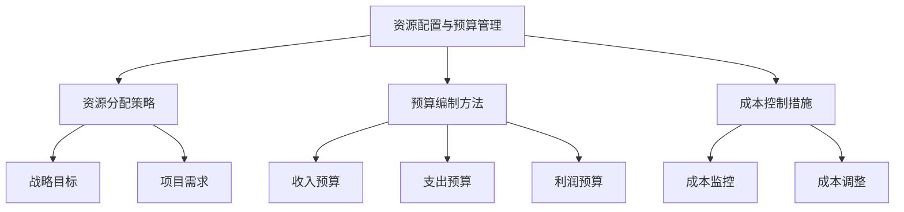

### 沟通与协作

沟通与协作在战略执行中至关重要。以下是沟通与协作的关键要素：

1. **沟通机制**：建立有效的沟通机制，确保信息流畅和透明。
2. **协作工具**：采用合适的协作工具，如项目管理软件、即时通讯工具等，提高团队协作效率。
3. **沟通技巧**：培养良好的沟通技巧，包括倾听、表达和反馈，促进团队内部的有效沟通。

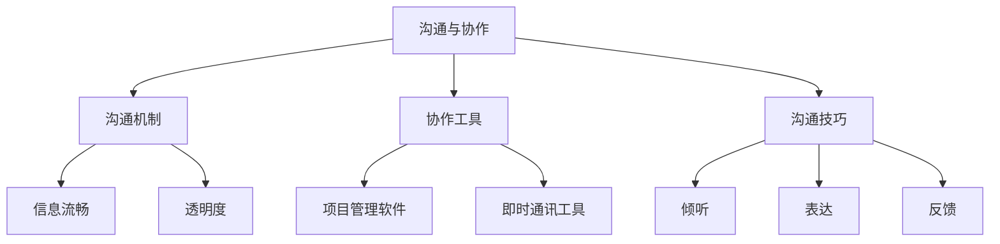

### 决策艺术

决策艺术是战略执行中的关键能力。以下是决策艺术的几个关键方面：

1. **决策过程**：包括问题识别、方案评估、决策制定和决策执行。
2. **决策方法**：如成本效益分析、风险评估和决策树分析等。
3. **风险管理**：在决策过程中考虑潜在风险，并制定相应的风险应对策略。

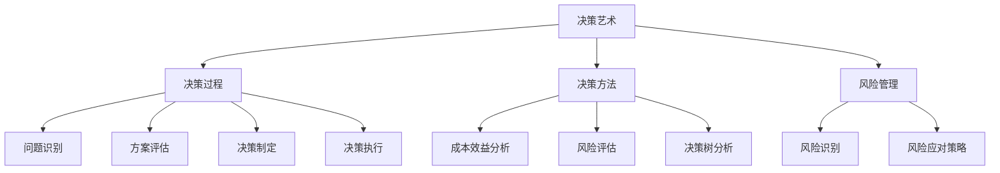

### 创新与变革管理

创新与变革管理是企业持续发展的重要驱动力。以下是创新与变革管理的几个关键方面：

1. **创新理念**：培养创新思维，鼓励员工提出新的想法和解决方案。
2. **变革管理**：确保变革的实施过程平稳，减少变革带来的冲击和阻力。
3. **创新机制**：建立创新机制，包括创新项目审批、创新成果保护和激励机制。

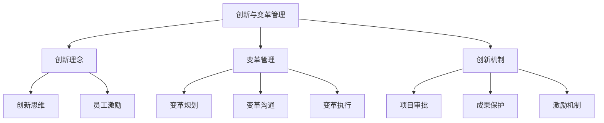

### 激励与员工发展

激励与员工发展是提升企业竞争力的关键。以下是激励与员工发展的几个关键方面：

1. **激励理论**：了解不同的激励理论，如马斯洛的需求层次理论和赫兹伯格的双因素理论。
2. **激励机制**：建立合理的激励机制，包括薪酬激励、荣誉激励和晋升激励。
3. **员工发展**：通过培训和发展计划，提升员工的专业技能和管理能力。

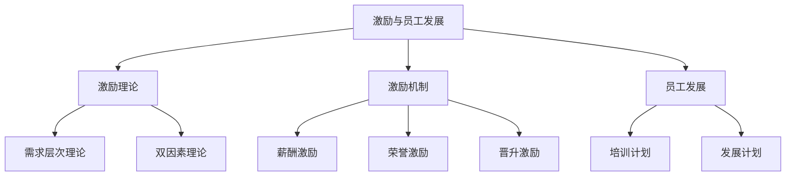

### 战略执行中的领导力提升

领导力提升是战略执行成功的关键。以下是领导力提升的几个关键方面：

1. **自我提升**：领导者需要不断提升自身的专业能力和领导力。
2. **培养团队**：领导者需要培养和激励团队成员，提升团队整体能力。
3. **领导力传承**：通过传帮带的方式，将领导力传承给下一代领导者。

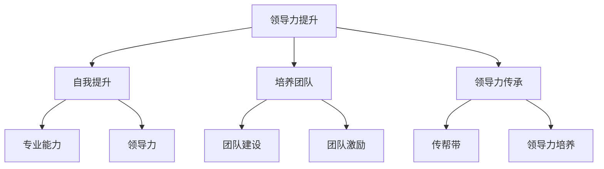

### 项目管理的基本概念

项目管理是战略执行的重要组成部分，以下是项目管理的基本概念：

1. **项目定义**：项目是临时性的、独特的活动，旨在创造一个特定的产品、服务或成果。
2. **项目管理核心要素**：包括项目范围管理、时间管理、成本管理、质量管理、资源管理、沟通管理和风险管理。

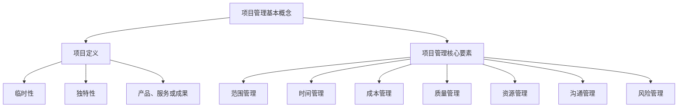

### 项目计划与进度控制

项目计划与进度控制是项目管理的关键环节，以下是相关方法和工具：

1. **项目计划编制**：包括项目目标、任务分解、时间安排、资源分配和风险评估。
2. **进度控制**：通过进度报告、进度分析和进度调整，确保项目按计划进行。

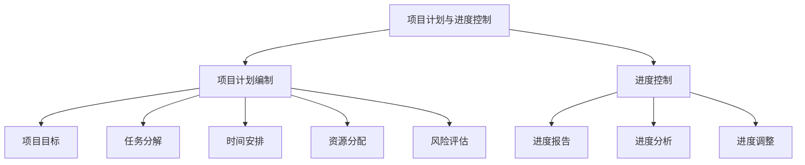

### 风险管理与质量管理

风险管理是确保项目成功的关键，而质量管理则关系到项目成果的质量。以下是相关方法：

1. **风险管理流程**：包括风险识别、风险评估、风险应对策略和风险监控。
2. **质量管理原则**：包括客户导向、过程方法、全员参与和持续改进。

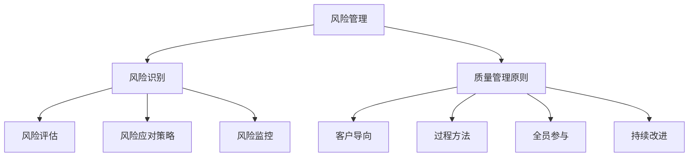

### 项目团队协作与沟通

项目团队协作与沟通是确保项目顺利进行的关键，以下是相关机制：

1. **团队协作机制**：包括角色分配、任务分工、沟通渠道和协作工具。
2. **沟通策略**：包括沟通频率、沟通方式、沟通内容和沟通效果评估。

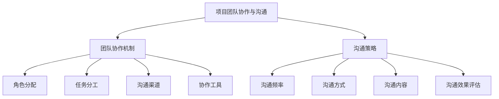

### 案例研究：企业战略规划的实践

#### 案例背景与目标

某科技公司在市场竞争加剧的背景下，希望通过战略规划明确公司的发展方向，提升市场竞争力。公司的主要目标包括扩大市场份额、提高产品创新能力和提升客户满意度。

#### 战略规划的详细步骤与应用

1. **外部环境分析**：
   - **PEST分析**：通过政治、经济、社会和技术因素的评估，了解行业趋势和政策环境。
   - **竞争分析**：分析主要竞争对手的市场策略和产品特点，识别竞争优势和潜在威胁。

2. **内部资源评估**：
   - **资源状况**：评估公司的资金、人力资源、技术能力和市场资源。
   - **核心竞争力**：识别公司的核心竞争力和独特优势。

3. **目标设定**：
   - **长期目标**：确定公司在未来几年内的战略目标，如市场占有率和产品创新。
   - **短期目标**：设定具体的短期目标，如季度销售目标和创新项目进度。

4. **关键绩效指标（KPI）**：
   - **市场份额**：通过市场调研和数据分析，设定具体的市场份额目标。
   - **产品创新率**：设定新产品开发的数量和质量目标。
   - **客户满意度**：通过客户反馈和满意度调查，设定具体的满意度指标。

5. **实施计划**：
   - **资源分配**：根据战略目标和任务分工，合理分配资源和预算。
   - **时间安排**：制定详细的项目时间表，确保各项任务按时完成。
   - **执行步骤**：明确每个阶段的执行步骤和责任人。

#### 案例分析

通过以上战略规划步骤，公司明确了未来的发展方向和关键目标。具体实施过程中，公司采取了一系列措施：

- **扩大市场份额**：通过市场推广和合作伙伴关系，扩大市场份额。
- **提高产品创新能力**：加大研发投入，组建创新团队，推动新产品开发。
- **提升客户满意度**：通过客户服务和质量改进，提高客户满意度。

#### 结果与反思

经过一段时间的实施，公司取得了一定的成效：

- **市场份额**：市场份额有所提升，尤其是在新市场领域。
- **产品创新能力**：新产品推出速度和质量得到提高，客户反响良好。
- **客户满意度**：客户满意度有所提升，客户投诉率下降。

然而，公司也面临一些挑战和问题：

- **资源分配**：部分资源分配不均，影响了项目的推进。
- **团队协作**：部分团队成员缺乏协作，影响了项目进度。
- **风险管理**：在项目实施过程中，未能及时发现和应对潜在风险。

通过案例研究，我们可以看到，战略规划的实施需要充分考虑内外部环境，合理分配资源，加强团队协作，并有效管理风险。这为其他企业在战略规划与执行过程中提供了宝贵的经验和教训。

### 案例研究：战略执行中的领导艺术

#### 案例背景与挑战

某高科技公司正在实施一项重大战略计划，旨在通过技术创新和业务拓展，提升公司的市场竞争力。然而，在执行过程中，公司面临着多个挑战：

- **组织变革**：公司需要从传统的部门式管理转变为更加灵活的项目导向型管理。
- **资源限制**：公司预算紧张，需要在有限的资源下实现多个项目目标。
- **团队协作**：不同部门之间的沟通不畅，影响了项目进展。

#### 战略执行中的领导艺术应用

1. **愿景与目标**：
   - 领导者需要明确公司的愿景和目标，并确保团队成员对目标有共同的理解和认同。
   - 通过定期的沟通和会议，领导者确保团队成员了解公司的发展方向和期望。

2. **沟通与协作**：
   - 领导者需要建立有效的沟通机制，促进团队成员之间的信息交流。
   - 采用项目管理工具，如即时通讯软件和协作平台，提高团队协作效率。

3. **激励与支持**：
   - 领导者需要通过激励措施，如奖金和晋升机会，激发员工的积极性和创造力。
   - 在项目实施过程中，领导者需要提供必要的支持，帮助团队成员克服困难。

4. **冲突管理**：
   - 领导者需要处理团队内部的冲突，确保团队和谐，避免影响项目进展。
   - 采用公正、透明的冲突解决机制，帮助团队成员找到共识。

#### 案例分析

通过领导者的有效领导，公司在战略执行过程中取得了一定的成效：

- **组织变革**：成功从传统的部门式管理转变为项目导向型管理，提高了项目执行效率。
- **资源管理**：通过优化资源分配和预算控制，实现了多个项目目标。
- **团队协作**：团队之间的沟通和协作得到了显著改善，项目进展顺利。

然而，公司也面临一些挑战：

- **项目管理**：在项目执行过程中，领导者需要不断调整管理策略，以应对变化。
- **员工激励**：部分员工对新的激励机制不满，影响了工作积极性。

通过案例研究，我们可以看到，领导者在战略执行中扮演着关键角色。领导者需要具备愿景和目标设定能力、沟通与协作能力、激励与支持能力以及冲突管理能力，以应对战略执行过程中的各种挑战。

### 案例研究：项目管理在战略执行中的应用

#### 案例背景与目标

某大型跨国公司计划在全球范围内推出一款新型智能家居产品，以提升市场份额和品牌影响力。项目目标包括按时完成产品开发、确保产品质量和实现市场推广。

#### 项目管理在战略执行中的应用

1. **项目定义**：
   - 明确项目的范围和目标，确保所有团队成员对项目有清晰的认识。

2. **项目计划**：
   - 制定详细的项目计划，包括项目目标、任务分解、时间安排、资源分配和风险评估。
   - 采用项目管理工具，如甘特图和项目计划软件，确保项目计划的可执行性。

3. **项目执行**：
   - 按照项目计划，逐步推进项目任务，确保每个任务按时完成。
   - 采用敏捷开发方法，灵活调整项目计划，以应对变化。

4. **项目监控**：
   - 通过定期的项目状态报告，监控项目进度和质量。
   - 采用项目管理工具，如JIRA和Trello，提高项目监控的效率和准确性。

5. **项目收尾**：
   - 完成项目任务后，进行项目总结和评估，识别项目成功和失败的原因。
   - 对项目文件和知识进行归档，为未来项目提供参考。

#### 案例分析

在项目执行过程中，项目管理发挥了关键作用：

- **项目定义**：通过明确项目范围和目标，确保所有团队成员对项目有清晰的认识。
- **项目计划**：通过详细的项目计划，确保项目任务的可执行性。
- **项目执行**：通过敏捷开发方法，灵活调整项目计划，提高了项目的适应性。
- **项目监控**：通过定期的项目状态报告和项目管理工具，提高了项目监控的效率和准确性。

通过项目管理，公司在以下方面取得了显著成果：

- **按时完成产品开发**：项目在预定时间内完成，确保了产品按时上市。
- **确保产品质量**：通过严格的质量管理，确保产品符合市场需求和标准。
- **市场推广**：通过有效的市场推广策略，新产品迅速获得了市场认可。

然而，公司也面临一些挑战：

- **资源限制**：在资源紧张的情况下，需要更有效地管理和调配资源。
- **团队协作**：部分团队成员在项目执行过程中，协作不畅，影响了项目进度。

通过案例研究，我们可以看到，项目管理在战略执行中至关重要。有效的项目管理可以确保项目按时、按质、按量完成，从而实现战略目标。

### 战略规划与执行的持续改进

在战略规划与执行过程中，持续改进是确保企业长期发展的关键。持续改进的理念和方法可以帮助企业不断优化业务流程，提升效率，增强竞争力。以下是持续改进的理念、方法以及如何进行战略规划的动态调整。

#### 持续改进的理念

持续改进是一种基于持续学习和不断优化的理念，其核心是通过对现有流程、方法和技术的不断改进，实现企业绩效的不断提升。持续改进的理念包括以下几个关键点：

1. **不断反思**：定期反思业务流程和策略，识别存在的问题和改进空间。
2. **全员参与**：鼓励全体员工参与改进活动，激发员工的创造力和积极性。
3. **数据驱动**：以数据为基础，通过数据分析和监控，识别问题并提出改进方案。
4. **持续优化**：将改进作为日常工作的一部分，不断优化业务流程和策略。

#### 持续改进的方法

持续改进的方法主要包括以下几种：

1. **PDCA循环**：PDCA循环（Plan-Do-Check-Act，即计划-执行-检查-行动）是一种常用的持续改进方法。通过循环进行计划、执行、检查和行动，不断优化业务流程。
2. **六西格玛**：六西格玛是一种基于统计方法的质量管理方法，旨在通过减少变异性和错误，提高产品和服务的质量。
3. **精益管理**：精益管理是一种通过消除浪费、优化流程，提高效率的管理方法。

#### 战略规划的动态调整

在战略执行过程中，企业面临着外部环境变化和内部资源调整等多重挑战。为了确保战略规划的有效性，企业需要具备动态调整战略规划的能力。以下是战略规划动态调整的关键步骤：

1. **环境分析**：定期进行外部环境分析，了解市场趋势、政策法规、竞争对手等信息。
2. **绩效评估**：对战略规划的实施情况进行绩效评估，识别存在的问题和改进空间。
3. **调整策略**：根据环境分析和绩效评估的结果，调整战略规划的目标、路径和资源分配。
4. **执行更新**：将调整后的战略规划纳入日常执行，确保新的战略能够有效落地。

#### 战略执行的绩效评估与反馈

绩效评估是战略执行的关键环节，通过绩效评估，企业可以了解战略规划的执行情况，识别问题并采取改进措施。以下是绩效评估的原则和方法：

1. **设定明确的目标**：确保绩效评估的目标明确、具体，可衡量。
2. **使用关键绩效指标（KPI）**：通过关键绩效指标（KPI）来衡量战略规划的执行情况。
3. **定期评估**：定期对战略规划进行评估，确保及时发现和解决问题。
4. **反馈机制**：建立反馈机制，将评估结果及时反馈给相关人员，并制定改进措施。

#### 持续改进的实践

为了实现持续改进，企业可以采取以下实践：

1. **建立改进小组**：成立改进小组，负责定期分析和解决业务流程中的问题。
2. **开展改进活动**：定期组织改进活动，如内部研讨会、案例分析等，激发员工的改进意识。
3. **数据驱动**：通过数据分析和监控，识别问题和改进空间，制定具体的改进方案。
4. **培训与激励**：提供培训和支持，鼓励员工积极参与改进活动，并对改进成果进行激励。

通过持续改进，企业可以实现业务流程的优化、效率的提升和竞争力的增强，从而在动态的市场环境中保持领先地位。

### 附录

#### 工具与资源

1. **战略规划与执行工具**：
   - **Project Management Software**：如Trello、Asana、JIRA等。
   - **Performance Management Tools**：如Google Analytics、Tableau等。
   - **Risk Management Tools**：如Risk Register、Qualys等。

2. **相关资源推荐**：
   - **战略规划书籍**：《竞争战略》、《蓝海战略》等。
   - **项目管理书籍**：《项目管理知识体系指南》（PMBOK Guide）、《敏捷项目管理》等。
   - **在线课程和讲座**：Coursera、edX、Udemy等平台上的相关课程。

#### 参考文献

1. 波特，迈克尔·E. 《竞争战略》（Competitive Strategy）.
2. 明茨伯格，亨利·M. 《战略历程：概念、案例和理论》（The Design of Strategy: Concepts, Cases, and Readings）.
3. PMI. 《项目管理知识体系指南》（PMBOK Guide）.
4. 柯达，亨利·F. 《蓝海战略》（Blue Ocean Strategy）.
5. 克里斯滕森，克莱顿·M. 《创新者的窘境》（The Innovator's Dilemma）.
6. 马克斯·韦伯. 《组织理论：组织行为与结构》（Organizational Theory: Structure and Process）.
7. 汤姆·彼得斯. 《追求卓越》（In Search of Excellence）.
8. 迈克尔·波特. 《竞争优势》（Competitive Advantage）.

