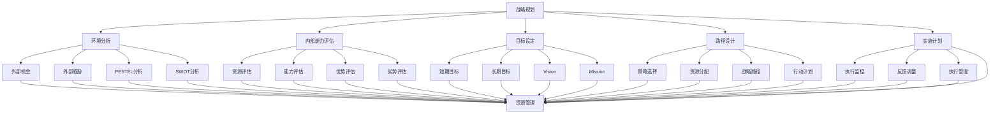

                 

### 1. 引言

#### 战略规划与执行的重要性

在当今复杂多变的企业环境中，战略规划与执行成为企业成功的关键因素。战略规划为企业提供了一个明确的蓝图，指明了企业未来发展的方向和目标。而有效的战略执行则是将这一蓝图转化为实际行动的过程，确保企业能够在预定的时间内实现既定的目标。

战略规划不仅是一个管理工具，更是企业发展的指南针。它帮助企业在复杂的市场环境中找到立足点，合理配置资源，避免盲目决策。战略规划的成功，取决于对企业内外部环境的深入分析、目标设定的明确性和路径设计的科学性。

与此同时，战略执行是战略规划得以实现的关键。一个再完美的战略，如果没有得到有效的执行，也仅仅是一纸空文。战略执行涉及到资源的合理配置、团队的协作、领导的决策和执行过程中的监控与调整。有效的战略执行能够帮助企业快速响应市场变化，抓住机遇，规避风险。

本篇文章将从多个角度探讨战略规划与执行的重要性。首先，我们将详细介绍战略规划的核心概念，包括其定义、类型以及与企业目标的关系。接着，我们将深入分析战略规划的过程，包括环境分析、内部能力评估、目标设定、路径设计和实施计划等步骤。随后，我们将讨论战略执行的要素，如何确保资源的有效配置、激励与沟通的重要性以及执行过程中的监控与调整。此外，文章还将探讨领导艺术在战略规划与执行中的作用，通过案例研究来展示理论的应用，并提供实用的实践指南。

总之，本篇文章旨在帮助读者全面了解战略规划与执行的理论与实践，为企业在竞争激烈的市场中取得成功提供指导。

#### 文章概述与结构

本文将以《战略规划与执行：从蓝图到现实的领导艺术》为主题，全面探讨战略规划与执行的重要性、核心概念、过程、领导艺术以及实际案例。文章结构如下：

**第1章 引言**

在本章中，我们将介绍战略规划与执行的重要性，并概述全文的结构和内容。

**第2章 核心概念**

本章将详细解释战略规划、执行管理和领导艺术的核心概念，包括其定义、类型及其相互关系。

**第3章 战略规划过程**

我们将深入探讨战略规划的过程，包括环境分析、内部能力评估、目标设定、路径设计和实施计划等关键步骤。

**第4章 战略执行**

本章将讨论战略执行的关键要素，如资源配置、激励与沟通、监控与调整等，并阐述这些要素如何影响战略的执行。

**第5章 领导艺术**

我们将探讨领导在战略规划与执行中的作用，包括领导风格、领导力的培养与提升以及领导者在战略执行中的角色。

**第6章 案例研究**

通过实际案例研究，我们将展示理论在真实环境中的应用，并分析成功与失败的原因。

**第7章 实践指南**

本章将提供制定有效战略规划和执行战略的具体指南，包括工具、技巧和最佳实践。

**第8章 结论**

在结论部分，我们将总结全文内容，并探讨未来展望与挑战。

通过上述结构，本文将帮助读者全面理解战略规划与执行的理论与实践，为企业成功提供指导。以下是本章的具体内容。

#### 第1章 核心概念

**战略规划的定义与类型**

战略规划是企业为实现长期目标和确保持续发展而制定的全面计划。它涉及到企业愿景的明确、外部环境的分析、内部能力的评估以及未来目标的确立。战略规划不仅仅是高层管理者的任务，而是需要全员参与和持续优化的过程。

战略规划的类型主要包括以下几种：

1. **竞争战略**：通过分析市场竞争环境，制定如何赢得竞争的策略，如低成本领先、差异化和集中化策略。
2. **业务战略**：专注于企业现有业务的发展和优化，如市场拓展、产品创新、流程改进等。
3. **职能战略**：针对企业的各个职能部门，如市场营销、生产运营、人力资源等，制定具体的战略目标与行动方案。
4. **整体战略**：企业从整体角度出发，制定长期发展方向和目标，如多元化经营、全球化战略等。

**执行管理的概念与原则**

执行管理是指确保企业战略得以实施的过程和管理体系。它不仅包括高层领导者的决策和指挥，还涉及到中下层管理者和员工的执行与协同。执行管理的核心原则包括：

1. **明确目标**：确保所有员工对战略目标和执行计划有清晰的理解，避免目标模糊带来的执行偏差。
2. **资源保障**：合理配置企业资源，包括财务、人力、技术和信息等，确保战略执行所需的资源得到充分保障。
3. **有效沟通**：建立高效的沟通机制，确保信息在企业内部准确、及时地传递，增强员工之间的协作。
4. **监控与反馈**：通过监控战略执行过程，及时发现并解决问题，并根据反馈进行持续改进。
5. **激励机制**：建立激励机制，激发员工的积极性和创造力，推动战略目标的实现。

**领导艺术的核心要素**

领导艺术是战略规划与执行过程中不可或缺的一部分。它不仅涉及到领导者的个人特质和技能，还包括领导行为和领导风格。领导艺术的核心要素包括：

1. **愿景与使命**：领导者需要明确企业的愿景和使命，并将其传达给全体员工，激发员工的归属感和使命感。
2. **决策能力**：领导者需要具备快速做出明智决策的能力，确保企业能够及时应对市场变化和挑战。
3. **沟通与激励**：领导者需要具备良好的沟通技巧，确保战略规划与执行的信息在企业内部得到有效传递。同时，通过激励措施，提高员工的执行力和积极性。
4. **团队建设**：领导者需要注重团队建设，打造一支高效、协同的团队，为战略执行提供有力支持。

**战略规划与执行的联系与区别**

战略规划与执行虽然紧密相关，但存在明显的区别。战略规划是企业发展的蓝图，主要关注目标和路径的设计；而战略执行则是将这一蓝图转化为实际行动的过程，关注资源的配置、团队的协作和过程的监控。

战略规划与执行之间的联系主要体现在以下几个方面：

1. **目标一致性**：战略规划与执行的目标应保持一致，确保企业的发展方向和行动方案相互匹配。
2. **相互依赖**：战略规划为战略执行提供了方向和目标，而战略执行的结果又反过来影响战略规划的调整和优化。
3. **信息共享**：战略规划和执行过程中的信息应保持共享，确保企业内部对战略方向和执行情况有全面的了解。

通过以上对核心概念的介绍，我们为后续章节的深入探讨奠定了基础。在接下来的章节中，我们将进一步详细探讨战略规划的过程、战略执行的要素、领导艺术以及实际案例，以帮助读者更全面地理解战略规划与执行的理论与实践。

#### 第2章 核心概念：Mermaid 流程图

为了更直观地展示战略规划与执行的核心概念及其相互关系，我们可以使用 Mermaid 流程图来描述这些概念。以下是核心概念及其关系的 Mermaid 图：

上述 Mermaid 图详细描述了战略规划与执行的核心概念及其相互关系。以下是对每个部分的简要解释：

- **战略规划（A）**：企业为实现长期目标和确保持续发展而制定的全面计划。
- **环境分析（B）**：包括外部环境（G、H）和内部能力评估（I、J）。
  - **外部机会（G）**：外部环境中可能对企业有益的因素。
  - **外部威胁（H）**：外部环境中可能对企业造成不利影响的因素。
  - **PESTEL分析（Q）**：政治、经济、社会、技术、环境和法律等外部因素的分析。
  - **SWOT分析（R）**：企业的优势（S）、劣势（T）、机会（G）和威胁（H）。
- **内部能力评估（C）**：评估企业的资源（I）和能力（J）。
  - **资源评估（I）**：企业所拥有的财务、人力、技术和信息资源。
  - **能力评估（J）**：企业的市场地位、技术实力和管理水平。
- **目标设定（D）**：确定企业的短期（K）和长期（L）目标。
  - **Vision（U）**：企业的愿景，即企业的长远目标和愿景。
  - **Mission（V）**：企业的使命，即企业的基本任务和目的。
- **路径设计（E）**：制定战略路径（W）和行动计划（X）。
  - **策略选择（M）**：根据环境分析和内部能力评估选择合适的策略。
  - **资源分配（N）**：将资源合理地分配到各个战略路径和行动计划中。
- **实施计划（F）**：包括执行监控（O）和反馈调整（P）。
  - **执行监控（O）**：监控战略执行的进度和效果，确保目标的实现。
  - **反馈调整（P）**：根据执行监控的结果，对战略执行进行调整和优化。

通过 Mermaid 流程图，我们可以清晰地看到战略规划与执行的核心概念及其相互关系。这种视觉化的方式有助于读者更好地理解这些概念，并在实际应用中更好地运用这些知识。

#### 第3章 战略规划过程

战略规划是企业实现长期目标与持续发展的关键过程。一个有效的战略规划不仅需要明确企业的愿景和使命，还需要对外部环境进行深入分析，评估内部能力，设定明确的目标，设计合理的战略路径，并制定详细的实施计划。以下是战略规划过程的详细步骤。

**3.1 战略规划的过程框架**

战略规划的过程可以概括为以下几个基本步骤：

1. **环境分析**：包括外部环境和内部能力评估。
2. **目标设定**：确定短期和长期目标。
3. **路径设计**：制定战略路径和行动计划。
4. **实施计划**：制定详细的实施计划，包括资源分配、时间表和关键绩效指标（KPI）。
5. **执行与监控**：实施战略规划，并持续监控与调整。

**3.2 外部环境分析**

外部环境分析是战略规划过程的基础，它帮助企业管理者了解企业所处的市场环境，从而制定相应的战略。外部环境分析主要包括以下方面：

- **PESTEL分析**：这是一种宏观环境分析工具，包括政治（Political）、经济（Economic）、社会（Social）、技术（Technological）、环境（Environmental）和法律（Legal）等六个方面。

  - **政治因素**：政府政策、法律法规等对企业经营的影响。
  - **经济因素**：宏观经济状况、行业发展趋势、市场需求等。
  - **社会因素**：人口结构、消费趋势、文化价值观等。
  - **技术因素**：技术创新、技术发展趋势、技术替代等。
  - **环境因素**：环境政策、气候变化、资源稀缺等。
  - **法律因素**：相关法律法规、行业规范等。

- **SWOT分析**：这是一种评估企业内部优势和劣势，以及外部机会和威胁的分析工具。

  - **优势（Strengths）**：企业在资源、技术、市场地位等方面的优势。
  - **劣势（Weaknesses）**：企业在资源、技术、市场地位等方面的劣势。
  - **机会（Opportunities）**：外部环境中对企业有利的因素。
  - **威胁（Threats）**：外部环境中可能对企业造成不利影响的因素。

**3.3 内部能力评估**

内部能力评估是了解企业内部资源、技术和管理水平的过程，为战略规划的制定提供依据。内部能力评估主要包括以下方面：

- **资源评估**：评估企业现有的财务资源、人力资源、技术资源和信息资源。

  - **财务资源**：企业可用于投资和运营的资金。
  - **人力资源**：企业的员工数量、技能水平和组织结构。
  - **技术资源**：企业的技术实力、研发能力和创新能力。
  - **信息资源**：企业拥有的数据和信息管理系统。

- **能力评估**：评估企业的市场地位、技术实力、管理水平和执行力。

  - **市场地位**：企业在市场中的份额、品牌影响力和客户忠诚度。
  - **技术实力**：企业的技术创新能力、产品质量和市场适应性。
  - **管理水平**：企业的管理效率、组织能力和应变能力。
  - **执行力**：企业的决策速度、执行力和问题解决能力。

**3.4 制定战略目标**

制定战略目标是战略规划的核心，它需要明确企业在未来一段时间内要实现的目标。战略目标可以分为短期目标和长期目标。

- **短期目标**：通常为1-3年内实现的目标，如市场份额扩大、产品线扩展、利润增长等。

  - **市场目标**：提高市场占有率、开拓新市场、提升品牌知名度等。
  - **产品目标**：新产品开发、产品线扩展、产品改进等。
  - **财务目标**：利润增长、成本降低、投资回报率提升等。

- **长期目标**：通常为3-5年内实现的目标，如企业的愿景和使命。

  - **愿景**：企业的长远发展目标和理想状态。
  - **使命**：企业的基本任务和存在的价值。

**3.5 设计战略路径**

设计战略路径是战略规划的关键环节，它需要根据环境分析、内部能力评估和目标设定来确定具体的战略路径和行动计划。

- **战略路径**：确定企业实现目标的主要方法和途径。

  - **竞争战略**：如低成本领先、差异化、集中化等。
  - **业务战略**：如市场拓展、产品创新、流程改进等。
  - **职能战略**：如市场营销、生产运营、人力资源等。

- **行动计划**：为实现战略路径中的目标，制定具体的行动步骤和计划。

  - **时间表**：明确每个行动步骤的完成时间。
  - **关键绩效指标（KPI）**：用于衡量行动步骤的完成情况和效果。

**3.6 战略实施计划**

战略实施计划是战略规划的具体化，它需要详细描述如何将战略路径和行动计划转化为实际行动。战略实施计划主要包括以下方面：

- **资源分配**：明确战略实施所需的各种资源，包括财务资源、人力资源、技术资源和信息资源。
- **时间表**：制定详细的战略实施时间表，包括关键里程碑和时间节点。
- **责任分配**：明确每个行动步骤的责任人和责任范围。
- **监控与反馈**：建立监控机制，定期检查战略实施进度和效果，并根据反馈进行调整。

通过上述步骤，企业可以制定出科学合理的战略规划，为未来的发展提供明确的方向和行动指南。在接下来的章节中，我们将进一步探讨战略执行的关键要素，以及如何通过有效的领导艺术来实现战略目标。

#### 第4章 战略执行

**4.1 执行战略的关键因素**

战略执行是企业将战略规划转化为实际行动的过程，这一过程不仅依赖于企业的资源与能力，还需要多个关键因素的支持。以下是战略执行的关键因素：

1. **资源保障**：战略执行需要充足的资源作为保障，包括财务资源、人力资源、技术资源和信息资源。资源的合理配置和有效利用是战略执行成功的基础。

   - **财务资源**：企业需要确保有足够的资金来支持战略目标的实现，如投资新项目、扩大生产规模等。
   - **人力资源**：企业需要拥有合适的员工团队，具备实现战略目标所需的技能和经验。
   - **技术资源**：企业需要拥有先进的技术和设备，以支持产品的研发和生产。
   - **信息资源**：企业需要建立完善的信息系统，确保信息的准确性和及时性，为决策提供支持。

2. **执行力**：执行力是战略执行的核心，它决定了战略目标能否按计划实现。执行力包括以下几个方面：

   - **决策速度**：企业需要具备快速决策的能力，以应对市场变化和竞争压力。
   - **执行效率**：企业需要提高执行效率，确保各项任务能够按时、高质量完成。
   - **问题解决能力**：企业需要具备及时发现和解决问题的能力，确保战略执行过程中不会因为突发事件而受阻。

3. **团队协作**：战略执行通常涉及多个部门和团队的合作，因此团队协作是关键因素之一。有效的团队协作包括：

   - **沟通与协调**：建立有效的沟通机制，确保信息在企业内部准确、及时地传递，避免误解和冲突。
   - **协同工作**：鼓励不同部门和团队之间的协同工作，共享资源和信息，提高整体执行力。
   - **跨部门合作**：明确各部门的职责和任务，促进跨部门的合作与协调，确保战略目标的实现。

4. **领导力**：领导力在战略执行过程中起着至关重要的作用。领导力包括以下几个方面：

   - **愿景与使命**：领导者需要明确企业的愿景和使命，并将其传达给全体员工，激发员工的归属感和使命感。
   - **决策能力**：领导者需要具备快速做出明智决策的能力，确保企业能够及时应对市场变化和挑战。
   - **沟通与激励**：领导者需要具备良好的沟通技巧，确保战略规划与执行的信息在企业内部得到有效传递。同时，通过激励措施，提高员工的执行力和积极性。
   - **团队建设**：领导者需要注重团队建设，打造一支高效、协同的团队，为战略执行提供有力支持。

**4.2 确保资源与能力匹配**

确保资源与能力匹配是战略执行成功的关键。以下是实现资源与能力匹配的一些方法：

1. **资源评估**：企业需要对现有资源进行全面的评估，了解资源的充足程度和利用情况。通过资源评估，企业可以明确资源的需求，并制定相应的资源获取计划。

   - **财务资源评估**：评估企业财务资源的状况，包括资金流动、负债情况等。
   - **人力资源评估**：评估企业员工的数量、技能和结构，确保人力资源能够满足战略执行的需求。
   - **技术资源评估**：评估企业的技术实力，包括技术研发能力、设备状况等。
   - **信息资源评估**：评估企业的信息系统，包括数据管理、信息处理能力等。

2. **能力提升**：为了确保资源与能力匹配，企业需要不断提升自身的能力，包括技术能力、管理能力和创新能力。

   - **技术能力提升**：通过技术创新和研发，提高企业的技术水平，确保企业能够跟上技术发展的步伐。
   - **管理能力提升**：通过培训和管理提升，提高企业管理者的决策能力和执行能力。
   - **创新能力提升**：鼓励员工创新，建立创新机制，提高企业的创新能力。

3. **资源配置优化**：企业需要通过优化资源配置，确保资源能够得到最有效的利用。

   - **财务资源优化**：通过合理的财务规划和管理，确保资金的使用效率最高。
   - **人力资源优化**：通过有效的招聘、培训和绩效管理，确保人力资源的合理配置。
   - **技术资源优化**：通过技术改造和升级，确保技术资源能够支持企业的战略执行。
   - **信息资源优化**：通过信息化手段，提高信息处理和传递的效率。

通过确保资源与能力的匹配，企业可以更好地实现战略目标，提高竞争力，实现可持续发展。

#### 4.3 激励与沟通

在战略执行过程中，激励与沟通是确保团队高效合作和战略目标实现的关键因素。有效的激励和沟通机制能够激发员工的积极性，增强团队的凝聚力，提高执行力。

**激励的重要性**

激励是指通过奖励和认可来激发员工的内在动力，提高其工作绩效和满意度。以下是几种常见的激励机制：

1. **物质激励**：通过提高工资、奖金、福利等方式来激励员工。物质激励能够直接提升员工的生活质量和工作动力，但过度依赖物质激励可能会导致员工产生惰性。

2. **精神激励**：通过表扬、认可和晋升等方式来激励员工。精神激励能够满足员工的荣誉感和成就感，增强其工作积极性和归属感。

3. **成长激励**：提供职业发展和培训机会，帮助员工提升技能和职业素养。成长激励能够增强员工对企业的忠诚度和职业满意度。

**沟通的重要性**

沟通是信息传递和意见交流的过程，是团队协作和战略执行的基础。以下是几种有效的沟通机制：

1. **正式沟通**：通过会议、报告、备忘录等方式进行信息传递和意见交流。正式沟通具有正式性、明确性和规范性，适用于传递重要信息和决策。

2. **非正式沟通**：通过聊天、邮件、即时通讯等方式进行轻松、自由的交流。非正式沟通能够增强团队凝聚力，促进信息的快速传递和问题的及时解决。

3. **双向沟通**：鼓励员工和管理层之间的双向交流，确保信息的双向传递和理解。双向沟通能够增强员工的参与感和责任感，提高决策的质量和执行的效率。

**激励与沟通的结合**

激励与沟通是相辅相成的，有效的结合能够最大化地发挥两者的作用。以下是几种结合激励与沟通的方法：

1. **目标导向的沟通**：在设定员工目标时，通过沟通明确目标的重要性和预期成果，激发员工的积极性和责任感。

2. **绩效反馈的激励**：在绩效评估时，通过沟通对员工的绩效进行反馈，并提供改进建议。同时，根据绩效结果进行物质和精神激励，提升员工的工作动力。

3. **团队建设的沟通**：通过定期的团队建设活动，加强团队成员之间的沟通和协作，提高团队凝聚力和执行力。

4. **开放式的沟通环境**：建立开放、透明的沟通环境，鼓励员工提出意见和建议，管理层积极回应和解决问题，增强员工的参与感和归属感。

通过有效的激励与沟通，企业可以打造一个积极向上、高效协作的团队，确保战略目标的顺利实现。

#### 4.4 监控与调整

在战略执行过程中，监控与调整是确保战略目标按计划实现的重要环节。有效的监控与调整机制能够及时发现并解决问题，确保企业能够迅速响应市场变化，保持战略规划的持续性和有效性。

**监控的重要性**

监控是指对战略执行过程进行跟踪和监督，以评估实际进展与预期目标的差异。以下是监控的重要性：

1. **确保目标实现**：通过监控，企业可以了解战略执行的具体情况，及时发现偏离目标的问题，并采取相应措施进行调整，确保战略目标的实现。

2. **提高执行力**：监控过程能够提高团队的执行力，通过定期的检查和评估，确保各项工作按照计划进行，提高整体的工作效率。

3. **增强透明度**：监控机制能够提高企业内部的信息透明度，确保各级管理者能够准确了解战略执行的进展和问题，增强决策的科学性和针对性。

**调整的重要性**

调整是指在监控过程中发现问题时，对战略执行计划进行修正和改进。以下是调整的重要性：

1. **适应变化**：市场环境和内部条件是不断变化的，战略执行过程中需要根据实际情况进行调整，以适应新的变化，保持战略的灵活性和适应性。

2. **优化资源分配**：通过调整，企业可以优化资源的配置，确保资源能够更加有效地用于战略目标的实现。

3. **提升效果**：调整可以针对存在的问题进行改进，提高战略执行的效果，确保企业能够在既定时间内实现目标。

**监控与调整的方法**

以下是几种常用的监控与调整方法：

1. **关键绩效指标（KPI）**：通过设定关键绩效指标，对企业战略执行的关键方面进行监控。KPI包括财务指标、市场指标、运营指标等，能够提供定量和定性的评估结果。

2. **定期报告**：企业应建立定期报告制度，要求各部门和团队定期提交战略执行情况的报告。报告应包括实际进展、存在的问题以及改进措施等。

3. **项目评估**：对战略执行项目进行定期评估，包括项目进度、成本控制、质量标准等。评估结果应与既定目标进行对比，找出差异并分析原因。

4. **反馈机制**：建立有效的反馈机制，鼓励员工和管理层提出意见和建议，及时发现和解决问题。反馈机制应包括定期会议、意见箱、匿名反馈等方式。

5. **灵活调整**：根据监控结果和反馈，企业应具备灵活调整战略执行计划的能力。调整应迅速、果断，以确保战略目标的实现。

**监控与调整的实施步骤**

以下是监控与调整的实施步骤：

1. **设定监控指标**：明确战略执行的关键绩效指标，确保监控的针对性。

2. **建立监控机制**：制定监控计划，确定监控的时间、频率和责任人。

3. **定期报告**：要求各部门和团队定期提交执行报告，确保监控的连续性和完整性。

4. **评估与反馈**：对监控结果进行评估，识别问题和机会，提出改进建议。

5. **调整与优化**：根据评估结果和反馈，对战略执行计划进行必要的调整和优化。

通过有效的监控与调整机制，企业可以确保战略执行过程的透明度和效率，及时应对市场变化，实现战略目标。监控与调整不仅是对过去的总结和反思，更是对未来行动的指导和改进。

### 5. 领导艺术

领导艺术在战略规划与执行过程中起着至关重要的作用。有效的领导不仅能够确保战略目标的实现，还能够激发团队的潜力，提高执行力，推动企业的持续发展。以下我们将探讨领导艺术的核心要素，包括领导风格、领导力的培养与提升以及领导者在战略执行中的角色。

#### 5.1 领导风格

领导风格是指领导者在其领导行为中所采用的基本方式和方法。不同的领导风格对战略执行的影响各不相同，常见的领导风格包括以下几种：

1. **权威型领导**：权威型领导者通常具有高度的决策权和控制力，通过发布指令和严格监督来确保目标的实现。这种领导风格在需要迅速决策和严格控制的情境下较为有效，但可能会导致员工的创造力和自主性受到限制。

2. **民主型领导**：民主型领导者重视团队参与和决策的集体性，鼓励员工提出意见和建议，并在决策过程中充分沟通。这种领导风格能够增强团队的凝聚力和创新精神，但在决策速度上可能较为缓慢。

3. **参与型领导**：参与型领导者不仅关注团队的工作绩效，还注重员工的个人成长和发展。他们通过激励和授权，鼓励员工积极参与战略执行，提高团队的士气和执行力。

4. **变革型领导**：变革型领导者具有强大的愿景和使命感，能够激发员工的热情和动力，推动企业变革和创新。这种领导风格在应对市场变化和挑战时尤为重要，能够帮助企业实现跨越式发展。

5. **事务型领导**：事务型领导者注重细节和实际操作，通过制定详细的计划和流程来确保任务的完成。这种领导风格在执行具体任务时较为有效，但在战略规划和创新方面可能略显不足。

不同的领导风格适用于不同的情境和任务，领导者应根据实际情况灵活运用不同的领导风格，以实现最佳的战略执行效果。

#### 5.2 领导力的培养与提升

领导力的培养与提升是确保领导者能够有效应对战略执行过程中各种挑战的关键。以下是一些提升领导力的方法和途径：

1. **自我认知**：领导者需要深入了解自己的优点和不足，明确自己的价值观和信念，从而在领导过程中能够更好地发挥自身优势，克服自身短板。

2. **知识积累**：领导者应不断学习和积累知识，包括战略管理、领导艺术、行业动态等，以提升自身的专业素养和管理能力。

3. **情感管理**：领导者需要具备良好的情感管理能力，包括情绪控制、同理心和情感沟通等，以建立良好的人际关系，增强团队的凝聚力和执行力。

4. **沟通技巧**：有效的沟通是领导力的核心，领导者应具备良好的沟通技巧，包括表达清晰、倾听他人、反馈及时等，以促进信息的准确传递和团队的协作。

5. **决策能力**：领导者需要具备快速决策和明智决策的能力，以应对复杂多变的市场环境和战略执行过程中的挑战。

6. **激励与授权**：领导者应善于激励和授权，通过激发员工的内在动力和提供自主权，提高员工的工作积极性和创造力。

7. **持续学习**：领导力不是一成不变的，领导者应保持持续学习的态度，不断适应新的挑战和变化，提升自身的领导力水平。

#### 5.3 领导者在战略执行中的角色

领导者在战略执行中扮演着多重角色，包括但不限于以下几个方面：

1. **愿景塑造者**：领导者需要明确企业的愿景和使命，并将其传达给全体员工，激发员工的归属感和使命感。

2. **战略制定者**：领导者参与战略规划的制定，提供方向和指导，确保战略与企业的愿景和目标保持一致。

3. **执行推动者**：领导者负责推动战略的执行，通过激励和授权，确保各项任务按时、高质量完成。

4. **沟通桥梁**：领导者是战略执行过程中的沟通桥梁，确保战略信息在企业内部准确、及时地传递，避免误解和冲突。

5. **问题解决者**：领导者需要具备快速解决问题和应对突发事件的能力，确保战略执行过程的顺利进行。

6. **团队建设者**：领导者负责团队的建设和管理，打造一支高效、协同的团队，为战略执行提供有力支持。

7. **变革引领者**：在战略执行过程中，领导者需要引领企业变革，推动创新，保持企业的活力和竞争力。

通过以上对领导艺术的探讨，我们可以看到领导在战略规划与执行中的关键作用。有效的领导艺术不仅能够确保战略目标的实现，还能够激发团队的潜力，推动企业的持续发展。

### 6. 案例研究

在本章中，我们将通过实际案例来探讨战略规划与执行在真实企业环境中的应用。通过分析这些案例，我们可以深入了解理论如何在实践中发挥作用，以及企业在面对挑战时如何进行调整与应对。

#### 案例研究一：企业的成功战略规划与执行

**公司背景**：假设公司A是一家全球领先的科技公司，专注于开发创新的软件解决方案。公司A在全球市场中拥有强大的品牌影响力，但在过去几年中，公司遇到了一些增长瓶颈。

**战略规划**：
- **环境分析**：通过PESTEL分析，公司A发现技术趋势和市场需求的迅速变化为公司的创新产品提供了巨大的机会。同时，公司也面临来自新兴市场的竞争压力。
- **内部能力评估**：公司A评估了自身的研发能力、市场渠道和技术资源，发现公司在技术创新和市场拓展方面具有一定的优势，但在新兴市场的人才和本地化策略方面存在不足。
- **目标设定**：公司A制定了短期目标（3年内）和长期目标（5年内）。短期目标是扩大市场份额，提升产品线的多样性；长期目标是成为全球领先的软件解决方案提供商。

**战略路径设计**：
- **竞争战略**：公司A决定采取差异化战略，通过提供具有独特功能和创新解决方案的产品来满足客户需求。
- **业务战略**：公司A计划通过拓展新兴市场来提高市场份额，同时加强现有市场的客户关系。
- **职能战略**：公司A在市场营销、研发、人力资源和供应链管理等方面制定了具体的战略目标。

**实施计划**：
- **资源分配**：公司A加大了对研发的投入，招聘了更多具有新兴市场经验的人才，并制定了详细的时间表和关键绩效指标（KPI）。
- **监控与反馈**：公司A建立了定期的绩效评估机制，通过实时监控市场反馈和项目进度，及时调整战略执行计划。

**结果**：
- 公司A在3年内成功扩大了市场份额，并在新兴市场取得了显著突破。长期目标也在稳步推进，公司A的全球品牌影响力得到了提升。

#### 案例研究二：领导艺术在战略执行中的应用

**公司背景**：公司B是一家初创企业，专注于人工智能技术的研发和应用。公司在初期获得了大量投资，但在面对激烈的市场竞争和内部团队的不稳定时，公司B遇到了挑战。

**领导艺术**：
- **愿景与使命**：公司B的CEO在内部会议上反复强调公司的愿景和使命，使全体员工明确了公司的发展方向和目标。
- **决策能力**：CEO在面对市场变化时，迅速做出决策，调整研发方向和产品策略，以适应市场需求。
- **沟通与激励**：CEO建立了开放的沟通环境，鼓励员工提出建议，并通过定期的员工会议和奖励机制激励员工。
- **团队建设**：CEO注重团队建设，通过团队建设活动和培训课程，增强了团队的凝聚力和执行力。

**战略执行**：
- **资源保障**：公司B在财务和人力资源上提供了充足的保障，确保研发团队能够集中精力进行创新。
- **灵活调整**：在面对市场变化时，公司B能够迅速调整战略，优化资源配置，以保持竞争力。

**结果**：
- 公司B在CEO的领导下，成功应对了市场挑战，研发出了一系列具有竞争力的产品，并在短时间内获得了市场份额。

#### 案例研究三：挑战与应对策略

**公司背景**：公司C是一家制造企业，在金融危机期间面临订单减少、成本上升的困境。

**挑战**：
- **市场需求下降**：全球金融危机导致市场需求骤减，公司C的订单大幅下降。
- **成本上升**：原材料价格飙升和劳动力成本增加，导致生产成本上升。

**应对策略**：
- **战略调整**：公司C迅速调整了战略，转向高附加值产品，以应对市场需求的变化。
- **成本控制**：公司C通过优化生产流程、降低原材料消耗和裁员等措施，有效控制了成本。
- **市场开拓**：公司C积极开拓新兴市场，寻找新的订单来源。

**结果**：
- 通过有效的战略调整和应对策略，公司C在危机中成功维持了运营，并在市场回暖后迅速恢复了增长。

通过这些案例研究，我们可以看到战略规划与执行在真实企业环境中的应用。有效的战略规划和领导艺术不仅能够帮助企业应对挑战，还能够推动企业的持续发展和成功。

### 7. 实践指南

在战略规划与执行的过程中，企业需要借助一系列工具和技巧来确保战略的顺利实施和目标的达成。以下是一些实用的实践指南，旨在帮助企业更高效地制定和执行战略规划。

#### 7.1 制定有效的战略规划

1. **全面的环境分析**：在制定战略规划之前，企业需要进行全面的环境分析，包括市场趋势、竞争态势、政策法规等。可以使用PESTEL和SWOT等分析工具，深入了解外部和内部环境。

2. **明确的目标设定**：企业应设定清晰、可量化的短期和长期目标。这些目标应与企业的愿景和使命相一致，并具备实际可操作性。

3. **科学的路径设计**：根据环境分析和目标设定，设计具体的战略路径和行动计划。确保每一步都有明确的目标和执行计划，并考虑资源的合理配置。

4. **详细的实施计划**：制定详细的实施计划，包括时间表、责任人、关键绩效指标（KPI）等。确保实施计划具有可执行性，能够指导实际操作。

5. **持续优化**：战略规划不是一成不变的，企业应根据市场变化和执行情况，定期评估和优化战略规划。

#### 7.2 实施战略执行的关键步骤

1. **资源保障**：确保战略执行所需的各种资源（财务、人力、技术、信息等）得到充分保障。通过合理的资源配置，提高资源的利用效率。

2. **明确责任分工**：明确每个部门和团队成员的责任和任务，确保责任到人，避免执行过程中的推诿和责任不清。

3. **有效沟通**：建立畅通的沟通机制，确保信息在企业内部准确、及时地传递。定期召开会议，进行进度汇报和问题讨论，确保团队协作顺畅。

4. **激励机制**：建立激励机制，激发员工的积极性和创造力。可以通过奖金、晋升、荣誉等方式，奖励表现优异的员工。

5. **监控与反馈**：建立监控机制，定期检查战略执行的进展和效果，并通过反馈机制及时调整和优化执行计划。

#### 7.3 提升领导艺术的方法

1. **自我认知**：领导者应深入了解自己的优点和不足，明确自己的价值观和信念，以便在领导过程中发挥自身优势。

2. **知识积累**：领导者应不断学习和积累知识，包括战略管理、领导艺术、行业动态等，以提高自身的专业素养和管理能力。

3. **情感管理**：领导者需要具备良好的情感管理能力，包括情绪控制、同理心和情感沟通等，以建立良好的人际关系。

4. **沟通技巧**：领导者应具备良好的沟通技巧，包括表达清晰、倾听他人、反馈及时等，以促进信息的准确传递和团队的协作。

5. **激励与授权**：领导者应善于激励和授权，通过激发员工的内在动力和提供自主权，提高员工的工作积极性和创造力。

6. **持续学习**：领导力不是一成不变的，领导者应保持持续学习的态度，不断适应新的挑战和变化，提升自身的领导力水平。

#### 7.4 总结与未来展望

通过以上实践指南，企业可以更有效地制定和执行战略规划，提升领导力，实现战略目标。未来，企业应关注以下几个方面：

1. **动态调整**：随着外部环境和内部条件的变化，企业需要保持战略规划的灵活性，及时进行调整和优化。

2. **创新驱动**：在技术迅速发展的时代，企业应注重创新，不断推动产品和服务升级，以保持竞争优势。

3. **人才培养**：企业应重视人才的培养和发展，打造一支高效、协同的团队，为战略执行提供有力支持。

4. **可持续发展**：在追求短期利润的同时，企业应注重长期发展，实现经济、社会和环境的可持续发展。

通过不断优化战略规划与执行过程，企业可以应对外部挑战，抓住机遇，实现持续发展和成功。

### 8. 结论

本文《战略规划与执行：从蓝图到现实的领导艺术》全面探讨了战略规划与执行的重要性、核心概念、过程、领导艺术以及实际案例。通过详细分析战略规划的过程，包括环境分析、内部能力评估、目标设定、路径设计和实施计划，我们了解了如何制定科学有效的战略。在战略执行方面，我们探讨了资源保障、执行力、团队协作和领导力等关键因素，并通过案例研究展示了理论在实际中的应用。

未来，企业在战略规划与执行过程中应关注动态调整、创新驱动、人才培养和可持续发展等方面，以应对外部挑战和抓住机遇。通过不断优化战略规划与执行过程，企业可以实现持续发展和成功。

**作者**：AI天才研究院/AI Genius Institute & 禅与计算机程序设计艺术 /Zen And The Art of Computer Programming

---

感谢您阅读本文，希望它能为您的战略规划与执行提供有益的启示。如果您有任何反馈或建议，欢迎随时与我们联系。期待与您共同探讨更多关于战略规划与执行的话题。

