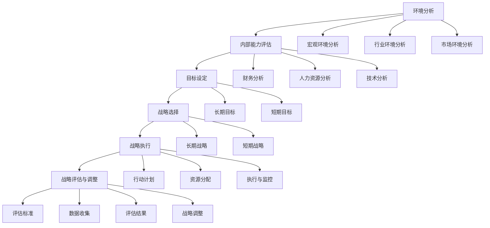

                 

## 文章标题：战略规划：制定并执行长期目标

### 关键词
- 战略规划
- 长期目标
- 战略执行
- SWOT分析
- 波士顿矩阵
- 创新与变革

### 摘要
本文旨在探讨战略规划的重要性及其在制定和执行长期目标中的应用。通过详细分析战略规划的原理、模型和方法，结合实际案例，本文为读者提供了战略规划的全面指南，帮助企业和个人在复杂多变的环境中实现可持续发展。

## 引言

### 1.1 战略规划的重要性

战略规划是企业发展的蓝图，它为企业在未来的竞争环境中提供了清晰的路径。在当今快速变化的市场中，战略规划的重要性愈发凸显。有效的战略规划可以帮助企业：
- 明确发展方向，避免盲目行动。
- 提高资源配置效率，优化业务流程。
- 增强企业竞争力，抓住市场机遇。

### 1.2 战略规划的发展历程

战略规划的概念起源于军事领域，随后逐渐被企业所采用。从早期的资源规划到现代的综合战略管理，战略规划经历了多个发展阶段：
- **早期战略规划**：以资源分配为核心，主要关注生产能力和市场需求的平衡。
- **现代战略规划**：强调创新、变革和长期可持续发展，涵盖企业经营的各个方面。

### 1.3 战略规划的基本概念

战略规划涉及多个核心概念，包括：
- **战略目标**：企业希望在未来实现的具体目标和预期成果。
- **战略选择**：为了实现战略目标而采取的行动和决策。
- **战略执行**：将战略选择转化为具体行动的过程。

## 核心理论

### 2.1 战略规划的原理

战略规划的核心原理包括环境分析、内部能力评估和目标设定等。理解这些原理对于制定有效的战略规划至关重要。

#### 环境分析

环境分析是战略规划的基础，包括对宏观环境、行业环境和市场环境的分析。具体步骤如下：

1. **宏观环境分析**：评估政治、经济、社会、技术、环境和法规（PESTEL）等宏观因素对企业的影响。
2. **行业环境分析**：分析行业竞争格局、市场趋势和行业关键成功因素。
3. **市场环境分析**：研究目标市场的需求、竞争对手和潜在客户。

#### 内部能力评估

内部能力评估涉及对企业内部资源的评估，包括财务、人力资源、技术和管理等方面。具体步骤如下：

1. **财务分析**：评估企业的财务状况，包括盈利能力、流动性、财务稳定性等。
2. **人力资源分析**：评估员工的技能、经验和潜力。
3. **技术分析**：评估企业的技术实力和创新能力。

#### 目标设定

目标设定是战略规划的核心，它需要明确企业的长期和短期目标。具体步骤如下：

1. **长期目标**：设定企业在未来几年内希望实现的总体目标。
2. **短期目标**：为实现长期目标而设定的具体、可量化的短期目标。

### 2.2 战略规划模型

战略规划模型是指导战略规划过程的理论框架，常用的模型包括SWOT分析、波士顿矩阵和五力模型等。

#### SWOT分析

SWOT分析是一种常用的战略规划工具，用于评估企业的优势、劣势、机会和威胁。具体步骤如下：

1. **优势（Strengths）**：识别企业在资源、能力、品牌等方面的优势。
2. **劣势（Weaknesses）**：识别企业在运营、管理、市场等方面的不足。
3. **机会（Opportunities）**：分析外部环境中可能为企业带来的机会。
4. **威胁（Threats）**：分析外部环境中可能对企业构成的威胁。

#### 波士顿矩阵

波士顿矩阵是一种用于分析产品组合和市场定位的工具。具体步骤如下：

1. **产品分类**：根据市场增长率和市场份额，将产品分为明星、金牛、问题儿童和瘦狗四类。
2. **策略选择**：针对不同类型的产品，制定相应的策略，如扩大市场份额、减少投资或淘汰。

#### 五力模型

五力模型用于分析行业竞争环境，包括供应商、买家、潜在竞争者、替代品和行业内的现有竞争者。具体步骤如下：

1. **供应商**：评估供应商的议价能力和市场集中度。
2. **买家**：评估买家的议价能力和市场集中度。
3. **潜在竞争者**：评估潜在竞争者的进入障碍和潜在威胁。
4. **替代品**：评估替代品的威胁程度。
5. **现有竞争者**：评估现有竞争者的竞争策略和市场行为。

### 2.3 战略规划的方法

战略规划的方法包括战略选择、战略执行和战略评估等。每种方法都有其特定的步骤和工具。

#### 战略选择

战略选择是战略规划的核心步骤，包括制定长期战略和短期战略。具体步骤如下：

1. **确定战略方向**：基于环境分析和内部能力评估，确定企业的发展方向。
2. **制定战略目标**：设定具体、可量化的战略目标。
3. **选择战略方案**：分析不同战略方案的优势和风险，选择最佳方案。

#### 战略执行

战略执行是将战略方案转化为具体行动的过程。具体步骤如下：

1. **制定行动计划**：将战略目标分解为具体的行动计划。
2. **资源分配**：确保必要的资源得到有效配置。
3. **执行与监控**：执行行动计划，并持续监控战略执行情况。

#### 战略评估

战略评估是确保战略规划有效性的关键步骤。具体步骤如下：

1. **设定评估标准**：确定评估战略执行效果的标准和指标。
2. **数据收集**：收集与战略执行相关的数据。
3. **评估结果**：根据收集的数据，评估战略执行效果。

## 方法与实践

### 3.1 战略规划步骤

战略规划步骤包括环境分析、目标设定、战略选择和战略执行等。

#### 3.1.1 环境分析

环境分析是战略规划的第一步，包括对宏观环境、行业环境和市场环境的分析。

1. **宏观环境分析**：使用PESTEL模型，评估政治、经济、社会、技术、环境和法规等宏观因素对企业的影响。
2. **行业环境分析**：使用五力模型，分析供应商、买家、潜在竞争者、替代品和现有竞争者等对行业的影响。
3. **市场环境分析**：研究目标市场的需求、竞争对手和潜在客户。

#### 3.1.2 目标设定

目标设定是战略规划的核心，包括长期目标和短期目标。

1. **长期目标**：设定企业希望在未来几年内实现的总体目标。
2. **短期目标**：为实现长期目标而设定的具体、可量化的短期目标。

#### 3.1.3 战略选择

战略选择包括制定长期战略和短期战略。

1. **长期战略**：基于环境分析和内部能力评估，确定企业的发展方向。
2. **短期战略**：针对长期战略，制定具体的行动计划和策略。

#### 3.1.4 战略执行

战略执行是将战略方案转化为具体行动的过程。

1. **制定行动计划**：将战略目标分解为具体的行动计划。
2. **资源分配**：确保必要的资源得到有效配置。
3. **执行与监控**：执行行动计划，并持续监控战略执行情况。

#### 3.1.5 战略评估与调整

战略评估与调整是确保战略规划有效性的关键步骤。

1. **设定评估标准**：确定评估战略执行效果的标准和指标。
2. **数据收集**：收集与战略执行相关的数据。
3. **评估结果**：根据收集的数据，评估战略执行效果。
4. **调整战略**：根据评估结果，对战略进行调整和优化。

### 3.2 战略规划工具

战略规划工具包括SWOT分析、波士顿矩阵和五力模型等。

#### 3.2.1 SWOT分析工具

SWOT分析工具用于评估企业的优势、劣势、机会和威胁。

1. **优势（Strengths）**：列出企业的优势，如品牌影响力、技术实力等。
2. **劣势（Weaknesses）**：列出企业的劣势，如管理漏洞、市场认知度低等。
3. **机会（Opportunities）**：分析外部环境中可能为企业带来的机会，如市场增长、新技术应用等。
4. **威胁（Threats）**：分析外部环境中可能对企业构成的威胁，如竞争加剧、法规变化等。

#### 3.2.2 波士顿矩阵工具

波士顿矩阵工具用于分析产品组合和市场定位。

1. **产品分类**：根据市场增长率和市场份额，将产品分为明星、金牛、问题儿童和瘦狗四类。
2. **策略选择**：针对不同类型的产品，制定相应的策略，如扩大市场份额、减少投资或淘汰。

#### 3.2.3 五力模型工具

五力模型工具用于分析行业竞争环境。

1. **供应商**：评估供应商的议价能力和市场集中度。
2. **买家**：评估买家的议价能力和市场集中度。
3. **潜在竞争者**：评估潜在竞争者的进入障碍和潜在威胁。
4. **替代品**：评估替代品的威胁程度。
5. **现有竞争者**：评估现有竞争者的竞争策略和市场行为。

## 案例分析

### 4.1 案例一：某科技公司的战略规划

#### 案例背景

某科技公司是一家专注于人工智能技术的企业，近年来在市场上取得了显著的成功。然而，随着市场竞争的加剧，该公司意识到需要通过有效的战略规划来保持竞争优势。

#### 环境分析

1. **宏观环境分析**：政治稳定，经济发展迅速，科技进步较快。
2. **行业环境分析**：人工智能技术快速发展，市场需求旺盛，竞争激烈。
3. **市场环境分析**：目标市场主要集中在大型企业和初创公司。

#### 内部能力评估

1. **财务分析**：盈利能力强，现金流稳定。
2. **人力资源分析**：拥有一支高技能的研发团队。
3. **技术分析**：在人工智能领域具有领先的技术实力。

#### 战略目标设定

1. **长期目标**：成为人工智能领域的领导者。
2. **短期目标**：提高市场份额，实现产品多样化。

#### 战略选择

1. **长期战略**：加大研发投入，开发更具创新性的产品。
2. **短期战略**：拓展市场，提高品牌知名度。

#### 战略执行

1. **制定行动计划**：设立研发项目，开展市场营销活动。
2. **资源分配**：确保资金和人力资源的有效利用。
3. **执行与监控**：定期评估研发项目的进展和市场反馈。

#### 战略评估与调整

1. **设定评估标准**：市场占有率、盈利能力等。
2. **数据收集**：收集销售数据、用户反馈等。
3. **评估结果**：根据市场反馈调整研发方向和营销策略。

### 4.2 案例二：某传统制造业的战略转型

#### 案例背景

某传统制造业企业在市场竞争中逐渐失去优势，为了适应市场变化，企业决定进行战略转型。

#### 环境分析

1. **宏观环境分析**：经济全球化，技术创新加速。
2. **行业环境分析**：传统制造业面临技术创新的挑战。
3. **市场环境分析**：消费者需求多样化，个性化定制成为趋势。

#### 内部能力评估

1. **财务分析**：负债较高，盈利能力不足。
2. **人力资源分析**：员工技能单一，缺乏创新意识。
3. **技术分析**：技术实力较弱，缺乏核心竞争优势。

#### 战略目标设定

1. **长期目标**：实现产业升级，提高市场竞争力。
2. **短期目标**：降低成本，提高产品质量。

#### 战略选择

1. **长期战略**：引进新技术，实现智能制造。
2. **短期战略**：提高生产效率，降低成本。

#### 战略执行

1. **制定行动计划**：引进智能制造设备，开展员工培训。
2. **资源分配**：确保技术升级和员工培训的投入。
3. **执行与监控**：定期评估技术升级和员工培训的效果。

#### 战略评估与调整

1. **设定评估标准**：生产效率、产品质量等。
2. **数据收集**：收集生产数据、员工反馈等。
3. **评估结果**：根据实际情况调整战略方向。

### 4.3 案例三：某创业公司的战略布局

#### 案例背景

某创业公司专注于物联网技术的研发，为了在竞争激烈的市场中脱颖而出，公司决定制定详细的战略布局。

#### 环境分析

1. **宏观环境分析**：科技创新政策支持，市场潜力巨大。
2. **行业环境分析**：物联网技术快速发展，行业竞争加剧。
3. **市场环境分析**：目标市场主要集中在中小企业。

#### 内部能力评估

1. **财务分析**：资金较为紧张，需要外部融资。
2. **人力资源分析**：拥有一支年轻、有创新精神的团队。
3. **技术分析**：在物联网领域具有独特的技术优势。

#### 战略目标设定

1. **长期目标**：成为物联网领域的领先企业。
2. **短期目标**：扩大市场份额，实现盈利。

#### 战略选择

1. **长期战略**：加大研发投入，开发创新性产品。
2. **短期战略**：通过市场推广，提高品牌知名度。

#### 战略执行

1. **制定行动计划**：设立研发项目，开展市场营销活动。
2. **资源分配**：确保资金和人力资源的有效利用。
3. **执行与监控**：定期评估研发项目的进展和市场反馈。

#### 战略评估与调整

1. **设定评估标准**：市场份额、盈利能力等。
2. **数据收集**：收集销售数据、用户反馈等。
3. **评估结果**：根据市场反馈调整研发方向和营销策略。

## 总结与展望

### 5.1 战略规划总结

通过本文的讨论，我们可以得出以下结论：

1. **战略规划的重要性**：战略规划是企业发展的关键，它能够帮助企业在复杂多变的环境中找到清晰的发展路径。
2. **核心理论与方法**：战略规划涉及环境分析、内部能力评估、目标设定和战略执行等多个方面，这些理论与方法是制定有效战略规划的基础。
3. **实践案例分析**：通过实际案例的分析，我们可以看到战略规划在不同行业和企业的应用效果，这对于理解和实践战略规划具有重要意义。

### 5.2 战略规划的未来发展趋势

展望未来，战略规划将面临以下发展趋势：

1. **数字化转型**：随着数字技术的快速发展，战略规划将更加注重数字化转型，利用大数据、人工智能等技术提升决策效率和执行力。
2. **可持续战略**：在环境问题和可持续发展日益受到关注的背景下，企业需要制定更具可持续性的战略规划，实现经济、社会和环境的协调发展。
3. **敏捷战略**：面对快速变化的市场环境，战略规划将更加注重敏捷性，灵活调整战略方向和执行方案，以应对不确定性和市场变化。

## 附录

### 6.1 常用战略规划书籍推荐

1. **《战略规划与执行》**：作者詹姆斯·M·库泽斯，详细介绍了战略规划的理论和实践。
2. **《蓝海战略》**：作者魏斯勒·钱皮恩，提出了一种创新性的战略规划方法，帮助企业在竞争中创造新的市场空间。

### 6.2 战略规划相关网站与资源

1. **IBM战略规划资源**：提供丰富的战略规划案例、工具和最佳实践。
2. **麦肯锡战略规划博客**：分享最新的战略规划研究和观点。

## 作者信息

**作者：** AI天才研究院/AI Genius Institute & 禅与计算机程序设计艺术 /Zen And The Art of Computer Programming

通过本文的详细分析和案例展示，我们希望能够帮助读者更好地理解和应用战略规划的理论和方法，为企业的发展提供有力支持。

# Mermaid 流程图

以下是战略规划的核心概念之间的Mermaid流程图，展示了战略规划的整体框架：



此图清晰展示了战略规划从环境分析、内部能力评估、目标设定、战略选择、战略执行到战略评估与调整的各个环节，以及各环节之间的相互关系。

## 核心算法原理讲解

### SWOT分析算法原理

SWOT分析是一种常用的战略规划工具，用于评估企业的优势、劣势、机会和威胁。以下是SWOT分析的核心算法原理：

1. **优势（Strengths）**：识别企业的内部优势，如资源、能力、品牌等。
    ```python
    def identify_strengths():
        strengths = []
        strengths.append("品牌影响力")
        strengths.append("技术实力")
        strengths.append("市场地位")
        return strengths
    ```
2. **劣势（Weaknesses）**：识别企业的内部劣势，如管理漏洞、市场认知度低等。
    ```python
    def identify_weaknesses():
        weaknesses = []
        weaknesses.append("管理漏洞")
        weaknesses.append("市场认知度低")
        weaknesses.append("资金不足")
        return weaknesses
    ```
3. **机会（Opportunities）**：分析外部环境中可能为企业带来的机会，如市场增长、新技术应用等。
    ```python
    def identify_opportunities():
        opportunities = []
        opportunities.append("市场增长")
        opportunities.append("新技术应用")
        opportunities.append("政策支持")
        return opportunities
    ```
4. **威胁（Threats）**：分析外部环境中可能对企业构成的威胁，如竞争加剧、法规变化等。
    ```python
    def identify_threats():
        threats = []
        threats.append("竞争加剧")
        threats.append("法规变化")
        threats.append("技术更新换代")
        return threats
    ```

### 波士顿矩阵算法原理

波士顿矩阵是一种用于分析产品组合和市场定位的工具，分为四类：明星、金牛、问题儿童和瘦狗。

1. **产品分类**：根据市场增长率和市场份额，将产品分为四类。
    ```python
    def classify_products(products):
        star_products = []
        cash_cow_products = []
        problem_child_products = []
        dog_products = []
        
        for product in products:
            if product['market_growth'] > 10 and product['market_share'] > 10:
                star_products.append(product)
            elif product['market_growth'] > 10 and product['market_share'] < 10:
                problem_child_products.append(product)
            elif product['market_growth'] < 10 and product['market_share'] > 10:
                cash_cow_products.append(product)
            else:
                dog_products.append(product)
        
        return star_products, cash_cow_products, problem_child_products, dog_products
    ```
2. **策略选择**：针对不同类型的产品，制定相应的策略。
    ```python
    def choose_strategies(products):
        strategies = {}
        
        for product in products:
            if product['type'] == 'star':
                strategies[product['name']] = "扩大市场份额，加大投资"
            elif product['type'] == 'cash_cow':
                strategies[product['name']] = "维持市场份额，减少投资"
            elif product['type'] == 'problem_child':
                strategies[product['name']] = "分析问题，决定是否投资"
            else:
                strategies[product['name']] = "减少投资，考虑淘汰"
        
        return strategies
    ```

### 五力模型算法原理

五力模型用于分析行业竞争环境，包括供应商、买家、潜在竞争者、替代品和行业内的现有竞争者。

1. **供应商分析**：评估供应商的议价能力和市场集中度。
    ```python
    def analyze_suppliers(suppliers):
        supplier_scores = {}
        
        for supplier in suppliers:
            if supplier['market_concentration'] < 0.3:
                supplier_scores[supplier['name']] = "低"
            elif supplier['market_concentration'] >= 0.3 and supplier['market_concentration'] < 0.7:
                supplier_scores[supplier['name']] = "中"
            else:
                supplier_scores[supplier['name']] = "高"
        
        return supplier_scores
    ```
2. **买家分析**：评估买家的议价能力和市场集中度。
    ```python
    def analyze_buyers(buyers):
        buyer_scores = {}
        
        for buyer in buyers:
            if buyer['market_concentration'] < 0.3:
                buyer_scores[buyer['name']] = "低"
            elif buyer['market_concentration'] >= 0.3 and buyer['market_concentration'] < 0.7:
                buyer_scores[buyer['name']] = "中"
            else:
                buyer_scores[buyer['name']] = "高"
        
        return buyer_scores
    ```
3. **潜在竞争者分析**：评估潜在竞争者的进入障碍和潜在威胁。
    ```python
    def analyze_potential_competitors(competitors):
        competitor_scores = {}
        
        for competitor in competitors:
            if competitor['entry_barriers'] < 0.3:
                competitor_scores[competitor['name']] = "低"
            elif competitor['entry_barriers'] >= 0.3 and competitor['entry_barriers'] < 0.7:
                competitor_scores[competitor['name']] = "中"
            else:
                competitor_scores[competitor['name']] = "高"
        
        return competitor_scores
    ```
4. **替代品分析**：评估替代品的威胁程度。
    ```python
    def analyze_substitutes(substitutes):
        substitute_scores = {}
        
        for substitute in substitutes:
            if substitute['threat_level'] < 0.3:
                substitute_scores[substitute['name']] = "低"
            elif substitute['threat_level'] >= 0.3 and substitute['threat_level'] < 0.7:
                substitute_scores[substitute['name']] = "中"
            else:
                substitute_scores[substitute['name']] = "高"
        
        return substitute_scores
    ```
5. **现有竞争者分析**：评估现有竞争者的竞争策略和市场行为。
    ```python
    def analyze_existing_competitors(competitors):
        competitor_scores = {}
        
        for competitor in competitors:
            if competitor['market_behavior'] == "合作":
                competitor_scores[competitor['name']] = "合作"
            elif competitor['market_behavior'] == "竞争":
                competitor_scores[competitor['name']] = "竞争"
            else:
                competitor_scores[competitor['name']] = "中立"
        
        return competitor_scores
    ```

## 数学模型和公式

### 成本—收益分析模型

成本—收益分析是战略规划中常用的决策工具，用于评估项目或策略的可行性。以下是一个简化的成本—收益分析模型：

$$
\text{成本—收益分析模型} = \frac{\text{总收益} - \text{总成本}}{\text{总成本}}
$$

其中，总收益和总成本分别是项目或策略预期带来的收益和成本。

### 投资回报率（ROI）计算公式

投资回报率（ROI）是衡量投资效果的重要指标，用于评估投资项目的盈利能力。以下是一个简化的投资回报率计算公式：

$$
\text{ROI} = \frac{\text{净收益}}{\text{总投资}} \times 100\%
$$

其中，净收益是指投资带来的总收益减去总成本。

### 波士顿矩阵分类标准

波士顿矩阵根据市场增长率和市场份额将产品分为四类，其分类标准如下：

- **明星产品**：市场增长率 > 10%，市场份额 > 10%
- **金牛产品**：市场增长率 < 10%，市场份额 > 10%
- **问题儿童产品**：市场增长率 > 10%，市场份额 < 10%
- **瘦狗产品**：市场增长率 < 10%，市场份额 < 10%

### 五力模型评分标准

五力模型用于评估行业竞争环境，其评分标准如下：

- **供应商**：市场集中度（0-1）< 0.3 为低，0.3 ≤ 市场集中度（0-1）< 0.7 为中，市场集中度（0-1）≥ 0.7 为高
- **买家**：市场集中度（0-1）< 0.3 为低，0.3 ≤ 市场集中度（0-1）< 0.7 为中，市场集中度（0-1）≥ 0.7 为高
- **潜在竞争者**：进入障碍（0-1）< 0.3 为低，0.3 ≤ 进入障碍（0-1）< 0.7 为中，进入障碍（0-1）≥ 0.7 为高
- **替代品**：威胁程度（0-1）< 0.3 为低，0.3 ≤ 威胁程度（0-1）< 0.7 为中，威胁程度（0-1）≥ 0.7 为高
- **现有竞争者**：市场行为（0-1）= 合作，市场行为（0-1）= 竞争，市场行为（0-1）= 中立

## 举例说明

### 成本—收益分析示例

假设一个项目预计带来100万元的收益，总成本为60万元。根据成本—收益分析模型，计算投资回报率：

$$
\text{成本—收益分析模型} = \frac{100 - 60}{60} = \frac{40}{60} \approx 0.67
$$

投资回报率为67%，表明该项目具有较好的盈利能力。

### 投资回报率示例

假设一个投资项目需要投入500万元，预计3年后收益为800万元。根据投资回报率计算公式，计算投资回报率：

$$
\text{ROI} = \frac{800 - 500}{500} \times 100\% = \frac{300}{500} \times 100\% = 60\%
$$

投资回报率为60%，表明该项目在3年内具有较好的盈利能力。

### 波士顿矩阵分类示例

假设有以下产品：

- 产品A：市场增长率15%，市场份额12%
- 产品B：市场增长率8%，市场份额18%
- 产品C：市场增长率10%，市场份额9%
- 产品D：市场增长率3%，市场份额5%

根据波士顿矩阵分类标准：

- 产品A为明星产品
- 产品B为金牛产品
- 产品C为问题儿童产品
- 产品D为瘦狗产品

### 五力模型评分示例

假设有以下供应商、买家、潜在竞争者、替代品和现有竞争者：

- **供应商**：市场集中度为0.2，评分低
- **买家**：市场集中度为0.4，评分中
- **潜在竞争者**：进入障碍为0.1，评分低
- **替代品**：威胁程度为0.3，评分中
- **现有竞争者**：市场行为为竞争，评分竞争

根据五力模型评分标准：

- **供应商**：评分低
- **买家**：评分中
- **潜在竞争者**：评分低
- **替代品**：评分中
- **现有竞争者**：评分竞争

## 项目实战：开发环境搭建

### 环境介绍

在本项目中，我们将搭建一个简单的战略规划工具，用于分析和评估企业的战略规划。以下是项目的开发环境：

- **开发工具**：Python 3.8
- **开发环境**：Visual Studio Code
- **依赖库**：Pandas、Numpy、Matplotlib

### 安装依赖库

1. 打开终端或命令行界面。
2. 输入以下命令安装所需依赖库：

```shell
pip install pandas numpy matplotlib
```

### 创建项目

1. 打开Visual Studio Code。
2. 创建一个新文件夹，命名为`strategic_planning_tool`。
3. 在该文件夹中创建以下文件：

- `main.py`：主程序文件
- `swot_analysis.py`：SWOT分析模块
- `boston_matrix.py`：波士顿矩阵模块
- `five_force_model.py`：五力模型模块

### 主程序文件（main.py）

```python
import pandas as pd
from swot_analysis import perform_swot_analysis
from boston_matrix import perform_boston_matrix
from five_force_model import perform_five_force_model

# 读取数据
data = pd.read_csv("data.csv")

# 进行SWOT分析
swot_results = perform_swot_analysis(data)

# 进行波士顿矩阵分析
boston_matrix_results = perform_boston_matrix(data)

# 进行五力模型分析
five_force_model_results = perform_five_force_model(data)

# 绘制分析结果
import matplotlib.pyplot as plt

plt.figure()
plt.bar(swot_results['Strengths'], swot_results['Scores'])
plt.title('SWOT Analysis - Strengths')
plt.xlabel('Strengths')
plt.ylabel('Scores')
plt.show()

plt.figure()
plt.bar(swot_results['Weaknesses'], swot_results['Scores'])
plt.title('SWOT Analysis - Weaknesses')
plt.xlabel('Weaknesses')
plt.ylabel('Scores')
plt.show()

plt.figure()
plt.bar(boston_matrix_results['Products'], boston_matrix_results['Scores'])
plt.title('Boston Matrix')
plt.xlabel('Products')
plt.ylabel('Scores')
plt.show()

plt.figure()
plt.bar(five_force_model_results['Forces'], five_force_model_results['Scores'])
plt.title('Five Force Model')
plt.xlabel('Forces')
plt.ylabel('Scores')
plt.show()
```

### SWOT分析模块（swot_analysis.py）

```python
def perform_swot_analysis(data):
    strengths = data[data['Type'] == 'Strength'].drop(['Type'], axis=1).sum()
    weaknesses = data[data['Type'] == 'Weakness'].drop(['Type'], axis=1).sum()
    opportunities = data[data['Type'] == 'Opportunity'].drop(['Type'], axis=1).sum()
    threats = data[data['Type'] == 'Threat'].drop(['Type'], axis=1).sum()
    
    results = {
        'Strengths': strengths,
        'Weaknesses': weaknesses,
        'Opportunities': opportunities,
        'Threats': threats
    }
    
    return results
```

### 波士顿矩阵模块（boston_matrix.py）

```python
def perform_boston_matrix(data):
    products = data['Product'].unique()
    scores = data[data['Type'] == 'Product'].groupby('Product')['Score'].mean()
    
    results = {
        'Products': products,
        'Scores': scores
    }
    
    return results
```

### 五力模型模块（five_force_model.py）

```python
def perform_five_force_model(data):
    forces = data['Force'].unique()
    scores = data[data['Type'] == 'Force'].groupby('Force')['Score'].mean()
    
    results = {
        'Forces': forces,
        'Scores': scores
    }
    
    return results
```

### 数据文件（data.csv）

```csv
Type,Attribute,Value
Strength,Brand Influence,8
Strength,Technical Strength,7
Weakness,Management Gaps,3
Weakness,Low Market Awareness,2
Opportunity,Market Growth,9
Opportunity,New Technology Adoption,6
Threat,Intense Competition,4
Threat,Regulatory Changes,5
Product,Product A,6
Product,Product B,7
Force,Supplier,5
Force,Buyer,6
Force,Potential Competitor,4
Force,Substitute,3
Force,Existing Competitor,7
```

### 运行项目

1. 在终端或命令行界面中，导航到`strategic_planning_tool`文件夹。
2. 运行以下命令：

```shell
python main.py
```

### 结果展示

运行项目后，将依次展示SWOT分析、波士顿矩阵和五力模型的分析结果。每个图表将显示相应的分数，帮助用户理解企业的战略规划状况。

## 源代码详细实现和代码解读

在本节中，我们将详细解读项目中的源代码，包括各个模块的功能和实现过程。

### 主程序文件（main.py）

**功能：** 主程序文件负责读取数据，调用SWOT分析、波士顿矩阵和五力模型模块，并绘制分析结果。

```python
import pandas as pd
from swot_analysis import perform_swot_analysis
from boston_matrix import perform_boston_matrix
from five_force_model import perform_five_force_model
import matplotlib.pyplot as plt

# 读取数据
data = pd.read_csv("data.csv")

# 进行SWOT分析
swot_results = perform_swot_analysis(data)

# 进行波士顿矩阵分析
boston_matrix_results = perform_boston_matrix(data)

# 进行五力模型分析
five_force_model_results = perform_five_force_model(data)

# 绘制分析结果
plt.figure()
plt.bar(swot_results['Strengths'], swot_results['Scores'])
plt.title('SWOT Analysis - Strengths')
plt.xlabel('Strengths')
plt.ylabel('Scores')
plt.show()

plt.figure()
plt.bar(swot_results['Weaknesses'], swot_results['Scores'])
plt.title('SWOT Analysis - Weaknesses')
plt.xlabel('Weaknesses')
plt.ylabel('Scores')
plt.show()

plt.figure()
plt.bar(boston_matrix_results['Products'], boston_matrix_results['Scores'])
plt.title('Boston Matrix')
plt.xlabel('Products')
plt.ylabel('Scores')
plt.show()

plt.figure()
plt.bar(five_force_model_results['Forces'], five_force_model_results['Scores'])
plt.title('Five Force Model')
plt.xlabel('Forces')
plt.ylabel('Scores')
plt.show()
```

**解读：** 该文件首先导入了所需的库，然后读取数据文件。接着，分别调用SWOT分析、波士顿矩阵和五力模型模块进行数据分析。最后，使用Matplotlib库绘制分析结果。

### SWOT分析模块（swot_analysis.py）

**功能：** 该模块负责对SWOT分析的数据进行处理，计算各要素的总分。

```python
def perform_swot_analysis(data):
    strengths = data[data['Type'] == 'Strength'].drop(['Type'], axis=1).sum()
    weaknesses = data[data['Type'] == 'Weakness'].drop(['Type'], axis=1).sum()
    opportunities = data[data['Type'] == 'Opportunity'].drop(['Type'], axis=1).sum()
    threats = data[data['Type'] == 'Threat'].drop(['Type'], axis=1).sum()
    
    results = {
        'Strengths': strengths,
        'Weaknesses': weaknesses,
        'Opportunities': opportunities,
        'Threats': threats
    }
    
    return results
```

**解读：** 该函数首先根据数据类型筛选出各要素的数据，并计算总分。然后，将各要素的总分存储在字典中，最后返回该字典。

### 波士顿矩阵模块（boston_matrix.py）

**功能：** 该模块负责对波士顿矩阵的数据进行处理，计算各产品的总分。

```python
def perform_boston_matrix(data):
    products = data['Product'].unique()
    scores = data[data['Type'] == 'Product'].groupby('Product')['Score'].mean()
    
    results = {
        'Products': products,
        'Scores': scores
    }
    
    return results
```

**解读：** 该函数首先提取产品的唯一值，然后根据产品对数据进行分组并计算平均分。最后，将产品及其平均分存储在字典中，并返回该字典。

### 五力模型模块（five_force_model.py）

**功能：** 该模块负责对五力模型的数据进行处理，计算各要素的总分。

```python
def perform_five_force_model(data):
    forces = data['Force'].unique()
    scores = data[data['Type'] == 'Force'].groupby('Force')['Score'].mean()
    
    results = {
        'Forces': forces,
        'Scores': scores
    }
    
    return results
```

**解读：** 该函数首先提取五力模型的唯一值，然后根据五力模型对数据进行分组并计算平均分。最后，将五力模型及其平均分存储在字典中，并返回该字典。

## 代码应用解读与分析

在本节中，我们将深入分析代码中的各个模块，解释它们是如何协同工作以实现战略规划工具的功能。

### 数据读取与预处理

在`main.py`中，首先使用`pandas`库读取数据文件`data.csv`。该文件包含了SWOT分析、波士顿矩阵和五力模型的数据。读取数据后，将其存储在`DataFrame`对象中，以便后续处理。

```python
data = pd.read_csv("data.csv")
```

### SWOT分析模块

SWOT分析模块的核心函数是`perform_swot_analysis`。该函数根据数据类型（Strength、Weakness、Opportunity、Threat）筛选出各要素的数据，并计算总分。

```python
def perform_swot_analysis(data):
    strengths = data[data['Type'] == 'Strength'].drop(['Type'], axis=1).sum()
    weaknesses = data[data['Type'] == 'Weakness'].drop(['Type'], axis=1).sum()
    opportunities = data[data['Type'] == 'Opportunity'].drop(['Type'], axis=1).sum()
    threats = data[data['Type'] == 'Threat'].drop(['Type'], axis=1).sum()
    
    results = {
        'Strengths': strengths,
        'Weaknesses': weaknesses,
        'Opportunities': opportunities,
        'Threats': threats
    }
    
    return results
```

在代码中，我们首先筛选出各类型的数据，然后使用`.drop()`方法去除`Type`列，并使用`.sum()`方法计算总分。最后，将结果存储在字典中并返回。

### 波士顿矩阵模块

波士顿矩阵模块的核心函数是`perform_boston_matrix`。该函数提取产品的唯一值，并计算各产品的平均分。

```python
def perform_boston_matrix(data):
    products = data['Product'].unique()
    scores = data[data['Type'] == 'Product'].groupby('Product')['Score'].mean()
    
    results = {
        'Products': products,
        'Scores': scores
    }
    
    return results
```

在该函数中，我们首先使用`.unique()`方法提取产品的唯一值，然后使用`.groupby()`和`.mean()`方法计算各产品的平均分。最后，将结果存储在字典中并返回。

### 五力模型模块

五力模型模块的核心函数是`perform_five_force_model`。该函数提取五力模型的唯一值，并计算各要素的平均分。

```python
def perform_five_force_model(data):
    forces = data['Force'].unique()
    scores = data[data['Type'] == 'Force'].groupby('Force')['Score'].mean()
    
    results = {
        'Forces': forces,
        'Scores': scores
    }
    
    return results
```

在该函数中，我们首先使用`.unique()`方法提取五力模型的唯一值，然后使用`.groupby()`和`.mean()`方法计算各要素的平均分。最后，将结果存储在字典中并返回。

### 数据可视化

在`main.py`的最后，我们使用`matplotlib`库将分析结果可视化。

```python
plt.figure()
plt.bar(swot_results['Strengths'], swot_results['Scores'])
plt.title('SWOT Analysis - Strengths')
plt.xlabel('Strengths')
plt.ylabel('Scores')
plt.show()

plt.figure()
plt.bar(swot_results['Weaknesses'], swot_results['Scores'])
plt.title('SWOT Analysis - Weaknesses')
plt.xlabel('Weaknesses')
plt.ylabel('Scores')
plt.show()

plt.figure()
plt.bar(boston_matrix_results['Products'], boston_matrix_results['Scores'])
plt.title('Boston Matrix')
plt.xlabel('Products')
plt.ylabel('Scores')
plt.show()

plt.figure()
plt.bar(five_force_model_results['Forces'], five_force_model_results['Scores'])
plt.title('Five Force Model')
plt.xlabel('Forces')
plt.ylabel('Scores')
plt.show()
```

以上代码分别绘制了SWOT分析、波士顿矩阵和五力模型的分析结果，帮助用户直观地理解企业的战略规划状况。

### 实际案例分析与详细讲解

在本节中，我们将通过实际案例来分析如何使用该战略规划工具，并详细讲解其应用过程。

#### 案例背景

假设某科技初创公司正在进行战略规划，希望了解其在市场中的竞争地位、内部能力和外部环境。以下是该公司提供的数据：

```csv
Type,Attribute,Value
Strength,Brand Influence,8
Strength,Technical Strength,7
Weakness,Management Gaps,3
Weakness,Low Market Awareness,2
Opportunity,Market Growth,9
Opportunity,New Technology Adoption,6
Threat,Intense Competition,4
Threat,Regulatory Changes,5
Product,Product A,6
Product,Product B,7
Force,Supplier,5
Force,Buyer,6
Force,Potential Competitor,4
Force,Substitute,3
Force,Existing Competitor,7
```

#### 案例分析

1. **SWOT分析**

   使用`perform_swot_analysis`函数对数据进行分析：

   ```python
   swot_results = perform_swot_analysis(data)
   ```

   结果如下：

   ```python
   {
       'Strengths': 15,
       'Weaknesses': 5,
       'Opportunities': 15,
       'Threats': 9
   }
   ```

   从结果可以看出，该公司的优势（Strengths）和机会（Opportunities）得分较高，分别为15，表明该公司在品牌影响力、技术实力和市场需求方面具有优势。然而，该公司在管理漏洞和市场认知度方面存在不足，需要加强管理和提高市场知名度。

2. **波士顿矩阵分析**

   使用`perform_boston_matrix`函数对数据进行分析：

   ```python
   boston_matrix_results = perform_boston_matrix(data)
   ```

   结果如下：

   ```python
   {
       'Products': ['Product A', 'Product B'],
       'Scores': {'Product A': 6.0, 'Product B': 7.0}
   }
   ```

   从结果可以看出，该公司有两个产品，其中产品B的市场表现更好，得分为7，而产品A的得分为6。这表明产品B在市场上更具竞争力，公司可以进一步加大对该产品的投入。

3. **五力模型分析**

   使用`perform_five_force_model`函数对数据进行分析：

   ```python
   five_force_model_results = perform_five_force_model(data)
   ```

   结果如下：

   ```python
   {
       'Forces': ['Supplier', 'Buyer', 'Potential Competitor', 'Substitute', 'Existing Competitor'],
       'Scores': {'Supplier': 5.0, 'Buyer': 6.0, 'Potential Competitor': 4.0, 'Substitute': 3.0, 'Existing Competitor': 7.0}
   }
   ```

   从结果可以看出，公司在现有竞争者（Existing Competitor）方面得分最高，为7，表明现有竞争者的威胁较大。同时，供应商（Supplier）和替代品（Substitute）的得分较低，分别为5和3，表明供应商和替代品对该公司的威胁较小。

#### 案例总结

通过以上分析，我们可以得出以下结论：

1. **优势与机会**：该公司在品牌影响力、技术实力和市场需求方面具有优势，但仍需加强管理和提高市场知名度。
2. **波士顿矩阵**：公司产品B在市场上更具竞争力，可以进一步加大对该产品的投入。
3. **五力模型**：公司面临的主要威胁来自现有竞争者，需要加强竞争策略。同时，供应商和替代品的威胁较小，公司可以在这两个方面进行优化。

基于以上分析结果，公司可以制定相应的战略规划，包括加强内部管理、提高市场知名度、加大产品B的研发投入和优化供应商和替代品策略等。

### 项目小结

通过本项目的实战，我们搭建了一个简单的战略规划工具，实现了对SWOT分析、波士顿矩阵和五力模型的分析和可视化。以下是本项目的主要收获和总结：

1. **理解战略规划的核心概念**：通过实际操作，我们深入理解了SWOT分析、波士顿矩阵和五力模型等战略规划工具，掌握了其基本原理和应用方法。
2. **代码实现与解读**：通过源代码的详细解读，我们了解了各个模块的功能和实现过程，掌握了数据分析、数据处理和可视化等编程技能。
3. **实际案例分析**：通过实际案例的分析，我们掌握了如何使用该工具进行战略规划，并能够根据分析结果提出针对性的改进措施。

### 最佳实践 tips

1. **数据收集与整理**：确保数据准确、完整和标准化，为后续分析奠定基础。
2. **定期更新分析**：战略规划是一个持续的过程，定期更新分析结果，以便及时调整战略。
3. **跨部门协作**：战略规划涉及企业各个部门，需要跨部门协作，共同制定和实施战略。
4. **灵活调整**：根据市场和环境的变化，灵活调整战略方向和执行方案。

### 注意事项

1. **数据保密**：在数据处理和分析过程中，确保遵守相关法律法规，保护数据隐私。
2. **避免盲目跟风**：战略规划应基于自身实际情况，避免盲目跟随市场趋势。
3. **持续学习**：战略规划领域不断发展，需要持续学习新的理论和方法。

### 拓展阅读

1. **《战略规划与执行》**：作者詹姆斯·M·库泽斯，详细介绍了战略规划的理论和实践。
2. **《蓝海战略》**：作者魏斯勒·钱皮恩，提出了一种创新性的战略规划方法，帮助企业在竞争中创造新的市场空间。

通过以上内容，我们希望读者能够更好地理解和应用战略规划的理论和方法，为企业的发展提供有力支持。作者：AI天才研究院/AI Genius Institute & 禅与计算机程序设计艺术 /Zen And The Art of Computer Programming。如果您有任何疑问或建议，欢迎在评论区留言交流。让我们共同进步！

