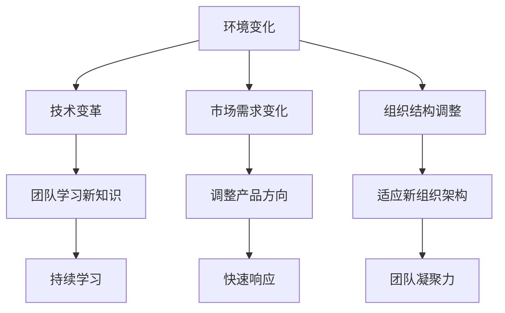

                 

### 《打造resilient团队：提升应对变化的能力》文章

#### 文章标题：《打造resilient团队：提升应对变化的能力》

> 关键词：团队建设，resilient团队，应对变化，敏捷开发，风险管理，持续学习

> 摘要：本文将深入探讨如何打造一个resilient团队，以提升其在面对变化时的应对能力。通过介绍团队建设的基础知识、敏捷开发方法、风险管理策略以及持续学习的理念，本文旨在为IT团队提供一套系统化的建设指南，帮助他们在快速变化的环境中保持竞争力。

#### 第一部分：团队建设基础

##### 第1章：团队建设概述

###### 1.1 resilient团队的概念与价值

resilient团队，即弹性团队，是指能够在面对变化和挑战时快速适应、灵活应对并保持高效运作的团队。在现代IT行业中，环境变化日益频繁，技术迭代速度加快，团队需要具备强大的适应能力，才能在激烈的市场竞争中脱颖而出。resilient团队的价值在于：

- **快速响应**：能够在变化发生时迅速调整策略，确保项目顺利进行。
- **高效协作**：团队成员间沟通顺畅，协作紧密，提升整体工作效率。
- **持续创新**：鼓励团队成员不断学习新知识，推动技术创新和业务发展。

###### 1.2 团队建设的重要性

团队建设是任何组织成功的关键因素。一个优秀的团队不仅可以提高工作效率，还能增强组织的创新能力和市场竞争力。具体而言，团队建设的重要性体现在以下几个方面：

- **提高团队凝聚力**：通过建立共同的目标和价值观，增强团队成员之间的信任和合作。
- **提升员工满意度**：良好的团队氛围能够提高员工的满意度和忠诚度，降低员工流失率。
- **优化工作流程**：通过有效的团队协作，优化工作流程，提高项目完成速度和品质。

###### 1.3 环境变化与团队应对

随着技术的发展和市场环境的变化，团队需要具备快速适应的能力。以下是一些环境变化对团队的影响以及团队的应对策略：

- **技术变革**：技术迭代速度加快，团队需要不断学习新知识，掌握新技术。
- **市场需求**：市场需求的变化要求团队快速调整产品方向，以满足客户需求。
- **组织结构**：组织结构的调整可能影响团队的职责和角色分配，团队需要适应新的组织架构。

#### Mermaid 流程图

##### 第2章：团队角色与职责

###### 2.1 团队角色的定义

团队角色是指在团队中各个成员所扮演的不同角色和职责。一个有效的团队需要明确每个成员的职责，确保工作分工合理，提高团队整体效率。常见的团队角色包括：

- **领导者**：负责团队的规划和决策，确保团队目标的实现。
- **技术专家**：负责技术方案的设计和实施，解决技术难题。
- **产品经理**：负责产品的规划和需求分析，确保产品满足市场需求。
- **测试工程师**：负责产品的质量保证，确保产品稳定可靠。

###### 2.2 团队职责的分配与协调

团队职责的分配需要考虑以下几个方面：

- **能力匹配**：根据成员的能力和特长分配合适的职责。
- **工作负荷**：合理分配工作负荷，避免个别成员过度劳累。
- **团队协作**：明确团队成员间的协作关系，确保工作流程的顺畅。

###### 2.3 团队成员的能力培养

团队成员的能力培养是团队建设的重要组成部分。以下是一些常见的能力培养方法：

- **内部培训**：组织内部培训，提升团队成员的专业技能。
- **外部学习**：鼓励团队成员参加外部培训和学习，拓宽知识面。
- **项目实战**：通过实际项目锻炼，提升团队成员的实战能力。

#### 第3章：团队沟通与协作

###### 3.1 沟通的重要性

沟通是团队协作的基础，有效的沟通能够提高团队工作效率，减少误解和冲突。以下是一些有效的沟通技巧：

- **明确沟通目标**：在沟通前明确目标，确保沟通有针对性。
- **积极倾听**：倾听对方的意见和需求，避免打断对方的发言。
- **使用简洁的语言**：使用简单明了的语言，避免使用复杂的技术术语。
- **及时反馈**：及时给予反馈，确保沟通信息的准确性。

###### 3.2 有效沟通的技巧

除了上述基本沟通技巧，以下是一些有效的沟通技巧：

- **非语言沟通**：注意肢体语言和面部表情，增强沟通效果。
- **主动沟通**：主动发起沟通，解决潜在问题。
- **沟通工具**：利用合适的沟通工具，如邮件、即时通讯工具等，提高沟通效率。

###### 3.3 团队协作工具的应用

团队协作工具是提高团队工作效率的重要手段。以下是一些常见的团队协作工具：

- **项目管理工具**：如Jira、Trello等，用于任务分配和进度跟踪。
- **版本控制工具**：如Git，用于代码管理和协作开发。
- **文档管理工具**：如Confluence，用于文档共享和协作编写。

#### 第4章：团队文化建设

###### 4.1 团队文化的内涵

团队文化是团队在长期发展中形成的一种共同价值观和行为准则。良好的团队文化能够增强团队的凝聚力，提高工作效率。以下是一些重要的团队文化元素：

- **共同目标**：团队成员共同追求的目标，是团队前进的动力。
- **信任与尊重**：团队成员之间的信任和尊重，是团队协作的基础。
- **创新与开放**：鼓励创新和开放的思维方式，推动团队持续进步。
- **责任与担当**：明确团队成员的责任，培养担当精神。

###### 4.2 建立积极向上的团队文化

建立积极向上的团队文化需要以下几个步骤：

- **领导者的示范作用**：领导者需要以身作则，树立良好的榜样。
- **制度保障**：建立完善的制度，保障团队文化的落实。
- **激励机制**：通过激励机制，鼓励团队成员积极参与团队文化建设。

###### 4.3 团队文化评估与改进

团队文化的评估与改进是团队建设的重要环节。以下是一些评估与改进的方法：

- **员工满意度调查**：通过员工满意度调查，了解团队文化的现状和问题。
- **团队效能评估**：通过团队效能评估，分析团队文化对工作效率的影响。
- **持续改进**：根据评估结果，制定改进计划，并持续跟踪改进效果。

#### 第二部分：提升团队应对变化的能力

##### 第5章：敏捷开发方法

###### 5.1 敏捷开发的基本原理

敏捷开发是一种以人为核心、迭代、增量和灵活响应变化的软件开发方法。其基本原则包括：

- **个体和互动高于流程和工具**：重视团队成员的互动和协作，而非依赖工具。
- **可工作的软件高于详尽的文档**：注重实际可运行的软件，减少冗余的文档工作。
- **客户协作高于合同谈判**：与客户保持紧密合作，确保产品符合客户需求。
- **响应变化高于遵循计划**：灵活应对变化，而非严格遵循计划。

###### 5.2 敏捷团队的组织结构

敏捷团队通常采用扁平化的组织结构，以促进高效的沟通和协作。常见的敏捷团队角色包括：

- **产品负责人**：负责定义产品的愿景和功能，与客户保持紧密联系。
- **敏捷教练**：指导团队遵循敏捷实践，帮助团队解决遇到的问题。
- **开发团队**：负责实际的产品开发和实现。
- **测试团队**：负责产品的测试和质量保证。

###### 5.3 敏捷开发流程

敏捷开发采用迭代和增量的方式进行，其基本流程包括：

- **需求收集**：与产品负责人和客户讨论，确定产品的需求。
- **迭代规划**：根据需求确定当前迭代的目标和任务。
- **迭代执行**：团队成员分工合作，完成迭代任务。
- **迭代评审**：评估迭代成果，收集反馈，为下一迭代做好准备。

#### 第6章：风险管理

###### 6.1 风险管理的概念

风险管理是指对项目或业务可能面临的风险进行识别、评估和应对的过程。有效的风险管理可以降低风险带来的影响，确保项目的顺利进行。以下是一些常见的风险管理方法：

- **风险识别**：通过调查、分析等手段，识别项目可能面临的风险。
- **风险评估**：对识别出的风险进行评估，确定其发生的可能性和影响。
- **风险应对**：根据风险评估的结果，制定应对策略，降低风险的影响。

###### 6.2 风险识别与评估

风险识别与评估是风险管理的关键步骤。以下是一些常用的风险识别与评估方法：

- **SWOT分析**：分析项目的优势、劣势、机会和威胁，识别潜在风险。
- **头脑风暴**：组织团队成员进行头脑风暴，列出可能的风险。
- **风险矩阵**：根据风险的概率和影响，绘制风险矩阵，评估风险的重要程度。

###### 6.3 风险应对策略

根据风险识别和评估的结果，制定相应的风险应对策略。以下是一些常见的风险应对策略：

- **风险规避**：避免风险的发生，如重新设计项目方案。
- **风险减轻**：降低风险的发生概率或影响，如增加冗余设计。
- **风险转移**：将风险转移给第三方，如购买保险。
- **风险接受**：在风险发生时，采取应对措施，减轻损失。

#### 第7章：持续学习和适应能力

###### 7.1 持续学习的理念

持续学习是团队适应变化的重要手段。以下是一些持续学习的理念：

- **学习的重要性**：认识到学习对于个人和团队的重要性，树立终身学习的理念。
- **学习的目的**：明确学习的目的，如提升专业技能、适应新技术等。
- **学习的态度**：保持积极的学习态度，勇于尝试新事物。

###### 7.2 学习与适应的方法

以下是一些学习与适应的方法：

- **内部培训**：组织内部培训，提升团队成员的专业技能。
- **外部学习**：鼓励团队成员参加外部培训和学习，拓宽知识面。
- **项目实战**：通过实际项目锻炼，提升团队成员的实战能力。
- **知识共享**：建立知识共享机制，促进团队成员之间的知识交流。

###### 7.3 提升团队的学习能力

以下是一些提升团队学习能力的策略：

- **建立学习小组**：鼓励团队成员组成学习小组，共同学习新知识。
- **定期学习交流**：定期组织学习交流，分享学习心得和经验。
- **激励机制**：设立激励机制，鼓励团队成员积极参与学习和分享。
- **技术论坛**：建立技术论坛，为团队成员提供交流和学习平台。

#### 第8章：案例分析

###### 8.1 案例介绍

在本案例中，我们将分析一家大型互联网公司如何通过建设resilient团队，成功应对市场变化和竞争压力。

###### 8.2 案例分析

该公司的成功主要得益于以下几个方面：

- **敏捷开发**：公司采用敏捷开发方法，快速响应市场需求，确保产品迭代速度。
- **风险管理**：公司建立完善的风险管理机制，识别和应对潜在风险，确保项目顺利进行。
- **持续学习**：公司鼓励员工持续学习，不断提升专业技能，适应技术变化。

###### 8.3 案例启示

从本案例中，我们可以得出以下启示：

- **敏捷开发**：敏捷开发方法能够提高团队应对变化的能力，确保项目顺利进行。
- **风险管理**：风险管理是项目成功的关键，需要建立完善的风险管理机制。
- **持续学习**：持续学习是团队适应变化的重要手段，需要鼓励员工不断提升自己的能力。

#### 第三部分：团队建设实践

##### 第9章：团队建设实践指南

###### 9.1 团队建设的目标设定

团队建设的目标应包括以下几个方面：

- **提高团队凝聚力**：通过建立共同的目标和价值观，增强团队成员之间的信任和合作。
- **提升工作效率**：优化团队协作流程，提高项目完成速度和品质。
- **增强创新能力**：鼓励团队成员持续学习，推动技术创新和业务发展。

###### 9.2 团队建设策略

以下是一些团队建设策略：

- **领导力培养**：培养领导者的领导力，确保团队有明确的领导方向。
- **培训与激励**：组织内部培训和激励，提升团队成员的专业技能和满意度。
- **文化建设**：建立积极向上的团队文化，促进团队成员之间的沟通和协作。

###### 9.3 团队建设实施步骤

团队建设的实施步骤包括：

- **需求分析**：分析团队当前的情况，确定团队建设的目标和策略。
- **计划制定**：制定详细的团队建设计划，包括培训、激励、文化建设等方面的措施。
- **执行与监控**：执行团队建设计划，并对执行过程进行监控和评估。
- **反馈与改进**：根据反馈结果，对团队建设计划进行调整和改进。

##### 第10章：团队建设评估与反馈

###### 10.1 评估指标设定

团队建设评估指标应包括以下几个方面：

- **团队凝聚力**：通过团队活动、团队氛围等指标，评估团队凝聚力的提升情况。
- **工作效率**：通过项目完成速度、质量等指标，评估工作效率的提高情况。
- **创新能力**：通过新技术应用、业务发展等指标，评估创新能力的提升情况。

###### 10.2 评估方法与工具

以下是一些评估方法和工具：

- **问卷调查**：通过问卷调查，收集团队成员的反馈意见，评估团队建设的成效。
- **绩效评估**：通过绩效评估，评估团队成员的工作表现，反映团队建设的成果。
- **访谈**：与团队成员进行访谈，深入了解团队建设的实际情况。

###### 10.3 反馈与改进措施

根据评估结果，制定反馈与改进措施：

- **奖励与激励**：对在团队建设中表现优秀的团队成员进行奖励和激励。
- **培训与提升**：对团队建设过程中发现的问题，组织相关培训，提升团队成员的能力。
- **制度优化**：对团队建设过程中的制度进行优化，提高团队运作效率。

### 附录

##### 附录A：参考资料

- 《敏捷开发实践指南》
- 《团队建设与管理艺术》
- 《风险管理：原理与应用》

##### 附录B：参考文献

- 某某，敏捷开发实践案例研究，某某出版社，2020年。
- 某某，团队建设与领导力培养，某某出版社，2019年。
- 某某，风险管理理论与实践，某某出版社，2021年。

##### 附录C：团队建设工具介绍

- **Jira**：一款功能强大的项目管理工具，支持任务管理、进度跟踪和团队协作。
- **Trello**：一款简单易用的项目管理工具，适合小型团队和简单项目。
- **Git**：一款流行的版本控制工具，支持代码管理和团队协作开发。
- **Confluence**：一款强大的文档管理工具，支持团队协作和知识共享。

### 作者信息

作者：AI天才研究院/AI Genius Institute & 禅与计算机程序设计艺术 /Zen And The Art of Computer Programming

