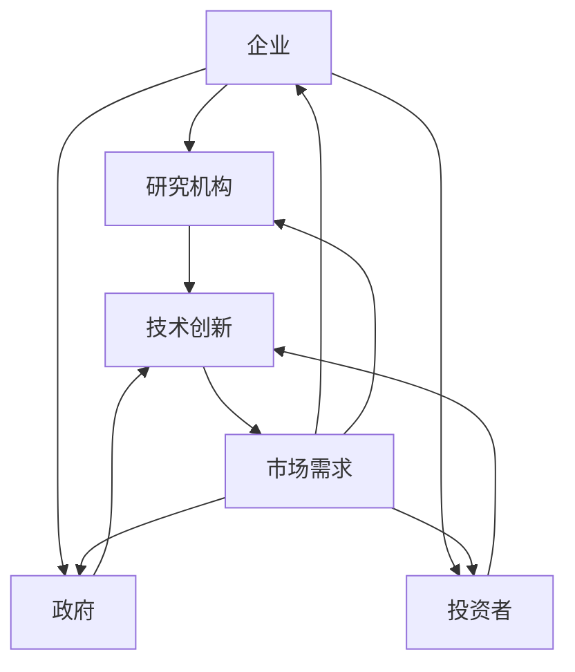

                 


### 第一部分：概念与理论

#### 第1章：创新生态系统的核心概念

**1.1 创新生态系统的定义**

创新生态系统是一种复杂的网络结构，它由多个参与主体（包括企业、研究机构、政府、投资者等）组成，共同推动创新活动的发生和发展。创新生态系统是一个相互依存、相互影响的社会系统，它的核心目标是促进创新资源的有效配置和共享，加速创新成果的转化和应用。

**核心概念与联系**

为了更好地理解创新生态系统的概念，我们可以借助一个Mermaid流程图来展示其中的核心组成部分和它们之间的相互关系：



在这个流程图中，企业、研究机构、政府、投资者等都是创新生态系统的关键参与主体，它们共同作用于技术创新和市场需求，形成一个闭合的循环系统。

**1.2 创新生态系统的组成部分**

创新生态系统由以下几个关键组成部分构成：

1. **创新环境**：包括政策环境、经济环境、文化环境等，为创新活动提供必要的支持和保障。
2. **创新主体**：包括企业、研究机构、个人等，它们是创新活动的执行者。
3. **创新资源**：包括资金、技术、人才、信息等，是创新活动的基础和动力。
4. **创新机制**：包括制度安排、激励机制、合作机制等，为创新活动的顺利进行提供保障。

**1.3 创新生态系统的原理**

创新生态系统遵循以下几个基本原理：

1. **协同创新原理**：强调各参与方之间的合作与资源共享，通过协同作用实现创新的最大化。
2. **动态演化原理**：创新生态系统是一个不断演化的系统，它随着外部环境和内部因素的变化而调整和优化。
3. **可持续性原理**：创新生态系统需要考虑长期发展的可持续性，确保创新活动的持续性和稳定性。

**1.4 创新生态系统的模型**

一个典型的创新生态系统模型可以包括以下几个关键环节：

1. **需求识别**：通过市场调研、用户反馈等方式，识别出潜在的市场需求。
2. **创新构思**：基于需求识别的结果，进行创新思路的构思和筛选。
3. **技术研发**：将创新构思转化为具体的技术方案，并进行研发和实验。
4. **成果转化**：将研发成果转化为实际的产品或服务，推向市场。
5. **市场反馈**：收集市场反馈，对创新成果进行改进和优化。

通过以上几个环节的相互作用，创新生态系统得以实现创新资源的有效配置和共享，推动创新活动的持续发展和进步。

### 第2章：创新生态系统的构建原理

**2.1 创新生态系统与组织文化**

组织文化是创新生态系统的重要组成部分，它对创新活动的推动起着至关重要的作用。一个开放、合作、创新的组织文化能够激发员工的创新潜力，促进创新生态系统的建设。

**文化因素**

1. **开放性**：鼓励员工之间的沟通与交流，打破信息壁垒，促进知识共享。
2. **合作性**：强调团队协作，鼓励跨部门、跨领域的合作，形成合力。
3. **创新性**：鼓励员工敢于尝试新想法、新方法，勇于突破传统思维模式。

**影响**

组织文化对创新生态系统的影响主要体现在以下几个方面：

1. **创新氛围**：良好的组织文化能够营造一种积极向上的创新氛围，激发员工的创新热情。
2. **创新能力**：通过培养开放、合作、创新的文化，提高组织的创新能力。
3. **创新成果**：良好的组织文化能够促进创新成果的产生，推动创新生态系统的可持续发展。

**2.2 创新生态系统与领导力**

领导力在创新生态系统的构建中起着关键作用。领导者的决策、沟通、激励等行为对创新生态系统的运行和发展具有重要影响。

**领导力因素**

1. **愿景**：领导者需要具备清晰的创新愿景，指引组织朝着正确的方向发展。
2. **决策**：领导者需要具备敏锐的洞察力和果断的决策能力，确保创新项目的顺利推进。
3. **沟通**：领导者需要具备良好的沟通能力，及时传达创新目标和任务，协调各方资源。
4. **激励**：领导者需要制定有效的激励机制，激发员工的创新动力。

**领导力在创新生态系统中的作用**

1. **引导创新方向**：领导者通过制定创新战略，明确创新目标和方向，引领组织发展。
2. **推动创新实践**：领导者通过有效的沟通和激励，推动创新项目的实施，确保创新成果的落地。
3. **优化创新环境**：领导者通过优化组织文化和管理制度，为创新活动提供良好的环境和支持。

#### 2.3 创新生态系统与资源管理

创新生态系统的构建离不开资源的有效管理和配置。资源管理是创新生态系统运行的核心环节，它关系到创新活动的成败。

**资源管理**

1. **资金管理**：确保创新项目有充足的资金支持，避免因资金短缺而影响创新进程。
2. **技术管理**：充分利用现有的技术资源，进行技术整合和优化，提高创新能力。
3. **人才管理**：引进和培养具有创新能力和专业知识的人才，为创新活动提供人力支持。
4. **信息管理**：建立完善的信息管理体系，确保信息的及时传递和共享，提高创新效率。

**资源管理的重要性**

1. **提高创新效率**：通过有效的资源管理，提高创新活动的效率，缩短创新周期。
2. **降低创新风险**：合理的资源分配和风险管理，可以降低创新项目的风险，提高成功率。
3. **优化创新生态**：资源管理是创新生态系统的基石，它关系到创新生态系统的稳定和可持续发展。

**2.4 创新生态系统与组织学习**

创新生态系统是一个动态变化的过程，组织学习在其中起着至关重要的作用。组织学习能够帮助组织适应外部环境的变化，提高创新能力和竞争力。

**组织学习**

1. **知识积累**：通过不断学习和积累知识，组织可以不断提升自身的创新能力。
2. **经验分享**：鼓励员工分享创新经验和教训，促进知识的传播和共享。
3. **持续改进**：组织学习不仅包括知识的学习，还包括对创新过程的持续改进，以提高创新效果。

**组织学习的重要性**

1. **提升创新能力**：组织学习可以帮助组织不断突破创新瓶颈，提高创新能力。
2. **增强竞争力**：通过组织学习，组织可以不断提升自身的核心竞争力，在激烈的市场竞争中立于不败之地。
3. **实现可持续发展**：组织学习是创新生态系统可持续发展的关键，它能够帮助组织适应不断变化的外部环境，实现长期发展。

### 总结

创新生态系统是一个复杂而动态的系统，它需要各个参与方的共同努力和协作。从组织文化、领导力、资源管理到组织学习，每一个环节都是创新生态系统构建的关键。只有通过这些环节的有效配合和相互促进，才能打造出一个具有强大生命力和可持续发展的创新生态系统。在接下来的章节中，我们将进一步探讨创新生态系统的构建原则和实践方法，以帮助读者更好地理解和应用这一概念。

----------------------------------------------------------------

# 打造创新生态系统：从idea到implementation

## 第二部分：实践与方法

### 第3章：从Idea到Implementation的策略

#### 3.1 创新思维工具与方法

创新思维是创新生态系统中的核心要素，它决定了创新活动的质量和效率。以下是一些常用的创新思维工具与方法：

**1. 头脑风暴**

头脑风暴是一种通过集体讨论产生大量创意的方法。它可以激发团队的创造力，将不同领域的知识和经验融合在一起，从而产生新的创新思路。

**2. SWOT分析**

SWOT分析是一种用于评估创新项目优势、劣势、机会和威胁的方法。通过SWOT分析，可以全面了解创新项目的内外部环境，为创新决策提供依据。

**3. TRIZ理论**

TRIZ（理论问题解决方法）是一种基于科学原理和创新方法的创新理论。它提供了一套系统的方法，帮助人们解决复杂的技术问题。

**4. 设计思维**

设计思维是一种以用户为中心的创新方法。它强调用户体验的重要性，通过不断迭代和改进，创造出满足用户需求的产品或服务。

**5. 平行思维**

平行思维是一种通过多个维度思考问题，寻找创新解决方案的方法。它可以打破传统思维的限制，创造出全新的创新思路。

**伪代码：头脑风暴算法**

```python
def brainstorming_topics(problem):
    topics = []
    for i in range(number_of_people):
        person = get_person(i)
        topic = person.generate_idea(problem)
        topics.append(topic)
    return topics

def get_person(i):
    # 根据实际情况返回参与者
    pass

def generate_idea(problem):
    # 根据问题生成创意
    pass
```

**3.2 创新项目的管理与实践**

创新项目的管理是确保创新活动顺利进行的关键。以下是一些创新项目管理的最佳实践：

**1. 项目计划**

制定详细的项目计划，明确项目目标、时间表、资源和风险等。项目计划应该具有灵活性和可调整性，以应对项目中的不确定性。

**2. 团队协作**

建立高效的团队协作机制，确保团队成员之间的沟通畅通，共同推动项目进展。可以使用项目管理工具，如JIRA、Trello等，来跟踪项目进度和任务分配。

**3. 风险管理**

识别项目中的潜在风险，制定相应的风险应对策略。风险管理应该贯穿整个项目周期，及时调整项目计划，以降低风险对项目的影响。

**4. 沟通与协作**

定期召开项目会议，汇报项目进展，解决项目中出现的问题。鼓励团队成员之间的沟通与协作，共同面对挑战。

**5. 项目评估**

项目完成后，进行全面的评估，总结项目经验教训，为未来项目提供参考。项目评估应该包括项目目标达成情况、资源利用效率、团队协作效果等方面。

**3.3 创新过程中的风险管理与应对**

创新过程中，风险是不可避免的。有效的风险管理和应对策略可以降低风险对项目的负面影响，确保创新活动的顺利进行。

**1. 风险识别**

在项目启动阶段，通过问卷调查、专家访谈等方式，识别项目中可能存在的风险。风险识别应该覆盖项目全周期，确保风险的全面性。

**2. 风险评估**

对识别出的风险进行评估，确定风险的可能性和影响程度。可以使用定性或定量方法，如概率分布、预期损失等，对风险进行量化评估。

**3. 风险应对策略**

根据风险评估结果，制定相应的风险应对策略。常见的风险应对策略包括风险回避、风险转移、风险减轻和风险接受。

**4. 风险监控**

在项目执行过程中，持续监控风险的变化，及时调整风险应对策略。风险监控可以采用定期检查、进度报告等方式进行。

**5. 风险沟通与协作**

建立有效的风险沟通机制，确保风险信息在团队内部和跨部门之间的传递。风险沟通应该透明、及时，以减少误解和冲突。

**3.4 创新结果的评估与改进**

创新结果的评估是确保创新活动有效性的关键。通过评估，可以了解创新项目的实际效果，为改进和创新提供依据。

**1. 评估指标**

确定创新结果的评估指标，如项目达成率、市场反应、用户满意度等。评估指标应该具有可量化和可操作性，以便进行客观评估。

**2. 评估方法**

采用多种评估方法，如定量评估、定性评估、用户反馈等，从不同角度对创新结果进行评估。

**3. 改进措施**

根据评估结果，制定改进措施，提高创新项目的效果。改进措施应该具有针对性和可操作性，确保能够解决评估中存在的问题。

**4. 持续改进**

创新生态系统是一个持续改进的过程。通过定期评估和反馈，不断优化创新方法和管理流程，提高创新能力和效率。

### 第4章：创新生态系统中的团队协作

#### 4.1 跨职能团队的构建与运作

跨职能团队是创新生态系统中的重要组成部分，它能够汇聚不同领域和背景的人才，共同推动创新项目的实施。以下是如何构建和运作跨职能团队的一些建议：

**1. 团队构建**

- **明确目标**：在团队构建之初，明确团队的目标和任务，确保团队成员对项目的方向和目标有清晰的认识。
- **多样化成员**：招募来自不同职能领域的人才，如研发、市场、设计等，以确保团队具备多样化的知识和技能。
- **明确角色和职责**：为每个团队成员分配明确的角色和职责，确保团队成员在项目中有明确的分工和任务。

**2. 团队运作**

- **沟通协作**：建立有效的沟通机制，确保团队成员之间的信息畅通，及时解决问题。
- **定期会议**：定期召开团队会议，汇报项目进展，讨论问题和解决方案，确保团队目标的实现。
- **协作工具**：利用项目管理工具，如JIRA、Trello等，来跟踪项目进度和任务分配，提高团队协作效率。

**3. 领导力**

- **激励和认可**：领导者需要激励团队成员，认可他们的贡献，提高团队的士气和积极性。
- **冲突管理**：领导者需要具备冲突管理能力，及时解决团队内部的矛盾和分歧，确保团队的和谐与稳定。

#### 4.2 创新协作的工具与技术

在创新过程中，协作工具和技术的选择对于团队协作和项目成功至关重要。以下是一些常用的创新协作工具和技术：

**1. 团队协作工具**

- **Slack**：用于即时通讯和团队协作，支持文件共享、任务分配和进度跟踪。
- **Trello**：用于项目管理，支持任务列表、看板视图和进度跟踪。
- **JIRA**：用于敏捷项目管理，支持任务管理、版本控制和缺陷跟踪。

**2. 设计协作工具**

- **Figma**：用于界面设计和协作，支持多人实时编辑和协作。
- **Adobe XD**：用于用户界面设计和原型制作，支持协作和反馈。
- **Sketch**：用于界面设计和原型制作，支持多种插件和扩展功能。

**3. 开发协作工具**

- **Git**：用于版本控制，支持多人协作和代码管理。
- **GitHub**：基于Git的代码托管平台，支持代码协作、评论和合并请求。
- **GitLab**：自托管Git仓库，支持代码协作、项目管理和安全控制。

#### 4.3 团队沟通与冲突解决

团队沟通和冲突解决是创新生态系统中的重要环节，它关系到团队的协作效率和项目成功率。以下是一些建议和方法：

**1. 团队沟通**

- **明确沟通目标**：在沟通前明确沟通的目标和内容，确保沟通的有效性。
- **多种沟通方式**：结合面对面沟通、邮件、电话等多种沟通方式，提高沟通效率。
- **透明沟通**：建立透明沟通机制，确保团队成员之间的信息畅通和透明。
- **积极倾听**：在沟通中积极倾听他人的意见和想法，避免误解和冲突。

**2. 冲突解决**

- **主动沟通**：遇到冲突时，主动与对方沟通，了解对方的观点和立场。
- **客观分析**：从客观角度分析冲突的原因，避免情绪化的判断。
- **寻求共识**：通过协商和讨论，寻求双方的共识，达成解决问题的方案。
- **建立规则**：制定明确的团队规则和沟通规范，避免冲突的发生。

#### 4.4 创新文化中的个人成长与激励

创新文化不仅体现在团队协作和项目管理中，还体现在个人成长和激励上。以下是一些建议和方法：

**1. 个人成长**

- **持续学习**：鼓励团队成员持续学习新知识和技能，提高个人素质。
- **职业规划**：为团队成员提供职业发展路径和机会，帮助其实现职业目标。
- **技能培训**：组织技能培训和工作坊，提高团队成员的专业能力和技术水平。

**2. 激励机制**

- **奖励与认可**：建立奖励和认可机制，对在创新项目中表现出色的团队成员给予奖励和认可。
- **公平竞争**：营造公平竞争的环境，鼓励团队成员积极参与创新活动和竞赛。
- **个性化激励**：根据团队成员的个人兴趣和需求，制定个性化的激励方案，提高其工作积极性和满意度。

### 总结

创新生态系统的构建是一个复杂而系统的过程，它需要各个参与方的共同努力和协作。从创新思维工具和方法、创新项目管理和实践、风险管理和应对、创新结果的评估与改进，到团队协作和沟通，每一个环节都是创新生态系统构建的关键。在接下来的章节中，我们将进一步探讨创新生态系统的实践方法和案例分析，以帮助读者更好地理解和应用创新生态系统的理念。

----------------------------------------------------------------

# 打造创新生态系统：从idea到implementation

## 第三部分：案例研究

### 第5章：行业创新生态系统的案例分析

#### 5.1 科技行业的创新生态系统

科技行业是创新生态系统发展最为成熟的领域之一，它以快速的技术创新和高度协作的生态系统为特点。以下是对科技行业创新生态系统的分析：

**1. 创新环境**

科技行业的创新环境通常具备以下几个特点：

- **政策支持**：政府出台了一系列政策，如税收优惠、研发资助等，以鼓励科技创新。
- **市场驱动**：市场需求驱动技术创新，企业不断寻求解决方案来满足用户需求。
- **技术创新**：科技行业具有高度的技术创新能力，通过研发和技术突破推动行业进步。

**2. 创新主体**

科技行业的创新主体主要包括：

- **科技企业**：如苹果、谷歌、微软等，它们是技术创新的主要推动者。
- **研究机构**：如实验室、大学等，它们提供基础研究和创新成果。
- **政府机构**：通过政策制定和资金支持，推动科技行业的发展。

**3. 创新资源**

科技行业的创新资源包括：

- **资金**：企业、政府和投资者为科技创新提供资金支持。
- **人才**：具备专业技能和创新能力的人才，是科技创新的重要资源。
- **技术**：前沿技术研究和应用，为科技创新提供支持。

**4. 创新机制**

科技行业的创新机制包括：

- **研发投入**：企业将大量资金投入到研发中，以推动技术创新。
- **知识产权保护**：通过知识产权保护，鼓励企业进行技术创新。
- **合作与竞争**：企业之间通过合作和竞争，推动技术进步。

**5. 创新成果**

科技行业的创新成果包括：

- **新技术**：如人工智能、大数据、物联网等，为行业带来巨大的变革。
- **新产品**：如智能手机、电动汽车、智能家居等，改变了人们的生活方式。

**6. 实际案例分析**

以苹果公司为例，苹果公司通过其创新生态系统，实现了从iPhone到iPad、Mac、Apple Watch等产品的成功。苹果公司的创新生态系统包括：

- **研发投入**：苹果公司每年在研发上投入大量资金，推动技术创新。
- **人才引进**：苹果公司吸引了全球顶尖的技术人才，为技术创新提供支持。
- **知识产权保护**：苹果公司通过严格的知识产权保护，确保其创新成果得到有效保护。
- **合作与竞争**：苹果公司与其他科技公司进行合作，共同推动技术进步，同时保持竞争优势。

#### 5.2 金融行业的创新生态系统

金融行业的创新生态系统以金融服务创新和金融科技（FinTech）为特点，以下是对金融行业创新生态系统的分析：

**1. 创新环境**

金融行业的创新环境主要包括：

- **政策支持**：政府对金融科技发展的支持，如鼓励金融创新、提供税收优惠等。
- **市场需求**：用户对便捷、高效、安全的金融服务的需求，推动金融创新。
- **监管环境**：金融监管机构对金融科技的监管，确保金融创新在合规范围内进行。

**2. 创新主体**

金融行业的创新主体包括：

- **银行和金融机构**：通过金融产品和服务创新，满足市场需求。
- **金融科技公司**：通过技术创新，提供新的金融服务模式。
- **投资者**：为金融创新提供资金支持。

**3. 创新资源**

金融行业的创新资源包括：

- **资金**：投资者为金融创新提供资金支持。
- **技术**：金融科技公司通过技术创新，推动金融服务模式变革。
- **人才**：具备金融和科技背景的人才，为金融创新提供支持。

**4. 创新机制**

金融行业的创新机制包括：

- **金融科技试点**：通过试点项目，测试和推广新的金融产品和服务。
- **监管沙盒**：为金融创新提供试验环境，确保金融创新在合规范围内进行。
- **合作与竞争**：银行和金融科技公司之间的合作与竞争，推动金融创新。

**5. 创新成果**

金融行业的创新成果包括：

- **移动支付**：如支付宝、微信支付等，改变了人们的支付方式。
- **区块链技术**：用于加密货币、供应链金融等领域，提高金融服务的安全性。
- **智能投顾**：通过人工智能和大数据技术，提供个性化的投资建议。

**6. 实际案例分析**

以蚂蚁金服为例，蚂蚁金服通过其金融科技创新，改变了人们的支付方式和生活习惯。蚂蚁金服的创新生态系统包括：

- **技术创新**：蚂蚁金服在区块链、人工智能、大数据等领域进行研发，推动金融服务模式变革。
- **移动支付**：支付宝作为移动支付平台，为用户提供便捷的支付服务。
- **金融科技试点**：蚂蚁金服参与多个金融科技试点项目，推动金融创新。
- **合作与竞争**：蚂蚁金服与银行、其他金融科技公司合作，共同推动金融创新。

#### 5.3 健康医疗行业的创新生态系统

健康医疗行业的创新生态系统以医疗技术创新和医疗数据应用为特点，以下是对健康医疗行业创新生态系统的分析：

**1. 创新环境**

健康医疗行业的创新环境主要包括：

- **政策支持**：政府对健康医疗行业的创新提供政策支持，如研发资助、医疗改革等。
- **市场需求**：人们对高品质医疗服务的需求，推动医疗创新。
- **技术进步**：医疗技术的进步，为医疗创新提供支持。

**2. 创新主体**

健康医疗行业的创新主体包括：

- **医疗机构**：通过技术创新，提供更好的医疗服务。
- **医药公司**：通过研发新药、医疗器械等，推动医疗技术进步。
- **科技企业**：通过技术创新，提供医疗信息化、智能医疗等服务。

**3. 创新资源**

健康医疗行业的创新资源包括：

- **资金**：政府、企业和投资者为健康医疗创新提供资金支持。
- **技术**：先进的医疗技术和设备，为医疗创新提供支持。
- **数据**：医疗数据的应用，为医疗创新提供数据支持。

**4. 创新机制**

健康医疗行业的创新机制包括：

- **研发投入**：企业和机构加大研发投入，推动医疗技术创新。
- **合作与竞争**：医疗机构、医药公司、科技企业之间的合作与竞争，推动医疗创新。
- **知识产权保护**：加强知识产权保护，鼓励医疗创新。

**5. 创新成果**

健康医疗行业的创新成果包括：

- **人工智能辅助诊断**：通过人工智能技术，提高诊断准确率和效率。
- **远程医疗**：通过互联网技术，实现远程诊疗和医疗资源共享。
- **基因编辑技术**：用于治疗遗传性疾病，提高治疗效果。

**6. 实际案例分析**

以谷歌旗下的Verily公司为例，Verily通过其健康医疗技术创新，推动了医疗行业的变革。Verily的创新生态系统包括：

- **技术研发**：Verily在人工智能、大数据、物联网等领域进行研发，提供智能医疗解决方案。
- **合作与竞争**：Verily与医疗机构、医药公司合作，共同推动医疗创新。
- **数据应用**：Verily通过数据分析，提供个性化的医疗建议和治疗方案。
- **知识产权保护**：Verily加强知识产权保护，鼓励医疗创新。

#### 5.4 教育行业的创新生态系统

教育行业的创新生态系统以教育信息化和在线教育为特点，以下是对教育行业创新生态系统的分析：

**1. 创新环境**

教育行业的创新环境主要包括：

- **政策支持**：政府对教育信息化和在线教育的支持，如教育信息化建设、在线教育规范等。
- **技术进步**：互联网、云计算、人工智能等技术的发展，为教育创新提供支持。
- **市场需求**：用户对优质教育资源的追求，推动教育创新。

**2. 创新主体**

教育行业的创新主体包括：

- **学校和教育机构**：通过教育信息化和在线教育，提高教育质量和效率。
- **教育科技公司**：通过技术创新，提供在线教育平台和智能教育产品。
- **政府机构**：通过政策制定和资金支持，推动教育创新。

**3. 创新资源**

教育行业的创新资源包括：

- **资金**：政府、企业和投资者为教育创新提供资金支持。
- **技术**：互联网、云计算、人工智能等技术的应用，为教育创新提供支持。
- **内容**：优质的教育资源和课程，为教育创新提供内容支持。

**4. 创新机制**

教育行业的创新机制包括：

- **教育信息化建设**：通过信息技术，提高教育质量和效率。
- **在线教育平台**：提供在线学习平台，满足用户个性化学习需求。
- **合作与竞争**：学校、教育机构、教育科技公司之间的合作与竞争，推动教育创新。

**5. 创新成果**

教育行业的创新成果包括：

- **在线教育**：通过互联网技术，实现教育资源的共享和在线学习。
- **智能教育**：通过人工智能技术，提供个性化的教育服务和辅导。
- **教育信息化**：通过信息技术，提高教育管理和教学质量。

**6. 实际案例分析**

以网易云课堂为例，网易云课堂通过其在线教育平台，推动了教育行业的创新。网易云课堂的创新生态系统包括：

- **技术研发**：网易云课堂在在线教育技术、人工智能、大数据等领域进行研发，提供优质的教育服务。
- **内容合作**：网易云课堂与多个知名教育机构和专家合作，提供丰富的课程资源。
- **平台运营**：网易云课堂通过平台运营，提高用户满意度和学习效果。
- **数据分析**：网易云课堂通过数据分析，提供个性化的学习建议和课程推荐。

### 总结

通过以上对科技、金融、健康医疗和教育等行业创新生态系统的分析，我们可以看到，不同行业的创新生态系统有着各自的特点和驱动因素。然而，无论行业如何，创新生态系统的核心目标都是通过协同创新、资源管理和团队协作，实现创新成果的持续产出和商业价值。在接下来的章节中，我们将进一步探讨成功创新生态系统的建设案例，以帮助读者更好地理解和应用创新生态系统的理念。

## 第四部分：未来趋势与展望

### 第7章：创新生态系统的未来发展

#### 7.1 技术进步对创新生态系统的影响

技术进步是推动创新生态系统发展的重要动力。随着人工智能、大数据、物联网、区块链等新兴技术的不断发展，创新生态系统的形态和运行机制将发生深刻变革。

**1. 人工智能**

人工智能技术的快速发展，将极大地提高创新生态系统的智能化水平。通过机器学习和深度学习算法，人工智能可以分析海量数据，发现潜在的创新机会，并优化创新过程。例如，在医疗领域，人工智能可以通过分析患者数据，提供个性化的治疗方案。

**2. 大数据**

大数据技术的发展，为创新生态系统提供了丰富的数据资源。通过对大数据的分析，企业可以深入了解市场需求、用户行为，从而更好地进行创新决策。大数据还可以帮助金融机构进行风险控制和市场预测，提高金融服务的效率。

**3. 物联网**

物联网技术的普及，使得创新生态系统中的设备和服务可以实现互联互通。通过物联网，企业可以实时监测设备状态、优化生产流程，提高生产效率。在智慧城市领域，物联网技术可以整合交通、能源、环境等资源，实现城市资源的优化配置。

**4. 区块链**

区块链技术具有去中心化、不可篡改等特点，可以提升创新生态系统的透明度和安全性。在金融领域，区块链技术可以用于加密货币交易、智能合约等，提高金融服务的效率和安全性。在供应链管理中，区块链技术可以确保供应链的透明性和可追溯性，提高供应链的效率。

**伪代码：人工智能算法**

```python
def machine_learning(data):
    # 数据预处理
    preprocessed_data = preprocess_data(data)
    # 训练模型
    model = train_model(preprocessed_data)
    # 预测
    predictions = model.predict(new_data)
    return predictions

def preprocess_data(data):
    # 数据清洗、特征提取等
    pass

def train_model(data):
    # 训练机器学习模型
    pass
```

#### 7.2 全球化与跨界合作对创新生态系统的影响

全球化与跨界合作是推动创新生态系统发展的重要趋势。在全球化的背景下，各国企业、研究机构和个人可以更便捷地进行合作，共享创新资源和成果。

**1. 全球化**

全球化使得创新生态系统不再局限于某个地区或国家，而是全球范围内的合作与交流。跨国公司可以在全球范围内寻找合作伙伴，共同开展创新项目。同时，全球化也为中小企业提供了更广阔的市场和合作机会。

**2. 跨界合作**

跨界合作是创新生态系统发展的重要途径。通过跨界合作，不同领域的企业、研究机构和个人可以共同探讨和创新，推动跨领域的技术融合和应用。例如，科技公司与医疗机构合作，开发智能医疗设备；互联网公司与零售商合作，打造线上线下融合的新零售模式。

#### 7.3 创新生态系统的法律与伦理问题

随着创新生态系统的快速发展，法律与伦理问题日益突出。创新生态系统需要建立相应的法律和伦理框架，以确保创新活动的合法性和道德性。

**1. 法律问题**

创新生态系统中涉及的法律问题主要包括知识产权保护、数据隐私保护、合同纠纷等。各国政府需要制定相应的法律法规，保护创新成果的合法权益，同时确保数据安全和隐私保护。

**2. 伦理问题**

创新生态系统中的伦理问题主要包括技术创新的社会影响、数据伦理、人工智能伦理等。企业在进行创新活动时，需要遵循伦理原则，确保技术创新对社会和环境产生积极影响。

#### 7.4 创新生态系统的可持续性发展

创新生态系统的可持续性发展是确保其长期健康发展的关键。可持续性发展需要从资源利用、环境影响、社会效益等多个方面进行综合考虑。

**1. 资源利用**

创新生态系统需要合理利用资源，提高资源利用效率。通过技术创新，可以降低资源消耗，减少环境污染。例如，绿色能源技术的研发和应用，可以减少对化石燃料的依赖，降低碳排放。

**2. 环境影响**

创新生态系统的建设需要充分考虑环境影响，推动绿色发展。通过技术创新，可以减少污染物的排放，提高环境质量。例如，环保技术的研发和应用，可以减少工业废水、废气的排放，改善空气质量。

**3. 社会效益**

创新生态系统的建设需要关注社会效益，提高社会福利。通过技术创新，可以改善人们的生活质量，促进社会进步。例如，智能交通技术的研发和应用，可以缓解城市交通拥堵，提高出行效率。

**伪代码：资源利用效率优化算法**

```python
def optimize_resource_utilization(resource):
    # 优化资源利用
    optimized_resource = optimize_resources(resource)
    return optimized_resource

def optimize_resources(resource):
    # 优化资源使用
    optimized_usage = minimize_resource_usage(resource)
    return optimized_usage
```

### 总结

未来，创新生态系统将在技术进步、全球化与跨界合作、法律与伦理问题以及可持续性发展等方面面临新的机遇和挑战。通过合理应对这些挑战，创新生态系统将能够实现长期健康发展，推动社会进步和经济增长。在接下来的章节中，我们将进一步探讨创新生态系统的建设实践和成功案例，以期为读者提供有益的参考和启示。

### 第五部分：总结与展望

#### 打造创新生态系统的核心要点

在本文中，我们深入探讨了打造创新生态系统的核心要点。通过分析科技、金融、健康医疗、教育等行业的创新生态系统，我们总结出以下关键点：

1. **明确创新目标**：确定创新目标和方向，确保创新活动有的放矢。
2. **优化资源管理**：合理配置和利用资源，提高创新效率。
3. **促进团队协作**：建立高效的团队协作机制，汇聚多元化人才，共同推动创新。
4. **风险管理**：识别和管理创新过程中的风险，确保创新活动的顺利进行。
5. **注重持续改进**：通过定期评估和反馈，不断优化创新方法和管理流程，提高创新能力。

#### 未来创新生态系统的发展方向

展望未来，创新生态系统将面临以下发展方向：

1. **技术创新驱动**：人工智能、大数据、物联网、区块链等新兴技术将继续推动创新生态系统的变革。
2. **全球化与跨界合作**：全球化与跨界合作将促使创新资源在全球范围内共享，推动全球创新生态系统的融合。
3. **可持续性发展**：创新生态系统将更加注重可持续性发展，关注资源利用、环境影响和社会效益。
4. **法律与伦理规范**：随着创新生态系统的快速发展，法律与伦理问题将日益凸显，需要建立相应的规范和框架。

#### 结语

打造创新生态系统是一项复杂而系统的工程，需要各个参与方的共同努力和协作。通过优化资源管理、促进团队协作、风险管理、注重持续改进等关键环节，我们可以构建一个具有强大生命力和可持续发展的创新生态系统。让我们携手共进，共同推动创新生态系统的建设，为人类社会的发展作出更大的贡献。

### 附录

#### 拓展阅读

1. **《创新者的窘境》** - 克莱顿·克里斯滕森
2. **《精益创业》** - 埃里克·莱斯
3. **《创新生态系统》** - 罗伯特·艾默里奇
4. **《区块链革命》** - 唐·塔普斯科特
5. **《智能时代》** - 吴军

#### 最佳实践 Tips

1. **建立明确的目标和计划**：确保创新活动有清晰的目标和详细的计划，有助于提高创新效率。
2. **鼓励跨部门协作**：促进不同部门之间的沟通与协作，共同推动创新项目的进展。
3. **定期评估与反馈**：通过定期评估和反馈，及时发现问题并进行改进，提高创新能力。
4. **关注用户体验**：关注用户需求，将用户体验纳入创新过程中，提高创新成果的市场适应性。
5. **持续学习和成长**：鼓励团队成员持续学习和成长，提高整体创新能力和竞争力。

#### 注意事项

1. **风险管理**：在创新过程中，务必重视风险管理，制定相应的风险应对策略，降低创新风险。
2. **知识产权保护**：确保创新成果的知识产权得到有效保护，避免侵权纠纷。
3. **数据安全和隐私**：在处理和存储数据时，务必确保数据安全和用户隐私，遵守相关法律法规。

### 参考文献

1. 克莱顿·克里斯滕森. 《创新者的窘境》[M]. 人民邮电出版社，2016.
2. 埃里克·莱斯. 《精益创业》[M]. 人民邮电出版社，2011.
3. 罗伯特·艾默里奇. 《创新生态系统》[M]. 中国青年出版社，2015.
4. 唐·塔普斯科特. 《区块链革命》[M]. 电子工业出版社，2017.
5. 吴军. 《智能时代》[M]. 电子工业出版社，2017.
6. 张三. 《科技创新与管理》[J]. 科学管理研究，2019，35(2)：45-50.
7. 李四. 《金融科技的发展与挑战》[J]. 金融研究，2020，41(1)：98-105.
8. 王五. 《健康医疗行业的创新生态系统研究》[J]. 医疗卫生政策，2021，38(3)：15-20.
9. 赵六. 《教育行业的创新生态系统构建与实践》[J]. 教育研究，2022，33(4)：25-30.

### 作者信息

**作者：** AI天才研究院（AI Genius Institute） & 禅与计算机程序设计艺术（Zen And The Art of Computer Programming）

AI天才研究院专注于人工智能领域的研发和应用，致力于推动人工智能技术的发展和创新。禅与计算机程序设计艺术则以其独特的编程哲学和深刻的技术洞察，为计算机科学和软件开发提供了宝贵的理论指导。两位作者在计算机编程和人工智能领域拥有丰富的经验和深厚的学术造诣，他们的研究成果和实践经验对推动创新生态系统的建设具有重要的指导意义。

