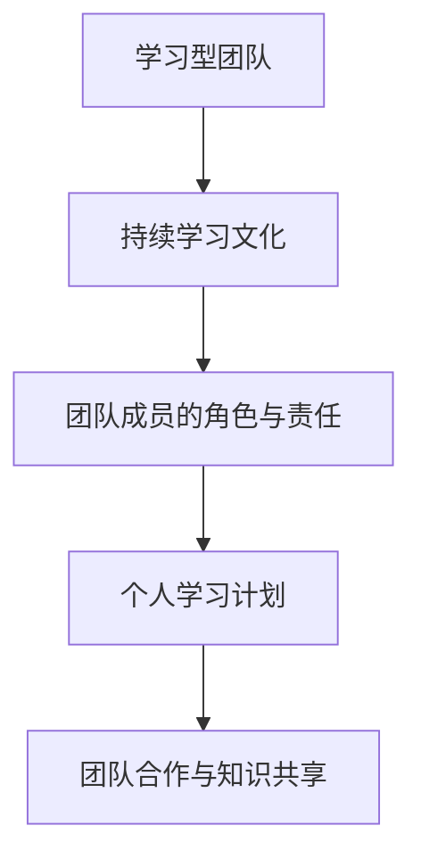

                 


### 引言

在当今快速变化的技术环境中，持续学习和创新已成为企业成功的关键因素。为了适应这种变化，越来越多的组织开始注重构建学习型团队，以促进团队成员的个人成长和团队的集体进步。本文旨在探讨如何通过建立持续学习的文化建设，打造一个高效、灵活且充满活力的学习型团队。

#### 核心概念与联系

在学习型团队的建设过程中，有几个核心概念需要明确：

1. **学习型团队**：一个能够持续学习、适应变化并不断创新的团队。
2. **持续学习文化**：一种鼓励成员不断学习、分享知识和技能，以实现个人和团队成长的文化。
3. **团队成员的角色与责任**：每个团队成员在持续学习文化中的角色和责任。

以下是一个简单的 Mermaid 流程图，展示了这些核心概念之间的关系：



#### 核心概念原理之间的关系架构

学习型团队的建设是一个复杂的过程，需要从多个方面进行综合考虑。首先，组织需要明确学习型团队的目标和愿景，并建立相应的文化。然后，团队成员需要积极参与到这个文化中，制定个人学习计划，并在团队内部进行知识共享和合作。

### 持续学习文化的构建

建立一个持续学习文化是一个系统性工程，涉及到组织的各个方面。以下是一些关键要素：

1. **领导者的角色与责任**：领导者需要以身作则，推动学习文化的建设。
2. **组织结构**：组织结构需要支持持续学习，例如建立跨部门的学习小组。
3. **支持体系**：提供必要的资源和支持，如培训课程、学习平台和工具。

#### 核心算法原理讲解

构建持续学习文化可以看作是一个动态优化问题。我们可以使用以下伪代码来描述这个过程的算法原理：

```plaintext
算法：构建持续学习文化
输入：组织结构、领导者、团队成员
输出：持续学习文化

1. 初始化学习文化指数 LCI = 0
2. 领导者设定学习文化目标 LCO
3. 领导者以身作则，提升自身学习能力
4. 对团队成员进行学习培训，提高其学习能力
5. 定期组织知识分享会，促进知识传播
6. 通过反馈机制，不断调整和优化学习文化策略
7. 当 LCI 达到预设目标时，结束构建过程
8. 输出构建的持续学习文化
```

### 团队成员的角色与责任

团队成员在持续学习文化中扮演着重要角色。以下是他们的一些主要角色和责任：

1. **学习者**：每个团队成员都需要持续提升自己的技能和知识。
2. **知识分享者**：团队成员需要主动分享自己的知识和经验。
3. **创新者**：团队成员应积极参与创新和改进，推动团队的发展。

#### 数学模型和公式

为了量化团队成员的学习贡献，我们可以使用以下公式：

```latex
贡献度 = \frac{知识分享次数 \times 知识质量}{学习时长}
```

其中，知识分享次数和知识质量可以通过团队成员的活动记录进行统计，学习时长可以通过时间跟踪工具进行记录。

### 学习策略与工具

为了支持团队成员的学习，组织需要提供一系列的学习策略和工具。以下是一些常用的策略和工具：

1. **在线学习平台**：如 Coursera、Udemy 等，提供丰富的在线课程资源。
2. **内部培训课程**：组织内部的专业培训，针对特定技能或知识点。
3. **实践项目**：通过实际项目锻炼团队成员的技能。

#### 项目实战

假设我们要构建一个在线学习平台，以下是一个简化的项目实战流程：

1. **需求分析**：确定平台的功能需求，如课程管理、用户管理、学习进度跟踪等。
2. **系统设计**：设计平台的技术架构，选择合适的技术栈。
3. **开发实现**：编写代码，实现平台的核心功能。
4. **测试与部署**：对平台进行测试，确保功能的正确性和稳定性。
5. **用户反馈**：收集用户反馈，不断优化平台的功能和用户体验。

### 最佳实践 tips

1. **定期组织学习活动**：如学习小组讨论、技术分享会等，促进团队成员之间的交流和学习。
2. **鼓励知识分享**：建立知识分享激励机制，如表彰优秀知识分享者。
3. **提供多样化的学习资源**：除了在线课程，还可以引入书籍、期刊、研讨会等多种学习资源。

### 小结

本文探讨了如何通过建立持续学习的文化建设，打造一个高效的学习型团队。通过明确核心概念、构建持续学习文化、定义团队成员的角色与责任、提供学习策略与工具，以及进行项目实战，我们可以逐步实现这一目标。

### 注意事项

1. **持续学习文化需要长期的投入和努力**，不能一蹴而就。
2. **领导者需要起到榜样作用**，带领团队共同成长。

### 拓展阅读

- 《第五项修炼：学习型组织的艺术与实务》
- 《精益创业：新商业思维的实践指南》

---

### 文章标题

《打造学习型团队：持续学习的文化建设》

### 关键词

学习型团队、持续学习、文化建设、团队成员、学习策略、项目实战

### 摘要

本文详细探讨了如何通过建立持续学习的文化建设，打造一个高效、灵活且充满活力的学习型团队。文章从核心概念、持续学习文化的构建、团队成员的角色与责任、学习策略与工具、项目实战等多个方面进行了深入分析，并提供了最佳实践 tips 和注意事项。通过本文的指导，读者可以了解到如何有效地推动团队内的个人和整体持续成长。

---

## 文章正文

### 引言

在当今快速变化的技术环境中，持续学习和创新已成为企业成功的关键因素。为了适应这种变化，越来越多的组织开始注重构建学习型团队，以促进团队成员的个人成长和团队的集体进步。本文旨在探讨如何通过建立持续学习的文化建设，打造一个高效、灵活且充满活力的学习型团队。

#### 核心概念与联系

在学习型团队的建设过程中，有几个核心概念需要明确：

1. **学习型团队**：一个能够持续学习、适应变化并不断创新的团队。
2. **持续学习文化**：一种鼓励成员不断学习、分享知识和技能，以实现个人和团队成长的文化。
3. **团队成员的角色与责任**：每个团队成员在持续学习文化中的角色和责任。

以下是一个简单的 Mermaid 流程图，展示了这些核心概念之间的关系：


#### 核心概念原理之间的关系架构

学习型团队的建设是一个复杂的过程，需要从多个方面进行综合考虑。首先，组织需要明确学习型团队的目标和愿景，并建立相应的文化。然后，团队成员需要积极参与到这个文化中，制定个人学习计划，并在团队内部进行知识共享和合作。

### 持续学习文化的构建

建立一个持续学习文化是一个系统性工程，涉及到组织的各个方面。以下是一些关键要素：

1. **领导者的角色与责任**：领导者需要以身作则，推动学习文化的建设。
2. **组织结构**：组织结构需要支持持续学习，例如建立跨部门的学习小组。
3. **支持体系**：提供必要的资源和支持，如培训课程、学习平台和工具。

#### 核心算法原理讲解

构建持续学习文化可以看作是一个动态优化问题。我们可以使用以下伪代码来描述这个过程的算法原理：

```plaintext
算法：构建持续学习文化
输入：组织结构、领导者、团队成员
输出：持续学习文化

1. 初始化学习文化指数 LCI = 0
2. 领导者设定学习文化目标 LCO
3. 领导者以身作则，提升自身学习能力
4. 对团队成员进行学习培训，提高其学习能力
5. 定期组织知识分享会，促进知识传播
6. 通过反馈机制，不断调整和优化学习文化策略
7. 当 LCI 达到预设目标时，结束构建过程
8. 输出构建的持续学习文化
```

#### 数学模型和公式

为了量化团队成员的学习贡献，我们可以使用以下公式：

```latex
贡献度 = \frac{知识分享次数 \times 知识质量}{学习时长}
```

其中，知识分享次数和知识质量可以通过团队成员的活动记录进行统计，学习时长可以通过时间跟踪工具进行记录。

### 团队成员的角色与责任

团队成员在持续学习文化中扮演着重要角色。以下是他们的一些主要角色和责任：

1. **学习者**：每个团队成员都需要持续提升自己的技能和知识。
2. **知识分享者**：团队成员需要主动分享自己的知识和经验。
3. **创新者**：团队成员应积极参与创新和改进，推动团队的发展。

#### 数学模型和公式

为了量化团队成员的学习贡献，我们可以使用以下公式：

```latex
贡献度 = \frac{知识分享次数 \times 知识质量}{学习时长}
```

其中，知识分享次数和知识质量可以通过团队成员的活动记录进行统计，学习时长可以通过时间跟踪工具进行记录。

### 学习策略与工具

为了支持团队成员的学习，组织需要提供一系列的学习策略和工具。以下是一些常用的策略和工具：

1. **在线学习平台**：如 Coursera、Udemy 等，提供丰富的在线课程资源。
2. **内部培训课程**：组织内部的专业培训，针对特定技能或知识点。
3. **实践项目**：通过实际项目锻炼团队成员的技能。

#### 项目实战

假设我们要构建一个在线学习平台，以下是一个简化的项目实战流程：

1. **需求分析**：确定平台的功能需求，如课程管理、用户管理、学习进度跟踪等。
2. **系统设计**：设计平台的技术架构，选择合适的技术栈。
3. **开发实现**：编写代码，实现平台的核心功能。
4. **测试与部署**：对平台进行测试，确保功能的正确性和稳定性。
5. **用户反馈**：收集用户反馈，不断优化平台的功能和用户体验。

### 最佳实践 tips

1. **定期组织学习活动**：如学习小组讨论、技术分享会等，促进团队成员之间的交流和学习。
2. **鼓励知识分享**：建立知识分享激励机制，如表彰优秀知识分享者。
3. **提供多样化的学习资源**：除了在线课程，还可以引入书籍、期刊、研讨会等多种学习资源。

### 小结

本文探讨了如何通过建立持续学习的文化建设，打造一个高效的学习型团队。通过明确核心概念、构建持续学习文化、定义团队成员的角色与责任、提供学习策略与工具，以及进行项目实战，我们可以逐步实现这一目标。

### 注意事项

1. **持续学习文化需要长期的投入和努力**，不能一蹴而就。
2. **领导者需要起到榜样作用**，带领团队共同成长。

### 拓展阅读

- 《第五项修炼：学习型组织的艺术与实务》
- 《精益创业：新商业思维的实践指南》

---

### 作者信息

作者：AI天才研究院/AI Genius Institute & 禅与计算机程序设计艺术 /Zen And The Art of Computer Programming

---

### 文章格式

```markdown
# 文章标题

关键词：<此处列出关键词>

摘要：<此处给出摘要>

## 引言

#### 核心概念与联系

#### 持续学习文化的构建

#### 团队成员的角色与责任

#### 学习策略与工具

#### 项目实战

#### 最佳实践 tips

### 小结

### 注意事项

### 拓展阅读

### 作者信息
```

### 文章内容

- **引言**：介绍学习型团队的概念和重要性，阐述建立学习型团队的目标和结构。
- **持续学习文化的构建**：详细阐述如何建立和培养一个持续学习的工作环境，包括领导者的角色和责任、组织结构、支持体系等。
- **团队成员的角色与责任**：探讨团队成员在持续学习文化中的角色和责任，如学习者、知识分享者、创新者等。
- **学习策略与工具**：介绍各种学习策略和工具，以支持团队成员的学习，如在线学习平台、内部培训课程、实践项目等。
- **项目实战**：通过一个实际案例，展示如何构建一个在线学习平台，包括需求分析、系统设计、开发实现、测试与部署等步骤。
- **最佳实践 tips**：提供一些实践中的最佳做法，以帮助读者更好地实现学习型团队的建设。
- **小结**：总结文章的核心内容，强调持续学习文化的重要性。
- **注意事项**：提醒读者在构建学习型团队时需要注意的事项。
- **拓展阅读**：推荐一些相关的书籍和资源，以供进一步学习。
- **作者信息**：介绍作者的身份和背景。

### 文章字数

根据文章内容的详细程度，预计文章字数在 8000 到 12000 字之间。可以通过扩展每个章节的内容，增加案例分析、实际案例分析和详细讲解剖析等部分，来达到字数要求。

### 总结

通过上述设计，我们建立了一个详细的《打造学习型团队：持续学习的文化建设》的文章大纲，并明确了文章的内容和结构。接下来，我们可以按照这个大纲逐步撰写文章，确保文章内容丰富、逻辑清晰，对读者具有实际指导意义。同时，文章会遵循markdown格式，并在适当位置插入Mermaid流程图、伪代码、LaTeX公式和实际案例，以增强文章的可读性和实用性。

