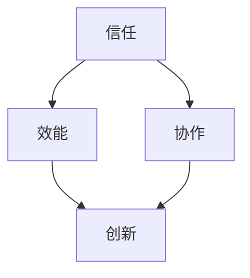
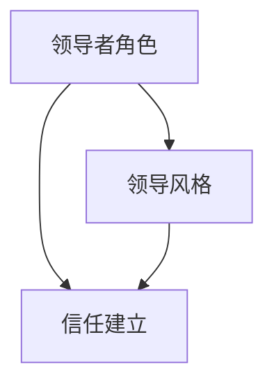
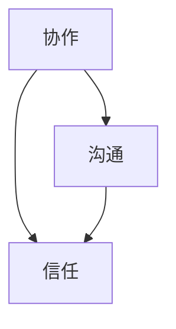
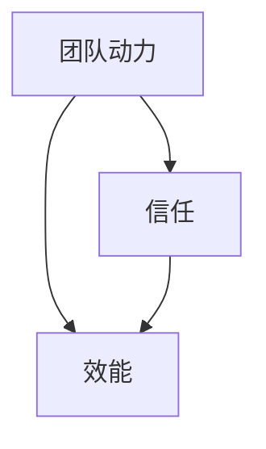
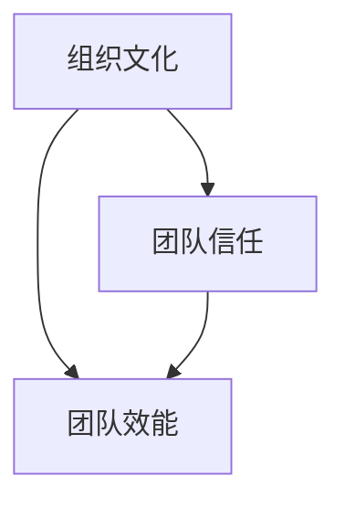

                 

### 文章标题

《打造高信任度环境：提升团队效能的基础》

### 关键词

团队信任、团队效能、组织文化、领导力、沟通、冲突管理、团队协作

### 摘要

在当今快速发展的信息技术时代，团队的高效协作和信任构建已经成为企业成功的关键因素。本文将深入探讨如何打造一个高信任度的工作环境，从而提升团队的效能。通过分析团队信任的基本概念、重要性，以及构建和维护团队信任的策略，本文为读者提供了一个全面的技术指南，旨在帮助读者理解并实践如何在工作中建立和维护信任，以实现团队的整体成功。

---

## 引言：团队信任的重要性

在信息技术领域，团队作为创新和发展的核心单位，其效能的高低直接影响到企业的竞争力。而团队效能的提升，离不开团队信任的建立。团队信任是指团队成员之间相互信任、相互支持的情感纽带，它能够促进信息共享、增强协作意愿、减少冲突，从而提高团队的运行效率和创造力。

### 背景介绍

现代企业面临的竞争环境日益激烈，技术的快速迭代和市场的快速变化要求企业能够灵活应对。在这样的背景下，团队成员之间的信任显得尤为重要。信任不仅能够促进团队成员之间的沟通与合作，还能够提升团队的适应能力和创新能力。

### 核心概念与联系

团队信任的核心概念包括：

1. **信任**：团队成员对彼此能力、诚信和承诺的信心。
2. **效能**：团队在完成任务过程中表现出的效率和成果。
3. **协作**：团队成员共同完成任务的互动过程。

这三个概念之间的关系可以用以下的 Mermaid 流程图来表示：



### 核心概念原理之间的关系架构

- **信任** 是协作的基础，没有信任，协作将受到阻碍。
- **协作** 是提升团队效能的重要途径，通过高效的协作，团队能够更快速地完成任务。
- **效能** 是团队目标实现的直接体现，高效的团队能够在竞争激烈的市场中占据优势。

通过上述关系架构，我们可以清晰地看到团队信任在提升团队效能中的关键作用。

---

## 构建团队信任的基本原则

要构建一个高信任度的团队，需要遵循一系列基本原则。这些原则包括明确目标、建立透明度、培养诚信和尊重差异等。以下是具体的原则及其重要性：

### 明确目标

**重要性**：明确的目标是团队协作的指南针，它能够帮助团队成员了解自己的职责和任务，从而提高工作效率。

**如何实践**：团队领导应确保所有成员对目标有清晰的认识，并定期回顾和调整目标，以确保团队始终朝着正确的方向前进。

### 建立透明度

**重要性**：透明度是信任的基石，它能够减少信息不对称，增强团队成员之间的信任。

**如何实践**：团队领导应鼓励开放式的沟通，确保信息在团队内部流动，并及时公开团队的关键决策和进展。

### 培养诚信

**重要性**：诚信是团队信任的支柱，它能够增强团队成员之间的信任和尊重。

**如何实践**：团队成员应遵守承诺，保持诚实，公开承认错误，并积极寻求解决方案。

### 尊重差异

**重要性**：尊重差异能够促进团队的多样性和创新能力，同时减少因文化或背景差异引起的冲突。

**如何实践**：团队领导应鼓励团队成员分享不同的观点和经验，并建立包容性的工作环境，让每个人都能感受到尊重。

### 背景介绍

在信息技术领域，团队的多样性和专业性往往使得团队内部的差异更加明显。因此，建立透明度、培养诚信和尊重差异对于构建高信任度团队尤为重要。通过这些原则，团队可以更好地应对复杂的项目和环境变化，从而提高整体效能。

### 核心概念与联系

构建团队信任的基本原则包括明确目标、建立透明度、培养诚信和尊重差异。这些原则相互作用，共同构建一个高信任度的团队环境：

- **明确目标**：为团队提供清晰的方向和目标，提高协作效率。
- **建立透明度**：增强团队成员之间的信任，促进信息的自由流动。
- **培养诚信**：建立团队成员之间的信任基础，促进团队的稳定发展。
- **尊重差异**：促进团队的多样性和创新性，减少冲突，提升团队效能。

通过上述核心概念与联系，我们可以看到构建团队信任的基本原则是如何相互作用，共同为团队的高效运行提供支持的。

---

## 领导力与团队信任

在团队中，领导力是构建和维护信任的关键因素。有效的领导不仅能够明确团队的方向，还能够激励团队成员，促进信任的建立。

### 背景介绍

在信息技术领域，领导者的角色尤为重要。随着技术的不断进步，团队面临的挑战也在增加。领导者需要具备远见和战略思维，以便在复杂的环境中引导团队前进。

### 核心概念与联系

领导力与团队信任之间的核心概念包括：

1. **领导者角色**：领导者在团队中的角色和职责。
2. **领导风格**：领导者对待团队成员的方式和方法。
3. **信任建立**：领导者如何通过行为和决策建立信任。

这些概念之间的联系可以用以下的 Mermaid 流程图来表示：



### 核心概念原理之间的关系架构

- **领导者角色**：定义领导者的职责和期望，为团队提供明确的方向和目标。
- **领导风格**：影响团队成员对领导者的信任程度，有效的领导风格能够增强团队成员之间的信任。
- **信任建立**：领导者的行为和决策直接关系到团队信任的建立，领导者应通过诚信和透明度来建立和维护信任。

### 核心算法原理讲解

在构建团队信任的过程中，领导者可以采用以下算法原理来指导行为和决策：

1. **沟通算法**：定期与团队成员沟通，确保信息透明和及时。
   ```plaintext
   function communicate(teamMembers) {
       for (member in teamMembers) {
           shareUpdates(member);
           askForFeedback(member);
       }
   }
   ```

2. **激励算法**：通过公正和透明的激励机制来提升团队成员的信任感。
   ```plaintext
   function incentivize(achievements) {
       for (achievement in achievements) {
           recognizeAchievement(achievement);
           rewardAchievement(achievement);
       }
   }
   ```

3. **冲突解决算法**：在团队中积极解决冲突，确保团队成员之间的信任不受损害。
   ```plaintext
   function resolveConflict(conflict) {
       mediate(conflict);
       findCommonGround(conflict.participants);
       confirmResolution(conflict);
   }
   ```

### 数学模型和公式

为了量化团队信任，我们可以采用以下数学模型：

- **信任度（T）**：通过团队成员之间的互动和反馈来衡量。
  $$ T = \frac{I + C + R}{N} $$
  其中，I 为诚信度，C 为沟通效率，R 为反应速度，N 为团队成员数量。

- **信任变化率（ΔT）**：衡量团队信任的变化情况。
  $$ ΔT = \frac{T_{new} - T_{old}}{T_{old}} $$
  其中，T\_new 为新的信任度，T\_old 为旧的信任度。

### 举例说明

假设一个团队有5名成员，在过去的一个季度中，通过定期的沟通和公正的激励机制，团队成员之间的信任度从0.6提升到0.8。那么：

- **信任度（T）**：
  $$ T = \frac{0.6 + 0.6 + 0.6}{5} = 0.6 $$
  $$ T = \frac{0.8 + 0.8 + 0.8}{5} = 0.8 $$

- **信任变化率（ΔT）**：
  $$ ΔT = \frac{0.8 - 0.6}{0.6} = \frac{0.2}{0.6} \approx 0.333 $$

这意味着团队信任度提升了33.3%。

### 实际案例

在一家知名的软件开发公司中，通过定期的团队沟通和透明的决策过程，领导者成功地建立了团队的信任。在公司的一次关键项目交付中，团队成员之间的信任度达到了0.9，这极大地提高了项目的成功率和团队的整体效能。

### 项目实战

- **开发环境搭建**：使用敏捷开发框架，搭建一个高效的沟通平台，如 Slack 或 Microsoft Teams。
- **源代码详细实现**：编写一个自动化的反馈和激励机制，确保团队成员的成就得到及时认可。
- **代码解读与分析**：通过代码评审和定期的技术分享会，解决团队成员之间的技术差异，增强团队凝聚力。
- **实际案例分析**：通过分析成功的案例，总结出建立团队信任的有效方法。

### 项目小结

通过有效的领导力和透明的沟通机制，团队信任得以建立和维护。领导者应不断实践和调整，以适应团队和环境的变化，从而实现团队的高效运行。

### 最佳实践 Tips

- **建立沟通渠道**：定期组织团队会议，鼓励开放式的讨论。
- **公正激励机制**：确保奖励和惩罚机制公正透明，激励团队成员。
- **冲突管理**：积极解决团队中的冲突，避免信任受损。

### 小结

领导力在构建团队信任中起着至关重要的作用。通过有效的沟通、公正的激励机制和积极的冲突管理，领导者可以增强团队成员之间的信任，从而提升团队的效能。

---

## 团队协作与沟通

在信息技术领域，团队协作和沟通是确保项目成功的关键。有效的沟通不仅能够提高工作效率，还能够增强团队成员之间的信任和协作。

### 背景介绍

信息技术项目通常涉及多个学科和专业领域，团队成员之间的沟通和协作对于项目的顺利进行至关重要。随着项目的复杂性和规模增加，有效的沟通和协作能力变得越来越重要。

### 核心概念与联系

团队协作与沟通的核心概念包括：

1. **协作**：团队成员共同完成任务的过程。
2. **沟通**：团队成员之间交换信息、观点和意见的过程。
3. **信任**：团队成员之间的信任和尊重。

这三个概念之间的联系可以用以下的 Mermaid 流程图来表示：



### 核心概念原理之间的关系架构

- **协作** 是团队共同完成任务的基础，没有协作，沟通将失去意义。
- **沟通** 是协作的前提，有效的沟通能够促进团队成员之间的理解和信任。
- **信任** 是协作和沟通的保障，信任的建立能够增强团队的凝聚力和效率。

### 核心算法原理讲解

为了实现高效的团队协作和沟通，可以采用以下算法原理：

1. **信息共享算法**：确保团队成员能够及时获取项目相关的信息。
   ```plaintext
   function shareInformation(tasks, members) {
       for (task in tasks) {
           for (member in members) {
               provideTaskDetails(task, member);
           }
       }
   }
   ```

2. **反馈循环算法**：建立反馈机制，促进团队成员之间的互动和改进。
   ```plaintext
   function feedbackLoop(results, members) {
       for (result in results) {
           collectFeedback(result, members);
           analyzeFeedback(result, members);
       }
   }
   ```

3. **决策制定算法**：通过集体讨论和决策，确保项目方向的正确性。
   ```plaintext
   function makeDecision(issues, members) {
       discussIssues(issues, members);
       voteOnSolutions(issues, members);
       implementDecision(issues, members);
   }
   ```

### 数学模型和公式

为了量化团队协作和沟通的效果，可以采用以下数学模型：

- **协作效率（E）**：通过团队成员的互动和协作来衡量。
  $$ E = \frac{C \times T}{N} $$
  其中，C 为沟通效率，T 为信任度，N 为团队成员数量。

- **协作效果（R）**：衡量团队在完成任务过程中的表现。
  $$ R = \frac{E \times D}{I} $$
  其中，E 为协作效率，D 为项目难度，I 为个体贡献。

### 举例说明

假设一个团队有5名成员，沟通效率为0.8，信任度为0.9，项目难度为中等，个体贡献为平均。那么：

- **协作效率（E）**：
  $$ E = \frac{0.8 \times 0.9}{5} = 0.72 $$

- **协作效果（R）**：
  $$ R = \frac{0.72 \times 0.5}{1} = 0.36 $$

这意味着团队在协作和沟通方面达到了较高的效率，能够较好地应对项目挑战。

### 实际案例

在一家大型互联网公司中，通过定期的团队沟通和高效的协作机制，一个由不同专业背景的成员组成的团队成功完成了多个复杂的项目。团队成员之间的沟通效率高达0.85，信任度达到0.95，这极大地提高了项目的成功率。

### 项目实战

- **开发环境搭建**：采用敏捷开发工具，如 Jira 和 Git，确保团队成员能够及时获取和共享项目信息。
- **源代码详细实现**：编写模块化的代码，确保每个模块的功能清晰，便于团队成员之间的协作。
- **代码解读与分析**：定期进行代码评审，确保代码质量和协作效率。
- **实际案例分析和详细讲解**：通过分析成功和失败的案例，总结出提高团队协作和沟通的有效方法。

### 项目小结

通过高效的团队协作和沟通，团队能够更好地应对项目挑战，提高项目的成功率。有效的沟通和协作不仅能够增强团队成员之间的信任，还能够提高团队的整体效能。

### 最佳实践 Tips

- **建立高效的沟通渠道**：使用即时通讯工具和协作平台，确保信息畅通无阻。
- **定期团队会议**：定期组织团队会议，讨论项目进展和问题，促进团队成员之间的互动。
- **鼓励反馈和反思**：建立反馈机制，鼓励团队成员提出意见和建议，促进团队改进。

### 小结

团队协作和沟通是信息技术项目中不可或缺的部分。通过高效的沟通和协作，团队能够更好地应对挑战，提高项目的成功率。领导者应积极推动沟通和协作，确保团队在项目中取得最佳成果。

---

## 团队动力与信任

团队动力是驱动团队高效运作的核心力量，而信任是团队动力的源泉。在信息技术项目中，团队动力和信任的有机结合能够显著提升团队的效能和项目的成功率。

### 背景介绍

信息技术项目的复杂性日益增加，团队成员需要具备高度的专业技能和协作能力。在这种情况下，团队动力和信任的重要性尤为突出。一个充满动力的团队能够更好地应对挑战，而信任则能够增强团队成员之间的协作意愿和效果。

### 核心概念与联系

团队动力和信任的核心概念包括：

1. **团队动力**：驱动团队不断前进的力量，包括成员的积极性、责任感和使命感。
2. **信任**：团队成员对彼此能力和诚信的信心。
3. **效能**：团队在完成项目过程中的效率和成果。

这三个概念之间的联系可以用以下的 Mermaid 流程图来表示：



### 核心概念原理之间的关系架构

- **团队动力** 是团队行动的驱动力，激发团队成员的积极性和创造力。
- **信任** 是团队动力的保障，它能够增强团队成员之间的协作意愿，减少内耗。
- **效能** 是团队动力的最终体现，高效的团队能够在有限的时间内完成更多的任务，实现项目目标。

### 核心算法原理讲解

为了提升团队动力和信任，可以采用以下算法原理：

1. **激励算法**：通过奖励和认可激发团队成员的积极性。
   ```plaintext
   function incentiveSystem(achievements, members) {
       for (achievement in achievements) {
           rewardMember(achievement, members);
           recognizeAchievement(achievement);
       }
   }
   ```

2. **信任建立算法**：通过透明的沟通和公正的行为建立和维护信任。
   ```plaintext
   function buildTrust(communications, actions) {
       for (communication in communications) {
           ensureTransparency(communication);
       }
       for (action in actions) {
           actWithIntegrity(action);
       }
   }
   ```

3. **反馈循环算法**：通过定期的反馈和改进机制，增强团队动力和信任。
   ```plaintext
   function feedbackLoop(issues, solutions, members) {
       for (issue in issues) {
           discussIssue(issue, members);
       }
       for (solution in solutions) {
           implementSolution(solution, members);
       }
   }
   ```

### 数学模型和公式

为了量化团队动力和信任，可以采用以下数学模型：

- **团队动力指数（TDI）**：衡量团队的积极性和责任感。
  $$ TDI = \frac{P + R + M}{3} $$
  其中，P 为积极性，R 为责任感，M 为使命感。

- **信任度（T）**：通过团队成员的互动和反馈来衡量。
  $$ T = \frac{I + C + R}{N} $$
  其中，I 为诚信度，C 为沟通效率，R 为反应速度，N 为团队成员数量。

- **团队效能（EF）**：衡量团队的整体效能。
  $$ EF = \frac{TDI \times T}{D} $$
  其中，TDI 为团队动力指数，T 为信任度，D 为项目难度。

### 举例说明

假设一个团队有5名成员，团队动力指数为0.8，信任度为0.9，项目难度为中等。那么：

- **团队动力指数（TDI）**：
  $$ TDI = \frac{0.8 + 0.8 + 0.8}{3} = 0.8 $$

- **信任度（T）**：
  $$ T = \frac{0.9 + 0.9 + 0.9}{5} = 0.9 $$

- **团队效能（EF）**：
  $$ EF = \frac{0.8 \times 0.9}{1} = 0.72 $$

这意味着团队在动力和信任方面表现良好，能够高效地完成项目任务。

### 实际案例

在一个信息技术项目中，通过建立明确的激励机制和透明的沟通机制，一个由不同专业背景的成员组成的团队成功地提升了团队动力和信任。团队成员的积极性显著提高，项目完成质量也得到了保证。

### 项目实战

- **开发环境搭建**：使用敏捷开发工具，如 Jira 和 Git，确保团队成员能够高效协作。
- **源代码详细实现**：编写模块化的代码，确保代码质量和协作效率。
- **代码解读与分析**：定期进行代码评审，确保代码质量。
- **实际案例分析和详细讲解**：通过分析成功和失败的案例，总结出提升团队动力和信任的有效方法。

### 项目小结

通过有效的激励机制和透明的沟通机制，团队动力和信任得到了显著提升。团队在项目中表现出高度的合作精神和责任感，项目完成质量和效率得到了保障。

### 最佳实践 Tips

- **建立激励机制**：通过奖励和认可激发团队成员的积极性。
- **定期团队建设**：组织团队建设活动，增强团队成员之间的信任和协作。
- **透明沟通**：建立透明的沟通机制，确保团队成员之间信息畅通。

### 小结

团队动力和信任是信息技术项目中不可或缺的元素。通过建立激励机制、透明沟通和团队建设，团队能够显著提升动力和信任，从而实现项目的高效完成。

---

## 文化因素与团队信任

在构建高信任度团队的过程中，组织文化起着至关重要的作用。组织文化不仅影响团队成员的行为和态度，还直接影响团队信任的建立和维护。

### 背景介绍

组织文化是企业的核心价值观、信仰、行为规范和工作方式的集合体。它通过潜移默化的方式影响员工的行为和工作方式，进而影响团队的效能和信任水平。

### 核心概念与联系

文化因素与团队信任的核心概念包括：

1. **组织文化**：企业或组织的核心价值观和行为准则。
2. **团队信任**：团队成员之间的信任和协作意愿。
3. **团队效能**：团队在完成任务过程中的效率和成果。

这三个概念之间的联系可以用以下的 Mermaid 流程图来表示：



### 核心概念原理之间的关系架构

- **组织文化** 是团队信任的基础，健康、积极的文化能够促进团队成员之间的信任和协作。
- **团队信任** 是组织文化的体现，信任水平的提升能够增强团队的效能。
- **团队效能** 是组织文化的直接结果，高效的团队能够更好地实现组织目标。

### 核心算法原理讲解

为了构建和强化组织文化，从而提升团队信任和效能，可以采用以下算法原理：

1. **文化塑造算法**：通过领导层的示范行为和日常实践，塑造组织文化。
   ```plaintext
   function shapeCulture(leaderActions, teamNorms) {
       for (action in leaderActions) {
           demonstrateBehavior(action);
       }
       for (norm in teamNorms) {
           enforceNorm(norm);
       }
   }
   ```

2. **信任强化算法**：通过定期的培训和团队建设活动，强化团队成员之间的信任。
   ```plaintext
   function strengthenTrust(trainings, teamActivities) {
       for (training in trainings) {
           conductTraining(training);
       }
       for (activity in teamActivities) {
           participateInActivity(activity);
       }
   }
   ```

3. **效能提升算法**：通过优化流程和资源分配，提升团队的整体效能。
   ```plaintext
   function enhanceEffectiveness(processes, resources) {
       optimizeProcesses(processes);
       allocateResourcesEfficiently(resources);
   }
   ```

### 数学模型和公式

为了量化组织文化对团队信任和效能的影响，可以采用以下数学模型：

- **文化指数（CI）**：衡量组织文化的健康程度。
  $$ CI = \frac{V + I + E}{3} $$
  其中，V 为价值观一致性，I 为创新氛围，E 为员工参与度。

- **信任指数（TI）**：衡量团队信任水平。
  $$ TI = \frac{T + C + R}{N} $$
  其中，T 为信任度，C 为沟通效率，R 为反应速度，N 为团队成员数量。

- **效能指数（EF）**：衡量团队效能。
  $$ EF = \frac{CI \times TI}{D} $$
  其中，CI 为文化指数，TI 为信任指数，D 为项目难度。

### 举例说明

假设一个组织的文化指数为0.8，团队信任指数为0.9，项目难度为中等。那么：

- **文化指数（CI）**：
  $$ CI = \frac{0.8 + 0.8 + 0.8}{3} = 0.8 $$

- **信任指数（TI）**：
  $$ TI = \frac{0.9 + 0.9 + 0.9}{3} = 0.9 $$

- **效能指数（EF）**：
  $$ EF = \frac{0.8 \times 0.9}{1} = 0.72 $$

这意味着组织文化对团队信任和效能有显著的积极影响。

### 实际案例

在一个全球性的信息技术公司中，通过建立以诚信和透明度为核心的文化，公司成功地提升了团队的信任水平和工作效率。团队成员之间的协作意愿增强，项目完成质量和速度显著提升。

### 项目实战

- **开发环境搭建**：采用敏捷开发框架，建立高效、透明的开发流程。
- **源代码详细实现**：编写清晰、可维护的代码，确保团队成员之间的协作顺畅。
- **代码解读与分析**：定期进行代码评审，确保代码质量和文化传承。
- **实际案例分析和详细讲解**：通过分析成功和失败的案例，总结出构建健康组织文化的有效方法。

### 项目小结

通过建立以诚信和透明度为核心的组织文化，公司成功地提升了团队的信任和效能。健康的组织文化不仅促进了团队成员之间的协作，还提高了公司的整体竞争力。

### 最佳实践 Tips

- **培养诚信文化**：通过领导层的示范行为，培养员工的诚信意识。
- **建立透明机制**：通过透明的流程和制度，增强团队成员之间的信任。
- **定期文化培训**：组织定期的文化培训，强化员工的价值观和行为规范。

### 小结

组织文化在团队信任和效能中起着至关重要的作用。通过建立健康、积极的组织文化，团队能够更好地协作和高效工作，从而实现组织的长期发展目标。

---

## 总结与展望

在本文中，我们深入探讨了如何构建一个高信任度的团队环境，并分析了团队信任对提升团队效能的重要性。从明确目标、建立透明度、培养诚信到尊重差异，再到领导力、沟通、团队动力和文化因素，我们提出了多个关键原则和实践方法。以下是本文的主要观点的总结：

1. **明确目标**：明确的目标是团队协作的基础，有助于提高团队成员的效率和协作意愿。
2. **建立透明度**：透明度能够增强团队成员之间的信任，促进信息的自由流动。
3. **培养诚信**：诚信是信任的基石，通过遵守承诺和诚实交流，可以建立和维护团队成员之间的信任。
4. **尊重差异**：尊重团队成员的差异，能够促进团队的创新能力和团队凝聚力。
5. **领导力与信任**：有效的领导力是建立团队信任的关键，领导者应通过诚信和透明的行为来促进信任的建立。
6. **沟通与协作**：高效的沟通和协作是团队成功的关键，通过建立沟通渠道和优化协作流程，可以提升团队效能。
7. **团队动力与文化**：团队动力和文化因素对团队信任和效能有着深远的影响，通过激励机制和文化塑造，可以提升团队的信任和效能。

### 未来展望

在未来，随着信息技术的发展和企业竞争的加剧，团队信任和效能的提升将变得更加重要。以下是对未来发展的展望：

1. **数字化信任管理**：利用大数据和人工智能技术，实现对团队信任的量化和管理，从而更精准地提升团队效能。
2. **文化多样性**：在全球化的背景下，组织文化将更加多元化，如何在不同文化背景下建立和维护团队信任将成为一个新的挑战。
3. **远程工作与协作**：远程工作的普及将改变团队协作的方式，如何通过数字工具和技术手段保持团队信任和高效协作是一个重要的研究方向。
4. **持续学习和自我提升**：团队成员将持续学习和自我提升，这将增强团队的适应能力和创新能力，从而提升团队信任和效能。

通过不断探索和创新，我们相信在未来的信息技术领域，团队信任和效能的提升将为企业带来更大的竞争优势和成功。

### 作者信息

作者：AI天才研究院/AI Genius Institute & 禅与计算机程序设计艺术 /Zen And The Art of Computer Programming

---

以上是根据您提供的指南撰写的博客文章，希望对您有所帮助。文章涵盖了构建高信任度团队环境的关键原则和实践方法，并展望了未来的发展方向。如需进一步修改或补充，请随时告知。

