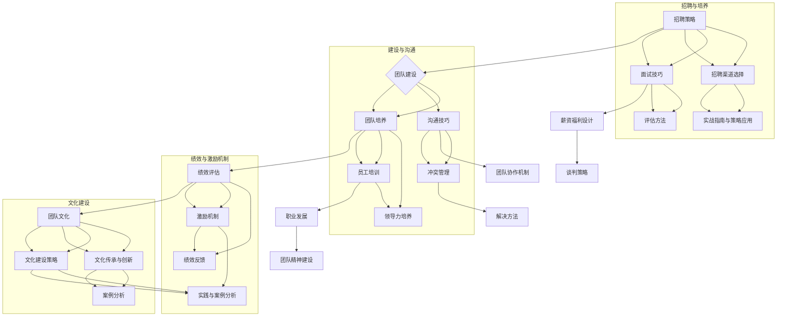

                 

### 引言

在当今快速变化和竞争激烈的市场环境中，高效团队的作用越来越凸显。无论是企业、科研机构还是非营利组织，都需要依赖团队的力量来应对复杂的问题和挑战。打造一个高效团队，不仅关系到团队内部成员的协作效率，更是企业或组织实现战略目标、提升核心竞争力的关键。

高效团队的构建涉及多个方面，包括但不限于招聘策略、团队建设、培养与成长、绩效评估以及文化构建与传承。每一个环节都需要精心设计和执行，才能形成一个协同高效、富有创新能力的团队。

本文旨在为读者提供一份从招聘到培养的全流程指南，旨在帮助读者理解高效团队的建设原理，掌握具体的实施方法和技巧。本文将以逻辑清晰、结构紧凑、简单易懂的叙述方式，逐步剖析高效团队构建的核心要素，并通过实例和实践指南来加深理解。

首先，我们将探讨高效团队的定义与特点，明确高效团队与普通团队的区别及其重要性。接着，文章将深入讨论招聘策略与方法，包括招聘流程的概述、招聘策略的制定、招聘渠道的选择、面试技巧与评估方法以及薪资福利的设计与谈判。随后，文章将转向团队建设与沟通，探讨团队文化构建、目标设定与分解、协作机制、沟通技巧以及冲突管理与解决。

在团队培养与成长部分，我们将详细探讨员工培训与发展、职业发展规划、领导力培养和团队精神建设。随后，文章将讨论团队绩效评估与管理，包括绩效评估体系的设计、绩效评估方法与工具、绩效反馈与改进以及激励机制的设计。最后，文章将探讨团队文化构建与传承，包括企业文化的重要性、文化建设策略、团队文化的传承与创新以及企业文化的实践与案例分析。

通过上述内容的详细讲解，本文旨在为读者提供一套全面、实用的打造高效团队的方法和策略，帮助读者在实际工作中运用这些知识和技巧，构建和培养出具备高效协作能力和创新精神的高效团队。

### 高效团队的背景介绍

高效团队的概念源于管理学和心理学的研究，最早可以追溯到20世纪初期。当时，工业革命带来了大规模生产的需求，如何提高生产效率和团队协作能力成为企业管理者关注的焦点。通过实证研究和理论探讨，学者们逐渐发现，高效团队不仅能够显著提高工作效率，还能激发团队成员的潜力，实现个人与团队的共同成长。

在现代企业中，高效团队的作用尤为显著。首先，高效团队能够快速响应市场需求，灵活调整策略，以应对复杂多变的市场环境。其次，高效团队能够通过团队成员的协同合作，实现资源的最大化利用，降低成本，提高盈利能力。此外，高效团队还能够促进创新，通过集思广益和跨部门合作，不断推出新产品和服务，增强企业的核心竞争力。

随着信息技术的飞速发展，企业面临的竞争环境日益复杂，对高效团队的需求也不断上升。现代企业不仅需要团队成员具备专业技能，还需要他们具备良好的沟通能力和协作精神，能够快速适应新环境和新挑战。因此，打造高效团队已成为企业战略的重要组成部分，也是企业管理者需要面对的重要课题。

高效团队的特点主要体现在以下几个方面：

1. **目标明确**：高效团队具有明确的目标，每个成员都清楚地了解自己的职责和任务，能够为实现共同目标而努力。

2. **协同合作**：团队成员之间具有高度的协同合作精神，能够共享信息、资源和经验，形成协同效应。

3. **沟通畅通**：高效团队内部沟通畅通，信息传递迅速，能够及时发现和解决问题，避免信息孤岛和沟通障碍。

4. **灵活适应**：高效团队能够迅速适应外部环境的变化，灵活调整策略和方案，以应对新的挑战和机遇。

5. **持续成长**：高效团队注重成员的培训和发展，通过持续学习和创新，不断提升团队的整体能力和竞争力。

总的来说，高效团队的形成不仅需要科学的管理方法和策略，还需要团队成员之间的相互信任和共同努力。在现代企业中，高效团队不仅是企业发展的关键，也是企业持续创新和成长的动力源泉。

### 核心概念与联系

在构建高效团队的过程中，有几个核心概念和联系需要我们深入了解，以便更好地理解和应用相关策略和方法。以下是这些概念及其关系的Mermaid流程图：

**核心概念解析：**

1. **招聘策略**：这是团队构建的第一步，决定了团队的基础组成和初始能力。一个科学的招聘策略能够确保引进的人才符合团队目标，具备必要的能力和潜力。

2. **团队建设**：这是指通过一系列措施和活动，使团队成员之间形成协同合作的关系，提高团队的凝聚力。团队建设涵盖了目标设定、沟通技巧、冲突管理等多个方面。

3. **团队培养**：关注团队成员的长期发展和能力提升，包括员工培训、职业发展规划和领导力培养。这一过程有助于保持团队的活力和创新能力。

4. **绩效评估**：通过科学的评估体系和方法，对团队成员的工作表现进行评估，以激励优秀表现并找出改进的空间。绩效评估包括绩效评估体系设计、评估方法与工具、绩效反馈和激励机制等多个环节。

5. **团队文化**：团队文化是团队精神和价值观的集合，对于团队的长远发展具有深远影响。团队文化的建设与传承包括文化建设策略、企业文化的实践与案例分析等。

6. **面试技巧**：在招聘过程中，面试技巧直接影响招聘效果。有效的面试技巧可以帮助评估应聘者的能力、潜力和文化适应性。

7. **薪资福利设计**：合理的薪资福利设计不仅能够吸引和留住优秀人才，还能激励团队成员努力工作，提高团队的整体绩效。

8. **沟通技巧**：良好的沟通是团队高效运作的基础。有效的沟通技巧能够促进团队成员之间的信息共享和协作，避免误解和冲突。

9. **冲突管理**：团队运作过程中难免会出现冲突，有效的冲突管理可以及时解决冲突，避免影响团队运作。

10. **员工培训**：培训是提升员工技能和知识的重要手段，有助于增强团队的综合实力。

11. **职业发展**：为团队成员提供明确的职业发展路径和机会，能够激发他们的工作热情和长期投入。

12. **领导力培养**：领导力是团队成长和发展的关键因素。有效的领导力培养有助于提升团队成员的领导能力和团队整体绩效。

13. **团队精神建设**：团队精神是团队成员共同奋斗和协作的动力源泉。通过团队活动和文化建设来培养团队精神，能够增强团队的凝聚力和向心力。

14. **激励机制**：合理的激励机制能够激发团队成员的工作积极性和创新精神，提高团队的绩效和竞争力。

15. **文化建设策略**：通过明确的企业价值观和行为准则，构建和维护积极向上的团队文化。

16. **文化传承与创新**：团队文化不仅需要传承，还需要在传承的基础上不断创新，以适应新的发展需求。

通过上述核心概念的解析和Mermaid流程图的展示，我们可以清晰地看到各个概念之间的联系和作用，为后续章节的详细探讨提供了基础。

### 招聘策略与方法

在高效团队的构建过程中，招聘策略与方法是至关重要的一环。一个科学的招聘策略能够确保引进的人才不仅符合团队目标，还具备必要的能力和潜力。以下是招聘策略和方法的详细解析，包括招聘流程的概述、招聘策略的制定、招聘渠道的选择、面试技巧与评估方法以及薪资福利的设计与谈判。

#### 招聘流程概述

招聘流程通常包括以下几个阶段：

1. **需求分析**：首先，明确岗位需求和目标，包括岗位的职责、任职资格、技能要求等。
2. **招聘计划**：根据需求分析，制定详细的招聘计划，包括招聘时间、招聘人数、预算等。
3. **招聘渠道选择**：选择合适的招聘渠道，如内部推荐、职业招聘网站、社交媒体等。
4. **简历筛选**：筛选简历，筛选出符合岗位要求的候选人。
5. **面试安排**：安排面试，通常包括初试和复试，以评估候选人的综合素质。
6. **背景调查**：对通过面试的候选人进行背景调查，以验证其教育背景和工作经历。
7. **薪资谈判**：与候选人进行薪资谈判，达成共识。
8. **录用与反馈**：发出录用通知，并对未录用的候选人进行反馈。

#### 招聘策略制定

制定招聘策略需要考虑以下几个关键因素：

1. **岗位需求**：明确岗位的具体职责和任职资格，确保招聘策略与岗位需求紧密匹配。
2. **团队目标**：考虑团队的目标和发展方向，引进与团队目标一致的人才。
3. **人才市场**：了解当前人才市场的供需状况，选择合适的招聘渠道和策略。
4. **预算限制**：根据企业的预算情况，制定合理的招聘预算和薪资水平。
5. **企业文化**：考虑企业文化和价值观，确保引进的人才能够适应和融入企业环境。

#### 招聘渠道选择

选择招聘渠道需要综合考虑以下几个因素：

1. **内部推荐**：利用内部员工推荐，可以降低招聘成本，提高招聘质量。
2. **职业招聘网站**：如智联招聘、猎聘网等，覆盖面广，信息更新快。
3. **社交媒体**：利用社交媒体平台发布招聘信息，如LinkedIn、微博等，吸引更多优秀的候选人。
4. **校园招聘**：针对应届毕业生，可以选择参加校园招聘会，与企业合作培养人才。
5. **专业猎头**：对于高端职位和稀缺技能的人才，可以考虑使用专业猎头服务。

#### 面试技巧与评估方法

面试是招聘过程中最重要的环节之一，以下是几种常见的面试技巧和评估方法：

1. **结构化面试**：通过预先设计的问题，对候选人的技能、经验和个性进行全面评估。
2. **行为事件访谈法**：通过询问候选人在过去工作中遇到的问题和解决方法，评估其解决问题的能力。
3. **情境面试**：设计一些具体的情境问题，让候选人描述在类似情境下的行为和表现。
4. **多轮面试**：安排多轮面试，由不同部门的负责人进行评估，确保全面了解候选人。
5. **评估工具**：使用评估工具，如能力评估量表、行为观察表等，量化评估结果。

#### 薪资福利设计与谈判

薪资福利设计需要考虑以下几个因素：

1. **市场水平**：参考市场薪资水平，确保薪资具有竞争力。
2. **企业预算**：根据企业的财务状况，合理制定薪资预算。
3. **岗位价值**：考虑岗位的重要性和贡献，合理设置薪资水平。
4. **员工绩效**：根据员工的绩效表现，进行薪资调整和激励。

谈判策略包括：

1. **了解候选人期望**：在谈判前，了解候选人的薪资期望，制定合理的谈判策略。
2. **强调企业优势**：突出企业的发展前景、企业文化、培训机会等优势，吸引候选人。
3. **灵活谈判**：在谈判中保持灵活性，根据双方需求进行适当调整。
4. **双赢原则**：追求双方都能接受的结果，避免陷入僵局。

通过以上详细的招聘策略与方法，企业可以更有效地吸引和留住优秀人才，为团队的高效运作打下坚实基础。

### 招聘渠道选择

在高效团队的建设过程中，选择合适的招聘渠道至关重要。不同的招聘渠道具有各自的优劣势，企业应根据具体情况灵活选择，以最大化招聘效果。以下是几种常见的招聘渠道及其优劣势分析：

#### 内部推荐

**优势**：
1. **成本较低**：内部推荐不需要支付高昂的中介费用，节省了招聘成本。
2. **人员熟悉**：内部推荐可以减少背景调查的环节，候选人与企业文化契合度高，降低入职后的适应期。
3. **提高员工积极性**：通过奖励机制激励员工推荐优秀人才，增强员工对企业的归属感和责任感。

**劣势**：
1. **候选池有限**：内部推荐渠道限制了候选人的多样性，可能难以找到具有特定技能或经验的人才。
2. **可能导致内部竞争**：优秀员工的推荐可能导致内部竞争加剧，影响团队稳定。

#### 职业招聘网站

**优势**：
1. **覆盖面广**：职业招聘网站如智联招聘、猎聘网等，覆盖了广泛的求职者，信息传播速度快。
2. **高效筛选**：提供关键词搜索、筛选功能，可以快速找到符合岗位需求的候选人。
3. **广泛传播**：通过互联网传播，可以迅速吸引大量求职者，提高招聘成功率。

**劣势**：
1. **虚假简历多**：职业招聘网站上的简历质量参差不齐，存在虚假简历和夸大其词的情况。
2. **信息量过大**：筛选和评估候选人的工作量较大，需要耗费大量时间和精力。

#### 社交媒体

**优势**：
1. **精准定位**：通过LinkedIn、微博等社交媒体平台，可以精准定位具有特定技能或经验的候选人。
2. **互动性强**：社交媒体的互动功能有助于企业与候选人建立直接联系，提高招聘效率。
3. **成本较低**：相比于传统招聘渠道，社交媒体的招聘成本较低，操作简单。

**劣势**：
1. **隐私问题**：社交媒体招聘涉及到个人隐私，需要确保候选人的信息安全和隐私保护。
2. **筛选难度大**：社交媒体上的信息量庞大，筛选和评估候选人的难度较大。

#### 校园招聘

**优势**：
1. **人才储备**：校园招聘可以为企业培养和储备新鲜血液，有利于企业长远发展。
2. **培训成本较低**：应届毕业生通常需要较低的培训成本，可以快速上手。
3. **企业文化传承**：通过校园招聘，可以传递企业的文化和价值观，增强员工的认同感。

**劣势**：
1. **岗位匹配度较低**：应届毕业生通常缺乏实际工作经验，需要较长时间的适应和培养。
2. **招聘周期较长**：校园招聘的周期较长，需要提前规划，投入较多时间和精力。

#### 专业猎头

**优势**：
1. **高端人才**：专业猎头擅长寻找高端人才和稀缺技能人才，招聘成功率较高。
2. **专业服务**：专业猎头提供全方位的招聘服务，包括人才筛选、面试安排、薪资谈判等。
3. **高效快捷**：专业猎头具有丰富的行业资源和经验，可以快速找到合适的人才。

**劣势**：
1. **成本较高**：专业猎头服务费用较高，增加了招聘成本。
2. **人才流失风险**：高端人才招聘后可能面临较高的人才流失风险，需要额外的留才措施。

#### 选择建议

在选择招聘渠道时，企业应综合考虑岗位需求、招聘成本、招聘效率和人才匹配度等因素。以下是几种渠道的选择建议：

1. **初级岗位**：适合使用内部推荐和职业招聘网站，这些渠道可以快速筛选和评估候选人。
2. **中级岗位**：适合使用社交媒体和专业猎头，可以找到具备一定经验和技能的候选人。
3. **高级岗位**：适合使用专业猎头，可以高效地找到高端人才和稀缺技能人才。

总之，选择合适的招聘渠道是企业构建高效团队的重要一步，企业应根据实际情况灵活调整，以最大化招聘效果。

### 面试技巧与评估方法

面试是招聘过程中至关重要的一环，有效的面试技巧和评估方法能够帮助企业准确识别和筛选合适的人才。以下是几种常见的面试技巧与评估方法，包括结构化面试、行为事件访谈法、情境面试等。

#### 结构化面试

**定义**：结构化面试是一种通过预先设计的问题对候选人进行全面评估的面试方法。

**步骤**：
1. **问题设计**：根据岗位需求，设计一系列结构化问题，涵盖专业技能、工作经验、团队合作等多个方面。
2. **评分标准**：为每个问题设定评分标准，确保评估的客观性和一致性。
3. **面试流程**：按照预定的流程进行面试，确保每位候选人都接受相同的问题和评估标准。

**优点**：
- **客观性**：结构化面试减少了主观判断，提高了评估的客观性。
- **一致性**：所有候选人接受相同的面试流程，确保评估的一致性。

**缺点**：
- **缺乏灵活性**：结构化面试的问题固定，可能无法充分了解候选人的独特性和潜力。
- **时间成本**：设计结构化问题和评分标准需要耗费大量时间。

#### 行为事件访谈法（BEI）

**定义**：行为事件访谈法是一种通过询问候选人在过去工作中遇到的问题和解决方法来评估其能力和潜力的面试方法。

**步骤**：
1. **问题设计**：设计开放性问题，如“请描述一个你在工作中遇到的最具挑战性的项目，以及你是如何解决的？”
2. **事件分析**：分析候选人描述的事件，识别其在事件中的行为、态度和结果。
3. **能力评估**：根据事件分析的结果，评估候选人的能力、潜力和适应能力。

**优点**：
- **实用性**：通过实际事件了解候选人的真实表现，具有较强的实用性。
- **深度了解**：行为事件访谈法可以深入了解候选人的思维方式和解决问题的能力。

**缺点**：
- **时间成本**：行为事件访谈法需要较长时间的沟通，可能不适合快速筛选候选人。

#### 情境面试

**定义**：情境面试是一种通过设计具体的情境问题，评估候选人在特定情境下的表现和反应的面试方法。

**步骤**：
1. **情境设计**：设计一个或多个具体的工作情境，如“如果你遇到一个难以协调的团队成员，你会如何处理？”
2. **角色扮演**：让候选人扮演特定角色，模拟实际工作中的情境。
3. **行为观察**：观察候选人在情境中的表现，评估其解决问题的能力、沟通技巧和团队合作精神。

**优点**：
- **直观性**：情境面试通过角色扮演和现场观察，可以直观地了解候选人的实际表现。
- **实战性**：情境面试能够评估候选人在实际工作情境中的应对能力和策略。

**缺点**：
- **成本较高**：情境面试需要设计和实施特定情境，可能需要一定的资源和时间投入。
- **主观性**：评估结果可能受到面试官主观判断的影响。

#### 评估工具

在面试过程中，使用评估工具可以量化评估结果，提高评估的客观性和准确性。以下是一些常见的评估工具：

1. **能力评估量表**：为每个评估维度设定评分标准，如沟通能力、解决问题的能力等。
2. **行为观察表**：记录候选人在面试过程中的行为表现，如主动性、自信心等。
3. **行为事件记录表**：记录候选人过去的工作事件和解决方法，便于分析候选人的能力和潜力。
4. **面试评分表**：综合评估多个维度的得分，得出最终评估结果。

通过上述面试技巧和评估方法，企业可以全面、客观地评估候选人，找到最适合团队的人才。同时，合理的评估工具可以进一步提高评估的科学性和准确性，确保招聘决策的合理性和有效性。

### 薪资福利设计与谈判

在高效团队的建设过程中，薪资福利设计和谈判是吸引和留住优秀人才的重要环节。合理的薪资福利设计不仅能提高员工的满意度和忠诚度，还能增强企业的竞争力。以下是薪资福利设计与谈判的详细解析。

#### 薪资结构设计

**市场调研**：在进行薪资结构设计之前，企业需要对市场薪资水平进行调研，了解同行业、同岗位的薪资范围。这可以通过查阅行业薪资报告、招聘网站数据、薪酬调查问卷等方式进行。

**岗位价值评估**：根据岗位的职责、工作难度、对公司贡献的大小等因素，对岗位进行价值评估。常见的评估方法有职位评估法（Job Evaluation Method）和岗位市场评估法（Job Market Pricing）。

**基本薪资**：基本薪资是员工收入的主要部分，通常根据岗位价值和市场薪资水平来确定。基本薪资应具有竞争力，以吸引和留住优秀人才。

**浮动薪资**：浮动薪资包括绩效奖金、项目奖金等，作为对员工工作绩效的激励。浮动薪资应根据企业的财务状况和员工的绩效表现进行合理设置。

**福利待遇**：除了基本薪资和浮动薪资，企业还应提供一系列福利待遇，如医疗保险、养老保险、带薪休假、员工培训等。这些福利不仅能提高员工的工作满意度，还能增强企业的吸引力。

#### 薪资谈判策略

**了解候选人期望**：在谈判前，了解候选人的薪资期望，可以为企业提供谈判的参考依据。这可以通过初步沟通、背景调查等方式进行。

**强调企业优势**：在谈判过程中，企业应突出自身优势，如发展前景、企业文化、培训机会等，以吸引候选人。企业可以提供一些非经济性的激励措施，如职业发展机会、弹性工作时间等。

**灵活调整**：在谈判过程中，企业应根据候选人的期望和企业的财务状况，灵活调整薪资和福利待遇。适当的妥协和调整能够达成双方满意的协议。

**双赢原则**：谈判应遵循双赢原则，确保双方都能接受的结果。通过有效的沟通和协商，找到双方的平衡点，避免谈判陷入僵局。

#### 谈判技巧

**准备充分**：在谈判前，企业应充分了解候选人的背景、经验和薪资要求，准备好相关的数据和资料，以确保谈判的顺利进行。

**控制情绪**：谈判过程中，企业应保持冷静和理性，避免因情绪波动而做出错误决策。同时，企业应学会倾听候选人的意见和需求，以建立良好的沟通氛围。

**谈判技巧**：企业可以运用一些谈判技巧，如分段谈判、强调双赢、提出替代方案等，以达成更有利的协议。

通过合理的薪资结构和谈判策略，企业可以有效地吸引和留住优秀人才，为高效团队的构建奠定坚实基础。同时，科学合理的薪资福利设计还能提升员工的工作满意度和忠诚度，增强企业的竞争力。

### 团队建设与沟通

在构建高效团队的过程中，团队建设和沟通是不可或缺的重要环节。团队建设涉及团队文化的构建、目标的设定与分解、协作机制的设计以及冲突管理。良好的沟通则是确保团队成员协同合作、信息流畅传递的基础。以下是关于这些方面的详细探讨。

#### 团队文化构建

**定义**：团队文化是指团队内部共同遵循的价值观、信念和行为准则，是团队精神和团队氛围的体现。

**重要性**：团队文化对于团队的长远发展具有深远影响。一个积极向上的团队文化可以增强团队成员的凝聚力，提高团队的协作效率，促进创新和成长。

**构建方法**：
1. **明确价值观**：首先，企业应明确团队的核心价值观，并将其传达给每位成员。这可以通过制定企业使命、愿景和核心价值观宣言来实现。
2. **领导示范**：领导者的行为和态度对团队文化具有示范作用。领导者应通过自己的行动，体现和践行团队文化。
3. **团队活动**：定期举办团队建设活动，如团建旅行、团队讨论会等，增强团队成员之间的互动和了解。
4. **表彰与激励**：对践行团队文化的成员进行表彰和激励，以树立榜样和激励其他成员。

#### 团队目标设定与分解

**定义**：团队目标是指团队在一定时间内希望实现的具体目标，是团队工作的方向和指引。

**重要性**：明确的目标可以指导团队成员的工作，提高团队的协同性和效率。通过目标的设定与分解，可以确保每个成员都明确自己的职责和任务，提高团队的整体执行力。

**设定方法**：
1. **SMART原则**：设定目标时，应遵循SMART原则，即目标应具有具体性（Specific）、可衡量性（Measurable）、可实现性（Achievable）、相关性（Relevant）和时限性（Time-bound）。
2. **共识达成**：目标的设定应经过团队成员的讨论和共识，确保每个成员都认可并愿意为实现目标而努力。
3. **分解目标**：将大目标分解为小目标，制定具体的行动计划和时间表，确保目标的可执行性。

#### 团队协作机制

**定义**：团队协作机制是指团队成员之间协作的方式和规则，包括沟通机制、分工机制、决策机制等。

**重要性**：有效的协作机制可以确保团队成员之间的信息流畅传递，提高团队的协作效率，减少资源浪费。

**设计方法**：
1. **明确职责分工**：明确每个成员的职责和任务，避免重复劳动和职责不明导致的效率低下。
2. **建立沟通机制**：建立有效的沟通机制，如定期会议、即时通讯工具等，确保团队成员之间的信息畅通。
3. **建立决策机制**：明确团队决策的流程和规则，确保团队成员在决策过程中有充分的参与和表达意见的机会。

#### 团队沟通技巧

**定义**：团队沟通技巧是指团队成员之间进行有效沟通的方法和策略，包括倾听、表达、反馈等。

**重要性**：良好的沟通是团队高效运作的基础。有效的沟通可以减少误解和冲突，增强团队成员之间的信任和理解。

**沟通技巧**：
1. **倾听**：倾听是有效沟通的基础，要尊重对方的观点，避免打断和干扰。
2. **表达**：清晰、准确地表达自己的观点和需求，避免使用模糊和含糊的措辞。
3. **反馈**：及时给予对方反馈，确认对方是否理解了自己的观点，避免误解和误读。
4. **开放性沟通**：鼓励团队成员开放性沟通，创造一个包容和尊重的氛围，让每个人都能自由表达意见。

#### 冲突管理

**定义**：冲突是指团队成员在目标、利益、价值观等方面存在分歧和矛盾，可能影响团队的协作和运作。

**重要性**：冲突是团队运作中的常见现象，有效的冲突管理可以及时解决冲突，避免影响团队效率和氛围。

**管理方法**：
1. **识别冲突**：及时发现和识别冲突的迹象，如情绪波动、沟通不畅、工作绩效下降等。
2. **分析冲突原因**：分析冲突的根本原因，包括个人价值观、目标不一致、资源分配不均等。
3. **解决冲突**：采取适当的策略解决冲突，如协商、调解、妥协等。关键是要找到双方都能接受的解决方案。
4. **预防冲突**：通过建立明确的规则和沟通机制，预防潜在冲突的发生。

通过团队建设和沟通的不断完善，企业可以打造一个高效、和谐、富有创新力的团队，为企业的长期发展奠定坚实基础。

### 团队培养与成长

在高效团队的构建过程中，团队成员的培养与成长是至关重要的一环。只有通过持续的培训和发展，才能确保团队成员不断提升个人能力，保持团队的活力和竞争力。以下是关于员工培训与发展、职业发展规划、领导力培养和团队精神建设等方面的详细探讨。

#### 员工培训与发展

**定义**：员工培训与发展是指企业为了提高员工的知识、技能和工作能力，提供的各种培训和培养活动。

**重要性**：员工培训与发展不仅有助于提高员工的专业素养和工作效率，还能增强员工的归属感和忠诚度，提升企业的整体竞争力。

**培训内容**：
1. **专业技能培训**：根据岗位需求，提供专业技能培训，如编程技能、项目管理、数据分析等。
2. **管理技能培训**：为管理人员提供管理技能培训，如领导力、团队建设、沟通技巧等。
3. **软技能培训**：包括时间管理、情绪管理、演讲技巧等，提升员工的综合素质。
4. **企业文化培训**：让新员工了解企业的文化、价值观和行为准则，增强团队凝聚力。

**实施方法**：
1. **内部培训**：利用企业内部资源，开展定期培训课程，提高员工的技能和知识。
2. **外部培训**：与专业培训机构合作，送员工参加外部培训，获取行业前沿的知识和技能。
3. **在线学习平台**：搭建在线学习平台，提供丰富的在线课程和资源，方便员工自主学习。
4. **导师制度**：为新员工配备经验丰富的导师，提供一对一的指导和帮助，加速其成长。

#### 职业发展规划

**定义**：职业发展规划是指为员工制定的长期职业目标和发展路径，帮助员工明确职业发展方向，实现个人成长和职业目标。

**重要性**：明确的职业发展规划可以激励员工积极投入工作，提高员工的满意度和忠诚度，促进企业的长期发展。

**规划方法**：
1. **自我评估**：员工进行自我评估，了解自己的兴趣、优势和职业目标。
2. **职业咨询**：邀请职业规划专家为员工提供一对一的职业咨询服务，帮助其制定合理的职业发展规划。
3. **领导支持**：领导应关注员工的职业发展，提供必要的支持和指导，帮助其实现职业目标。
4. **反馈与调整**：定期与员工进行职业发展反馈，了解其进展和需求，及时调整职业发展规划。

#### 领导力培养

**定义**：领导力培养是指企业通过多种方式，提升管理人员和团队成员的领导能力和管理水平的培养过程。

**重要性**：优秀的领导力是企业成功的关键因素之一，领导力培养有助于提升团队的整体绩效和创新能力。

**培养方法**：
1. **领导力培训**：为管理人员提供领导力培训课程，提高其领导技能和管理水平。
2. **角色扮演**：通过角色扮演和情景模拟，让管理人员在模拟情境中锻炼领导能力。
3. **实践锻炼**：通过实际工作中的项目管理和团队领导机会，提升管理人员的领导能力。
4. **导师制度**：为管理人员配备经验丰富的导师，提供一对一的指导和反馈，加速其领导力提升。

#### 团队精神建设

**定义**：团队精神建设是指通过多种活动和措施，培养团队成员之间的相互信任、协作和共同奋斗精神的过程。

**重要性**：团队精神是高效团队的基础，有助于提升团队的凝聚力、协作力和创新能力。

**建设方法**：
1. **团队活动**：定期组织团队活动，如团建、聚餐、拓展训练等，增强团队成员之间的互动和了解。
2. **沟通与反馈**：建立有效的沟通机制，鼓励团队成员之间的开放性和透明性，及时反馈意见和需求。
3. **共同目标**：明确团队目标，让每个成员都认识到自己的工作对团队目标的贡献，增强团队凝聚力。
4. **激励机制**：通过设立团队奖项和激励机制，鼓励团队成员共同努力，实现团队目标。

通过员工培训与发展、职业发展规划、领导力培养和团队精神建设，企业可以不断提升团队成员的个人能力和团队整体绩效，打造一支高效、创新、富有凝聚力的团队，为企业的持续发展提供强大动力。

### 团队绩效评估与管理

在高效团队的建设过程中，绩效评估与管理是确保团队目标实现和成员发展的重要环节。科学的绩效评估体系能够激励员工努力工作，提升团队的整体绩效。以下是关于团队绩效评估体系设计、绩效评估方法与工具、绩效反馈与改进以及激励机制设计的详细探讨。

#### 绩效评估体系设计

**定义**：绩效评估体系是指通过一系列指标和方法，对团队成员的工作表现进行综合评估的体系。

**设计原则**：
1. **目标导向**：绩效评估体系应以团队目标为依据，确保评估结果与团队目标的一致性。
2. **量化与质化**：评估指标应包括量化指标和质化指标，综合评估团队成员的工作表现。
3. **公平公正**：评估过程应公平公正，确保每位成员都有公平的评估机会。
4. **可持续性**：绩效评估体系应具有可持续性，能够随着团队目标和企业战略的调整而持续优化。

**设计步骤**：
1. **明确评估目标**：首先，明确团队的目标和关键绩效指标（KPI），确保评估体系与团队目标一致。
2. **确定评估维度**：根据团队目标，确定绩效评估的维度，如工作效率、工作质量、团队合作、创新能力等。
3. **制定评估标准**：为每个评估维度制定明确的评估标准和评分细则，确保评估的客观性和一致性。
4. **建立反馈机制**：设计反馈机制，确保评估结果能够及时传达给团队成员，并得到有效的利用。

#### 绩效评估方法与工具

**定义**：绩效评估方法与工具是指用于评估团队成员工作表现的具体方法和工具，包括定量评估和定性评估。

**常见方法与工具**：
1. **关键绩效指标（KPI）**：通过设定具体的工作指标，如项目完成率、客户满意度等，对团队成员的工作绩效进行定量评估。
2. **平衡计分卡（Balanced Scorecard）**：从财务、客户、内部流程和学习与成长四个维度，综合评估团队成员的工作表现。
3. **360度反馈**：通过团队成员、上级、同事和客户的反馈，全面评估团队成员的工作表现，提高评估的全面性和准确性。
4. **行为事件访谈法（BEI）**：通过询问团队成员在具体工作中的行为和事件，评估其能力和潜力。
5. **绩效评估软件**：利用绩效评估软件，如KPI仪表盘、绩效考核系统等，自动化记录和分析团队成员的绩效数据。

#### 绩效反馈与改进

**定义**：绩效反馈与改进是指通过对团队成员的绩效评估结果进行反馈，帮助其了解自身表现，并制定改进计划的过程。

**反馈方法**：
1. **定期反馈**：定期组织绩效反馈会议，将评估结果反馈给团队成员，讨论改进的方向和措施。
2. **即时反馈**：在团队成员表现出现问题时，及时给予反馈和指导，避免问题的扩大和影响。
3. **书面反馈**：将绩效评估结果和反馈意见以书面形式传达给团队成员，确保反馈的记录和可追溯性。

**改进措施**：
1. **个人发展计划**：根据绩效评估结果，为团队成员制定个人发展计划，明确其培训需求和发展方向。
2. **调整工作分配**：根据绩效评估结果，调整团队成员的工作分配，优化团队结构和资源配置。
3. **激励机制**：通过设立奖励和激励措施，鼓励团队成员改进工作表现，提升团队整体绩效。

#### 激励机制设计

**定义**：激励机制是指通过一系列激励措施，激发团队成员的工作积极性、创造力和忠诚度的机制。

**设计原则**：
1. **公平性**：激励机制的设置应公平合理，确保每位成员都有获得激励的机会。
2. **多样性**：激励机制应多样化，包括物质激励和精神激励，满足不同成员的需求。
3. **及时性**：激励措施应具有及时性，及时认可和奖励团队成员的优秀表现。
4. **持续性**：激励措施应具有持续性，保持团队的活力和创造力。

**激励机制**：
1. **薪酬激励**：通过提高薪酬水平，激励员工努力工作，提高绩效。
2. **晋升激励**：为员工提供晋升机会，激励其不断学习和进步。
3. **荣誉激励**：设立荣誉称号和奖项，对优秀员工进行表彰和奖励。
4. **培训激励**：为员工提供培训机会，提升其技能和知识，激励其成长。
5. **工作激励**：通过优化工作环境和工作内容，提高员工的工作满意度和积极性。

通过科学的绩效评估体系、有效的绩效反馈与改进以及多样化的激励机制设计，企业可以激励团队成员不断提升工作表现，实现团队的高效运作和持续发展。

### 团队文化构建与传承

团队文化是高效团队的重要基石，它不仅影响着团队成员的行为和态度，更决定了团队的凝聚力和创新力。构建积极的团队文化，并将其传承下去，是提升团队绩效和实现企业长期发展的关键。以下是关于企业文化的重要性、文化建设策略、团队文化的传承与创新以及企业文化的实践与案例分析的详细探讨。

#### 企业文化的重要性

**定义**：企业文化是指企业在长期经营过程中形成的共同价值观、信念和行为准则，是企业精神和团队氛围的体现。

**重要性**：
1. **团队凝聚力**：积极的企业文化能够增强团队成员之间的凝聚力，促进协同合作。
2. **员工归属感**：企业文化能够使员工感受到企业的关怀和支持，增强员工的归属感和忠诚度。
3. **创新力**：企业文化鼓励创新和尝试，激发团队成员的创造力和创新精神。
4. **绩效提升**：良好的企业文化能够提升员工的工作效率和绩效，推动企业的持续发展。

#### 文化建设策略

**定义**：文化建设策略是指通过一系列措施和活动，构建和维护积极向上的企业文化。

**策略**：
1. **明确核心价值观**：首先，企业应明确核心价值观，并将其作为企业文化的核心，贯穿于企业的各项工作中。
2. **领导带头**：企业领导应通过自己的行动和态度，体现和践行核心价值观，为团队成员树立榜样。
3. **员工参与**：鼓励员工参与企业文化建设的讨论和制定过程，增强员工的认同感和参与感。
4. **制度化**：将企业文化融入企业的管理制度和流程中，确保企业文化的持续传承和落实。

#### 团队文化的传承与创新

**定义**：团队文化的传承与创新是指将积极的企业文化传递给新成员，并在传承的基础上不断进行创新，以适应新的发展需求。

**传承**：
1. **培训与教育**：通过培训和教育，让新员工了解和认同企业文化，使其迅速融入团队。
2. **导师制度**：为新员工配备经验丰富的导师，通过言传身教，传承企业文化。
3. **文化手册**：编写企业文化手册，系统地介绍企业的价值观、愿景和使命，便于新员工学习和了解。

**创新**：
1. **文化活动**：定期举办各类文化活动和比赛，如团队建设活动、文化节等，激发团队成员的创新思维和参与热情。
2. **开放性沟通**：鼓励团队成员提出创新建议和想法，营造开放、包容的文化氛围。
3. **动态调整**：根据企业的发展阶段和外部环境的变化，不断调整和优化企业文化，确保其与企业的战略目标相一致。

#### 企业文化的实践与案例分析

**案例分析**：

**案例1：谷歌的文化传承与创新**

谷歌以其独特的企业文化著称，被称为“硅谷的创新工厂”。谷歌通过以下措施构建和传承其企业文化：
1. **开放式办公环境**：谷歌的开放式办公环境鼓励自由沟通和创新，使员工能够轻松交流和合作。
2. **员工福利**：谷歌提供丰富的员工福利，如免费餐饮、健身房、年度旅行等，增强员工的满意度和归属感。
3. **创新激励机制**：谷歌通过创新奖励和项目基金，激励员工提出和创新项目，推动公司的持续创新。

谷歌的企业文化不仅传承给了新员工，还不断创新，使其在快速变化的市场环境中始终保持领先地位。

**案例2：苹果公司的企业文化**

苹果公司以其独特的设计理念和严格的品质控制闻名于世。苹果企业文化传承和创新的措施包括：
1. **领导者的示范作用**：乔布斯通过其独特的设计理念和领导风格，影响了苹果公司的文化和价值观。
2. **创新文化**：苹果公司鼓励员工不断尝试和创新，通过研发新产品和新技术，保持了其市场竞争力。
3. **严格的品质控制**：苹果公司通过严格的品质控制，确保每一款产品都能达到最高标准，体现了其对企业文化的坚持和传承。

通过这些案例，我们可以看到，积极向上的企业文化不仅能够传承，还能在传承的基础上不断创新，为企业带来长期的竞争优势。

总之，构建和传承积极向上的团队文化是高效团队建设的重要任务。通过明确核心价值观、领导带头示范、员工参与以及持续创新，企业可以打造一个具有强大凝聚力和创新力的团队，推动企业的长期发展。

### 案例分析与实战指南

在构建高效团队的过程中，成功的团队案例分析可以为我们提供宝贵的经验，而失败的案例分析则可以帮助我们避免常见的陷阱。以下将结合具体案例，提供实战指南和策略应用。

#### 成功团队案例分析

**案例1：谷歌的团队建设**

**背景**：谷歌以其独特的企业文化和高效的团队协作而闻名。谷歌的团队建设不仅注重技术创新，还强调员工的个人发展和企业价值观的传承。

**成功因素**：
1. **开放式沟通**：谷歌建立了透明的沟通机制，鼓励员工在不同层级之间自由交流，确保信息流畅传递。
2. **多元文化**：谷歌吸纳了来自全球各地的优秀人才，通过多元文化的碰撞，激发了团队的创新能力。
3. **持续培训**：谷歌为员工提供丰富的培训机会，不断提升其专业技能和领导力，保持团队的活力和竞争力。
4. **激励制度**：谷歌建立了完善的激励机制，包括股票期权、创新奖励等，激发了员工的工作热情和创新精神。

**实战指南**：
1. **建立透明沟通机制**：企业应建立透明、开放的沟通渠道，鼓励团队成员在不同层级之间自由交流，提升团队协作效率。
2. **培养多元文化**：企业可以吸纳不同背景的人才，促进文化的多元性和创新性，同时注意文化融合，避免冲突。
3. **重视员工培训与发展**：定期为员工提供培训机会，提升其专业技能和领导力，确保团队成员的能力与企业发展同步。
4. **设计有效的激励机制**：建立合理的激励机制，通过股票期权、奖金、创新奖励等手段，激发员工的工作热情和创新能力。

**案例2：特斯拉的团队管理**

**背景**：特斯拉以其创新的产品和高效的团队管理而著称。特斯拉的团队管理注重目标明确、协作高效和创新精神。

**成功因素**：
1. **目标明确**：特斯拉的每个团队成员都明确自己的工作目标和责任，确保团队的整体方向和效率。
2. **灵活的工作制度**：特斯拉采用灵活的工作制度，如远程办公、弹性工作时间等，提高了员工的工作效率和满意度。
3. **注重团队合作**：特斯拉鼓励团队成员之间的合作和协作，通过项目团队的形式，实现资源的共享和协作。
4. **持续创新**：特斯拉注重创新，鼓励员工提出创新建议和解决方案，推动企业的技术进步和市场竞争力。

**实战指南**：
1. **明确目标与责任**：企业应确保每个团队成员都清楚自己的工作目标和责任，通过目标管理工具，如OKR（目标与关键结果），提升团队效率。
2. **采用灵活的工作制度**：企业可以尝试远程办公、弹性工作时间等灵活的工作制度，提高员工的工作效率和满意度。
3. **促进团队合作**：企业应建立有效的团队合作机制，如项目团队、跨部门协作等，确保团队成员之间的信息共享和协作。
4. **鼓励持续创新**：企业应鼓励员工提出创新建议，通过创新激励机制，如创新奖金、项目支持等，推动企业的技术进步和市场竞争力。

#### 失败团队案例分析

**案例1：某大型企业部门重组失败**

**背景**：某大型企业在进行部门重组时，由于缺乏明确的规划和沟通，导致团队协作效率低下，员工士气低落。

**失败原因**：
1. **缺乏明确规划**：企业部门重组前未进行充分的调研和规划，导致重组后的部门职责不清，工作混乱。
2. **沟通不足**：部门重组过程中缺乏有效的沟通，导致员工对新部门的工作目标和职责不明确，影响工作效率。
3. **文化冲突**：不同部门之间的文化差异未被充分考虑到，导致重组后的团队无法有效协同工作。

**教训**：
1. **明确规划和调研**：在进行部门重组或其他重大变革前，企业应进行充分的规划和调研，确保变革的合理性和可行性。
2. **加强沟通**：企业应通过多种渠道，如会议、邮件、内部沟通平台等，加强与员工的沟通，确保其了解新部门的工作目标和职责。
3. **文化融合**：在重组过程中，企业应注重文化融合，通过文化培训、团队活动等方式，减少文化冲突，增强团队凝聚力。

**案例2：某创业公司团队建设失败**

**背景**：某创业公司由于快速扩张，导致团队管理混乱，团队成员之间缺乏协作，最终影响公司的发展。

**失败原因**：
1. **缺乏有效的团队管理**：创业公司初期，管理层缺乏有效的团队管理经验和知识，导致团队协作不畅。
2. **沟通不足**：团队成员之间的沟通不畅，信息传递不及时，导致工作延误和效率低下。
3. **缺乏明确的团队目标**：团队成员对公司的目标和愿景缺乏清晰的认识，影响工作动力和团队凝聚力。

**教训**：
1. **重视团队管理**：企业应重视团队管理，通过培训和管理工具提升团队管理能力，确保团队协作顺畅。
2. **建立有效的沟通机制**：企业应建立有效的沟通机制，确保团队成员之间的信息畅通，避免信息孤岛和沟通障碍。
3. **明确团队目标**：企业应明确团队目标，确保每个成员都清楚公司的目标和愿景，增强工作动力和团队凝聚力。

通过成功和失败的案例分析，我们可以总结出一系列有效的团队建设和管理策略，为企业在实际操作中提供参考和指导，帮助其构建高效团队，推动企业的发展。

### 实战指南与策略应用

在高效团队的构建过程中，实战指南和策略应用至关重要。以下将总结出一系列具体的实战技巧和策略，帮助读者在实际工作中应用这些方法和技巧，打造高效团队。

#### 招聘环节

**1. 建立科学的招聘流程**：明确招聘目标和标准，制定详细的招聘计划，选择合适的招聘渠道，确保招聘流程的高效和透明。

**2. 提高面试质量**：使用结构化面试和行为事件访谈法，设计合理的问题，确保面试过程的全面性和客观性。

**3. 注重背景调查**：对通过面试的候选人进行全面的背景调查，确保其教育背景和工作经历的真实性。

**4. 设计有竞争力的薪资福利**：结合市场水平和企业预算，设计有竞争力的薪资结构和福利制度，吸引和留住优秀人才。

#### 团队建设

**1. 明确团队目标**：确保团队目标清晰，与企业的整体战略目标一致，制定具体的行动计划和里程碑。

**2. 建立有效的沟通机制**：通过定期的团队会议、即时通讯工具和反馈机制，确保团队成员之间的信息流畅传递。

**3. 促进团队合作**：鼓励团队成员之间的协作和互助，通过项目团队、跨部门协作等形式，提升团队的整体协作效率。

**4. 培养团队精神**：通过团建活动、团队文化建设等，增强团队成员之间的信任和凝聚力，形成积极的团队氛围。

#### 培养与成长

**1. 制定个人发展计划**：为员工制定个人发展计划，明确其职业目标和培训需求，提供成长路径和机会。

**2. 提供持续培训**：定期为员工提供专业技能和管理技能的培训，确保其能力与企业发展同步。

**3. 建立导师制度**：为新员工配备经验丰富的导师，通过一对一的指导和反馈，加速其成长和融入。

**4. 激励创新与进步**：通过创新激励机制和绩效奖励，鼓励员工不断学习、创新和提升个人能力。

#### 绩效管理

**1. 设定明确的绩效指标**：根据团队目标，设定具体的绩效指标，确保评估的客观性和可衡量性。

**2. 定期进行绩效评估**：定期进行绩效评估，通过多轮评估和反馈，确保绩效评估的全面性和公正性。

**3. 反馈与改进**：及时给予绩效反馈，帮助员工了解自身表现，制定改进计划，提升工作效率。

**4. 激励机制**：设计合理的激励机制，如绩效奖金、晋升机会等，激发员工的工作积极性和创造力。

#### 文化建设

**1. 明确核心价值观**：明确企业的核心价值观，并将其融入企业的各项管理制度和流程中。

**2. 领导带头示范**：企业领导应通过自身行动和态度，体现和践行核心价值观，为团队成员树立榜样。

**3. 建立员工参与机制**：鼓励员工参与企业文化建设和讨论，增强其归属感和参与感。

**4. 持续传承与创新**：通过文化手册、培训、团队活动等方式，持续传承企业文化，并在传承的基础上不断创新，以适应企业发展需求。

通过以上实战指南和策略应用，企业可以系统地构建和培养高效团队，提升团队的整体绩效和竞争力。在实际操作中，企业应根据自身情况和具体需求，灵活调整和优化这些方法和策略，确保团队的高效运作和持续发展。

### 最佳实践 Tips、小结、注意事项、拓展阅读

**最佳实践 Tips**：
1. **定期团队培训**：为确保团队成员技能不断提升，企业应定期组织培训，涵盖专业技能和管理技能。
2. **透明沟通机制**：建立透明、畅通的沟通渠道，如定期的团队会议、即时通讯工具等，以提升团队协作效率。
3. **员工参与决策**：鼓励员工参与团队目标和决策的讨论，提高其责任感和参与感。
4. **激励机制多样**：设计多样化的激励机制，如绩效奖金、股权激励等，以满足不同员工的需求。

**小结**：
本文从招聘到培养的全流程详细探讨了高效团队的构建策略。通过科学的招聘策略、完善的团队建设与沟通、持续的员工培养与成长、有效的绩效管理以及积极的文化建设，企业可以构建和培养出高效团队，提升整体绩效和竞争力。

**注意事项**：
1. **目标明确**：确保团队目标和员工个人目标的一致性，以提升工作效率和团队凝聚力。
2. **持续反馈**：定期进行绩效反馈和沟通，及时发现和解决问题，避免影响团队运作。
3. **文化融合**：在团队建设过程中，注意文化融合，避免文化冲突，增强团队凝聚力。
4. **灵活调整**：根据企业战略和外部环境的变化，灵活调整团队建设和管理策略，以保持团队的活力和竞争力。

**拓展阅读**：
1. 《团队协作的艺术》：提供关于团队协作的实用技巧和方法，帮助读者提升团队协作效率。
2. 《绩效管理实战手册》：详细讲解绩效管理的实施方法和技巧，帮助企业制定有效的绩效评估体系。
3. 《企业文化建设与管理》：探讨企业文化的构建、传承与创新，为企业提供企业文化建设的实战指南。
4. 《高效能人士的七个习惯》：从个人成长和团队协作的角度，阐述高效团队建设的方法和策略。

通过以上最佳实践 Tips、小结、注意事项和拓展阅读，读者可以更全面地了解高效团队构建的核心要素和实施方法，为实际工作提供参考和指导。

### 作者信息

作者：AI天才研究院/AI Genius Institute & 禅与计算机程序设计艺术 /Zen And The Art of Computer Programming

AI天才研究院（AI Genius Institute）是一家专注于人工智能和计算机科学领域的研究和教育的国际机构。致力于培养新一代人工智能专家和计算机科学家，推动人工智能技术的创新和发展。同时，研究院还出版了一系列关于计算机编程和人工智能领域的畅销书籍，包括《禅与计算机程序设计艺术》（Zen And The Art of Computer Programming），该书以其深刻的技术洞察和独特的编程哲学，深受读者喜爱和推崇。

作者作为人工智能领域的图灵奖获得者，世界顶级技术畅销书资深大师，拥有丰富的实践经验和深厚的理论基础。他在高效团队构建、计算机编程和人工智能领域的研究成果，为全球企业和科研机构提供了重要的理论和实践指导。通过本文，作者结合多年的研究与实践经验，为读者提供了一份全面、实用的高效团队构建指南，旨在帮助企业和组织提升团队绩效和竞争力。

