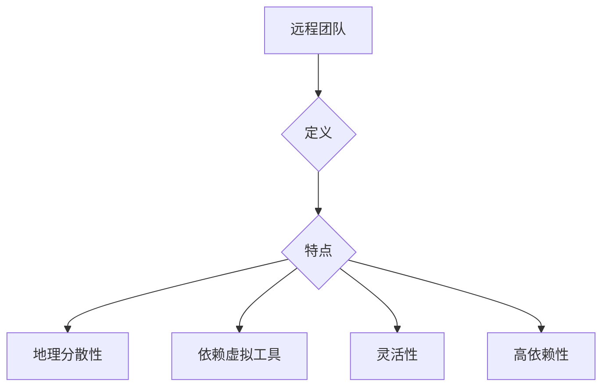
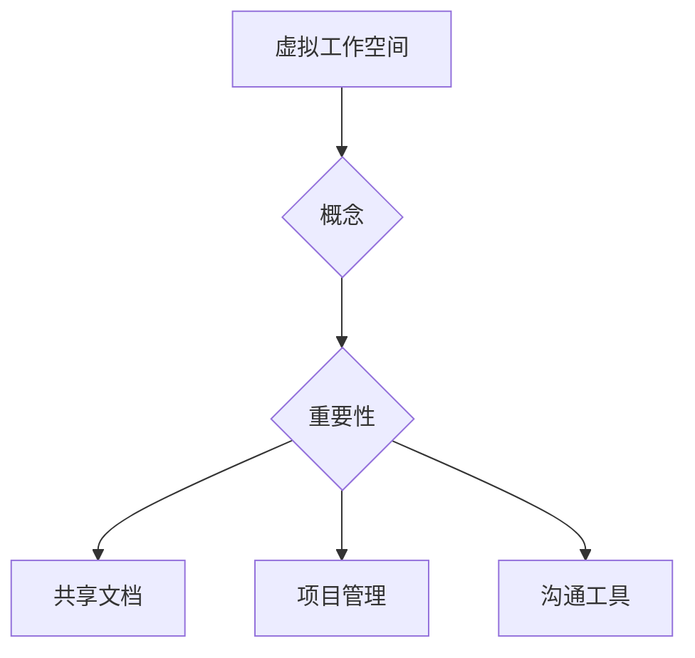
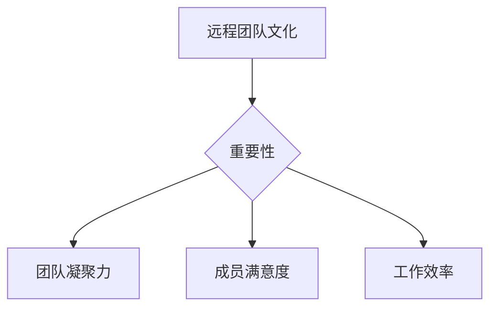

                 


### 文章标题：打造高效远程团队：虚拟环境下的协作策略

#### 关键词：
- 远程团队
- 虚拟协作
- 高效管理
- 沟通工具
- 远程工作文化

#### 摘要：
本文旨在探讨如何打造一个高效远程团队，通过分析虚拟环境下协作的挑战和策略，提供实际可行的解决方案。文章首先介绍了远程团队的发展趋势和优势，接着深入讨论了远程协作面临的挑战，以及如何利用现代技术和工具来克服这些挑战。文章还探讨了如何建立远程工作文化，以及提供了一些实用的最佳实践和项目实战案例。

### 第一部分：远程团队概述与基础

#### 第1章：远程团队的概念与趋势

##### 1.1 远程团队的定义与特点
远程团队是指利用互联网和虚拟工具进行协作的团队，团队成员通常位于不同的地理位置。远程团队的特点包括地理分散性、依赖虚拟工具、灵活性和高依赖性。

**核心概念与联系**
- **概念联系**：远程团队的工作方式依赖于网络技术和虚拟工具，这使得团队成员可以在任何地方进行高效协作。
  
**Mermaid 流程图**


##### 1.2 远程团队的发展趋势
远程团队的发展受到技术进步、劳动力需求和全球化等因素的推动。随着5G和云计算技术的发展，远程团队的工作效率和灵活性将得到进一步提升。

**核心算法原理讲解**
- **算法原理**：远程团队的工作效率提升主要依赖于高效的网络通信和协同工具。

**伪代码**
```python
def remote_collaboration efficiency():
    if (network_speed >= 5G) and (cloud_computing_tools):
        return "High"
    else:
        return "Low"
```

##### 1.3 远程团队的优劣势分析
远程团队具有成本节省、灵活高效、人才多样和环境友好等优势，但也面临沟通障碍、管理难度和工作压力等挑战。

**核心算法原理讲解**
- **算法原理**：通过建立有效的沟通机制和管理流程，可以最大程度地克服远程团队的劣势。

**数学模型**
$$\text{团队效率} = \frac{\text{完成任务的质量}}{\text{耗费的时间}}$$

**举例说明**
假设团队A在远程协作下完成任务的质量为90%，耗费时间为5天，则团队效率为18。

### 第二部分：虚拟环境协作策略

#### 第2章：虚拟工作空间设计

##### 2.1 虚拟工作空间的概念与重要性
虚拟工作空间是远程团队协作的核心，它提供了共享文档、项目管理、沟通工具等功能。

**核心概念与联系**
- **概念联系**：虚拟工作空间是远程团队协作的基石，它连接了团队成员，提供了高效的工作环境。

**Mermaid 流程图**


##### 2.2 虚拟工作空间的工具选择
选择适合远程团队协作的工具是关键。常见的工具包括Slack、Trello、Google Workspace等。

**核心算法原理讲解**
- **算法原理**：选择合适的工具能够提高团队协作的效率。

**伪代码**
```python
def select_collaboration_tool(team_size, project_type):
    if team_size > 50 and project_type == "Research":
        return "JIRA"
    elif team_size <= 50 and project_type == "Development":
        return "Slack"
    else:
        return "Google Workspace"
```

##### 2.3 虚拟工作空间的最佳实践
为了确保虚拟工作空间的效率，需要遵循一些最佳实践，如定期更新文档、清晰的任务分配和有效的沟通。

**最佳实践 tips**
- **定期更新文档**：确保团队成员都能访问最新的文档和资料。
- **清晰的任务分配**：明确团队成员的任务和责任。
- **有效的沟通**：保持频繁的沟通，及时解决问题。

### 第三部分：高效远程团队的实践与应用

#### 第3章：远程团队文化建设

##### 3.1 远程团队文化的重要性
远程团队文化是团队成功的关键因素，它能够增强团队凝聚力，提高团队成员的满意度和工作效率。

**核心概念与联系**
- **概念联系**：远程团队文化是虚拟环境下团队协作的精神支柱。

**Mermaid 流程图**


##### 3.2 建立远程团队文化的策略
建立远程团队文化需要从领导层到基层员工的共同努力，包括定期团队建设活动、明确价值观和行为规范等。

**最佳实践 tips**
- **定期团队建设活动**：通过线上活动增强团队成员之间的联系。
- **明确价值观和行为规范**：确保团队成员在行为和决策上保持一致性。
- **领导者示范作用**：领导者需要通过行为来树立榜样。

### 文章标题：打造高效远程团队：虚拟环境下的协作策略

> 作者：AI天才研究院/AI Genius Institute & 禅与计算机程序设计艺术 /Zen And The Art of Computer Programming

## 摘要
在当今全球化的商业环境中，远程团队已经成为许多公司的首选工作模式。本文旨在探讨如何打造一个高效远程团队，通过分析虚拟环境下协作的挑战和策略，提供实际可行的解决方案。文章首先介绍了远程团队的发展趋势和优势，接着深入讨论了远程协作面临的挑战，以及如何利用现代技术和工具来克服这些挑战。文章还探讨了如何建立远程工作文化，以及提供了一些实用的最佳实践和项目实战案例。

## 引言
### 远程团队的兴起
远程团队的概念并非新鲜事物，但随着互联网技术的飞速发展，远程团队的重要性日益凸显。越来越多的公司开始意识到，远程团队能够带来诸多优势，如提高员工满意度、降低运营成本、拓展人才池等。因此，如何打造一个高效远程团队，成为企业管理者面临的重要课题。

### 本文目的
本文旨在为远程团队管理者提供一套完整的协作策略，帮助他们在虚拟环境下提高团队效率，实现持续发展。文章将分为三个部分：

1. 远程团队概述与基础
2. 虚拟环境协作策略
3. 高效远程团队的实践与应用

### 目录
1. 远程团队概述与基础
   1.1 远程团队的概念与特点
   1.2 远程团队的发展趋势
   1.3 远程团队的优劣势分析
2. 虚拟环境协作策略
   2.1 虚拟工作空间设计
   2.2 虚拟工作空间的工具选择
   2.3 虚拟工作空间的最佳实践
3. 高效远程团队的实践与应用
   3.1 远程团队文化建设
   3.2 远程团队项目实战
   3.3 远程团队未来展望与趋势

## 第一部分：远程团队概述与基础

### 1.1 远程团队的概念与特点
#### 远程团队的定义
远程团队是指团队成员分布在不同的地理位置，通过互联网和虚拟工具进行沟通与协作的团队。这种工作模式使得团队成员可以不受地理位置的限制，灵活地安排工作时间和工作地点。

#### 远程团队的特点
1. **地理分散性**
   远程团队成员分布在全球各地，他们可以在不同的时区和工作环境中工作。
   
2. **技术依赖性**
   远程团队高度依赖互联网、通信工具和协作平台，以确保高效的信息传递和协作。

3. **灵活性**
   远程团队可以灵活地调整工作时间，以适应团队成员的生活习惯和工作需求。

4. **高依赖性**
   远程团队的成功在很大程度上依赖于团队成员之间的信任和沟通，以及良好的协作机制。

### 1.2 远程团队的发展趋势
#### 技术进步
随着5G、云计算和人工智能等技术的不断发展，远程团队的工作效率和灵活性将得到进一步提升。

#### 劳动力需求
越来越多的公司意识到远程团队的优势，开始招聘远程工作者，以满足业务增长和人才需求。

#### 全球化
远程团队使得跨国合作变得更加容易，企业可以通过远程团队拓展全球市场。

### 1.3 远程团队的优劣势分析
#### 优势
1. **成本节省**
   远程团队可以节省大量的办公场所、设备和交通成本。

2. **灵活高效**
   远程团队可以灵活安排工作时间，提高工作效率。

3. **人才多样性**
   远程团队可以吸引来自世界各地的优秀人才。

4. **环境友好**
   远程工作减少了员工的通勤时间，有助于减少碳排放。

#### 劣势
1. **沟通障碍**
   远程团队容易产生沟通障碍，影响团队协作。

2. **管理难度**
   远程团队的管理难度较大，需要建立完善的协作机制。

3. **工作压力**
   远程工作者可能会面临更多的工作压力和孤独感。

## 第二部分：虚拟环境协作策略

### 2.1 虚拟工作空间设计
#### 虚拟工作空间的概念
虚拟工作空间是远程团队协作的核心，它提供了团队成员之间共享文档、项目管理和沟通工具的平台。

#### 虚拟工作空间的设计原则
1. **易用性**
   虚拟工作空间应该简单易用，使得团队成员能够快速上手。

2. **灵活性**
   虚拟工作空间应支持多种设备和操作系统，以适应不同团队成员的需求。

3. **安全性**
   虚拟工作空间应具备强大的安全性，确保团队成员的隐私和数据安全。

#### 虚拟工作空间的关键功能
1. **文档共享**
   虚拟工作空间应支持团队成员实时共享和编辑文档。

2. **项目管理**
   虚拟工作空间应提供项目管理工具，帮助团队成员跟踪任务进度和项目状态。

3. **沟通工具**
   虚拟工作空间应集成即时通讯、视频会议和邮件通知等功能。

### 2.2 虚拟工作空间的工具选择
#### 工具选择的考虑因素
1. **团队规模**
   大型团队可能需要功能更全面的工具，而小型团队则可能更倾向于简单易用的工具。

2. **项目类型**
   项目类型会影响所需工具的功能，例如研发项目和市场营销项目可能需要不同的工具。

3. **预算**
   预算限制将影响可用的工具选择，企业需要根据预算选择最合适的工具。

#### 常见虚拟工作空间工具
1. **Slack**
   Slack是一个流行的团队协作工具，提供即时通讯、文档共享和集成第三方应用等功能。

2. **Trello**
   Trello是一个基于看板的项目管理工具，适用于各种类型的项目。

3. **Google Workspace**
   Google Workspace包括Google Docs、Google Sheets、Google Drive等，提供强大的文档编辑和共享功能。

### 2.3 虚拟工作空间的最佳实践
#### 定期更新文档
确保团队成员都能访问最新的文档和资料，减少信息滞后。

#### 清晰的任务分配
明确团队成员的任务和责任，避免任务重叠和责任模糊。

#### 有效的沟通
保持频繁的沟通，及时解决问题，确保团队协作顺畅。

### 第三部分：高效远程团队的实践与应用

#### 3.1 远程团队文化建设
#### 远程团队文化的重要性
远程团队文化是团队凝聚力和员工满意度的重要保障，它能够促进团队成员之间的信任和协作。

#### 建立远程团队文化的策略
1. **定期团队建设活动**
   通过线上活动增强团队成员之间的联系。

2. **明确价值观和行为规范**
   确保团队成员在行为和决策上保持一致性。

3. **领导者示范作用**
   领导者需要通过行为来树立榜样。

#### 维护远程团队文化的最佳实践
1. **及时反馈**
   定期收集团队成员的反馈，及时调整团队文化策略。

2. **透明沟通**
   保持沟通的透明度，确保团队成员了解团队的目标和进展。

3. **鼓励创新**
   鼓励团队成员提出新的想法和建议，营造创新氛围。

#### 3.2 远程团队项目实战
##### 开发环境搭建
在远程团队中，搭建统一的开发环境是确保项目顺利进行的重要步骤。以下是一个基本的开发环境搭建流程：

1. **选择合适的开发工具**
   根据项目需求选择合适的编程语言、集成开发环境（IDE）和版本控制工具。

2. **配置持续集成/持续部署（CI/CD）工具**
   使用Jenkins、Travis CI等工具实现代码的自动化构建、测试和部署。

3. **设置代码仓库**
   使用GitHub、GitLab等代码仓库管理工具，确保代码的安全存储和版本控制。

##### 源代码详细实现和代码解读
在项目开发过程中，需要遵循一定的编程规范，以确保代码的可读性和可维护性。以下是一个简单的代码示例：

**伪代码示例**
```python
def calculate_area(radius):
    """计算圆的面积"""
    area = 3.14 * radius * radius
    return area

def main():
    radius = input("请输入圆的半径：")
    area = calculate_area(radius)
    print(f"圆的面积为：{area}")

if __name__ == "__main__":
    main()
```

**代码解读**
- `calculate_area` 函数用于计算圆的面积。
- `main` 函数用于获取用户输入并输出结果。

##### 代码应用解读与分析
在实际应用中，上述代码可以用于计算不同半径圆的面积，从而为用户提供实用的计算服务。以下是一个具体案例：

**案例：计算不同圆的面积**
- 输入：半径分别为2cm、3cm、4cm的圆。
- 输出：每个圆的面积。

**分析与优化**
- **性能优化**：对于计算圆面积的函数，可以考虑使用更精确的数学常数。
- **用户界面**：为了提高用户体验，可以考虑使用图形用户界面（GUI）替代命令行界面。

##### 实际案例分析
以下是一个远程团队项目实战案例，该项目是一个在线教育平台，旨在提供远程教育服务。

**项目背景**
- **目标**：开发一个功能完善的在线教育平台，支持课程发布、在线学习、作业提交和成绩管理等。

**项目实施**
1. **需求分析**：明确平台的功能需求和用户体验。
2. **技术选型**：选择合适的技术栈，如前端框架React、后端框架Django等。
3. **开发与测试**：进行模块化开发，并进行单元测试和集成测试。
4. **部署与维护**：部署到云服务器，进行日常监控和故障处理。

**项目小结**
- **成功因素**：明确的规划和协作、有效的沟通和反馈、合理的资源分配。
- **挑战与解决**：技术难题、沟通障碍、项目管理。

#### 3.3 远程团队未来展望与趋势
##### 技术发展趋势
1. **人工智能与远程协作**：人工智能技术将进一步提升远程团队的协作效率。
2. **云计算与边缘计算**：云计算和边缘计算将为远程团队提供更强大的计算能力和数据存储。

##### 远程工作文化演变
1. **个性化工作模式**：远程团队将更加关注个体差异，提供个性化工作模式。
2. **数字化领导力**：领导者需要具备数字时代的领导力，以适应远程团队的管理挑战。

## 结论
远程团队已经成为现代企业不可或缺的一部分。通过本文的讨论，我们了解了远程团队的概念、发展趋势、协作策略以及实践应用。在未来，远程团队将继续发展，带来更多的机遇和挑战。管理者需要不断学习和适应，打造一个高效、和谐的远程团队。

## 拓展阅读
- **《远程工作：如何提高效率与协作》**：详细介绍了远程工作的最佳实践和策略。
- **《数字化领导力》**：探讨了数字化时代领导力的关键要素。
- **《远程工作：技术与文化》**：分析了远程工作中的技术挑战和文化建设。

