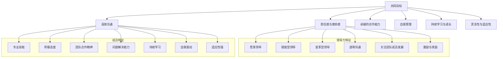

                 


### 文章标题

**打造高绩效团队：从average到outstanding**

### 关键词

- 高绩效团队
- 团队绩效评估
- 领导力提升
- 团队建设策略
- 激励与奖励
- 创新与变革

### 摘要

本文旨在探讨如何将一个平均水平的团队打造成为高绩效团队。通过详细分析团队绩效评估、团队特征、团队建设策略、领导力提升、激励与奖励、创新与变革等方面的内容，为团队管理者提供系统而实用的指导。文章将结合实际案例，阐述每个关键领域的核心概念、算法原理、数学模型，以及项目实战中的最佳实践，帮助读者逐步提升团队绩效，实现从average到outstanding的跨越。

## 引言

在当今快速变化和高度竞争的商业环境中，高绩效团队的重要性日益凸显。一个优秀的高绩效团队能够迅速响应市场变化，高效完成复杂任务，持续创新并保持竞争优势。相反，一个绩效平平的团队可能会导致资源浪费、项目延误，甚至影响到整个组织的运营和发展。

然而，打造高绩效团队并非易事。它需要明确的绩效评估标准、有效的团队建设策略、卓越的领导力、激励与奖励机制的有机结合。本文将从多个维度探讨如何实现这一目标，提供系统而实用的指导。

本文的结构如下：

- **第一部分：团队绩效评估**：介绍团队绩效评估的重要性、方法及常见误区。
- **第二部分：高绩效团队特征**：分析高绩效团队的定义、领导力和成员特征。
- **第三部分：团队建设策略**：探讨团队沟通技巧、协作与冲突管理。
- **第四部分：领导力提升**：讨论领导力类型、影响力与激励策略。
- **第五部分：团队激励与绩效奖励**：介绍激励理论、绩效奖励制度设计。
- **第六部分：团队创新与变革**：探讨创新的重要性、变革管理策略。
- **第七部分：案例分析与总结**：通过案例分析总结成功经验，展望未来团队管理的挑战。

本文将结合具体案例和实践，详细讲解每个部分的核心概念、算法原理、数学模型和项目实战，旨在为团队管理者提供一套实用、高效的团队绩效提升方案。

## 第一部分：团队绩效评估

### 1.1 团队绩效评估的重要性

团队绩效评估是衡量团队工作效率和成果的重要手段。通过科学的评估体系，可以直观地了解团队的工作表现，识别绩效优秀和不足的成员，从而为后续的团队建设、人才培养和激励制度提供依据。

**评估的重要性体现在以下几个方面：**

1. **激励与奖励：** 有效的绩效评估能够激励团队成员发挥潜力，通过奖励机制激发工作积极性。
2. **团队改进：** 通过绩效评估，可以发现团队运作中的问题和瓶颈，为团队改进提供方向。
3. **人才发展：** 绩效评估结果有助于识别团队成员的潜力和短板，为培训和发展计划提供参考。
4. **组织决策：** 团队绩效评估为组织高层决策提供数据支持，如人员调配、资源分配等。

### 1.2 团队绩效评估的常见方法

团队绩效评估的方法多种多样，以下是一些常见的方法：

1. **关键绩效指标（KPI）：** KPI 是通过设定一系列关键指标来衡量团队绩效的方法。这些指标通常是量化的，如销售额、完成项目数、客户满意度等。

2. **目标管理法（MBO）：** MBO 是一种由管理层和员工共同设定目标，并通过评估目标完成情况来衡量团队绩效的方法。这种方法强调目标的明确性和可衡量性。

3. **平衡计分卡（BSC）：** BSC 是一种将绩效评估分为四个维度（财务、客户、内部流程、学习与成长）的方法。这种方法能够全面衡量团队绩效，并促进团队平衡发展。

4. **360度反馈：** 360度反馈是通过收集团队成员、领导、同事和下属的意见来评估个人和团队绩效的方法。这种方法有助于发现潜在问题和改进点。

### 1.3 团队绩效评估的误区与挑战

尽管团队绩效评估具有重要的意义，但在实际操作中常常面临一些误区和挑战：

1. **过于依赖量化指标：** 过分依赖量化指标可能导致团队成员过分追求短期成果，而忽视长期发展。

2. **主观评价过多：** 如果评估过程缺乏客观标准，容易导致主观评价过多，从而影响评估结果的公正性和可信度。

3. **忽视员工参与：** 员工在绩效评估过程中的参与感不足，可能导致他们对评估结果的接受度低。

4. **评估频率不当：** 过高或过低的评估频率都可能影响评估的有效性。过高频率的评估可能导致团队成员感到压力过大，而过低频率的评估则可能无法及时发现和解决问题。

### 1.4 团队绩效评估的流程与实施步骤

一个有效的团队绩效评估通常包括以下步骤：

1. **明确评估目的：** 确定评估的具体目标和目的，如激励、改进、人才发展等。

2. **设定评估标准：** 根据评估目的设定评估标准，包括定量指标和定性指标。

3. **制定评估计划：** 制定详细的评估计划，包括评估时间、评估方式、评估团队等。

4. **实施评估：** 按照计划进行评估，收集数据，并进行分析。

5. **反馈与沟通：** 将评估结果及时反馈给团队成员，并与其进行沟通，讨论改进措施。

6. **持续跟踪与改进：** 定期跟踪评估结果，并根据反馈调整评估标准和策略。

通过以上步骤，团队能够建立起一个科学、公正、有效的绩效评估体系，从而为团队绩效的提升提供有力支持。

### 1.5 团队绩效评估中的算法原理

团队绩效评估不仅依赖于主观判断，还需要借助一些算法和模型来提高评估的准确性和客观性。以下是一些常见的算法原理：

1. **层次分析法（AHP）：** AHP 是一种定性与定量相结合的评估方法，通过构建层次模型，将不同指标进行相对权重计算，从而确定各项指标的相对重要性。

   **算法原理：**
   - **建立层次模型：** 将评估指标分为目标层、准则层和方案层。
   - **构建判断矩阵：** 根据专家意见，构建判断矩阵，并进行一致性检验。
   - **计算权重：** 通过矩阵乘法计算各指标的权重。

   **伪代码：**
   ```plaintext
   function calculate_weights(matrix):
       n = size(matrix)
       for i in range(1, n):
           for j in range(1, n):
               if i == j:
                   continue
               matrix[i][j] = matrix[j][i]
       
       for i in range(1, n):
           sum = 0
           for j in range(1, n):
               sum += matrix[i][j]
           for j in range(1, n):
               matrix[i][j] = matrix[i][j] / sum
   
       return matrix
   ```

2. **主成分分析（PCA）：** PCA 是一种降维技术，通过将原始数据映射到新的正交坐标系中，提取主要变量，从而减少数据维度。

   **算法原理：**
   - **标准化数据：** 对原始数据按列进行标准化处理。
   - **计算协方差矩阵：** 计算数据的协方差矩阵。
   - **计算特征值和特征向量：** 解特征方程，计算特征值和特征向量。
   - **构建投影矩阵：** 使用特征向量构建投影矩阵。

   **伪代码：**
   ```plaintext
   function pca(X):
       n, d = size(X)
       X_mean = mean(X, axis=0)
       X_centered = X - X_mean
   
       cov_matrix = np.dot(X_centered.T, X_centered) / (n - 1)
       eigenvalues, eigenvectors = np.linalg.eigh(cov_matrix)
       eigenvectors = eigenvectors[:, ::-1]
       eigenvalues = eigenvalues[::-1]
       
       projection_matrix = eigenvectors[:, :k]  # k 为保留的主成分数量
       projected_data = np.dot(X_centered, projection_matrix)
       
       return projected_data
   ```

3. **模糊综合评价法（Fuzzy Comprehensive Evaluation）：** FCE 是一种基于模糊数学的综合评价方法，适用于指标权重和评估结果存在模糊性的情况。

   **算法原理：**
   - **构建模糊关系矩阵：** 根据评估指标的重要性，构建模糊关系矩阵。
   - **计算综合评价结果：** 使用模糊综合评价模型，计算综合评价结果。

   **伪代码：**
   ```plaintext
   function fuzzy_evaluation(R, W):
       n = size(W)
       m = size(R)
       Z = np.dot(W.T, R)
       for i in range(1, n):
           for j in range(1, m):
               Z[i][j] = min(Z[i])
       
       return Z
   ```

通过这些算法原理的应用，团队能够更加科学、系统地评估团队成员和团队整体的绩效，从而为团队管理和优化提供有力支持。

### 1.6 团队绩效评估中的数学模型

在团队绩效评估中，数学模型的应用能够帮助团队管理者更准确地衡量团队表现，并预测团队未来的发展趋势。以下介绍几种常见的数学模型：

1. **线性回归模型（Linear Regression Model）：** 线性回归模型用于分析自变量和因变量之间的线性关系。

   **模型公式：**
   $$ y = \beta_0 + \beta_1x_1 + \beta_2x_2 + ... + \beta_nx_n + \epsilon $$
   其中，$y$ 是因变量，$x_1, x_2, ..., x_n$ 是自变量，$\beta_0, \beta_1, ..., \beta_n$ 是模型参数，$\epsilon$ 是误差项。

   **举例说明：**
   假设我们想要预测团队的项目完成时间（因变量$y$）与团队成员的数量（自变量$x_1$）和团队的工作效率（自变量$x_2$）之间的关系。通过收集历史数据，我们可以建立一个线性回归模型，并使用该模型预测新的项目完成时间。

2. **多元回归模型（Multiple Regression Model）：** 多元回归模型是线性回归模型的扩展，用于分析多个自变量和因变量之间的线性关系。

   **模型公式：**
   $$ y = \beta_0 + \beta_1x_1 + \beta_2x_2 + ... + \beta_nx_n + \epsilon $$
   其中，$y$ 是因变量，$x_1, x_2, ..., x_n$ 是自变量，$\beta_0, \beta_1, ..., \beta_n$ 是模型参数，$\epsilon$ 是误差项。

   **举例说明：**
   假设我们想要分析团队绩效（因变量$y$）与团队成员的工作经验（自变量$x_1$）、团队沟通效率（自变量$x_2$）和团队培训投入（自变量$x_3$）之间的关系。通过收集相关数据，我们可以建立一个多元回归模型，并使用该模型分析各个自变量对团队绩效的影响。

3. **时间序列分析（Time Series Analysis）：** 时间序列分析用于分析随时间变化的数据序列，预测未来的趋势。

   **模型公式：**
   $$ y_t = \alpha + \beta_1y_{t-1} + \beta_2y_{t-2} + ... + \beta_ky_{t-k} + \epsilon_t $$
   其中，$y_t$ 是第$t$时间点的数据值，$\alpha, \beta_1, \beta_2, ..., \beta_k$ 是模型参数，$\epsilon_t$ 是误差项。

   **举例说明：**
   假设我们想要预测团队每月的销售额（因变量$y_t$），并分析历史销售额（自变量$y_{t-1}, y_{t-2}, ..., y_{t-k}$）对预测值的影响。通过收集历史数据，我们可以建立一个时间序列模型，并使用该模型预测未来的销售额。

通过这些数学模型的应用，团队能够更准确地衡量和预测团队表现，从而为团队管理和优化提供有力支持。

### 1.7 团队绩效评估中的实际案例

为了更好地理解团队绩效评估的实践过程，我们来看一个实际案例。

**案例：某互联网公司的团队绩效评估**

某互联网公司希望对其研发团队进行绩效评估，以提升团队整体绩效。为此，公司采用以下步骤进行评估：

1. **明确评估目的：** 公司确定评估的目的是为了激励团队成员、识别问题并进行改进。

2. **设定评估标准：** 公司制定了以下关键绩效指标（KPI）：
   - 项目完成率：项目按期完成的百分比。
   - 错误率：项目上线后出现错误的比例。
   - 团队协作效率：团队成员之间的沟通与协作情况。
   - 创新能力：团队在项目中的创新程度。

3. **收集数据：** 公司通过项目管理工具和问卷调查收集了相关数据。

4. **分析数据：** 公司使用Excel进行数据分析，并应用层次分析法（AHP）确定各指标的权重。

5. **评估结果：** 根据分析结果，公司得出以下评估结论：
   - 项目完成率和团队协作效率较高，但错误率较高，需要加强测试和问题排查。
   - 团队成员之间的沟通效率有待提升，需要加强沟通技巧培训。
   - 创新能力较强，可以继续保持并进一步挖掘。

6. **反馈与沟通：** 公司将评估结果反馈给团队成员，并召开会议讨论改进措施。

7. **持续跟踪：** 公司将定期跟踪评估结果，并根据反馈进行调整。

通过这个实际案例，我们可以看到团队绩效评估在实践中的应用过程，以及如何通过科学的方法来提升团队绩效。

### 1.8 团队绩效评估中的注意事项与最佳实践

在进行团队绩效评估时，需要注意以下几点：

1. **明确评估目的：** 在进行评估前，要明确评估的目的，确保评估内容与目的相匹配。
2. **设定合理的评估标准：** 评估标准应具有可衡量性、客观性和针对性，避免主观偏见。
3. **充分收集数据：** 数据是评估的基础，要确保数据的准确性和完整性。
4. **定期进行评估：** 评估应定期进行，以便及时发现和解决问题。
5. **及时反馈与沟通：** 将评估结果及时反馈给团队成员，并与其进行沟通，共同探讨改进措施。
6. **持续改进：** 评估结果应用于团队改进，并持续跟踪改进效果。

最佳实践还包括：
- 建立评估模型，如使用AHP、PCA等方法，提高评估的科学性和准确性。
- 结合多种评估方法，如KPI、360度反馈等，全面衡量团队绩效。
- 注重员工参与，提高评估的接受度和有效性。

通过遵循这些注意事项和最佳实践，团队能够更有效地进行绩效评估，从而提升整体绩效。

### 1.9 拓展阅读

对于想要深入了解团队绩效评估的读者，以下是一些推荐的拓展阅读资源：

1. **《绩效管理：理论与实践》**：本书详细介绍了绩效管理的理论和方法，包括绩效评估、目标设定、反馈与改进等。
2. **《关键绩效指标（KPI）实战》**：本书通过案例研究，阐述了KPI在团队绩效评估中的应用和实施方法。
3. **《团队协作与沟通技巧》**：本书提供了丰富的团队协作与沟通技巧，有助于提升团队绩效。
4. **《变革型领导力》**：本书探讨了变革型领导力在团队管理中的应用，对于提升团队绩效具有重要意义。

通过这些拓展阅读资源，读者可以进一步加深对团队绩效评估的理解和实践。

## 第二部分：高绩效团队特征

### 2.1 高绩效团队的定义与特征

高绩效团队（High-Performance Team，HPT）是指能够高效完成复杂任务，持续创新并保持长期竞争优势的团队。高绩效团队具有一系列显著的特征，包括明确的共同目标、强大的凝聚力、卓越的沟通能力和高效的决策机制。

**高绩效团队的主要特征如下：**

1. **共同目标：** 高绩效团队的成员具有共同的愿景和目标，这些目标清晰明确，能够激励团队成员共同努力。

2. **责任感与使命感：** 高绩效团队的成员对自己的工作和团队的目标充满责任感，愿意承担必要的风险和责任。

3. **高效沟通：** 高绩效团队的成员之间沟通顺畅，能够有效地分享信息和知识，减少误解和冲突。

4. **卓越的合作能力：** 高绩效团队的成员能够充分发挥各自的优势，协同合作，共同解决问题。

5. **自我管理：** 高绩效团队的成员具备自我管理能力，能够在没有外部监督的情况下高效完成任务。

6. **持续学习与成长：** 高绩效团队的成员持续学习和成长，不断提升个人和团队的能力。

7. **灵活性与适应性：** 高绩效团队能够快速适应环境变化，灵活调整策略和行动。

### 2.2 高绩效团队的领导力特征

领导力在高绩效团队中起着至关重要的作用。高绩效团队的领导力特征包括以下几个方面：

1. **愿景领导：** 高绩效团队的领导具有明确的愿景，能够激励团队成员共同追求卓越。

2. **赋能型领导：** 高绩效团队的领导鼓励团队成员发挥个人潜力，提供必要的资源和支持。

3. **变革型领导：** 高绩效团队的领导能够推动团队不断变革和创新，引领团队适应外部环境的变化。

4. **透明沟通：** 高绩效团队的领导与成员之间保持透明沟通，及时分享团队信息和决策过程。

5. **关注团队成员发展：** 高绩效团队的领导关注团队成员的个人成长，提供培训和发展机会。

6. **激励与奖励：** 高绩效团队的领导通过激励和奖励机制，激发团队成员的积极性和创造力。

### 2.3 高绩效团队的成员特征

高绩效团队的成员具有以下共同特征：

1. **专业技能：** 高绩效团队的成员具备各自领域的专业技能，能够高效完成工作任务。

2. **积极态度：** 高绩效团队的成员具有积极的态度，乐于接受挑战，勇于承担责任。

3. **团队合作精神：** 高绩效团队的成员能够与团队成员密切合作，共同完成任务。

4. **问题解决能力：** 高绩效团队的成员具备较强的解决问题能力，能够迅速应对各种挑战。

5. **持续学习：** 高绩效团队的成员持续学习，不断提升个人技能和知识水平。

6. **自我驱动：** 高绩效团队的成员具有自我驱动能力，能够在没有外部压力的情况下主动完成任务。

7. **适应性强：** 高绩效团队的成员能够快速适应环境变化，灵活调整工作方式。

通过明确共同目标、强大领导力特征和成员特征，高绩效团队能够实现卓越的工作表现和长期发展。

### 2.4 高绩效团队的特征架构 Mermaid 流程图

为了更好地理解高绩效团队的特征及其相互关系，我们可以使用Mermaid流程图来展示这些特征。

**Mermaid流程图：**



通过上述Mermaid流程图，我们可以清晰地看到高绩效团队特征之间的相互关系，以及领导力和成员特征在高绩效团队中的重要性。

### 2.5 高绩效团队的构建步骤

构建高绩效团队是一个系统工程，需要明确的目标、科学的策略和持续的努力。以下是构建高绩效团队的步骤：

1. **明确共同目标：** 团队成员需要共同设定明确的愿景和目标，确保每个成员都清楚团队的最终目标。

2. **组建合适团队：** 根据团队目标，选择具备相关技能和经验的成员，并确保团队成员之间具有互补性。

3. **制定详细的计划：** 制定详细的行动计划，明确任务分工、时间节点和关键里程碑。

4. **建立信任机制：** 通过团队建设活动和日常沟通，建立成员之间的信任，促进团队合作。

5. **持续沟通与反馈：** 保持与团队成员的持续沟通，及时反馈工作进展和问题，确保团队目标的实现。

6. **培养领导力：** 提升团队领导者的领导能力，确保领导者能够激励和引导团队达成目标。

7. **提供资源支持：** 确保团队拥有完成任务的必要资源，包括人力、物力和技术支持。

8. **监测与调整：** 定期监测团队绩效，根据实际情况进行调整和优化，确保团队始终朝着目标前进。

通过以上步骤，团队能够逐步构建成为一个高绩效团队，实现卓越的工作表现和持续发展。

### 2.6 高绩效团队的管理策略

要维持高绩效团队，团队管理者需要采用一系列有效的管理策略。以下是一些关键的管理策略：

1. **目标导向：** 确保团队目标明确、具体、可衡量，并定期跟踪进展，确保团队始终朝着目标努力。

2. **持续沟通：** 保持与团队成员的持续沟通，鼓励开放的沟通环境，确保信息透明和及时传达。

3. **激励与奖励：** 设定合理的激励机制，对绩效优秀的团队成员给予奖励，激发团队积极性。

4. **能力提升：** 为团队成员提供培训和发展机会，不断提升团队成员的专业能力和综合素质。

5. **团队建设：** 定期组织团队建设活动，增强团队成员之间的凝聚力，提升团队整体合作能力。

6. **问题解决：** 鼓励团队成员主动解决问题，建立问题解决机制，确保问题得到及时、有效的解决。

7. **绩效评估：** 定期进行绩效评估，及时发现团队和成员的不足，制定改进计划。

通过以上管理策略，团队管理者能够有效地维持高绩效团队，确保团队在竞争激烈的环境中持续发展。

### 2.7 高绩效团队的案例分析

为了更好地理解高绩效团队的实践，我们来看一个实际案例。

**案例：谷歌的工程团队**

谷歌以其卓越的工程团队而闻名，其工程团队被广泛认为是全球最具创新力和高绩效的团队之一。以下是谷歌工程团队成功的关键要素：

1. **共同目标：** 谷歌工程团队的共同目标是推动技术创新，开发出用户喜爱的产品。这一目标激励了团队成员不断追求卓越。

2. **优秀领导力：** 谷歌的领导层具备强大的愿景和变革能力，能够激励团队创新，并提供必要的资源支持。

3. **持续学习：** 谷歌工程团队的成员持续学习新技术和知识，不断提升个人和团队的能力。

4. **灵活的工作环境：** 谷歌为团队成员提供了灵活的工作环境，鼓励自主学习和创新，减少了传统企业的约束。

5. **高效的沟通：** 谷歌采用开放的沟通机制，确保团队成员之间能够快速、高效地共享信息和知识。

6. **激励机制：** 谷歌为绩效优秀的团队成员提供丰厚的奖励和晋升机会，激发了团队积极性。

通过这个案例，我们可以看到高绩效团队的构建和管理需要明确的目标、优秀的领导力、持续学习、灵活的工作环境、高效的沟通和激励机制等多个方面的综合支持。

### 2.8 总结与展望

通过本文的探讨，我们可以得出以下结论：

1. 高绩效团队具有明确的共同目标、责任感与使命感、高效沟通、卓越的合作能力、自我管理、持续学习与成长、灵活性与适应性等特征。

2. 领导力是高绩效团队成功的关键，领导者需要具备愿景领导、赋能型领导、变革型领导、透明沟通、关注团队成员发展、激励与奖励等特征。

3. 团队成员需要具备专业技能、积极态度、团队合作精神、问题解决能力、持续学习、自我驱动、适应性强等特征。

4. 构建高绩效团队需要明确共同目标、组建合适团队、制定详细计划、建立信任机制、持续沟通与反馈、培养领导力、提供资源支持、监测与调整等步骤。

未来，团队管理者应关注以下几个趋势和挑战：

1. **数字化转型：** 随着数字化转型的加速，团队需要适应新的技术环境，提高数字化技能和协作能力。

2. **全球化挑战：** 全球化带来了文化差异和沟通障碍，团队需要加强跨文化沟通与合作。

3. **员工满意度：** 提高员工满意度是保持高绩效的关键，团队管理者需要关注员工的职业发展、工作与生活平衡等方面。

4. **持续创新：** 面对快速变化的市场环境，团队需要保持持续创新的能力，以适应不断变化的需求。

通过关注这些趋势和挑战，团队能够更好地应对外部变化，持续提升团队绩效，实现长期发展。

## 第三部分：团队建设策略

### 3.1 团队沟通技巧提升

团队沟通是团队建设中至关重要的一环。有效的沟通能够提高团队协作效率，减少误解和冲突，促进团队成员之间的信任和理解。以下是一些提升团队沟通技巧的方法：

1. **明确沟通目标：** 在每次沟通前，明确沟通的目标和期望结果，确保沟通的针对性和有效性。

2. **倾听技巧：** 倾听是有效沟通的关键，通过倾听对方的意见和需求，能够更好地理解对方，建立信任。

3. **积极反馈：** 在沟通过程中，给予积极的反馈，鼓励团队成员表达意见，并给予建设性的建议。

4. **清晰表达：** 使用简洁明了的语言，避免使用模糊或含糊的表述，确保信息传递的准确性。

5. **非言语沟通：** 关注非言语沟通，如肢体语言、面部表情和声音，这些非言语信息能够补充和强化言语沟通。

6. **避免争论：** 在沟通中避免无谓的争论，尊重对方的观点，通过事实和逻辑进行讨论。

7. **定期沟通：** 设立定期的沟通机制，如周会、月度总结等，确保团队成员之间保持持续的信息交流。

### 3.2 团队协作与冲突管理

团队协作和冲突管理是团队建设中的另一重要方面。以下是一些策略和方法：

1. **明确角色与职责：** 确保每个团队成员都清楚自己的角色和职责，避免职责重叠和冲突。

2. **建立共识：** 通过共同的目标和价值观，建立团队成员之间的共识，提高协作效率。

3. **团队协作工具：** 使用团队协作工具，如Slack、Trello等，提高团队成员之间的信息共享和工作协调。

4. **定期团队建设活动：** 通过定期的团队建设活动，增强团队成员之间的信任和默契。

5. **冲突解决策略：** 建立冲突解决机制，鼓励团队成员通过对话和协商解决冲突，避免个人化和攻击性的言语。

6. **积极沟通与反馈：** 通过积极的沟通和反馈，及时解决潜在冲突，防止问题扩大。

7. **冲突管理培训：** 为团队成员提供冲突管理培训，提高其应对冲突的能力。

### 3.3 团队协作技巧与实践

团队协作技巧不仅包括沟通和冲突管理，还需要一系列具体的方法和工具。以下是一些实用的团队协作技巧：

1. **任务分解：** 将大任务分解为小任务，明确每个任务的负责人和完成时间，确保任务有序推进。

2. **协作流程设计：** 设计合理的协作流程，明确每个环节的输入、输出和责任，确保协作的高效性。

3. **文档共享与管理：** 使用文档共享工具，如Google Docs、Notion等，确保文档的实时更新和共享，减少信息孤岛。

4. **实时沟通工具：** 利用实时沟通工具，如Slack、Microsoft Teams等，确保团队成员之间的即时沟通和信息传递。

5. **视频会议与远程协作：** 在远程工作环境中，利用视频会议工具，如Zoom、Google Meet等，提高远程协作的效率和效果。

6. **代码审查与版本控制：** 在软件开发团队中，使用代码审查和版本控制工具，如Git、Jenkins等，确保代码质量和团队协作。

7. **项目管理工具：** 使用项目管理工具，如Trello、Jira等，跟踪项目进展，分配任务，管理资源和风险。

### 3.4 团队建设策略的总结

团队建设策略不仅包括沟通技巧、协作方法和冲突管理，还需要结合实际场景进行灵活应用。以下是一些关键点：

1. **个性化策略：** 根据团队的实际情况和成员特点，制定个性化的团队建设策略，确保策略的有效性。

2. **持续优化：** 团队建设是一个持续的过程，需要定期评估和优化团队策略，以适应团队和环境的变迁。

3. **领导者作用：** 领导者在团队建设过程中起到关键作用，需要具备远见和领导力，引导团队走向成功。

4. **员工参与：** 鼓励员工参与团队建设，提高员工的参与感和认同感，增强团队的凝聚力和归属感。

5. **灵活应变：** 面对快速变化的外部环境，团队需要具备灵活应变的能力，及时调整团队策略和行动。

通过有效的团队建设策略，团队能够实现高效的协作和持续的发展，为组织的成功做出贡献。

## 第四部分：领导力提升

### 4.1 领导力的定义与类型

领导力是一种影响和激励他人实现共同目标的能力。它是团队管理和组织发展的重要基础。根据不同的分类标准，领导力可以分为多种类型：

1. **变革型领导（Transformational Leadership）：** 变革型领导注重激发团队成员的潜力，鼓励创新和变革。他们通过愿景激励、个人发展、激励和模范作用来推动团队发展。

2. **交易型领导（Transactional Leadership）：** 交易型领导侧重于通过奖励和惩罚来激励团队成员，维持组织效率和稳定。他们通过明确目标、提供反馈和奖励机制来引导团队行为。

3. **授权型领导（Authoritative Leadership）：** 授权型领导鼓励团队成员自主决策，发挥个人特长，增强团队凝聚力。他们通过信任和支持，赋予团队成员更多责任和权力。

4. **服务型领导（Servant Leadership）：** 服务型领导关注团队成员的需求和成长，致力于为团队成员提供支持和帮助。他们通过倾听、关心和培养，提升团队的凝聚力和绩效。

5. **民主型领导（Democratic Leadership）：** 民主型领导注重团队参与和民主决策，鼓励团队成员共同参与团队事务。他们通过沟通、讨论和协商，促进团队凝聚力和创新。

### 4.2 领导者的影响力与激励策略

领导力的影响力和激励策略是提升团队绩效的关键。以下是一些关键的领导策略：

1. **愿景激励：** 领导者需要明确团队的愿景和目标，通过愿景激励团队成员，激发他们的热情和动力。

2. **信任建立：** 领导者需要建立团队成员之间的信任，鼓励开放沟通和诚实反馈，营造一个支持性的工作环境。

3. **能力发展：** 领导者要关注团队成员的成长，提供培训和发展机会，提升团队整体能力。

4. **激励与奖励：** 通过设定激励目标和奖励机制，鼓励团队成员追求卓越，激发他们的积极性和创造力。

5. **榜样作用：** 领导者需要通过自身行为树立榜样，展示专业素质和领导风范，赢得团队成员的尊敬和信任。

6. **反馈与支持：** 领导者要提供及时、具体的反馈和支持，帮助团队成员改进工作，克服困难。

### 4.3 领导力发展方法

提升领导力是一个持续的过程，以下是一些有效的领导力发展方法：

1. **自我反思：** 领导者需要定期进行自我反思，分析自己的行为和决策，识别不足并制定改进计划。

2. **学习与实践：** 领导者要不断学习和实践，参加培训课程、阅读领导力书籍、参与领导力项目等，提升自己的领导能力。

3. **角色扮演：** 通过角色扮演和模拟情境，领导者可以练习应对不同情境的策略，提高决策和沟通能力。

4. **反馈与评估：** 领导者需要接受团队成员和上级的反馈，定期进行领导力评估，了解自己的优势和不足，并制定改进计划。

5. **导师辅导：** 寻求资深领导的辅导和建议，通过导师的指导，领导者可以更快地提升自己的领导能力。

6. **跨部门合作：** 通过跨部门合作，领导者可以拓展视野，学习不同领域的知识和技能，提升综合领导能力。

### 4.4 领导力在团队绩效提升中的作用

领导力在团队绩效提升中起着至关重要的作用。以下是领导力在提升团队绩效中的具体作用：

1. **目标设定：** 领导者通过明确目标和规划，帮助团队制定清晰的行动计划，确保团队目标的实现。

2. **激励与鼓励：** 领导者通过激励和鼓励，激发团队成员的工作热情和积极性，提高工作动力。

3. **团队建设：** 领导者通过团队建设活动，增强团队成员之间的信任和凝聚力，提升团队协作效率。

4. **问题解决：** 领导者通过有效的沟通和决策，帮助团队快速解决工作中遇到的问题和挑战。

5. **资源调配：** 领导者通过合理调配资源，确保团队拥有完成任务所需的资源和支持。

6. **绩效管理：** 领导者通过有效的绩效管理，识别团队成员的绩效表现，提供反馈和指导，提升团队整体绩效。

通过以上领导力的发展和应用，领导者能够有效提升团队绩效，实现团队的长期发展和成功。

### 4.5 领导力提升的最佳实践

为了提升领导力，以下是一些最佳实践：

1. **阅读领导力书籍：** 定期阅读领导力书籍，了解不同领导理论的实践应用。

2. **参加培训课程：** 报名参加领导力培训课程，通过专业讲师的指导和案例分享，提升领导能力。

3. **参与领导力项目：** 参与领导力项目，实践领导技能，通过实际操作提升领导能力。

4. **寻求反馈：** 定期向团队成员和上级寻求反馈，了解自己的优势和不足，制定改进计划。

5. **建立导师关系：** 寻求资深领导的指导，通过导师的反馈和建议，快速提升领导力。

6. **角色扮演练习：** 通过角色扮演和模拟情境，练习应对不同情境的领导策略，提高决策和沟通能力。

7. **反思与总结：** 定期进行自我反思和总结，分析自己的领导行为和决策，持续提升领导力。

通过遵循这些最佳实践，领导者可以不断提升自己的领导能力，为团队的成功和成长做出贡献。

### 4.6 领导力提升中的常见误区

在领导力提升过程中，一些常见的误区可能会影响领导者的成长和团队绩效。以下是一些常见的误区及对策：

1. **过度依赖领导力培训：** 领导者不能仅依靠外部培训，还需要通过实践和反思来提升领导能力。对策：将培训知识与实际工作相结合，持续反思和改进。

2. **忽视团队成员的需求：** 领导者应关注团队成员的成长需求，提供个性化的支持和指导。对策：定期与团队成员沟通，了解他们的需求和困惑，提供有针对性的帮助。

3. **过度控制与微观管理：** 领导者应赋予团队成员更多的自主权，避免过度控制。对策：明确团队成员的职责和目标，信任他们的能力，适当放权。

4. **缺乏持续学习和反思：** 领导者需要持续学习和反思，以适应快速变化的环境。对策：制定学习计划，定期进行自我反思，持续提升领导能力。

5. **只关注绩效而忽视团队氛围：** 领导者应平衡绩效和团队氛围，确保团队协作和成员满意度。对策：关注团队氛围，定期组织团队建设活动，提高团队凝聚力。

通过避免这些误区，领导者可以更加有效地提升领导能力，为团队的成功和发展做出贡献。

### 4.7 拓展阅读

对于想要深入了解领导力提升的读者，以下是一些推荐的拓展阅读资源：

1. **《领导力五项修炼》**：本书详细介绍了提升领导力的五个关键要素，包括自我认知、影响力、人际关系、团队建设和战略思考。
2. **《赋能：打造应对不确定性的敏捷团队》**：本书探讨了如何通过赋能型领导，提升团队适应变化的能力和创新能力。
3. **《领导者的法则》**：本书提供了丰富的领导力法则和实践案例，帮助领导者提升管理和领导能力。
4. **《高效能人士的七个习惯》**：本书介绍了七个提升个人效能的习惯，包括主动积极、以终为始、要事第一等，对领导力的提升具有指导意义。

通过这些拓展阅读资源，读者可以进一步加深对领导力提升的理解和实践。

## 第五部分：团队激励与绩效奖励

### 5.1 团队激励理论

团队激励是提升团队绩效和员工满意度的重要手段。激励理论为团队激励提供了理论基础，以下是一些主要的激励理论：

1. **马斯洛的需求层次理论（Maslow's Hierarchy of Needs）：** 马斯洛的需求层次理论认为人的需求可以分为生理需求、安全需求、社交需求、尊重需求和自我实现需求。团队激励应根据员工的不同需求层次进行。

2. **赫茨伯格的双因素理论（Herzberg's Two-Factor Theory）：** 赫茨伯格的双因素理论将影响员工工作满意度的因素分为激励因素（如成就、认可、工作本身）和保健因素（如薪酬、工作环境、公司政策）。激励因素能够提高员工的工作满意度和激励。

3. **公平理论（Equity Theory）：** 公平理论认为员工会根据相对报酬和投入来评估自己的待遇是否公平。团队激励应确保员工的报酬和投入与其所承担的工作和绩效相匹配。

4. **期望理论（Expectancy Theory）：** 期望理论认为员工的行为受到对结果期望、努力程度和结果价值的影响。团队激励应通过设定明确的目标和价值来激发员工的期望和动力。

### 5.2 团队激励策略

有效的团队激励策略能够提高员工的工作积极性、团队凝聚力和整体绩效。以下是一些常见的团队激励策略：

1. **目标设定：** 设定明确、具体、可衡量的团队目标，激发员工的内在动机和动力。

2. **认可与奖励：** 对员工的优秀表现给予及时的认可和奖励，如表扬、奖金、晋升等，增强员工的成就感和归属感。

3. **工作环境改善：** 提供良好的工作环境和设施，如舒适的工作场所、现代化的办公设备等，提高员工的工作满意度和舒适度。

4. **职业发展机会：** 为员工提供职业发展的机会，如培训、晋升、轮岗等，激发员工的成长欲望和动力。

5. **团队建设活动：** 定期组织团队建设活动，如团建、运动会、拓展训练等，增强团队成员之间的凝聚力和信任。

6. **公平待遇：** 确保员工获得公平的待遇，包括薪酬、福利、晋升机会等，提高员工的满意度和忠诚度。

### 5.3 绩效奖励制度设计

绩效奖励制度是团队激励的重要组成部分，以下是一些设计绩效奖励制度的关键原则：

1. **明确目标：** 设定清晰的绩效目标和评估标准，确保奖励与绩效直接相关。

2. **公平公正：** 确保奖励制度的公平性和公正性，避免主观偏见和歧视。

3. **合理分配：** 根据员工的绩效和贡献合理分配奖励，确保奖励的合理性和激励效果。

4. **多样化奖励：** 设计多样化的奖励形式，如奖金、股权激励、晋升机会等，满足不同员工的需求。

5. **透明公开：** 确保奖励制度的透明度和公开性，让员工了解奖励的依据和过程。

6. **持续改进：** 定期评估和改进奖励制度，确保其适应性和有效性。

通过合理设计绩效奖励制度，团队能够更好地激励员工，提升团队绩效和整体竞争力。

### 5.4 实际案例：某公司的绩效奖励制度

为了更好地理解绩效奖励制度的设计和应用，我们来看一个实际案例。

**案例：某科技公司的绩效奖励制度**

某科技公司为了提升员工的工作积极性和团队绩效，设计了一套完善的绩效奖励制度。以下是该公司的绩效奖励制度设计过程：

1. **明确绩效目标：** 公司根据业务目标和部门职责，设定了明确的绩效目标，包括项目完成率、客户满意度、创新能力等指标。

2. **制定评估标准：** 公司制定了详细的评估标准，明确了每个绩效指标的权重和评分细则，确保评估的客观性和公平性。

3. **绩效评估：** 公司采用季度和年度评估相结合的方式，对员工的绩效进行评估，并根据评估结果进行排名和评分。

4. **奖励分配：** 根据评估结果，公司设定了不同等级的奖励，包括现金奖金、股权激励、晋升机会等。奖励的分配依据员工的绩效贡献和团队整体表现。

5. **奖励发放：** 公司定期公示奖励名单和发放方式，确保奖励的透明度和公正性。

6. **反馈与改进：** 公司定期收集员工对绩效奖励制度的反馈，并根据反馈进行调整和改进，确保奖励制度的有效性和适应性。

通过以上步骤，该公司成功地建立了一套科学、合理、公平的绩效奖励制度，有效提升了员工的工作积极性和团队绩效。

### 5.5 绩效奖励制度的效果评估

绩效奖励制度的效果评估是确保其有效性和持续改进的重要环节。以下是一些评估方法和指标：

1. **员工满意度：** 通过问卷调查和访谈，了解员工对绩效奖励制度的满意度和接受度，评估奖励制度对员工激励的效果。

2. **绩效提升：** 通过对比绩效奖励制度实施前后的团队绩效数据，评估奖励制度对团队绩效提升的贡献。

3. **员工流失率：** 观察绩效奖励制度实施后的员工流失率，评估奖励制度对员工稳定性的影响。

4. **工作满意度：** 通过工作满意度调查，了解员工对工作环境的满意度，评估奖励制度对员工工作满意度的影响。

5. **团队合作：** 通过团队协作项目的完成情况和团队成员之间的互动，评估奖励制度对团队协作和凝聚力的提升效果。

通过以上评估方法和指标，团队能够及时发现问题，对绩效奖励制度进行优化和改进，确保其持续有效。

### 5.6 绩效奖励制度中的挑战与解决策略

在实施绩效奖励制度过程中，可能会面临一些挑战，以下是一些常见的挑战及解决策略：

1. **公平性问题：** 解决策略：建立透明的评估标准和流程，确保评估过程的公正性和客观性。

2. **奖励分配不均：** 解决策略：根据员工的绩效贡献和团队整体表现，合理分配奖励，确保奖励的公平性和合理性。

3. **员工满意度低：** 解决策略：定期收集员工反馈，了解员工的需求和期望，调整奖励制度，提高员工的满意度和参与度。

4. **奖励过度依赖：** 解决策略：结合多种激励手段，如职业发展、团队建设活动等，降低对奖励的过度依赖。

5. **短期行为倾向：** 解决策略：设定长期目标和激励机制，引导员工关注长期绩效，避免短期行为倾向。

通过有效的解决策略，团队能够克服绩效奖励制度中的挑战，确保其有效性和可持续性。

### 5.7 拓展阅读

对于想要深入了解团队激励与绩效奖励制度的读者，以下是一些推荐的拓展阅读资源：

1. **《激励管理》**：本书详细介绍了激励管理的基本理论和实践方法，包括动机理论、激励策略和绩效评估等。
2. **《绩效管理：实践与技巧》**：本书提供了丰富的绩效管理案例和实践技巧，帮助读者设计有效的绩效奖励制度。
3. **《奖励管理：如何设计和实施奖励计划》**：本书探讨了奖励计划的设计原则、实施方法和效果评估，提供了详细的指导。
4. **《激励与绩效提升》**：本书结合心理学和管理学理论，深入分析了激励与绩效提升的关系，为团队管理者提供了实用的指导。

通过这些拓展阅读资源，读者可以进一步加深对团队激励与绩效奖励制度的理解，提升团队绩效和员工满意度。

## 第六部分：团队创新与变革

### 6.1 创新的重要性

在当今快速变化和高度竞争的商业环境中，创新能力已成为企业持续发展和竞争优势的关键因素。创新不仅能够推动企业实现技术突破和市场扩张，还能够提升员工的工作满意度和组织活力。

**创新的重要性体现在以下几个方面：**

1. **市场竞争力：** 创新能够帮助企业开发新产品、优化现有产品，从而满足客户需求，提升市场竞争力。

2. **业务增长：** 创新是推动业务增长的关键动力，通过开拓新市场、推出新服务或优化业务流程，企业可以实现可持续增长。

3. **员工积极性：** 创新能够激发员工的创造力和工作热情，提高员工的满意度和忠诚度。

4. **组织文化：** 创新能够培养企业的创新文化，鼓励员工勇于尝试和探索，促进企业的持续发展和变革。

### 6.2 创新的驱动力与障碍

创新需要内部和外部驱动力，同时也面临着各种障碍。以下是一些主要的驱动力和障碍：

**驱动力：**

1. **市场需求：** 客户需求是创新的直接驱动力，企业通过了解客户需求，开发新产品和服务，满足市场需求。

2. **技术进步：** 技术创新能够推动产品和服务升级，提高企业的生产效率和竞争力。

3. **竞争压力：** 竞争对手的创新压力促使企业不断改进和优化，以保持市场地位。

4. **政策支持：** 政府的政策支持和资金投入能够为企业创新提供必要的资源和保障。

**障碍：**

1. **资源限制：** 创新需要大量的资金、人力资源和技术支持，资源限制可能阻碍创新的实施。

2. **组织文化：** 传统、保守的组织文化可能抑制创新思维，使企业难以适应外部环境的变化。

3. **风险规避：** 企业和管理层可能对创新风险持谨慎态度，不愿承担可能带来的失败和损失。

4. **决策滞后：** 创新决策过程可能过于复杂和缓慢，导致创新机会的丧失。

### 6.3 创新的管理与促进策略

为了有效管理和促进创新，企业需要建立一套系统化的创新管理体系。以下是一些关键的策略：

1. **创新愿景与目标：** 企业需要明确创新愿景和目标，确保创新活动与企业的长期发展战略相一致。

2. **创新资源投入：** 企业应确保创新所需的资金、人力资源和技术支持，为创新活动提供必要的保障。

3. **创新文化培育：** 企业应培育创新文化，鼓励员工提出新想法、尝试新方法，并容忍失败。

4. **创新激励机制：** 企业应建立激励机制，对创新者给予奖励和认可，提高员工的创新积极性。

5. **创新平台建设：** 企业应搭建创新平台，如创新实验室、头脑风暴会议等，提供交流和合作的机会。

6. **外部合作：** 企业应积极寻求与高校、科研机构、合作伙伴的合作，共享资源和知识，推动创新。

### 6.4 创新的管理流程

创新管理流程包括以下几个关键环节：

1. **创新构思：** 企业应鼓励员工提出创新构思，并通过头脑风暴、创意竞赛等方式收集和筛选创新想法。

2. **概念验证：** 对于筛选出的创新构思，企业应进行概念验证，评估其可行性和市场潜力。

3. **研发与测试：** 企业应投入研发资源，对通过概念验证的创新项目进行深入研发和测试，确保技术的成熟性和产品的可靠性。

4. **商业化实施：** 企业应制定商业化计划，推动创新项目的商业化实施，并确保产品或服务的市场推广和销售。

5. **持续改进：** 企业应建立持续改进机制，对创新项目进行跟踪和评估，根据市场反馈进行调整和优化。

### 6.5 创新案例解析

为了更好地理解创新的管理和实践，我们可以通过以下实际案例进行解析：

**案例：谷歌的“X实验室”**

谷歌的“X实验室”（Google X）是一个专门负责前沿技术研究和创新的项目部门。以下是其创新管理的关键要素：

1. **开放创新文化：** “X实验室”鼓励员工自由探索和尝试，允许失败，并提供必要的资源和支持。

2. **跨学科团队合作：** “X实验室”由来自不同领域的专家组成，他们共同合作，推动跨学科的创新。

3. **项目孵化机制：** “X实验室”通过项目孵化机制，将创新想法逐步推向商业化，如谷歌眼镜、无人驾驶汽车等。

4. **持续投资与支持：** 谷歌持续为“X实验室”提供资金和技术支持，确保其创新项目的顺利推进。

通过这个案例，我们可以看到谷歌如何通过创新文化、跨学科团队合作、项目孵化机制和持续投资，成功推动了一系列前沿技术的创新和商业化。

### 6.6 创新中的挑战与应对策略

在创新过程中，企业可能会面临一系列挑战，以下是一些常见的挑战及应对策略：

1. **资源限制：** 应对策略：通过优化资源配置、引入外部合作和共享资源，提高创新项目的成功率。

2. **风险规避：** 应对策略：建立风险管理和评估机制，鼓励创新的同时，降低风险。

3. **决策滞后：** 应对策略：简化决策流程，提高决策效率，确保创新机会不被错失。

4. **文化阻力：** 应对策略：通过培训和宣传，培养员工对创新的认知和接受度，逐步改变组织文化。

5. **市场不确定性：** 应对策略：加强市场调研和预测，提前准备应对措施，降低市场不确定性带来的风险。

通过有效的应对策略，企业可以克服创新过程中的挑战，实现持续的创新和突破。

### 6.7 拓展阅读

对于想要深入了解团队创新与变革的读者，以下是一些推荐的拓展阅读资源：

1. **《创新者的窘境》**：本书详细分析了企业创新过程中的常见困境和解决方法，对企业管理者具有很高的参考价值。

2. **《创新者的基因》**：本书探讨了创新者的思维方式、习惯和行为模式，提供了培养创新思维的具体方法。

3. **《设计思维》**：本书介绍了设计思维的方法论，包括用户研究、原型设计和迭代改进等，帮助读者培养创新思维。

4. **《变革之舞》**：本书探讨了企业在变革过程中的挑战和应对策略，提供了实用的变革管理指南。

通过这些拓展阅读资源，读者可以进一步加深对团队创新与变革的理解和实践。

## 第七部分：案例分析

### 7.1 案例选择与介绍

在本节中，我们将分析一个具有代表性的高绩效团队案例：谷歌的“X实验室”。谷歌的“X实验室”成立于2005年，旨在探索和研发前沿技术，如人工智能、虚拟现实、无人驾驶汽车等。通过这个案例，我们可以深入探讨高绩效团队的成功要素和关键策略。

### 7.2 案例分析与启示

**共同目标与愿景领导**

谷歌的“X实验室”成功的关键之一在于其明确的共同目标和愿景领导。谷歌创始人拉里·佩奇（Larry Page）和谢尔盖·布林（Sergey Brin）为“X实验室”设定了“创造有意义的突破性技术”的愿景，这一目标激励了团队成员不断追求卓越。

**灵活性与自主管理**

“X实验室”的团队成员在项目选择和执行上拥有高度的自主权。团队成员可以自由探索自己感兴趣的技术领域，并根据项目的进展自主调整工作方向。这种灵活性使得团队成员能够充分发挥个人潜力，提高创新效率。

**跨学科团队合作**

“X实验室”由来自不同领域的专家组成，包括计算机科学、机械工程、物理学等。团队成员之间的跨学科合作使得项目能够从多个角度进行探索和优化，提高了创新的成功率。

**持续投资与支持**

谷歌对“X实验室”的投资和支持力度巨大，确保了创新项目所需的资金、人力资源和技术支持。这种持续的投资和支持使得“X实验室”能够顺利推进一系列前沿技术的研发。

**开放创新文化**

“X实验室”鼓励员工自由探索和尝试，容忍失败，并提供了丰富的资源和平台支持。这种开放创新文化激发了团队成员的创新热情，促进了持续的技术突破。

### 7.3 案例应用与实践

**建立共同目标与愿景领导**

在企业内部，管理者可以通过明确共同目标和愿景领导，激励团队成员追求卓越。例如，企业可以设定“成为行业领导者”或“开发具有革命性意义的产品”等目标，并通过内部演讲、海报、邮件等方式传达给全体员工。

**灵活性与自主管理**

企业应赋予团队成员更多的自主权，鼓励他们根据项目进展自主调整工作方向。例如，企业可以推行“项目制”管理，让团队成员在项目选择和执行上拥有更大的自由度。

**跨学科团队合作**

企业可以通过组建跨学科团队，促进不同领域专家之间的合作。例如，企业可以设立跨部门项目小组，让团队成员从不同角度分析问题，提出创新解决方案。

**持续投资与支持**

企业应确保创新项目所需的资金、人力资源和技术支持。例如，企业可以设立专项创新基金，为有潜力的创新项目提供资金支持。

**开放创新文化**

企业应鼓励员工自由探索和尝试，容忍失败，并提供丰富的资源和平台支持。例如，企业可以定期举办创新竞赛、头脑风暴会议等活动，激发员工的创新思维。

通过以上案例应用和实践，企业可以借鉴谷歌“X实验室”的成功经验，构建高绩效团队，推动持续创新和突破。

### 7.4 案例总结与启示

谷歌“X实验室”的成功经验为高绩效团队的构建和持续创新提供了宝贵的启示：

1. **共同目标与愿景领导：** 明确的共同目标和愿景能够激励团队成员共同努力，追求卓越。

2. **灵活性与自主管理：** 赋予团队成员自主权，提高创新效率，促进团队协作。

3. **跨学科团队合作：** 跨学科合作能够从多个角度分析问题，提出创新解决方案。

4. **持续投资与支持：** 保障创新项目所需的资源，提高创新成功率。

5. **开放创新文化：** 鼓励员工自由探索和尝试，容忍失败，激发创新热情。

通过这些启示，企业可以更好地构建高绩效团队，推动持续创新，实现长期发展。

### 7.5 拓展阅读

对于希望深入了解高绩效团队构建和持续创新的读者，以下是一些推荐的拓展阅读资源：

1. **《创新者的DNA》**：本书分析了创新者的思维模式和行为习惯，提供了培养创新思维的具体方法。

2. **《团队协作的艺术》**：本书探讨了团队协作的原则和技巧，帮助团队提高协作效率和绩效。

3. **《颠覆性创新》**：本书详细阐述了颠覆性创新的理论和实践，为企业的创新战略提供了参考。

4. **《变革之舞》**：本书探讨了企业在变革过程中的挑战和应对策略，为管理者提供了实用的变革管理指南。

通过这些拓展阅读资源，读者可以进一步加深对高绩效团队构建和持续创新的理解和实践。

## 总结

本文通过深入分析团队绩效评估、高绩效团队特征、团队建设策略、领导力提升、团队激励与绩效奖励、团队创新与变革等方面，为团队管理者提供了一套系统而实用的团队绩效提升方案。以下是对本文核心内容的总结：

1. **团队绩效评估：** 通过科学的评估体系，明确团队绩效目标，设定合理的评估标准和流程，使用算法和模型提高评估准确性。

2. **高绩效团队特征：** 确立共同目标、责任感与使命感、高效沟通、卓越合作能力、自我管理、持续学习与成长、灵活性与适应性等特征。

3. **团队建设策略：** 提升团队沟通技巧、加强团队协作与冲突管理、利用团队协作工具和实践提升团队协作效率。

4. **领导力提升：** 定义领导力类型，实施愿景领导、赋能型领导、变革型领导等策略，培养领导力，提升团队绩效。

5. **团队激励与绩效奖励：** 应用激励理论，设计合理的绩效奖励制度，提高员工满意度，激发团队积极性。

6. **团队创新与变革：** 理解创新的重要性，实施创新管理与促进策略，推动持续创新，保持企业竞争力。

本文结合实际案例和实践，详细阐述了每个关键领域的核心概念、算法原理、数学模型和项目实战，旨在帮助团队管理者逐步提升团队绩效，实现从average到outstanding的跨越。

展望未来，团队管理者应关注数字化转型、全球化挑战、员工满意度提升和持续创新等趋势和挑战。通过不断学习和实践，团队能够在快速变化的环境中保持竞争力，实现长期发展。

## 作者信息

**作者：AI天才研究院/AI Genius Institute & 禅与计算机程序设计艺术 /Zen And The Art of Computer Programming**

AI天才研究院（AI Genius Institute）致力于推动人工智能技术的创新和发展，培养下一代人工智能领域的杰出人才。同时，我们致力于将人工智能技术与企业管理、团队建设等领域相结合，提供实用、高效的解决方案。本文作者通过对人工智能技术的深入研究和实践经验，结合禅与计算机程序设计艺术的哲学理念，撰写了这篇关于团队绩效提升的技术博客文章，旨在为团队管理者提供有价值的参考和指导。

