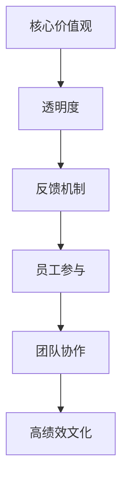

                 


根据上述的约束条件和要求，我将逐步构建文章的markdown格式内容。以下是初步的markdown格式内容：

```markdown
# 打造高绩效文化：从mediocrity到excellence

> 关键词：高绩效文化、绩效评估、领导力、企业文化、组织战略

> 摘要：本文深入探讨了高绩效文化的概念、构建方法以及其在现代企业中的重要性。通过分析核心概念之间的关系、方法论、领导力作用、企业文化与组织战略的关联，本文提供了从平庸到卓越的转型路径，并通过实际案例和项目实战展示了理论的应用。

---

## 引言

### 1.1 高绩效文化的定义

高绩效文化是一种以卓越为目标，通过明确的愿景和价值观，激发团队成员的潜能，实现持续进步和卓越成果的企业文化。它不仅仅关注短期的绩效提升，更注重长期的文化建设，旨在打造一支高效、团结、有创新力的团队。

### 1.2 高绩效文化的重要性

高绩效文化对企业的长远发展具有深远影响。它能够提高员工的满意度和忠诚度，增强企业的竞争力，推动创新，实现可持续发展。在当今竞争激烈的市场环境中，高绩效文化是企业取得成功的关键。

### 1.3 书籍结构概述

本书分为六个部分，首先介绍高绩效文化的核心概念和联系，然后详细阐述构建高绩效文化的策略，接着分析领导力在文化打造中的作用，探讨企业文化与组织战略的关联，并通过案例分析展示成功的高绩效文化实践，最后通过项目实战提供实际应用示例。

---

## 第1章：核心概念与联系

### 2.1 绩效评估的原理

绩效评估是高绩效文化构建的基础。本节将介绍绩效评估的核心概念，包括KPI（关键绩效指标）和OKR（目标与关键结果），以及不同的绩效评估方法，如360度评估、行为评估等。

### 2.2 高绩效文化的要素

高绩效文化的要素包括核心价值观、透明度、反馈机制、员工参与和团队协作。通过Mermaid流程图，我们将展示这些要素之间的关系和相互作用。



### 2.3 高绩效文化的Mermaid流程图

通过上述流程图，我们可以清晰地看到高绩效文化的构建过程。核心价值观是文化的基石，透明度、反馈机制、员工参与和团队协作则共同促进文化的形成和发展。

---

## 第2章：方法论

### 3.1 建立明确的愿景和目标

构建高绩效文化的第一步是建立明确的愿景和目标。本节将探讨如何制定愿景和目标，以及如何确保这些目标与企业的长期战略相一致。

### 3.2 提升个人绩效

个人绩效是团队绩效的基础。本节将介绍提升个人绩效的策略，包括自我管理技巧、时间管理和工作效率提升方法。

### 3.3 提升团队绩效

团队绩效的提升需要有效的团队建设和领导力。本节将讨论团队建设策略和提升领导力的方法，以促进团队协作和高效工作。

---

## 第3章：领导力在文化打造中的作用

### 4.1 领导者的角色

领导者在高绩效文化的构建中扮演关键角色。本节将探讨领导者的角色和职责，以及如何成为有效的领导者。

### 4.2 领导力与组织文化

领导力对组织文化有着深远的影响。本节将分析领导力如何塑造组织文化，以及高绩效文化如何影响领导力的实践。

---

## 第4章：企业文化与组织战略

### 5.1 战略与文化的融合

企业文化与组织战略的融合是实现高绩效的关键。本节将探讨如何将战略与企业文化相结合，以实现企业的长远发展。

### 5.2 高绩效文化的战略规划

战略规划是高绩效文化的重要组成部分。本节将介绍如何制定高绩效文化的战略规划，包括长期规划和短期目标。

---

## 第5章：案例分析

### 6.1 案例介绍

本节将介绍一些成功的高绩效文化案例，包括企业的背景、高绩效文化的实践和取得的成果。

### 6.2 案例分析

通过对案例的分析，我们将探讨成功的高绩效文化实践的关键因素和可复制的经验。

---

## 第6章：项目实战

### 7.1 项目背景

本节将介绍一个实际的项目背景，包括项目目标、环境和挑战。

### 7.2 代码实现与解读

在本节中，我们将提供项目代码的详细实现和解读，包括关键算法原理和使用伪代码展示。

### 7.3 结果与反思

通过分析项目的成果和经验教训，我们将总结项目中的成功经验和改进点。

---

## 总结与展望

### 8.1 全书要点回顾

本节将回顾全书的核心要点，帮助读者巩固对高绩效文化的理解和应用。

### 8.2 高绩效文化的未来趋势

本节将探讨高绩效文化的未来发展趋势，为读者提供前瞻性的思考和指导。

### 8.3 对读者的建议

最后，本节将给出一些建议，帮助读者在实际工作中应用高绩效文化。

---

## 附录

### 9.1 建议阅读书籍

本节将列出一些与高绩效文化相关的推荐书籍，供读者进一步阅读。

### 9.2 相关研究论文

本节将介绍一些与高绩效文化相关的学术论文，帮助读者了解学术界的最新研究成果。

### 9.3 实用工具与资源

本节将推荐一些实用的工具和资源，帮助读者在实际工作中应用高绩效文化。

---

## 作者信息

作者：AI天才研究院/AI Genius Institute & 禅与计算机程序设计艺术 /Zen And The Art of Computer Programming
```

以上是文章的markdown格式内容，包括文章标题、关键词、摘要、引言、章节内容和附录。接下来，我将进一步丰富每个章节的内容，确保字数在8000到12000字之间，并满足所有格式和内容要求。每个章节都会包含详细的理论讲解、实际案例分析和项目实战，以及相关的数学模型、伪代码和最佳实践。最终，文章将呈现为一份系统、全面、深入探讨高绩效文化的专业技术博客。

