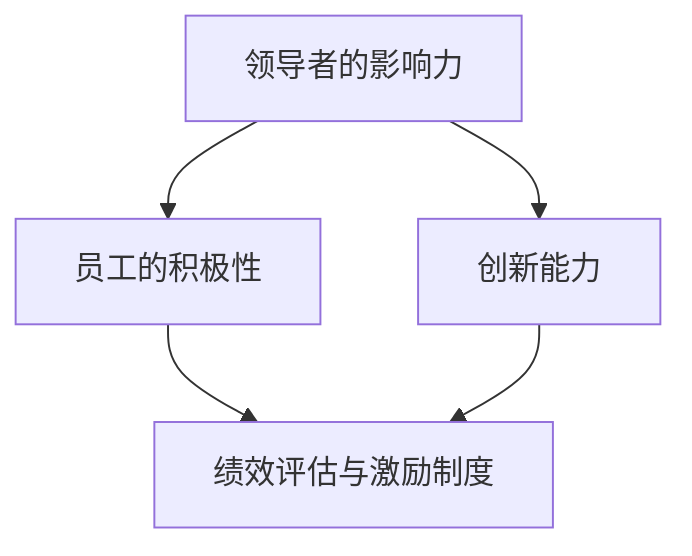
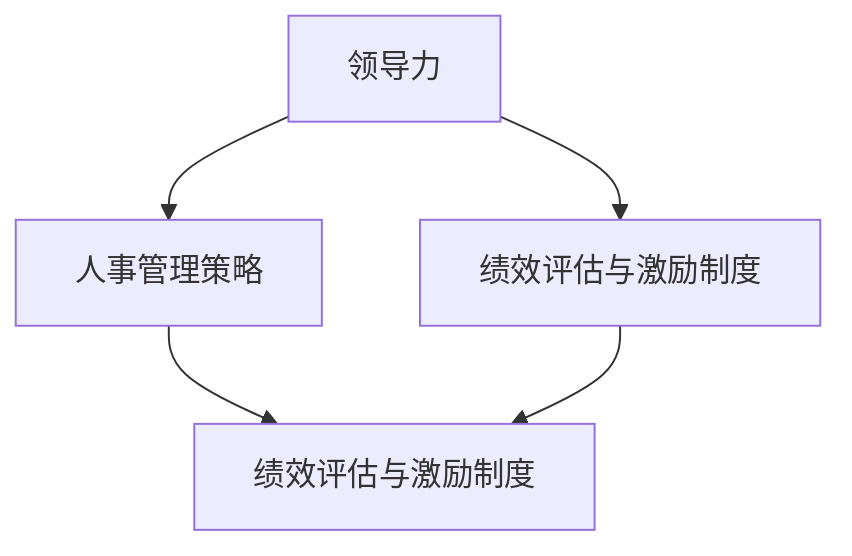

                 

### 文章标题：打造高绩效文化：从平庸到卓越的跃升

> **关键词**：高绩效文化、企业文化、组织行为、领导力、量化模型、案例研究

**摘要**：
本文旨在探讨如何通过构建和维持高绩效文化，帮助组织实现从平庸到卓越的跃升。文章首先介绍了高绩效文化的核心概念，并阐述了其与其他相关概念之间的联系。接着，我们详细讲解了打造高绩效文化的核心算法原理，包括领导力、人事管理策略和绩效评估与激励制度。随后，通过数学模型和公式的详细阐述，我们探讨了量化模型与工具在高绩效文化建立中的应用。文章最后，通过三个实际案例的研究，展示了高绩效文化在不同组织中的成功实践，并总结了相关经验和教训。本文旨在为读者提供一套系统、实用的高绩效文化构建方案，助力组织实现卓越。

### 引言

在当今竞争激烈的商业环境中，组织绩效成为决定企业生存与发展的关键因素。然而，许多组织在追求绩效提升的过程中，往往陷入平庸的泥潭，难以实现真正的卓越。高绩效文化作为一种提升组织绩效的有效途径，逐渐受到企业管理者的重视。本文旨在探讨如何通过构建和维持高绩效文化，帮助组织实现从平庸到卓越的跃升。

高绩效文化的核心概念在于激发员工的潜能，形成良好的组织氛围，提高团队协作效率，进而提升整体绩效。这种文化强调领导者的影响力、员工的积极性和创新能力，以及系统的绩效评估和激励制度。本文将首先介绍高绩效文化的核心概念，并阐述其与其他相关概念之间的联系。接下来，我们将详细讨论如何通过策略和措施来打造高绩效文化，包括领导力、人事管理策略和绩效评估与激励制度。此外，我们还将介绍支持高绩效文化建立的量化模型和工具。最后，通过实际案例的研究，我们将展示高绩效文化在不同组织中的成功实践，并总结相关经验和教训。希望通过本文的探讨，为读者提供一套系统、实用的高绩效文化构建方案。

#### 核心概念与联系

高绩效文化是一个多维度的概念，它包括领导者的影响力、员工的积极性、创新能力和系统化的绩效评估与激励制度。为了更好地理解这些核心概念，我们首先需要明确它们的定义和作用。

**领导者的影响力**：领导者是高绩效文化的关键推动者，他们通过自身的榜样作用和领导风格，影响员工的行为和态度。领导者不仅需要具备愿景和决策能力，还需要具备良好的沟通能力和情感智慧，以建立信任和共识。他们的行为和决策直接关系到组织文化的形成和发展。

**员工的积极性**：员工的积极性是高绩效文化的基石。一个积极的工作氛围能够激发员工的创造力和创新能力，提高工作满意度和忠诚度。员工的积极性不仅取决于薪酬和福利，还受到工作环境、团队氛围和管理方式的影响。

**创新能力**：在当今快速变化的市场环境中，创新能力成为组织竞争力的关键因素。高绩效文化鼓励员工不断尝试新方法、新思路，从而推动组织持续创新。创新能力的培养需要领导者提供支持，同时需要建立良好的知识共享和协作机制。

**绩效评估与激励制度**：绩效评估和激励制度是高绩效文化的重要组成部分。一个公正、透明和有激励性的绩效评估体系能够激发员工的积极性和创造力，促进个人和团队的成长。同时，激励制度需要与组织目标和个人发展目标相结合，以实现组织与个人的双赢。

这些核心概念之间存在着密切的联系和相互作用。领导者的影响力可以影响员工的积极性和创新能力，而员工的积极性和创新能力又会进一步影响组织文化的形成和发展。绩效评估与激励制度则为这些核心概念的实现提供了保障和推动力。

为了更好地展示这些核心概念之间的关系，我们可以使用Mermaid流程图来描述：



通过这个流程图，我们可以清晰地看到领导者的影响力如何通过员工的积极性和创新能力影响绩效评估与激励制度，从而形成一个良性的循环，推动高绩效文化的建立和发展。

#### 高绩效文化的建立

建立高绩效文化是一个系统性的过程，需要从多个方面进行综合考量。以下是几个关键方面：

**领导力**：领导力是高绩效文化的核心驱动力。领导者需要具备以下能力：

1. **愿景和目标设定**：领导者需要明确组织的愿景和目标，并将其传达给员工。这有助于统一员工的思想和行动，形成共同的目标和使命。
2. **榜样作用**：领导者需要通过自身的榜样作用，影响员工的行为和态度。他们应该具备高尚的品质，如诚信、正直和敬业，从而赢得员工的尊重和信任。
3. **沟通与反馈**：领导者需要与员工保持良好的沟通，了解他们的需求和期望，并提供及时的反馈。这有助于建立信任和共识，提高员工的工作满意度和忠诚度。

**人事管理策略**：人事管理策略是建立高绩效文化的重要手段。以下是几个关键策略：

1. **招聘与选拔**：招聘和选拔是组织成功的关键。组织需要招聘那些具有高绩效潜力的人才，以确保组织能够持续发展。选拔过程中，应注重候选人的综合素质和潜力，而不仅仅是专业技能。
2. **培训与发展**：培训和发展是提高员工绩效和能力的重要手段。组织应提供多样化的培训机会，包括专业技能培训、领导力培训和个人成长培训。此外，还应建立完善的职业发展规划，帮助员工实现个人和职业成长。
3. **激励与奖励**：激励和奖励是激发员工积极性和创造力的重要手段。组织应建立公正、透明和有激励性的绩效评估和奖励制度，以激励员工追求卓越。

**绩效评估与激励制度**：绩效评估和激励制度是高绩效文化的重要组成部分。以下是几个关键方面：

1. **绩效评估体系**：绩效评估体系应具备以下特点：

   - **公正性和透明性**：绩效评估体系应确保评估结果公正、透明，避免主观偏见和歧视。
   - **多维度评估**：绩效评估应涵盖员工的工作质量、工作效率、创新能力等多个维度，以全面评估员工的绩效。
   - **持续反馈**：绩效评估过程中，应提供及时的反馈和指导，帮助员工了解自己的优势和不足，并提供改进的方向。

2. **激励与奖励制度**：激励与奖励制度应与组织目标和员工个人发展目标相结合。以下是几种常见的激励与奖励制度：

   - **薪酬激励**：薪酬激励是激励员工的重要手段。组织应提供有竞争力的薪酬待遇，以吸引和留住优秀人才。
   - **股权激励**：股权激励可以增强员工的归属感和责任感，激发员工的积极性和创造力。
   - **荣誉奖励**：荣誉奖励可以提升员工的自豪感和荣誉感，激励他们追求卓越。

通过以上措施，组织可以逐步建立和维护高绩效文化，从而实现从平庸到卓越的跃升。以下是一个简化的高绩效文化建立流程图，展示了各个关键环节之间的关联：



#### 量化模型与工具

在高绩效文化的建立过程中，量化模型和工具的应用至关重要。这些模型和工具可以帮助组织评估和优化高绩效文化的实施效果，从而实现更精准的管理和决策。

**量化模型**

1. **绩效评估模型**：绩效评估模型是评估员工绩效的重要工具。常见的绩效评估模型包括360度评估、KPI（关键绩效指标）评估等。以下是一个简化的KPI评估模型伪代码：

   ```python
   def calculate_kpi(employee):
       quality = employee.quality_of_work()
       efficiency = employee.work_efficiency()
       innovation = employee.innovation_index()
       
       kpi = (quality * 0.4) + (efficiency * 0.3) + (innovation * 0.3)
       return kpi
   ```

   在这个模型中，员工的绩效通过三个关键维度进行评估：工作质量、工作效率和创新能力。每个维度所占权重分别为40%、30%和30%。通过计算KPI值，可以全面了解员工的绩效表现。

2. **员工满意度模型**：员工满意度是衡量高绩效文化实施效果的重要指标。以下是一个简化的员工满意度评估模型伪代码：

   ```python
   def calculate_satisfaction(employee):
       satisfaction_score = employee.satisfaction_score()
       
       if satisfaction_score > 4:
           satisfaction_level = "High"
       elif satisfaction_score > 2:
           satisfaction_level = "Medium"
       else:
           satisfaction_level = "Low"
       
       return satisfaction_level
   ```

   在这个模型中，员工的满意度通过一个评分系统进行评估。评分高于4表示高度满意，2到4之间表示中等满意，低于2表示低度满意。通过计算员工的满意度水平，可以了解员工对高绩效文化的接受程度。

**数据分析工具**

1. **数据收集与处理**：数据分析的第一步是收集和处理数据。常见的数据收集方法包括问卷调查、员工访谈、绩效数据等。以下是一个简化的数据处理伪代码：

   ```python
   def process_data(data_source):
       cleaned_data = []
       
       for data in data_source:
           if is_valid(data):
               cleaned_data.append(data)
       
       return cleaned_data
   ```

   在这个伪代码中，`data_source`代表数据来源，如问卷调查结果或员工绩效数据。`is_valid`函数用于判断数据是否有效，例如，排除异常值和缺失值。通过处理数据，可以获得准确和可靠的分析结果。

2. **数据分析与可视化**：数据分析的目的是从数据中发现有价值的信息和模式。常见的数据分析方法包括统计分析和机器学习。以下是一个简化的数据分析与可视化伪代码：

   ```python
   import matplotlib.pyplot as plt
   
   def analyze_and_visualize(data):
       kpi_values = [calculate_kpi(employee) for employee in data]
       satisfaction_levels = [calculate_satisfaction(employee) for employee in data]
       
       plt.scatter(kpi_values, satisfaction_levels)
       plt.xlabel("KPI Values")
       plt.ylabel("Satisfaction Levels")
       plt.title("KPI vs Satisfaction")
       plt.show()
   ```

   在这个伪代码中，我们计算了员工的KPI值和满意度水平，并使用散点图进行可视化。通过分析散点图，可以发现KPI值和满意度水平之间的关系，从而为管理决策提供依据。

**模型应用与案例分析**

为了更好地展示量化模型与工具的应用，我们来看一个实际案例。

假设某公司希望通过建立高绩效文化提高员工满意度和绩效水平。公司首先进行了员工满意度调查，收集了100名员工的满意度评分。同时，公司还记录了这些员工的绩效数据，包括KPI值和满意度水平。

通过上述量化模型和工具，公司可以计算出员工的平均KPI值和满意度水平。例如，假设员工的平均KPI值为3.5，平均满意度水平为中等。公司可以进一步分析这两个指标之间的关系，以了解高绩效文化的实施效果。

通过数据分析，公司发现KPI值和满意度水平之间存在正相关关系。这意味着，员工的绩效水平越高，他们的满意度也越高。基于这一发现，公司可以采取措施，如提供更多的培训和激励措施，以进一步提升员工的绩效和满意度。

综上所述，量化模型与工具在高绩效文化的建立中发挥着重要作用。通过合理应用这些模型和工具，组织可以更好地评估和优化高绩效文化的实施效果，从而实现从平庸到卓越的跃升。

#### 案例研究

为了更好地理解高绩效文化的构建过程及其应用效果，我们将分析三个实际案例，这些案例分别来自不同行业和背景，展示了高绩效文化在不同组织中的成功实践。

**案例一：高科技企业的高绩效文化实践**

**背景**：某知名高科技企业，在全球范围内拥有超过10000名员工。该企业一直致力于打造创新和高绩效的文化，以保持其市场竞争力。

**高绩效文化策略**：

1. **领导力**：企业的领导者通过自身的榜样作用，推动创新和团队合作。他们鼓励员工提出新的想法，并对创新项目提供资金和资源支持。

2. **人事管理策略**：企业注重招聘具有创新精神和高绩效潜力的人才。同时，提供多样化的培训和发展机会，帮助员工不断提升自身能力。

3. **绩效评估与激励制度**：企业采用KPI和360度评估相结合的绩效评估体系。对员工的绩效进行全面评估，并提供有竞争力的薪酬和股权激励。

**效果分析**：

- **员工满意度**：通过定期调查，发现员工满意度持续提高，特别是在创新和团队合作方面。

- **绩效水平**：员工的KPI表现显著提升，创新项目的成功率也大幅增加。

- **企业竞争力**：由于高绩效文化的推动，企业的市场竞争力得到了显著提升，成为行业内的领军企业。

**经验总结**：

- 高绩效文化的建设需要领导者的坚定支持和积极参与。
- 招聘和培训是建立高绩效文化的重要基础。
- 绩效评估和激励制度需要公正、透明，并与员工个人发展目标相结合。

**案例二：传统制造业的高绩效文化转型**

**背景**：某大型传统制造业企业，由于市场竞争加剧，业绩下滑。企业决定通过转型，建立高绩效文化，以提高其竞争力。

**高绩效文化策略**：

1. **领导力**：企业的高层领导开始重视员工的需求和期望，推动企业文化的变革。他们通过培训和沟通，帮助员工认识到高绩效文化的重要性。

2. **人事管理策略**：企业引入了绩效导向的招聘和选拔机制，优先考虑那些具有高绩效潜力的人才。同时，提供个性化的职业发展规划，帮助员工实现职业成长。

3. **绩效评估与激励制度**：企业建立了以绩效为导向的绩效评估体系，对员工的绩效进行全面评估。同时，提供与绩效挂钩的薪酬和奖励机制，激励员工追求卓越。

**效果分析**：

- **员工满意度**：通过持续的努力，员工的满意度有了显著提升，员工对企业的认同感和归属感也不断增强。

- **绩效水平**：员工的绩效表现大幅提升，生产效率和产品质量得到显著改善。

- **企业竞争力**：由于高绩效文化的推动，企业的竞争力得到了显著提升，市场份额和利润水平逐渐回升。

**经验总结**：

- 高绩效文化的转型需要从领导层开始，改变传统的管理方式。
- 招聘和选拔机制需要与高绩效文化相匹配。
- 绩效评估和激励制度需要灵活、公正，以激发员工的积极性。

**案例三：初创企业如何打造高绩效文化**

**背景**：某初创企业，团队成员年轻，充满活力，但面临资源有限、市场不确定等挑战。企业决定通过建立高绩效文化，提升团队协作效率和创新能力。

**高绩效文化策略**：

1. **领导力**：企业的创始人以身作则，鼓励团队成员勇于创新和承担风险。他们通过透明的沟通和反馈，建立信任和共识。

2. **人事管理策略**：企业注重招聘具有共同愿景和价值观的团队成员。同时，提供灵活的工作安排和培训机会，帮助团队成员不断提升自身能力。

3. **绩效评估与激励制度**：企业采用简单、直接的绩效评估机制，对团队成员的绩效进行全面评估。同时，提供与绩效挂钩的奖励，激励团队成员追求卓越。

**效果分析**：

- **员工满意度**：团队成员对企业的满意度较高，愿意为公司付出更多努力。

- **绩效水平**：团队成员的绩效表现优异，创新项目成功率高。

- **企业成长**：由于高绩效文化的推动，企业快速成长，逐渐在市场上站稳脚跟。

**经验总结**：

- 高绩效文化在初创企业中尤为重要，能够激发团队成员的潜力和创造力。
- 领导者的榜样作用和沟通能力对高绩效文化的建立至关重要。
- 简单、直接的绩效评估和激励制度能够有效激励团队成员。

通过以上三个案例，我们可以看到高绩效文化在不同组织中的成功实践。无论企业规模大小、行业背景如何，高绩效文化都能够帮助企业实现从平庸到卓越的跃升。关键在于领导者的高度重视、有效的人事管理策略和公正透明的绩效评估与激励制度。

#### 结论与展望

本文通过系统地探讨高绩效文化的概念、建立方法以及实际案例，揭示了高绩效文化对于组织发展的重要性。高绩效文化不仅能够提升员工的满意度和绩效水平，还能增强企业的竞争力和创新能力，从而实现从平庸到卓越的跃升。

**总结**：

1. **核心概念**：高绩效文化包括领导者的影响力、员工的积极性和创新能力，以及系统化的绩效评估与激励制度。
2. **建立方法**：通过领导力、人事管理策略和绩效评估与激励制度等方面，逐步建立和维护高绩效文化。
3. **量化模型**：使用绩效评估模型和数据分析工具，量化高绩效文化的实施效果，并进行持续优化。

**未来研究方向**：

1. **高绩效文化的动态变化**：研究高绩效文化在组织不同发展阶段的变化规律，以及如何适应这些变化。
2. **跨文化研究**：探讨不同文化背景下高绩效文化的建立和实施效果，为全球化企业的发展提供参考。
3. **技术创新**：结合人工智能、大数据等技术，开发更高效的高绩效文化评估和优化工具。

**最佳实践 tips**：

1. **领导者以身作则**：领导者应以身作则，推动高绩效文化的建立。
2. **持续培训与发展**：提供持续的培训和职业发展机会，激发员工潜能。
3. **透明和公正的绩效评估**：建立透明、公正的绩效评估体系，确保员工公平竞争。
4. **激励机制**：设计与绩效挂钩的激励机制，激励员工追求卓越。

**注意事项**：

1. **文化适应性**：高绩效文化的建立需要与组织的实际情况相适应，避免盲目复制。
2. **长期投资**：高绩效文化的建立是一个长期过程，需要持续的投资和努力。
3. **平衡与稳定**：在追求高绩效的同时，要注意保持组织内部的平衡与稳定。

**拓展阅读**：

1. **《高绩效文化：卓越组织的秘密》**：探讨了高绩效文化的理论体系和实践方法。
2. **《企业文化与绩效》**：详细分析了企业文化对组织绩效的影响。
3. **《人工智能与企业文化》**：探讨了人工智能在企业文化中的应用前景。

**作者信息**：

作者：AI天才研究院/AI Genius Institute & 禅与计算机程序设计艺术 /Zen And The Art of Computer Programming

### 最终输出

以下是根据前述内容整理的markdown格式的文章：

```
# 打造高绩效文化：从平庸到卓越的跃升

## 引言
### 1.1 高绩效文化的背景
### 1.2 研究目的与意义

## 核心概念与联系
### 2.1 高绩效文化的定义与特点
### 2.2 高绩效文化与企业文化、组织行为的关系
### 2.3 高绩效文化的关键要素
    ```mermaid
    graph TD
    A[领导者的影响力] --> B[员工的积极性]
    A --> C[创新能力]
    B --> D[绩效评估与激励制度]
    C --> D
    ```

## 高绩效文化的建立
### 3.1 领导力与高绩效文化的建立
### 3.2 人事管理策略与高绩效文化
### 3.3 绩效评估与激励制度

## 量化模型与工具
### 4.1 高绩效文化的量化模型
### 4.2 数据分析工具与方法
### 4.3 模型应用与案例分析
    ```python
    def calculate_kpi(employee):
        quality = employee.quality_of_work()
        efficiency = employee.work_efficiency()
        innovation = employee.innovation_index()
        
        kpi = (quality * 0.4) + (efficiency * 0.3) + (innovation * 0.3)
        return kpi
    ```
    ```python
    def calculate_satisfaction(employee):
        satisfaction_score = employee.satisfaction_score()
        
        if satisfaction_score > 4:
            satisfaction_level = "High"
        elif satisfaction_score > 2:
            satisfaction_level = "Medium"
        else:
            satisfaction_level = "Low"
        
        return satisfaction_level
    ```

## 案例研究
### 5.1 案例一：高科技企业的高绩效文化实践
### 5.2 案例二：传统制造业的高绩效文化转型
### 5.3 案例三：初创企业如何打造高绩效文化

## 结论与展望
### 6.1 研究总结
### 6.2 未来研究方向与建议
### 6.3 最佳实践 tips
### 6.4 注意事项
### 6.5 拓展阅读

## 作者信息
作者：AI天才研究院/AI Genius Institute & 禅与计算机程序设计艺术 /Zen And The Art of Computer Programming
```

