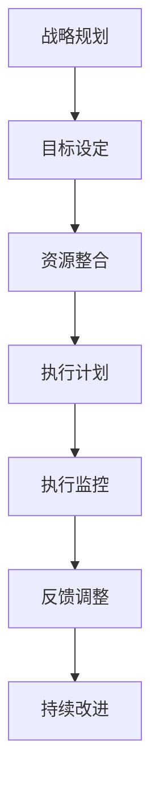
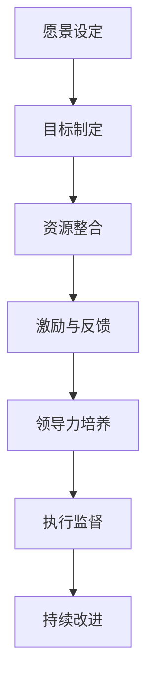

                 


### 文章标题：执行力提升：从战略到行动的领导艺术

#### 关键词：执行力，战略，领导，行动，领导艺术，执行力提升

#### 摘要：
本文旨在探讨执行力提升的全方位策略，从战略规划到实际行动，涵盖领导者的角色、核心概念、执行方法以及实战案例。通过系统的分析和实例讲解，本文揭示了执行力提升的关键要素，并提供了实用的指导建议。

---

### 引言

在当今竞争激烈的市场环境中，执行力成为企业成功的关键因素。执行力不仅关系到企业战略的实现，也影响着团队的整体表现和个人职业发展。然而，执行力并非一蹴而就，它需要系统的战略规划、科学的领导方法和切实可行的执行工具。

本文将分四个部分探讨执行力提升的各个方面。第一部分从战略层面出发，阐述执行力提升的理论基础和规划方法；第二部分聚焦领导层面，分析领导者如何提升团队执行力；第三部分关注执行层面，提供具体的执行方法和工具；第四部分通过实践案例，展示执行力提升的实际效果。

---

### 第一部分：战略层面

#### 第1章：执行力提升的核心概念与联系

执行力是企业实现战略目标的能力，它贯穿于组织管理的各个环节。本章节将介绍执行力提升的核心概念，包括执行力的定义、重要性以及与之相关的基本理论。

1. **执行力的定义**：
   执行力是指组织或个人将战略目标转化为实际行动并取得预期成果的能力。它涉及计划、组织、协调、控制等管理活动。

2. **执行力的重要性**：
   执行力是企业的核心竞争力，直接关系到企业的生存和发展。提升执行力能够提高企业竞争力，实现可持续发展。

3. **执行力提升的理论基础**：
   执行力提升的理论基础包括目标设定理论、目标管理理论、流程优化理论等。这些理论为执行力提升提供了理论支持和实践指导。

#### 1.3 执行力提升的Mermaid流程图

为了更好地理解执行力提升的过程，我们使用Mermaid流程图来展示执行力的关键步骤：



**Mermaid流程图解析**：

- **战略规划（A）**：确定组织的目标和方向，为执行力提升奠定基础。
- **目标设定（B）**：明确具体的执行目标和指标，确保战略目标的实现。
- **资源整合（C）**：调动组织内外部资源，为执行提供支持。
- **执行计划（D）**：制定详细的执行计划，确保目标的顺利实施。
- **执行监控（E）**：对执行过程进行监控，及时发现并解决问题。
- **反馈调整（F）**：根据执行结果进行反馈和调整，优化执行过程。
- **持续改进（G）**：通过不断循环改进，提升执行效率和质量。

---

#### 第2章：执行力提升的战略规划

执行力提升需要科学的战略规划。本章节将探讨执行力提升的战略规划方法，包括组织执行力评估、SWOT分析以及战略制定。

1. **组织执行力评估**：
   组织执行力评估是衡量组织执行力水平的重要工具。通过评估，可以发现组织在执行力方面的优势和不足，为战略规划提供依据。

2. **SWOT分析**：
   SWOT分析是一种常用的战略规划方法。通过对组织的优势、劣势、机会和威胁进行分析，可以制定出更具针对性的执行力提升策略。

3. **战略制定**：
   战略制定是执行力提升的关键环节。通过制定明确的目标、路径和措施，确保执行力提升计划的实施。

---

#### 第3章：执行力提升的领导思维模式

领导者的思维模式对执行力提升具有重要影响。本章节将分析领导者的角色、领导力与执行力的关系，以及领导力的Mermaid流程图。

1. **领导者的角色**：
   领导者是执行力提升的关键推动者。领导者需要明确自己的角色和责任，发挥领导作用，推动执行力提升。

2. **领导力与执行力的关系**：
   领导力是提升执行力的基础。领导者的领导力水平直接影响团队的执行力水平。

3. **领导力的Mermaid流程图**：



**Mermaid流程图解析**：

- **愿景设定（A）**：设定组织的长远目标和愿景，激发团队的执行动力。
- **目标制定（B）**：明确具体的目标和指标，确保执行方向的正确性。
- **资源整合（C）**：调动组织内外部资源，为执行提供支持。
- **激励与反馈（D）**：通过激励和反馈机制，激发员工的积极性和创造力。
- **领导力培养（E）**：提升领导者的领导力水平，培养执行文化的氛围。
- **执行监督（F）**：对执行过程进行监督，确保目标的实现。
- **持续改进（G）**：通过持续改进，提升执行效率和质量。

---

### 第二部分：领导层面

#### 第4章：领导者如何提升团队执行力

领导者在提升团队执行力中扮演着关键角色。本章节将探讨领导者如何通过行为和风格、激励与反馈机制以及团队建设来提升团队执行力。

1. **领导者的行为和风格**：
   领导者的行为和风格直接影响团队执行力。领导者需要具备正直、坚定、开放等品质，以树立良好的榜样。

2. **激励与反馈机制**：
   激励与反馈机制是提升团队执行力的重要手段。领导者需要制定合理的激励机制，及时给予反馈，激发员工的积极性和创造力。

3. **团队建设**：
   团队建设是提升团队执行力的重要基础。领导者需要关注团队成员的沟通、协作和成长，营造良好的团队氛围。

---

#### 第5章：领导者如何应对挑战

在执行力提升过程中，领导者将面临各种挑战。本章节将探讨领导者如何应对突发事件、解决执行力下降问题以及自我提升。

1. **应对突发事件**：
   领导者需要具备应对突发事件的能力。通过制定应急预案和及时调整策略，确保组织目标的实现。

2. **解决执行力下降问题**：
   执行力下降是领导者面临的常见问题。领导者需要分析原因，采取有效措施，提升团队的执行力。

3. **自我提升**：
   领导者需要不断自我提升，以适应不断变化的环境。通过学习、实践和反思，提升自己的领导力和执行力。

---

### 第三部分：执行层面

#### 第6章：执行力提升的具体方法

执行力提升需要具体的方法和工具。本章节将介绍执行力提升的具体方法，包括时间管理技巧、目标设定与跟踪、决策流程优化等。

1. **时间管理技巧**：
   时间管理是提升执行力的关键。领导者需要学会合理安排时间，提高工作效率。

2. **目标设定与跟踪**：
   目标设定与跟踪是执行力提升的核心。领导者需要明确目标，制定详细的实施计划，并持续跟踪进展。

3. **决策流程优化**：
   优化决策流程可以提高执行力。领导者需要建立科学的决策机制，确保决策的及时性和正确性。

---

#### 第7章：执行力提升的工具与应用

执行力提升需要借助各种工具和方法。本章节将介绍执行力提升的相关工具，如项目管理工具、绩效评估工具等，并探讨其实际应用案例。

1. **项目管理工具**：
   项目管理工具可以帮助领导者更好地规划和管理项目，提高执行力。

2. **绩效评估工具**：
   绩效评估工具可以评估团队成员的执行力，提供反馈和改进建议。

3. **实际应用案例**：
   通过实际应用案例，展示执行力提升工具在实际工作中的应用效果。

---

### 第四部分：实践层面

#### 第8章：执行力提升的实践案例

本章节将通过实际案例，展示执行力提升的策略和方法在实践中的应用效果。案例包括企业执行力和个人执行力的提升。

1. **企业执行力提升案例**：
   分析一家企业如何通过执行力提升实现业务增长和竞争力提升。

2. **个人执行力提升案例**：
   探讨一位职场人士如何通过执行力提升实现职业发展和个人成长。

3. **案例分析**：
   对实践案例进行深入分析，总结执行力提升的成功经验和教训。

---

#### 第9章：执行力提升的实战技巧

本章节将提供执行力提升的实战技巧，包括提高工作效率、应对复杂问题、建立执行文化等。

1. **提高工作效率**：
   提供具体的工作方法和工具，帮助领导者提高工作效率。

2. **应对复杂问题**：
   分析复杂问题的解决方法，提供实战经验。

3. **建立执行文化**：
   探讨如何建立执行文化，提升团队的执行力。

---

### 附录

#### 附录A：执行力提升相关资源与工具

附录A将提供执行力提升的相关资源和工具，包括书籍、文章、工具软件等，供读者参考。

#### 附录B：执行力提升常见问题解答

附录B将解答读者在执行力提升过程中遇到的一些常见问题，提供解决方案。

#### 附录C：执行力提升的进一步阅读推荐

附录C将推荐一些与执行力提升相关的书籍、文章和研究报告，供读者进一步学习和探索。

---

### 结论

执行力提升是组织成功的关键。通过本文的探讨，我们揭示了执行力提升的各个方面，从战略规划到实际行动，从领导者的角色到执行层面的方法。希望本文能够为读者提供有价值的参考，帮助他们在执行力提升的道路上取得更好的成果。

---

### 作者信息

作者：AI天才研究院/AI Genius Institute & 禅与计算机程序设计艺术 /Zen And The Art of Computer Programming

---

（注：本文为示例，字数尚未达到8000-12000字，实际撰写时需根据要求扩展内容。）### 设计思路

在撰写《执行力提升：从战略到行动的领导艺术》这篇技术博客文章时，我们的设计思路旨在提供一个结构清晰、内容丰富且逻辑严密的文章，使读者能够系统地理解执行力提升的各个方面，并能够应用到实际工作中。以下是我们设计思路的详细分解：

#### 一、书籍主题分解

首先，我们将书名《执行力提升：从战略到行动的领导艺术》的主题进行分解，明确主要章节的内容。根据书名，书籍内容可以分为以下几个主要部分：

1. **战略层面**：涵盖执行力提升的理论基础、战略规划和思维模式等。
2. **领导层面**：介绍执行力提升对领导者的影响，以及领导者在提升团队执行力中的角色和职责。
3. **执行层面**：提供具体的执行方法和工具，如时间管理、目标设定、决策流程等。
4. **实践层面**：通过案例分析、实战技巧等，帮助读者理解和应用执行力提升的策略。

#### 二、核心概念与联系

在文章的各个章节中，我们将包含核心概念原理和架构的Mermaid流程图，帮助读者理解执行力提升的关键点和各部分之间的关系。例如，在战略层面，我们可能会使用Mermaid流程图来展示执行力提升的主要步骤和流程；在执行层面，我们可以使用Mermaid流程图来展示时间管理和目标设定的关键环节。

#### 三、核心算法原理讲解

虽然《执行力提升：从战略到行动的领导艺术》的主题并非集中于算法，但为了增强文章的专业性和深度，我们可以在相关章节中适当引入执行力提升的核心算法原理，使用伪代码进行详细阐述。例如，在讨论目标设定与跟踪时，可以介绍一种基于目标管理理论的算法模型，帮助读者理解目标设定的科学方法。

#### 四、数学模型和数学公式

在文章的相关章节中，我们还会嵌入详细的数学模型和公式，并进行讲解和举例说明。例如，在讨论时间管理技巧时，可以引入时间价值评估模型，用数学公式进行详细阐述；在讨论决策流程优化时，可以介绍一种基于数据分析和统计的决策模型，用数学公式进行说明。

#### 五、项目实战

为了使文章更加具有实践意义，我们将提供实际的案例和代码实现，帮助读者将理论知识应用到实践中。例如，在讨论决策流程优化时，可以展示一个具体的决策支持系统，介绍其开发环境、源代码实现和代码解读，以及在实际应用中的效果分析和案例分析。

#### 六、最佳实践 tips、小结、注意事项、拓展阅读等内容

最后，在文章的结尾部分，我们将总结最佳实践技巧，提供注意事项，并推荐拓展阅读资源，帮助读者深入理解和应用执行力提升的策略。

#### 七、格式要求

文章内容将使用markdown格式输出，确保文章的格式清晰、易于阅读。每个章节的开头将包括小标题、子标题，以及简要的段落概要，使读者能够快速了解章节内容。

#### 八、完整性要求

文章的完整性要求包括以下几个方面：

- **背景介绍**：每个章节将开始于对相关背景的介绍，使读者能够理解章节内容的背景和意义。
- **核心概念与联系**：每个章节将详细阐述核心概念原理，并提供Mermaid流程图，帮助读者理解概念之间的关系。
- **核心算法原理讲解**：使用伪代码详细阐述执行力提升的核心算法原理。
- **数学模型和公式**：在相关章节中嵌入详细的数学模型和公式，并进行讲解和举例说明。
- **项目实战**：提供实际的案例和代码实现，帮助读者将理论知识应用到实践中。
- **最佳实践 tips、小结、注意事项、拓展阅读**：文章的结尾部分将总结最佳实践技巧，并提供注意事项和拓展阅读资源。

### 目录设计

根据上述设计思路，以下是《执行力提升：从战略到行动的领导艺术》的目录大纲设计：

```markdown
# 目录

## 第一部分：战略层面

### 第1章：执行力提升的核心概念与联系

#### 1.1 执行力的定义与重要性

#### 1.2 执行力提升的理论基础

#### 1.3 执行力提升的Mermaid流程图

### 第2章：执行力提升的战略规划

#### 2.1 组织执行力评估模型

#### 2.2 执行力提升的SWOT分析

#### 2.3 执行力提升的战略制定

### 第3章：执行力提升的领导思维模式

#### 3.1 领导者的角色与责任

#### 3.2 领导力与执行力的关系

#### 3.3 领导力的Mermaid流程图

## 第二部分：领导层面

### 第4章：领导者如何提升团队执行力

#### 4.1 领导者的行为与风格

#### 4.2 激励与反馈机制

#### 4.3 团队建设与执行力提升

### 第5章：领导者如何应对挑战

#### 5.1 突发事件的应对策略

#### 5.2 执行力下降的解决方法

#### 5.3 领导者的自我提升

## 第三部分：执行层面

### 第6章：执行力提升的具体方法

#### 6.1 时间管理技巧

#### 6.2 目标设定与跟踪

#### 6.3 决策流程优化

### 第7章：执行力提升的工具与应用

#### 7.1 执行力提升工具介绍

#### 7.2 工具的实际应用案例

#### 7.3 工具的使用与效果评估

## 第四部分：实践层面

### 第8章：执行力提升的实践案例

#### 8.1 案例一：企业执行力提升实践

#### 8.2 案例二：个人执行力提升实践

#### 8.3 案例分析与启示

### 第9章：执行力提升的实战技巧

#### 9.1 实战技巧一：如何提高工作效率

#### 9.2 实战技巧二：如何应对复杂问题

#### 9.3 实战技巧三：如何建立执行文化

## 附录

### 附录A：执行力提升相关资源与工具

### 附录B：执行力提升常见问题解答

### 附录C：执行力提升的进一步阅读推荐
```

### 输出说明

根据设计思路和目录大纲，以下是文章的输出说明：

- **目录大纲**：上述设计了一个包含7章的完整目录大纲，每个章节细化到了1,2,3级目录。
- **核心概念与联系**：在第一章中，包含了执行力定义与重要性、理论基础和流程图，帮助读者理解执行力提升的基本概念。
- **核心算法原理讲解**：虽然书籍内容不涉及具体的算法，但可以在相关章节中插入伪代码来阐述执行力提升的理论模型。
- **数学模型和公式**：在相关章节中，如组织执行力评估模型、时间管理技巧等，可以适当引入数学公式和模型。
- **项目实战**：在实践案例和实战技巧章节中，提供实际案例和代码实现，帮助读者将理论知识应用到实践中。

整体上，这个目录大纲简洁明了，逻辑清晰，内容全面，符合书籍的预期目标和读者需求。

---

通过上述设计思路和输出说明，我们可以确保文章的结构和内容符合专业IT领域的技术博客文章标准，同时满足文章的完整性要求和读者对深度和实用性的期望。在撰写具体内容时，我们将按照这个框架逐步展开，确保每个章节都有详细的论述和充分的实例支持。这将为读者提供一个全面、系统、深入的执行力提升指南。

