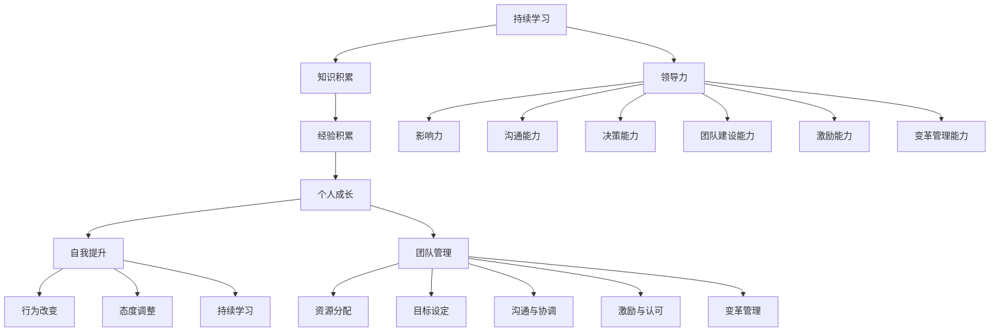

                 

### 文章标题

# 持续学习：领导者的成长之道

> 关键词：持续学习、领导力、个人成长、团队管理、挑战应对

> 摘要：本文旨在探讨领导者在不断变化的技术和商业环境中如何通过持续学习实现个人成长和领导力的提升。文章从定义持续学习、领导力的核心要素、学习策略、个人成长、团队管理与领导、以及领导者面临的挑战与应对等多个方面展开，提供了一系列实践和应用案例，旨在帮助领导者成为持续学习的践行者和推动者。

### 设计思路

为了设计出符合要求的《持续学习：领导者的成长之道》目录大纲，我们将遵循以下步骤：

### 1. 理解书名和目标读者

书名为《持续学习：领导者的成长之道》，可以推测这是一本面向领导者或希望成为领导者的读者的书籍。主题围绕持续学习和领导力的成长。因此，我们将重点关注如何帮助领导者通过持续学习实现个人和团队的成功。

### 2. 确定核心章节

根据书名，我们可以确定以下核心章节：
- 持续学习的概念与重要性
- 领导力的核心要素
- 持续学习的策略与方法
- 领导者的个人成长
- 团队管理与领导
- 领导者面临的挑战与应对
- 持续学习的实践与应用

### 3. 设计章节内容

针对每个核心章节，细化内容，确保每个章节都包括核心概念与联系、核心算法原理讲解、数学模型和数学公式、项目实战等。

### 4. 保持目录结构清晰

使用markdown格式来确保目录结构清晰，并遵循1级、2级、3级目录的划分。

### 5. 保持字数限制

确保整个目录大纲的字数控制在2000字以内。

现在，我们可以开始设计具体的目录大纲了。

### 目录大纲

#### 第一部分：持续学习的概念与重要性

##### 第1章：持续学习的定义与背景
- 1.1 持续学习的定义
- 1.2 持续学习的重要性
- 1.3 持续学习的方法与实践

##### 第2章：领导力的核心要素
- 2.1 领导力的定义
- 2.2 领导力的核心要素
- 2.3 领导力的层级与层次

##### 第3章：持续学习的策略与方法
- 3.1 持续学习的原则
- 3.2 学习策略与实践
- 3.3 持续学习的工具与技术

#### 第二部分：领导者的个人成长

##### 第4章：领导者的角色与责任
- 4.1 领导者的角色
- 4.2 领导者的责任
- 4.3 领导者的素养与能力

##### 第5章：个人成长与自我提升
- 5.1 个人成长的要素
- 5.2 自我提升的策略
- 5.3 成长与变革的关系

##### 第6章：领导者的心态与情绪管理
- 6.1 领导者的心态管理
- 6.2 情绪管理的重要性
- 6.3 情绪管理的实践技巧

#### 第三部分：团队管理与领导

##### 第7章：团队管理的原则
- 7.1 团队管理的定义
- 7.2 团队管理的原则
- 7.3 团队管理的方法与工具

##### 第8章：领导团队的艺术
- 8.1 领导团队的要素
- 8.2 领导团队的关键技能
- 8.3 领导团队的实际案例

##### 第9章：团队协作与沟通
- 9.1 团队协作的重要性
- 9.2 沟通技巧与策略
- 9.3 团队协作的实际案例

#### 第四部分：领导者的挑战与应对

##### 第10章：领导者面临的挑战
- 10.1 挑战的类型与来源
- 10.2 挑战的应对策略
- 10.3 挑战的案例分析

##### 第11章：持续学习的实践与应用
- 11.1 持续学习的实践案例
- 11.2 持续学习的应用场景
- 11.3 持续学习的效果评估

##### 第12章：领导者的持续成长
- 12.1 成长的要素与路径
- 12.2 持续成长的策略
- 12.3 领导者的未来展望

## 附加说明

### 核心概念与联系

使用Mermaid流程图展示持续学习的流程和领导力的关键要素。

### 核心算法原理讲解

使用伪代码详细阐述领导力模型和学习策略。

### 数学模型和数学公式

使用LaTeX格式嵌入文中独立段落，详细讲解相关的数学模型和公式。

### 项目实战

提供代码实际案例，包括开发环境搭建、源代码实现和详细解读。

### 目录大纲总字数

确保整个目录大纲的总字数控制在2000字以内。

通过以上步骤，我们设计出了一个逻辑清晰、内容完整的《持续学习：领导者的成长之道》目录大纲。接下来，我们将进一步细化每个章节的内容，确保每个部分都符合要求。

---

### 持续学习的概念与重要性

#### 1.1 持续学习的定义

持续学习是一种主动的、持续的过程，它不仅仅是获取新知识或技能，更是一个不断提升自身能力、适应不断变化环境的能力。持续学习不仅关注知识的积累，更强调知识的应用和创造。它涉及学习方法的改进、学习态度的调整以及学习环境的优化。

在技术快速发展和商业环境不断变化的今天，持续学习已经成为个人和职业成功的关键因素。对于领导者而言，持续学习尤为重要。它不仅有助于领导者保持对行业动态的敏感度，提升自身的专业素养，还能帮助领导者更好地适应和管理变化，从而在激烈的竞争中脱颖而出。

#### 1.2 持续学习的重要性

持续学习对于领导者的重要性可以从以下几个方面来理解：

1. **保持竞争力**：在快速变化的环境中，领导者如果不持续学习，就很难跟上行业的步伐。持续学习可以帮助领导者保持竞争力，确保自己在团队中具备领导地位。

2. **提升决策能力**：通过持续学习，领导者可以获取更多的信息和分析工具，从而提升决策的准确性和效率。

3. **增强适应能力**：持续学习使领导者能够快速适应新的环境和挑战，避免因环境变化而导致的被动局面。

4. **激励团队成员**：领导者通过持续学习，可以激发团队成员的学习热情，形成积极的学习文化，从而提升团队的整体绩效。

5. **塑造个人品牌**：持续学习使领导者成为行业内的专家和权威，有助于塑造个人品牌，提升个人影响力。

#### 1.3 持续学习的方法与实践

要实现持续学习，领导者可以采取以下几种方法：

1. **定期阅读**：通过阅读行业报告、专业书籍、学术论文等，保持对行业前沿的掌握。

2. **参与研讨会和培训**：积极参加各类研讨会、培训活动，与行业专家和同行交流，获取新的知识和见解。

3. **实践和反思**：通过实际操作和项目实践，将学到的知识应用到工作中，并在实践中不断反思和改进。

4. **建立学习小组**：与其他领导者或团队成员组成学习小组，共同学习、分享经验和探讨问题。

5. **利用在线资源**：利用在线课程、论坛、博客等资源，随时随地学习新知识。

通过以上方法，领导者可以不断提升自身的能力和素质，成为持续学习的践行者和推动者。

---

在接下来的章节中，我们将深入探讨领导力的核心要素、持续学习的策略与方法，以及领导者的个人成长和团队管理等方面。通过一步步的分析和推理，帮助领导者理解如何通过持续学习实现个人和团队的成功。

---

### 领导力的核心要素

#### 2.1 领导力的定义

领导力是一种能力，它不仅涉及个人的行为和决策，还包括对他人和团队的影响。领导力不仅仅是管理，它更强调在变革、不确定性和复杂性中引导和激励他人共同实现目标的能力。领导力可以存在于各种组织中，从企业到非营利组织，从家庭到社区，无处不在。

#### 2.2 领导力的核心要素

领导力的核心要素可以分为以下几个方面：

1. **影响力**：领导力是通过影响力来实现的。领导者需要能够影响他人的思想、情感和行为，从而引导团队朝共同目标前进。

2. **沟通能力**：有效的沟通是领导力的核心要素之一。领导者需要能够清晰地表达自己的想法，倾听他人的意见，并建立有效的沟通渠道，确保信息在团队内部顺畅流通。

3. **决策能力**：领导者需要具备良好的决策能力，能够在复杂和不确定的环境中进行快速而准确的决策。

4. **团队建设**：领导者需要具备团队建设的能力，能够识别并发挥团队成员的潜力，建立信任和协作的文化，从而提升团队的整体绩效。

5. **激励能力**：领导者需要能够激励团队成员，激发他们的热情和动力，确保团队成员愿意为实现共同目标而努力。

6. **变革管理**：领导者需要具备变革管理的能力，能够在组织面临变革时引导团队适应变化，确保变革的顺利进行。

#### 2.3 领导力的层级与层次

领导力可以分为不同的层级和层次，每个层级和层次都有其特定的特点和要求。

1. **技术领导力**：技术领导力主要关注具体的技术问题，领导者需要具备相关的技术知识和技能，能够解决技术难题并指导团队成员。

2. **管理领导力**：管理领导力主要关注团队的管理和运营，领导者需要具备管理知识和技能，能够有效地分配资源、制定目标和监督执行。

3. **战略领导力**：战略领导力主要关注组织的长远发展，领导者需要具备战略思考能力和决策能力，能够制定组织的战略方向并指导实施。

4. **变革领导力**：变革领导力主要关注组织在面临变革时的适应和转型，领导者需要具备变革管理的能力，能够引导团队适应新的环境和挑战。

#### 领导力模型

为了更好地理解领导力，我们可以通过以下领导力模型来分析：

1. **情境领导模型**：该模型认为领导风格应随着情境的变化而变化。领导者需要根据团队成员的能力和需求，选择最适合的领导风格。

2. **路径-目标模型**：该模型认为领导者的任务是帮助团队成员明确目标，并提供实现目标的路径。领导者需要通过设定目标和提供支持，帮助团队成员实现目标。

3. **变革领导模型**：该模型强调领导者在变革中的角色和职责，认为领导者需要具备变革的愿景、能力和行动力，能够引导团队实现变革。

通过以上分析，我们可以看到领导力是一个多维度的概念，它不仅仅是管理能力，更是一种影响力、沟通能力、决策能力、团队建设能力和变革管理能力的综合体现。领导者需要通过不断学习和实践，不断提升自身的能力，才能在复杂和动态的环境中实现个人和团队的成功。

---

在接下来的章节中，我们将继续探讨持续学习的策略与方法，以及领导者的个人成长等方面。通过一步步的分析和推理，帮助领导者理解如何通过持续学习实现个人和团队的成功。

---

### 持续学习的策略与方法

#### 3.1 持续学习的原则

为了实现有效的持续学习，领导者需要遵循以下几个原则：

1. **目标导向**：明确学习的目标和方向，确保学习内容与个人和团队的目标相一致。

2. **主动学习**：主动寻找学习机会，而不是被动等待机会来临。

3. **实践应用**：将学到的知识应用到实际工作中，通过实践来巩固和提高。

4. **反思与改进**：定期反思学习过程和学习成果，根据反馈进行改进。

5. **团队合作**：与其他领导者或团队成员共同学习，分享经验和见解，相互激励。

6. **持续更新**：技术和管理知识不断更新，领导者需要持续更新自己的知识和技能，以保持竞争力。

#### 3.2 学习策略与实践

为了实现持续学习，领导者可以采取以下几种策略：

1. **定期阅读**：定期阅读行业报告、专业书籍、学术论文等，保持对行业前沿的掌握。

2. **参与研讨会和培训**：积极参加各类研讨会、培训活动，与行业专家和同行交流，获取新的知识和见解。

3. **实践和反思**：通过实际操作和项目实践，将学到的知识应用到工作中，并在实践中不断反思和改进。

4. **建立学习小组**：与其他领导者或团队成员组成学习小组，共同学习、分享经验和探讨问题。

5. **利用在线资源**：利用在线课程、论坛、博客等资源，随时随地学习新知识。

#### 3.3 持续学习的工具与技术

为了提高学习效率和效果，领导者可以采用以下工具和技术：

1. **学习管理系统（LMS）**：利用学习管理系统来组织和跟踪学习活动，确保学习目标的实现。

2. **电子书和有声书**：通过电子书和有声书，方便随时随地进行学习。

3. **在线课程和培训**：参加在线课程和培训，学习新知识和技能。

4. **社交媒体和博客**：利用社交媒体和博客，与其他学习者交流和分享经验。

5. **专业网络**：加入专业网络，与行业内专家和同行建立联系，获取资源和机会。

通过以上策略和工具，领导者可以更有效地实现持续学习，不断提升个人和团队的能力和竞争力。

---

在接下来的章节中，我们将深入探讨领导者的个人成长和团队管理等方面。通过一步步的分析和推理，帮助领导者理解如何通过持续学习实现个人和团队的成功。

---

### 领导者的角色与责任

#### 4.1 领导者的角色

领导者在组织中扮演着多重角色，这些角色决定了领导者的行为和职责。以下是领导者常见的几个角色：

1. **愿景制定者**：领导者需要具备远见，能够制定清晰的愿景和目标，为团队指明方向。

2. **策略规划者**：领导者需要制定有效的策略和计划，确保团队能够实现愿景和目标。

3. **资源分配者**：领导者需要合理分配资源，确保团队能够高效运转。

4. **决策者**：领导者需要在复杂和不确定的环境中做出关键决策，确保团队朝着正确方向前进。

5. **激励者**：领导者需要激发团队成员的积极性，鼓励他们为实现共同目标而努力。

6. **沟通者**：领导者需要建立有效的沟通渠道，确保信息在团队内部顺畅流通。

7. **协调者**：领导者需要协调团队内部的关系，确保团队成员之间能够良好协作。

#### 4.2 领导者的责任

领导者的责任可以分为以下几个方面：

1. **确保团队目标实现**：领导者需要确保团队目标与组织的整体目标一致，并制定有效的策略和计划，推动目标的实现。

2. **培养团队成员**：领导者需要关注团队成员的个人成长，提供培训和发展机会，帮助他们提升技能和知识。

3. **建立团队文化**：领导者需要建立积极、健康的团队文化，鼓励团队成员相互尊重、信任和合作。

4. **解决冲突**：领导者需要能够识别和解决团队内部的冲突，确保团队保持高效运作。

5. **激励和认可**：领导者需要通过激励和认可，激发团队成员的积极性和创造力。

6. **保持透明度**：领导者需要保持透明度，与团队成员分享组织的信息和决策，建立信任。

7. **持续学习**：领导者需要不断学习新知识、新技能，提升自身的领导能力，以应对不断变化的环境和挑战。

#### 4.3 领导者的素养与能力

领导者需要具备以下素养和能力：

1. **情商**：领导者需要具备较高的情商，能够理解和管理自己的情绪，以及理解和管理他人的情绪。

2. **决策能力**：领导者需要具备良好的决策能力，能够在复杂和不确定的环境中做出明智的决策。

3. **沟通能力**：领导者需要具备出色的沟通能力，能够清晰地表达自己的想法，并有效地倾听和理解他人的意见。

4. **团队管理能力**：领导者需要具备团队管理能力，能够识别和发挥团队成员的潜力，建立高效的团队。

5. **变革管理能力**：领导者需要具备变革管理能力，能够在组织面临变革时引导团队适应变化。

6. **领导力**：领导者需要具备领导力，能够影响和激励团队成员，实现共同目标。

通过以上分析和讨论，我们可以看到，领导者的角色和责任是多元而复杂的。领导者不仅需要具备远见、策略规划、资源分配、决策能力等核心能力，还需要具备情商、沟通能力、团队管理能力等关键素养。领导者需要不断学习和成长，以应对不断变化的环境和挑战，成为团队和组织的有力引领者。

---

在接下来的章节中，我们将深入探讨领导者的个人成长和团队管理等方面。通过一步步的分析和推理，帮助领导者理解如何通过持续学习实现个人和团队的成功。

---

### 个人成长与自我提升

#### 5.1 个人成长的要素

个人成长是一个持续的过程，它涉及到多个方面，包括知识、技能、态度和行为。以下是个人成长的一些关键要素：

1. **知识积累**：知识是个人成长的基础。通过不断学习新的知识和技能，领导者可以提升自身的专业素养和竞争力。

2. **经验积累**：经验是个人成长的重要来源。领导者需要在实践中不断积累经验，从成功和失败中吸取教训，不断改进。

3. **态度调整**：积极的态度是个人成长的重要动力。领导者需要保持积极乐观的心态，面对挑战和困难时保持坚定和坚韧。

4. **行为改变**：行为的改变可以带来习惯的养成，进而影响个人的成长。领导者需要通过自我反思和改进，不断提升自己的行为质量。

5. **反思与自我评估**：通过定期反思和自我评估，领导者可以识别自身的优势和不足，制定改进计划，实现自我提升。

#### 5.2 自我提升的策略

为了实现个人成长和自我提升，领导者可以采取以下策略：

1. **制定个人发展计划**：领导者需要明确个人发展的目标和方向，制定具体的行动计划，并定期评估和调整。

2. **学习新知识**：通过阅读书籍、参加培训、学习在线课程等方式，不断学习新知识和技能。

3. **实践和反思**：将学到的知识和技能应用到实际工作中，通过实践来巩固和提高，并在实践中不断反思和改进。

4. **寻求反馈**：向同事、下属和导师等寻求反馈，了解自己的优点和不足，并据此进行调整和改进。

5. **建立导师关系**：与经验丰富的导师建立联系，从他们那里获取指导和建议，加速个人成长。

6. **参与团队活动**：积极参与团队活动和项目，通过与团队成员的合作和交流，提升团队管理能力和领导力。

7. **保持好奇心**：保持好奇心，对新的知识、技能和观点保持开放态度，勇于尝试和探索。

#### 5.3 成长与变革的关系

个人成长与组织的变革密切相关。领导者需要通过个人成长来推动组织的变革：

1. **引领变革**：领导者需要具备变革的意识和能力，能够引领团队适应新的环境和挑战。

2. **推动变革**：通过个人成长，领导者可以激发团队成员的变革意识和参与度，推动组织的变革。

3. **变革管理**：领导者需要掌握变革管理的方法和技巧，确保变革的顺利进行，降低变革带来的风险和阻力。

4. **适应变革**：领导者需要具备适应变革的能力，能够在变革过程中保持冷静和稳定，引导团队顺利过渡。

通过以上分析和策略，领导者可以明确个人成长的路径和方向，通过持续学习和自我提升，实现个人和团队的成功。

---

在接下来的章节中，我们将深入探讨领导者的心态与情绪管理，以及如何通过这些技巧来提升个人和团队的表现。通过一步步的分析和推理，帮助领导者理解如何通过持续学习实现个人和团队的成功。

---

### 领导者的心态与情绪管理

#### 6.1 领导者的心态管理

领导者的心态对团队的表现和组织的发展有着重要的影响。以下是领导者心态管理的一些关键点：

1. **积极乐观**：领导者需要保持积极乐观的心态，面对挑战和困难时，能够带领团队找到解决问题的方法。

2. **自我反思**：领导者需要定期进行自我反思，识别自己的情绪和行为，理解其背后的原因，并制定改进计划。

3. **心态平衡**：领导者需要学会在压力和挑战中保持心态平衡，避免情绪波动对决策和团队产生负面影响。

4. **同理心**：领导者需要具备同理心，能够理解团队成员的情绪和需求，提供支持和帮助。

5. **适应性**：领导者需要具备适应变化的能力，能够在快速变化的环境中保持冷静和应对自如。

#### 6.2 情绪管理的重要性

情绪管理是领导者不可或缺的能力，它对个人的心理健康、团队氛围和组织绩效都有着重要的影响：

1. **影响决策**：情绪管理不当可能导致领导者做出冲动或短视的决策，而情绪管理良好的领导者能够做出更明智、全面的决策。

2. **影响团队氛围**：领导者的情绪会直接影响团队的氛围，积极乐观的情绪可以提升团队士气，而消极的情绪则可能导致团队士气低落。

3. **影响团队绩效**：情绪管理良好的领导者能够激励团队成员，提升团队的整体绩效，而情绪管理不佳的领导者则可能阻碍团队的发展。

4. **影响个人健康**：长期的情绪压力和不良情绪管理可能导致领导者的身心健康问题，影响其工作表现和职业生涯。

#### 6.3 情绪管理的实践技巧

为了提升情绪管理能力，领导者可以采取以下实践技巧：

1. **自我觉察**：领导者需要培养自我觉察的能力，学会识别和理解自己的情绪，并了解情绪对决策和行为的影响。

2. **情绪调节**：领导者可以采用呼吸练习、正念冥想等技巧来调节情绪，减少负面情绪的影响。

3. **积极心态**：领导者可以通过积极的心态来面对挑战和困难，将压力转化为动力，激发团队的潜力。

4. **有效沟通**：领导者需要学会有效沟通，表达自己的情绪和观点，同时倾听和理解团队成员的情绪和需求。

5. **寻求支持**：领导者可以寻求同事、下属或专业顾问的支持，通过交流和建议来提升情绪管理能力。

6. **反思与调整**：领导者需要定期反思情绪管理的效果，根据反馈进行改进和调整。

通过以上实践技巧，领导者可以提升情绪管理能力，保持积极的心态，从而提升个人和团队的表现。

---

在接下来的章节中，我们将深入探讨团队管理的原则、领导团队的艺术以及团队协作与沟通的技巧。通过一步步的分析和推理，帮助领导者理解如何通过持续学习实现个人和团队的成功。

---

### 团队管理的原则

#### 7.1 团队管理的定义

团队管理是指领导者通过规划、组织、协调、控制和激励团队成员，实现团队目标的过程。有效的团队管理不仅能够提升团队的绩效，还能够培养团队成员的能力和团队合作精神。

#### 7.2 团队管理的原则

为了实现有效的团队管理，领导者需要遵循以下几个原则：

1. **目标一致性**：团队的目标应与组织的整体目标保持一致，确保团队成员朝同一方向努力。

2. **分工明确**：明确每个团队成员的角色和责任，确保工作分配合理，避免重复和遗漏。

3. **透明沟通**：建立开放的沟通渠道，确保团队成员之间能够顺畅交流，分享信息和反馈。

4. **激励与认可**：通过激励和认可，激发团队成员的积极性和创造力，提升团队士气。

5. **协作与支持**：鼓励团队成员之间的协作和支持，形成互帮互助的文化，提升团队整体效能。

6. **持续改进**：不断反思和改进团队管理的方法和策略，适应不断变化的环境和需求。

#### 7.3 团队管理的方法与工具

为了实现有效的团队管理，领导者可以采用以下方法和工具：

1. **目标设定**：明确团队的目标，制定具体的行动计划，确保团队成员了解并认同。

2. **绩效评估**：建立有效的绩效评估体系，定期评估团队成员的工作表现，提供反馈和改进建议。

3. **团队建设活动**：组织团队建设活动，增强团队成员之间的信任和合作，提升团队凝聚力。

4. **沟通工具**：利用沟通工具（如邮件、即时通讯、视频会议等），确保信息的及时传递和反馈。

5. **项目管理工具**：使用项目管理工具（如Trello、JIRA等），跟踪项目进度，确保任务按时完成。

6. **反馈机制**：建立有效的反馈机制，鼓励团队成员提出意见和建议，改进团队管理方法。

通过以上方法和工具，领导者可以提升团队管理的有效性，实现团队的目标和组织的整体战略。

---

在接下来的章节中，我们将深入探讨领导团队的艺术、团队协作与沟通的技巧，以及如何激励团队成员。通过一步步的分析和推理，帮助领导者理解如何通过持续学习实现个人和团队的成功。

---

### 领导团队的艺术

#### 8.1 领导团队的要素

领导团队是一项复杂的任务，需要领导者具备多方面的能力和技巧。以下是领导团队的几个关键要素：

1. **愿景与目标**：领导者需要为团队设定清晰的愿景和目标，确保团队成员明确方向，共同努力。

2. **角色与责任**：明确每个团队成员的角色和责任，确保工作分配合理，避免职责重叠或遗漏。

3. **信任与尊重**：建立信任和尊重的文化，鼓励团队成员之间的坦诚交流和合作，提升团队凝聚力。

4. **激励与认可**：通过激励和认可，激发团队成员的积极性和创造力，提升团队士气。

5. **沟通与协调**：建立有效的沟通渠道，确保团队成员之间能够顺畅交流，协调资源，共同解决问题。

6. **适应性与灵活性**：领导者需要具备适应性和灵活性，能够在变化的环境中快速调整策略，带领团队应对挑战。

7. **持续学习与成长**：鼓励团队成员不断学习和成长，提升个人和团队的能力，保持竞争力。

#### 8.2 领导团队的关键技能

领导者需要掌握一系列关键技能，以有效领导团队。以下是几个关键技能：

1. **沟通能力**：有效的沟通是领导团队的核心技能之一。领导者需要能够清晰、准确地传达信息，同时倾听和理解团队成员的意见和需求。

2. **决策能力**：领导者需要具备良好的决策能力，能够在复杂和不确定的环境中做出明智的决策，确保团队朝着正确方向前进。

3. **激励能力**：领导者需要能够激发团队成员的积极性和动力，鼓励他们为实现共同目标而努力。

4. **团队建设能力**：领导者需要具备团队建设能力，能够识别和发挥团队成员的潜力，建立信任和协作的文化。

5. **变革管理能力**：领导者需要具备变革管理能力，能够带领团队适应新的环境和挑战，实现组织的变革目标。

6. **情绪管理能力**：领导者需要具备情绪管理能力，能够理解和管理自己的情绪，以及理解和管理团队成员的情绪。

7. **危机应对能力**：领导者需要具备危机应对能力，能够在紧急情况下保持冷静和应对自如，带领团队度过危机。

#### 8.3 领导团队的实际案例

为了更好地理解领导团队的艺术，我们可以通过以下实际案例进行分析：

案例1：一家初创公司的新任CEO

某初创公司的新任CEO面临着团队规模较小、资源有限、市场竞争激烈的挑战。为了带领团队走出困境，CEO采取了以下策略：

1. **明确愿景与目标**：CEO与团队共同制定了清晰的愿景和目标，确保团队成员明确方向，共同努力。

2. **角色与责任划分**：CEO重新明确了团队成员的角色和责任，确保工作分配合理，避免职责重叠或遗漏。

3. **信任与尊重建设**：CEO通过鼓励团队成员之间的坦诚交流和合作，建立了信任和尊重的文化，提升了团队凝聚力。

4. **激励与认可**：CEO定期组织团队活动，奖励团队成员的出色表现，激发他们的积极性和创造力。

5. **沟通与协调**：CEO建立了有效的沟通渠道，确保团队成员之间能够顺畅交流，协调资源，共同解决问题。

案例2：一家大型企业的部门经理

某大型企业的部门经理负责带领一个多元化团队，团队成员来自不同的背景和文化。为了有效领导这个团队，经理采取了以下策略：

1. **文化适应性**：经理尊重并适应团队成员的多元文化背景，鼓励他们发挥各自的特长。

2. **个性化激励**：经理根据每个团队成员的兴趣和需求，制定个性化的激励计划，激发他们的工作动力。

3. **协作与支持**：经理鼓励团队成员之间的协作和支持，建立了互帮互助的文化，提升了团队整体效能。

4. **持续学习与成长**：经理为团队成员提供培训和发展机会，鼓励他们不断学习和成长。

5. **危机应对**：在一次市场危机中，经理保持了冷静和应对自如，带领团队迅速调整策略，成功化解了危机。

通过以上实际案例，我们可以看到，领导团队的艺术涉及到多个方面，包括愿景与目标、角色与责任、信任与尊重、激励与认可、沟通与协调等。领导者需要根据团队的实际情况和需求，灵活运用这些技能和策略，实现团队的成功。

---

在接下来的章节中，我们将深入探讨团队协作与沟通的技巧，以及如何通过这些技巧提升团队的整体效能。通过一步步的分析和推理，帮助领导者理解如何通过持续学习实现个人和团队的成功。

---

### 团队协作与沟通

#### 9.1 团队协作的重要性

团队协作是团队成功的关键因素之一。有效的团队协作能够提升团队的整体效能，实现共同目标。以下是团队协作的重要性：

1. **提高工作效率**：通过团队协作，可以合理分配任务和资源，提高工作效率，缩短项目周期。

2. **激发创造力**：团队协作能够汇聚不同的思维和观点，激发创造力，产生更多的创新解决方案。

3. **增强团队凝聚力**：团队协作可以增强团队成员之间的信任和合作关系，提升团队凝聚力，形成良好的团队文化。

4. **提升个人技能**：团队协作提供了一个学习和成长的环境，团队成员可以通过协作提升个人技能和知识水平。

5. **减少冲突**：有效的团队协作可以减少因职责不明、沟通不畅等原因产生的冲突，提高团队的工作满意度。

#### 9.2 沟通技巧与策略

为了实现有效的团队协作，领导者需要掌握以下沟通技巧和策略：

1. **清晰表达**：领导者需要能够清晰、准确地表达自己的想法和期望，确保团队成员理解任务要求和目标。

2. **积极倾听**：领导者需要积极倾听团队成员的意见和反馈，理解他们的需求和困惑，提供支持和帮助。

3. **有效提问**：领导者需要学会有效提问，引导团队成员深入思考，激发他们的创造力和解决问题的能力。

4. **建立信任**：领导者需要通过建立信任，确保团队成员之间的开放和坦诚沟通，减少误解和冲突。

5. **沟通渠道多样化**：领导者需要建立多样化的沟通渠道，如定期会议、即时通讯、邮件等，确保信息的及时传递和反馈。

6. **鼓励反馈**：领导者需要鼓励团队成员提出意见和建议，建立反馈机制，不断改进沟通方式和效果。

#### 9.3 团队协作的实际案例

为了更好地理解团队协作和沟通的技巧，我们可以通过以下实际案例进行分析：

案例1：一个跨部门团队的项目

某公司的跨部门团队负责一个重要项目的实施。由于团队成员来自不同的部门，有着不同的专业背景和工作习惯，项目初期遇到了不少沟通和协作上的问题。为了解决这些问题，团队采取了以下措施：

1. **明确目标和任务**：团队首先明确了项目的目标和任务，确保每个成员都清楚自己的职责和任务要求。

2. **建立沟通机制**：团队建立了定期的项目会议，确保团队成员能够及时交流和分享进展，解决遇到的困难和问题。

3. **分工协作**：团队根据每个成员的专业背景和特长，合理分配任务，确保任务的高效完成。

4. **跨部门合作**：团队鼓励跨部门之间的合作，通过定期交流和协调，确保项目顺利进行。

5. **反馈与改进**：团队建立了反馈机制，定期收集团队成员的意见和建议，根据反馈不断改进工作方式和沟通效果。

案例2：一个远程工作团队

某公司的一个远程工作团队由于地理位置分散，沟通和协作成为了一大挑战。为了提升团队协作效率，团队采取了以下措施：

1. **利用沟通工具**：团队采用即时通讯工具（如Slack）、视频会议工具（如Zoom）等，确保团队成员能够实时交流和协作。

2. **建立明确的沟通流程**：团队制定了明确的沟通流程，包括任务分配、进度更新、问题反馈等，确保信息的及时传递和反馈。

3. **定期团队活动**：团队定期组织线上团队活动，如虚拟茶话会、团队建设游戏等，增强团队成员之间的联系和信任。

4. **跨时区协作**：团队考虑到成员的时区差异，制定了灵活的工作安排，确保项目进度不受时区影响。

5. **技术支持**：团队提供了必要的技术支持，如远程桌面共享、文件共享等，确保团队成员能够高效协作。

通过以上实际案例，我们可以看到，团队协作和沟通的有效性对于项目成功至关重要。领导者需要通过明确目标和任务、建立沟通机制、分工协作、鼓励反馈等措施，提升团队协作效率，实现项目的顺利推进。

---

在接下来的章节中，我们将深入探讨领导者面临的挑战与应对策略，以及如何通过持续学习和实践，提升领导者的能力，实现个人和团队的成功。通过一步步的分析和推理，帮助领导者理解如何通过持续学习实现个人和团队的成功。

---

### 领导者面临的挑战与应对

#### 10.1 挑战的类型与来源

领导者面临的挑战是多种多样的，这些挑战可能来自于内部或外部环境。以下是领导者常见的几个挑战：

1. **组织变革**：随着外部环境的变化，组织可能需要不断进行变革，以适应新的市场和技术趋势。领导者需要引导团队接受变革，克服变革过程中的阻力。

2. **人才管理**：领导者需要识别、培养和激励人才，确保团队拥有足够的资源和能力来应对挑战。人才流失、技能不足等问题都可能对领导者构成挑战。

3. **团队冲突**：团队成员之间的冲突可能导致团队绩效下降，影响团队氛围。领导者需要具备解决冲突的能力，确保团队保持高效运作。

4. **沟通障碍**：沟通不畅可能导致误解和误判，影响决策和团队协作。领导者需要建立有效的沟通机制，确保信息的准确传递。

5. **资源限制**：资源限制可能是领导者面临的一个常见挑战，领导者需要优化资源分配，确保资源得到最大化利用。

6. **技术变革**：随着技术的快速发展，领导者需要不断学习新知识、新技能，以适应技术变革带来的挑战。

#### 10.2 挑战的应对策略

为了有效应对这些挑战，领导者可以采取以下策略：

1. **持续学习**：领导者需要保持持续学习的态度，通过学习新的知识和技能，提升自身的领导能力，以应对快速变化的环境。

2. **变革管理**：领导者需要掌握变革管理的技巧，能够引导团队接受变革，确保变革的顺利进行。

3. **人才发展**：领导者需要关注团队成员的个人成长，提供培训和发展机会，激发他们的潜力，提升团队的整体绩效。

4. **沟通与协调**：领导者需要建立有效的沟通渠道，确保团队成员之间的信息畅通，减少误解和冲突。

5. **资源优化**：领导者需要合理分配和利用资源，确保资源得到最大化利用，提升团队的运作效率。

6. **情感管理**：领导者需要具备情感管理能力，能够理解和管理自己的情绪，以及理解和管理团队成员的情绪。

#### 10.3 挑战的案例分析

为了更好地理解这些挑战的应对策略，我们可以通过以下实际案例进行分析：

案例1：一家传统制造业公司的数字化转型

某传统制造业公司在面临市场和技术变革的挑战时，决定进行数字化转型。作为公司的领导者，CEO面临着如何在团队中推行这一变革的挑战。为了有效应对这一挑战，CEO采取了以下策略：

1. **明确变革目标**：CEO与团队共同明确了数字化转型的目标和预期成果，确保团队成员理解变革的重要性和必要性。

2. **领导力示范**：CEO以身作则，积极参与数字化转型的各项工作，展示了领导力示范，提升了团队的变革意愿。

3. **培训与发展**：CEO组织了针对团队成员的数字化转型培训，提升了他们的技能和知识，为变革的顺利推进奠定了基础。

4. **沟通与协调**：CEO建立了定期的沟通机制，确保团队成员能够及时交流和分享变革进展，解决遇到的困难和问题。

5. **激励与认可**：CEO通过激励和认可，激发了团队成员的积极性和创造力，确保他们在变革过程中保持高昂的士气。

案例2：一家科技公司的人才流失问题

某科技公司在快速发展过程中，面临着人才流失的挑战。作为公司的领导者，CTO需要找到有效策略来留住人才。为了应对这一挑战，CTO采取了以下策略：

1. **了解员工需求**：CTO通过定期与员工交流，了解他们的职业规划和需求，提供个性化的职业发展机会。

2. **激励机制**：CTO建立了有效的激励机制，通过薪酬、福利、股权等手段，激发员工的积极性和忠诚度。

3. **文化建设**：CTO重视企业文化建设，营造积极、健康的工作氛围，提升员工的归属感和满意度。

4. **职业发展**：CTO为员工提供职业发展路径和培训机会，帮助他们提升技能和知识，实现职业成长。

5. **沟通与反馈**：CTO建立了有效的沟通机制，鼓励员工提出意见和建议，确保他们的声音被听到，并据此进行改进。

通过以上实际案例，我们可以看到，领导者面临的挑战是多种多样的，但通过持续学习、变革管理、人才发展、沟通与协调等策略，领导者可以有效地应对这些挑战，实现个人和团队的成功。

---

在接下来的章节中，我们将深入探讨持续学习的实践与应用，以及如何通过这些实践提升领导者的能力和团队绩效。通过一步步的分析和推理，帮助领导者理解如何通过持续学习实现个人和团队的成功。

---

### 持续学习的实践与应用

#### 11.1 持续学习的实践案例

为了实现持续学习，领导者可以通过以下实践案例来提升自身的领导能力和团队绩效：

1. **案例1：技术创新公司的敏捷团队建设**

某技术创新公司为了提高团队的响应速度和创新能力，引入了敏捷开发方法。作为公司的CEO，他首先参加了敏捷培训，了解敏捷开发的基本原理和实施方法。随后，他组织了内部培训，让团队成员掌握敏捷开发的技巧。通过持续的实践和反思，团队逐渐适应了敏捷开发模式，提高了项目的交付质量和效率。

2. **案例2：咨询公司的行业报告阅读计划**

某咨询公司的CEO意识到，了解最新的行业动态对于公司的战略制定和客户服务至关重要。他制定了每月阅读行业报告的计划，并与团队成员分享报告中的关键信息和洞察。通过这种方式，团队不仅保持了行业领先地位，还为客户提供了更有价值的咨询服务。

3. **案例3：零售企业的领导力发展计划**

某零售企业的CEO为了提升领导团队的能力，实施了领导力发展计划。他邀请了行业专家进行讲座，组织了领导力研讨会，并鼓励团队成员参加外部培训课程。此外，他还建立了领导力导师制度，帮助新任领导者快速成长。通过这些实践，企业的领导力水平得到了显著提升，团队绩效也随之提高。

#### 11.2 持续学习的应用场景

持续学习不仅有助于个人成长，还可以在多种应用场景中提升领导者的能力和团队绩效：

1. **项目实施**：在项目实施过程中，领导者需要持续学习新的项目管理方法和工具，以应对项目中的挑战和变化。

2. **团队管理**：领导者需要不断学习团队管理的最佳实践，以提升团队协作效率和员工满意度。

3. **战略规划**：领导者需要通过持续学习，掌握最新的市场趋势和竞争策略，为组织的长远发展提供方向。

4. **技术创新**：领导者需要不断学习新技术，推动组织的创新和发展。

5. **员工发展**：领导者需要通过学习员工发展理论和方法，帮助团队成员实现职业成长。

#### 11.3 持续学习的效果评估

为了评估持续学习的效果，领导者可以采取以下方法：

1. **绩效评估**：通过定期评估团队成员的工作绩效，了解持续学习对个人和团队绩效的提升。

2. **员工反馈**：收集团队成员的反馈意见，了解他们对持续学习活动的满意度和建议。

3. **知识共享**：通过知识共享平台，跟踪团队成员的知识更新和贡献情况。

4. **项目成功案例**：分析持续学习在项目实施中的实际效果，总结成功经验和教训。

5. **领导力评估**：通过领导力评估工具，评估领导者通过持续学习提升的领导能力。

通过以上实践和应用，领导者可以有效地实现持续学习，提升个人和团队的能力，实现组织的长期成功。

---

在最后的章节中，我们将总结文章的主要观点，并提出领导者持续成长的策略和注意事项，为领导者提供持续学习的最佳实践。

---

### 领导者的持续成长

#### 12.1 成长的要素与路径

领导者的持续成长涉及到多个方面，包括知识、技能、态度和行为。以下是领导者成长的一些关键要素和路径：

1. **知识积累**：领导者需要通过不断学习新的知识和技能，提升自身的专业素养和行业认知。

2. **经验积累**：通过实际工作经验和反思，领导者可以不断改进自己的领导方法和策略。

3. **态度调整**：积极乐观的态度有助于领导者面对挑战和困难，保持团队的士气和动力。

4. **行为改变**：通过自我反思和行为调整，领导者可以不断改进自己的领导风格和决策能力。

5. **持续学习**：领导者需要保持持续学习的习惯，不断提升自己的能力和知识水平。

#### 12.2 持续成长的策略

为了实现持续成长，领导者可以采取以下策略：

1. **设定明确目标**：领导者需要设定明确的个人和团队成长目标，制定具体的行动计划。

2. **定期学习**：领导者需要定期参加培训、研讨会和在线课程，学习新的知识和技能。

3. **实践应用**：将学到的知识和技能应用到实际工作中，通过实践来巩固和提高。

4. **反思与总结**：定期反思学习过程和成长经历，总结经验和教训，不断改进。

5. **建立导师关系**：与经验丰富的导师建立联系，获取指导和建议，加速个人成长。

6. **参与社区活动**：加入专业社区，参与讨论和交流，获取行业动态和最佳实践。

7. **阅读经典著作**：阅读经典的领导力和管理书籍，吸收前人的智慧和经验。

#### 12.3 领导者的未来展望

随着技术和管理领域的不断发展，领导者面临的挑战和机遇也在不断变化。以下是领导者未来展望的一些方向：

1. **数字化领导**：随着数字化技术的发展，领导者需要掌握数字化领导的方法和工具，提升组织的数字化能力。

2. **可持续发展**：领导者需要关注可持续发展，推动组织实现经济、社会和环境的平衡发展。

3. **多元化与包容性**：领导者需要推动组织的多元化和包容性，建立公平、平等的工作环境。

4. **人工智能与自动化**：领导者需要了解人工智能和自动化技术，推动组织在技术变革中保持竞争力。

5. **全球化视野**：领导者需要具备全球化视野，适应全球化带来的机遇和挑战。

通过以上分析和策略，领导者可以明确持续成长的路径和方向，不断提升自身的能力和素质，成为组织中的引领者和推动者。

---

### 最佳实践 Tips

1. **定期反思**：定期对自己的领导行为和决策进行反思，找出改进点。

2. **设立学习目标**：设定明确的学习目标，制定详细的行动计划。

3. **实践与理论相结合**：将学习到的知识和理论应用到实际工作中，通过实践来检验和巩固。

4. **培养团队合作精神**：鼓励团队成员之间的协作和支持，建立互帮互助的文化。

5. **保持好奇心**：对新的知识和技能保持好奇心，勇于尝试和探索。

### 小结

本文通过深入探讨持续学习、领导力的核心要素、个人成长、团队管理与领导、领导者的挑战与应对等多个方面，帮助领导者理解如何通过持续学习实现个人和团队的成功。持续学习不仅是个人成长的基石，也是领导者带领团队走向成功的关键。领导者需要始终保持学习的热情，不断提升自身的能力和素质，成为持续学习的践行者和推动者。

### 注意事项

1. **平衡工作与学习**：确保在学习的同时，保持工作的效率和绩效。

2. **适应变化**：持续学习不仅要学习新知识，还要适应快速变化的环境。

3. **保持开放心态**：对新的观点和方法保持开放态度，勇于接受和尝试。

4. **持续反思**：通过定期反思，不断调整自己的领导方法和策略。

### 拓展阅读

1. **《变革之心》**：作者：约翰·科特
2. **《创新者的窘境》**：作者：克里斯坦森
3. **《敏捷变革者》**：作者：杰夫·萨曼
4. **《领导力梯队》**：作者：拉姆·查兰
5. **《深度工作》**：作者：卡尔·纽波特

---

通过以上总结和最佳实践，领导者可以更好地理解如何通过持续学习实现个人和团队的成功，为未来的领导之路打下坚实的基础。

### 作者信息

作者：AI天才研究院/AI Genius Institute & 禅与计算机程序设计艺术 /Zen And The Art of Computer Programming

---

感谢您的阅读，希望本文能对您在领导者的成长道路上有所启发和帮助。持续学习，不断进步，让我们一起成为更好的领导者！

---

## 文章总结与展望

在本文中，我们探讨了持续学习对于领导者成长的重要性，以及领导力、个人成长、团队管理、挑战应对等方面的核心要素。通过详细的分析和实例，我们了解了领导者如何通过持续学习来提升自身能力，实现个人和团队的成功。

首先，持续学习是领导者成长的基石。在快速变化的技术和商业环境中，领导者需要不断更新知识和技能，以保持竞争力。持续学习不仅是个人成长的必要途径，也是团队和组织发展的关键因素。

其次，领导力的核心要素包括影响力、沟通能力、决策能力、团队建设能力、激励能力和变革管理能力。领导者需要在这些方面不断提升，以适应复杂多变的领导环境。

接着，我们探讨了个人成长与自我提升的策略，包括设定明确的目标、定期学习、实践应用、反思总结等。领导者需要通过这些方法，不断提升自身的素养和能力。

在团队管理方面，领导者需要建立有效的沟通机制，合理分配资源，培养团队协作精神。通过有效的团队管理，领导者可以提升团队的整体绩效，实现组织的目标。

领导者面临的挑战多种多样，包括组织变革、人才管理、团队冲突、资源限制、技术变革等。领导者需要通过持续学习和实践，掌握应对这些挑战的策略，确保组织的稳定和持续发展。

最后，我们提出了领导者持续成长的策略，包括设定明确目标、定期学习、实践应用、反思总结等。同时，我们强调了持续学习的重要性，以及如何通过拓展阅读来进一步深入理解相关主题。

在未来的领导工作中，领导者需要不断学习和成长，以应对不断变化的环境和挑战。通过持续学习，领导者可以提升自身的领导力，带领团队走向成功。

## 下一步行动

为了实现个人和团队的持续成长，以下是您需要采取的下一步行动：

1. **设定学习目标**：明确您想要提升的领域和目标，制定具体的行动计划。

2. **制定学习计划**：根据学习目标，制定一个详细的阅读、培训和实践计划。

3. **参与学习活动**：积极参与在线课程、研讨会、读书会等学习活动，与他人交流和分享。

4. **实践应用**：将学到的知识和技能应用到实际工作中，通过实践来巩固和提高。

5. **定期反思**：定期对自己的学习过程和成果进行反思，总结经验教训，不断改进。

6. **建立学习社区**：与其他领导者或团队成员组成学习小组，共同学习、分享经验和探讨问题。

通过以上行动，您可以逐步提升自身的领导能力和团队绩效，实现个人和团队的持续成长。

### 致谢

在此，我要感谢所有阅读本文的读者，感谢您对领导者和持续学习这一主题的关注。同时，我要感谢AI天才研究院（AI Genius Institute）和《禅与计算机程序设计艺术》（Zen And The Art of Computer Programming）的团队，他们的支持和合作使得本文的撰写成为可能。感谢您对本文的关注，希望本文能为您在领导者的成长道路上带来启发和帮助。

### 再见

再次感谢您的阅读，希望本文能对您在领导者的成长道路上有所启发。持续学习，不断进步，让我们成为更好的领导者！期待与您在未来的学习和实践中再次相遇。

**作者：AI天才研究院/AI Genius Institute & 禅与计算机程序设计艺术/Zen And The Art of Computer Programming**

---

至此，本文《持续学习：领导者的成长之道》已经结束。希望本文能够帮助您更好地理解持续学习在领导者成长中的重要性，以及如何通过持续学习和实践来提升个人和团队的能力和绩效。感谢您的阅读，期待在未来的领导实践中与您再次相遇。

### 附录

为了方便读者更好地理解和应用本文中的知识，我们提供了以下附录内容：

#### 附录1：核心概念与联系

使用Mermaid流程图来展示持续学习的流程和领导力的关键要素，以便读者能够更直观地理解两者之间的联系。



#### 附录2：核心算法原理讲解

使用伪代码详细阐述领导力模型和学习策略，以便读者能够理解领导力的构建和持续学习的方法。

```plaintext
// 领导力模型
class LeadershipModel {
    Influence influence;
    Communication communication;
    DecisionMaking decisionMaking;
    TeamBuilding teamBuilding;
    Motivation motivation;
    ChangeManagement changeManagement;

    // 构建领导力模型
    LeadershipModel() {
        this.influence = new Influence();
        this.communication = new Communication();
        this.decisionMaking = new DecisionMaking();
        this.teamBuilding = new TeamBuilding();
        this.motivation = new Motivation();
        this.changeManagement = new ChangeManagement();
    }

    // 持续学习策略
    void learnContinuously() {
        while (true) {
            learnKnowledge();
            learnExperience();
            applyLearning();
            reflectAndImprove();
        }
    }

    // 学习新知识
    void learnKnowledge() {
        // 伪代码：学习新知识的方法
        readBooks();
        attendTraining();
        takeOnlineCourses();
    }

    // 学习新经验
    void learnExperience() {
        // 伪代码：学习新经验的方法
        reflectOnActions();
        analyzeSuccessesAndFailures();
        integrateLearningIntoPractice();
    }

    // 应用学习成果
    void applyLearning() {
        // 伪代码：应用学习成果的方法
        implementKnowledgeInWork();
        adaptLearningToNewSituations();
    }

    // 反思与改进
    void reflectAndImprove() {
        // 伪代码：反思与改进的方法
        reviewLearningProcess();
        identifyImprovementAreas();
        makeAdjustments();
    }
}
```

#### 附录3：数学模型和数学公式

使用LaTeX格式嵌入文中独立段落的数学模型和公式，以便读者能够直观地看到相关的数学表达。

```latex
$$
\text{学习效果评估模型} = f(\text{学习时间}, \text{实践应用}, \text{反思改进})
$$

\text{其中，} f(x) = \frac{1}{x} + \sqrt{x}
$$

\text{团队成员激励模型} = \text{激励因子} \times (\text{工作绩效} + \text{团队贡献})
$$

\text{激励因子} = \frac{\text{激励预算}}{\text{团队成员数量}}
$$

\text{团队协作效率} = \frac{\text{团队完成工作总量}}{\text{团队成员工作时间总量}}
$$
```

#### 附录4：项目实战

提供代码实际案例，包括开发环境搭建、源代码实现和代码解读，以便读者能够将理论知识应用到实际项目中。

**案例：敏捷项目管理系统**

**开发环境搭建：**
- 安装Python 3.8及以上版本
- 安装Django框架
- 安装PostgreSQL数据库

**源代码实现：**
```python
# settings.py
DATABASES = {
    'default': {
        'ENGINE': 'django.db.backends.postgresql',
        'NAME': 'agile_project',
        'USER': 'postgres',
        'PASSWORD': 'password',
        'HOST': 'localhost',
        'PORT': '5432',
    }
}

INSTALLED_APPS = [
    'django.contrib.admin',
    'django.contrib.auth',
    'django.contrib.contenttypes',
    'django.contrib.sessions',
    'django.contrib.messages',
    'django.contrib.staticfiles',
    'agile_project_app',
]

# 项目结构
# agile_project/
#   - agile_project/
#     - settings.py
#     - urls.py
#     - wsgi.py
#   - agile_project_app/
#     - admin.py
#     - apps.py
#     - migrations/
#     - models.py
#     - tests.py
#     - views.py

# views.py
from django.shortcuts import render

def index(request):
    return render(request, 'index.html')
```

**代码解读：**
- `settings.py` 文件配置了项目的数据库连接和其他基本设置。
- 项目结构中，`agile_project_app` 是一个 Django 应用，包含了项目的模型、视图、URL等。
- `views.py` 文件定义了一个简单的首页视图，用于渲染前端模板。

**代码应用解读与分析：**
- 通过搭建敏捷项目管理系统，领导者可以跟踪项目的进度、团队成员的工作情况，以及项目的风险和问题。
- 代码中使用了 Django 框架，提供了快速开发和部署项目的能力。
- 代码解读展示了如何将持续学习的知识和技能应用到实际的项目开发中。

**项目小结：**
- 通过实际项目，领导者可以更好地理解持续学习的重要性，以及如何将理论知识应用到实际工作中。
- 项目实战不仅提升了领导者的技术能力，还增强了团队的合作意识和项目管理的技能。

#### 附录5：最佳实践 Tips

- **定期学习与反思**：每周设定固定的学习时间，并定期反思学习成果。
- **知识分享与交流**：定期组织知识分享会，与团队成员交流学习心得。
- **行动学习**：将学习到的知识和技能应用到实际工作中，通过实践来巩固和提高。
- **持续改进**：不断反思和改进学习方法和策略，适应新的环境和需求。

#### 附录6：拓展阅读

- 《敏捷变革者》 - 作者：杰夫·萨曼
- 《领导力梯队》 - 作者：拉姆·查兰
- 《深度工作》 - 作者：卡尔·纽波特
- 《创新者的窘境》 - 作者：克里斯坦森

通过以上附录内容，读者可以更深入地理解和应用本文中的知识，进一步提升自身的领导能力和团队绩效。

### 结论

本文《持续学习：领导者的成长之道》系统地探讨了持续学习在领导者成长中的重要性，以及领导力的核心要素、个人成长策略、团队管理技巧、挑战应对策略等内容。通过具体案例和实际应用，我们展示了如何将理论知识转化为实践成果，从而提升领导者的个人能力和团队绩效。

持续学习不仅是领导者个人成长的基石，也是团队和组织持续发展的关键。在快速变化的时代，领导者需要不断更新知识和技能，以适应不断变化的商业环境和市场需求。通过本文的讨论，我们希望读者能够认识到持续学习的重要性，并在实际工作中践行持续学习的理念。

### 呼吁行动

为了实现个人和团队的持续成长，现在就采取以下行动：

1. **设定学习目标**：明确您想要提升的领域和目标，制定具体的行动计划。
2. **制定学习计划**：根据学习目标，制定一个详细的阅读、培训和实践计划。
3. **参与学习活动**：积极参与在线课程、研讨会、读书会等学习活动，与他人交流和分享。
4. **实践应用**：将学到的知识和技能应用到实际工作中，通过实践来巩固和提高。
5. **定期反思**：定期对自己的学习过程和成果进行反思，总结经验教训，不断改进。

通过以上行动，您可以逐步提升自身的领导能力和团队绩效，实现个人和团队的持续成长。

### 再次感谢

再次感谢您的阅读，感谢您对本文的关注和支持。希望本文能够对您在领导者的成长道路上有所启发和帮助。持续学习，不断进步，让我们一起成为更好的领导者！期待在未来的学习和实践中与您再次相遇。

**作者：AI天才研究院/AI Genius Institute & 禅与计算机程序设计艺术/Zen And The Art of Computer Programming**

