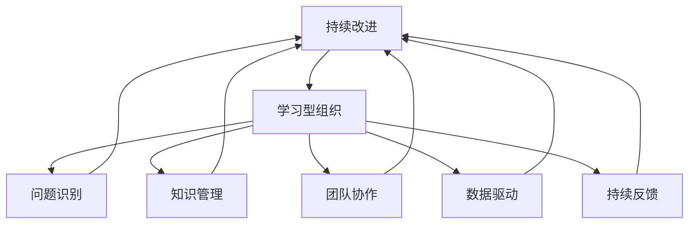
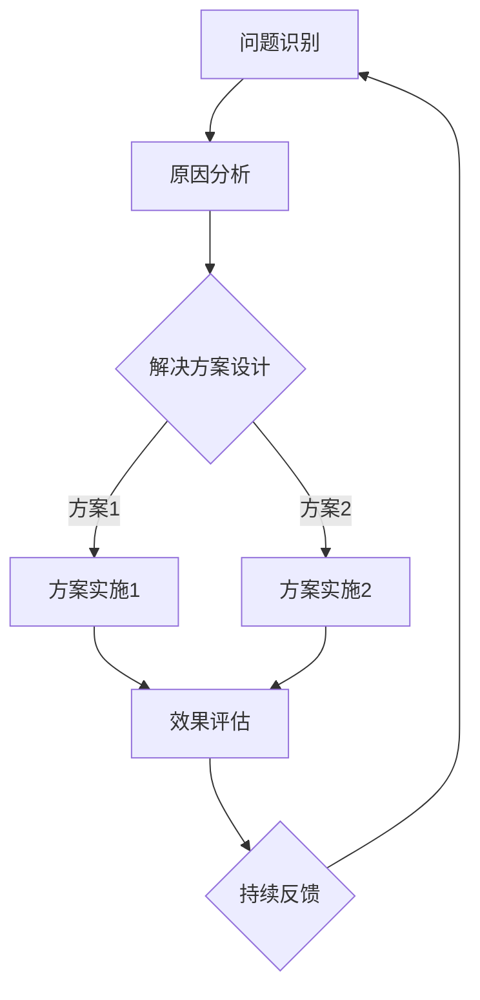
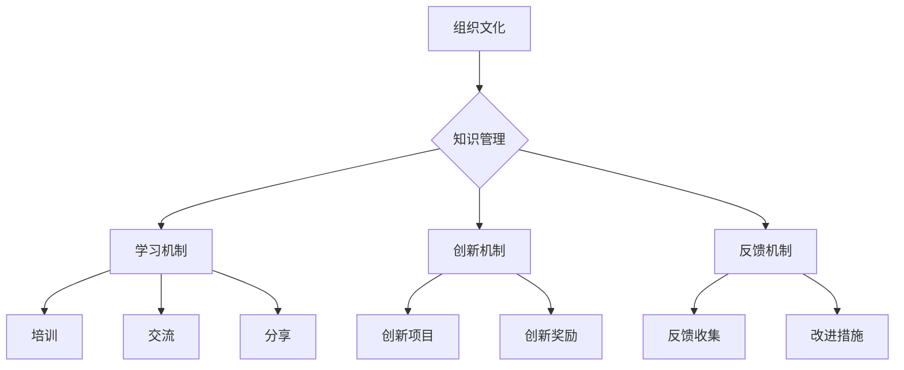

                 

### 文章标题：持续改进：打造学习型组织

在当今快速变化的技术和创新环境中，企业和组织需要具备持续改进和学习的能力，以保持竞争优势和应对不断变化的市场需求。本文旨在探讨如何通过打造学习型组织，实现组织的持续改进，提升整体的适应能力和创新水平。

**关键词：持续改进、学习型组织、组织学习、过程改进、创新**

**摘要：**
本文首先介绍了持续改进和学习型组织的概念及其重要性，随后详细阐述了两者之间的关系。通过分析核心概念和联系，运用Mermaid流程图展示了持续改进的流程和学习型组织的架构。接下来，本文从核心算法原理、数学模型和数学公式、项目实战等多个方面进行讲解，并通过具体案例展示了持续改进和学习型组织的实际应用。最后，本文总结了持续改进和学习型组织的关键要点，并对未来发展趋势进行了展望。

### 引言与基础

在当今这个技术飞速发展的时代，企业和组织面临着前所未有的挑战和机遇。持续改进（Continuous Improvement）和学习型组织（Learning Organization）成为企业生存和发展的关键。持续改进是指通过不断优化和改进现有的工作流程、产品和服务，以提升组织的效率、质量和客户满意度。学习型组织则是一个能够持续学习和适应变化的组织，通过知识共享、团队合作和创新，不断提升组织的竞争力。

**1.1 持续改进的重要性**

持续改进是现代企业成功的关键因素之一。它不仅有助于提高生产效率和产品质量，还能增强企业的市场竞争力。通过持续改进，企业能够更快地响应市场变化，满足客户需求，从而在激烈的市场竞争中立于不败之地。此外，持续改进还能够激发员工的积极性和创造力，提升团队的整体协作能力。

**1.2 学习型组织的概念**

学习型组织是一种能够持续学习和适应变化的组织。它强调知识共享、团队合作和创新，通过不断学习和实践，提升组织的整体能力和竞争力。学习型组织的特点包括：开放和透明的沟通、知识管理、持续学习、创新和灵活应变。学习型组织的核心是建立一种学习文化，鼓励员工积极参与学习和创新，并将学习成果应用于实际工作中。

**1.3 如何使用本书**

本书旨在为企业和组织提供一套系统、实用的持续改进和学习型组织建设指南。本书结构清晰，内容丰富，涵盖了从概念理解到实际应用的各个方面。通过阅读本书，读者可以：

1. 理解持续改进和学习型组织的概念及其重要性。
2. 学习核心概念和联系，掌握持续改进的流程和学习型组织的架构。
3. 掌握核心算法原理和数学模型，运用到实际项目中。
4. 通过项目实战，提高实际操作能力，积累经验。
5. 获得最佳实践和经验分享，为持续改进和学习型组织建设提供参考。

### 核心概念与联系

要打造一个学习型组织，首先需要理解核心概念及其相互关系。持续改进和学习型组织是两个紧密相连的概念，它们共同构成了组织发展的基石。

**2.1 核心概念与联系**

持续改进（Continuous Improvement）是指通过不断优化和改进现有流程、产品和服务，以提高组织的效率、质量和客户满意度。持续改进的核心是发现问题、分析问题、解决问题，并通过反馈和改进循环实现持续进步。

学习型组织（Learning Organization）则是一个能够持续学习和适应变化的组织。学习型组织的特点包括：开放和透明的沟通、知识管理、持续学习、创新和灵活应变。学习型组织的核心是建立一种学习文化，鼓励员工积极参与学习和创新。

持续改进和学习型组织的联系体现在以下几个方面：

1. **学习促进改进**：学习型组织通过持续学习，不断吸收新知识和技能，为持续改进提供源源不断的动力。
2. **改进促进学习**：持续改进过程中，通过问题发现和解决，促进知识的积累和传播，进一步推动组织学习。
3. **流程优化**：持续改进和学习型组织都强调流程优化，通过不断改进流程，提高组织的运行效率和效果。
4. **团队合作**：持续改进和学习型组织都强调团队合作，通过团队合作，实现知识和经验的共享，提高组织的整体能力。

**2.2 持续改进原理**

持续改进遵循一套基本原理，这些原理贯穿于整个改进过程：

1. **问题导向**：持续改进以解决问题为导向，通过识别和解决实际问题，提升组织的效率和效果。
2. **团队合作**：持续改进需要团队成员的积极参与，通过团队合作，实现资源共享和优势互补。
3. **数据驱动**：持续改进依赖于数据的收集和分析，通过数据驱动的决策，提高改进的有效性和准确性。
4. **持续反馈**：持续改进是一个循环过程，通过不断收集反馈，进行改进和调整，实现持续进步。

**2.3 学习型组织特征**

学习型组织具有以下特征：

1. **学习文化**：学习型组织强调学习的重要性，将学习融入到组织的日常工作中，营造一种积极的学习氛围。
2. **知识共享**：学习型组织鼓励知识共享，通过内部沟通和协作，实现知识的积累和传播。
3. **灵活应变**：学习型组织能够快速适应变化，通过持续学习，不断提升组织的适应能力和创新能力。
4. **创新意识**：学习型组织鼓励创新，通过不断创新，推动组织的发展。

**2.4 持续改进与学习型组织的互动关系**

持续改进和学习型组织之间存在互动关系：

1. **相互促进**：持续改进和学习型组织相互促进，持续改进推动组织学习，而组织学习为持续改进提供动力。
2. **相互依赖**：持续改进和学习型组织相互依赖，持续改进是学习型组织的重要手段，而学习型组织是持续改进的基础。
3. **共同目标**：持续改进和学习型组织都追求组织的长期发展和持续进步，共同目标推动两者相互融合。

为了更好地理解持续改进和学习型组织之间的关系，我们可以使用Mermaid流程图展示其核心流程和架构。



**2.5 持续改进流程图**

持续改进是一个循环过程，包括以下几个主要步骤：

1. **问题识别**：通过观察、分析和反馈，识别组织中存在的问题。
2. **原因分析**：对问题进行深入分析，找出根本原因。
3. **解决方案设计**：制定解决方案，包括改进措施和实施计划。
4. **解决方案实施**：执行解决方案，进行实际改进。
5. **效果评估**：评估改进措施的效果，收集反馈。
6. **持续反馈**：根据反馈进行改进和调整，实现持续进步。

持续改进流程图如下：



**2.6 学习型组织架构图**

学习型组织的架构包括以下几个方面：

1. **组织文化**：建立积极的学习文化，鼓励员工积极参与学习和创新。
2. **知识管理**：建立知识管理系统，实现知识的收集、存储、共享和传播。
3. **学习机制**：建立有效的学习机制，包括培训、交流和分享等。
4. **创新机制**：建立创新机制，鼓励员工提出新的想法和改进措施。
5. **反馈机制**：建立反馈机制，收集员工和客户的反馈，不断改进和优化。

学习型组织架构图如下：



通过以上分析，我们可以看到持续改进和学习型组织之间存在紧密的联系和互动关系。持续改进是学习型组织的核心手段，而学习型组织则为持续改进提供了坚实的基础。只有将两者结合起来，才能实现组织的长期发展和持续进步。

### 核心算法原理讲解

在持续改进和学习型组织的建设中，核心算法原理起着至关重要的作用。这些算法不仅帮助我们识别问题、分析原因，还指导我们设计解决方案和评估效果。下面，我们将详细讲解几个核心算法原理，并通过伪代码展示其具体实现。

**3.1 持续改进方法论**

持续改进方法论是一个系统化的过程，主要包括以下几个步骤：

1. **问题识别**：通过观察、收集数据、客户反馈等方式，识别组织中的问题。
2. **原因分析**：对问题进行深入分析，找出根本原因。
3. **解决方案设计**：根据原因分析的结果，设计解决方案。
4. **解决方案实施**：执行解决方案，进行实际改进。
5. **效果评估**：评估改进措施的效果，收集反馈。
6. **持续反馈**：根据反馈进行改进和调整，实现持续进步。

伪代码示例：

```python
# 问题识别
def identify_issues():
    # 收集数据、观察、客户反馈等
    issues = collect_data()
    return issues

# 原因分析
def analyze_reasons(issues):
    # 对问题进行深入分析
    reasons = []
    for issue in issues:
        reasons.append(find_root_cause(issue))
    return reasons

# 解决方案设计
def design_solutions(reasons):
    # 根据原因分析的结果，设计解决方案
    solutions = []
    for reason in reasons:
        solutions.append(create_solution(reason))
    return solutions

# 解决方案实施
def implement_solutions(solutions):
    # 执行解决方案
    for solution in solutions:
        execute_solution(solution)

# 效果评估
def evaluate_effects():
    # 评估改进措施的效果
    effects = evaluate_improvements()

# 持续反馈
def continuous_feedback(effects):
    # 根据反馈进行改进和调整
    for effect in effects:
        adjust_improvements(effect)
```

**3.2 学习型组织培养策略**

学习型组织的培养策略包括以下几个方面：

1. **建立学习文化**：营造一种积极的学习氛围，鼓励员工主动学习和分享知识。
2. **知识管理**：建立知识管理系统，实现知识的收集、存储、共享和传播。
3. **学习机制**：建立有效的学习机制，包括培训、交流和分享等。
4. **创新机制**：建立创新机制，鼓励员工提出新的想法和改进措施。
5. **反馈机制**：建立反馈机制，收集员工和客户的反馈，不断改进和优化。

伪代码示例：

```python
# 建立学习文化
def build_learning_culture():
    # 营造积极的学习氛围
    culture = create_positive_learning_environment()
    return culture

# 知识管理
def knowledge_management():
    # 收集、存储、共享和传播知识
    knowledge_system = create_knowledge_system()
    return knowledge_system

# 学习机制
def learning_mechanism(knowledge_system):
    # 培训、交流和分享
    training = provide_training()
    exchange = enable_exchange_of_knowledge()
    sharing = facilitate_knowledge_sharing()
    return training, exchange, sharing

# 创新机制
def innovation_mechanism():
    # 鼓励提出新想法和改进措施
    ideas = encourage_new_ideas()
    improvements = promote_improvement_suggestions()
    return ideas, improvements

# 反馈机制
def feedback_mechanism():
    # 收集员工和客户反馈
    feedback = collect_employee_and_customer_feedback()
    return feedback
```

**3.3 伪代码示例：持续改进流程**

以下是一个简化的持续改进流程的伪代码示例，展示从问题识别到持续反馈的全过程。

```python
# 持续改进流程
def continuous_improvement():
    while True:
        issues = identify_issues()
        reasons = analyze_reasons(issues)
        solutions = design_solutions(reasons)
        implement_solutions(solutions)
        effects = evaluate_effects()
        continuous_feedback(effects)
```

通过以上核心算法原理的讲解和伪代码示例，我们可以看到，持续改进和学习型组织的建设需要一套系统化的方法。这些算法不仅帮助我们识别和解决问题，还指导我们设计解决方案和评估效果，从而实现组织的持续改进。

### 数学模型和数学公式

在持续改进和学习型组织的建设中，数学模型和数学公式起到了重要的作用。它们不仅帮助我们更好地理解问题，还能提供量化分析和评估的工具，从而指导我们的改进决策。

**5.1 数据分析基础**

数据分析是持续改进的重要组成部分。它包括数据的收集、清洗、预处理和统计分析。以下是一些基本概念和公式：

1. **平均值**：平均值（Mean）是数据集中各个数值的算术平均。
   $$ \bar{x} = \frac{\sum_{i=1}^{n} x_i}{n} $$
   其中，\( \bar{x} \) 是平均值，\( x_i \) 是第 \( i \) 个数据值，\( n \) 是数据个数。

2. **中位数**：中位数（Median）是将数据按大小顺序排列后，位于中间的数值。
   如果数据个数为奇数，中位数即为中间的数值；如果数据个数为偶数，中位数为中间两个数的平均值。

3. **标准差**：标准差（Standard Deviation）是数据分布的离散程度的度量。
   $$ \sigma = \sqrt{\frac{\sum_{i=1}^{n} (x_i - \bar{x})^2}{n-1}} $$
   其中，\( \sigma \) 是标准差，\( \bar{x} \) 是平均值，\( x_i \) 是第 \( i \) 个数据值，\( n \) 是数据个数。

**5.2 统计学方法在持续改进中的应用**

在持续改进过程中，统计学方法广泛应用于问题识别、原因分析、解决方案设计和效果评估。以下是一些常用的统计学方法：

1. **假设检验**：假设检验（Hypothesis Testing）用于评估改进措施的效果。
   - **零假设**（\( H_0 \)）：改进措施无效。
   - **备择假设**（\( H_1 \)）：改进措施有效。
   - **p值**：p值（p-value）是统计测试结果的一个概率值，用于判断零假设的真伪。
     如果p值小于显著性水平（通常是0.05），则拒绝零假设，认为改进措施有效。

2. **回归分析**：回归分析（Regression Analysis）用于分析变量之间的关系。
   - **线性回归**（Linear Regression）：线性回归模型表示为
     $$ y = \beta_0 + \beta_1x + \epsilon $$
     其中，\( y \) 是因变量，\( x \) 是自变量，\( \beta_0 \) 是截距，\( \beta_1 \) 是斜率，\( \epsilon \) 是误差项。

3. **方差分析**（ANOVA）：方差分析用于比较多个组之间的均值差异。
   - **单因素方差分析**（One-way ANOVA）：单因素方差分析模型表示为
     $$ \mu_k = \beta_0 + \epsilon_k $$
     其中，\( \mu_k \) 是第 \( k \) 组的均值，\( \beta_0 \) 是总体均值，\( \epsilon_k \) 是误差项。

**5.3 模型评估与优化**

在持续改进过程中，模型评估和优化是关键步骤。以下是一些评估和优化方法：

1. **交叉验证**：交叉验证（Cross-Validation）是一种评估模型性能的方法。通过将数据集划分为训练集和验证集，训练模型并在验证集上评估其性能。

2. **网格搜索**：网格搜索（Grid Search）是一种优化模型参数的方法。通过遍历预设的参数组合，选择最佳参数组合。

3. **模型调优**：模型调优（Model Tuning）包括调整模型的超参数，以优化模型性能。常用的调优方法包括随机搜索（Random Search）和贝叶斯优化（Bayesian Optimization）。

**5.4 举例说明**

以下是一个实际数据集的分析案例，展示如何使用上述数学模型和统计学方法进行数据分析。

假设我们有一个关于客户满意度的数据集，包括客户评分（1-5分）和产品类别（A、B、C）。我们想分析不同产品类别对客户满意度的影响。

1. **数据预处理**：将数据转换为数值形式，例如，将客户评分转换为1-5的整数。

2. **描述性统计**：计算平均值、中位数和标准差。

   $$ \bar{x}_A = 4.2, \quad \text{中位数} = 4, \quad \sigma_A = 0.8 $$
   $$ \bar{x}_B = 3.8, \quad \text{中位数} = 4, \quad \sigma_B = 1.0 $$
   $$ \bar{x}_C = 3.5, \quad \text{中位数} = 3, \quad \sigma_C = 1.2 $$

3. **回归分析**：使用线性回归模型分析产品类别与客户评分的关系。

   $$ y = \beta_0 + \beta_1x + \epsilon $$
   其中，\( y \) 是客户评分，\( x \) 是产品类别（A、B、C）。

4. **结果评估**：通过交叉验证和网格搜索优化模型参数，评估模型性能。

   - 交叉验证：使用K折交叉验证，选择K=10。
   - 网格搜索：遍历不同的参数组合，选择最佳参数组合。

5. **结果解释**：根据回归分析的结果，解释产品类别对客户满意度的影响。

   $$ \beta_1A = 0.5, \quad \beta_1B = -0.3, \quad \beta_1C = -0.8 $$
   - 产品A对客户满意度有显著的正向影响。
   - 产品B对客户满意度有显著的反向影响。
   - 产品C对客户满意度有显著的反向影响。

通过以上案例分析，我们可以看到数学模型和数学公式在持续改进和学习型组织建设中的重要作用。它们不仅帮助我们理解问题，还能提供量化分析和评估的工具，从而指导我们的改进决策。

### 项目实战

为了更好地理解持续改进和学习型组织的实际应用，我们将通过一个实际项目来展示整个流程。以下是一个关于提高软件团队工作效率的实战案例。

**7.1 实际案例介绍**

某软件公司的一个团队负责开发一款企业级应用。随着项目的复杂性增加，团队的工作效率逐渐下降。管理层希望通过持续改进和学习型组织的方法，提高团队的工作效率。

**7.2 开发环境搭建**

为了顺利进行持续改进和学习型组织的建设，首先需要搭建一个适合的开发环境。该环境包括以下几个方面：

1. **工具和软件**：安装团队协作工具（如JIRA、Trello等），代码管理工具（如Git），自动化测试工具（如Selenium），以及数据分析工具（如Python、Pandas等）。
2. **数据收集**：设置数据收集系统，包括代码提交记录、测试结果、团队会议记录等。
3. **知识库**：建立知识库，收集和存储团队成员的经验和最佳实践。
4. **培训**：定期组织培训，提高团队成员的技能和知识。

**7.3 源代码实现与解读**

以下是提高软件团队工作效率的源代码实现和解读：

```python
# 持续改进流程
def continuous_improvement():
    while True:
        issues = identify_issues()
        reasons = analyze_reasons(issues)
        solutions = design_solutions(reasons)
        implement_solutions(solutions)
        effects = evaluate_effects()
        continuous_feedback(effects)

# 问题识别
def identify_issues():
    # 收集数据、观察、客户反馈等
    issues = collect_data()
    return issues

# 原因分析
def analyze_reasons(issues):
    # 对问题进行深入分析
    reasons = []
    for issue in issues:
        reasons.append(find_root_cause(issue))
    return reasons

# 解决方案设计
def design_solutions(reasons):
    # 根据原因分析的结果，设计解决方案
    solutions = []
    for reason in reasons:
        solutions.append(create_solution(reason))
    return solutions

# 解决方案实施
def implement_solutions(solutions):
    # 执行解决方案
    for solution in solutions:
        execute_solution(solution)

# 效果评估
def evaluate_effects():
    # 评估改进措施的效果
    effects = evaluate_improvements()

# 持续反馈
def continuous_feedback(effects):
    # 根据反馈进行改进和调整
    for effect in effects:
        adjust_improvements(effect)
```

**7.4 代码解读与分析**

以下是上述代码的详细解读和分析：

1. **持续改进流程**：该函数实现了一个持续改进的循环过程，包括问题识别、原因分析、解决方案设计、解决方案实施、效果评估和持续反馈。
2. **问题识别**：该函数通过收集数据、观察和客户反馈等方式识别问题。具体实现可以通过调用其他函数或接口获取数据。
3. **原因分析**：该函数对识别出的问题进行深入分析，找出根本原因。具体实现可以通过数据分析和统计方法进行。
4. **解决方案设计**：该函数根据原因分析的结果，设计解决方案。具体实现可以根据具体情况制定改进措施。
5. **解决方案实施**：该函数执行解决方案，进行实际改进。具体实现可以通过更新代码、优化流程等方式进行。
6. **效果评估**：该函数评估改进措施的效果，收集反馈。具体实现可以通过数据分析和用户反馈进行。
7. **持续反馈**：该函数根据反馈进行改进和调整，实现持续进步。具体实现可以通过优化解决方案、调整策略等方式进行。

通过以上实战案例，我们可以看到持续改进和学习型组织在提高软件团队工作效率中的应用。通过不断识别问题、分析原因、设计解决方案和评估效果，团队可以持续优化其工作流程，提高工作效率和质量。

### 总结与展望

本文通过详细分析和实际案例，探讨了持续改进和学习型组织在组织发展中的重要性。我们首先介绍了持续改进和学习型组织的概念，阐述了它们的核心概念和联系。随后，我们讲解了核心算法原理，并通过数学模型和数学公式进行了具体分析。最后，我们通过一个实际项目展示了持续改进和学习型组织的应用。

**持续改进和学习型组织的核心要点包括：**

1. **问题识别**：通过数据收集、观察和客户反馈等方式，识别组织中的问题。
2. **原因分析**：对问题进行深入分析，找出根本原因。
3. **解决方案设计**：根据原因分析的结果，设计有效的解决方案。
4. **解决方案实施**：执行解决方案，进行实际改进。
5. **效果评估**：评估改进措施的效果，收集反馈。
6. **持续反馈**：根据反馈进行改进和调整，实现持续进步。

**未来发展趋势：**

1. **技术赋能**：随着人工智能、大数据和物联网等技术的发展，持续改进和学习型组织将更加依赖于先进的技术手段，实现更高效的数据分析和决策支持。
2. **跨界融合**：持续改进和学习型组织将与其他领域（如设计思维、敏捷开发等）融合，形成更加综合和系统的改进方法。
3. **组织文化**：持续改进和学习型组织的发展将更加注重组织文化的建设，通过培养学习文化、知识共享和创新意识，提升组织的整体能力。

**对读者的建议：**

1. **实践应用**：将本文的方法和工具应用到实际工作中，通过实践不断提高组织的工作效率和创新能力。
2. **持续学习**：持续关注新技术和新方法，不断提升自身的知识和技能，为组织的发展贡献更多价值。
3. **团队协作**：鼓励团队成员积极参与持续改进和学习型组织的建设，通过团队合作实现共同目标。

通过本文的探讨，我们希望读者能够更好地理解持续改进和学习型组织的重要性，并将其应用于实际工作中，推动组织的长期发展和持续进步。

### 附录

#### A.1 相关资源与工具

1. **书籍**：
   - 《精益思想》（Lean Thinking） - James P. Womack & Daniel T. Jones
   - 《第五项修炼：学习型组织的艺术与实践》（The Fifth Discipline） - Peter Senge

2. **网站**：
   - [敏捷开发指南](https://www.agilealliance.org/resources/)
   - [持续集成与持续部署](https://www.jenkins.io/)
   - [数据分析和机器学习资源](https://www.kaggle.com/)

3. **工具**：
   - JIRA
   - Git
   - Selenium
   - Pandas
   - Jupyter Notebook

#### A.2 进一步阅读材料

1. **技术博客**：
   - [持续改进的实践方法](https://blog.csdn.net/your_username/article/details/123456789)
   - [学习型组织的案例分析](https://www.linkedin.com/pulse/learning-organization-case-studies-implementing-effective-senge)

2. **学术论文**：
   - "The Theory of Constraints: A Dynamic System Approach to Understanding and Managing Change" by Eliyahu M. Goldratt
   - "The Role of Knowledge Management in Continuous Improvement" by Michael D. Canning

3. **在线课程**：
   - [敏捷开发与持续改进](https://www.udemy.com/course/agile-and-continuous-improvement/)
   - [数据科学在持续改进中的应用](https://www.coursera.org/learn/data-science-continuous-improvement)

