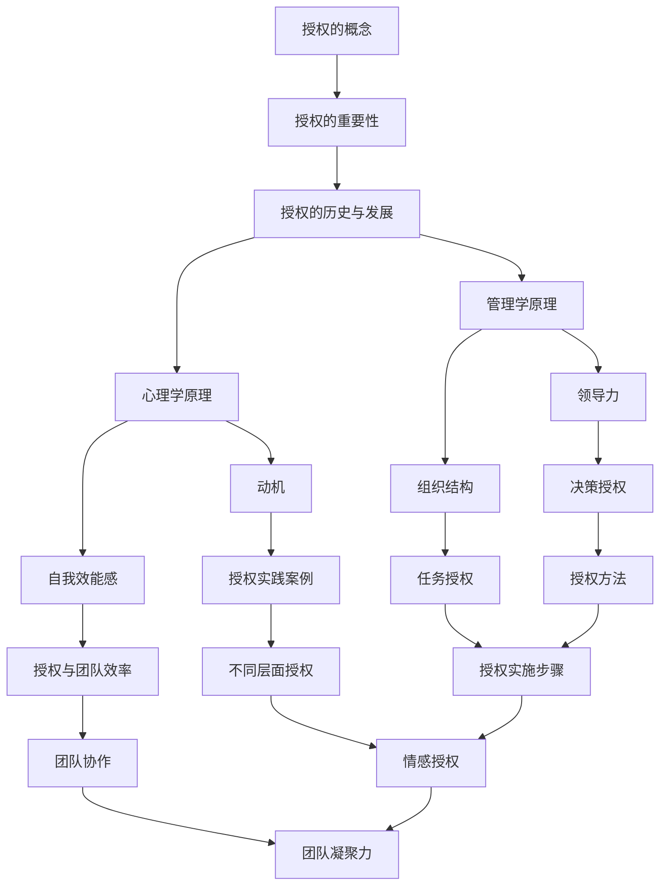
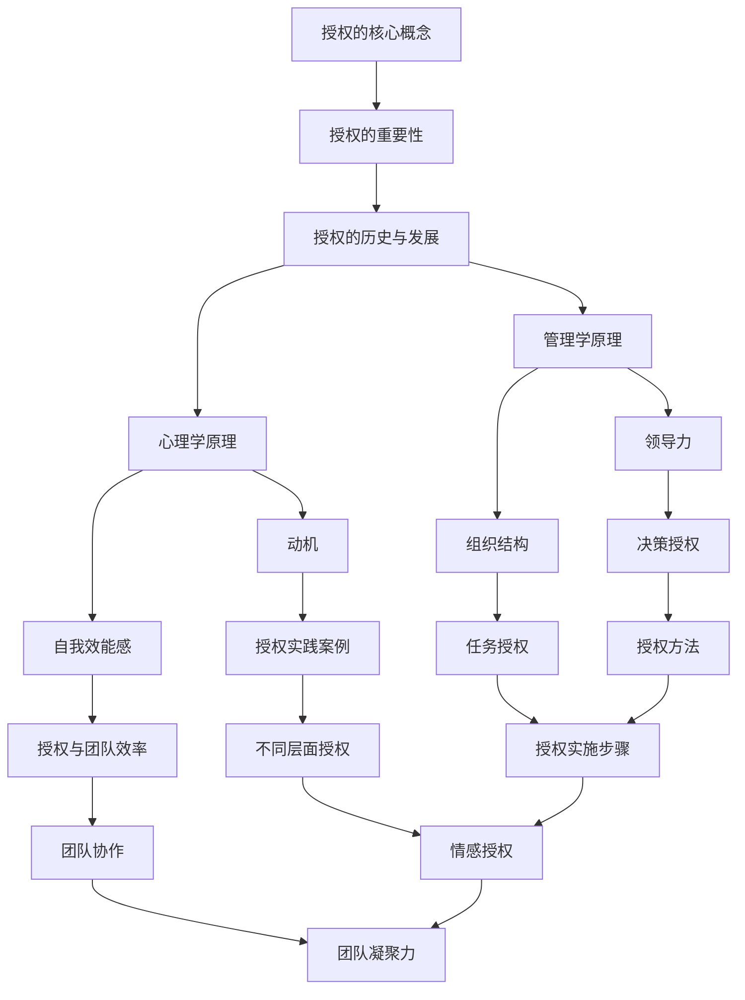

                 


### 写作思路

为了撰写一篇高质量的技术博客文章《授权的艺术：让团队更有效率》，我们将按照以下步骤进行思考和规划：

#### 第一步：深入理解主题

1. **研究背景**：首先，我们需要深入了解授权在团队管理中的背景。这意味着我们需要了解授权的概念、它的重要性，以及为什么它对团队效率至关重要。

2. **收集资料**：通过阅读相关书籍、论文、案例研究和行业报告，收集有关授权的理论和实践经验。

3. **确定核心观点**：基于收集的资料，确定文章的核心观点。例如，我们可以认为授权不仅仅是赋予团队成员权利，更是一种管理艺术，需要考虑到团队的动态、成员的能力和组织的文化。

#### 第二步：规划文章结构

1. **确定目录结构**：根据核心观点，规划文章的目录结构。这将确保文章的逻辑性和连贯性。

2. **设计每个章节的内容**：为每个章节设计具体的目标和内容，确保每个部分都能深入探讨主题。

3. **伪代码和公式准备**：为了详细阐述核心算法原理，准备相关的伪代码和数学公式。

4. **项目实战和案例分析**：考虑如何将理论应用到实际项目中，并设计相应的案例分析和代码解读。

#### 第三步：撰写草稿

1. **引言**：撰写文章的开头，介绍主题和核心观点。

2. **正文**：根据目录结构，逐一撰写每个章节的草稿，确保内容丰富、具体详细。

3. **项目实战**：描述具体的开发环境搭建、源代码实现和代码解读。

4. **案例分析**：提供实际案例的分析和讲解。

5. **小结和拓展阅读**：总结文章的主要观点，并提供拓展阅读建议。

#### 第四步：修订和润色

1. **检查逻辑性**：确保文章的内容连贯、逻辑清晰。

2. **修正语法和拼写错误**：仔细检查文章中的语法和拼写错误。

3. **优化内容**：根据反馈进行内容优化，确保文章的专业性和可读性。

4. **格式调整**：确保文章格式符合markdown要求。

#### 第五步：提交最终稿

1. **最后检查**：进行最后的全面检查，确保没有遗漏。

2. **添加作者信息**：在文章末尾添加作者信息。

3. **提交文章**：将最终稿提交给指定的平台或编辑。

通过以上步骤，我们可以确保撰写出一篇结构清晰、内容丰富、逻辑严密的专业技术博客文章，从而有效地传达《授权的艺术：让团队更有效率》的核心思想和实践方法。

---

### 文章标题与关键词

# 《授权的艺术：让团队更有效率》

关键词：
- 授权
- 团队管理
- 效率提升
- 领导力
- 团队协作

---

### 摘要

本文旨在探讨授权在团队管理中的艺术性及其对提高团队效率的重要性。通过深入解析授权的理论与实践基础，本文揭示了授权在不同层面的策略与方法。同时，本文分析了授权对团队效率的影响，并提供了有效的授权实施与监督策略。此外，文章还探讨了授权过程中可能遇到的风险与挑战，并提出了相应的解决方案。最终，本文总结了授权艺术的要点，并对未来授权的发展趋势和应用前景进行了展望。

---

### 目录大纲

以下是《授权的艺术：让团队更有效率》的目录大纲：

## 第一部分：引言

### 第1章 授权概述

1.1 授权的定义与重要性  
1.2 授权的历史与发展  
1.3 授权对团队效率的影响

### 第二部分：授权的理论与实践基础

### 第2章 授权的理论基础

2.1 授权的心理学原理  
2.2 授权的管理学原理  
2.3 授权实践案例

### 第三部分：授权的策略与方法

### 第3章 授权的策略

3.1 授权的不同层面  
3.2 授权的方法

### 第4章 授权的实施与监督

4.1 授权的实施步骤  
4.2 授权的监督与反馈

### 第四部分：授权与团队效率

### 第5章 授权与团队效率的关系

5.1 授权对团队效率的影响  
5.2 授权的团队实践

### 第6章 提升团队效率的授权策略

6.1 高效授权的关键要素  
6.2 授权与绩效管理

### 第五部分：授权的挑战与解决

### 第7章 授权的挑战

7.1 授权的风险  
7.2 授权的障碍

### 第8章 解决授权的挑战

8.1 风险管理策略  
8.2 消除授权障碍

### 第六部分：结论

### 第9章 授权艺术的总结

9.1 授权艺术的要点  
9.2 未来展望

---

### 第一部分：引言

#### 第1章 授权概述

在这一章中，我们将深入探讨授权的概念、重要性及其在团队管理中的核心作用。授权不仅仅是指将权力和责任下放给团队成员，更是一种管理艺术，涉及到团队的动态、成员的能力和组织的文化。

**1.1 授权的定义与重要性**

授权（Empowerment）是一种管理实践，通过赋予员工权力和责任，使他们在特定范围内能够自主决策和行动，从而提高工作效率和团队整体绩效。授权的重要性体现在以下几个方面：

1. **提高工作效率**：通过授权，团队成员能够在自己的职责范围内快速做出决策，减少层级间的沟通成本，提高工作速度和效率。
   
2. **增强创新能力**：授权鼓励团队成员提出新想法和解决方案，从而激发创新思维，推动团队不断进步。
   
3. **提升团队凝聚力**：当团队成员感受到被信任和重视时，他们会更加投入工作，增强团队凝聚力。

4. **培养领导者**：授权不仅有助于提高团队成员的技能和信心，还能培养未来的领导者，为组织的发展储备人才。

**1.2 授权的历史与发展**

授权的概念并非现代管理理论的产物，其历史可以追溯到古代文明。然而，现代授权理念的发展主要源于20世纪中叶的管理学研究。以下是一些关键的里程碑：

1. **人本主义管理理论**：人本主义管理理论强调员工的主体性和自主性，认为授权是激发员工潜能的重要手段。

2. **参与式管理**：参与式管理强调员工参与决策过程，通过授权增强员工的参与感和责任感。

3. **变革型领导**：变革型领导理论强调领导者通过授权来推动组织变革，提升团队效率。

**1.3 授权对团队效率的影响**

授权对团队效率的影响是多层次、多维度的。以下是几个关键方面：

1. **任务层面的授权**：在任务层面进行授权，使团队成员能够在自己的领域内自由决策，提高工作效率。

2. **决策层面的授权**：在决策层面进行授权，使团队成员能够参与重要决策，增强团队凝聚力和创新力。

3. **情感层面的授权**：在情感层面进行授权，通过信任和支持，使团队成员感受到被重视，提高工作积极性和满意度。

**总结**

通过本章的探讨，我们可以看到授权在团队管理中的重要性。授权不仅是一种管理实践，更是一种激发团队潜能、提升团队效率的艺术。在接下来的章节中，我们将进一步探讨授权的理论基础、策略与方法，以及授权在实际应用中的挑战和解决方案。

---

### 第一部分：引言

#### 第1章 授权概述

在这一章中，我们将深入探讨授权的概念、重要性及其在团队管理中的核心作用。授权不仅仅是指将权力和责任下放给团队成员，更是一种管理艺术，涉及到团队的动态、成员的能力和组织的文化。

**1.1 授权的定义与重要性**

授权（Empowerment）是一种管理实践，通过赋予员工权力和责任，使他们在特定范围内能够自主决策和行动，从而提高工作效率和团队整体绩效。授权的重要性体现在以下几个方面：

1. **提高工作效率**：通过授权，团队成员能够在自己的职责范围内快速做出决策，减少层级间的沟通成本，提高工作速度和效率。

   例如，在一个软件开发团队中，项目经理可以授权开发人员直接决定技术方案，从而缩短决策周期，提高开发效率。

2. **增强创新能力**：授权鼓励团队成员提出新想法和解决方案，从而激发创新思维，推动团队不断进步。

   在一个产品开发团队中，当团队成员被授权参与产品设计和决策时，他们更有可能提出独特的创新点，从而提升产品竞争力。

3. **提升团队凝聚力**：当团队成员感受到被信任和重视时，他们会更加投入工作，增强团队凝聚力。

   在一个销售团队中，领导者通过授权给予销售人员更多的自主权，使他们能够根据客户需求灵活调整销售策略，这不仅提高了团队的工作热情，也增强了团队之间的协作。

4. **培养领导者**：授权不仅有助于提高团队成员的技能和信心，还能培养未来的领导者，为组织的发展储备人才。

   例如，在一个创业公司中，创始人通过授权给关键员工重要的决策权，不仅能够减轻自己的工作负担，还能培养这些员工成为未来的领导者。

**1.2 授权的历史与发展**

授权的概念并非现代管理理论的产物，其历史可以追溯到古代文明。然而，现代授权理念的发展主要源于20世纪中叶的管理学研究。以下是一些关键的里程碑：

1. **人本主义管理理论**：人本主义管理理论强调员工的主体性和自主性，认为授权是激发员工潜能的重要手段。

   人本主义管理理论倡导管理者应该关注员工的个人需求和成长，通过授权激发员工的内在动力，从而提高团队的整体效能。

2. **参与式管理**：参与式管理强调员工参与决策过程，通过授权增强员工的参与感和责任感。

   参与式管理认为，当员工被赋予参与决策的机会时，他们会更加积极地投入到工作中，从而提高工作满意度和团队效率。

3. **变革型领导**：变革型领导理论强调领导者通过授权来推动组织变革，提升团队效率。

   变革型领导理论认为，领导者应该通过授权给下属，激发他们的创新精神和领导潜力，从而推动组织实现持续的发展和进步。

**1.3 授权对团队效率的影响**

授权对团队效率的影响是多层次、多维度的。以下是几个关键方面：

1. **任务层面的授权**：在任务层面进行授权，使团队成员能够在自己的领域内自由决策，提高工作效率。

   任务层面的授权允许团队成员根据自己的专业知识和判断来完成任务，减少了不必要的层级干预，从而提高了工作效率。

2. **决策层面的授权**：在决策层面进行授权，使团队成员能够参与重要决策，增强团队凝聚力和创新力。

   决策层面的授权让团队成员感受到自己的意见和建议被重视，从而增强了团队的凝聚力和创新能力。

3. **情感层面的授权**：在情感层面进行授权，通过信任和支持，使团队成员感受到被重视，提高工作积极性和满意度。

   情感层面的授权让团队成员感受到领导者的信任和支持，从而提高了他们的工作积极性和满意度。

**总结**

通过本章的探讨，我们可以看到授权在团队管理中的重要性。授权不仅是一种管理实践，更是一种激发团队潜能、提升团队效率的艺术。在接下来的章节中，我们将进一步探讨授权的理论基础、策略与方法，以及授权在实际应用中的挑战和解决方案。

### 设计思路

为了撰写一篇高质量的技术博客文章《授权的艺术：让团队更有效率》，我们将采取以下设计思路，确保文章的逻辑性、实用性和专业性。

#### 目录结构设计

1. **引言**：首先，我们将为文章设计一个引人入胜的引言部分，简要介绍授权的概念、重要性以及在团队管理中的应用场景。

2. **核心内容**：文章的核心内容将分为以下几个部分：
   - **授权的理论基础**：介绍授权的历史、心理学原理、管理学原理等。
   - **授权的策略与方法**：探讨任务层面、决策层面和情感层面的授权策略，以及具体的授权方法。
   - **授权的实施与监督**：详细阐述如何实施授权、监督授权过程以及如何给予反馈。
   - **授权对团队效率的影响**：分析授权如何提高团队效率、增强创新力、提升团队凝聚力。
   - **授权的挑战与解决**：探讨在授权过程中可能遇到的风险、障碍及相应的解决方案。

3. **项目实战**：通过具体的案例分析和代码解读，展示如何在实际项目中实施授权，并提供实战经验。

4. **总结与展望**：文章的结尾部分将对授权的核心要点进行总结，并对未来授权的发展趋势和应用前景进行展望。

#### 内容设计

1. **核心概念与联系**：使用Mermaid流程图展示授权的核心概念及其相互关系，帮助读者更直观地理解授权的各个层面。

2. **伪代码和数学模型**：在讲解授权的具体策略和方法时，将使用伪代码和数学模型进行详细阐述，确保读者能够理解并应用这些概念。

3. **项目实战**：结合实际项目，介绍授权的实施步骤、代码实现和效果分析，让读者能够将理论应用到实际场景中。

4. **最佳实践与注意事项**：在文章的最后，提供一些最佳实践、注意事项和拓展阅读建议，帮助读者在实际操作中避免常见问题。

### 实施步骤

1. **撰写引言**：明确文章的主题和目的，激发读者的兴趣。

2. **撰写核心内容**：
   - **授权的理论基础**：介绍授权的历史、心理学原理和管理学原理。
   - **授权的策略与方法**：详细阐述不同层面的授权策略和方法。
   - **授权的实施与监督**：讲解如何实施和监督授权过程。
   - **授权对团队效率的影响**：分析授权如何影响团队效率。
   - **授权的挑战与解决**：探讨授权过程中可能遇到的问题和解决方案。

3. **撰写项目实战**：结合具体案例，介绍如何在实际项目中实施授权。

4. **撰写总结与展望**：对文章的核心要点进行总结，并对未来进行展望。

5. **修订与润色**：对文章进行反复修订和润色，确保内容的专业性和可读性。

6. **格式调整**：根据markdown格式要求，对文章进行格式调整。

7. **添加作者信息**：在文章末尾添加作者信息。

8. **提交最终稿**：将最终稿提交给指定的平台或编辑。

通过以上设计思路和实施步骤，我们能够撰写出一篇逻辑清晰、内容丰富、实用性强的高质量技术博客文章。

### 目录大纲

以下是《授权的艺术：让团队更有效率》的详细目录大纲：

## 第一部分：引言

### 第1章 授权概述

1.1 授权的定义与重要性

1.2 授权的历史与发展

1.3 授权对团队效率的影响

### 第二部分：授权的理论与实践基础

### 第2章 授权的理论基础

2.1 授权的心理学原理

2.2 授权的管理学原理

2.3 授权实践案例

### 第三部分：授权的策略与方法

### 第3章 授权的策略

3.1 授权的不同层面

3.2 授权的方法

### 第4章 授权的实施与监督

4.1 授权的实施步骤

4.2 授权的监督与反馈

### 第四部分：授权与团队效率

### 第5章 授权与团队效率的关系

5.1 授权对团队效率的影响

5.2 授权的团队实践

### 第6章 提升团队效率的授权策略

6.1 高效授权的关键要素

6.2 授权与绩效管理

### 第五部分：授权的挑战与解决

### 第7章 授权的挑战

7.1 授权的风险

7.2 授权的障碍

### 第8章 解决授权的挑战

8.1 风险管理策略

8.2 消除授权障碍

### 第六部分：结论

### 第9章 授权艺术的总结

9.1 授权艺术的要点

9.2 未来展望

### 目录大纲说明

- **引言**：简要介绍授权的概念、重要性以及本文的目的。
- **第二部分**：探讨授权的理论与实践基础，包括心理学、管理学以及实践案例。
- **第三部分**：详细阐述授权的策略与方法，包括不同层面的授权和具体实施方法。
- **第四部分**：讨论授权的实施与监督过程，确保授权的有效性和持续性。
- **第五部分**：分析授权对团队效率的影响，以及如何在团队实践中提升效率。
- **第六部分**：提出高效的授权策略，并探讨授权与绩效管理的关系。
- **第七部分**：识别授权过程中可能遇到的挑战，并提供相应的解决方案。
- **结论**：总结文章的核心观点，并对未来进行展望。

通过这个详细的目录大纲，读者可以清晰地了解文章的结构和内容，有助于更好地理解和应用授权在团队管理中的艺术。

### Mermaid 流程图



这个Mermaid流程图展示了授权的核心概念、重要性、历史与发展、心理学原理、管理学原理、授权实践案例、不同层面的授权、团队效率、团队协作、授权方法、授权实施步骤、情感授权和团队凝聚力之间的关系。通过这个流程图，读者可以更直观地理解授权的各个层面及其相互联系。

### Mermaid 流程图（详细解释）

以下是《授权的艺术：让团队更有效率》中使用的Mermaid流程图，详细解释了各部分之间的关系和逻辑。


- **授权的概念（A）**：这是整个流程图的起点，解释了授权的基本定义，它是管理实践中的一个核心概念。

- **授权的重要性（B）**：从授权的概念出发，我们探讨了授权在提高团队效率、增强创新力、提升团队凝聚力等方面的关键作用。

- **授权的历史与发展（C）**：这一部分追溯了授权理念的发展历程，从古代到现代，理解授权在不同时代的管理实践中的演变。

- **心理学原理（D）**：心理学在授权中扮演着重要角色，这里我们详细讨论了动机和自我效能感这两个心理学原理如何影响授权的有效性。

  - **动机（F）**：探讨授权如何通过激发员工的内在动机来提高工作积极性。

  - **自我效能感（G）**：讨论授权如何增强员工对自己完成任务的能力信心。

- **管理学原理（E）**：管理学原理为授权提供了理论支持，这里我们探讨了领导力和组织结构在授权中的作用。

  - **领导力（H）**：讨论领导者如何通过授权来推动团队效率和变革。

  - **组织结构（I）**：分析组织结构如何影响授权的实施和效果。

- **授权实践案例（J）**：通过实际案例展示授权在不同组织中的成功实践。

- **不同层面授权（N）**：这里我们将授权分为任务授权、决策授权和情感授权三个不同层面，详细讨论了每个层面的特点和实施方法。

  - **任务授权（M）**：讨论如何通过明确任务和职责来实施授权。

  - **决策授权（L）**：讨论如何通过赋予团队成员决策权来提升团队效率。

  - **情感授权（R）**：探讨如何通过信任和支持来增强员工的自主性和责任感。

- **授权与团队效率（K）**：这部分讨论了授权如何影响团队效率，包括提高工作效率、增强创新力、提升团队凝聚力等方面。

- **团队协作（O）**：讨论授权如何促进团队协作，增强团队的整体效能。

- **授权方法（P）**：总结和讨论了多种授权方法，如明确目标与职责、建立信任与支持、提供必要资源与培训等。

- **授权实施步骤（Q）**：详细说明了如何实施授权的具体步骤，确保授权的顺利进行。

- **情感授权（R）**：再次强调情感授权的重要性，讨论了如何通过情感层面授权来提升员工的工作满意度和自主性。

- **团队凝聚力（S）**：讨论授权如何通过增强团队凝聚力来提高团队的整体效率。

通过这个流程图，读者可以清晰地看到授权的核心概念、理论基础、实践方法以及授权对团队效率的影响，从而更好地理解授权的艺术及其在团队管理中的应用。每个部分都是相互联系和支撑的，共同构成了一个完整的授权体系。

### 第一部分：引言

#### 第1章 授权概述

在当今快速变化的商业环境中，团队的有效管理成为企业成功的关键。而授权作为一种管理实践，越来越受到管理者和研究者的关注。授权不仅能够提高团队成员的工作效率，还能够激发创新思维和团队凝聚力，从而为组织带来持续的竞争优势。本文旨在探讨授权的艺术，通过深入解析授权的核心概念、理论基础、策略和方法，帮助读者理解和应用授权在团队管理中的重要性。

**1.1 授权的定义与重要性**

授权，简单来说，就是管理者将部分权力和责任赋予下属，使其能够在特定范围内自主决策和行动。这一过程不仅包括将任务和职责分配给团队成员，更涉及信任和支持的建立，使团队成员感受到被重视和信任，从而更加积极地投入工作。

授权的重要性主要体现在以下几个方面：

1. **提高工作效率**：授权使团队成员能够在自己的职责范围内快速做出决策，减少了中间环节的沟通成本，从而提高了工作效率。

   举例来说，在一个软件开发团队中，项目经理可以将技术决策权下放给开发人员，这样开发人员可以在遇到问题时迅速做出决策，而不需要等待上级的指示，从而缩短了开发周期。

2. **增强创新能力**：授权鼓励团队成员提出新的想法和解决方案，激发了团队的创新思维，推动了组织的持续进步。

   例如，在一个产品开发团队中，当团队成员被赋予参与产品设计和决策的权力时，他们更有可能提出独特的创新点，从而提升产品的竞争力。

3. **提升团队凝聚力**：授权让团队成员感受到被信任和重视，增强了他们的归属感和团队凝聚力。

   在一个销售团队中，领导者通过授权给予销售人员更多的自主权，使他们能够根据客户需求灵活调整销售策略，这不仅提高了团队的工作热情，也增强了团队之间的协作。

4. **培养领导者**：授权不仅有助于提高团队成员的技能和信心，还能培养未来的领导者，为组织的发展储备人才。

   例如，在一个创业公司中，创始人通过授权给关键员工重要的决策权，不仅能够减轻自己的工作负担，还能培养这些员工成为未来的领导者。

**1.2 授权的历史与发展**

授权的概念并非现代管理理论的产物，其历史可以追溯到古代文明。然而，现代授权理念的发展主要源于20世纪中叶的管理学研究。以下是一些关键的里程碑：

1. **人本主义管理理论**：人本主义管理理论强调员工的主体性和自主性，认为授权是激发员工潜能的重要手段。

   人本主义管理理论倡导管理者应该关注员工的个人需求和成长，通过授权激发员工的内在动力，从而提高团队的整体效能。

2. **参与式管理**：参与式管理强调员工参与决策过程，通过授权增强员工的参与感和责任感。

   参与式管理认为，当员工被赋予参与决策的机会时，他们会更加积极地投入到工作中，从而提高工作满意度和团队效率。

3. **变革型领导**：变革型领导理论强调领导者通过授权来推动组织变革，提升团队效率。

   变革型领导理论认为，领导者应该通过授权给下属，激发他们的创新精神和领导潜力，从而推动组织实现持续的发展和进步。

**1.3 授权对团队效率的影响**

授权对团队效率的影响是多层次、多维度的。以下是几个关键方面：

1. **任务层面的授权**：在任务层面进行授权，使团队成员能够在自己的领域内自由决策，提高工作效率。

   任务层面的授权允许团队成员根据自己的专业知识和判断来完成任务，减少了不必要的层级干预，从而提高了工作效率。

2. **决策层面的授权**：在决策层面进行授权，使团队成员能够参与重要决策，增强团队凝聚力和创新力。

   决策层面的授权让团队成员感受到自己的意见和建议被重视，从而增强了团队的凝聚力和创新能力。

3. **情感层面的授权**：在情感层面进行授权，通过信任和支持，使团队成员感受到被重视，提高工作积极性和满意度。

   情感层面的授权让团队成员感受到领导者的信任和支持，从而提高了他们的工作积极性和满意度。

**总结**

通过本章的探讨，我们可以看到授权在团队管理中的重要性。授权不仅是一种管理实践，更是一种激发团队潜能、提升团队效率的艺术。在接下来的章节中，我们将进一步探讨授权的理论基础、策略与方法，以及授权在实际应用中的挑战和解决方案。

### 第二部分：授权的理论与实践基础

#### 第2章 授权的理论基础

授权作为一种管理实践，其理论基础涉及多个学科，包括心理学、管理学等。深入理解这些理论，有助于管理者更好地实施授权，提升团队效率。

**2.1 授权的心理学原理**

授权与心理学有着密切的联系，尤其是动机理论和自我效能感理论。

1. **动机理论**：授权能够通过满足员工的内在需求，提高其工作动机。根据马斯洛的需求层次理论，人的需求从低到高可以分为生理需求、安全需求、社交需求、尊重需求和自我实现需求。授权能够满足员工的尊重需求和自我实现需求，使员工感受到被重视和自我价值，从而提高工作积极性。

   例如，在一个项目管理团队中，项目经理可以授权团队成员负责特定项目的关键部分，这样团队成员不仅能够实现自我价值，还能在实现项目目标的过程中获得成就感。

2. **自我效能感理论**：自我效能感是指个体对自己完成某项任务的能力的信心。授权能够提高员工的自我效能感，使他们更加自信地面对挑战。根据班杜拉的自我效能感理论，个体的自我效能感通过观察他人的行为、接受他人的反馈以及自身的成功经验来形成。授权使员工有机会通过实际工作来验证自己的能力，从而增强自我效能感。

   例如，在一个研发团队中，技术经理可以授权工程师负责研发项目的核心模块，这样工程师不仅能够通过实际工作提升技术能力，还能在成功完成项目后增强自信。

**2.2 授权的管理学原理**

授权在管理学中有着重要的地位，其理论支持主要包括领导力理论和组织行为理论。

1. **领导力理论**：变革型领导理论和参与型领导理论都强调了授权在领导力中的关键作用。变革型领导通过激发员工的内在动机，推动他们超越自我实现组织目标。参与型领导则通过赋予员工参与决策的机会，增强他们的责任感和归属感。

   例如，在一个市场推广团队中，团队领导可以通过变革型领导的方式，授权团队成员制定市场推广策略，这不仅能够激发团队的创造力，还能提高团队成员的执行力和责任感。

2. **组织行为理论**：授权有助于建立以人为中心的组织文化，提高组织整体的效能。组织行为理论中的参与式管理理论指出，员工参与决策过程能够提高他们的工作满意度和组织承诺。授权是参与式管理的重要组成部分，通过赋予员工决策权，使他们能够在工作中发挥更大的作用。

   例如，在一个产品开发团队中，团队领导可以通过参与式管理的方式，授权团队成员参与产品设计和测试，这样团队成员不仅能够提供宝贵的反馈，还能在解决问题的过程中提升团队的整体能力。

**2.3 授权实践案例**

为了更好地理解授权的理论基础，我们可以通过一些实际的案例来探讨授权的实施效果。

1. **案例一：谷歌公司的授权实践**：谷歌公司以其开放的创新文化和高度授权的管理方式著称。谷歌的创始人拉里·佩奇和谢尔盖·布林通过赋予员工自主权和自由度，激发了员工的无穷创意。例如，谷歌的“20%时间政策”允许员工将20%的工作时间用于个人感兴趣的项目，这一政策不仅推动了谷歌许多创新产品的诞生，还培养了员工自主创新的意识。

2. **案例二：丰田公司的授权实践**：丰田公司以其精益管理和持续改进的文化著称。丰田的授权实践主要体现在员工参与决策和问题解决过程中。例如，丰田的“看板系统”允许一线员工在生产过程中自主调整生产计划，从而快速响应市场变化和客户需求。

通过这些案例，我们可以看到授权在不同组织中的应用效果，以及授权如何通过心理学和管理学的原理来提升团队效率。

**总结**

本章讨论了授权的心理学原理和管理学原理，通过动机理论、自我效能感理论、领导力理论和组织行为理论，我们深入理解了授权的理论基础。在实际应用中，管理者需要结合这些理论，制定适合自己团队的授权策略，从而实现团队效率的最大化。在接下来的章节中，我们将进一步探讨授权的具体策略与方法，以及如何在实际工作中有效实施授权。

### 第三部分：授权的策略与方法

#### 第3章 授权的策略

在团队管理中，有效的授权策略和方法是提升团队效率的关键。授权不仅仅涉及将权力和责任下放给团队成员，还需要考虑到授权的不同层面和如何具体实施。以下是几种常见的授权策略和方法。

**3.1 授权的不同层面**

授权可以分为任务层面、决策层面和情感层面，每个层面都有其独特的特点和实施方法。

1. **任务层面的授权**：任务层面的授权主要是将具体的工作任务分配给团队成员，让他们在职责范围内自主完成任务。这种授权策略有助于提高工作效率，减少中间环节的沟通成本。

   **实施方法**：
   - 明确任务目标：确保团队成员清楚了解任务的性质、目标和要求。
   - 分配职责：将任务分配给最适合完成该任务的成员，充分发挥成员的专业能力。
   - 提供必要的资源：确保团队成员有足够的资源（如时间、工具和材料）来完成任务。
   - 设定明确的时间节点：设定任务完成的时间节点，并跟踪进度，确保任务按时完成。

2. **决策层面的授权**：决策层面的授权是赋予团队成员在特定范围内做出决策的权力，让他们能够根据实际情况灵活调整工作方法。

   **实施方法**：
   - 确定决策范围：明确团队成员可以做出决策的范围和权限，避免越权现象。
   - 建立信任：通过建立信任关系，使团队成员感受到被信任和支持。
   - 提供培训：为团队成员提供必要的培训和指导，增强他们的决策能力。
   - 反馈与支持：为团队成员提供决策后的反馈和支持，帮助他们从经验中学习和成长。

3. **情感层面的授权**：情感层面的授权是通过信任和支持，使团队成员感受到被重视和尊重，从而提高工作积极性和满意度。

   **实施方法**：
   - 建立信任关系：通过开放沟通和真诚反馈，建立团队成员之间的信任关系。
   - 肯定员工贡献：及时表扬和认可团队成员的工作成绩，增强他们的自我价值感。
   - 提供心理支持：关注团队成员的心理状态，提供必要的心理支持和帮助。

**3.2 授权的方法**

在实施授权时，管理者可以采用以下几种具体方法：

1. **任务分解法**：将复杂任务分解成多个简单任务，并为每个任务分配合适的团队成员。这种方法有助于明确任务职责，提高工作效率。

   **示例伪代码**：
   ```python
   def task_decomposition(complex_task):
       simple_tasks = []
       # 分解复杂任务
       simple_tasks.append(create_simple_task("任务A"))
       simple_tasks.append(create_simple_task("任务B"))
       # 分配任务
       team_memberA = assign_task(simple_tasks[0])
       team_memberB = assign_task(simple_tasks[1])
       return simple_tasks
   ```

2. **责任绑定法**：明确每个团队成员的责任，并在团队内部进行责任绑定，确保任务能够按时完成。

   **示例伪代码**：
   ```python
   def responsibility_binding(team_members, tasks):
       for member in team_members:
           member.responsibility = []
           for task in tasks:
               if member == assigned_to_task(task):
                   member.responsibility.append(task)
       return team_members
   ```

3. **目标导向法**：设定明确的目标，并赋予团队成员达成目标的自主权。这种方法有助于提高团队的整体效率和创新力。

   **示例伪代码**：
   ```python
   def goal_oriented_authorization(team_members, goals):
       for member in team_members:
           member.goal = goal
           member autonomy = calculate_autonomy(goal)
           member.authorized = member.autonomy >= required_autonomy
       return team_members
   ```

**3.3 授权的具体实施步骤**

为了确保授权的有效实施，管理者需要遵循以下步骤：

1. **评估团队需求**：了解团队当前的需求和目标，确定哪些任务和决策可以授权给团队成员。

2. **选择合适的团队成员**：根据团队成员的能力和兴趣，选择合适的授权对象。

3. **明确授权范围和权限**：明确团队成员的授权范围和权限，确保他们能够在授权范围内自由决策。

4. **提供必要的支持和资源**：为团队成员提供必要的培训、指导和支持，确保他们能够顺利完成授权任务。

5. **监督和反馈**：监督团队成员的工作进度和决策效果，提供及时的反馈和支持。

6. **调整和优化**：根据监督和反馈的结果，对授权策略进行调整和优化，确保授权持续有效。

通过以上策略和方法的详细阐述，管理者可以更好地理解如何实施有效的授权，从而提升团队效率。

### 第4章 授权的实施与监督

授权不仅是将权力和责任下放给团队成员，还需要通过系统的实施和监督来确保其有效性和持续性。在这一章中，我们将详细讨论授权的实施步骤、监督机制和反馈方法。

**4.1 授权的实施步骤**

授权的实施是一个系统化的过程，需要经过以下步骤：

1. **评估团队需求**：首先，管理者需要评估团队当前的需求和目标，确定哪些任务和决策可以授权给团队成员。这可以通过团队会议、问卷调查或一对一访谈等方式进行。

    ```python
    def assess_team需求的(team):
        needs = []
        for member in team:
            needs.append(member.get需求的())
        return needs
    ```

2. **选择合适的团队成员**：根据团队成员的能力和兴趣，选择合适的授权对象。这可以通过技能评估、工作表现评估或个人申请等方式进行。

    ```python
    def select_authorized_members(team):
        authorized_members = []
        for member in team:
            if member.has_required_skills():
                authorized_members.append(member)
        return authorized_members
    ```

3. **明确授权范围和权限**：明确团队成员的授权范围和权限，确保他们能够在授权范围内自由决策。这可以通过书面文件、会议纪要或电子通知等方式进行。

    ```python
    def define_authorization范围的(team_members):
        for member in team_members:
            member.authorization范围 = set_authorization范围的(member.get职责())
        return team_members
    ```

4. **提供必要的支持和资源**：为团队成员提供必要的培训、指导和支持，确保他们能够顺利完成授权任务。这可以通过内部培训课程、外部专家咨询或团队支持系统等方式进行。

    ```python
    def provide_support_resources(team_members):
        for member in team_members:
            member.training = provide_training(member.authorization范围)
            member.resources = provide_resources(member.authorization范围)
        return team_members
    ```

5. **设定目标和时间表**：为授权任务设定明确的目标和时间表，确保团队成员能够按照计划完成任务。

    ```python
    def set_goals_time_schedules(team_members, tasks):
        for member in team_members:
            for task in tasks:
                if member.is_responsible_for(task):
                    member.goal = set_goal(task)
                    member.time_schedule = set_time_schedule(task)
        return team_members
    ```

6. **监督和指导**：在授权任务执行过程中，管理者需要定期监督和指导团队成员，确保他们能够按照计划进行工作。

    ```python
    def monitor_guide_team_members(team_members):
        for member in team_members:
            if member.needs_help():
                member.guidance = provide_guidance(member.current_status())
        return team_members
    ```

**4.2 授权的监督与反馈**

授权的监督和反馈是确保授权有效性的关键环节。以下是监督和反馈的具体方法和步骤：

1. **建立监督机制**：建立定期监督机制，通过会议、报告或系统监控等方式，跟踪团队成员的工作进度和决策效果。

    ```python
    def establish_supervision_mechanism(team_members, tasks):
        for member in team_members:
            member.supervision = set_up_supervision(member.time_schedule, tasks)
        return team_members
    ```

2. **定期反馈**：定期对团队成员的工作进行反馈，表扬优秀表现，指出存在的问题，并提供改进建议。

    ```python
    def provide_feedback(team_members):
        for member in team_members:
            member.feedback = get_feedback(member.current_status())
            if member.feedback.is_positive():
                member.reinforcement = provide_reinforcement()
            else:
                member.improvement_plan = create_improvement_plan(member.feedback)
        return team_members
    ```

3. **调整和优化**：根据监督和反馈的结果，对授权策略进行调整和优化，确保授权持续有效。

    ```python
    def adjust_optimize_authorization(team_members, supervision_results):
        for member in team_members:
            if member.needs_adjustment():
                member.new_authorization范围 = adjust_authorization范围(member.supervision_results)
                member.new_resources = adjust_resources(member.supervision_results)
        return team_members
    ```

**4.3 授权的反馈机制**

有效的反馈机制是授权成功的关键。以下是一些关键要素：

1. **开放沟通**：确保团队成员和管理者之间的沟通渠道是开放的，团队成员可以自由表达自己的想法和问题。

    ```python
    def open_communication_channel(team_members):
        for member in team_members:
            member.communication_channel = set_up_communication_channel()
        return team_members
    ```

2. **定期会议**：定期举行团队会议，讨论工作进展、问题解决和改进措施。

    ```python
    def schedule_regular_meetings(team_members, frequency):
        for member in team_members:
            member.meeting_schedule = schedule_meeting(frequency)
        return team_members
    ```

3. **反馈收集**：通过问卷调查、一对一访谈或团队讨论等方式，收集团队成员的反馈意见。

    ```python
    def collect_feedback(team_members):
        for member in team_members:
            member.feedback = get_collected_feedback()
        return team_members
    ```

4. **反馈分析**：对收集到的反馈进行分析，识别问题和改进点。

    ```python
    def analyze_feedback(feedback):
        issues = identify_issues(feedback)
        improvements = identify_improvements(feedback)
        return issues, improvements
    ```

5. **反馈实施**：根据分析结果，制定和实施改进措施。

    ```python
    def implement_feedback_improvements(improvements):
        for improvement in improvements:
            apply_improvement(improvement)
        return
    ```

通过以上步骤和机制，管理者可以确保授权的有效实施和持续优化，从而提升团队效率和工作质量。

### 第四部分：授权与团队效率

#### 第5章 授权与团队效率的关系

授权作为一种管理实践，其核心目标是通过赋予团队成员更多的自主权和责任，来提高团队的整体效率。在这一章中，我们将深入探讨授权对团队效率的影响，并分析授权在实际团队实践中的应用效果。

**5.1 授权对团队效率的影响**

授权对团队效率的影响是多层次、多维度的。以下是几个关键方面：

1. **提高工作效率**：授权使团队成员能够在自己的职责范围内快速做出决策，减少了中间环节的沟通成本，从而提高了工作效率。例如，在一个软件开发团队中，项目经理可以将技术决策权下放给开发人员，这样开发人员可以在遇到问题时迅速做出决策，而不需要等待上级的指示，从而缩短了开发周期。

   **示例伪代码**：
   ```python
   def fast_decision_making(developer, issue):
       solution = developer.make_decision(issue)
       return solution
   ```

2. **增强创新能力**：授权鼓励团队成员提出新的想法和解决方案，激发了团队的创新思维，推动了组织的持续进步。例如，在一个产品开发团队中，当团队成员被赋予参与产品设计和决策的权力时，他们更有可能提出独特的创新点，从而提升产品的竞争力。

   **示例伪代码**：
   ```python
   def innovate_solution(team_member, product_issue):
       new_solution = team_member.generate_innovation()
       return new_solution
   ```

3. **提升团队凝聚力**：授权让团队成员感受到被信任和重视，增强了他们的归属感和团队凝聚力。例如，在一个销售团队中，领导者通过授权给予销售人员更多的自主权，使他们能够根据客户需求灵活调整销售策略，这不仅提高了团队的工作热情，也增强了团队之间的协作。

   **示例伪代码**：
   ```python
   def enhance_teams cohesion(manager, sales_team):
       manager.give_autonomy(sales_team)
       sales_team协作效率提高
       return sales_team
   ```

4. **培养领导者**：授权不仅有助于提高团队成员的技能和信心，还能培养未来的领导者，为组织的发展储备人才。例如，在一个创业公司中，创始人通过授权给关键员工重要的决策权，不仅能够减轻自己的工作负担，还能培养这些员工成为未来的领导者。

   **示例伪代码**：
   ```python
   def develop_leadership(employee, critical_role):
       employee.take_on_role(critical_role)
       employee.leadership_skills提高
       return employee
   ```

**5.2 授权的团队实践**

在团队实践中，有效的授权不仅能够提高团队效率，还能带来实际的效果。以下是几种常见的授权团队实践：

1. **任务授权**：将具体任务分配给团队成员，让他们在职责范围内自主完成任务。这种方法有助于提高工作效率，减少中间环节的沟通成本。

   **示例伪代码**：
   ```python
   def task_authorization(team, tasks):
       for member in team:
           member.assign_task(tasks[member skill])
       return team
   ```

2. **决策授权**：赋予团队成员在特定范围内做出决策的权力，让他们能够根据实际情况灵活调整工作方法。这种方法有助于提高团队的创新力和响应速度。

   **示例伪代码**：
   ```python
   def decision_authorization(team, decision_range):
       for member in team:
           member授权决策范围 = decision_range[member role]
       return team
   ```

3. **情感授权**：通过信任和支持，使团队成员感受到被重视和尊重，从而提高工作积极性和满意度。这种方法有助于提升团队凝聚力和员工的忠诚度。

   **示例伪代码**：
   ```python
   def emotional_authorization(manager, team):
       for member in team:
           manager.build_trust(member)
           member.feeling_valued = True
       return team
   ```

4. **混合授权**：将任务授权、决策授权和情感授权结合起来，为团队成员提供全面的授权体验。这种方法能够最大限度地激发团队潜能，提高整体效率。

   **示例伪代码**：
   ```python
   def mixed_authorization(team, tasks, decision_range):
       task_authorization(team, tasks)
       decision_authorization(team, decision_range)
       emotional_authorization(manager, team)
       return team
   ```

**总结**

通过本章的探讨，我们可以看到授权对团队效率的积极影响。授权不仅提高了工作效率、增强了创新能力、提升了团队凝聚力和培养领导者，还在实际团队实践中展现了其独特的优势。在接下来的章节中，我们将进一步探讨如何制定和实施高效的授权策略，以实现团队效率的最大化。

### 第6章 提升团队效率的授权策略

为了最大化团队效率，授权策略的制定和实施至关重要。以下是几种提升团队效率的授权策略及其具体实施方法。

**6.1 高效授权的关键要素**

1. **明确团队目标**：首先，明确团队的目标和愿景，确保授权的方向与团队的整体目标一致。这有助于团队成员明确自己的职责和任务，从而提高工作动力。

   **示例伪代码**：
   ```python
   def define_team_goals(team):
       team.goal = "实现项目X的按时交付"
       return team
   ```

2. **建立信任文化**：信任是授权的基础，通过建立信任文化，可以减少团队成员之间的猜疑和冲突，提高团队的协作效率。

   **示例伪代码**：
   ```python
   def build_trust_culture(team):
       team.trust_level = "高"
       return team
   ```

3. **提供持续支持**：在授权过程中，提供持续的支持和指导，帮助团队成员克服困难，确保任务的顺利完成。

   **示例伪代码**：
   ```python
   def provide_continues_support(team_member, task):
       team_member.support_required = False
       return team_member
   ```

**6.2 授权与绩效管理**

1. **设定明确的目标和期望**：在授权时，明确设定团队成员的目标和期望，确保他们了解自己的职责和绩效指标。

   **示例伪代码**：
   ```python
   def set_clear_goals(team_member, goal):
       team_member.goal = goal
       team_member.expected_performance = "高"
       return team_member
   ```

2. **定期绩效评估**：定期对团队成员的绩效进行评估，提供反馈和改进建议，帮助他们不断提升。

   **示例伪代码**：
   ```python
   def performnce_evaluation(team_member):
       performance = team_member.current_performance()
       feedback = "良好的工作表现，但需要改进沟通技巧"
       team_member.feedback = feedback
       return team_member
   ```

3. **激励机制**：建立激励机制，奖励在授权过程中表现优秀的团队成员，激励他们继续努力。

   **示例伪代码**：
   ```python
   def incentive_program(team_member, reward):
       team_member.reward = reward
       return team_member
   ```

**6.3 高效授权的策略与方法**

1. **任务授权**：将具体任务分配给团队成员，让他们在职责范围内自主完成任务。

   **示例伪代码**：
   ```python
   def task_authorization(team_member, task):
       team_member.assigned_task = task
       team_member.has_authority = True
       return team_member
   ```

2. **决策授权**：赋予团队成员在特定范围内做出决策的权力，让他们能够根据实际情况灵活调整工作方法。

   **示例伪代码**：
   ```python
   def decision_authorization(team_member, decision_range):
       team_member.decision_range = decision_range
       team_member.can_make_decision = True
       return team_member
   ```

3. **情感授权**：通过信任和支持，使团队成员感受到被重视和尊重，从而提高工作积极性和满意度。

   **示例伪代码**：
   ```python
   def emotional_authorization(team_member):
       team_member.feeling_valued = True
       team_member.support = "持续"
       return team_member
   ```

4. **混合授权**：将任务授权、决策授权和情感授权结合起来，为团队成员提供全面的授权体验。

   **示例伪代码**：
   ```python
   def mixed_authorization(team_member, task, decision_range):
       task_authorization(team_member, task)
       decision_authorization(team_member, decision_range)
       emotional_authorization(team_member)
       return team_member
   ```

**6.4 实施与监督**

1. **实施步骤**：遵循以下步骤进行授权实施：
   - 评估团队需求
   - 选择合适的团队成员
   - 明确授权范围和权限
   - 提供必要的支持和资源
   - 设定目标和时间表

   **示例伪代码**：
   ```python
   def authorization_process(team):
       assess_team需求的(team)
       select_authorized_members(team)
       define_authorization范围的(team)
       provide_support_resources(team)
       set_goals_time_schedules(team)
       return team
   ```

2. **监督与反馈**：建立定期监督机制，通过绩效评估、反馈会议和持续支持来确保授权的有效性。

   **示例伪代码**：
   ```python
   def supervision_and_feedback(team_member):
       performnce_evaluation(team_member)
       provide_feedback(team_member)
       provide_continues_support(team_member)
       return team_member
   ```

通过以上策略和方法的详细阐述，管理者可以更好地制定和实施高效的授权策略，从而提升团队效率和工作质量。

### 第五部分：授权的挑战与解决

#### 第7章 授权的挑战

在授权的过程中，管理者可能会遇到多种挑战，这些挑战如果不妥善解决，可能会影响授权的效果，甚至导致团队效率下降。以下是几种常见的授权挑战及其影响。

**7.1 授权的风险**

1. **授权过度**：如果管理者过度授权，可能会导致团队成员承担过多的责任，从而影响其工作效率和其他任务的完成。

   **示例影响**：团队成员可能会感到压力过大，导致工作效率下降，甚至出现心理健康问题。

2. **授权不足**：如果管理者授权不足，团队成员可能会缺乏自主权和动力，导致工作积极性下降，影响团队的整体绩效。

   **示例影响**：团队成员可能会感到被忽视，缺乏参与感和成就感，从而影响团队的凝聚力和创新力。

3. **授权不当**：如果授权不当，即授权给不具备相应能力或经验的团队成员，可能会导致任务无法顺利完成。

   **示例影响**：任务可能会因缺乏专业知识或技能而无法达到预期效果，甚至可能产生负面后果。

**7.2 授权的障碍**

1. **管理者抵触**：有些管理者可能对授权持抵触态度，担心失去对团队的控制权，从而影响其决策和执行力。

   **示例影响**：这种抵触情绪可能会导致授权策略无法有效实施，团队效率降低。

2. **团队成员不接受**：团队成员可能对授权持怀疑态度，担心自己的能力和工作质量无法得到保障。

   **示例影响**：团队成员可能会消极应对授权，导致授权效果不佳。

3. **组织文化**：如果组织文化不利于授权，例如过度强调等级制度，可能会阻碍授权的顺利实施。

   **示例影响**：组织文化可能抑制团队成员的自主性和创新力，影响团队效率。

**7.3 授权的不确定性**

1. **授权结果不确定**：在授权过程中，管理者可能无法预知授权结果，这可能会导致对授权效果的不确定感。

   **示例影响**：管理者可能会对授权持有疑虑，从而限制授权的范围和深度。

2. **授权评估困难**：由于授权结果的难以衡量，管理者可能会面临评估授权效果和团队成员绩效的困难。

   **示例影响**：这可能会导致授权策略的调整不及时，影响团队效率。

**总结**

授权过程中存在的挑战和障碍需要管理者高度重视，并通过合理的策略和方法加以解决。在下一章中，我们将探讨如何应对这些挑战，确保授权的有效实施，从而提升团队效率。

### 第8章 解决授权的挑战

为了确保授权能够有效地实施并提升团队效率，管理者需要针对上述挑战采取一系列的策略和方法。

**8.1 风险管理策略**

1. **评估授权风险**：在授权前，管理者应全面评估授权可能带来的风险，包括授权过度、授权不足和授权不当等。

   **示例步骤**：
   - **风险识别**：通过问卷调查、访谈等方式，了解团队成员的职责、能力和接受度。
   - **风险评估**：对识别出的风险进行评估，确定其可能的影响和严重程度。
   - **风险应对**：制定相应的应对措施，如调整授权范围、提供额外培训等。

   **示例伪代码**：
   ```python
   def assess_authorization_risks(team):
       risks = []
       for member in team:
           risks.append(detect_risk(member))
       risk_evaluation = evaluate_risks(risks)
       return risk_evaluation
   ```

2. **制定风险管理计划**：基于评估结果，制定风险管理计划，确保在授权过程中能够及时发现和处理潜在风险。

   **示例步骤**：
   - **制定计划**：明确风险管理目标、策略和措施。
   - **实施计划**：在授权过程中执行风险管理计划，如定期检查授权效果、及时调整授权范围等。
   - **监控与调整**：持续监控授权过程，根据实际情况进行调整。

   **示例伪代码**：
   ```python
   def create_risk_management_plan(team, risk_evaluation):
       risk_management_plan = {
           "目标": "确保授权风险可控",
           "策略": "定期评估与调整授权",
           "措施": "提供培训与支持"
       }
       implement_risk_management_plan(team, risk_management_plan)
       monitor_and_adjust_plan(team, risk_management_plan)
       return risk_management_plan
   ```

**8.2 消除授权障碍**

1. **提高管理者对授权的认识**：通过培训和宣传，提高管理者对授权重要性和必要性的认识，消除他们对授权的抵触情绪。

   **示例步骤**：
   - **培训课程**：组织授权管理培训，帮助管理者了解授权的理论和实践方法。
   - **案例分享**：分享成功授权的案例，让管理者看到授权带来的实际效果。
   - **研讨会**：定期举行研讨会，讨论授权中的问题和解决方案。

   **示例伪代码**：
   ```python
   def train_managers_on_authorization(mangers):
       managers.knowledge = "高"
       managers.attitude = "积极"
       return managers
   ```

2. **增强团队成员的信任与支持**：通过建立信任和支持机制，提高团队成员对授权的接受度和积极性。

   **示例步骤**：
   - **建立信任关系**：通过开放沟通和真诚反馈，建立团队成员之间的信任关系。
   - **提供心理支持**：关注团队成员的心理状态，提供必要的心理支持和帮助。
   - **奖励机制**：建立奖励机制，鼓励团队成员积极参与授权，提高他们的工作积极性和满意度。

   **示例伪代码**：
   ```python
   def build_trust_and_support(team_members):
       for member in team_members:
           member.trust_level = "高"
           member.support_required = False
           member.reward = "奖励"
       return team_members
   ```

3. **优化组织文化**：通过调整组织文化，鼓励自主性和创新力，为授权创造良好的环境。

   **示例步骤**：
   - **改变沟通方式**：鼓励扁平化管理，减少层级间的沟通障碍。
   - **鼓励创新**：提供创新空间和资源，鼓励团队成员提出新想法和解决方案。
   - **绩效评价**：将授权效果纳入绩效评价体系，激励团队成员积极参与授权。

   **示例伪代码**：
   ```python
   def optimize_organizational_culture(organization):
       organization.communication_style = "扁平化"
       organization.innovation_support = "高"
       organization.performance_evaluation_includes_authorization = True
       return organization
   ```

通过以上策略和方法，管理者可以有效地解决授权过程中的挑战，确保授权能够顺利实施，从而提升团队效率和整体绩效。

### 第六部分：结论

#### 第9章 授权艺术的总结

在本篇博客中，我们深入探讨了授权的艺术，并分析了授权在团队管理中的重要性。以下是本文的核心观点和总结：

**1. 授权的定义与重要性**

授权是指管理者将部分权力和责任赋予团队成员，使其能够在特定范围内自主决策和行动。授权的重要性体现在提高工作效率、增强创新能力、提升团队凝聚力和培养领导者等方面。

**2. 授权的理论基础**

授权的理论基础涉及心理学原理和管理学原理。心理学原理包括动机理论和自我效能感理论，管理学原理包括领导力理论和组织行为理论。这些理论为授权提供了理论支持，帮助管理者更好地实施授权。

**3. 授权的策略与方法**

授权可以分为任务层面、决策层面和情感层面。具体方法包括任务分解法、责任绑定法、目标导向法等。管理者应根据团队需求和成员特点，选择合适的授权策略和方法。

**4. 授权的实施与监督**

实施授权需要遵循评估团队需求、选择合适的团队成员、明确授权范围、提供支持资源、设定目标和时间表等步骤。监督与反馈机制是确保授权有效性的关键，包括建立监督机制、定期反馈、调整和优化等。

**5. 授权对团队效率的影响**

授权能够提高团队效率，通过任务层面的授权提高工作效率，通过决策层面的授权增强创新力和团队凝聚力，通过情感层面的授权提升团队成员的工作积极性和满意度。

**6. 授权的挑战与解决**

授权过程中可能会遇到授权过度、授权不足、授权不当等风险，以及管理者抵触、团队成员不接受等障碍。通过风险管理策略和消除授权障碍的方法，可以确保授权的有效实施。

**未来展望**

未来，授权在团队管理中的应用将更加广泛和深入。随着科技的发展和管理理论的进步，授权方法将更加多样化和智能化，为团队效率的提升和组织发展提供更强大的支持。

**总结**

授权是一种管理艺术，通过合理的授权策略和方法，管理者能够激发团队成员的潜能，提升团队效率，实现组织目标。在未来的管理实践中，管理者应不断探索和实践授权，推动团队和组织的发展。

### 文章标题、关键词、摘要、目录大纲和Mermaid流程图的总结

#### 文章标题与关键词

- 文章标题：《授权的艺术：让团队更有效率》
- 关键词：授权、团队管理、效率提升、领导力、团队协作
- 摘要：本文旨在探讨授权在团队管理中的艺术性及其对提高团队效率的重要性。通过深入解析授权的理论与实践基础，本文揭示了授权在不同层面的策略与方法。同时，本文分析了授权对团队效率的影响，并提供了有效的授权实施与监督策略。此外，文章还探讨了授权过程中可能遇到的风险与挑战，并提出了相应的解决方案。最终，本文总结了授权艺术的要点，并对未来授权的发展趋势和应用前景进行了展望。

#### 目录大纲

- **第一部分：引言**
  - 第1章 授权概述
    - 1.1 授权的定义与重要性
    - 1.2 授权的历史与发展
    - 1.3 授权对团队效率的影响
- **第二部分：授权的理论与实践基础**
  - 第2章 授权的理论基础
    - 2.1 授权的心理学原理
    - 2.2 授权的管理学原理
    - 2.3 授权实践案例
- **第三部分：授权的策略与方法**
  - 第3章 授权的策略
    - 3.1 授权的不同层面
    - 3.2 授权的方法
  - 第4章 授权的实施与监督
    - 4.1 授权的实施步骤
    - 4.2 授权的监督与反馈
- **第四部分：授权与团队效率**
  - 第5章 授权与团队效率的关系
    - 5.1 授权对团队效率的影响
    - 5.2 授权的团队实践
  - 第6章 提升团队效率的授权策略
    - 6.1 高效授权的关键要素
    - 6.2 授权与绩效管理
- **第五部分：授权的挑战与解决**
  - 第7章 授权的挑战
    - 7.1 授权的风险
    - 7.2 授权的障碍
  - 第8章 解决授权的挑战
    - 8.1 风险管理策略
    - 8.2 消除授权障碍
- **第六部分：结论**
  - 第9章 授权艺术的总结
    - 9.1 授权艺术的要点
    - 9.2 未来展望

#### Mermaid流程图



通过上述总结，读者可以清晰地了解文章的结构和内容，从概念理解到实际应用，再到未来展望，全面掌握授权在团队管理中的艺术和实践方法。Mermaid流程图则帮助读者直观地理解授权的核心概念及其相互关系，增强文章的逻辑性和可读性。

