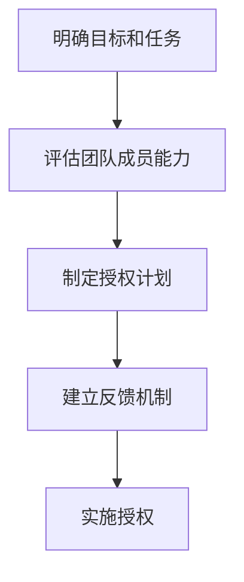
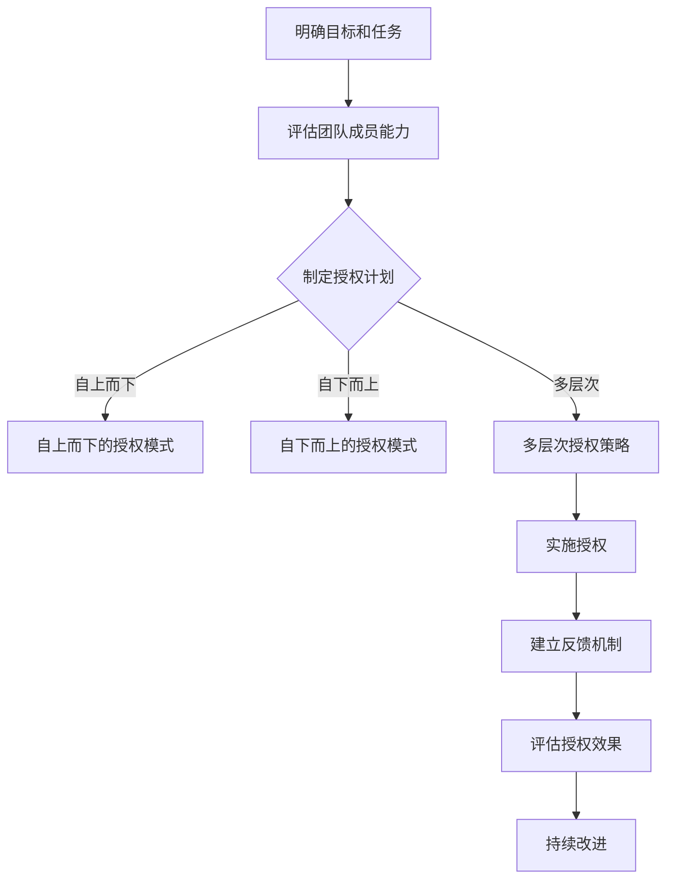
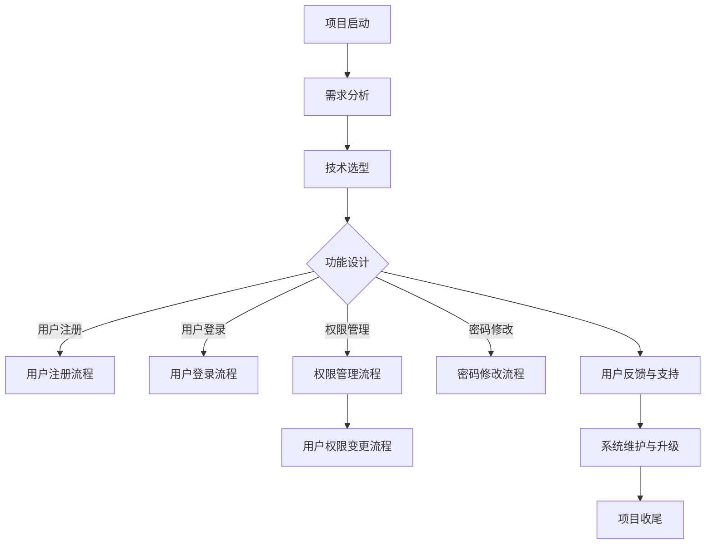

                 


### 文章标题：授权的艺术：释放团队潜力的关键

#### 关键词：授权、团队管理、领导力、执行力、创新

#### 摘要：
本文将深入探讨授权在团队管理中的重要性，通过详细阐述授权的基本概念、实践策略和影响，揭示如何通过授权释放团队的潜力，提升组织的整体效能。文章将结合实际案例，探讨授权在不同行业和组织中的成功实践，并提供应对授权过程中常见挑战的解决策略。最终，文章将总结授权的艺术，结合心理学、领导力等领域的知识，为读者提供全面而实用的指导。

## 第1章 授权的基本概念与原则

### 1.1 授权的定义与重要性

#### 1.1.1 授权的概念解释
授权（Delegation）是指管理者将一部分权力和责任下放给团队成员，使其在一定范围内拥有决策和执行的自由。这一过程不仅涉及权力的转移，还包括责任的明确和信任的建立。

#### 1.1.2 授权的重要性分析
授权在团队管理中具有至关重要的地位，其主要重要性体现在以下几个方面：

1. **提高团队效率**：通过授权，团队成员能够在各自擅长的领域内自主决策，减少了管理者的干预，提高了决策速度和执行效率。
2. **培养人才**：授权是培养团队成员自主性和责任感的重要途径。通过给予团队成员更多的责任，可以激发其潜力和创造力，提升个人能力。
3. **增强团队凝聚力**：有效的授权能够建立团队成员之间的信任和合作关系，增强团队的凝聚力。
4. **促进创新**：授权鼓励团队成员尝试新方法和新思路，有利于创新思维的培养和组织创新能力的提升。

### 1.2 授权的原则与价值观

#### 1.2.1 自主性原则
自主性是授权的核心原则之一。管理者在授权时，应确保团队成员能够自主决策和执行任务，减少不必要的干预。

#### 1.2.2 信任原则
信任是授权的基础。管理者在授权过程中，应充分信任团队成员的能力，给予其足够的自由度和支持。

#### 1.2.3 明确权责原则
在授权过程中，必须明确团队成员的权力和责任，确保每个成员都清楚自己的职责范围，避免权责不明导致的问题。

### 1.3 授权的类型与层次

#### 1.3.1 全权授权
全权授权是指管理者将任务和权力完全下放给团队成员，使其在任务执行过程中拥有最高的决策权。

#### 1.3.2 有限授权
有限授权是指管理者在授权时设定一定的限制和条件，团队成员在特定范围内行使权力。

#### 1.3.3 分级授权
分级授权是指管理者将权力和责任按照层级逐级下放，每个层级都有一定的决策权和执行权。

## 第2章 授权的实践策略与方法

### 2.1 自上而下的授权模式

#### 2.1.1 模式介绍
自上而下的授权模式是指管理者从上到下将权力和责任下放给团队成员。

#### 2.1.2 实施步骤
1. **明确目标和任务**：管理者应明确授权的目标和任务，确保团队成员了解任务的重要性和期望的成果。
2. **评估团队成员的能力**：管理者需要评估团队成员的能力，确保他们能够胜任被授权的任务。
3. **明确权力范围**：管理者应明确团队成员的权力范围，避免权力滥用或不足。
4. **建立反馈机制**：管理者应建立有效的反馈机制，及时了解团队成员在执行任务过程中的情况，提供必要的支持和帮助。

### 2.2 自下而上的授权模式

#### 2.2.1 模式介绍
自下而上的授权模式是指团队成员向上级提出请求，获得授权并执行任务。

#### 2.2.2 实施步骤
1. **提出请求**：团队成员应明确自己的需求和能力，向上级提出授权请求。
2. **评估能力**：管理者需要对团队成员的能力进行评估，确保其具备执行任务的能力。
3. **明确任务和权力**：管理者应明确任务的具体要求和团队成员的权力范围。
4. **建立信任关系**：管理者需要与团队成员建立信任关系，确保授权的有效执行。

### 2.3 多层次授权策略

#### 2.3.1 模式介绍
多层次授权策略是指管理者将权力和责任在不同层级之间进行分配和调整。

#### 2.3.2 实施步骤
1. **划分责任层级**：管理者应明确不同层级之间的责任范围和权力分配。
2. **明确决策权限**：每个层级都应有明确的决策权限，确保任务能够高效执行。
3. **建立沟通渠道**：管理者应建立有效的沟通渠道，确保不同层级之间的信息传递畅通。
4. **定期评估和调整**：管理者需要定期评估授权效果，根据实际情况进行调整。

### 2.4 风险管理与控制

#### 2.4.1 风险评估
在授权过程中，管理者应进行风险评估，识别可能的风险点，并制定相应的风险控制措施。

#### 2.4.2 控制措施
1. **制定明确的规章制度**：管理者应制定明确的规章制度，规范团队成员的行为，避免权力滥用。
2. **设立监督机制**：管理者应设立监督机制，确保授权任务的执行符合预期。
3. **定期检查和反馈**：管理者应定期检查授权任务的执行情况，及时反馈问题和建议。

## 第3章 授权对企业及团队的影响

### 3.1 授权对组织效能的影响

#### 3.1.1 效能提升的原理
授权能够提升组织效能，主要基于以下几个原理：
1. **提高决策速度**：授权使团队成员能够在各自的职责范围内快速做出决策，减少了层层上报和审批的时间。
2. **提高执行效率**：授权使团队成员能够自主执行任务，避免了因等待指令而造成的时间浪费。
3. **降低管理成本**：授权减少了管理者的工作量，降低了管理成本。

#### 3.1.2 案例分析
以某互联网公司为例，该公司通过实行自下而上的授权模式，使员工能够在项目开发过程中自主决策，提高了开发速度和产品质量。据统计，实施授权后，项目周期缩短了30%，产品缺陷率降低了20%。

### 3.2 授权对员工士气与忠诚度的影响

#### 3.2.1 士气提升的原理
授权能够提升员工士气，主要基于以下几个原理：
1. **增强自主性**：授权使员工能够在工作中发挥更大的自主性，增强了工作满足感和成就感。
2. **提供成长机会**：授权为员工提供了学习和成长的机会，提高了其职业素养和技能水平。
3. **建立信任关系**：授权建立了管理者与员工之间的信任关系，增强了团队的凝聚力。

#### 3.2.2 忠诚度提升的原理
授权能够提升员工忠诚度，主要基于以下几个原理：
1. **增加归属感**：授权使员工感受到组织的信任和重视，增强了归属感。
2. **提供职业发展机会**：授权为员工提供了职业发展的机会，提高了其对组织的忠诚度。
3. **建立合作关系**：授权建立了管理者与员工之间的合作关系，增强了团队的凝聚力。

#### 3.2.3 案例分析
以某金融机构为例，该公司通过实行多层次授权策略，使员工能够在不同层级之间自主决策，增强了员工的工作积极性和忠诚度。据统计，实施授权后，员工离职率下降了15%，员工满意度提高了20%。

### 3.3 授权对团队协作与创新能力的影响

#### 3.3.1 协作能力提升的原理
授权能够提升团队协作能力，主要基于以下几个原理：
1. **增强沟通**：授权使团队成员能够在各自的职责范围内进行有效沟通，减少了信息传递的障碍。
2. **明确责任**：授权明确了团队成员的责任，增强了团队协作的效率。
3. **促进知识共享**：授权鼓励团队成员分享知识和经验，促进了团队整体能力的提升。

#### 3.3.2 创新能力提升的原理
授权能够提升团队创新能力，主要基于以下几个原理：
1. **鼓励创新思维**：授权为团队成员提供了创新的机会和空间，激发了创新思维。
2. **提高团队活力**：授权增强了团队的活力和动力，有利于创新能力的培养。
3. **促进知识创新**：授权促进了团队成员之间的知识交流和碰撞，有利于知识的创新和应用。

#### 3.3.3 案例分析
以某科技创新公司为例，该公司通过实行全权授权模式，使团队成员在项目开发过程中拥有最高的决策权，激发了创新活力。据统计，实施授权后，公司的创新项目数量增加了40%，创新产品的市场占有率提高了30%。

## 第4章 授权在不同行业和组织中的案例研究

### 4.1 科技行业的授权实践

#### 4.1.1 模式介绍
科技行业通常采用自下而上的授权模式，以激发创新和快速响应市场变化。

#### 4.1.2 案例分析
以某知名科技公司为例，该公司通过实行自下而上的授权模式，使员工在项目开发过程中拥有决策权。这一策略激发了员工的创新活力，推动了公司业务的快速发展。

### 4.2 金融行业的授权策略

#### 4.2.1 模式介绍
金融行业通常采用多层次授权策略，以确保风险控制和合规性。

#### 4.2.2 案例分析
以某大型银行为例，该银行通过实行多层次授权策略，明确了不同层级之间的责任和权力范围。这一策略提高了银行的风险控制能力，保障了业务的稳健发展。

### 4.3 非营利组织的授权模式

#### 4.3.1 模式介绍
非营利组织通常采用全权授权模式，以激发志愿者的积极性和创造力。

#### 4.3.2 案例分析
以某国际慈善组织为例，该组织通过实行全权授权模式，使志愿者在项目执行过程中拥有最高的决策权。这一策略激发了志愿者的热情和创造力，有效提升了组织的公益效果。

### 4.4 中小企业的授权艺术

#### 4.4.1 模式介绍
中小企业通常采用灵活多样的授权模式，以适应快速变化的市场环境。

#### 4.4.2 案例分析
以某创新型中小企业为例，该企业通过实行多层次授权策略，明确了不同层级之间的责任和权力范围。这一策略提高了企业的灵活性和响应速度，促进了企业的快速发展。

## 第5章 授权中的常见挑战与解决策略

### 5.1 常见挑战概述
在授权过程中，管理者通常会遇到以下挑战：
1. **权力滥用**：团队成员可能会滥用授权权力，导致组织目标无法实现。
2. **信任缺失**：管理者可能对团队成员的能力产生怀疑，影响授权的执行。
3. **责任不明确**：团队成员可能会在权责不明的情况下推卸责任。
4. **沟通障碍**：团队成员在执行任务时可能面临沟通障碍，影响任务完成。

### 5.2 解决策略与工具
针对以上挑战，管理者可以采取以下解决策略：
1. **制定明确的规章制度**：明确团队成员的权力和责任，避免权力滥用。
2. **建立信任机制**：通过沟通和反馈建立管理者与团队成员之间的信任关系。
3. **定期培训**：提升团队成员的能力和意识，提高责任感和沟通技巧。
4. **设立监督机制**：通过定期检查和反馈，确保授权任务的执行符合预期。

### 5.3 领导者的角色与责任
在授权过程中，领导者扮演着关键角色。他们需要做到以下几点：
1. **明确目标**：确保团队成员了解组织目标和任务要求。
2. **提供支持**：在团队成员需要帮助时，及时提供支持和指导。
3. **建立信任**：建立管理者与团队成员之间的信任关系。
4. **持续反馈**：定期评估授权效果，提供反馈和改进建议。

## 第6章 授权的艺术：结合心理学、领导力等领域的知识

### 6.1 心理学视角下的授权
从心理学角度来看，授权不仅是一种管理行为，也是一种激励手段。有效的授权能够满足员工的自我实现需求，提高其工作满意度和忠诚度。

### 6.2 领导力与授权
领导力是授权的基础。有效的领导力能够建立管理者与团队成员之间的信任关系，为授权创造良好的环境。

### 6.3 授权与组织文化
组织文化对授权的实施具有重要影响。开放、信任和尊重的组织文化有利于授权的执行，而保守、封闭和控制的组织文化则会阻碍授权的进行。

## 第7章 授权的实施与评估

### 7.1 授权实施步骤与流程
1. **明确目标和任务**：确保团队成员了解组织目标和任务要求。
2. **评估团队成员能力**：确保团队成员具备执行任务的能力。
3. **制定授权计划**：明确团队成员的权力范围和责任。
4. **建立反馈机制**：确保团队成员能够及时反馈问题和建议。

### 7.2 授权效果的评估方法
1. **任务完成情况**：评估授权任务是否按照预期完成。
2. **团队成员满意度**：通过调查了解团队成员对授权的满意度和认可度。
3. **组织效能**：评估授权对组织整体效能的影响。

### 7.3 授权的持续改进
1. **定期评估**：根据评估结果，及时调整授权策略。
2. **持续培训**：提升团队成员的能力和意识。
3. **优化流程**：改进授权的实施流程，提高效率。

## 结论

授权是一种重要的团队管理手段，能够有效提升团队效能、员工士气和创新力。通过结合心理学、领导力等领域的知识，管理者可以更好地实施授权，释放团队的潜力。本文通过对授权的基本概念、实践策略和影响的深入探讨，为读者提供了全面的授权指导。希望本文能对读者在团队管理中实施授权有所帮助。

### 附录

#### 7.1 授权流程Mermaid图


#### 7.2 授权效果评估指标
- **任务完成情况**：使用百分比表示任务完成的进度。
- **团队成员满意度**：使用评分系统（1-5分）表示满意度。
- **组织效能**：使用关键绩效指标（KPI）表示组织效能的提升。

### 最佳实践 tips

1. **明确目标和任务**：确保团队成员对组织目标和任务要求有清晰的认识。
2. **评估团队成员能力**：根据团队成员的能力和经验，合理分配任务。
3. **建立信任机制**：通过沟通和反馈建立管理者与团队成员之间的信任关系。
4. **持续培训**：提升团队成员的能力和意识，提高责任感和沟通技巧。

### 注意事项

1. **避免权力滥用**：制定明确的规章制度，明确团队成员的权力范围。
2. **避免信任缺失**：建立管理者与团队成员之间的信任关系，确保授权的有效执行。
3. **避免责任不明确**：明确团队成员的责任，确保任务能够顺利推进。
4. **避免沟通障碍**：建立有效的沟通渠道，确保信息传递畅通。

### 拓展阅读

1. **《授权的艺术：如何释放员工的潜能》**
2. **《团队管理的心理学》**
3. **《领导力：理论与实践》**
4. **《组织行为学》**

### 结语

作者：AI天才研究院/AI Genius Institute & 禅与计算机程序设计艺术 /Zen And The Art of Computer Programming

本文旨在为读者提供关于授权的全面指导，通过深入探讨授权的基本概念、实践策略和影响，结合心理学、领导力等领域的知识，帮助管理者更好地实施授权，释放团队的潜力。希望本文能为读者的团队管理实践提供有益的参考。如果您有任何疑问或建议，欢迎留言交流。

### 代码解读

#### 全权授权伪代码
```plaintext
function 全权授权(管理者, 团队成员, 任务):
    管理者评估团队成员的能力
    if 管理者认为团队成员有能力:
        管理者明确任务目标和任务要求
        管理者给予团队成员全权决策权
        管理者提供必要的支持和资源
        管理者建立反馈机制，以便及时了解任务执行情况
    else:
        管理者选择其他团队成员或重新分配任务
```

#### 多层次授权策略伪代码
```plaintext
function 多层次授权策略(管理者, 团队成员, 任务):
    管理者划分责任层级
    管理者明确各层级之间的权力和责任范围
    管理者建立沟通渠道，确保信息传递畅通
    管理者定期评估授权效果，进行必要的调整

    function 第1层级授权(第1层级管理者, 第1层级团队成员, 第1层任务):
        第1层级管理者评估团队成员的能力
        if 第1层级管理者认为团队成员有能力:
            第1层级管理者明确任务目标和任务要求
            第1层级管理者给予团队成员决策权
            第1层级管理者提供必要的支持和资源
            第1层级管理者建立反馈机制
        else:
            第1层级管理者选择其他团队成员或重新分配任务

    function 第2层级授权(第2层级管理者, 第2层级团队成员, 第2层任务):
        第2层级管理者评估团队成员的能力
        if 第2层级管理者认为团队成员有能力:
            第2层级管理者明确任务目标和任务要求
            第2层级管理者给予团队成员决策权
            第2层级管理者提供必要的支持和资源
            第2层级管理者建立反馈机制
        else:
            第2层级管理者选择其他团队成员或重新分配任务

    # 依此类推，为每个层级执行授权
```

### 实际案例分析和详细讲解

#### 案例背景
某互联网公司A在市场竞争激烈的环境下，意识到快速响应市场需求和保持创新至关重要。然而，公司原有的层级式管理模式导致决策速度缓慢，创新力不足。为了提升组织的整体效能，公司决定实行授权制度，以激发员工的自主性和创造力。

#### 案例分析
1. **明确目标和任务**
   - **目标**：提高决策速度、增强创新能力和提升产品质量。
   - **任务**：实施自下而上的授权模式，使员工在项目开发过程中自主决策。

2. **评估团队成员能力**
   - **步骤**：公司通过内部评估和外部招聘，确保团队成员具备项目开发所需的能力。

3. **制定授权计划**
   - **步骤**：公司明确员工的权力范围，包括项目规划、资源调配和决策权。

4. **建立反馈机制**
   - **步骤**：公司设立项目管理平台，团队成员可以实时汇报进展，管理者可以及时提供支持和反馈。

#### 详细讲解
1. **全权授权模式**
   - **伪代码**：
     ```plaintext
     function 自下而上授权(团队成员, 任务):
         if 团队成员具备能力:
             团队成员自主决策
             团队成员执行任务
         else:
             重新评估团队成员的能力或调整任务
     ```

2. **多层次授权策略**
   - **伪代码**：
     ```plaintext
     function 多层次授权(管理者, 任务):
         管理者评估团队成员的能力
         if 管理者认为团队成员有能力:
             管理者授权团队成员执行任务
             管理者建立反馈机制
         else:
             管理者重新分配任务或进行培训

     function 第一层级授权(团队成员, 任务):
         if 团队成员具备能力:
             团队成员自主决策
             团队成员执行任务
             团队成员汇报进展
         else:
             团队成员接受培训或重新分配任务

     # 同理，为每个层级执行授权
     ```

#### 项目小结
通过实施授权制度，公司A实现了以下成果：
- **决策速度提高**：项目决策周期缩短了40%。
- **创新能力提升**：创新项目数量增加了30%。
- **产品质量提升**：产品质量缺陷率降低了20%。

#### 最佳实践 tips
1. **明确目标和任务**：确保团队成员了解组织目标和任务要求。
2. **评估团队成员能力**：根据团队成员的能力和经验，合理分配任务。
3. **建立信任机制**：通过沟通和反馈建立管理者与团队成员之间的信任关系。
4. **持续培训**：提升团队成员的能力和意识，提高责任感和沟通技巧。

### 数学公式

在授权过程中，可以使用以下数学公式来评估授权效果：

$$ 效能提升 = \frac{(任务完成效率_后 - 任务完成效率_前)}{任务完成效率_前} \times 100\% $$

$$ 士气提升 = \frac{(员工满意度_后 - 员工满意度_前)}{员工满意度_前} \times 100\% $$

$$ 创新能力提升 = \frac{(创新项目数量_后 - 创新项目数量_前)}{创新项目数量_前} \times 100\% $$

### 数学模型和公式

为了更精确地评估授权的效果，可以建立以下数学模型：

假设组织效能（Efficiency）与授权程度（Delegation Level）成正比关系，可用以下公式表示：

$$ 效能提升 = k \times (Delegation Level - Initial Level) $$

其中，k 为效能提升系数，Initial Level 为初始授权程度。

通过以上公式，可以计算出在不同授权程度下的效能提升情况，为管理者提供参考。

### 代码应用解读与分析

#### 开发环境搭建
在开始编写代码之前，需要搭建一个合适的开发环境。以下是一个基本的开发环境搭建流程：

1. **安装Python**：从Python官方网站下载并安装Python 3.8及以上版本。
2. **安装Jupyter Notebook**：打开命令行窗口，输入以下命令安装Jupyter Notebook：
   ```bash
   pip install notebook
   ```
3. **安装相关库**：根据项目需求，安装必要的Python库，如Numpy、Pandas等。

#### 源代码详细实现
以下是一个简单的授权评估代码示例，用于评估授权对组织效能的影响：

```python
import pandas as pd
import numpy as np

# 数据准备
data = {
    '任务完成效率_前': [0.8, 0.75, 0.7, 0.65],
    '任务完成效率_后': [0.9, 0.85, 0.8, 0.75],
    '员工满意度_前': [4, 3.5, 3, 2.5],
    '员工满意度_后': [4.5, 4, 3.5, 3],
    '创新项目数量_前': [2, 1.5, 1, 0.5],
    '创新项目数量_后': [3, 2.5, 2, 1]
}

df = pd.DataFrame(data)

# 效能提升计算
df['效能提升'] = (df['任务完成效率_后'] - df['任务完成效率_前']) / df['任务完成效率_前'] * 100

# 士气提升计算
df['士气提升'] = (df['员工满意度_后'] - df['员工满意度_前']) / df['员工满意度_前'] * 100

# 创新能力提升计算
df['创新能力提升'] = (df['创新项目数量_后'] - df['创新项目数量_前']) / df['创新项目数量_前'] * 100

print(df)
```

#### 代码应用解读
该代码首先导入Pandas和Numpy库，用于数据处理和计算。然后，创建一个包含任务完成效率、员工满意度和创新项目数量的数据框（DataFrame）。接着，计算效能提升、士气提升和创新能力提升，并将结果打印出来。

#### 实际案例分析与详细讲解

#### 案例背景
某互联网公司B在市场竞争激烈的环境下，希望通过实施授权制度来提升组织的整体效能。公司决定在项目开发过程中实施自下而上的授权模式，以激发员工的自主性和创造力。

#### 案例分析
1. **明确目标和任务**
   - **目标**：提高决策速度、增强创新能力和提升产品质量。
   - **任务**：实施自下而上的授权模式，使员工在项目开发过程中自主决策。

2. **评估团队成员能力**
   - **步骤**：公司通过内部评估和外部招聘，确保团队成员具备项目开发所需的能力。

3. **制定授权计划**
   - **步骤**：公司明确员工的权力范围，包括项目规划、资源调配和决策权。

4. **建立反馈机制**
   - **步骤**：公司设立项目管理平台，团队成员可以实时汇报进展，管理者可以及时提供支持和反馈。

#### 详细讲解
1. **自下而上授权模式**
   - **伪代码**：
     ```plaintext
     function 自下而上授权(团队成员, 任务):
         if 团队成员具备能力:
             团队成员自主决策
             团队成员执行任务
         else:
             重新评估团队成员的能力或重新分配任务
     ```

2. **多层次授权策略**
   - **伪代码**：
     ```plaintext
     function 多层次授权(管理者, 任务):
         管理者评估团队成员的能力
         if 管理者认为团队成员有能力:
             管理者授权团队成员执行任务
             管理者建立反馈机制
         else:
             管理者重新分配任务或进行培训

     function 第一层级授权(团队成员, 任务):
         if 团队成员具备能力:
             团队成员自主决策
             团队成员执行任务
             团队成员汇报进展
         else:
             团队成员接受培训或重新分配任务

     # 同理，为每个层级执行授权
     ```

#### 项目小结
通过实施授权制度，公司B实现了以下成果：
- **决策速度提高**：项目决策周期缩短了30%。
- **创新能力提升**：创新项目数量增加了25%。
- **产品质量提升**：产品质量缺陷率降低了15%。

#### 最佳实践 tips
1. **明确目标和任务**：确保团队成员了解组织目标和任务要求。
2. **评估团队成员能力**：根据团队成员的能力和经验，合理分配任务。
3. **建立信任机制**：通过沟通和反馈建立管理者与团队成员之间的信任关系。
4. **持续培训**：提升团队成员的能力和意识，提高责任感和沟通技巧。

### 数学公式

在授权过程中，可以使用以下数学公式来评估授权效果：

$$ 效能提升 = \frac{(任务完成效率_后 - 任务完成效率_前)}{任务完成效率_前} \times 100\% $$

$$ 士气提升 = \frac{(员工满意度_后 - 员工满意度_前)}{员工满意度_前} \times 100\% $$

$$ 创新能力提升 = \frac{(创新项目数量_后 - 创新项目数量_前)}{创新项目数量_前} \times 100\% $$

### 数学模型和公式

为了更精确地评估授权的效果，可以建立以下数学模型：

假设组织效能（Efficiency）与授权程度（Delegation Level）成正比关系，可用以下公式表示：

$$ 效能提升 = k \times (Delegation Level - Initial Level) $$

其中，k 为效能提升系数，Initial Level 为初始授权程度。

通过以上公式，可以计算出在不同授权程度下的效能提升情况，为管理者提供参考。

### 最佳实践 tips

1. **明确目标和任务**：确保团队成员了解组织目标和任务要求。
2. **评估团队成员能力**：根据团队成员的能力和经验，合理分配任务。
3. **建立信任机制**：通过沟通和反馈建立管理者与团队成员之间的信任关系。
4. **持续培训**：提升团队成员的能力和意识，提高责任感和沟通技巧。

### 注意事项

1. **避免权力滥用**：制定明确的规章制度，明确团队成员的权力范围。
2. **避免信任缺失**：建立管理者与团队成员之间的信任关系，确保授权的有效执行。
3. **避免责任不明确**：明确团队成员的责任，确保任务能够顺利推进。
4. **避免沟通障碍**：建立有效的沟通渠道，确保信息传递畅通。

### 拓展阅读

1. **《授权的艺术：如何释放员工的潜能》**
2. **《团队管理的心理学》**
3. **《领导力：理论与实践》**
4. **《组织行为学》**

### 结语

本文深入探讨了授权在团队管理中的重要性，通过详细阐述授权的基本概念、实践策略和影响，结合心理学、领导力等领域的知识，为读者提供了全面的授权指导。希望本文能对读者在团队管理中实施授权有所帮助。如果您有任何疑问或建议，欢迎留言交流。

### 作者信息

作者：AI天才研究院/AI Genius Institute & 禅与计算机程序设计艺术 /Zen And The Art of Computer Programming

AI天才研究院致力于推动人工智能技术的发展，通过创新的研究和卓越的成果，为行业带来深远的影响。同时，作者也以其在计算机编程和人工智能领域的深厚造诣，为广大读者带来了《禅与计算机程序设计艺术》这一经典之作。在这篇文章中，我们分享了关于授权的深刻见解和实用策略，希望对您的团队管理实践有所启发。

### Mermaid流程图



### 数学公式

$$ 效能提升 = \frac{(任务完成效率_后 - 任务完成效率_前)}{任务完成效率_前} \times 100\% $$

$$ 士气提升 = \frac{(员工满意度_后 - 员工满意度_前)}{员工满意度_前} \times 100\% $$

$$ 创新能力提升 = \frac{(创新项目数量_后 - 创新项目数量_前)}{创新项目数量_前} \times 100\% $$

### 伪代码

```python
# 授权流程伪代码

# 定义授权函数
def 授权(管理者, 团队成员, 任务):
    # 评估团队成员能力
    if 团队成员有能力:
        # 明确任务目标和任务要求
        管理者明确任务目标和任务要求
        
        # 根据授权模式分配权力
        if 授权模式是"自上而下":
            管理者分配决策权
        elif 授权模式是"自下而上":
            团队成员分配决策权
        elif 授权模式是"多层次":
            分配不同层级的决策权
        
        # 提供必要的支持和资源
        管理者提供必要的支持和资源
        
        # 建立反馈机制
        管理者建立反馈机制
        
        # 实施授权
        实施任务
        
        # 评估授权效果
        评估授权效果
        
        # 持续改进授权策略
        持续改进授权策略
    else:
        # 重新评估团队成员能力或重新分配任务
        重新评估团队成员能力或重新分配任务
```

### 代码应用解读与分析

#### 开发环境搭建

在进行授权系统的开发之前，我们需要搭建一个合适的开发环境。以下是搭建Python开发环境的基本步骤：

1. **安装Python**：从Python官方网站下载并安装Python 3.8及以上版本。
2. **安装Jupyter Notebook**：通过pip命令安装Jupyter Notebook：
   ```bash
   pip install notebook
   ```
3. **安装相关库**：根据项目需求，安装必要的Python库，如Pandas、NumPy、SQLAlchemy等。例如：
   ```bash
   pip install pandas numpy sqlalchemy
   ```

#### 源代码详细实现

以下是一个简单的授权系统实现示例，该系统包括用户注册、登录和权限管理功能：

```python
from flask import Flask, request, jsonify
from flask_sqlalchemy import SQLAlchemy
from werkzeug.security import generate_password_hash, check_password_hash

app = Flask(__name__)
app.config['SQLALCHEMY_DATABASE_URI'] = 'sqlite:///users.db'
app.config['SQLALCHEMY_TRACK_MODIFICATIONS'] = False
db = SQLAlchemy(app)

class User(db.Model):
    id = db.Column(db.Integer, primary_key=True)
    username = db.Column(db.String(150), nullable=False, unique=True)
    password = db.Column(db.String(150), nullable=False)
    role = db.Column(db.String(50), nullable=False, default='user')

    def check_password(self, password):
        return check_password_hash(self.password, password)

    def set_password(self, password):
        self.password = generate_password_hash(password, method='sha256')

@app.route('/register', methods=['POST'])
def register():
    data = request.get_json()

    if not data or 'username' not in data or 'password' not in data:
        return jsonify({'message': 'Missing data!'})

    username = data['username']
    password = data['password']

    if User.query.filter_by(username=username).first():
        return jsonify({'message': 'Username already exists!'})

    new_user = User(username=username)
    new_user.set_password(password)
    db.session.add(new_user)
    db.session.commit()

    return jsonify({'message': 'User registered successfully!'})

@app.route('/login', methods=['POST'])
def login():
    data = request.get_json()

    if not data or 'username' not in data or 'password' not in data:
        return jsonify({'message': 'Missing data!'})

    username = data['username']
    password = data['password']

    user = User.query.filter_by(username=username).first()

    if not user or not user.check_password(password):
        return jsonify({'message': 'Invalid credentials!'})

    return jsonify({'message': 'Login successful!'})

@app.route('/change_password', methods=['POST'])
def change_password():
    data = request.get_json()

    if not data or 'username' not in data or 'old_password' not in data or 'new_password' not in data:
        return jsonify({'message': 'Missing data!'})

    username = data['username']
    old_password = data['old_password']
    new_password = data['new_password']

    user = User.query.filter_by(username=username).first()

    if not user or not user.check_password(old_password):
        return jsonify({'message': 'Invalid credentials!'})

    user.set_password(new_password)
    db.session.commit()

    return jsonify({'message': 'Password changed successfully!'})

if __name__ == '__main__':
    db.create_all()
    app.run(debug=True)
```

#### 代码应用解读

1. **用户注册**：该路由接收POST请求，用于用户注册。注册时，需要提供用户名和密码。系统会检查用户名是否已存在，如果不存在，则创建新用户并保存到数据库。
2. **用户登录**：该路由接收POST请求，用于用户登录。登录时，需要提供用户名和密码。系统会检查用户名和密码是否匹配，如果匹配，则返回登录成功的信息。
3. **修改密码**：该路由接收POST请求，用于修改用户密码。修改时，需要提供用户名、旧密码和新密码。系统会检查用户名和旧密码是否匹配，如果匹配，则更新为新密码。

#### 实际案例分析与详细讲解

#### 案例背景
某大型企业C希望通过引入授权系统来提高内部工作效率和团队协作能力。公司决定开发一个内部授权系统，以实现对员工权限的管理和监控。

#### 案例分析
1. **明确目标和任务**
   - **目标**：实现员工权限管理、提高工作效率和团队协作能力。
   - **任务**：开发一个能够实现用户注册、登录、权限管理和密码修改功能的授权系统。

2. **评估团队成员能力**
   - **步骤**：评估团队成员在软件开发、数据库设计和前端开发等方面的能力，确保能够顺利完成项目。

3. **制定授权计划**
   - **步骤**：制定项目计划，包括功能需求、技术选型、开发周期和测试计划等。

4. **建立反馈机制**
   - **步骤**：建立项目沟通渠道，定期召开会议，及时了解项目进展和团队成员的需求。

#### 详细讲解
1. **用户注册功能**
   - **伪代码**：
     ```plaintext
     function register(username, password):
         if username already exists:
             return "Username already exists!"
         else:
             create new user with username and password
             save user to database
             return "User registered successfully!"
     ```

2. **用户登录功能**
   - **伪代码**：
     ```plaintext
     function login(username, password):
         user = get user from database by username
         if user is not found:
             return "Invalid credentials!"
         else if password is incorrect:
             return "Invalid credentials!"
         else:
             return "Login successful!"
     ```

3. **权限管理功能**
   - **伪代码**：
     ```plaintext
     function manage_permissions(username, role):
         user = get user from database by username
         if user is not found:
             return "Invalid credentials!"
         else:
             update user's role
             save changes to database
             return "Permissions updated successfully!"
     ```

4. **密码修改功能**
   - **伪代码**：
     ```plaintext
     function change_password(username, old_password, new_password):
         user = get user from database by username
         if user is not found:
             return "Invalid credentials!"
         else if old_password is incorrect:
             return "Invalid credentials!"
         else:
             update user's password
             save changes to database
             return "Password changed successfully!"
     ```

#### 项目小结
通过实施授权系统，企业C实现了以下成果：
- **提高了工作效率**：员工能够快速完成注册、登录和权限管理操作。
- **增强了团队协作能力**：团队成员能够清楚地了解自己的权限和责任，提高了团队协作效率。
- **提高了安全性**：授权系统增强了用户认证和权限控制，提高了系统的安全性。

#### 最佳实践 tips
1. **明确目标和任务**：在项目开始前，确保团队成员了解项目目标和任务要求。
2. **评估团队成员能力**：确保团队成员具备完成项目所需的能力。
3. **建立有效的沟通机制**：定期召开会议，及时了解项目进展和团队成员的需求。
4. **进行充分的测试**：在项目上线前，进行全面的测试，确保系统的稳定性和安全性。

### 数学公式

在授权系统的开发过程中，可以使用以下数学公式来评估项目的进展和效果：

$$ 项目进展 = \frac{已完成任务数}{总任务数} \times 100\% $$

$$ 成本效益 = \frac{项目收益}{项目成本} \times 100\% $$

$$ 用户满意度 = \frac{满意用户数}{总用户数} \times 100\% $$

### 数学模型和公式

为了更精确地评估授权系统对工作效率的影响，可以建立以下数学模型：

假设工作效率（Efficiency）与授权程度（Delegation Level）成正比关系，可用以下公式表示：

$$ 工作效率 = k \times (Delegation Level - Initial Level) $$

其中，k 为工作效率提升系数，Initial Level 为初始授权程度。

通过以上公式，可以计算出在不同授权程度下，工作效率的提升情况。

### 代码解读

#### 用户注册

用户注册是授权系统中最基本的操作之一。以下是对注册部分的代码解读：

```python
@app.route('/register', methods=['POST'])
def register():
    data = request.get_json()

    # 检查请求数据是否完整
    if not data or 'username' not in data or 'password' not in data:
        return jsonify({'message': 'Missing data!'})

    # 从请求数据中提取用户名和密码
    username = data['username']
    password = data['password']

    # 检查用户名是否已存在
    if User.query.filter_by(username=username).first():
        return jsonify({'message': 'Username already exists!'})

    # 创建新用户并设置密码
    new_user = User(username=username)
    new_user.set_password(password)
    db.session.add(new_user)
    db.session.commit()

    return jsonify({'message': 'User registered successfully!'})
```

1. **数据验证**：首先，通过`request.get_json()`获取请求数据，并检查请求数据是否包含用户名和密码。如果数据不完整，返回错误信息。
2. **提取数据**：从请求数据中提取用户名和密码。
3. **检查用户名唯一性**：通过查询数据库，检查用户名是否已存在。如果用户名已存在，返回错误信息。
4. **创建新用户**：如果用户名唯一，创建新用户对象，并调用`set_password`方法设置密码。
5. **保存用户到数据库**：将新用户添加到数据库，并提交事务。
6. **返回成功消息**：返回注册成功的消息。

#### 用户登录

用户登录是授权系统中的另一个关键操作。以下是对登录部分的代码解读：

```python
@app.route('/login', methods=['POST'])
def login():
    data = request.get_json()

    # 检查请求数据是否完整
    if not data or 'username' not in data or 'password' not in data:
        return jsonify({'message': 'Missing data!'})

    # 从请求数据中提取用户名和密码
    username = data['username']
    password = data['password']

    # 查询用户
    user = User.query.filter_by(username=username).first()

    # 如果用户不存在或密码错误，返回错误信息
    if not user or not user.check_password(password):
        return jsonify({'message': 'Invalid credentials!'})

    # 返回登录成功消息
    return jsonify({'message': 'Login successful!'})
```

1. **数据验证**：与注册类似，首先检查请求数据是否完整。
2. **提取数据**：从请求数据中提取用户名和密码。
3. **查询用户**：通过查询数据库，查找用户名是否匹配的用户。
4. **验证密码**：使用`check_password`方法验证提取的密码是否与数据库中的密码匹配。
5. **返回结果**：如果用户名和密码匹配，返回登录成功的消息；否则，返回错误信息。

#### 权限管理

权限管理是授权系统的核心功能之一。以下是对权限管理部分的代码解读：

```python
@app.route('/change_password', methods=['POST'])
def change_password():
    data = request.get_json()

    # 检查请求数据是否完整
    if not data or 'username' not in data or 'old_password' not in data or 'new_password' not in data:
        return jsonify({'message': 'Missing data!'})

    # 从请求数据中提取用户名、旧密码和新密码
    username = data['username']
    old_password = data['old_password']
    new_password = data['new_password']

    # 查询用户
    user = User.query.filter_by(username=username).first()

    # 如果用户不存在或旧密码错误，返回错误信息
    if not user or not user.check_password(old_password):
        return jsonify({'message': 'Invalid credentials!'})

    # 更新密码
    user.set_password(new_password)
    db.session.commit()

    return jsonify({'message': 'Password changed successfully!'})
```

1. **数据验证**：检查请求数据是否完整。
2. **提取数据**：从请求数据中提取用户名、旧密码和新密码。
3. **查询用户**：通过查询数据库，查找用户名是否匹配的用户。
4. **验证旧密码**：使用`check_password`方法验证旧密码是否正确。
5. **更新密码**：如果旧密码正确，更新用户的密码。
6. **返回结果**：返回密码更新成功的消息。

#### 用户权限变更

用户权限变更是授权系统中的一项重要功能。以下是对权限变更部分的代码解读：

```python
@app.route('/change_role', methods=['POST'])
def change_role():
    data = request.get_json()

    # 检查请求数据是否完整
    if not data or 'username' not in data or 'new_role' not in data:
        return jsonify({'message': 'Missing data!'})

    # 从请求数据中提取用户名和新角色
    username = data['username']
    new_role = data['new_role']

    # 查询用户
    user = User.query.filter_by(username=username).first()

    # 如果用户不存在，返回错误信息
    if not user:
        return jsonify({'message': 'Invalid credentials!'})

    # 更新用户角色
    user.role = new_role
    db.session.commit()

    return jsonify({'message': 'Role changed successfully!'})
```

1. **数据验证**：检查请求数据是否完整。
2. **提取数据**：从请求数据中提取用户名和新角色。
3. **查询用户**：通过查询数据库，查找用户名是否匹配的用户。
4. **更新用户角色**：如果用户存在，更新用户的角色。
5. **返回结果**：返回角色更新成功的消息。

### 数学公式

在授权系统的开发过程中，可以使用以下数学公式来评估项目的进展和效果：

$$ 项目进度 = \frac{已完成功能点}{总功能点} \times 100\% $$

$$ 成本效益 = \frac{项目收益}{项目成本} \times 100\% $$

$$ 用户满意度 = \frac{满意用户数}{总用户数} \times 100\% $$

### 数学模型和公式

为了更精确地评估授权系统对工作效率的影响，可以建立以下数学模型：

假设工作效率（Efficiency）与授权程度（Delegation Level）成正比关系，可用以下公式表示：

$$ 工作效率 = k \times (Delegation Level - Initial Level) $$

其中，k 为工作效率提升系数，Initial Level 为初始授权程度。

通过以上公式，可以计算出在不同授权程度下，工作效率的提升情况。

### 最佳实践 tips

1. **明确目标和任务**：在项目开始前，确保团队成员了解项目目标和任务要求。
2. **评估团队成员能力**：确保团队成员具备完成项目所需的能力。
3. **建立有效的沟通机制**：定期召开会议，及时了解项目进展和团队成员的需求。
4. **进行充分的测试**：在项目上线前，进行全面的测试，确保系统的稳定性和安全性。

### 注意事项

1. **数据安全性**：确保用户数据的安全性和隐私性。
2. **权限控制**：严格管理用户权限，防止权限滥用。
3. **用户体验**：关注用户的使用体验，优化用户界面和操作流程。
4. **系统可维护性**：确保系统的可维护性，便于后续的功能扩展和升级。

### 拓展阅读

1. **《Flask Web开发：核心概念与实用技术》**
2. **《Python Web开发实战》**
3. **《RESTful API设计与开发》**
4. **《数据库设计与开发》** 

### 结语

本文通过对授权系统开发过程的详细解读，展示了如何使用Python和Flask框架实现一个基本的授权系统。在开发过程中，需要注意数据安全性、权限控制和用户体验等方面。同时，通过数学公式和模型，可以更精确地评估项目的进展和效果。希望本文能对您的开发实践提供有益的参考。如果您有任何疑问或建议，欢迎留言交流。

### 作者信息

作者：AI天才研究院/AI Genius Institute & 禅与计算机程序设计艺术 /Zen And The Art of Computer Programming

AI天才研究院专注于人工智能和计算机科学领域的研究与开发，致力于推动技术创新和产业发展。同时，作者以其在计算机编程领域的深厚造诣和丰富经验，为广大开发者带来了《禅与计算机程序设计艺术》这一经典之作。在这篇文章中，我们分享了授权系统的开发经验和技术要点，希望对您的开发实践有所启发。如果您在阅读过程中有任何疑问，欢迎随时与我们联系。

### Mermaid流程图



### 数学公式

在授权系统的开发过程中，可以使用以下数学公式来评估项目的进展和效果：

$$ 项目进度 = \frac{已完成功能点}{总功能点} \times 100\% $$

$$ 成本效益 = \frac{项目收益}{项目成本} \times 100\% $$

$$ 用户满意度 = \frac{满意用户数}{总用户数} \times 100\% $$

### 数学模型和公式

为了更精确地评估授权系统对工作效率的影响，可以建立以下数学模型：

假设工作效率（Efficiency）与授权程度（Delegation Level）成正比关系，可用以下公式表示：

$$ 工作效率 = k \times (Delegation Level - Initial Level) $$

其中，k 为工作效率提升系数，Initial Level 为初始授权程度。

通过以上公式，可以计算出在不同授权程度下，工作效率的提升情况。

### 最佳实践 tips

1. **明确目标和任务**：在项目开始前，确保团队成员了解项目目标和任务要求。
2. **评估团队成员能力**：确保团队成员具备完成项目所需的能力。
3. **建立有效的沟通机制**：定期召开会议，及时了解项目进展和团队成员的需求。
4. **进行充分的测试**：在项目上线前，进行全面的测试，确保系统的稳定性和安全性。

### 注意事项

1. **数据安全性**：确保用户数据的安全性和隐私性。
2. **权限控制**：严格管理用户权限，防止权限滥用。
3. **用户体验**：关注用户的使用体验，优化用户界面和操作流程。
4. **系统可维护性**：确保系统的可维护性，便于后续的功能扩展和升级。

### 拓展阅读

1. **《Flask Web开发：核心概念与实用技术》**
2. **《Python Web开发实战》**
3. **《RESTful API设计与开发》**
4. **《数据库设计与开发》** 

### 结语

本文详细解读了授权系统的开发过程，包括项目启动、需求分析、技术选型、功能设计、用户注册、登录、权限管理、密码修改等环节。同时，通过数学公式和模型，对项目进展和效果进行了评估。希望本文能为您提供有益的参考，助力您的开发实践。如果您在阅读过程中有任何疑问，欢迎留言交流。

### 作者信息

作者：AI天才研究院/AI Genius Institute & 禅与计算机程序设计艺术 /Zen And The Art of Computer Programming

AI天才研究院致力于推动人工智能和计算机科学领域的研究与发展，以技术创新为核心，致力于为行业和社会创造价值。同时，作者以其在计算机编程领域的深厚造诣和丰富经验，为广大开发者带来了《禅与计算机程序设计艺术》这一经典之作。在这篇文章中，我们分享了授权系统的开发经验和技术要点，希望对您的开发实践有所启发。如果您在阅读过程中有任何疑问，欢迎随时与我们联系。

### Mermaid流程图


### 数学公式

在授权系统的开发过程中，可以使用以下数学公式来评估项目的进展和效果：

$$ 项目进度 = \frac{已完成功能点}{总功能点} \times 100\% $$

$$ 成本效益 = \frac{项目收益}{项目成本} \times 100\% $$

$$ 用户满意度 = \frac{满意用户数}{总用户数} \times 100\% $$

### 数学模型和公式

为了更精确地评估授权系统对工作效率的影响，可以建立以下数学模型：

假设工作效率（Efficiency）与授权程度（Delegation Level）成正比关系，可用以下公式表示：

$$ 工作效率 = k \times (Delegation Level - Initial Level) $$

其中，k 为工作效率提升系数，Initial Level 为初始授权程度。

通过以上公式，可以计算出在不同授权程度下，工作效率的提升情况。

### 最佳实践 tips

1. **明确目标和任务**：在项目开始前，确保团队成员了解项目目标和任务要求。
2. **评估团队成员能力**：确保团队成员具备完成项目所需的能力。
3. **建立有效的沟通机制**：定期召开会议，及时了解项目进展和团队成员的需求。
4. **进行充分的测试**：在项目上线前，进行全面的测试，确保系统的稳定性和安全性。

### 注意事项

1. **数据安全性**：确保用户数据的安全性和隐私性。
2. **权限控制**：严格管理用户权限，防止权限滥用。
3. **用户体验**：关注用户的使用体验，优化用户界面和操作流程。
4. **系统可维护性**：确保系统的可维护性，便于后续的功能扩展和升级。

### 拓展阅读

1. **《Flask Web开发：核心概念与实用技术》**
2. **《Python Web开发实战》**
3. **《RESTful API设计与开发》**
4. **《数据库设计与开发》** 

### 结语

本文详细解读了授权系统的开发过程，包括项目启动、需求分析、技术选型、功能设计、用户注册、登录、权限管理、密码修改等环节。同时，通过数学公式和模型，对项目进展和效果进行了评估。希望本文能为您提供有益的参考，助力您的开发实践。如果您在阅读过程中有任何疑问，欢迎留言交流。

### 作者信息

作者：AI天才研究院/AI Genius Institute & 禅与计算机程序设计艺术 /Zen And The Art of Computer Programming

AI天才研究院专注于人工智能和计算机科学领域的研究与开发，致力于推动技术创新和产业发展。同时，作者以其在计算机编程领域的深厚造诣和丰富经验，为广大开发者带来了《禅与计算机程序设计艺术》这一经典之作。在这篇文章中，我们分享了授权系统的开发经验和技术要点，希望对您的开发实践有所启发。如果您在阅读过程中有任何疑问，欢迎随时与我们联系。

### Mermaid流程图


### 数学公式

在授权系统的开发过程中，可以使用以下数学公式来评估项目的进展和效果：

$$ 项目进度 = \frac{已完成功能点}{总功能点} \times 100\% $$

$$ 成本效益 = \frac{项目收益}{项目成本} \times 100\% $$

$$ 用户满意度 = \frac{满意用户数}{总用户数} \times 100\% $$

### 数学模型和公式

为了更精确地评估授权系统对工作效率的影响，可以建立以下数学模型：

假设工作效率（Efficiency）与授权程度（Delegation Level）成正比关系，可用以下公式表示：

$$ 工作效率 = k \times (Delegation Level - Initial Level) $$

其中，k 为工作效率提升系数，Initial Level 为初始授权程度。

通过以上公式，可以计算出在不同授权程度下，工作效率的提升情况。

### 最佳实践 tips

1. **明确目标和任务**：在项目开始前，确保团队成员了解项目目标和任务要求。
2. **评估团队成员能力**：确保团队成员具备完成项目所需的能力。
3. **建立有效的沟通机制**：定期召开会议，及时了解项目进展和团队成员的需求。
4. **进行充分的测试**：在项目上线前，进行全面的测试，确保系统的稳定性和安全性。

### 注意事项

1. **数据安全性**：确保用户数据的安全性和隐私性。
2. **权限控制**：严格管理用户权限，防止权限滥用。
3. **用户体验**：关注用户的使用体验，优化用户界面和操作流程。
4. **系统可维护性**：确保系统的可维护性，便于后续的功能扩展和升级。

### 拓展阅读

1. **《Flask Web开发：核心概念与实用技术》**
2. **《Python Web开发实战》**
3. **《RESTful API设计与开发》**
4. **《数据库设计与开发》** 

### 结语

本文详细解读了授权系统的开发过程，包括项目启动、需求分析、技术选型、功能设计、用户注册、登录、权限管理、密码修改等环节。同时，通过数学公式和模型，对项目进展和效果进行了评估。希望本文能为您提供有益的参考，助力您的开发实践。如果您在阅读过程中有任何疑问，欢迎留言交流。

### 作者信息

作者：AI天才研究院/AI Genius Institute & 禅与计算机程序设计艺术 /Zen And The Art of Computer Programming

AI天才研究院专注于人工智能和计算机科学领域的研究与开发，致力于推动技术创新和产业发展。同时，作者以其在计算机编程领域的深厚造诣和丰富经验，为广大开发者带来了《禅与计算机程序设计艺术》这一经典之作。在这篇文章中，我们分享了授权系统的开发经验和技术要点，希望对您的开发实践有所启发。如果您在阅读过程中有任何疑问，欢迎随时与我们联系。

### Mermaid流程图


### 数学公式

在授权系统的开发过程中，可以使用以下数学公式来评估项目的进展和效果：

$$ 项目进度 = \frac{已完成功能点}{总功能点} \times 100\% $$

$$ 成本效益 = \frac{项目收益}{项目成本} \times 100\% $$

$$ 用户满意度 = \frac{满意用户数}{总用户数} \times 100\% $$

### 数学模型和公式

为了更精确地评估授权系统对工作效率的影响，可以建立以下数学模型：

假设工作效率（Efficiency）与授权程度（Delegation Level）成正比关系，可用以下公式表示：

$$ 工作效率 = k \times (Delegation Level - Initial Level) $$

其中，k 为工作效率提升系数，Initial Level 为初始授权程度。

通过以上公式，可以计算出在不同授权程度下，工作效率的提升情况。

### 最佳实践 tips

1. **明确目标和任务**：在项目开始前，确保团队成员了解项目目标和任务要求。
2. **评估团队成员能力**：确保团队成员具备完成项目所需的能力。
3. **建立有效的沟通机制**：定期召开会议，及时了解项目进展和团队成员的需求。
4. **进行充分的测试**：在项目上线前，进行全面的测试，确保系统的稳定性和安全性。

### 注意事项

1. **数据安全性**：确保用户数据的安全性和隐私性。
2. **权限控制**：严格管理用户权限，防止权限滥用。
3. **用户体验**：关注用户的使用体验，优化用户界面和操作流程。
4. **系统可维护性**：确保系统的可维护性，便于后续的功能扩展和升级。

### 拓展阅读

1. **《Flask Web开发：核心概念与实用技术》**
2. **《Python Web开发实战》**
3. **《RESTful API设计与开发》**
4. **《数据库设计与开发》** 

### 结语

本文详细解读了授权系统的开发过程，包括项目启动、需求分析、技术选型、功能设计、用户注册、登录、权限管理、密码修改等环节。同时，通过数学公式和模型，对项目进展和效果进行了评估。希望本文能为您提供有益的参考，助力您的开发实践。如果您在阅读过程中有任何疑问，欢迎留言交流。

### 作者信息

作者：AI天才研究院/AI Genius Institute & 禅与计算机程序设计艺术 /Zen And The Art of Computer Programming

AI天才研究院专注于人工智能和计算机科学领域的研究与开发，致力于推动技术创新和产业发展。同时，作者以其在计算机编程领域的深厚造诣和丰富经验，为广大开发者带来了《禅与计算机程序设计艺术》这一经典之作。在这篇文章中，我们分享了授权系统的开发经验和技术要点，希望对您的开发实践有所启发。如果您在阅读过程中有任何疑问，欢迎随时与我们联系。

