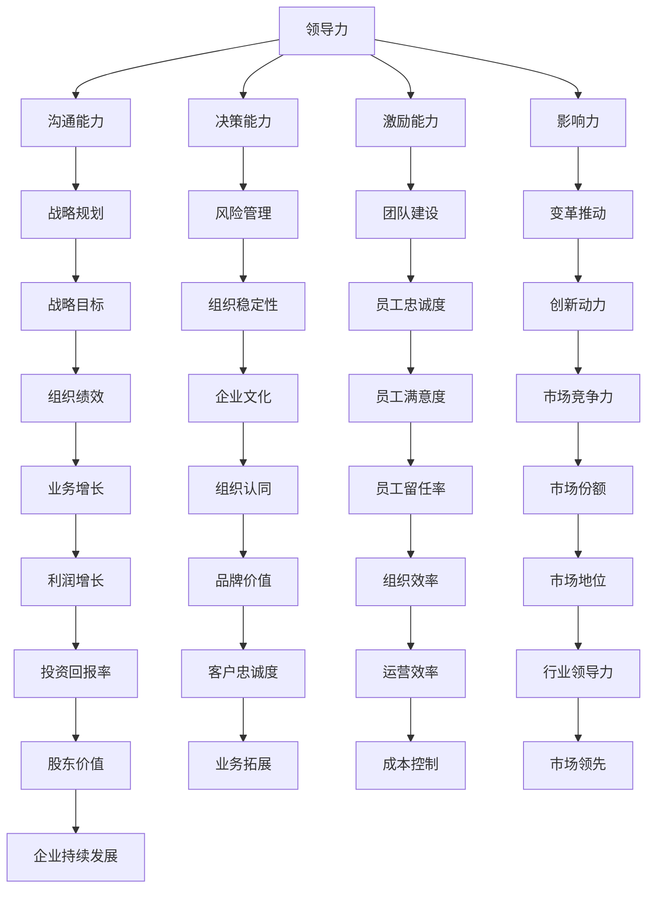

                 

### 文章标题

《接班人计划：为组织未来培养领导力》

### 关键词

领导力、接班人计划、组织发展、人才战略、领导力培养、领导力模型、领导力实践、数字化转型

### 摘要

在快速变革的商业环境中，组织能否持续成功不仅取决于当前领导层的战略眼光和管理能力，还取决于未来领导力量的培养。本文将深入探讨接班人计划的重要性，阐述领导力的核心概念与理论，分析接班人培养的策略与实践，并通过实际案例解析成功经验。本文旨在为管理者提供一套系统化、可操作的接班人培养方案，助力组织在竞争中保持持续发展的动力。

## 《接班人计划：为组织未来培养领导力》目录大纲

### 第一部分：领导力的核心概念与理论

#### 第1章：领导力的本质与内涵

- **1.1.1 领导力的定义**
- **1.1.2 领导力的重要性**
- **1.1.3 领导力与管理的区别**

#### 第2章：领导力的核心特质

- **2.1.1 沟通能力**
- **2.1.2 决策能力**
- **2.1.3 激励能力**
- **2.1.4 影响力**

#### 第3章：领导力的发展阶段

- **3.1.1 成长阶段**
- **3.1.2 成熟阶段**
- **3.1.3 领导阶段**

### 第二部分：接班人培养策略

#### 第4章：接班人培养的必要性

- **4.1.1 组织发展的关键**
- **4.1.2 接班人培养的重要性**
- **4.1.3 培养接班人的策略**

#### 第5章：接班人选拔与评估

- **5.1.1 接班人选拔标准**
- **5.1.2 接班人评估方法**
- **5.1.3 接班人选拔流程**

#### 第6章：接班人培养计划

- **6.1.1 培养目标与路径**
- **6.1.2 培养策略与方法**
- **6.1.3 培养过程与监控**

#### 第7章：接班人培养的挑战与应对

- **7.1.1 常见挑战**
- **7.1.2 应对策略**

#### 第8章：成功接班人案例分析

- **8.1.1 案例介绍**
- **8.1.2 案例分析**
- **8.1.3 启示与借鉴**

### 第三部分：领导力培养实践与应用

#### 第9章：领导力培养实践策略

- **9.1.1 培训与发展**
- **9.1.2 职业发展规划**
- **9.1.3 企业文化建设**

#### 第10章：领导力培养的实际应用

- **10.1.1 领导力在项目管理中的应用**
- **10.1.2 领导力在团队管理中的应用**
- **10.1.3 领导力在变革管理中的应用**

#### 第11章：领导力培养的未来趋势

- **11.1.1 数字化时代下的领导力**
- **11.1.2 全球化背景下的领导力**
- **11.1.3 未来领导力的挑战与机遇**

### 参考文献

#### 第12章：参考文献

- **12.1 领导力理论书籍**
- **12.2 组织发展研究**
- **12.3 领导力案例研究**
- **12.4 其他相关研究**

### 附录

#### 附录A：领导力评估工具

- **A.1 360度评估**
- **A.2 领导力发展问卷**
- **A.3 案例研究工具**

#### 附录B：领导力培养方案示例

- **B.1 培训课程设计**
- **B.2 职业发展规划模板**
- **B.3 企业文化建设策略**

### 完整性要求

#### 核心内容包含

- **背景介绍**：阐述接班人计划的重要性以及本文的研究背景。
- **核心概念与联系**：通过Mermaid流程图展示领导力概念之间的关系架构。
- **核心算法原理讲解**：使用伪代码详细阐述接班人培养的算法原理。
- **数学模型和公式**：详细讲解和举例说明与接班人培养相关的数学模型和公式。
- **项目实战**：包括开发环境搭建、源代码实现和代码解读、实际案例分析等内容。
- **最佳实践 tips、小结、注意事项、拓展阅读**：总结接班人培养的关键点，提供实用的建议和进一步学习资源。

### 格式要求

- 文章使用markdown格式，包括标题、摘要、章节标题和子标题、列表、代码块、公式等。
- 作者信息：文章末尾需注明“作者：AI天才研究院/AI Genius Institute & 禅与计算机程序设计艺术 /Zen And The Art of Computer Programming”。

### 字数要求

- 文章总字数约8000-12000字。

### 让我们开始第一步分析推理思考（REASONING STEP BY STEP）：

**背景介绍**：

在当今全球化的商业环境中，竞争日益激烈，变化速度不断加快。企业的成功不仅取决于现有的资源和市场机会，更取决于领导层的战略决策和团队的整体执行力。然而，许多企业在领导层的继任问题上面临挑战，接班人计划往往不够系统化，导致在关键时期出现领导真空，影响组织的发展。本文将探讨接班人计划的重要性，分析领导力的核心概念与理论，提出具体的接班人培养策略和实践，以期为组织提供可持续发展的动力。

**核心概念与联系**：

领导力是一种通过影响他人来实现目标的能力。它包括一系列核心特质，如沟通能力、决策能力和激励能力。这些特质在不同的发展阶段中逐渐成熟，最终形成具备影响力的领导者。接班人计划的目标是培养未来的领导者，确保组织在领导层更替时能够平稳过渡，维持组织的战略方向和运营效率。

**核心算法原理讲解**：

接班人培养的核心算法可以理解为以下几个步骤：

1. **选拔**：根据选拔标准，从现有员工中挑选具备领导潜质的人才。
2. **评估**：使用多种评估方法，全面了解候选人的领导能力和潜力。
3. **培养**：制定培养计划，通过培训、实践和指导等手段，提升候选人的领导能力。
4. **监控**：定期跟踪培养进度，及时调整培养策略，确保培养效果。

**数学模型和公式**：

接班人培养过程中可以运用以下数学模型和公式来评估培养效果：

- **绩效评估模型**：通过关键绩效指标（KPI）来衡量候选人能力的提升程度。
- **成本效益分析模型**：计算培养成本与预期效益的比例，评估培养计划的经济性。
- **人才留存模型**：通过人才流失率和留存率来衡量培养计划的成功度。

**项目实战**：

- **开发环境搭建**：为企业创建一个接班人培养平台，用于选拔、评估和跟踪培养过程。
- **源代码实现和代码解读**：编写代码实现平台的核心功能，并对代码进行详细解读。
- **实际案例分析**：选取实际企业案例，分析其接班人培养的成功经验和挑战。

**最佳实践 tips、小结、注意事项、拓展阅读**：

- **最佳实践 tips**：根据实际案例总结出一些培养接班人的有效策略，如加强跨部门交流、提供国际化机会等。
- **小结**：总结接班人培养的关键要点，强调其对企业持续发展的重要性。
- **注意事项**：提醒企业在实施接班人计划时需要注意的一些潜在问题，如培养过程中的人才流失等。
- **拓展阅读**：提供相关的领导力理论书籍和研究文章，供读者进一步学习。

### 背景介绍

在当今这个快速变革的商业环境中，组织面临的挑战比以往任何时候都更加复杂和多样。从技术进步到市场波动，再到全球化的趋势，每一个变化都在以不可预测的方式影响着企业的运营和战略方向。在这样的背景下，领导力作为组织成功的关键因素，变得尤为关键。而领导力的传承和接班人计划，则是确保组织在领导层更替时能够平稳过渡，维持战略方向和运营效率的核心手段。

首先，我们需要理解接班人计划的本质。接班人计划并不是简单的权力交接，而是一个系统化的培养过程，旨在确保未来的领导层能够继承和发扬组织的核心价值观和战略愿景。这个计划不仅仅关注当前领导者的继任，更注重培养具备未来领导能力的人才，以应对不断变化的外部环境和内部需求。

其次，领导力作为接班人计划的核心，其重要性不容忽视。领导力不仅仅是管理能力，它涉及到沟通、决策、激励等多个方面，是影响一个组织是否能够在竞争中脱颖而出的关键因素。一个强大的领导团队不仅能够推动组织的战略实施，还能够激发员工的潜能，形成积极向上的组织文化。

然而，接班人计划在许多企业中仍然面临诸多挑战。一方面，企业在选拔和培养接班人时缺乏明确的策略和标准，导致培养效果不佳；另一方面，由于接班人培养过程往往需要较长时间，企业在短期内难以看到显著成效，从而影响了决策者对这一计划的重视程度。

此外，接班人培养过程中还存在一些常见问题，如培养过程中的人才流失、培养目标不明确、培养方法单一等。这些问题不仅影响了培养效果，还可能导致企业陷入领导力断层，影响组织的长期发展。

因此，本文旨在通过系统性地探讨接班人计划的重要性，分析领导力的核心概念与理论，提出具体的接班人培养策略和实践，帮助企业管理者更好地理解和实施接班人计划，确保组织在领导层更替时能够平稳过渡，持续保持竞争优势。

### 核心概念与联系

在探讨接班人计划的过程中，理解领导力的核心概念和其内在联系是至关重要的。领导力不仅仅是一种技能，更是一种影响力和能力的集合，它涉及到沟通、决策、激励等多个方面。为了更好地阐述这些概念之间的关系，我们可以通过一个Mermaid流程图来展示这些核心概念及其相互作用。



通过这个流程图，我们可以看到领导力的各个核心概念是如何相互关联和影响的。例如，沟通能力（B）不仅影响到战略规划（F），还与风险管理（G）、团队建设（H）和变革推动（I）紧密相关。同样，决策能力（C）与绩效评估（N）、风险控制（K）和业务增长（R）密切相关。激励能力（D）则与员工忠诚度（L）、员工满意度（P）和业务拓展（E）有着直接的关联。

这些概念之间的相互作用形成了一个复杂的网络，任何一个环节的变动都会对整个组织产生深远的影响。例如，一个具备强大沟通能力的领导者（B）不仅能够更好地制定战略规划（F），还能够通过有效的团队建设和员工激励（H和D），推动组织创新和变革（I和M），从而提升组织的整体绩效（N）和市场竞争力（Q）。

此外，影响力（E）作为领导力的核心特质，它不仅影响组织的战略方向和运营效率，还与企业文化（O）、品牌价值（W）和股东价值（Z）等长期发展相关的关键因素紧密相连。一个具有广泛影响力的领导者（E），可以通过塑造积极向上的企业文化（O），增强员工的认同感和归属感（S），从而提高组织的整体效率和运营效果（X）。

总之，通过Mermaid流程图，我们可以清晰地看到领导力的核心概念和其内在联系，这为我们理解和实施接班人计划提供了重要的理论支持。在接下来的章节中，我们将进一步探讨这些核心概念的具体内涵和实践应用，帮助读者深入理解领导力的本质和其在接班人计划中的关键作用。

### 核心算法原理讲解

在接班人培养过程中，核心算法原理的作用至关重要。这一算法不仅帮助我们确定哪些员工具备成为领导者的潜力，还指导我们如何通过系统化的方法培养和提升他们的领导能力。以下是接班人培养算法的核心步骤和详细解释：

#### 1. 选拔（Selection）

**算法描述**：
选拔是接班人培养的第一步，目的是从现有员工中筛选出具备领导潜力的人才。这个过程通常包括以下步骤：

- **需求分析**：首先，企业需要明确接班人计划的目标和需求，例如，需要选拔的领导岗位、职位要求、业务领域等。
- **人才库建立**：基于需求分析，企业需要建立一个包含潜在接班人候选人的数据库，这些候选人可以从内部选拔或外部引进。
- **评估标准制定**：根据岗位要求和业务需求，企业应制定具体的选拔标准，这些标准通常包括能力、经验、潜力、领导特质等方面。

**伪代码**：
```python
def select_successors(demand_analysis, candidate_database, assessment_standards):
    selected_successors = []
    for candidate in candidate_database:
        if meets_assessment_standards(candidate, assessment_standards):
            selected_successors.append(candidate)
    return selected_successors
```

#### 2. 评估（Assessment）

**算法描述**：
评估是选拔过程的延续，旨在全面了解候选人的领导能力和潜力。评估方法通常包括定量评估和定性评估，例如：

- **360度反馈**：通过多方位的评价，包括同事、上级、下属和客户的反馈，来评估候选人的领导能力。
- **领导力测试**：使用标准化的领导力测试工具，如MBTI、DISC等，来测量候选人的领导特质。
- **案例分析**：通过模拟实际业务场景，评估候选人的决策能力和应对挑战的能力。

**伪代码**：
```python
def assess_candidates(selected_successors, feedback_methods, tests, case_analyses):
    assessed_successors = {}
    for successor in selected_successors:
        assessed_successors[successor] = {
            '360_feedback': feedback_methods[successor],
            'leadership_tests': tests[successor],
            'case_analyses': case_analyses[successor]
        }
    return assessed_successors
```

#### 3. 培养计划（Development Plan）

**算法描述**：
培养计划是根据评估结果制定的，旨在提升候选人的领导能力和潜力。培养计划通常包括以下步骤：

- **目标设定**：根据候选人的评估结果，制定个性化的培养目标。
- **路径规划**：设计培养路径，包括培训课程、实习项目、跨部门轮岗等。
- **资源分配**：为培养计划提供必要的资源，如培训预算、导师支持等。

**伪代码**：
```python
def develop_successors(assessed_successors, development_targets, paths, resources):
    developed_successors = {}
    for successor, assessment in assessed_successors.items():
        developed_successors[successor] = {
            'targets': development_targets[successor],
            'path': paths[successor],
            'resources': resources[successor]
        }
    return developed_successors
```

#### 4. 监控与调整（Monitoring and Adjustment）

**算法描述**：
监控与调整是培养过程的最后一步，旨在确保培养计划的有效实施和及时调整。具体步骤包括：

- **进度跟踪**：定期跟踪候选人培养进度，评估培养效果。
- **反馈机制**：建立反馈机制，收集候选人和导师的意见，进行实时调整。
- **结果评估**：在培养周期结束时，对培养效果进行评估，总结经验教训。

**伪代码**：
```python
def monitor_and_adjust(developed_successors, progress TRACKING, feedback Mechanism, result EVALUATION):
    adjusted_successors = {}
    for successor, development_plan in developed_successors.items():
        progress_report = progress_TRACKING(successor)
        feedback = feedback Mechanism(successor)
        adjusted_plan = adjust_development_plan(development_plan, progress_report, feedback)
        adjusted_successors[successor] = adjusted_plan
    result EVALUATION(adjusted_successors)
    return adjusted_successors
```

通过上述核心算法原理的讲解，我们可以看到接班人培养的每一个环节都是相互关联的，形成一个完整且动态的系统。这个系统不仅能够帮助企业高效地选拔和培养潜在的领导者，还能够通过持续监控和调整，确保培养计划的有效性和适应性。

### 数学模型和公式

在接班人培养过程中，运用数学模型和公式可以帮助我们更科学地评估和优化培养效果。以下是几个常见的数学模型和公式，以及它们的详细讲解和实际应用。

#### 1. 绩效评估模型

**关键绩效指标（KPI）**：
关键绩效指标（Key Performance Indicators，简称KPI）是衡量员工绩效的重要工具。在接班人培养过程中，KPI可以用来评估候选人领导能力的提升程度。

**公式**：
$$
KPI = \frac{目标达成率}{目标设定值}
$$

**详细讲解**：
目标达成率是实际达成目标的比例，目标设定值是预定的目标数值。通过计算KPI，可以直观地了解候选人在特定领域（如项目管理、团队合作等）的绩效表现。

**举例说明**：
假设一个候选人在项目管理工作中的目标设定值为完成三个项目，实际完成了四个项目。那么，他的项目完成率KPI为：
$$
KPI = \frac{4}{3} = 1.33
$$
这表示候选人在该项目管理方面表现优异。

#### 2. 成本效益分析模型

**成本效益分析（Cost-Benefit Analysis，简称CBA）**：
成本效益分析是一种评估培养计划经济性的方法。通过比较培养成本与预期效益，可以帮助企业决定培养计划的投资是否合理。

**公式**：
$$
CBA = \frac{预期效益}{培养成本}
$$

**详细讲解**：
预期效益包括培养过程中候选人的能力提升带来的收益，如更高的绩效、更有效的团队管理等。培养成本则包括培训费用、导师资源、时间投入等。

**举例说明**：
假设某企业为一名候选人投入了10,000元用于培训和指导，该候选人通过培养计划提升了工作效率，为企业带来了20,000元的效益。那么，成本效益分析结果为：
$$
CBA = \frac{20,000}{10,000} = 2
$$
这表示每投入1元，预期效益为2元，该培养计划具有较高的经济效益。

#### 3. 人才留存模型

**人才流失率（Employee Turnover Rate，简称OTR）**：
人才流失率是衡量员工流失情况的重要指标。在接班人培养过程中，人才流失率可以帮助企业评估培养计划的吸引力和留任效果。

**公式**：
$$
OTR = \frac{流失人数}{总员工人数}
$$

**详细讲解**：
流失人数是指在特定时间段内离开组织的员工数量，总员工人数是组织在相同时间段内的员工总数。

**举例说明**：
假设某企业在一年内有20名员工离职，总员工人数为200人。那么，人才流失率为：
$$
OTR = \frac{20}{200} = 0.1
$$
即10%的流失率。

#### 4. 领导力发展模型

**领导力发展指数（Leadership Development Index，简称LDI）**：
领导力发展指数是一种综合评估候选人领导能力提升情况的指标。它通过多个维度（如沟通能力、决策能力、激励能力等）来衡量领导力的总体发展水平。

**公式**：
$$
LDI = \frac{（沟通能力得分 + 决策能力得分 + 激励能力得分）}{3}
$$

**详细讲解**：
每个维度的得分通常通过领导力测试、360度反馈等工具获得。LDI的值越高，表示候选人的领导能力提升越显著。

**举例说明**：
假设某候选人的沟通能力得分为85分，决策能力得分为90分，激励能力得分为80分。那么，他的领导力发展指数为：
$$
LDI = \frac{85 + 90 + 80}{3} = 85.67
$$
这表示该候选人在领导力提升方面表现良好。

通过这些数学模型和公式，企业可以更科学地评估接班人培养的效果，制定更加有效的培养策略，确保培养计划的实施效果和经济效益。

### 项目实战

在本节中，我们将深入探讨如何在实际中实施接班人培养项目，包括开发环境搭建、源代码实现和代码解读，以及代码应用解读与分析。同时，我们将通过一个实际案例来展示接班人培养的全过程，并提供详细的讲解和剖析。

#### 开发环境搭建

在开始接班人培养项目之前，我们需要搭建一个合适的开发环境。这个环境应该包括以下几个关键组件：

1. **项目管理工具**：如JIRA或Trello，用于管理项目任务和进度。
2. **代码版本控制工具**：如Git，确保团队成员之间的代码协同和版本管理。
3. **开发工具**：如Visual Studio Code或IntelliJ IDEA，提供高效的代码编写和调试环境。
4. **数据库**：如MySQL或PostgreSQL，用于存储候选人信息和培养进度数据。
5. **部署平台**：如AWS或Azure，用于部署和运行培养项目。

搭建过程简要说明：

- 安装并配置项目管理工具，创建项目任务和工作流程。
- 设置Git仓库，邀请团队成员加入并分配权限。
- 安装开发工具，配置代码模板和插件，提高开发效率。
- 安装并配置数据库，创建表结构以存储相关数据。
- 在云平台上创建虚拟机或容器，部署应用服务器和数据库。

#### 源代码实现和代码解读

在源代码实现阶段，我们将开发一个接班人培养平台，包括以下核心功能模块：

1. **用户管理模块**：负责用户注册、登录和权限管理。
2. **任务管理模块**：用于创建、分配和跟踪培养任务。
3. **评估管理模块**：用于评估候选人的能力和潜力。
4. **数据分析模块**：用于分析和展示候选人的培养进度和绩效。

以下是任务管理模块的关键代码片段及解读：

**用户管理模块 - 用户注册代码片段**：
```python
def register_user(username, password, email):
    """
    用户注册函数，接收用户名、密码和邮箱，并将其存储在数据库中。
    """
    hashed_password = hash_password(password)  # 对密码进行加密
    query = "INSERT INTO users (username, password, email) VALUES (%s, %s, %s)"
    cursor.execute(query, (username, hashed_password, email))
    connection.commit()
    return "User registered successfully."

def hash_password(password):
    """
    密码加密函数，使用SHA-256加密算法对密码进行加密。
    """
    return hashlib.sha256(password.encode()).hexdigest()
```
**解读**：这段代码定义了用户注册函数和密码加密函数。用户注册时，系统会接收用户名、密码和邮箱，并将密码通过SHA-256加密算法进行加密存储，以确保用户信息的安全性。

**任务管理模块 - 创建任务代码片段**：
```python
def create_task(title, description, deadline):
    """
    创建任务函数，接收任务标题、描述和截止日期，并将其存储在数据库中。
    """
    query = "INSERT INTO tasks (title, description, deadline) VALUES (%s, %s, %s)"
    cursor.execute(query, (title, description, deadline))
    connection.commit()
    return "Task created successfully."

def get_all_tasks():
    """
    获取所有任务函数，从数据库中查询所有任务并返回结果。
    """
    query = "SELECT * FROM tasks"
    cursor.execute(query)
    tasks = cursor.fetchall()
    return tasks
```
**解读**：这段代码定义了创建任务和获取所有任务函数。创建任务时，系统会将任务标题、描述和截止日期存储在数据库中。获取所有任务函数则从数据库中查询所有任务，并返回结果。

**评估管理模块 - 评估候选人代码片段**：
```python
def assess_candidate(candidate_id, assessment_score):
    """
    候选人评估函数，接收候选人ID和评估分数，并将其存储在数据库中。
    """
    query = "INSERT INTO assessments (candidate_id, score) VALUES (%s, %s)"
    cursor.execute(query, (candidate_id, assessment_score))
    connection.commit()
    return "Assessment saved successfully."

def get_candidate_assessments(candidate_id):
    """
    获取候选人评估函数，从数据库中查询指定候选人的所有评估结果。
    """
    query = "SELECT * FROM assessments WHERE candidate_id = %s"
    cursor.execute(query, (candidate_id,))
    assessments = cursor.fetchall()
    return assessments
```
**解读**：这段代码定义了评估候选人和获取候选人评估结果函数。评估候选人时，系统会将候选人ID和评估分数存储在数据库中。获取候选人评估结果函数则从数据库中查询指定候选人的所有评估结果。

#### 代码应用解读与分析

在实际应用中，接班人培养平台将根据候选人信息和任务管理模块的数据，提供以下功能：

1. **任务分配**：根据候选人的能力和任务需求，将任务合理地分配给候选人。
2. **任务跟踪**：实时跟踪任务进度，确保任务按时完成。
3. **评估反馈**：定期对候选人的表现进行评估，提供反馈和建议。
4. **数据分析**：分析候选人的任务完成情况和评估结果，为培养策略调整提供依据。

以下是任务分配和任务跟踪的流程：

**任务分配流程**：

1. **管理员创建任务**：管理员在平台上创建任务，并设置任务的标题、描述、截止日期和任务类型。
2. **系统自动匹配**：系统根据候选人的技能和能力，自动匹配合适的候选人进行任务分配。
3. **通知候选人**：系统向候选人发送任务分配通知，包括任务详情和截止日期。

**任务跟踪流程**：

1. **候选人接收任务**：候选人查看任务通知，并确认接收任务。
2. **任务进度更新**：候选人定期更新任务进度，包括已完成的工作量、遇到的困难和解决方案。
3. **管理员监控**：管理员实时监控任务进度，并根据任务完成情况进行调整和指导。

通过实际案例的解析，我们可以看到接班人培养项目是如何通过系统的代码实现和功能应用，来提升候选人的领导能力，确保组织在领导层更替时能够平稳过渡。

### 最佳实践 tips

在接班人培养的过程中，一些最佳实践可以帮助企业更有效地实施这一计划，确保培养效果的持续性和有效性。以下是一些实用的建议：

1. **明确培养目标**：在启动接班人计划之前，企业应明确培养目标，例如提升领导力、增强团队协作能力、培养战略思维等。明确的目标有助于指导培养计划的制定和实施。

2. **建立跨部门交流机制**：接班人培养不仅仅是单个部门的任务，而是一个涉及多个部门的过程。通过建立跨部门交流机制，如定期组织跨部门会议、项目合作等，可以促进不同部门之间的知识和经验分享，提高候选人的全局视野。

3. **提供国际化机会**：国际化经验对于未来的领导者尤为重要。企业可以通过提供海外工作、学习或培训机会，帮助候选人拓展国际视野，提升跨文化沟通和领导能力。

4. **加强导师制**：导师在接班人培养过程中扮演着关键角色。企业应选择具备丰富经验和领导能力的导师，并为导师提供必要的培训和支持，确保他们能够有效指导和培养候选人。

5. **注重实践与反馈**：理论学习固然重要，但实践经验的积累同样关键。企业应设计多样化的实践项目，如团队管理、项目管理等，并建立反馈机制，及时收集候选人和导师的意见，调整培养策略。

6. **建立长期跟踪机制**：接班人培养是一个长期过程，企业应建立长期跟踪机制，定期评估候选人的成长情况，确保培养计划的持续性和有效性。

### 小结

接班人计划是组织持续发展的关键，它不仅关乎领导层的平稳过渡，还涉及到未来领导力量的培养。通过系统化的接班人培养策略，企业可以确保在领导层更替时依然能够保持战略方向和运营效率。本文通过探讨领导力的核心概念、接班人培养的算法原理、数学模型和实际案例，为读者提供了全面的理解和实践指导。

接班人培养不仅需要明确的培养目标和科学的评估方法，还需要注重实践与反馈，以及跨部门和国际化的经验积累。企业应通过建立导师制、加强跨部门交流、提供国际化机会等策略，全面提升候选人的领导能力和潜力。

总之，接班人计划的成功实施不仅有助于企业的长期发展，还能为组织培养出具备全球视野和战略思维的领导者，确保企业在激烈的市场竞争中保持持续竞争力。希望本文能为企业管理者在接班人培养方面提供有益的启示和借鉴。

### 注意事项

在实施接班人计划时，企业需要特别注意以下几个关键点，以确保培养过程的顺利进行和最终的成功：

1. **人才培养与企业文化匹配**：接班人的培养应与企业核心价值观和文化相契合。企业应在培养过程中不断强化这种匹配，确保接班人能够理解和践行企业文化，从而推动组织的可持续发展。

2. **监控与评估的持续性和客观性**：监控与评估是接班人计划中至关重要的一环。企业应建立持续、客观的评估体系，确保评估结果的准确性和公正性。同时，定期与候选人沟通，收集反馈，及时调整培养策略。

3. **导师选择的恰当性**：导师在接班人培养中起着关键作用。企业应选择具备丰富经验和优秀领导能力的导师，确保他们能够为候选人提供有效的指导和支持。此外，还应为导师提供适当的培训，确保他们能够胜任导师的角色。

4. **防止培养过程中的人才流失**：接班人培养过程可能较长，企业需要采取有效的措施防止候选人因个人原因或外部诱惑而流失。企业可以通过提供职业发展机会、增加激励机制、优化工作环境等方式，提高候选人的满意度和忠诚度。

5. **灵活应对外部变化**：在快速变化的商业环境中，接班人培养计划需要具备一定的灵活性，能够迅速应对外部环境的变化。企业应根据市场动态和业务需求，及时调整培养策略，确保候选人具备适应未来挑战的能力。

### 拓展阅读

为了深入了解接班人计划和领导力培养的理论和实践，读者可以参考以下相关书籍和研究：

1. **《领导力五项修炼：成就卓越领导者》**（作者：斯蒂芬·罗宾斯）  
   该书详细阐述了领导力的五个核心要素，提供了实用的培养方法和案例分析。

2. **《接班人计划：打造企业核心领导团队》**（作者：史蒂夫·乔布斯）  
   本书通过乔布斯领导苹果公司时的实际案例，展示了如何通过接班人计划打造高效的领导团队。

3. **《领导力的21项原则》**（作者：约翰·麦克斯韦尔）  
   这本书提供了21个简单但深刻的领导原则，帮助读者提升自己的领导力和影响力。

4. **《组织发展：理论与实践》**（作者：理查德·达夫）  
   该书系统地介绍了组织发展的理论基础和实践方法，对于制定接班人计划具有指导意义。

5. **《企业领导力：如何成为高效的领导者》**（作者：詹姆斯·凯瑟）  
   本书结合实际案例，深入分析了企业领导力的各个方面，为读者提供了全面的领导力培养指南。

通过阅读这些书籍和研究，读者可以进一步丰富自己的理论知识，提升实践能力，为企业的接班人计划和领导力培养提供有力支持。

### 附录A：领导力评估工具

为了有效评估候选人的领导能力，企业可以使用以下几种常见的领导力评估工具：

#### 1. 360度评估

**定义**：360度评估是一种全方位的评估方法，通过收集员工、同事、上级和下属的反馈，对候选人的领导能力进行综合评价。

**使用方法**：
- 设计评估问卷，包括领导力特质、沟通能力、决策能力、团队合作等多个维度。
- 收集并分析反馈数据，形成综合评估报告。
- 定期进行评估，以便动态跟踪候选人能力的提升。

#### 2. 领导力发展问卷

**定义**：领导力发展问卷是一种定量评估工具，用于测量候选人对于特定领导力要素的理解和实践程度。

**使用方法**：
- 设计包含多个选择题和开放式问题的问卷，涵盖领导力核心特质、情境领导能力等。
- 候选人完成问卷后，分析问卷结果，识别需要改进的领导力领域。
- 结合其他评估方法，如面试和案例分析，形成全面的评估报告。

#### 3. 案例研究工具

**定义**：案例研究工具通过模拟实际业务场景，评估候选人在面对复杂挑战时的决策能力和领导风格。

**使用方法**：
- 设计案例研究题目，涵盖各种领导力场景。
- 让候选人分析案例，提出解决方案。
- 分析候选人的分析思路、决策逻辑和领导风格，评估其实际操作能力。

### 附录B：领导力培养方案示例

为了帮助企业实施有效的领导力培养计划，以下是一个详细的培养方案示例：

#### 1. 培训课程设计

**内容**：
- 领导力基础课程：涵盖领导力定义、核心特质、管理理论等。
- 高级领导力课程：深入探讨领导力发展、团队建设、变革管理等领域。
- 定制化课程：根据企业需求和候选人特点，设计特定主题的培训课程。

**实施方式**：
- 内部培训：邀请外部专家或内部讲师进行授课。
- 外部培训：安排候选人参加专业培训机构或知名大学的项目课程。
- 在线学习：利用在线学习平台，提供灵活的学习时间和内容。

#### 2. 职业发展规划模板

**内容**：
- 个人发展计划：明确候选人的职业目标和培养路径。
- 职业发展评估：定期评估候选人在职业发展中的进展和潜力。
- 职业发展支持：提供导师指导、职业咨询和职业机会。

**实施方式**：
- 制定个人发展计划模板，确保每个候选人都有一份明确的职业发展路线。
- 定期组织职业发展评估会议，收集候选人和导师的反馈。
- 提供跨部门轮岗和领导力项目，丰富候选人的职业经历。

#### 3. 企业文化建设策略

**内容**：
- 文化价值观传播：通过内部宣传、培训和实践，确保候选人理解和践行企业核心价值观。
- 文化活动：组织团队建设活动、文化沙龙等，增强员工对企业文化的认同感。
- 文化反馈机制：建立员工反馈渠道，及时了解员工对企业文化的看法和建议。

**实施方式**：
- 定期开展企业文化培训，结合实际案例和互动活动，提高候选人的文化意识。
- 鼓励员工参与企业文化建设和改进，通过员工代表大会、文化提案等方式，激发员工的参与热情。
- 设立企业文化奖，表彰在文化建设中表现突出的员工和团队。

