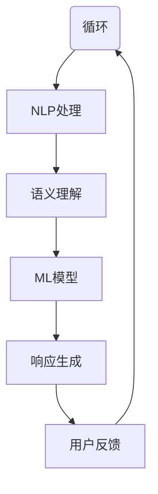
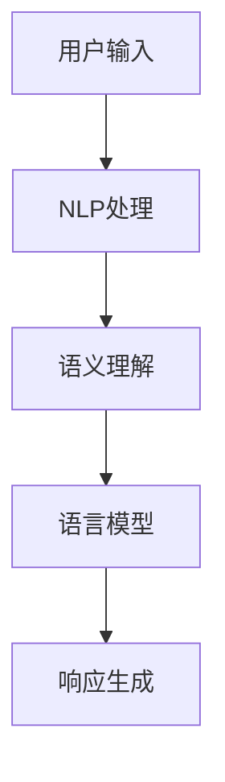

                 

### 提升AI交互质量：提示词语言的重要性

#### 关键词：
- AI交互质量
- 提示词语言
- 自然语言处理
- 机器学习
- 用户体验

#### 摘要：
本文探讨了提升AI交互质量的关键要素——提示词语言的重要性。文章首先介绍了AI交互质量的基本概念，接着定义了提示词语言，并分析了其在AI交互中的作用。随后，文章深入探讨了AI交互中的核心概念和原理，包括自然语言处理、机器学习等，并使用Mermaid流程图展示了核心概念之间的联系。文章还详细讲解了提示词语言的原理，包括语义理解和语言模型。接下来，文章讨论了设计有效提示词语言的原则和策略，并提供了实际应用案例分析。最后，文章探讨了提示词语言优化的方法和工具，并展望了未来的发展趋势。

---

## 引言：AI交互质量的重要性

在人工智能（AI）迅猛发展的今天，AI交互已经成为人们日常生活和工作中不可或缺的一部分。从智能客服到智能语音助手，从在线教育到智能医疗，AI交互在各个领域发挥着重要作用。然而，AI交互质量的高低直接决定了用户体验的优劣，因此提升AI交互质量成为一个亟待解决的问题。

AI交互质量是指用户在使用AI系统时获得的整体体验，包括系统的响应速度、准确性、自然性、易用性等方面。高质量的AI交互能够提高用户的满意度和忠诚度，进而促进业务的发展。相反，低质量的AI交互可能会导致用户沮丧、失望甚至放弃使用AI系统。

在AI交互中，提示词语言起着至关重要的作用。提示词语言是用户与AI系统进行交互的主要媒介，它直接影响着AI交互的质量。有效的提示词语言能够帮助用户更方便地表达需求，同时让AI系统更准确地理解和响应。因此，理解和设计高质量的提示词语言对于提升AI交互质量至关重要。

本文将首先介绍AI交互质量的重要性，然后定义提示词语言，并详细探讨其在AI交互中的作用。接下来，我们将深入分析AI交互中的核心概念和原理，包括自然语言处理、机器学习等。在此基础上，我们将讲解提示词语言的原理，包括语义理解和语言模型。随后，文章将讨论如何设计有效的提示词语言，并分享实际应用案例分析。最后，我们将探讨提示词语言优化的方法和工具，并展望未来的发展趋势。

## 核心概念与联系

在探讨AI交互质量之前，我们有必要理解一些核心概念和原理，这些概念构成了AI交互的基础。以下是几个关键概念及其相互之间的联系：

### 自然语言处理（NLP）

自然语言处理是人工智能的一个重要分支，旨在使计算机能够理解、解释和生成人类语言。NLP涉及多种技术，包括语言模型、词汇分析、句法分析、语义分析和情感分析等。

- **语言模型**：语言模型是NLP的核心，它能够预测文本的下一个词或句子。例如，一个简单的语言模型可以基于统计方法，如n-gram模型，来预测下一个单词。
- **词汇分析**：词汇分析涉及对文本中的词汇进行解析和分类，包括词性标注、词义消歧等。
- **句法分析**：句法分析关注文本的结构，通过构建语法树来表示句子中的词汇关系。这种分析对于理解句子的结构和含义至关重要。
- **语义分析**：语义分析旨在理解文本的意义，包括实体识别、关系提取和语义角色标注等。这有助于AI系统更准确地理解用户的需求。
- **情感分析**：情感分析用于识别文本中的情感倾向，如正面、负面或中立。这对于提供个性化服务、推荐系统和用户体验分析具有重要意义。

### 机器学习（ML）

机器学习是AI的基础技术之一，它使计算机能够通过数据和经验进行学习，从而实现自动化决策和预测。机器学习在NLP中发挥着重要作用，特别是深度学习技术，如神经网络和卷积神经网络。

- **监督学习**：监督学习是一种常见的机器学习方法，它使用标注数据来训练模型，从而学习输入和输出之间的关系。
- **无监督学习**：无监督学习旨在发现数据中的模式和结构，而不需要预先标注的数据。这在词汇分析、情感分析和聚类任务中非常有用。
- **强化学习**：强化学习是一种通过试错来学习最佳策略的方法。在AI交互中，强化学习可以用于优化交互策略，以提高用户体验。

### AI交互与NLP/ML的关系

AI交互是NLP和ML技术的实际应用场景。在AI交互中，NLP和ML技术共同发挥作用：

- **输入理解**：用户通过文本或语音与AI系统进行交互，NLP技术用于理解用户的输入，如提取关键词、句法分析和语义理解。
- **响应生成**：基于理解的用户输入，ML技术，尤其是深度学习，用于生成适当的响应。这包括语言模型生成文本、生成式对话系统等。

### Mermaid流程图

为了更好地展示NLP和ML在AI交互中的关系，我们可以使用Mermaid流程图来描绘这一过程：



在这个流程图中，用户输入经过NLP处理，包括词汇分析、句法分析和语义理解，然后通过ML模型生成响应。用户的反馈又回到输入阶段，形成了一个闭环系统，从而不断优化AI交互质量。

### 核心概念之间的联系

- **NLP与ML**：NLP和ML是相辅相成的。NLP提供了理解人类语言的方法，而ML则利用这些方法来学习并优化交互。
- **语义理解与语言模型**：语义理解是语言模型的基础，它使模型能够生成更准确、更自然的响应。
- **用户反馈与持续学习**：用户的反馈是AI系统不断改进的源泉，通过机器学习算法，系统可以持续优化，以提供更好的交互体验。

通过理解这些核心概念和它们之间的联系，我们可以更好地设计AI交互系统，从而提升交互质量。

## 提示词语言原理

提示词语言是用户与AI系统进行交互的重要媒介，其核心在于如何让AI系统准确理解和响应用户的输入。在这一节中，我们将深入探讨提示词语言的原理，包括语义理解和语言模型。

### 语义理解

语义理解是提示词语言的核心，它关注的是如何让AI系统准确理解用户输入的意义。语义理解涉及多个层次，包括词汇分析、句法分析和语义分析。

- **词汇分析**：词汇分析是语义理解的第一步，它涉及对输入文本中的词汇进行解析和分类。例如，词性标注可以帮助确定每个词的词性（如名词、动词、形容词等），这有助于AI系统更好地理解词汇的含义。
- **句法分析**：句法分析关注的是文本的结构，通过构建语法树来表示句子中的词汇关系。句法分析能够帮助AI系统理解句子的构成和语法规则，从而更好地理解句子的整体含义。
- **语义分析**：语义分析是语义理解的最高层次，它旨在理解文本的意义。这包括实体识别、关系提取和语义角色标注等。通过语义分析，AI系统可以更准确地理解用户的需求，从而生成更合适的响应。

### 语言模型

语言模型是提示词语言的另一个关键组成部分，它用于预测文本的下一个词或句子。语言模型通过学习大量的文本数据，可以生成自然、流畅的文本。以下是几种常见的语言模型：

- **n-gram模型**：n-gram模型是一种基于统计的模型，它将文本序列划分为n个单词的滑动窗口，并统计每个窗口出现的频率。n-gram模型简单有效，但存在一些局限性，如无法捕捉到长距离依赖关系。
- **循环神经网络（RNN）**：RNN是一种能够处理序列数据的神经网络，它能够捕捉到长距离依赖关系，从而生成更准确的文本预测。然而，RNN存在梯度消失和梯度爆炸等问题。
- **长短期记忆网络（LSTM）**：LSTM是RNN的一种变体，它通过引入门控机制来解决RNN的梯度消失问题。LSTM在处理序列数据方面表现出色，广泛应用于自然语言处理任务。
- **变换器（Transformer）**：Transformer是近年来提出的一种基于自注意力机制的深度神经网络模型，它在许多自然语言处理任务中取得了显著成绩。Transformer通过自注意力机制能够捕捉到长距离依赖关系，并且在计算效率上有很大的提升。

### 语义理解与语言模型的关系

语义理解与语言模型紧密相关，它们共同作用于提示词语言：

- **语义理解为基础**：语义理解是语言模型的基础，只有准确理解了用户输入的意义，语言模型才能生成合适的响应。
- **语言模型为工具**：语言模型是生成响应的工具，通过学习大量的文本数据，语言模型可以生成自然、流畅的文本。

### Mermaid流程图

为了更好地展示语义理解与语言模型在提示词语言中的作用，我们可以使用Mermaid流程图来描绘这一过程：



在这个流程图中，用户输入首先经过NLP处理，然后通过语义理解来提取关键信息。接下来，语言模型基于语义理解生成响应。这个过程形成了一个闭环，用户的反馈可以用于进一步优化语义理解和语言模型。

### 提示词语言的挑战

尽管提示词语言在AI交互中具有重要作用，但它也面临一些挑战：

- **语言多样性**：人类语言非常丰富多样，不同的地区、文化和背景可能会导致表达方式的不同。AI系统需要能够处理这种多样性，从而生成通用且准确的响应。
- **不确定性**：用户输入往往存在不确定性，如模糊表述、歧义等。AI系统需要具备一定的容错能力，能够处理这些不确定性，并生成合理的响应。
- **上下文依赖性**：上下文对于理解用户输入至关重要。AI系统需要能够捕捉到上下文信息，从而生成更准确、更自然的响应。

通过深入理解提示词语言的原理，包括语义理解和语言模型，我们可以更好地设计AI交互系统，从而提升交互质量。在下一节中，我们将讨论如何设计有效的提示词语言。

### 提示词语言设计

设计有效的提示词语言是提升AI交互质量的关键步骤。一个高质量的提示词语言不仅能够提高用户满意度，还能够提升AI系统的响应准确性和效率。以下是设计提示词语言的一些关键原则和策略。

#### 用户中心设计

用户中心设计是提示词语言设计的基础。这意味着在设计和优化提示词语言时，需要始终以用户的需求和体验为出发点。以下是一些具体的用户中心设计原则：

1. **简洁性**：提示词语言应尽可能简洁，避免使用复杂、冗长的表述。简洁的提示词语言更容易被用户理解和记忆。
2. **清晰性**：提示词语言应明确、具体，避免歧义和模糊性。清晰的表达有助于用户准确传达需求，同时也能提高AI系统的理解能力。
3. **一致性**：提示词语言应保持一致性，无论是术语、格式还是语气。一致性的提示词语言有助于建立用户的信任和依赖，从而提升整体用户体验。

#### 优化策略

为了设计有效的提示词语言，我们需要采取一系列优化策略，这些策略有助于提高提示词语言的性能和用户体验。以下是一些常见的优化策略：

1. **词汇丰富性**：丰富性的词汇能够增强提示词语言的灵活性和适应性。通过引入更多的词汇和表达方式，AI系统能够更全面地理解用户需求，从而生成更准确的响应。
2. **语义一致性**：语义一致性确保提示词语言在语义层面上保持一致。这意味着不同词汇和表达方式在语义上应该相互匹配，从而避免语义混淆和误解。
3. **上下文适应性**：上下文适应性是指提示词语言能够根据不同的上下文环境进行调整。这种适应性有助于AI系统在不同场景下生成更合适的响应。

#### 用户反馈机制

用户反馈是优化提示词语言的重要手段。通过收集和分析用户反馈，我们可以发现提示词语言中的不足之处，并针对性地进行改进。以下是一些用户反馈机制：

1. **实时反馈**：在用户与AI系统交互过程中，实时收集用户的反馈。这可以通过交互界面上的反馈按钮、评分系统等实现。实时反馈有助于快速识别问题，并及时进行优化。
2. **定期评估**：定期对提示词语言进行评估，分析用户满意度、响应准确性等关键指标。这种定期评估有助于发现长期存在的问题，并制定相应的改进计划。
3. **A/B测试**：通过A/B测试，我们可以比较不同提示词语言设计的性能和用户满意度。这种方法有助于找到最优的提示词语言设计，从而提升整体交互质量。

#### 实际案例

为了更好地说明提示词语言设计原则和策略的实际应用，我们可以通过一个实际案例进行分析。

**案例：智能客服系统**

智能客服系统是一个典型的AI交互场景，其提示词语言设计对于用户体验至关重要。以下是一个基于用户中心设计的提示词语言设计案例：

1. **简洁性**：智能客服系统中的提示词语言应简洁明了。例如，当用户询问产品价格时，系统可以使用简单的回答：“产品价格是XX元。”这样的回答直接、清晰，用户容易理解。
2. **清晰性**：确保提示词语言的清晰性。例如，当用户询问产品的配送时间时，系统应明确回答：“预计3-5个工作日内送达。”这种具体的回答有助于用户了解配送时间，从而提高满意度。
3. **一致性**：智能客服系统中的提示词语言应保持一致性。例如，无论用户通过哪种渠道（电话、邮件、在线聊天）咨询同一问题，系统应使用相同的术语和表述方式，从而建立用户的信任感。

通过以上案例，我们可以看到用户中心设计原则在实际中的应用。这些原则和策略不仅有助于提升用户体验，还有助于优化AI系统的性能。

总之，设计有效的提示词语言需要综合考虑用户需求、优化策略和用户反馈。通过这些原则和策略，我们可以创建高质量的提示词语言，从而提升AI交互质量。在下一节中，我们将探讨实际应用案例分析，以进一步展示如何提升AI交互质量。

### 实际应用案例分析

在实际应用中，提升AI交互质量的关键在于如何将理论付诸实践。以下是几个实际应用案例分析，通过这些案例，我们将探讨如何通过优化提示词语言来提升AI交互质量。

#### 案例一：智能客服系统

智能客服系统是AI交互的重要应用场景之一，其服务质量直接影响到用户满意度和公司形象。以下是一个智能客服系统优化提示词语言的案例分析：

**背景**：
某电商公司希望通过智能客服系统为用户提供即时、准确的客户服务。然而，现有的智能客服系统在处理用户咨询时，存在响应延迟和回答不准确的问题。

**优化方案**：
1. **词汇丰富性**：在智能客服系统中引入了更多的词汇和表达方式，以增强系统的灵活性和适应性。例如，当用户询问产品配送时间时，系统可以回答：“预计配送时间为3-5个工作日。”或“您的订单将在3至5个工作日内送达。”这种丰富的词汇表达使得用户能够更容易理解系统回答。
2. **语义一致性**：优化了系统的语义一致性，确保不同情境下的回答保持一致。例如，当用户询问退款政策时，系统始终使用相同的术语和表述方式，从而提高用户信任感。
3. **上下文适应性**：通过上下文分析，智能客服系统能够根据用户的提问上下文生成更合适的回答。例如，当用户连续提问两个相关问题时，系统可以主动提供连贯的回答，而不是逐个回答。

**结果评估**：
经过优化后，智能客服系统的用户满意度显著提升。用户反馈表明，系统的回答更加准确、清晰，用户咨询问题的解决效率也提高了。

#### 案例二：智能语音助手

智能语音助手是另一个常见的AI交互应用，其用户体验直接影响用户的依赖程度。以下是一个智能语音助手优化提示词语言的案例分析：

**背景**：
某科技公司的智能语音助手在用户使用过程中，存在回答模糊、不准确的问题，影响了用户的体验。

**优化方案**：
1. **语义理解**：引入了更先进的自然语言处理技术，如变换器（Transformer），以提高系统的语义理解能力。例如，当用户询问“明天的天气如何？”时，系统能够准确理解用户的意图，并提供详细的天气信息。
2. **用户反馈机制**：通过用户反馈机制，系统可以收集用户的反馈，并根据反馈进行自我优化。例如，当用户对某个回答不满意时，系统可以记录并改进类似问题的回答。
3. **多轮对话**：优化了多轮对话能力，使得用户可以更自然地与系统进行交互。例如，用户可以连续提出多个相关问题，系统可以自动连接这些问题，并提供连贯的回答。

**结果评估**：
经过优化后，智能语音助手的准确性和用户满意度显著提升。用户反馈表明，系统的回答更加准确、自然，用户与系统的交互体验也得到了改善。

#### 案例三：在线教育平台

在线教育平台中的智能问答系统是一个复杂的AI交互场景。以下是一个在线教育平台智能问答系统优化提示词语言的案例分析：

**背景**：
某在线教育平台的智能问答系统在处理用户问题时，存在回答不准确、不相关的问题。

**优化方案**：
1. **知识库构建**：构建了一个丰富的知识库，涵盖课程内容、常见问题及其答案。例如，当用户询问某个具体知识点时，系统可以从知识库中快速检索到相关答案。
2. **语义匹配**：通过语义匹配技术，系统可以更好地理解用户的问题，并从知识库中检索最相关的答案。例如，当用户使用不同的词汇表达相同的问题时，系统可以识别并生成一致的答案。
3. **个性化推荐**：基于用户的学习历史和行为数据，系统可以提供个性化的回答和建议。例如，当用户询问某个知识点时，系统可以推荐相关的学习资源和扩展问题。

**结果评估**：
经过优化后，智能问答系统的回答准确性显著提升，用户满意度也显著提高。用户反馈表明，系统的回答更加准确、相关，有助于用户更好地理解和掌握课程内容。

通过以上实际应用案例分析，我们可以看到，优化提示词语言对于提升AI交互质量具有重要意义。无论是智能客服系统、智能语音助手还是在线教育平台，有效的提示词语言设计都能够显著改善用户体验，提升系统性能。

在下一节中，我们将进一步探讨如何优化提示词语言，以进一步提升AI交互质量。

### 提示词语言优化

优化提示词语言是提升AI交互质量的关键步骤。有效的优化方法不仅能够提高AI系统的响应准确性，还能改善用户体验。以下是一些常见的提示词语言优化方法和工具。

#### 数据预处理

数据预处理是提示词语言优化的第一步，它涉及数据清洗、标注和转换等操作。以下是一些具体的数据预处理方法：

1. **数据清洗**：去除文本中的噪声数据，如标点符号、HTML标签、停用词等。这有助于提高后续分析的质量。
2. **词干提取**：将文本中的单词还原为其基本形式，如“running”还原为“run”。词干提取有助于减少词汇数量，提高模型性能。
3. **词嵌入**：将文本中的单词转换为向量表示。常见的词嵌入方法包括Word2Vec、GloVe和BERT等。词嵌入使得文本数据能够在机器学习模型中有效表示。

#### 特征工程

特征工程是优化提示词语言的重要环节，它通过构建和选择有效的特征来提高模型性能。以下是一些常见的特征工程方法：

1. **文本特征**：提取文本中的词汇、句法结构和语义信息。例如，词频、词性标注、句法依赖关系等。这些特征有助于模型更好地理解文本含义。
2. **上下文特征**：捕捉文本中的上下文信息，如位置信息、实体关系等。上下文特征有助于模型在不同情境下生成更准确的响应。
3. **用户行为特征**：基于用户的历史行为数据，如搜索记录、交互日志等，构建用户特征。这些特征有助于个性化推荐和响应生成。

#### 模型选择与调优

选择合适的模型并进行调优是提升提示词语言性能的关键。以下是一些常见的模型和调优方法：

1. **传统模型**：如朴素贝叶斯、支持向量机（SVM）和决策树等。这些模型简单易用，但可能在复杂任务上表现不佳。
2. **深度学习模型**：如循环神经网络（RNN）、长短期记忆网络（LSTM）和变换器（Transformer）等。这些模型能够捕捉到文本中的长距离依赖关系，从而生成更准确的响应。
3. **模型调优**：通过调整模型参数和超参数，如学习率、批次大小和正则化项等，来优化模型性能。常用的调优方法包括网格搜索、随机搜索和贝叶斯优化等。

#### 工具和库

以下是一些常用的提示词语言优化工具和库：

1. **NLTK**：一个广泛使用的自然语言处理库，提供了一系列文本处理和语义分析工具。
2. **spaCy**：一个高效的NLP库，支持多种语言的文本处理和实体识别。
3. **TensorFlow和PyTorch**：两个流行的深度学习框架，支持构建和训练各种NLP模型。
4. **BERT和GPT**：两个先进的预训练语言模型，广泛应用于各种NLP任务。

#### 实际应用示例

以下是一个简单的提示词语言优化示例，使用PyTorch和BERT模型进行文本分类任务：

```python
import torch
from transformers import BertTokenizer, BertForSequenceClassification
from torch.optim import Adam

# 加载预训练的BERT模型和tokenizer
tokenizer = BertTokenizer.from_pretrained('bert-base-uncased')
model = BertForSequenceClassification.from_pretrained('bert-base-uncased')

# 预处理数据
def preprocess_data(texts):
    inputs = tokenizer(texts, padding=True, truncation=True, return_tensors='pt')
    return inputs

# 训练模型
def train_model(model, train_dataloader, optimizer, num_epochs):
    model.train()
    for epoch in range(num_epochs):
        for batch in train_dataloader:
            inputs = preprocess_data(batch['text'])
            labels = batch['label']
            optimizer.zero_grad()
            outputs = model(**inputs, labels=labels)
            loss = outputs.loss
            loss.backward()
            optimizer.step()
            print(f"Epoch {epoch+1}/{num_epochs}, Loss: {loss.item()}")

# 搭建训练数据加载器
train_data = [...]  # 填充实际训练数据
train_dataloader = DataLoader(train_data, batch_size=16, shuffle=True)

# 设置模型优化器
optimizer = Adam(model.parameters(), lr=1e-5)

# 开始训练
train_model(model, train_dataloader, optimizer, num_epochs=3)

# 评估模型
def evaluate_model(model, val_dataloader):
    model.eval()
    with torch.no_grad():
        correct = 0
        total = 0
        for batch in val_dataloader:
            inputs = preprocess_data(batch['text'])
            labels = batch['label']
            outputs = model(**inputs)
            _, predicted = torch.max(outputs, 1)
            total += labels.size(0)
            correct += (predicted == labels).sum().item()
    print(f"Accuracy: {100 * correct / total}%")

evaluate_model(model, val_dataloader)
```

通过以上示例，我们可以看到如何使用PyTorch和BERT模型进行文本分类任务的提示词语言优化。这只是一个简单的示例，实际应用中可能需要更复杂的模型和优化策略。

总之，提示词语言优化是提升AI交互质量的关键步骤。通过数据预处理、特征工程、模型选择与调优以及实际应用示例，我们可以有效优化提示词语言，从而提高AI交互系统的性能和用户体验。

### 未来发展趋势

随着人工智能技术的不断进步，提示词语言在AI交互中的应用也呈现出新的发展趋势。以下是一些未来的发展方向和可能的技术突破：

#### 1. 多模态交互

传统的AI交互主要依赖于文本输入和输出，但随着多模态交互技术的发展，未来的AI系统将能够处理和生成多种类型的媒体，如语音、图像、视频和文本。多模态交互将使AI系统能够更自然地理解用户的意图，提供更丰富的交互体验。例如，一个结合语音识别和图像识别的智能助手可以更准确地理解用户的指令，并在对话中引入视觉元素，从而提高交互的自然性和流畅性。

#### 2. 个性化交互

未来的AI交互系统将更加注重个性化服务。通过深度学习技术和大数据分析，AI系统可以更好地理解用户的历史行为和偏好，从而提供个性化的推荐和响应。个性化的交互体验将有助于提升用户的满意度和忠诚度，为企业带来更高的商业价值。

#### 3. 零样本学习

零样本学习是一种新兴的AI技术，它允许模型在没有相关训练数据的情况下处理新类别的输入。在AI交互中，零样本学习可以帮助系统更灵活地应对未预见的用户输入。例如，当一个用户使用从未见过的词汇或短语时，AI系统可以利用零样本学习技术生成合理的响应，从而提升交互的质量。

#### 4. 上下文感知交互

上下文感知交互是指AI系统能够根据用户的当前情境和上下文信息进行交互。未来的AI系统将更加注重上下文感知，从而生成更相关、更自然的响应。例如，一个智能语音助手可以根据用户的地理位置、时间偏好和过去的行为记录，提供个性化的服务和建议。

#### 5. 伦理和隐私保护

随着AI交互的普及，伦理和隐私保护成为重要的议题。未来的AI交互系统将更加注重用户隐私保护，采用加密技术、匿名化处理和隐私增强技术，确保用户数据的安全性和隐私性。同时，AI系统将遵循伦理准则，避免歧视、偏见和不公平的行为，提供公平、公正的交互体验。

#### 6. 模型压缩和低延迟

在移动设备和嵌入式系统中，模型压缩和低延迟是关键挑战。未来的AI交互系统将采用模型压缩技术，如量化、剪枝和知识蒸馏，以减小模型的体积并降低计算复杂度。同时，通过优化算法和硬件加速，AI系统可以实现低延迟的交互，从而提供更流畅的用户体验。

#### 7. 跨语言交互

跨语言交互是AI交互领域的一个重要研究方向。未来的AI交互系统将能够处理多种语言的输入和输出，实现无缝的跨语言交互。通过翻译模型、多语言嵌入和跨语言注意力机制等技术，AI系统将能够理解和使用多种语言，从而打破语言障碍，促进全球交流和合作。

总之，未来的AI交互将更加智能、个性化、多模态、上下文感知、伦理和隐私保护。随着这些技术的发展，提示词语言在AI交互中的作用将更加重要，为用户带来更优质的交互体验。

### 附录

#### 附录A：参考资源

- **论文和书籍**
  - [Jurafsky, D., & Martin, J. H. (2008). Speech and Language Processing. Prentice Hall.](https://web.stanford.edu/~jurafsky/slp3/)
  - [Goodfellow, I., Bengio, Y., & Courville, A. (2016). Deep Learning. MIT Press.](https://www.deeplearningbook.org/)

- **开源项目和工具**
  - [NLTK (自然语言处理工具包)](https://www.nltk.org/)
  - [spaCy (高效自然语言处理库)](https://spacy.io/)
  - [TensorFlow (谷歌的开源机器学习框架)](https://www.tensorflow.org/)
  - [PyTorch (开源深度学习库)](https://pytorch.org/)

- **学术组织和会议**
  - [ACL (国际计算语言学协会)](https://www.aclweb.org/)
  - [NeurIPS (神经信息处理系统大会)](https://nips.cc/)
  - [ICML (国际机器学习会议)](https://icml.cc/)
  - [ACL (国际计算语言学会议)](https://www.aclweb.org/anthology/)

通过这些参考资源，读者可以进一步深入了解AI交互和提示词语言领域的最新研究成果和技术进展。

### 总结

提升AI交互质量是现代人工智能发展的关键挑战之一。通过深入理解提示词语言的重要性，我们能够设计出更加智能、自然和高效的交互系统。本文从多个角度探讨了提升AI交互质量的策略，包括核心概念与联系、提示词语言原理、设计原则、实际应用案例和优化方法。此外，我们还展望了未来发展趋势，如多模态交互、个性化交互和跨语言交互等。

提示词语言作为用户与AI系统进行交互的主要媒介，其质量直接影响用户体验。有效的提示词语言设计应遵循用户中心设计原则，如简洁性、清晰性和一致性，同时结合语义理解和语言模型技术，确保AI系统能够准确理解和响应用户需求。

在未来的发展中，随着人工智能技术的不断进步，提示词语言将发挥更加重要的作用。多模态交互、零样本学习和上下文感知交互等新兴技术将为AI交互带来更多可能性。同时，伦理和隐私保护也将成为AI交互的重要议题，确保用户数据的安全和隐私。

总之，通过不断优化提示词语言，我们可以显著提升AI交互质量，为用户带来更加自然、高效和愉悦的交互体验。这不仅是技术发展的需要，也是提升用户满意度和竞争力的关键。让我们共同迎接AI交互的挑战，不断推动人工智能技术的进步。

---

**作者：AI天才研究院/AI Genius Institute & 禅与计算机程序设计艺术 /Zen And The Art of Computer Programming**

