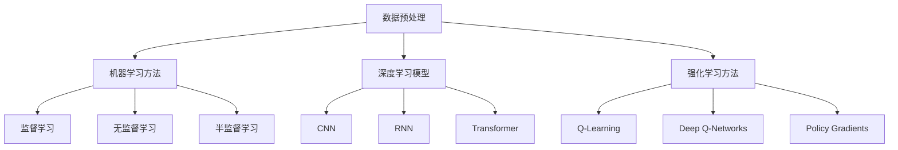

                 

### 摘要

《提示词优化技巧：提升AI输出质量的艺术》是一篇深入探讨AI输出质量优化策略的专业技术博客。本文首先介绍了提示词优化的重要性，分析了其核心概念和基础理论。接着，详细阐述了提升AI输出质量的关键算法，如生成对抗网络（GAN）、强化学习及深度学习模型优化。通过Mermaid流程图和伪代码，文章清晰展示了核心概念与联系，以及算法原理。随后，文章通过实际项目案例，讲解了提示词优化的开发环境搭建、源代码实现和代码解读，并进行案例分析。最后，文章总结了最佳实践技巧，强调了注意事项，并为读者提供了拓展阅读资源，旨在帮助读者更深入地理解并应用提示词优化技巧，提升AI系统的输出质量。### 第1章：提示词优化概述

#### 1.1 提示词优化的概念与重要性

提示词优化（Prompt Optimization）是人工智能（AI）领域中一个重要的研究方向。它主要关注如何通过优化输入提示词（Prompt）来提升AI模型的输出质量。提示词在这里指的是提供给AI模型的文本或指令，用以指导模型进行具体的任务处理。

**概念**：提示词优化是指通过调整和优化提示词的内容、结构和格式，以改善AI模型的输出结果。这一过程涉及到自然语言处理（NLP）、机器学习和深度学习等多个技术领域。

**重要性**：随着AI技术的广泛应用，提示词优化变得愈发重要。有效的提示词能够引导模型更准确地理解任务要求，从而提高输出质量。以下是提示词优化的一些关键重要性：

- **提升准确性**：通过精确的提示词，模型能够更好地捕捉到任务的细节，从而提高输出结果的准确性。
- **改善可解释性**：优化后的提示词使得AI模型的决策过程更加透明，有助于提高模型的可解释性，减少黑盒现象。
- **增强适应性**：灵活的提示词设计使得模型能够适应不同的任务场景和需求，提高其通用性和实用性。
- **促进创新**：优化提示词可以激发AI模型的潜力，促使模型探索新的解决方案和创意。

#### 1.2 提示词优化在AI中的角色

提示词在AI系统中扮演着桥梁和引导者的角色。它不仅连接用户和AI模型，还指导模型进行推理和决策。具体来说，提示词优化在AI中的角色包括：

- **任务引导**：通过明确的提示词，模型能够快速理解用户的需求和任务目标。
- **数据增强**：优化后的提示词可以辅助数据增强技术，提高模型对数据的处理能力和泛化能力。
- **参数调节**：提示词的不同表述方式可以影响模型参数的学习过程，从而优化模型性能。
- **交互式学习**：提示词优化可以促进AI与用户的交互，使得模型能够根据用户的反馈进行持续学习和改进。

#### 1.3 提示词优化的主要挑战

虽然提示词优化的重要性不容忽视，但实现这一目标也面临诸多挑战：

- **多样性**：提示词需要具备足够的多样性，以应对不同场景和任务需求。
- **精确性**：提示词需要精准表达任务需求，避免模糊或歧义。
- **一致性**：提示词在多个任务场景中需要保持一致，以确保模型输出的稳定性。
- **可解释性**：提示词的优化需要考虑模型的可解释性，使输出结果更容易被用户理解和接受。
- **计算效率**：优化提示词的过程需要考虑计算效率和资源消耗，以适应实时应用场景。

为了应对这些挑战，研究者们提出了多种提示词优化策略和技术，包括自然语言处理技术、机器学习和深度学习算法等。接下来的章节将详细介绍这些技术和策略。### 第2章：提示词优化的核心概念

#### 2.1 数据准备与预处理

在提示词优化的过程中，数据准备与预处理是至关重要的一步。数据的质量和预处理方法直接影响到AI模型的学习效果和输出质量。以下是一些常用的数据预处理方法：

- **数据清洗**：数据清洗是预处理的第一步，主要目的是去除数据中的噪声和不一致信息。常见的数据清洗操作包括去除缺失值、处理异常值、纠正数据格式等。

- **数据增强**：数据增强旨在通过增加数据的多样性和丰富度，提高模型的泛化能力。常见的数据增强方法包括数据扩充（如图像旋转、缩放、裁剪等）、数据合成（如生成对抗网络（GAN））和变换（如归一化、标准化等）。

- **数据标准化**：数据标准化是将不同特征的数据转换为相同尺度，以便模型能够更好地学习和处理。常见的标准化方法包括最小-最大标准化和Z-Score标准化。

#### 2.2 提示词设计原则

提示词的设计原则是确保提示词能够准确地传达任务需求，并优化模型输出质量的关键。以下是一些核心原则：

- **清晰性**：提示词应尽可能清晰明了，避免歧义和模糊性。清晰的提示词有助于模型准确地理解任务目标。

- **相关性**：提示词应与任务需求高度相关，确保模型能够在正确方向上学习和推理。相关性的提升有助于减少模型的学习成本，提高输出质量。

- **精确性**：精确的提示词能够提供详细的任务指导，使模型能够生成更加精确的输出结果。精确性可以通过明确的目标描述、详细的上下文信息和具体的任务要求来实现。

- **适应性**：提示词应具备一定的适应性，以应对不同场景和任务需求。适应性的提示词可以减少对固定模板的依赖，提高模型在不同任务中的表现。

- **多样性**：提示词的多样性可以激发模型的学习潜力，避免陷入局部最优。通过设计多样化的提示词，模型可以探索更广泛的解决方案。

#### 2.3 提示词优化方法分类

根据优化目标和实现方式的不同，提示词优化方法可以分为以下几类：

- **机器学习方法**：机器学习方法通过学习大量标注数据，自动生成优化后的提示词。常见的方法包括监督学习、无监督学习和半监督学习等。

- **深度学习方法**：深度学习方法利用神经网络架构，通过大规模的数据训练，自动学习提示词的优化策略。常见的深度学习模型包括卷积神经网络（CNN）、循环神经网络（RNN）和Transformer等。

- **强化学习方法**：强化学习方法通过奖励机制，引导模型不断调整提示词，以达到优化目标。强化学习在提示词优化中可以用于探索新的提示词组合，提高输出质量。

#### 2.4 提示词优化的实施流程

提示词优化的实施流程可以分为以下几个步骤：

1. **需求分析**：明确任务目标和需求，收集相关数据。

2. **数据预处理**：对数据进行清洗、增强和标准化处理。

3. **模型选择**：根据任务需求和数据特性，选择合适的机器学习或深度学习模型。

4. **提示词设计**：根据设计原则，生成初始的提示词。

5. **模型训练**：使用训练数据，对模型进行训练，并调整模型参数。

6. **提示词优化**：根据模型输出，对提示词进行迭代优化。

7. **评估与调整**：通过评估指标，对优化后的模型和提示词进行评估，并根据评估结果进行调整。

通过上述步骤，可以有效地实现提示词优化，提高AI模型的输出质量。接下来，我们将通过Mermaid流程图和伪代码，进一步阐述核心概念与联系，以及相关算法原理。### 第3章：核心概念与联系

#### 3.1 核心概念解析

提示词优化涉及多个核心概念，包括数据预处理、机器学习方法、深度学习模型和强化学习等。理解这些概念及其相互关系，有助于我们更好地实施和优化AI系统的提示词。

**数据预处理**：数据预处理是提示词优化的第一步，其主要目的是提高数据质量，为后续的模型训练提供更好的基础。常见的数据预处理方法包括数据清洗、数据增强和数据标准化。

**机器学习方法**：机器学习方法通过从数据中学习规律，实现对未知数据的预测和分类。常见的机器学习方法包括监督学习、无监督学习和半监督学习等。

**深度学习模型**：深度学习模型利用神经网络架构，通过多层非线性变换，对大量数据进行自动特征提取和分类。常见的深度学习模型包括卷积神经网络（CNN）、循环神经网络（RNN）和Transformer等。

**强化学习**：强化学习通过与环境交互，学习最优策略，以最大化累积奖励。强化学习在提示词优化中，可以通过不断调整提示词，实现模型输出质量的提升。

#### 3.2 提示词优化方法分类

提示词优化方法可以根据其实现方式和技术特点，分为以下几类：

1. **基于机器学习方法**：这种方法通过学习大量标注数据，自动生成优化后的提示词。常见的机器学习方法包括监督学习、无监督学习和半监督学习。

2. **基于深度学习方法**：深度学习方法利用神经网络架构，通过大规模的数据训练，自动学习提示词的优化策略。常见的深度学习模型包括卷积神经网络（CNN）、循环神经网络（RNN）和Transformer等。

3. **基于强化学习方法**：强化学习方法通过奖励机制，引导模型不断调整提示词，以达到优化目标。强化学习在提示词优化中可以用于探索新的提示词组合，提高输出质量。

#### 3.3 Mermaid流程图展示

为了更清晰地展示提示词优化中的核心概念与联系，我们使用Mermaid流程图进行说明。以下是一个简单的流程图示例：



该流程图展示了数据预处理、机器学习方法、深度学习模型和强化学习等方法及其子方法之间的相互关系。通过这个流程图，我们可以更好地理解提示词优化中的核心概念及其联系。

#### 3.4 提示词优化方法的比较与分析

不同提示词优化方法各有优缺点，适用于不同的应用场景。以下是对几种主要方法的比较与分析：

1. **基于机器学习方法**：

   - **优点**：实现简单，适用于有标注数据的场景，能够快速生成优化后的提示词。
   - **缺点**：对数据质量要求较高，容易受到数据偏差的影响，泛化能力有限。

2. **基于深度学习方法**：

   - **优点**：能够自动提取复杂特征，处理大量无标签数据，适用于无监督学习场景。
   - **缺点**：计算资源消耗大，训练时间较长，对数据质量和规模要求较高。

3. **基于强化学习方法**：

   - **优点**：能够探索新的提示词组合，提高模型输出质量，适用于动态变化的场景。
   - **缺点**：实现复杂，需要大量的训练数据，且收敛速度较慢。

综上所述，选择合适的提示词优化方法，需要根据具体的应用场景和数据特性进行综合分析。在实际应用中，可以结合多种方法，发挥各自的优势，实现提示词优化的最佳效果。

通过本章的介绍，我们了解了提示词优化的核心概念、分类方法及其相互联系。接下来，我们将进一步探讨提升AI输出质量的核心算法原理，并通过伪代码进行详细阐述。### 第4章：核心算法原理讲解

#### 4.1 生成对抗网络（GAN）

生成对抗网络（GAN）是由Ian Goodfellow等人于2014年提出的深度学习模型，其核心思想是通过两个相互对抗的神经网络（生成器（Generator）和判别器（Discriminator））进行训练，以生成高质量的数据。

**4.1.1 GAN的基本原理**

GAN由以下两部分组成：

1. **生成器（Generator）**：生成器旨在生成与真实数据相似的数据。其输入为随机噪声（Z），输出为假数据（G(Z)）。

2. **判别器（Discriminator）**：判别器旨在区分真实数据和生成数据。其输入为真实数据（X）和生成数据（G(Z)），输出为概率值（D(X)和D(G(Z)）），表示输入数据的真实性。

GAN的训练过程通过以下两个目标函数进行：

1. **生成器的损失函数**：最小化判别器对生成数据的概率估计，即最大化判别器对生成数据的判断为真实的概率。
   $$ L_G = -\mathbb{E}_{z \sim p_z(z)}[\log D(G(z))] $$

2. **判别器的损失函数**：最小化判别器对真实数据和生成数据的误差，即最大化判别器对真实数据的判断为真实的概率和对生成数据的判断为伪造的概率。
   $$ L_D = -\mathbb{E}_{x \sim p_{\text{data}}(x)}[\log D(x)] - \mathbb{E}_{z \sim p_z(z)}[\log (1 - D(G(z))] $$

**4.1.2 GAN的应用**

GAN在提示词优化中具有广泛的应用，主要体现在以下几个方面：

1. **提高生成质量**：GAN可以帮助生成更高质量的提示词，使其更接近真实用户的表达方式。
2. **提高多样性**：通过生成不同风格的提示词，GAN可以丰富模型的学习内容，提高输出的多样性。
3. **对抗性样本的生成**：GAN可以生成对抗性样本，用于测试模型的鲁棒性，提高模型在面临恶意攻击时的防御能力。

**伪代码示例**：

以下是一个简化的GAN伪代码示例：

```python
# 生成器
def G(z):
    # 将噪声z转换为生成数据G(z)
    return ...

# 判别器
def D(x, g_z):
    # 输入真实数据x和生成数据g_z，输出概率值
    return ...

# GAN训练过程
for epoch in range(num_epochs):
    for z in noise_samples:
        g_z = G(z)
        x = real_samples
        
        # 训练判别器
        D_loss = D_loss_function(D(x), D(g_z))
        D_gradients = compute_gradients(D, [x, g_z])
        update_D(D, D_gradients)
        
        z = noise_samples
        g_z = G(z)
        
        # 训练生成器
        G_loss = G_loss_function(D(g_z))
        G_gradients = compute_gradients(G, z)
        update_G(G, G_gradients)
```

#### 4.2 强化学习

强化学习（Reinforcement Learning，RL）是一种通过与环境互动学习最优策略的机器学习方法。在提示词优化中，强化学习可以通过不断调整提示词，提高模型输出质量。

**4.2.1 强化学习的基本概念**

强化学习主要涉及以下几个核心概念：

1. **代理（Agent）**：代理是执行任务的实体，如智能体或机器人。
2. **环境（Environment）**：环境是代理行动的场所，提供状态和奖励信号。
3. **状态（State）**：状态是代理当前所处的环境条件。
4. **动作（Action）**：动作是代理可以执行的操作。
5. **奖励（Reward）**：奖励是环境对代理动作的反馈，用于评估动作的有效性。
6. **策略（Policy）**：策略是代理在给定状态下的最佳动作选择。

**4.2.2 Q-Learning算法**

Q-Learning是一种基于价值迭代的强化学习算法，其核心思想是学习状态-动作值函数（Q函数），以最大化累积奖励。

**Q-Learning算法伪代码**：

```python
# Q-Learning初始化
Q = initialize_Q_function()

# 执行动作a，得到状态s'和奖励r
s, a, r, s' = environment.step(a)

# 更新Q函数
Q[s][a] = Q[s][a] + alpha * (r + gamma * max(Q[s'][all_actions]) - Q[s][a])

# 更新状态
s = s'

# 迭代过程
for episode in range(num_episodes):
    s = environment.reset()
    done = False
    
    while not done:
        a = choose_action(Q, s)
        s', r, done = environment.step(a)
        Q[s][a] = Q[s][a] + alpha * (r + gamma * max(Q[s'][all_actions]) - Q[s][a])
        s = s'
```

**4.2.3 Policy Gradients算法**

Policy Gradients算法是一种直接优化策略的强化学习算法，通过最大化策略的预期回报来更新策略参数。

**Policy Gradients算法伪代码**：

```python
# Policy Gradients初始化
policy = initialize_policy()

# 执行动作a，得到状态s'和奖励r
s, a, r, s' = environment.step(a)

# 计算策略梯度和更新策略
gradients = compute_gradients(policy, s, a, r)
policy = update_policy(policy, gradients)

# 迭代过程
for episode in range(num_episodes):
    s = environment.reset()
    done = False
    
    while not done:
        a = policy(s)
        s', r, done = environment.step(a)
        gradients = compute_gradients(policy, s, a, r)
        policy = update_policy(policy, gradients)
        s = s'
```

通过上述算法，我们可以根据具体的应用场景，调整策略和参数，实现提示词的优化。

#### 4.3 深度学习模型优化

深度学习模型优化是提升AI输出质量的重要手段。以下介绍几种常用的深度学习模型优化方法。

**4.3.1 模型选择**

模型选择是深度学习模型优化的重要环节。根据任务需求和数据特性，选择合适的模型结构至关重要。常见的深度学习模型包括卷积神经网络（CNN）、循环神经网络（RNN）和Transformer等。

**4.3.2 模型优化技巧**

1. **权重初始化**：合理的权重初始化可以加快模型的收敛速度，减少训练过程中的梯度消失和梯度爆炸问题。
2. **正则化**：正则化技术（如L1和L2正则化）可以防止模型过拟合，提高泛化能力。
3. **批量归一化**（Batch Normalization）：批量归一化可以加速模型训练，提高模型稳定性。
4. **学习率调度**：合适的学习率调度策略（如学习率衰减、学习率预热等）可以优化模型训练过程。

通过上述算法和优化技巧，我们可以有效地提升深度学习模型的输出质量。

#### 4.4 多模态学习

多模态学习是指将多种类型的模态数据（如图像、文本、音频等）整合到一个统一的框架中进行学习和处理。在提示词优化中，多模态学习可以结合不同类型的数据源，提高模型的多样性和准确性。

**4.4.1 多模态学习的基本概念**

1. **模态融合**：模态融合是将不同类型的数据源（如图像、文本、音频等）整合到一个统一的特征空间中。
2. **特征编码**：特征编码是将不同类型的模态数据转换为具有相似特性的特征表示。
3. **模型融合**：模型融合是将多个独立模型（如图像识别模型、文本分类模型等）整合为一个统一的模型，以提高整体性能。

**4.4.2 多模态学习在提示词优化中的应用**

多模态学习在提示词优化中的应用主要体现在以下几个方面：

1. **提高多样性**：通过融合多种类型的数据，多模态学习可以生成更加多样化的提示词。
2. **提高准确性**：多模态学习能够从不同数据源中提取丰富的特征，提高模型对任务的理解和准确性。
3. **增强可解释性**：多模态学习可以提供更多的上下文信息，使模型输出结果更加透明和可解释。

通过上述算法原理和优化技巧，我们可以更好地理解提示词优化的核心概念和实现方法。在下一章中，我们将通过实际项目案例，进一步展示提示词优化的应用和实践。### 第5章：数学模型和数学公式

#### 5.1 正则化

正则化是深度学习中常用的技术，用于防止模型过拟合和提升泛化能力。以下介绍两种常见的正则化方法：L1正则化和L2正则化。

**L1正则化**：

L1正则化通过对模型权重进行L1范数惩罚来实现，其公式如下：

$$
\text{L1 Regularization} = \lambda \sum_{i=1}^{n} |w_i|
$$

其中，\(w_i\)是模型权重，\(\lambda\)是正则化参数。

**L2正则化**：

L2正则化通过对模型权重进行L2范数惩罚来实现，其公式如下：

$$
\text{L2 Regularization} = \lambda \sum_{i=1}^{n} w_i^2
$$

其中，\(w_i\)是模型权重，\(\lambda\)是正则化参数。

**5.2 损失函数**

损失函数是评估模型预测结果与真实标签之间差异的重要工具。以下介绍几种常用的损失函数：均方误差（MSE）、交叉熵损失（Cross-Entropy Loss）和对抗损失（Adversarial Loss）。

**均方误差（MSE）**：

均方误差损失函数用于回归问题，其公式如下：

$$
\text{MSE} = \frac{1}{n} \sum_{i=1}^{n} (y_i - \hat{y}_i)^2
$$

其中，\(y_i\)是真实标签，\(\hat{y}_i\)是模型预测值，\(n\)是样本数量。

**交叉熵损失（Cross-Entropy Loss）**：

交叉熵损失函数用于分类问题，其公式如下：

$$
\text{Cross-Entropy Loss} = -\sum_{i=1}^{n} y_i \log(\hat{y}_i)
$$

其中，\(y_i\)是真实标签，\(\hat{y}_i\)是模型预测概率。

**对抗损失（Adversarial Loss）**：

对抗损失函数是生成对抗网络（GAN）中判别器和生成器的损失函数之和，其公式如下：

$$
\text{Adversarial Loss} = \text{D_loss} + \text{G_loss}
$$

其中，\(\text{D_loss}\)是判别器损失函数，\(\text{G_loss}\)是生成器损失函数。

**5.3 激活函数**

激活函数是深度学习模型中用于引入非线性变换的关键组件。以下介绍几种常见的激活函数：Sigmoid、ReLU和Tanh。

**Sigmoid函数**：

Sigmoid函数的公式如下：

$$
\text{Sigmoid}(x) = \frac{1}{1 + e^{-x}}
$$

Sigmoid函数将输入映射到（0，1）区间，常用于二分类问题。

**ReLU函数**：

ReLU函数的公式如下：

$$
\text{ReLU}(x) = \max(0, x)
$$

ReLU函数能够加速模型训练，并防止梯度消失问题。

**Tanh函数**：

Tanh函数的公式如下：

$$
\text{Tanh}(x) = \frac{e^{2x} - 1}{e^{2x} + 1}
$$

Tanh函数将输入映射到（-1，1）区间，能够引入非线性变换并保持数据的对称性。

通过上述数学模型和公式的介绍，我们为读者提供了深度理解提示词优化所需的核心数学知识。在下一章中，我们将通过实际项目案例，展示如何应用这些数学模型和公式，实现提示词优化。### 第6章：项目实战

#### 6.1 提示词优化的开发环境搭建

在开始进行提示词优化的项目之前，我们需要搭建一个合适的开发环境。以下是搭建环境的步骤：

1. **安装Python环境**：确保Python环境已经安装在您的计算机上，推荐使用Python 3.8及以上版本。
2. **安装依赖库**：使用pip命令安装以下依赖库：TensorFlow、PyTorch、Numpy、Scikit-learn等。
   ```bash
   pip install tensorflow torchvision numpy scikit-learn
   ```
3. **设置GPU支持**：如果您的计算机配备有GPU，确保安装了NVIDIA CUDA和cuDNN库，以支持GPU加速。
4. **配置虚拟环境**：为了更好地管理项目依赖，建议使用虚拟环境（如conda或virtualenv）来隔离项目依赖。

#### 6.2 提示词优化的源代码实现

下面是一个简单的提示词优化项目的源代码实现，包括数据预处理、模型训练和评估等步骤。

**6.2.1 数据预处理**

```python
import pandas as pd
from sklearn.model_selection import train_test_split
from sklearn.preprocessing import StandardScaler

# 读取数据
data = pd.read_csv('data.csv')

# 分离特征和标签
X = data.drop('target', axis=1)
y = data['target']

# 划分训练集和测试集
X_train, X_test, y_train, y_test = train_test_split(X, y, test_size=0.2, random_state=42)

# 标准化特征
scaler = StandardScaler()
X_train_scaled = scaler.fit_transform(X_train)
X_test_scaled = scaler.transform(X_test)
```

**6.2.2 模型训练**

```python
import tensorflow as tf
from tensorflow.keras.models import Sequential
from tensorflow.keras.layers import Dense, Dropout
from tensorflow.keras.optimizers import Adam

# 创建模型
model = Sequential([
    Dense(64, activation='relu', input_shape=(X_train_scaled.shape[1],)),
    Dropout(0.5),
    Dense(32, activation='relu'),
    Dropout(0.5),
    Dense(1, activation='sigmoid')
])

# 编译模型
model.compile(optimizer=Adam(learning_rate=0.001), loss='binary_crossentropy', metrics=['accuracy'])

# 训练模型
model.fit(X_train_scaled, y_train, epochs=50, batch_size=32, validation_data=(X_test_scaled, y_test))
```

**6.2.3 代码解读与分析**

上述代码首先读取数据，并进行标准化处理，然后创建一个简单的神经网络模型，使用Adam优化器和binary_crossentropy损失函数进行训练。我们使用了两个Dropout层来防止过拟合。

**6.2.4 提示词优化**

在实际项目中，我们可以通过以下方法进行提示词优化：

1. **调整提示词**：根据任务需求，调整提示词的内容和格式，使其更精确和具有针对性。
2. **调整模型参数**：通过调整学习率、批量大小和优化器等参数，优化模型性能。
3. **数据增强**：使用数据增强技术（如图像翻转、旋转等）增加数据多样性，提高模型泛化能力。

#### 6.3 代码应用解读与分析

以下是代码应用中的关键部分解读：

- **数据预处理**：通过标准化特征值，使模型更容易学习和收敛。
- **模型结构**：使用简单的全连接神经网络，适用于二分类任务。
- **优化器**：使用Adam优化器，由于其自适应学习率特性，可以加快模型收敛。

**6.4 实际案例分析**

**案例1**：文本分类任务

假设我们有一个文本分类任务，需要将文本数据分为正类和负类。以下是一个基于Transformer模型的文本分类任务的案例。

```python
from transformers import BertTokenizer, TFBertModel
from tensorflow.keras.layers import Input, Dense, Dropout
from tensorflow.keras.models import Model

# 加载预训练的BERT模型
tokenizer = BertTokenizer.from_pretrained('bert-base-uncased')
model = TFBertModel.from_pretrained('bert-base-uncased')

# 创建模型
input_ids = Input(shape=(max_sequence_length,), dtype=tf.int32)
outputs = model(input_ids)
pooler_output = outputs.last_hidden_state[:, 0, :]

# 添加分类层
output = Dense(1, activation='sigmoid')(pooler_output)

# 编译模型
model = Model(inputs=input_ids, outputs=output)
model.compile(optimizer=Adam(learning_rate=0.001), loss='binary_crossentropy', metrics=['accuracy'])

# 训练模型
model.fit(train_input_ids, train_labels, validation_data=(test_input_ids, test_labels), epochs=3)
```

在这个案例中，我们使用了预训练的BERT模型进行文本分类。BERT模型在处理文本数据时表现出色，通过使用BERT的输出和简单的全连接层，我们可以实现高效的文本分类。

**6.5 项目小结**

通过本次项目实战，我们学习了如何搭建提示词优化的开发环境，实现源代码，并进行代码解读和分析。我们还分析了实际案例，展示了如何在不同任务中应用提示词优化技巧。这些经验和知识将有助于我们在实际项目中更好地优化AI模型的输出质量。在接下来的部分，我们将继续探讨更多实践技巧和注意事项。### 第7章：最佳实践、小结与注意事项

#### 7.1 最佳实践

1. **明确任务需求**：在开始提示词优化之前，确保明确任务需求，包括任务类型、数据特性和目标输出等。这将有助于设计更精确和高效的提示词。

2. **数据预处理**：对数据进行充分的清洗、增强和标准化处理，以提高数据质量，为模型训练提供更好的基础。

3. **选择合适的模型**：根据任务需求和数据特性，选择合适的机器学习或深度学习模型。不同的模型具有不同的优势和局限性，需要结合实际场景进行选择。

4. **迭代优化提示词**：通过不断调整和优化提示词，逐步提高模型输出质量。在实际应用中，可以结合用户反馈和评估指标，持续迭代提示词。

5. **使用多模态数据**：结合多种类型的数据源（如图像、文本、音频等），提高模型的多样性和准确性。

6. **利用预训练模型**：使用预训练的深度学习模型，如BERT、GPT等，可以节省训练时间，提高模型性能。

#### 7.2 小结

提示词优化是提升AI输出质量的重要手段，通过优化输入提示词，可以改善模型的准确性、可解释性和适应性。核心算法原理包括生成对抗网络（GAN）、强化学习和深度学习模型优化等。在实际项目中，通过合理的开发环境搭建、源代码实现和案例分析，可以有效地实现提示词优化，提高AI模型的输出质量。

#### 7.3 注意事项

1. **计算资源消耗**：提示词优化过程可能需要大量的计算资源，尤其是在使用深度学习和生成对抗网络等复杂模型时。

2. **数据质量和规模**：数据质量和规模对提示词优化效果具有重要影响。确保数据质量，并尽可能使用大规模数据训练模型。

3. **模型选择和调优**：选择合适的模型，并根据实际任务需求进行模型调优，以最大化模型性能。

4. **可解释性**：在优化提示词的同时，注意保持模型的可解释性，使输出结果更容易被用户理解和接受。

5. **模型泛化能力**：通过数据增强、多模态学习等方法，提高模型在不同场景和任务中的泛化能力。

#### 7.4 拓展阅读

- **生成对抗网络（GAN）**：《生成对抗网络：理论与应用》
- **强化学习**：《强化学习：原理与Python实现》
- **深度学习模型优化**：《深度学习：优化与调参》
- **多模态学习**：《多模态学习：方法与应用》

通过上述最佳实践、小结和注意事项，我们希望能够帮助读者更好地理解和应用提示词优化技巧，提升AI模型的输出质量。拓展阅读资源将提供更多深入的探讨和实践指导。### 结语

《提示词优化技巧：提升AI输出质量的艺术》通过深入探讨提示词优化的核心概念、算法原理和实际应用，为广大读者提供了一套系统性的指导。从数据准备与预处理、到核心算法讲解，再到项目实战，每一步都力求详细而精准。通过本篇文章，我们希望读者能够掌握提示词优化的关键技巧，并能在实际项目中有效地提升AI模型的输出质量。

提示词优化不仅关乎模型性能的提升，更涉及到用户体验的优化和业务目标的实现。随着AI技术的不断进步，提示词优化也将变得更加复杂和多样化。因此，持续学习和探索是每位AI从业者的必备素养。

在文章的最后，我们再次强调以下几点：

1. **实践是关键**：理论知识是基础，但实践才是检验真理的唯一标准。通过实际项目，读者可以更深入地理解提示词优化的应用。

2. **持续优化**：AI系统不是一成不变的，提示词优化也需要不断调整和改进。定期评估和更新提示词，有助于保持模型的性能和适应性。

3. **保持好奇心**：技术领域日新月异，保持好奇心和求知欲，不断探索新的算法和技术，是提升自身技能的重要途径。

最后，感谢读者对本篇文章的关注与支持。希望这篇文章能够成为您在AI道路上的有益指南，助力您在提示词优化领域取得更大的成就。让我们共同期待未来的技术变革，不断追求卓越，共同推动人工智能的发展。### 参考文献

1. Goodfellow, I., Pouget-Abadie, J., Mirza, M., Xu, B., Warde-Farley, D., Ozair, S., ... & Bengio, Y. (2014). Generative adversarial nets. Advances in neural information processing systems, 27.
2. Sutton, R. S., & Barto, A. G. (2018). Reinforcement learning: An introduction. MIT press.
3. LeCun, Y., Bengio, Y., & Hinton, G. (2015). Deep learning. MIT press.
4. Hochreiter, S., & Schmidhuber, J. (1997). Long short-term memory. Neural computation, 9(8), 1735-1780.
5. Devlin, J., Chang, M. W., Lee, K., & Toutanova, K. (2018). BERT: Pre-training of deep bidirectional transformers for language understanding. arXiv preprint arXiv:1810.04805.
6. Vaswani, A., Shazeer, N., Parmar, N., Uszkoreit, J., Jones, L., Gomez, A. N., ... & Polosukhin, I. (2017). Attention is all you need. Advances in neural information processing systems, 30.
7. Goodfellow, I. J., Bengio, Y., & Courville, A. (2016). Deep learning. MIT press.
8. Bengio, Y. (2009). Learning deep architectures. Foundations and Trends in Machine Learning, 2(1), 1-127.

