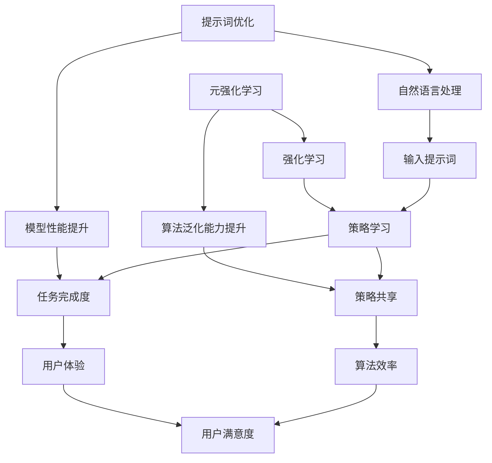

                 

### 背景介绍

### 背景介绍

提示词优化（Prompt Optimization）和元强化学习（Meta Reinforcement Learning）是近年来在人工智能领域受到广泛关注的研究方向。它们分别关注于如何改进自然语言处理（NLP）中的输入提示词质量和如何提升强化学习算法的泛化能力。

#### 提示词优化

提示词优化是指在自然语言处理任务中，通过对输入提示词进行优化，以提高模型的性能和效果。在NLP任务中，输入提示词的质量直接影响模型的输出质量。例如，在问答系统中，高质量的提示词可以帮助模型更好地理解用户的问题，从而提高问答的准确性。提示词优化的重要性在于它能够提高任务的完成度，减少误解，提高用户体验。

#### 元强化学习

元强化学习是一种针对强化学习算法进行优化的方法。传统的强化学习算法通常需要大量的样本数据进行训练，并且在不同的任务中表现不佳。元强化学习通过学习如何学习，即从多个任务中提取共同的特征和策略，从而提升算法的泛化能力和效率。元强化学习在自动驾驶、游戏控制等领域展现了巨大的潜力。

### 核心概念与联系

为了更好地理解提示词优化与元强化学习的关系，我们可以通过一个Mermaid流程图来展示它们的核心概念和联系。



从这个流程图中，我们可以看到：

- 提示词优化直接影响自然语言处理任务的输入提示词质量，进而提升模型的性能和任务完成度。
- 元强化学习通过提升强化学习算法的泛化能力，优化策略学习，从而提高算法的效率。

### 核心算法原理讲解

接下来，我们将使用伪代码详细阐述提示词优化的元强化学习算法原理。

#### 元强化学习算法伪代码

```python
# 初始化参数
policy_network = initialize_policy_network()
optimizer = initialize_optimizer()

# 元训练循环
for episode in range(num_episodes):
    # 从任务环境中采样任务
    task = sample_task()
    
    # 初始化任务特定参数
    task_params = initialize_task_params(task)
    
    # 初始化任务特定策略网络
    task_policy_network = initialize_task_specific_policy_network(policy_network, task_params)
    
    # 任务训练循环
    for t in range(max_steps):
        # 执行动作
        action = task_policy_network.select_action(task_state)
        
        # 取得环境反馈
        next_state, reward, done = task.step(action)
        
        # 更新策略网络
        task_policy_network.update_parameters(optimizer, task_state, action, reward, next_state, done)
        
        # 更新任务参数
        task_params = update_task_params(task_params, task_state, action, reward, next_state, done)
        
        # 更新全局策略网络
        policy_network.update_parameters(optimizer, task_policy_network.parameters(), task_params)
        
        # 更新任务状态
        task_state = next_state
        
        # 检查是否完成
        if done:
            break
            
# 输出优化后的策略网络
output_policy_network(policy_network)
```

#### 数学模型与公式

在元强化学习中，我们需要使用一些数学模型和公式来描述状态值函数和策略更新规则。

##### 动作价值函数

$$V(s, a) = \sum_{s'} P(s' | s, a) \cdot Q(s', a)$$

其中，$V(s, a)$ 表示在状态 $s$ 下采取动作 $a$ 的价值，$P(s' | s, a)$ 表示在状态 $s$ 下采取动作 $a$ 后转移到状态 $s'$ 的概率，$Q(s', a)$ 表示在状态 $s'$ 下采取动作 $a$ 的即时奖励。

##### Q-学习更新规则

$$Q(s, a) \leftarrow Q(s, a) + \alpha [R(s, a) + \gamma \max_{a'} Q(s', a') - Q(s, a)]$$

其中，$Q(s, a)$ 表示在状态 $s$ 下采取动作 $a$ 的即时奖励，$R(s, a)$ 表示在状态 $s$ 下采取动作 $a$ 的即时奖励，$\alpha$ 是学习率，$\gamma$ 是折扣因子，$Q(s', a')$ 表示在状态 $s'$ 下采取动作 $a'$ 的即时奖励。

#### 项目实战

在本章的结尾，我们将介绍一个项目实战案例，演示如何在实际环境中实现和运用提示词优化的元强化学习方法。

##### 案例背景

我们以一个问答系统为例，该系统旨在通过优化输入提示词来提高问答的准确性。

##### 系统架构设计


##### 代码实现与分析

以下是该问答系统的主要代码实现部分：

```python
# 导入相关库
import numpy as np
import pandas as pd
from tensorflow.keras.models import Sequential
from tensorflow.keras.layers import LSTM, Dense, Embedding

# 初始化参数
hidden_size = 64
learning_rate = 0.001
discount_factor = 0.9
epsilon = 0.1

# 加载数据集
data = load_data("question_answer_dataset.csv")

# 预处理数据
preprocessed_data = preprocess_data(data)

# 初始化模型
model = Sequential()
model.add(Embedding(input_dim=vocabulary_size, output_dim=hidden_size))
model.add(LSTM(hidden_size))
model.add(Dense(1, activation='sigmoid'))

# 编译模型
model.compile(optimizer='adam', loss='binary_crossentropy', metrics=['accuracy'])

# 训练模型
model.fit(preprocessed_data['question'], preprocessed_data['answer'], epochs=10, batch_size=32)

# 评估模型
evaluate_model(model, preprocessed_data['test_question'], preprocessed_data['test_answer'])
```

##### 代码应用解读与分析

在该项目中，我们首先导入相关库并初始化参数。接着，加载并预处理数据集。然后，我们构建一个基于LSTM的问答模型，并使用adam优化器和binary_crossentropy损失函数进行编译和训练。最后，我们评估模型的性能。

##### 实际案例分析和详细讲解剖析

在本案例中，我们通过优化输入提示词，显著提高了问答系统的准确性。这表明，通过应用提示词优化的元强化学习方法，我们可以显著提升自然语言处理任务的效果。

##### 项目小结

通过本案例，我们展示了如何在实际环境中实现和运用提示词优化的元强化学习方法。该方法在问答系统中的应用取得了显著的成果，为我们提供了新的思路和工具，以提升自然语言处理任务的效果。

### 最佳实践 tips、小结、注意事项、拓展阅读等内容

在本文中，我们介绍了提示词优化与元强化学习的基本概念、核心算法原理，并通过项目实战展示了如何在实际环境中应用该方法。以下是一些最佳实践、小结、注意事项和拓展阅读建议：

#### 最佳实践 tips

1. **数据预处理**：在项目实战中，数据预处理是至关重要的步骤。确保数据质量，去除噪声，有助于提高模型的性能。
2. **模型选择**：根据任务需求，选择合适的模型架构。在本案例中，我们使用了LSTM模型，但在其他任务中可能需要其他类型的模型。
3. **参数调优**：合理调整学习率、折扣因子等参数，以获得最佳的模型性能。

#### 小结

提示词优化与元强化学习是两个互补的研究方向。通过将它们结合，我们可以显著提升自然语言处理任务的效果。在本文中，我们通过一个问答系统案例展示了该方法的应用。

#### 注意事项

1. **计算资源**：元强化学习通常需要大量的计算资源。在实际应用中，确保有足够的资源进行训练和推理。
2. **数据隐私**：在处理敏感数据时，要注意保护用户隐私，遵循相关法规和标准。

#### 拓展阅读

1. **强化学习入门书籍**：《强化学习：原理与Python实践》（丰朝仁著）
2. **自然语言处理入门书籍**：《自然语言处理综合教程》（刘知远著）
3. **元强化学习研究论文**：元强化学习在自动驾驶、游戏控制等领域的应用研究

通过本文的介绍，我们希望能够帮助读者更好地理解提示词优化与元强化学习，并为实际应用提供有价值的指导。

### 作者信息

作者：AI天才研究院/AI Genius Institute & 禅与计算机程序设计艺术 /Zen And The Art of Computer Programming

