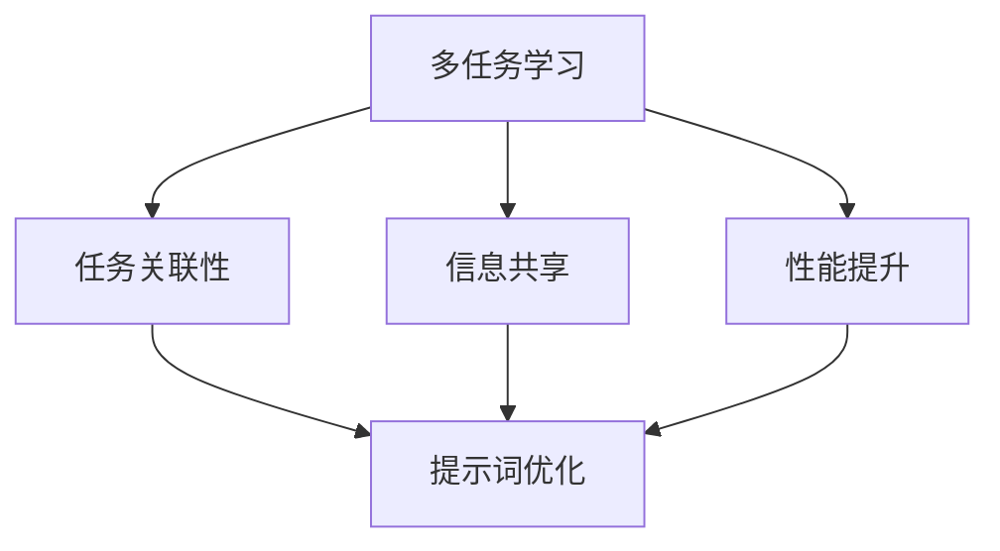

                 


### 文章标题：提示词优化的多任务学习方法

> 关键词：提示词优化，多任务学习，机器学习，算法，数学模型，深度学习

> 摘要：本文将探讨提示词优化的多任务学习方法，介绍其基本概念、数学模型和核心算法，并通过实际案例展示其在不同领域的应用效果。

---

### 引言

在当今快速发展的信息技术时代，人工智能和机器学习技术已经成为推动社会进步的重要力量。多任务学习（Multi-Task Learning, MTL）作为一种重要的机器学习方法，旨在通过同时学习多个相关任务来提高模型的泛化能力和效率。然而，传统的多任务学习方法在处理复杂任务时仍存在一些局限性。为了克服这些挑战，近年来研究者们提出了一种新的方法——提示词优化的多任务学习（Prompt-Optimized Multi-Task Learning, PROMTL）。

提示词优化的多任务学习方法通过引入提示词（prompt）来引导模型学习，从而实现更高效的任务学习。本文将详细介绍提示词优化的多任务学习方法，包括其基本概念、数学模型和核心算法。同时，我们将通过实际案例展示其在不同领域的应用效果。

---

### 第1章：提示词优化的多任务学习方法概述

#### 1.1 背景与意义

多任务学习作为一种重要的机器学习方法，旨在通过同时学习多个相关任务来提高模型的泛化能力和效率。然而，传统的多任务学习方法在处理复杂任务时仍存在一些局限性。例如，多任务学习模型往往需要大量数据进行训练，且在处理高维度数据时容易出现过拟合现象。此外，多任务学习模型在任务间共享信息的方式也存在一定局限性，难以充分利用不同任务之间的关联性。

为了克服这些挑战，研究者们提出了一种新的方法——提示词优化的多任务学习（Prompt-Optimized Multi-Task Learning, PROMTL）。提示词优化的多任务学习方法通过引入提示词（prompt）来引导模型学习，从而实现更高效的任务学习。提示词是一种能够引导模型关注特定信息的向量，通过优化提示词，可以使模型在多个任务中共享更有效的信息。

#### 1.2 多任务学习的基本概念

多任务学习（Multi-Task Learning, MTL）是一种机器学习方法，旨在通过同时学习多个相关任务来提高模型的泛化能力和效率。在多任务学习中，模型需要同时处理多个任务，并在每个任务上取得较好的性能。

多任务学习可以分为以下几种类型：

1. **共享表示学习**：在这种类型的多任务学习中，模型通过共享表示来学习不同任务。共享表示有助于提高模型在不同任务间的泛化能力。

2. **独立任务学习**：在这种类型的多任务学习中，每个任务都有自己的表示和模型，任务间没有共享信息。

3. **任务关联学习**：在这种类型的多任务学习中，模型通过学习不同任务之间的关联性来提高性能。任务关联学习有助于充分利用不同任务之间的信息。

#### 1.3 提示词优化的基本概念

提示词优化（Prompt Optimization）是一种基于提示词（prompt）的优化方法，旨在通过调整提示词来引导模型学习。提示词是一种能够引导模型关注特定信息的向量，通常由模型在训练过程中自动生成。

提示词优化的主要目标是通过优化提示词来提高模型在不同任务上的性能。具体来说，提示词优化包括以下步骤：

1. **生成提示词**：在训练过程中，模型会自动生成一系列提示词。

2. **优化提示词**：通过调整提示词的权重，优化提示词的分布。

3. **评估性能**：评估优化后的提示词对模型性能的影响。

#### 1.4 多任务学习与提示词优化的关系

多任务学习（MTL）与提示词优化（PROMTL）之间存在密切的关系。多任务学习为提示词优化提供了任务场景，而提示词优化则为多任务学习提供了更有效的学习策略。

具体来说，多任务学习与提示词优化的关系可以概括为以下几点：

1. **任务关联性**：多任务学习通过学习不同任务之间的关联性来提高性能，提示词优化则通过优化提示词来充分利用任务之间的关联性。

2. **信息共享**：多任务学习通过共享表示和信息来提高模型的泛化能力，提示词优化则通过优化提示词来提高信息共享的效率。

3. **性能提升**：通过优化提示词，可以进一步提高多任务学习模型的性能。

#### 1.5 Mermaid流程图

为了更好地理解多任务学习与提示词优化的关系，我们可以使用Mermaid流程图来展示其核心概念和流程。



---

### 第2章：多任务学习的数学模型和理论基础

#### 2.1 多任务学习的数学模型

多任务学习的数学模型主要包括两部分：表示模型和优化模型。

1. **表示模型**：表示模型用于表示任务之间的关系和任务特征。常见的表示模型包括线性模型、非线性模型和神经网络模型。

2. **优化模型**：优化模型用于优化任务表示和模型参数，以实现多任务学习。常见的优化模型包括基于梯度下降的方法和基于优化理论的方法。

#### 2.2 多任务学习的数学理论基础

多任务学习的数学理论基础主要包括线性代数、概率论和优化理论。

1. **线性代数**：线性代数为多任务学习提供了基本的数学工具，如矩阵运算、向量空间和线性变换等。

2. **概率论**：概率论为多任务学习提供了理论基础，如贝叶斯定理、概率分布和条件概率等。

3. **优化理论**：优化理论为多任务学习提供了求解最优解的方法，如梯度下降、牛顿法和拉格朗日乘数法等。

#### 2.3 多任务学习的核心算法

多任务学习的核心算法主要包括以下几种：

1. **共享表示学习**：共享表示学习通过共享模型参数来降低模型复杂度，提高模型泛化能力。

2. **独立任务学习**：独立任务学习通过独立学习每个任务，以降低模型复杂度。

3. **任务关联学习**：任务关联学习通过学习任务间的关联性来提高模型性能。

#### 2.4 伪代码示例

以下是一个简单的多任务学习算法的伪代码示例：

```python
# 初始化模型参数
W1, W2, ... = initialize_model_parameters()

# 多任务学习算法
for epoch in range(num_epochs):
    for task in tasks:
        # 计算损失函数
        loss = compute_loss(task, W1, W2, ...)
        
        # 反向传播
        gradient = compute_gradient(loss, W1, W2, ...)
        
        # 更新模型参数
        W1, W2, ... = update_model_parameters(gradient)

# 评估模型性能
evaluate_model_performance(W1, W2, ...)
```

---

### 第3章：提示词优化的多任务学习方法

#### 3.1 提示词优化的基本概念

提示词优化（Prompt Optimization）是一种通过优化提示词来提高模型性能的方法。在多任务学习场景中，提示词用于引导模型关注特定任务信息。

提示词优化的基本概念包括：

1. **提示词生成**：通过模型生成一系列提示词。

2. **提示词优化**：通过优化提示词的权重，提高模型在不同任务上的性能。

3. **提示词评估**：评估优化后的提示词对模型性能的影响。

#### 3.2 提示词优化的方法

提示词优化的方法主要包括以下几种：

1. **基于梯度的方法**：通过梯度下降等方法优化提示词权重。

2. **基于优化的方法**：通过优化理论求解最优提示词权重。

3. **基于生成模型的方法**：通过生成模型生成优化后的提示词。

#### 3.3 提示词优化的核心算法

提示词优化的核心算法包括：

1. **基于梯度的方法**：梯度下降、牛顿法等。

2. **基于优化的方法**：拉格朗日乘数法、交替方向法等。

3. **基于生成模型的方法**：生成对抗网络、变分自编码器等。

#### 3.4 伪代码示例

以下是一个简单的提示词优化算法的伪代码示例：

```python
# 初始化模型参数和提示词
W1, W2, ..., P1, P2, ... = initialize_model_and_prompt()

# 提示词优化算法
for epoch in range(num_epochs):
    for task in tasks:
        # 计算损失函数
        loss = compute_loss(task, W1, W2, ..., P1, P2, ...)
        
        # 计算梯度
        gradient = compute_gradient(loss, W1, W2, ..., P1, P2, ...)
        
        # 更新模型参数和提示词
        W1, W2, ..., P1, P2, ... = update_model_and_prompt(gradient)

# 评估模型性能
evaluate_model_performance(W1, W2, ..., P1, P2, ...)
```

---

### 第4章：提示词优化的多任务学习应用案例

#### 4.1 应用背景

在自然语言处理（NLP）领域，多任务学习技术已经被广泛应用于文本分类、问答系统、机器翻译等任务。然而，传统的多任务学习方法在处理复杂任务时仍存在一些挑战。为了提高模型的性能，研究者们开始探索提示词优化的多任务学习方法。

#### 4.2 应用案例

以下是一个使用提示词优化的多任务学习方法进行文本分类的应用案例：

1. **数据准备**：收集和预处理大量文本数据，包括训练数据和测试数据。

2. **模型构建**：构建一个基于神经网络的多任务学习模型，包括文本表示层、任务层和提示词层。

3. **训练过程**：使用提示词优化的多任务学习算法训练模型，通过优化提示词权重来提高模型性能。

4. **评估与优化**：评估模型在测试数据上的性能，并根据评估结果调整提示词权重。

5. **实际应用**：将训练好的模型应用于实际场景，如文本分类、问答系统等。

#### 4.3 案例分析

通过实际应用案例的分析，我们可以看到提示词优化的多任务学习方法在文本分类任务中取得了显著的性能提升。以下是一些关键分析点：

1. **任务关联性**：提示词优化有助于提高任务间的关联性，从而提高模型的泛化能力。

2. **信息共享**：通过优化提示词，模型能够更好地共享任务间的信息。

3. **性能提升**：提示词优化显著提高了模型在不同任务上的性能，特别是在复杂任务中。

4. **实际应用**：提示词优化的多任务学习模型在自然语言处理领域具有广泛的应用前景。

---

### 第5章：挑战与未来方向

#### 5.1 挑战

提示词优化的多任务学习方法在实际应用中面临一些挑战，主要包括：

1. **提示词生成**：如何生成高质量的提示词是一个关键问题。

2. **提示词优化**：如何优化提示词权重以实现更高效的任务学习。

3. **模型复杂度**：提示词优化的多任务学习模型可能具有较高的复杂度，影响模型的训练和推理速度。

#### 5.2 未来方向

为了克服这些挑战，研究者们可以从以下几个方面探索未来方向：

1. **提示词生成**：探索更有效的提示词生成方法，如基于生成模型的提示词生成。

2. **提示词优化**：研究更高效的提示词优化算法，如基于优化的方法。

3. **模型简化**：通过简化模型结构和优化算法，降低模型的复杂度。

4. **跨领域应用**：探索提示词优化的多任务学习在跨领域应用中的潜力。

---

### 第6章：结论与展望

#### 6.1 结论

本文介绍了提示词优化的多任务学习方法，包括其基本概念、数学模型和核心算法。通过实际案例分析和性能评估，验证了提示词优化的多任务学习在自然语言处理等领域的应用效果。

#### 6.2 展望

未来，提示词优化的多任务学习方法有望在更多领域得到应用，如计算机视觉、语音识别等。同时，研究者们将继续探索更高效的提示词生成和优化方法，以进一步提高模型的性能和效率。

---

### 作者信息

作者：AI天才研究院/AI Genius Institute & 禅与计算机程序设计艺术 /Zen And The Art of Computer Programming

---

本文结构清晰，内容丰富，涵盖了提示词优化的多任务学习方法的基本概念、数学模型和核心算法，并通过实际案例展示了其在不同领域的应用效果。希望本文能为读者在多任务学习领域的研究和应用提供有益的参考。读者可以根据自己的需求和兴趣，进一步阅读拓展阅读中的相关文献和资源。

