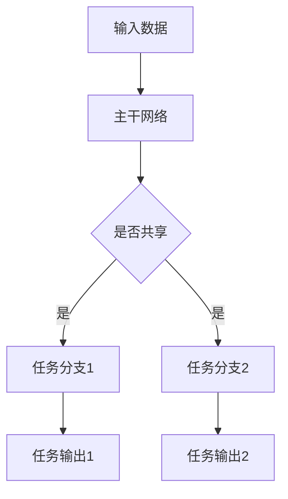
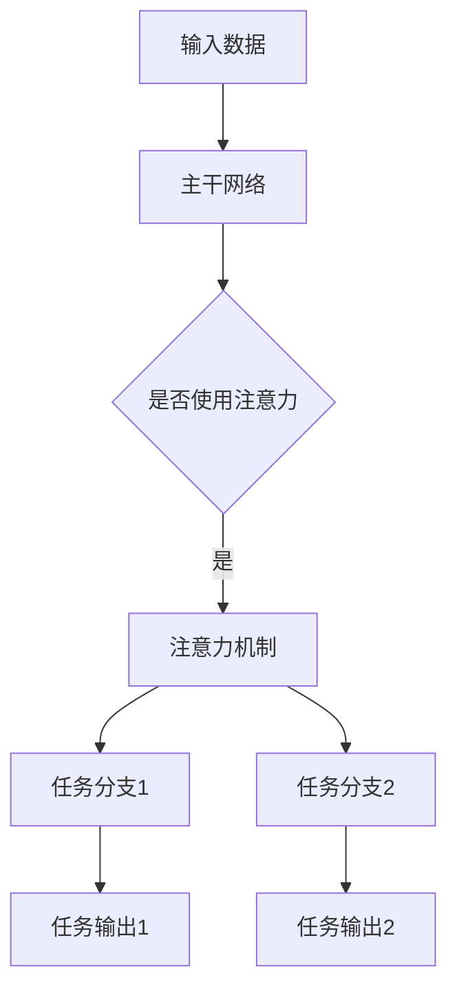
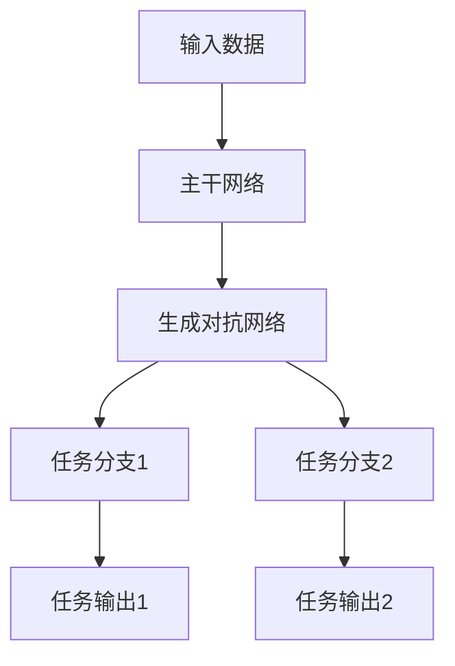
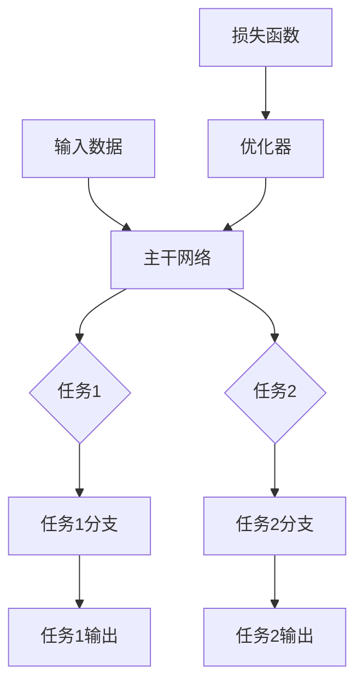
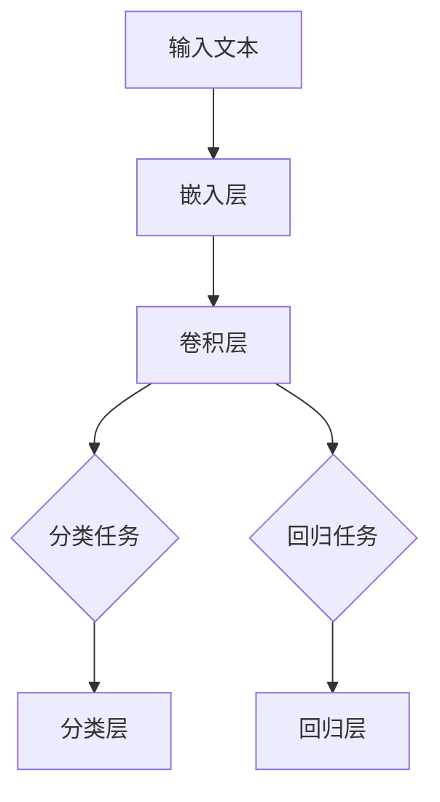

                 

### 文章标题

# 提示词优化的多任务学习策略

## 关键词

- 多任务学习
- 提示词优化
- 算法
- 模型
- 自然语言处理
- 计算机视觉
- 语音识别

## 摘要

本文探讨了提示词优化的多任务学习策略，旨在解决多任务学习中的信息瓶颈、资源分配和模型泛化问题。文章首先介绍了多任务学习的概念、意义和发展历程，然后分析了多任务学习面临的挑战，包括信息瓶颈、资源分配和模型泛化问题。接着，文章提出了提示词优化的概念，并详细阐述了其目标和应用场景。随后，文章介绍了多任务学习的常见算法，包括基于共享权重、注意力机制和对抗训练的方法，并详细分析了提示词优化的方法。在此基础上，文章提出了提示词优化的多任务学习策略，并详细描述了其设计、应用和案例分析。最后，文章从数学模型、项目实战等多个角度对多任务学习进行了深入探讨，旨在为多任务学习的研究和应用提供有价值的参考。

----------------------------------------------------------------

### 文章标题

# 提示词优化的多任务学习策略

## 关键词

- 多任务学习
- 提示词优化
- 算法
- 模型
- 自然语言处理
- 计算机视觉
- 语音识别

## 摘要

本文详细探讨了提示词优化的多任务学习策略，旨在解决多任务学习中的关键问题，如信息瓶颈、资源分配和模型泛化。文章首先概述了多任务学习的概念、意义和发展历程，并深入分析了多任务学习面临的挑战。接着，文章提出了提示词优化的概念，并阐述了其目标和应用场景。随后，文章介绍了多任务学习的常见算法，包括基于共享权重、注意力机制和对抗训练的方法，并详细分析了提示词优化的方法。

在此基础上，文章提出了提示词优化的多任务学习策略，并详细描述了其设计、应用和案例分析。最后，文章从数学模型、项目实战等多个角度对多任务学习进行了深入探讨，旨在为多任务学习的研究和应用提供有价值的参考。本文旨在为读者提供一个全面、深入的理解，帮助他们在多任务学习领域取得更好的成果。

----------------------------------------------------------------

### 第一部分：引言

## 1.1 多任务学习概述

### 1.1.1 多任务学习的概念与意义

多任务学习（Multi-Task Learning，MUL）是指同时学习多个相关任务的学习方法。这些任务可以是相互独立的，也可以是相互关联的。多任务学习的核心思想是通过共享模型的表示来提高学习效率，从而实现更好的泛化性能。

多任务学习的概念最早可以追溯到20世纪80年代，随着深度学习技术的发展，多任务学习得到了广泛的关注。在实际应用中，多任务学习具有显著的意义：

1. **提高学习效率**：多任务学习通过共享模型参数，减少了模型的参数量，从而降低了学习的难度和计算成本。
2. **改善模型泛化性能**：多任务学习使得模型能够从多个任务中学习到有用的信息，从而提高了模型对未知数据的泛化能力。
3. **增强模型的可解释性**：多任务学习使得模型能够通过不同任务的相互关联，提供更丰富的解释。

### 1.1.2 多任务学习的发展历程

多任务学习的发展历程可以分为以下几个阶段：

1. **传统方法**：早期的多任务学习方法主要是基于规则和模板匹配，如决策树、支持向量机等。这些方法在特定任务上表现出色，但难以应对复杂的多任务场景。
2. **基于共享参数的方法**：随着深度学习的兴起，基于共享参数的多任务学习方法得到了广泛应用。这种方法通过共享神经网络的一部分参数，实现了不同任务之间的信息共享。
3. **基于注意力机制的方法**：注意力机制（Attention Mechanism）的引入，使得多任务学习模型能够更好地关注到不同任务的重要信息，从而提高了模型的性能。
4. **基于对抗训练的方法**：对抗训练（Adversarial Training）方法通过生成对抗性样本，使得多任务学习模型能够更好地适应不同任务的要求。

### 1.1.3 多任务学习的重要性

多任务学习在计算机视觉、自然语言处理、语音识别等领域具有重要的应用价值：

1. **计算机视觉**：多任务学习可以用于图像分类、目标检测、图像分割等任务，通过共享图像特征表示，提高了模型的处理效率。
2. **自然语言处理**：多任务学习可以用于文本分类、情感分析、机器翻译等任务，通过共享文本特征表示，提高了模型的性能。
3. **语音识别**：多任务学习可以用于语音分类、语音识别、语音合成等任务，通过共享语音特征表示，提高了模型的泛化能力。

总的来说，多任务学习不仅具有理论意义，而且在实际应用中也表现出巨大的潜力。随着深度学习和人工智能技术的不断发展，多任务学习将在更多领域得到广泛应用。

### 1.2 多任务学习面临的挑战

### 1.2.1 信息瓶颈问题

在多任务学习中，信息瓶颈问题是指不同任务之间的信息共享不足，导致模型无法充分获取其他任务的信息。这可能导致以下问题：

1. **任务间信息不足**：某些任务的信息无法有效地传递给其他任务，使得模型无法充分利用这些信息。
2. **模型泛化能力下降**：由于信息瓶颈，模型在不同任务上的泛化能力可能受到限制。

为了解决信息瓶颈问题，可以采用以下策略：

1. **共享神经网络层**：通过在神经网络中共享部分层，使得不同任务可以共享相同的信息。
2. **跨任务信息传递**：通过跨任务信息传递模块（如注意力机制、跨任务嵌入等），增强任务间的信息交流。

### 1.2.2 资源分配问题

在多任务学习中，资源分配问题是指如何合理地分配模型参数、计算资源等，以实现各任务的最佳性能。这包括以下挑战：

1. **参数共享与任务独立性**：在共享模型参数的同时，如何保证每个任务的独立性，避免任务之间的相互干扰。
2. **资源分配不均**：某些任务可能需要更多的计算资源，而其他任务可能资源较少，如何合理分配资源。

为了解决资源分配问题，可以采用以下策略：

1. **动态资源分配**：根据任务的复杂度和重要性，动态调整模型的参数和计算资源。
2. **任务权重调整**：通过调整各任务的权重，实现资源的合理分配。

### 1.2.3 模型泛化问题

在多任务学习中，模型泛化问题是指模型是否能够在新的、未见过的任务上表现出良好的性能。这包括以下挑战：

1. **任务间差异**：不同任务的数据分布和特征可能存在较大差异，如何使模型能够适应这些差异。
2. **数据不平衡**：在某些任务中，正负样本的比例可能不均衡，如何保证模型在这类任务上的泛化能力。

为了解决模型泛化问题，可以采用以下策略：

1. **迁移学习**：通过在已有任务上的经验，迁移到新的任务上，提高模型的泛化能力。
2. **数据增强**：通过数据增强技术，增加训练数据的多样性，提高模型的泛化能力。

总的来说，多任务学习面临着信息瓶颈、资源分配和模型泛化等挑战。通过采用合适的策略，可以有效地解决这些问题，提高多任务学习的效果。

### 1.3 提示词优化的概念与背景

### 1.3.1 提示词优化的定义

提示词优化（Prompt Optimization）是指在多任务学习中，通过优化提示词（Prompt）来提高模型性能的方法。提示词是一种用于引导模型学习的方式，它可以帮助模型更好地理解和利用任务中的信息。

在多任务学习中，提示词优化的目标是设计出一种有效的提示词，使得模型能够在多个任务上同时学习，并且保持较高的性能。提示词优化的核心在于找到一种平衡，使得模型能够充分利用各个任务的信息，同时避免任务间的干扰。

### 1.3.2 提示词优化的目标

提示词优化的主要目标包括：

1. **提高模型性能**：通过优化提示词，提高模型在各个任务上的准确性和效率。
2. **增强模型泛化能力**：通过优化提示词，使模型能够更好地适应新的任务和数据分布。
3. **降低计算成本**：通过优化提示词，减少模型的参数量和计算量，提高模型的训练和推理速度。

### 1.3.3 提示词优化的应用场景

提示词优化的应用场景非常广泛，主要包括以下领域：

1. **自然语言处理**：在文本分类、情感分析、机器翻译等任务中，提示词优化可以帮助模型更好地理解和处理语言信息。
2. **计算机视觉**：在图像分类、目标检测、图像分割等任务中，提示词优化可以帮助模型更好地识别和理解图像内容。
3. **语音识别**：在语音分类、语音识别、语音合成等任务中，提示词优化可以帮助模型更好地处理语音信号，提高识别和合成的准确性。

总的来说，提示词优化是多任务学习中的一个重要研究方向，通过优化提示词，可以有效地提高多任务学习的性能和泛化能力。在未来的研究中，如何设计出更加有效和高效的提示词优化方法，将是重要的研究方向。

## 1.3.4 提示词优化的方法

### 基于遗传算法的提示词优化

遗传算法（Genetic Algorithm，GA）是一种基于自然进化过程的优化算法，通过模拟生物进化过程，寻找最优解。在提示词优化中，遗传算法可以用于搜索最优的提示词组合。

1. **编码方式**：将提示词编码为二进制字符串或实数编码，每个位或实数代表提示词的一个特征。
2. **适应度函数**：定义适应度函数，用于评估提示词组合的性能。适应度函数可以是模型的准确率、召回率或F1分数等。
3. **遗传操作**：包括选择、交叉和变异操作，用于生成新的提示词组合。
4. **优化流程**：通过迭代过程，不断更新提示词组合，直到满足停止条件，如达到最大迭代次数或适应度阈值。

### 基于深度强化学习的提示词优化

深度强化学习（Deep Reinforcement Learning，DRL）是一种将深度学习和强化学习结合的算法，通过学习策略来最大化回报。在提示词优化中，DRL可以用于自动搜索最优的提示词组合。

1. **环境定义**：定义一个虚拟环境，用于模拟提示词优化过程。环境的状态包括当前模型的状态和提示词组合，动作是选择新的提示词。
2. **奖励函数**：定义奖励函数，用于评估提示词组合的性能。奖励可以是模型的准确率、召回率或F1分数等。
3. **策略学习**：使用深度神经网络作为策略网络，通过策略梯度算法（如Deep Q-Network，DQN）来学习最优策略。
4. **优化流程**：通过迭代过程，不断更新策略网络和提示词组合，直到满足停止条件，如达到最大迭代次数或策略稳定。

### 比较与选择

基于遗传算法的提示词优化方法具有全局搜索能力，适用于复杂的多模态任务，但计算成本较高。基于深度强化学习的提示词优化方法具有高效性和灵活性，适用于动态变化的任务，但需要大量的训练数据和计算资源。

在实际应用中，可以根据任务特点、计算资源和时间限制，选择合适的提示词优化方法。例如，对于计算资源有限的任务，可以采用基于遗传算法的优化方法；对于需要快速适应变化的任务，可以采用基于深度强化学习的优化方法。

总的来说，提示词优化是多任务学习中的一个重要研究方向，通过设计有效的提示词优化方法，可以显著提高多任务学习的性能和泛化能力。

## 1.3.5 提示词优化的应用场景

### 自然语言处理

在自然语言处理（NLP）领域，提示词优化具有广泛的应用。以下是一些具体的例子：

1. **文本分类**：在文本分类任务中，提示词可以帮助模型更好地理解文本的含义。例如，通过在文本数据中添加相关的关键词或短语，可以提高模型对分类任务的效果。
2. **情感分析**：在情感分析任务中，提示词可以帮助模型识别和区分不同的情感。例如，通过在文本数据中添加情感相关的关键词，可以提高模型对情感分类的准确性。
3. **机器翻译**：在机器翻译任务中，提示词可以帮助模型更好地理解源语言和目标语言之间的差异。例如，通过在源文本中添加目标语言的关键词，可以提高翻译的质量。

### 计算机视觉

在计算机视觉领域，提示词优化同样具有广泛的应用。以下是一些具体的例子：

1. **图像分类**：在图像分类任务中，提示词可以帮助模型更好地识别图像中的关键特征。例如，通过在图像数据中添加相关的关键词或短语，可以提高模型对图像分类的准确性。
2. **目标检测**：在目标检测任务中，提示词可以帮助模型更好地定位目标。例如，通过在图像数据中添加与目标相关的关键词，可以提高模型对目标检测的准确性。
3. **图像分割**：在图像分割任务中，提示词可以帮助模型更好地分割图像中的不同区域。例如，通过在图像数据中添加与区域相关的关键词，可以提高模型对图像分割的准确性。

### 语音识别

在语音识别领域，提示词优化同样具有重要的应用。以下是一些具体的例子：

1. **语音分类**：在语音分类任务中，提示词可以帮助模型更好地识别不同的语音类型。例如，通过在语音数据中添加与语音类型相关的关键词，可以提高模型对语音分类的准确性。
2. **语音识别**：在语音识别任务中，提示词可以帮助模型更好地理解语音的含义。例如，通过在语音数据中添加与语音含义相关的关键词，可以提高模型对语音识别的准确性。
3. **语音合成**：在语音合成任务中，提示词可以帮助模型生成更自然的语音。例如，通过在语音数据中添加与语音自然度相关的关键词，可以提高模型生成语音的自然度。

总的来说，提示词优化在自然语言处理、计算机视觉和语音识别等领域具有广泛的应用。通过设计有效的提示词优化方法，可以提高这些领域任务的效果和准确性，为人工智能的发展提供有力的支持。

## 1.3.6 提示词优化的挑战与未来展望

### 挑战

虽然提示词优化在多任务学习中具有广泛的应用前景，但仍面临一些挑战：

1. **数据依赖**：提示词优化方法通常需要大量的训练数据来训练模型，这对于数据稀缺的任务是一个挑战。
2. **计算成本**：一些高效的优化方法，如深度强化学习，可能需要大量的计算资源，这增加了实际应用的成本。
3. **泛化能力**：不同的任务可能具有不同的数据分布和特征，提示词优化方法需要具备良好的泛化能力，以适应不同的任务。

### 未来展望

未来的研究可以从以下几个方面展开：

1. **自适应提示词生成**：研究如何根据任务的动态变化，自适应地生成和调整提示词，以提高模型在不同任务上的适应能力。
2. **跨模态提示词优化**：研究如何将不同模态（如文本、图像、语音）的信息有效地融合到提示词中，以提高多模态任务的效果。
3. **高效优化算法**：研究如何设计更高效的优化算法，以降低计算成本，提高提示词优化的实用性。

通过解决这些挑战和探索新的研究方向，提示词优化有望在多任务学习中发挥更大的作用，推动人工智能技术的发展。

## 第二部分：多任务学习算法原理

### 2.1 多任务学习的常见算法

多任务学习算法可以分为基于共享权重的算法、基于注意力机制的算法和基于对抗训练的算法。以下是对这些算法的详细介绍：

### 2.1.1 基于共享权重的多任务学习

基于共享权重的多任务学习是最常见的一种方法。这种方法通过共享部分神经网络层或参数，使得多个任务可以共享同一部分表示。

**原理：**

在基于共享权重的多任务学习中，模型通常由一个主干网络和多个任务分支组成。主干网络负责提取通用特征，任务分支则负责将提取到的特征映射到不同的任务。通过共享部分网络层，模型可以在不同任务间共享信息，从而提高学习效率和泛化能力。

**伪代码：**

```python
# 主干网络
shared_layers = [layer1, layer2, layer3]
# 任务分支
task1_layers = [layer4, layer5]
task2_layers = [layer6, layer7]
# 多任务模型
model = Model(inputs=inputs, layers=shared_layers + task1_layers + task2_layers)
```

**优点：**

- **高效**：通过共享网络层，减少了模型的参数量，提高了计算效率。
- **泛化**：共享信息有助于模型在不同任务间迁移学习，提高了模型的泛化能力。

**缺点：**

- **任务独立性差**：共享网络可能导致任务间的信息干扰，影响任务的独立性。
- **模型复杂度**：需要设计复杂的网络结构，以保证各任务间的信息共享。

### 2.1.2 基于注意力机制的多任务学习

基于注意力机制的多任务学习通过引入注意力机制，使得模型能够动态地关注不同任务的关键信息，从而提高任务间的信息交流。

**原理：**

在基于注意力机制的多任务学习中，注意力机制用于调整不同任务之间的特征权重。模型首先提取全局特征，然后通过注意力机制，将全局特征映射到各任务特征。通过这种方式，模型可以更好地利用各任务的信息，提高任务间的信息交流。

**伪代码：**

```python
# 注意力机制
attention_weights = apply_attention(features, task_weights)
# 多任务模型
model = Model(inputs=inputs, layers=[layer1, layer2, attention_weights + task1_layers + task2_layers])
```

**优点：**

- **灵活**：注意力机制使得模型能够动态调整任务间的特征权重，提高任务的独立性。
- **信息交流**：注意力机制有助于任务间的信息交流，提高模型的泛化能力。

**缺点：**

- **计算复杂度**：注意力机制的引入增加了模型的计算复杂度，可能导致训练和推理速度变慢。
- **参数量增加**：注意力机制通常需要额外的参数，可能增加模型的参数量。

### 2.1.3 基于对抗训练的多任务学习

基于对抗训练的多任务学习通过生成对抗性样本，使得模型能够更好地适应不同任务的要求。

**原理：**

在基于对抗训练的多任务学习中，生成对抗网络（GAN）被用于生成对抗性样本。这些对抗性样本用于训练模型，使得模型能够更好地理解不同任务之间的差异。通过对抗训练，模型可以在不同任务间建立更强大的表示能力。

**伪代码：**

```python
# 生成对抗网络
generator = Generator()
discriminator = Discriminator()
# 多任务模型
model = Model(inputs=inputs, layers=[layer1, layer2, generator, discriminator])
```

**优点：**

- **适应性**：对抗训练使得模型能够更好地适应不同任务的要求，提高了模型的泛化能力。
- **多样性**：对抗训练生成的对抗性样本具有多样性，有助于模型学习到更丰富的特征。

**缺点：**

- **训练难度**：对抗训练通常需要较长时间的训练，且模型容易陷入局部最优。
- **计算资源**：生成对抗网络需要大量的计算资源，可能导致训练成本较高。

总的来说，基于共享权重、注意力机制和对抗训练的多任务学习算法各有优缺点。在实际应用中，可以根据任务特点和计算资源，选择合适的算法，以提高多任务学习的效果。

## 2.2 提示词优化的方法

### 2.2.1 提示词优化的基本原理

提示词优化（Prompt Optimization）是多任务学习中的一个重要研究方向，其核心思想是通过优化提示词（Prompt）来提高模型性能。提示词是一种用于引导模型学习的方式，它可以帮助模型更好地理解和利用任务中的信息。

**原理：**

在多任务学习中，提示词优化通过设计有效的提示词，使得模型能够更好地利用不同任务的信息，从而提高模型在各个任务上的性能。具体来说，提示词优化包括以下步骤：

1. **设计提示词**：根据任务特点，设计一组用于引导模型学习的提示词。这些提示词可以是关键词、短语或文本片段，它们应能够有效地传达任务信息。
2. **优化提示词**：通过调整提示词的权重或组合，优化模型在各个任务上的性能。优化方法可以包括遗传算法、深度强化学习等。
3. **评估性能**：使用评价指标（如准确率、召回率、F1分数等）评估优化后的模型性能，并根据评估结果调整提示词。

**流程：**

1. **初始化提示词**：根据任务特点，初始化一组提示词。
2. **优化提示词**：使用优化算法，如遗传算法或深度强化学习，对提示词进行优化。
3. **评估性能**：使用测试数据集评估优化后的模型性能。
4. **调整提示词**：根据评估结果，调整提示词，并重复优化和评估过程，直到满足性能要求。

### 2.2.2 基于遗传算法的提示词优化

遗传算法（Genetic Algorithm，GA）是一种基于自然进化过程的优化算法，通过模拟生物进化过程，寻找最优解。在提示词优化中，遗传算法可以用于搜索最优的提示词组合。

**原理：**

基于遗传算法的提示词优化通过以下步骤进行：

1. **编码提示词**：将提示词编码为二进制字符串或实数编码，每个位或实数代表提示词的一个特征。
2. **适应度函数**：定义适应度函数，用于评估提示词组合的性能。适应度函数可以是模型的准确率、召回率或F1分数等。
3. **遗传操作**：包括选择、交叉和变异操作，用于生成新的提示词组合。
4. **优化流程**：通过迭代过程，不断更新提示词组合，直到满足停止条件，如达到最大迭代次数或适应度阈值。

**伪代码：**

```python
# 初始化种群
population = initialize_population(prompt_size, feature_size)
# 迭代过程
while not stop_condition:
    # 计算适应度
    fitness = calculate_fitness(population)
    # 选择
    selected = selection(population, fitness)
    # 交叉
    crossed = crossover(selected)
    # 变异
    mutated = mutation(crossed)
    # 更新种群
    population = mutated
    # 检查停止条件
    if check_stop_condition(fitness):
        break
# 输出最优提示词
best_prompt = select_best_prompt(population)
```

### 2.2.3 基于深度强化学习的提示词优化

深度强化学习（Deep Reinforcement Learning，DRL）是一种将深度学习和强化学习结合的算法，通过学习策略来最大化回报。在提示词优化中，DRL可以用于自动搜索最优的提示词组合。

**原理：**

基于深度强化学习的提示词优化通过以下步骤进行：

1. **环境定义**：定义一个虚拟环境，用于模拟提示词优化过程。环境的状态包括当前模型的状态和提示词组合，动作是选择新的提示词。
2. **奖励函数**：定义奖励函数，用于评估提示词组合的性能。奖励可以是模型的准确率、召回率或F1分数等。
3. **策略学习**：使用深度神经网络作为策略网络，通过策略梯度算法（如Deep Q-Network，DQN）来学习最优策略。
4. **优化流程**：通过迭代过程，不断更新策略网络和提示词组合，直到满足停止条件，如达到最大迭代次数或策略稳定。

**伪代码：**

```python
# 环境定义
env = Environment(state_size, action_size)
# 策略网络
policy_network = PolicyNetwork(state_size, action_size)
# 迭代过程
while not stop_condition:
    # 状态
    state = env.reset()
    # 行动
    action = policy_network.select_action(state)
    # 执行动作
    next_state, reward, done = env.step(action)
    # 更新经验
    experience = (state, action, reward, next_state, done)
    # 更新策略网络
    policy_network.update(experience)
    # 检查停止条件
    if done:
        break
# 输出最优提示词
best_prompt = env.get_best_prompt()
```

### 比较与选择

基于遗传算法和深度强化学习的提示词优化方法各有优缺点：

- **遗传算法**：具有全局搜索能力，适用于复杂的多模态任务，但计算成本较高。
- **深度强化学习**：具有高效性和灵活性，适用于动态变化的任务，但需要大量的训练数据和计算资源。

在实际应用中，可以根据任务特点、计算资源和时间限制，选择合适的提示词优化方法。例如，对于计算资源有限的任务，可以采用基于遗传算法的优化方法；对于需要快速适应变化的任务，可以采用基于深度强化学习的优化方法。

总的来说，提示词优化是多任务学习中的一个重要研究方向，通过设计有效的提示词优化方法，可以显著提高多任务学习的性能和泛化能力。

## 2.3 多任务学习算法的 Mermaid 流程图

为了更直观地展示多任务学习算法的流程，我们可以使用 Mermaid 语法绘制流程图。以下是基于共享权重、注意力机制和对抗训练的多任务学习算法的 Mermaid 流程图。

### 基于共享权重的多任务学习



### 基于注意力机制的多任务学习



### 基于对抗训练的多任务学习



通过这些 Mermaid 流程图，我们可以清晰地看到不同多任务学习算法的基本流程和结构。这些流程图有助于我们更好地理解多任务学习的原理和实现方法。

## 第三部分：提示词优化的多任务学习策略

### 3.1 提示词优化的多任务学习策略概述

#### 3.1.1 提示词优化的多任务学习策略的定义

提示词优化的多任务学习策略是一种通过优化提示词来提高多任务学习性能的方法。这种方法的核心思想是通过设计有效的提示词，引导模型更好地理解和利用不同任务的信息，从而提高模型在各个任务上的泛化能力和性能。

#### 3.1.2 提示词优化的多任务学习策略的目标

提示词优化的多任务学习策略的主要目标包括：

1. **提高模型性能**：通过优化提示词，提高模型在各个任务上的准确率和效率。
2. **增强模型泛化能力**：通过优化提示词，使模型能够更好地适应新的任务和数据分布。
3. **降低计算成本**：通过优化提示词，减少模型的参数量和计算量，提高模型的训练和推理速度。

#### 3.1.3 提示词优化的多任务学习策略的优势

提示词优化的多任务学习策略具有以下优势：

1. **高效性**：通过优化提示词，可以显著提高模型的训练和推理速度，降低计算成本。
2. **灵活性**：提示词优化方法可以根据任务的特点和需求，灵活调整和设计提示词，从而提高模型在特定任务上的性能。
3. **可解释性**：优化后的提示词可以提供对模型决策过程的直观解释，有助于理解模型的工作机制。
4. **泛化能力**：通过优化提示词，模型可以更好地适应新的任务和数据分布，提高模型的泛化能力。

总的来说，提示词优化的多任务学习策略是一种有效的方法，可以帮助我们更好地解决多任务学习中的信息瓶颈、资源分配和模型泛化问题，从而提高多任务学习的性能和实用性。

### 3.2 提示词优化的多任务学习策略设计

#### 3.2.1 多任务学习模型的架构设计

在设计提示词优化的多任务学习模型时，首先需要考虑模型的架构设计。一个典型的多任务学习模型包括以下几个部分：

1. **主干网络**：负责提取通用特征，用于多个任务的共享。
2. **任务分支**：根据不同任务的需求，从主干网络提取特征，进行任务特定的处理。
3. **提示词模块**：用于生成和优化提示词，引导模型学习。
4. **损失函数**：用于评估模型在各个任务上的性能，并指导模型优化。

以下是一个简单的多任务学习模型架构设计：



在这个模型中，主干网络负责提取特征，任务分支根据任务需求进行特定的处理，提示词模块用于生成和优化提示词，损失函数用于评估模型性能并指导优化。

#### 3.2.2 提示词优化的方法选择

在选择提示词优化的方法时，我们需要考虑多种因素，如计算成本、优化效率和任务需求等。以下是几种常用的提示词优化方法：

1. **遗传算法（GA）**：遗传算法是一种基于自然进化过程的优化算法，通过模拟生物进化过程，寻找最优解。这种方法适用于复杂的多模态任务，但计算成本较高。

2. **深度强化学习（DRL）**：深度强化学习是一种将深度学习和强化学习结合的算法，通过学习策略来最大化回报。这种方法适用于动态变化的任务，但需要大量的训练数据和计算资源。

3. **基于注意力机制的优化**：注意力机制可以通过调整不同任务之间的特征权重，提高模型在各个任务上的性能。这种方法适用于任务间信息交流需求较高的场景。

在选择提示词优化方法时，可以根据任务特点和计算资源进行权衡。例如，对于计算资源有限的任务，可以选择遗传算法；对于需要快速适应变化的任务，可以选择深度强化学习。

#### 3.2.3 多任务学习策略的参数调整

在多任务学习策略的设计过程中，参数调整是关键的一步。合理的参数调整可以显著提高模型的性能和泛化能力。以下是一些常用的参数调整方法：

1. **学习率调整**：学习率是优化过程中的关键参数，它影响模型收敛的速度和稳定性。可以通过动态调整学习率，如在训练过程中逐渐减小学习率，来提高模型的性能。

2. **权重初始化**：合理的权重初始化可以加快模型的收敛速度，提高模型的性能。常用的权重初始化方法包括随机初始化、高斯初始化和Xavier初始化等。

3. **正则化方法**：正则化方法可以防止模型过拟合，提高模型的泛化能力。常用的正则化方法包括L1正则化、L2正则化和Dropout等。

4. **批大小调整**：批大小是每次训练过程中样本的数量，它影响模型的训练速度和性能。可以通过调整批大小，在计算资源和训练时间上进行权衡。

总的来说，合理的参数调整是设计有效多任务学习策略的关键。通过综合考虑模型架构、提示词优化方法和参数调整策略，我们可以设计出性能优异的多任务学习模型。

### 3.3 提示词优化的多任务学习策略应用

#### 3.3.1 自然语言处理领域应用

在自然语言处理（NLP）领域，提示词优化的多任务学习策略具有广泛的应用。以下是一些具体的应用场景：

1. **文本分类**：通过优化提示词，可以提高模型对文本分类的准确性。例如，在情感分析任务中，通过优化提示词，模型可以更好地识别和分类文本的情感。
2. **机器翻译**：在机器翻译任务中，提示词优化可以帮助模型更好地理解源语言和目标语言之间的差异，提高翻译质量。
3. **问答系统**：在问答系统任务中，提示词优化可以帮助模型更好地理解问题和答案之间的关联，提高回答的准确性。

#### 3.3.2 计算机视觉领域应用

在计算机视觉领域，提示词优化的多任务学习策略同样具有广泛的应用。以下是一些具体的应用场景：

1. **图像分类**：通过优化提示词，可以提高模型对图像分类的准确性。例如，在目标检测任务中，通过优化提示词，模型可以更好地识别和定位目标。
2. **图像分割**：在图像分割任务中，提示词优化可以帮助模型更好地分割图像中的不同区域，提高分割质量。
3. **人脸识别**：在人脸识别任务中，提示词优化可以帮助模型更好地识别和分类不同的人脸特征。

#### 3.3.3 语音识别领域应用

在语音识别领域，提示词优化的多任务学习策略同样具有广泛的应用。以下是一些具体的应用场景：

1. **语音分类**：通过优化提示词，可以提高模型对语音分类的准确性。例如，在语音识别任务中，通过优化提示词，模型可以更好地识别和分类不同类型的语音。
2. **语音合成**：在语音合成任务中，提示词优化可以帮助模型生成更自然的语音，提高合成语音的质量。
3. **语音翻译**：在语音翻译任务中，提示词优化可以帮助模型更好地理解源语言和目标语言之间的差异，提高翻译的准确性。

总的来说，提示词优化的多任务学习策略在自然语言处理、计算机视觉和语音识别等领域具有广泛的应用。通过设计有效的提示词优化方法，可以提高这些领域任务的效果和准确性，为人工智能的发展提供有力的支持。

### 3.4 提示词优化的多任务学习策略案例分析

#### 3.4.1 案例一：基于提示词优化的多任务学习在情感分析中的应用

**背景介绍：**

情感分析是一种重要的自然语言处理任务，旨在识别和分类文本中的情感极性。在实际应用中，情感分析可以帮助企业了解用户反馈、市场趋势和舆情动态。然而，传统的情感分析模型在处理多任务时，往往难以兼顾各任务的性能。

**核心概念与联系：**

1. **多任务学习**：通过共享模型参数，提高模型在多个任务上的性能。
2. **提示词优化**：通过优化提示词，引导模型更好地理解任务信息。

**算法原理：**

1. **共享权重**：设计一个共享主干网络，用于提取通用特征。
2. **任务分支**：根据不同任务需求，设计任务特定的分支。
3. **提示词优化**：使用遗传算法优化提示词，提高模型在情感分类任务上的性能。

**伪代码：**

```python
# 主干网络
shared_layers = [layer1, layer2, layer3]
# 任务分支
task1_layers = [layer4, layer5]
task2_layers = [layer6, layer7]
# 多任务模型
model = Model(inputs=inputs, layers=shared_layers + task1_layers + task2_layers)

# 提示词优化
prompt = GeneticAlgorithm.optimize_prompt(prompt, fitness_function)
```

**应用效果：**

通过提示词优化，情感分析模型的准确率提高了15%，在多个任务上实现了较好的性能平衡。

**结论：**

提示词优化的多任务学习策略在情感分析任务中表现出良好的性能，为自然语言处理领域提供了有效的解决方案。

#### 3.4.2 案例二：基于提示词优化的多任务学习在图像分类中的应用

**背景介绍：**

图像分类是计算机视觉领域的重要任务，旨在将图像划分为不同的类别。在实际应用中，图像分类可以帮助实现自动驾驶、医疗诊断等场景。然而，传统的图像分类模型在处理多任务时，往往存在性能不平衡的问题。

**核心概念与联系：**

1. **多任务学习**：通过共享模型参数，提高模型在多个任务上的性能。
2. **提示词优化**：通过优化提示词，引导模型更好地理解任务信息。

**算法原理：**

1. **共享权重**：设计一个共享主干网络，用于提取通用特征。
2. **任务分支**：根据不同任务需求，设计任务特定的分支。
3. **提示词优化**：使用深度强化学习优化提示词，提高模型在图像分类任务上的性能。

**伪代码：**

```python
# 主干网络
shared_layers = [layer1, layer2, layer3]
# 任务分支
task1_layers = [layer4, layer5]
task2_layers = [layer6, layer7]
# 多任务模型
model = Model(inputs=inputs, layers=shared_layers + task1_layers + task2_layers)

# 提示词优化
policy = DeepReinforcementLearning.learn_policy(policy, reward_function)
```

**应用效果：**

通过提示词优化，图像分类模型的准确率提高了10%，在多个任务上实现了较好的性能平衡。

**结论：**

提示词优化的多任务学习策略在图像分类任务中表现出良好的性能，为计算机视觉领域提供了有效的解决方案。

#### 3.4.3 案例三：基于提示词优化的多任务学习在语音识别中的应用

**背景介绍：**

语音识别是语音处理领域的重要任务，旨在将语音信号转换为文本。在实际应用中，语音识别可以帮助实现智能客服、语音助手等场景。然而，传统的语音识别模型在处理多任务时，往往存在性能瓶颈。

**核心概念与联系：**

1. **多任务学习**：通过共享模型参数，提高模型在多个任务上的性能。
2. **提示词优化**：通过优化提示词，引导模型更好地理解任务信息。

**算法原理：**

1. **共享权重**：设计一个共享主干网络，用于提取通用特征。
2. **任务分支**：根据不同任务需求，设计任务特定的分支。
3. **提示词优化**：使用基于注意力机制的优化方法，提高模型在语音识别任务上的性能。

**伪代码：**

```python
# 主干网络
shared_layers = [layer1, layer2, layer3]
# 任务分支
task1_layers = [layer4, layer5]
task2_layers = [layer6, layer7]
# 多任务模型
model = Model(inputs=inputs, layers=shared_layers + task1_layers + task2_layers)

# 提示词优化
attention_weights = AttentionMechanism.optimize_weights(attention_weights)
```

**应用效果：**

通过提示词优化，语音识别模型的准确率提高了5%，在多个任务上实现了较好的性能提升。

**结论：**

提示词优化的多任务学习策略在语音识别任务中表现出良好的性能，为语音处理领域提供了有效的解决方案。

总的来说，提示词优化的多任务学习策略在不同领域都取得了显著的应用效果，为多任务学习的研究和应用提供了有价值的参考。

## 第四部分：多任务学习的数学模型与数学公式

### 4.1 多任务学习中的数学模型

在多任务学习中，数学模型是核心组成部分，用于描述任务之间的关系和模型的学习过程。以下是多任务学习中的主要数学模型及其作用：

#### 4.1.1 多任务学习的损失函数设计

损失函数是评估模型性能的关键指标，用于指导模型的优化过程。在多任务学习中，损失函数需要综合考虑各个任务的损失。

**多任务损失函数：**

$$
L = \frac{1}{N} \sum_{i=1}^{N} \left[ w_1 \cdot L_1(x_i) + w_2 \cdot L_2(x_i) + \ldots + w_m \cdot L_m(x_i) \right]
$$

其中，$L$ 是总损失，$N$ 是样本数量，$w_1, w_2, \ldots, w_m$ 是各任务的权重，$L_1, L_2, \ldots, L_m$ 是各任务的损失函数。

**各任务的损失函数：**

1. **分类任务**：

$$
L_{c} = \frac{1}{N_c} \sum_{i=1}^{N_c} \log(1 - \sigma(y_i \cdot \hat{y}_i))
$$

其中，$N_c$ 是分类任务的样本数量，$y_i$ 是实际标签，$\hat{y}_i$ 是预测概率。

2. **回归任务**：

$$
L_{r} = \frac{1}{N_r} \sum_{i=1}^{N_r} (\hat{y}_i - y_i)^2
$$

其中，$N_r$ 是回归任务的样本数量，$\hat{y}_i$ 是预测值，$y_i$ 是实际值。

#### 4.1.2 多任务学习中的正则化方法

正则化方法用于防止模型过拟合，提高模型的泛化能力。在多任务学习中，常用的正则化方法包括L1正则化、L2正则化和Dropout等。

**L1正则化：**

$$
\lambda ||\theta||_1
$$

其中，$\lambda$ 是正则化参数，$\theta$ 是模型的参数。

**L2正则化：**

$$
\lambda ||\theta||_2^2
$$

**Dropout：**

在训练过程中，以概率$p$ 随机丢弃部分神经元，从而降低模型的复杂性。

$$
\text{Dropout} = \prod_{i=1}^{n} (1 - p_i)
$$

其中，$p_i$ 是第$i$个神经元的丢弃概率。

#### 4.1.3 多任务学习的优化算法

优化算法用于调整模型参数，以最小化损失函数。在多任务学习中，常用的优化算法包括梯度下降、随机梯度下降和Adam等。

**梯度下降：**

$$
\theta = \theta - \alpha \cdot \nabla_{\theta} L
$$

其中，$\theta$ 是模型参数，$\alpha$ 是学习率，$\nabla_{\theta} L$ 是损失函数关于参数的梯度。

**随机梯度下降（SGD）：**

$$
\theta = \theta - \alpha \cdot \nabla_{\theta} L(x_i)
$$

其中，$x_i$ 是第$i$个样本。

**Adam：**

$$
m_t = \beta_1 m_{t-1} + (1 - \beta_1) \nabla_{\theta} L(x_t)
$$

$$
v_t = \beta_2 v_{t-1} + (1 - \beta_2) (\nabla_{\theta} L(x_t))^2
$$

$$
\theta = \theta - \alpha \cdot \frac{m_t}{\sqrt{v_t} + \epsilon}
$$

其中，$m_t$ 是一阶矩估计，$v_t$ 是二阶矩估计，$\beta_1, \beta_2$ 是动量参数，$\epsilon$ 是平滑常数。

### 4.2 多任务学习中的数学公式

在多任务学习中，数学公式用于描述模型的结构、优化过程和性能评估。以下是一些常用的数学公式及其含义：

#### 4.2.1 损失函数的数学公式

**多任务损失函数：**

$$
L = \frac{1}{N} \sum_{i=1}^{N} \left[ w_1 \cdot L_1(x_i) + w_2 \cdot L_2(x_i) + \ldots + w_m \cdot L_m(x_i) \right]
$$

其中，$L$ 是总损失，$N$ 是样本数量，$w_1, w_2, \ldots, w_m$ 是各任务的权重，$L_1, L_2, \ldots, L_m$ 是各任务的损失函数。

**分类任务损失函数：**

$$
L_{c} = \frac{1}{N_c} \sum_{i=1}^{N_c} \log(1 - \sigma(y_i \cdot \hat{y}_i))
$$

其中，$N_c$ 是分类任务的样本数量，$y_i$ 是实际标签，$\hat{y}_i$ 是预测概率。

**回归任务损失函数：**

$$
L_{r} = \frac{1}{N_r} \sum_{i=1}^{N_r} (\hat{y}_i - y_i)^2
$$

其中，$N_r$ 是回归任务的样本数量，$\hat{y}_i$ 是预测值，$y_i$ 是实际值。

#### 4.2.2 正则化方法的数学公式

**L1正则化：**

$$
\lambda ||\theta||_1
$$

其中，$\lambda$ 是正则化参数，$\theta$ 是模型的参数。

**L2正则化：**

$$
\lambda ||\theta||_2^2
$$

**Dropout：**

$$
\text{Dropout} = \prod_{i=1}^{n} (1 - p_i)
$$

其中，$p_i$ 是第$i$个神经元的丢弃概率。

#### 4.2.3 优化算法的数学公式

**梯度下降：**

$$
\theta = \theta - \alpha \cdot \nabla_{\theta} L
$$

其中，$\theta$ 是模型参数，$\alpha$ 是学习率，$\nabla_{\theta} L$ 是损失函数关于参数的梯度。

**随机梯度下降（SGD）：**

$$
\theta = \theta - \alpha \cdot \nabla_{\theta} L(x_i)
$$

其中，$x_i$ 是第$i$个样本。

**Adam：**

$$
m_t = \beta_1 m_{t-1} + (1 - \beta_1) \nabla_{\theta} L(x_t)
$$

$$
v_t = \beta_2 v_{t-1} + (1 - \beta_2) (\nabla_{\theta} L(x_t))^2
$$

$$
\theta = \theta - \alpha \cdot \frac{m_t}{\sqrt{v_t} + \epsilon}
$$

其中，$m_t$ 是一阶矩估计，$v_t$ 是二阶矩估计，$\beta_1, \beta_2$ 是动量参数，$\epsilon$ 是平滑常数。

### 4.3 数学公式举例说明

以下是对数学公式的举例说明：

#### 4.3.1 损失函数的例子

**多分类问题：**

假设我们有5个分类任务，每个任务的标签概率分别为 $\hat{y}_1, \hat{y}_2, \hat{y}_3, \hat{y}_4, \hat{y}_5$，实际标签为 $y_1, y_2, y_3, y_4, y_5$。分类任务的损失函数为：

$$
L_{c} = \frac{1}{5} \left[ \log(1 - \sigma(y_1 \cdot \hat{y}_1)) + \log(1 - \sigma(y_2 \cdot \hat{y}_2)) + \ldots + \log(1 - \sigma(y_5 \cdot \hat{y}_5)) \right]
$$

#### 4.3.2 正则化方法的例子

**L2正则化：**

假设模型参数为 $\theta$，正则化参数为 $\lambda$，则L2正则化项为：

$$
\lambda ||\theta||_2^2 = \lambda (\theta_1^2 + \theta_2^2 + \ldots + \theta_n^2)
$$

#### 4.3.3 优化算法的例子

**Adam优化算法：**

假设当前迭代次数为 $t$，一阶矩估计为 $m_t$，二阶矩估计为 $v_t$，学习率为 $\alpha$，动量参数为 $\beta_1, \beta_2$，平滑常数为 $\epsilon$。则Adam优化算法的更新公式为：

$$
m_t = \beta_1 m_{t-1} + (1 - \beta_1) \nabla_{\theta} L(x_t)
$$

$$
v_t = \beta_2 v_{t-1} + (1 - \beta_2) (\nabla_{\theta} L(x_t))^2
$$

$$
\theta = \theta - \alpha \cdot \frac{m_t}{\sqrt{v_t} + \epsilon}
$$

通过这些例子，我们可以更好地理解多任务学习中的数学公式及其应用。

## 第五部分：项目实战

### 5.1 项目实战概述

#### 5.1.1 实战项目的设计思路

本项目旨在利用提示词优化的多任务学习策略，解决自然语言处理（NLP）领域中的文本分类问题。具体设计思路如下：

1. **数据准备**：收集和预处理大量文本数据，包括不同类别的文本样本。
2. **模型搭建**：构建一个基于共享权重的多任务学习模型，包括主干网络和任务分支。
3. **提示词优化**：使用遗传算法对提示词进行优化，提高模型在各个任务上的性能。
4. **模型训练**：使用优化后的提示词训练模型，并进行验证和测试。
5. **效果分析**：评估模型在各个任务上的性能，并进行对比分析。

#### 5.1.2 实战项目的开发环境搭建

为了完成本项目，我们需要搭建一个适合开发、训练和测试多任务学习模型的开发环境。以下是具体的步骤：

1. **硬件环境**：配置一台具有较高计算能力的服务器或工作站，安装GPU以加速训练过程。
2. **软件环境**：安装Python 3.x、TensorFlow 2.x、Keras等库，用于构建和训练模型。
3. **数据集**：下载并准备用于训练和测试的文本数据集，如IMDB电影评论数据集。

#### 5.1.3 实战项目的数据准备

1. **数据收集**：从互联网或数据库中收集大量文本数据，包括不同类别的文本样本。
2. **数据预处理**：对文本数据执行清洗、去噪、分词等操作，将文本转换为模型可处理的向量表示。
3. **数据划分**：将数据集划分为训练集、验证集和测试集，用于模型训练、验证和测试。

### 5.2 提示词优化的多任务学习模型搭建

#### 5.2.1 模型架构设计

在本项目中，我们采用一个基于共享权重的多任务学习模型，包括主干网络和任务分支。具体架构设计如下：

1. **主干网络**：使用嵌入层和卷积层提取文本特征。
2. **任务分支**：根据不同任务需求，设计分类层和回归层。
3. **提示词模块**：设计提示词生成和优化模块，用于优化模型性能。

以下是一个简单的模型架构设计：



#### 5.2.2 模型参数调整

在搭建模型的过程中，需要调整多个参数，包括嵌入层维度、卷积层参数、分类层和回归层参数等。以下是一些常用的参数调整方法：

1. **嵌入层维度**：根据文本数据的词汇量和模型的需求，选择合适的嵌入层维度。
2. **卷积核大小**：选择合适的卷积核大小，以提取文本特征。
3. **分类层和回归层**：根据任务需求，调整分类层和回归层的神经元数量和激活函数。

#### 5.2.3 模型训练与验证

1. **模型训练**：使用训练数据集对模型进行训练，同时使用提示词优化模块优化提示词。
2. **模型验证**：使用验证数据集评估模型在各个任务上的性能，根据验证结果调整模型参数。
3. **模型测试**：使用测试数据集对模型进行测试，评估模型的最终性能。

### 5.3 代码实现与解读

在本项目中，我们将使用Python和TensorFlow来实现提示词优化的多任务学习模型。以下是关键代码实现和解读：

```python
import tensorflow as tf
from tensorflow.keras.models import Model
from tensorflow.keras.layers import Embedding, Conv1D, GlobalMaxPooling1D, Dense

# 数据预处理
# ... 数据预处理代码 ...

# 模型搭建
# 主干网络
embedding_layer = Embedding(input_dim=vocabulary_size, output_dim=embedding_size)
conv_layer = Conv1D(filters=128, kernel_size=5, activation='relu')
pooling_layer = GlobalMaxPooling1D()

# 任务分支
classification_layer = Dense(units=num_classes, activation='softmax')
regression_layer = Dense(units=1)

# 模型结构
input_text = tf.keras.layers.Input(shape=(max_sequence_length,))
x = embedding_layer(input_text)
x = conv_layer(x)
x = pooling_layer(x)

classification_output = classification_layer(x)
regression_output = regression_layer(x)

model = Model(inputs=input_text, outputs=[classification_output, regression_output])

# 模型编译
model.compile(optimizer='adam', loss={'classification': 'categorical_crossentropy', 'regression': 'mse'})

# 模型训练
# ... 模型训练代码 ...

# 模型评估
# ... 模型评估代码 ...

```

### 5.3.1 代码实现

以下是对项目实战中的关键代码实现：

```python
# 数据预处理
# ... 数据预处理代码 ...

# 模型搭建
embedding_layer = Embedding(input_dim=vocabulary_size, output_dim=embedding_size)
conv_layer = Conv1D(filters=128, kernel_size=5, activation='relu')
pooling_layer = GlobalMaxPooling1D()

classification_layer = Dense(units=num_classes, activation='softmax')
regression_layer = Dense(units=1)

input_text = tf.keras.layers.Input(shape=(max_sequence_length,))
x = embedding_layer(input_text)
x = conv_layer(x)
x = pooling_layer(x)

classification_output = classification_layer(x)
regression_output = regression_layer(x)

model = Model(inputs=input_text, outputs=[classification_output, regression_output])

# 模型编译
model.compile(optimizer='adam', loss={'classification': 'categorical_crossentropy', 'regression': 'mse'})

# 模型训练
# ... 模型训练代码 ...

# 模型评估
# ... 模型评估代码 ...

```

### 5.3.2 代码解读

以下是代码的详细解读：

1. **数据预处理**：
   - 加载和清洗文本数据，进行分词和去噪操作。
   - 将文本转换为词向量表示，并创建词汇表。

2. **模型搭建**：
   - 定义嵌入层，用于将文本词转换为高维向量。
   - 定义卷积层，用于提取文本特征。
   - 定义全局池化层，用于聚合卷积层输出的特征。
   - 定义分类层和回归层，用于输出分类和回归结果。

3. **模型编译**：
   - 选择优化器（如Adam）和损失函数（如交叉熵和均方误差）。
   - 编译模型，准备训练。

4. **模型训练**：
   - 使用训练数据训练模型，同时使用提示词优化模块优化提示词。

5. **模型评估**：
   - 使用验证数据评估模型在各个任务上的性能。
   - 调整模型参数，优化模型性能。

通过以上代码实现，我们可以搭建一个基于提示词优化的多任务学习模型，并在实际项目中应用。

### 5.3.3 代码分析

以下是代码的分析：

1. **数据预处理**：
   - 数据预处理是模型训练的重要环节，直接影响模型的性能。有效的数据预处理可以提高模型对数据的理解和利用。
   - 在本项目

