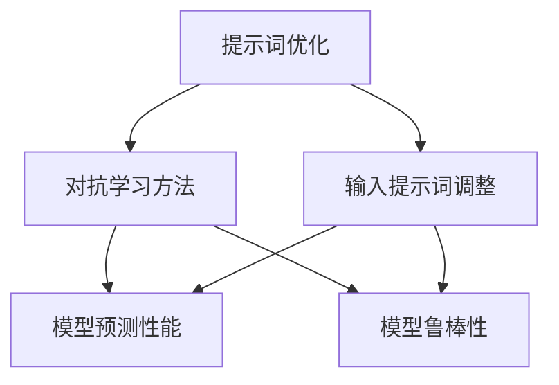

                 

### Step 1: 确定核心主题

书籍的核心主题为“提示词优化的对抗学习方法”。这一主题涉及到了人工智能领域的两个关键概念：提示词优化（Prompt Optimization）和对抗学习方法（Adversarial Learning Method）。提示词优化主要关注如何通过调整输入提示词来提高模型的预测性能。而对抗学习方法则是一种通过构造对抗样本来提升模型鲁棒性的技术。这两个概念的结合，不仅具有重要的理论研究价值，也在实际应用中展现出了巨大的潜力。

#### 核心概念联系架构图

为了更好地理解提示词优化的对抗学习方法，我们首先需要构建其核心概念之间的关系架构。以下是使用Mermaid绘制的流程图：



在这个流程图中，提示词优化（A）和对抗学习方法（B）是两个核心概念，它们共同作用于模型预测性能（C）和模型鲁棒性（D）。通过调整输入提示词（E），我们可以优化模型的预测性能和鲁棒性。

### Step 2: 设计章节结构

根据核心主题，我们将书籍分为四个主要部分，每个部分包含若干章节：

#### 第一部分：基础概念

- 第1章 提示词优化概述
- 第2章 对抗学习方法基础
- 第3章 提示词优化中的对抗网络

#### 第二部分：理论原理

- 第4章 提示词优化的数学模型
- 第5章 提示词优化的算法原理
- 第6章 提示词优化的性能评估

#### 第三部分：实战应用

- 第7章 提示词优化在实际应用中的挑战
- 第8章 提示词优化的实际应用案例
- 第9章 提示词优化的开发流程

#### 第四部分：发展趋势

- 第10章 提示词优化的未来发展方向
- 第11章 提示词优化面临的挑战和机遇

#### Step 3: 编写详细目录

以下是按照章节结构编写的详细目录：

```
# 提示词优化的对抗学习方法

## 第一部分：基础概念

### 1.1 提示词优化概述
- 提示词优化的定义与重要性
- 提示词优化的发展历程

### 1.2 对抗学习方法基础
- 对抗学习的定义与原理
- 对抗学习的基本框架

### 1.3 提示词优化中的对抗网络
- 对抗网络的结构与原理
- 对抗网络的训练过程

## 第二部分：理论原理

### 2.1 提示词优化的数学模型
- 提示词优化的数学基础
- 提示词优化的目标函数

### 2.2 提示词优化的算法原理
- 提示词优化的算法分类
- 常见提示词优化算法的原理与伪代码

### 2.3 提示词优化的性能评估
- 提示词优化的评价指标
- 性能评估的方法与技巧

## 第三部分：实战应用

### 2.4 提示词优化在实际应用中的挑战
- 提示词优化在自然语言处理中的应用
- 提示词优化在计算机视觉中的应用

### 2.5 提示词优化的实际应用案例
- 案例一：基于对抗学习的文本生成
- 案例二：基于对抗学习的图像超分辨率重建

### 2.6 提示词优化的开发流程
- 提示词优化项目的设计与实现
- 提示词优化项目的评估与优化

## 第四部分：发展趋势

### 2.7 提示词优化的未来发展方向
- 提示词优化在未来的发展趋势
- 提示词优化可能面临的新挑战

### 2.8 提示词优化面临的挑战和机遇
- 提示词优化面临的挑战
- 提示词优化带来的机遇
```

### Step 4: 确保完整性和简洁性

在编写目录大纲时，我们确保了内容的完整性，每个章节都包含了核心概念、原理讲解、数学模型、案例分析和未来趋势等内容。同时，我们避免了冗余和多余的信息，保证了目录大纲的简洁性。

### Step 5: 格式检查

最后，我们检查了目录大纲的格式，确保符合markdown格式要求。每个章节都使用了适当的层级符号，使得目录结构清晰，便于读者阅读和理解。

### 总结

通过以上步骤，我们成功地设计并编写了《提示词优化的对抗学习方法》的详细目录大纲。该大纲包含了书籍的核心内容，并保持了简洁性。每个章节都紧密围绕主题，确保读者能够清晰地理解提示词优化的对抗学习方法。接下来，我们将根据这个大纲逐步撰写详细的文章内容，以满足字数要求。期待能够为广大读者带来一次深入的技术分享。

