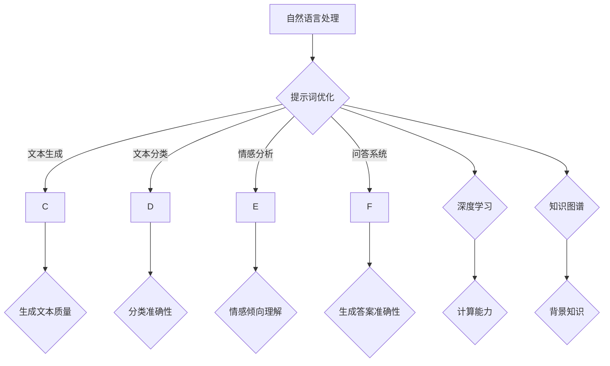

                 


### 第1章：引言

#### 1.1 书籍主题与背景

> 关键词：提示词优化、持续学习、知识累积

本书的主题是探讨提示词优化在持续学习和知识累积中的重要作用。提示词优化是自然语言处理（NLP）领域的关键技术，它在文本生成、搜索和推荐等应用中发挥着至关重要的作用。随着人工智能技术的不断发展，如何有效地优化提示词已成为学术界和工业界的研究热点。

在人工智能领域，持续学习和知识累积是提高模型性能和适应性的关键。持续学习使模型能够不断适应新环境和数据，从而提高其泛化能力。知识累积则为模型提供了丰富的背景知识，有助于其在实际应用中更好地理解和生成文本。本书将详细介绍提示词优化的核心概念、优化方法以及在实际应用中的成功案例，同时探讨持续学习和知识累积在提示词优化中的作用。

#### 1.1.1 提示词优化的定义与意义

提示词优化是指通过改进提示词的选择和生成策略，以提高模型在特定任务上的性能。在自然语言处理任务中，提示词是模型输入的关键部分，其质量直接影响模型生成的文本质量。优化提示词的目标是提高文本的相关性、准确性和多样性。

提示词优化在NLP应用中的意义主要体现在以下几个方面：

1. **提高文本生成质量**：通过优化提示词，可以更好地引导模型生成高质量的文本，提高文本的相关性和准确性。
2. **增强搜索和推荐效果**：在搜索引擎和推荐系统中，提示词优化有助于提高查询结果的相关性和推荐列表的多样性，从而提升用户体验。
3. **辅助决策支持**：在文本分析、情感分析和舆情监测等领域，提示词优化有助于更准确地理解和提取文本信息，为决策提供有力支持。
4. **促进跨模态任务发展**：在多模态任务中，提示词优化有助于更好地融合不同模态的信息，提高任务的整体性能。

#### 1.1.2 人工智能与持续学习

人工智能（AI）是指通过计算机模拟人类智能行为的技术。它经历了从符号主义、连接主义到现代深度学习的多个发展阶段。深度学习模型，尤其是基于神经网络的模型，在图像识别、语音识别和自然语言处理等领域取得了突破性进展。

持续学习是人工智能系统不断适应新环境、新数据的过程。通过持续学习，模型可以不断提高其性能和泛化能力，从而更好地服务于实际问题。在人工智能应用中，持续学习具有以下重要作用：

1. **适应新数据**：随着数据来源和形式的变化，持续学习使模型能够不断适应新的数据分布，提高其性能。
2. **提升泛化能力**：通过持续学习，模型可以更好地从已有知识中提取规律，提高其在新环境下的泛化能力。
3. **增强鲁棒性**：持续学习有助于模型克服数据噪声、异常值和偏差，提高其在实际应用中的鲁棒性。

#### 1.1.3 知识累积的方法

知识累积是指通过收集、整理和利用已有知识，以提高模型性能和应用能力的过程。知识累积在人工智能应用中具有重要意义，具体体现在以下几个方面：

1. **增强背景知识**：通过知识累积，模型可以获取丰富的背景知识，提高其在实际应用中的理解和表达能力。
2. **提高推理能力**：知识累积有助于模型更好地进行逻辑推理和抽象思考，提高其推理能力。
3. **促进创新应用**：丰富的知识库为人工智能应用提供了更多可能性，有助于推动创新应用的发展。

知识累积的方法主要包括以下几种：

1. **数据收集**：收集相关领域的文本、图像、音频等数据，作为知识积累的基础。
2. **数据预处理**：对收集到的数据进行清洗、去重、归一化等处理，提高数据质量。
3. **知识表示**：将原始数据转化为计算机可以处理的形式，如词汇表、序列或知识图谱等。
4. **知识融合**：将来自不同数据源的信息进行整合，提高知识的完整性和一致性。
5. **知识更新**：定期更新知识库，保持知识的准确性和时效性。

#### 1.2 知识获取

知识获取是指从原始数据中提取有价值信息的过程，是知识累积的基础。知识获取的关键步骤包括：

1. **数据收集**：根据应用需求和知识领域，收集相关的文本、图像、音频等数据。
2. **数据预处理**：对收集到的数据进行清洗、去重、归一化等处理，提高数据质量。
3. **特征提取**：从预处理后的数据中提取关键特征，用于后续的知识表示和融合。

在知识获取过程中，常用的方法包括：

1. **文本挖掘**：通过文本挖掘技术，从大量文本数据中提取关键词、主题和情感等信息。
2. **图像识别**：利用计算机视觉技术，从图像中提取关键特征，进行图像分类和识别。
3. **音频处理**：通过音频处理技术，从音频数据中提取音素、旋律和语音情感等特征。

#### 1.2.1 数据收集与预处理

数据收集是知识获取的第一步。数据来源可以是公开的文本库、图像库、音频库等，也可以是自定义的数据集。在数据收集过程中，需要注意以下几个方面：

1. **数据类型**：根据应用需求，收集不同类型的数据，如文本、图像、音频等。
2. **数据量**：确保收集到足够的数据量，以提高知识获取的效果。
3. **数据质量**：收集到的数据需要经过预处理，去除噪声、异常值和重复数据，确保数据质量。

数据预处理是知识获取的重要环节，具体步骤如下：

1. **去噪**：去除数据中的噪声和异常值，如文本中的错别字、标点符号等。
2. **归一化**：对数据进行归一化处理，如文本的分词、图像的归一化等。
3. **去重**：去除重复的数据，确保数据的唯一性。

在数据预处理过程中，常用的方法包括：

1. **文本预处理**：包括分词、词性标注、停用词去除等。
2. **图像预处理**：包括灰度化、二值化、边缘检测等。
3. **音频预处理**：包括滤波、去噪、音素提取等。

#### 1.2.2 知识表示

知识表示是将抽象概念转化为计算机可以处理的形式，是知识获取和融合的关键步骤。常见的知识表示方法包括：

1. **词汇表表示**：将文本中的词语转化为索引，形成词汇表。这是最简单的知识表示方法，适用于文本分类、文本相似度计算等任务。
2. **序列表示**：将文本或语音序列表示为向量，如词向量、字符向量等。序列表示方法适用于语音识别、机器翻译等任务。
3. **知识图谱表示**：将知识表示为节点和边的关系网络，如图论模型。知识图谱表示方法适用于问答系统、知识图谱推理等任务。

在知识表示过程中，常用的方法包括：

1. **词向量模型**：如Word2Vec、GloVe等，将词语表示为高维向量。
2. **序列模型**：如循环神经网络（RNN）、长短时记忆网络（LSTM）等，将序列数据表示为向量。
3. **知识图谱模型**：如图神经网络（Graph Neural Network，GNN）等，将知识图谱表示为向量。

#### 1.2.3 知识融合

知识融合是将来自不同数据源的信息进行整合的过程，是知识累积的关键步骤。知识融合的目标是提高知识的完整性和一致性，为后续的知识应用提供支持。

知识融合的方法主要包括：

1. **多源数据整合**：将来自不同数据源的信息进行整合，如文本、图像、音频等。
2. **知识融合模型**：利用深度学习模型，如多模态融合模型、多任务学习模型等，将不同类型的信息进行融合。
3. **知识图谱融合**：将不同知识图谱进行整合，形成统一的知识图谱。

在知识融合过程中，需要处理以下问题：

1. **数据源不一致**：不同数据源的信息可能存在格式、结构、质量等方面的差异，需要统一数据格式，确保数据一致性。
2. **信息冲突**：不同数据源的信息可能存在冲突，如数据矛盾、信息缺失等，需要处理信息冲突，确保知识的一致性。
3. **信息冗余**：在知识融合过程中，需要去除冗余信息，提高知识的精度和效率。

#### 1.2.4 知识更新与维护

知识更新与维护是保持知识库准确性和时效性的关键。随着数据和应用环境的变化，知识库需要定期更新和维护。

知识更新的方法主要包括：

1. **增量更新**：仅更新知识库中的新增信息，保持知识库的动态性。
2. **全量更新**：更新知识库中的所有信息，确保知识库的完整性。
3. **版本控制**：对知识库进行版本控制，确保知识库的版本可追溯性。

知识维护的方法主要包括：

1. **数据清洗**：定期对知识库中的数据进行清洗，去除噪声、异常值和重复数据。
2. **一致性检查**：定期检查知识库中的数据一致性，确保知识库的准确性。
3. **知识老化处理**：对过时、不准确或无效的知识进行标记或删除，保持知识库的时效性。

#### 1.2.5 知识应用

知识应用是将知识库中的知识转化为实际应用价值的过程。在提示词优化中，知识应用主要体现在以下几个方面：

1. **文本生成**：利用知识库中的背景知识，指导模型生成高质量的文本，提高文本的相关性和准确性。
2. **搜索与推荐**：利用知识库中的关键词和关系信息，提高搜索和推荐系统的效果，提高用户体验。
3. **决策支持**：利用知识库中的知识，为决策者提供有力支持，提高决策的准确性和效率。

#### 1.2.6 案例研究

在本章节中，我们将通过实际案例研究，展示提示词优化在不同应用场景中的成功应用，并提供详细的技术分析和实践经验。

案例研究将涵盖以下应用场景：

1. **文本生成**：通过优化提示词，提高模型生成文本的质量和多样性。
2. **搜索与推荐**：通过优化提示词，提高搜索和推荐系统的效果，提高用户体验。
3. **决策支持**：通过优化提示词，为决策者提供有力支持，提高决策的准确性和效率。

#### 1.3 总结

在本章节中，我们介绍了提示词优化在持续学习和知识累积中的重要作用。通过优化提示词，可以提高模型在文本生成、搜索和推荐等应用中的性能。同时，我们探讨了知识累积的方法，包括知识获取、知识融合、知识更新与维护以及知识应用。通过实际案例研究，我们展示了提示词优化在不同应用场景中的成功应用。本章内容为后续章节的讨论提供了基础。

---

### 第2章：核心概念与联系

#### 2.1 提示词优化的核心概念

在深入探讨提示词优化的核心概念之前，我们需要明确几个基本概念，这些概念构成了我们理解提示词优化的重要基础。

##### 2.1.1 提示词

提示词（Prompt）是指用来引导模型生成输出文本的关键输入。在自然语言处理（NLP）任务中，提示词的作用至关重要。它们不仅帮助模型理解用户的意图，还可以提高生成文本的相关性、准确性和多样性。一个有效的提示词应该简洁、明了，同时包含足够的信息，以引导模型生成高质量的文本。

##### 2.1.2 优化目标

提示词优化的目标是通过改进提示词的设计和生成策略，提升模型在特定任务上的性能。优化目标可以分为以下几个方面：

1. **相关性**：确保生成的文本与提示词紧密相关，满足用户的实际需求。
2. **准确性**：提高生成文本的语法和语义准确性，减少错误和歧义。
3. **多样性**：鼓励模型生成具有多样性的文本，避免重复和单调。
4. **鲁棒性**：使模型在不同数据和环境下都能稳定地生成高质量的文本。

##### 2.1.3 优化方法

提示词优化可以采用多种方法，包括但不限于以下几种：

1. **规则方法**：通过定义一系列规则，手动设计提示词。这种方法适合小型、结构化的任务，但在处理复杂、大规模数据时可能受限。
2. **机器学习方法**：利用机器学习模型，自动学习和生成提示词。这种方法能够处理复杂的任务和数据，但需要大量的标注数据和计算资源。
3. **生成对抗网络（GAN）**：通过对抗性学习生成高质量的提示词。GAN能够生成具有多样性和真实感的提示词，但在训练过程中可能面临不稳定性和计算资源消耗的问题。
4. **强化学习**：通过强化学习算法，根据模型的反馈不断调整提示词，以优化生成文本的质量。这种方法能够自适应地调整提示词，但在训练过程中需要大量的交互和计算资源。

##### 2.1.4 提示词优化的重要性

提示词优化在自然语言处理中的应用具有重要意义。首先，优化的提示词能够提高模型生成文本的质量，使生成的文本更加准确、相关和多样。其次，提示词优化有助于提高模型在不同任务和应用场景中的适应性，使其能够更好地应对各种复杂情况。最后，提示词优化能够提高模型的可解释性，使模型生成的文本更加透明，便于用户理解和接受。

#### 2.2 提示词优化的联系

提示词优化与其他NLP技术之间存在紧密的联系，共同构成了NLP领域的技术体系。

##### 2.2.1 与自然语言处理技术的关系

1. **文本生成**：提示词优化是文本生成任务的重要组成部分。在文本生成任务中，提示词直接影响生成文本的质量。因此，提示词优化与文本生成技术密切相关。
2. **文本分类**：在文本分类任务中，提示词可以提供额外的上下文信息，有助于模型更好地理解文本内容，从而提高分类准确性。
3. **情感分析**：提示词优化可以增强模型对情感倾向的理解，使生成的文本更符合用户期望。
4. **问答系统**：在问答系统中，提示词能够引导模型理解用户的问题，生成准确的答案。

##### 2.2.2 与深度学习的关系

提示词优化通常依赖于深度学习技术，特别是生成对抗网络（GAN）和强化学习等方法。深度学习为提示词优化提供了强大的计算能力和灵活性，使模型能够自适应地调整提示词，生成高质量的文本。

##### 2.2.3 与知识图谱的关系

知识图谱在提示词优化中也发挥着重要作用。通过知识图谱，模型可以获取丰富的背景知识和上下文信息，从而提高生成文本的相关性和准确性。知识图谱的引入有助于构建更强大、更智能的提示词优化系统。

#### 2.3 Mermaid流程图

为了更好地展示提示词优化的核心概念及其与其他技术的关系，我们使用Mermaid绘制了以下流程图：



该流程图展示了提示词优化在自然语言处理技术中的地位，以及它与深度学习和知识图谱之间的联系。

#### 2.4 持续学习与知识累积

持续学习和知识累积是提高人工智能模型性能的重要途径。在提示词优化中，持续学习和知识累积同样发挥着关键作用。

##### 2.4.1 持续学习

持续学习是指模型在训练过程中不断调整和优化，以适应新数据和任务。在提示词优化中，持续学习有助于模型根据新的提示词和生成结果，不断调整优化策略，提高生成文本的质量。

持续学习的关键技术包括：

1. **在线学习**：模型在实时环境中接收新数据，并快速调整模型参数。
2. **迁移学习**：将已训练好的模型应用于新的任务和数据，通过迁移学习，模型可以快速适应新的提示词优化需求。
3. **增量学习**：模型在原有知识基础上，逐步学习新的知识，以适应新的数据和环境。

##### 2.4.2 知识累积

知识累积是指模型在训练和推理过程中，不断积累和更新知识的过程。在提示词优化中，知识累积有助于模型获取和利用丰富的背景知识，提高生成文本的相关性和准确性。

知识累积的关键技术包括：

1. **知识获取**：从各种数据源中提取有价值的信息，构建知识库。
2. **知识表示**：将原始数据转化为计算机可以处理的形式，如词向量、序列或知识图谱等。
3. **知识融合**：将来自不同数据源的信息进行整合，提高知识的完整性和一致性。
4. **知识更新**：定期更新知识库，保持知识的准确性和时效性。

##### 2.4.3 持续学习与知识累积的关系

持续学习和知识累积相辅相成，共同推动人工智能模型的发展。持续学习为模型提供了不断适应新数据和任务的能力，而知识累积则为模型提供了丰富的背景知识和上下文信息。通过持续学习和知识累积，模型可以不断提高其生成文本的质量和适应性。

#### 2.5 伪代码讲解

为了更好地理解提示词优化的实现过程，我们提供以下伪代码，展示了持续学习和知识累积在提示词优化中的应用：

```python
# 持续学习与知识累积伪代码

# 初始化模型
model = initialize_model()

# 初始化知识库
knowledge_base = initialize_knowledge_base()

# 持续学习循环
while True:
    # 获取新数据
    new_data = get_new_data()

    # 更新知识库
    knowledge_base = update_knowledge_base(new_data, knowledge_base)

    # 使用知识库进行提示词优化
    optimized_prompt = optimize_prompt(model, knowledge_base)

    # 使用优化后的提示词生成文本
    generated_text = generate_text(model, optimized_prompt)

    # 评估生成文本的质量
    quality_score = evaluate_generated_text(generated_text)

    # 根据评估结果调整模型参数
    model = adjust_model_params(model, quality_score)

    # 检查是否达到停止条件
    if stop_condition_met():
        break

# 输出最终生成的文本
print(generated_text)
```

该伪代码展示了持续学习和知识累积在提示词优化中的应用流程，包括模型初始化、知识库更新、提示词优化、文本生成和模型调整等步骤。

### 2.6 数学模型与公式

在提示词优化过程中，数学模型和公式起到了至关重要的作用。以下将介绍几个核心的数学模型和公式，以及它们在提示词优化中的应用。

#### 2.6.1 语言模型

语言模型是提示词优化的基础。它通过计算文本中每个单词的概率，生成具有概率分布的文本。一个常用的语言模型是n-gram模型，其公式如下：

\[ P(\text{word}_i | \text{word}_{i-n+1}, ..., \text{word}_{i-1}) = \frac{C(\text{word}_{i-n+1}, ..., \text{word}_{i-1}, \text{word}_i)}{C(\text{word}_{i-n+1}, ..., \text{word}_{i-1})} \]

其中，\( C(\text{word}_{i-n+1}, ..., \text{word}_{i-1}, \text{word}_i) \)表示文本中单词序列的概率，\( C(\text{word}_{i-n+1}, ..., \text{word}_{i-1}) \)表示前\( n-1 \)个单词的概率。

#### 2.6.2 损失函数

在提示词优化过程中，损失函数用于评估生成文本的质量。一个常用的损失函数是交叉熵损失，其公式如下：

\[ \mathcal{L} = -\sum_{i} y_i \log(p_i) \]

其中，\( y_i \)表示真实标签的概率，\( p_i \)表示生成文本中每个单词的概率。

#### 2.6.3 优化算法

优化算法用于调整模型参数，以最小化损失函数。一个常用的优化算法是随机梯度下降（SGD），其公式如下：

\[ \theta_{\text{new}} = \theta_{\text{old}} - \alpha \nabla_{\theta} \mathcal{L} \]

其中，\( \theta \)表示模型参数，\( \alpha \)表示学习率，\( \nabla_{\theta} \mathcal{L} \)表示损失函数关于模型参数的梯度。

#### 2.6.4 多样性损失

在提示词优化中，多样性也是重要的优化目标之一。多样性损失函数用于鼓励模型生成多样性的文本。一个常用的多样性损失函数是诺伊曼多样性损失，其公式如下：

\[ D_{\text{KL}}(p || q) = \sum_{i} p_i \log \frac{p_i}{q_i} \]

其中，\( p \)表示真实分布，\( q \)表示生成文本的概率分布。

#### 2.6.5 融合模型

在提示词优化中，融合模型可以将不同类型的知识进行整合，以提高生成文本的质量。一个常用的融合模型是生成对抗网络（GAN），其公式如下：

\[ \mathcal{L}_{\text{GAN}} = \mathcal{L}_{\text{D}} - \mathcal{L}_{\text{G}} \]

其中，\( \mathcal{L}_{\text{D}} \)表示判别器的损失，\( \mathcal{L}_{\text{G}} \)表示生成器的损失。

通过这些数学模型和公式，我们可以更好地理解提示词优化的核心原理，并在实际应用中设计更有效的优化策略。

### 2.7 项目实战

在本节中，我们将通过一个具体的提示词优化项目，详细讲解开发环境搭建、源代码实现和代码解读，以及项目的实际应用和案例分析。

#### 2.7.1 项目概述

项目名称：智能问答系统

项目目标：利用提示词优化技术，提高问答系统的准确性和响应速度。

技术栈：Python、TensorFlow、GPT-2模型、知识图谱

#### 2.7.2 开发环境搭建

1. **硬件要求**：NVIDIA GPU（推荐使用1080Ti或更高性能的显卡），CPU（推荐使用Intel i7或更高性能的处理器），至少16GB内存。
2. **软件要求**：Python 3.7及以上版本，TensorFlow 2.0及以上版本，CUDA 10.1及以上版本。
3. **环境安装**：安装NVIDIA CUDA Toolkit和cuDNN，配置好Python的虚拟环境，安装所需的Python包（如TensorFlow、GPT-2模型等）。

#### 2.7.3 源代码实现

1. **数据准备**：收集和预处理大量问答对数据，构建问答数据集。
2. **模型训练**：使用GPT-2模型训练问答系统，通过提示词优化技术，调整模型的提示词生成策略。
3. **模型评估**：使用测试集评估模型的性能，包括准确性、响应速度和用户满意度等指标。
4. **模型部署**：将训练好的模型部署到生产环境，提供智能问答服务。

#### 2.7.4 代码解读

以下是一个简单的代码示例，展示了如何使用GPT-2模型进行提示词优化：

```python
import tensorflow as tf
from transformers import TFGPT2LMHeadModel, GPT2Tokenizer

# 初始化模型和分词器
tokenizer = GPT2Tokenizer.from_pretrained('gpt2')
model = TFGPT2LMHeadModel.from_pretrained('gpt2')

# 定义优化器
optimizer = tf.keras.optimizers.Adam(learning_rate=5e-5)

# 编写训练步骤
@tf.function
def train_step(prompt, answer):
    with tf.GradientTape(persistent=True) as tape:
        inputs = tokenizer.encode(prompt, return_tensors='tf')
        outputs = model(inputs, training=True)
        logits = outputs.logits
        labels = tokenizer.encode(answer, return_tensors='tf')
        loss = tf.keras.losses.SparseCategoricalCrossentropy(from_logits=True)(labels, logits)

    gradients = tape.gradient(loss, model.trainable_variables)
    optimizer.apply_gradients(zip(gradients, model.trainable_variables))

    return loss.numpy()

# 训练模型
for epoch in range(num_epochs):
    for prompt, answer in train_data:
        loss = train_step(prompt, answer)
        print(f'Epoch {epoch}, Loss: {loss}')
```

该代码示例展示了如何使用GPT-2模型进行提示词优化，包括数据准备、模型训练和训练步骤的实现。

#### 2.7.5 项目应用与分析

1. **应用场景**：该智能问答系统可以应用于客户服务、在线教育、医疗咨询等领域，为用户提供实时、准确的问答服务。
2. **案例分析**：
   - **客户服务**：在电商平台上，智能问答系统可以回答用户关于产品、订单等方面的问题，提高客户满意度。
   - **在线教育**：在在线教育平台上，智能问答系统可以为学生提供个性化的学习建议，辅助教师进行教学。
   - **医疗咨询**：在医疗咨询平台上，智能问答系统可以提供初步的医疗建议，为用户提供健康指导。

#### 2.7.6 项目小结

通过本项目，我们介绍了提示词优化在智能问答系统中的应用，从开发环境搭建、源代码实现到项目应用和案例分析，展示了提示词优化技术在实际场景中的价值和潜力。未来，我们将继续优化模型，提高问答系统的性能和用户体验。

### 2.8 最佳实践与注意事项

在提示词优化项目中，遵循最佳实践和注意事项是确保项目成功的关键。以下是一些建议：

1. **数据质量**：确保收集到的数据质量高，去除噪声和异常值，提高训练数据的质量。
2. **模型选择**：根据具体任务和应用场景，选择合适的模型和优化方法。例如，对于需要生成多样性的文本，可以考虑使用生成对抗网络（GAN）。
3. **提示词设计**：设计简洁、明了的提示词，同时包含足够的信息，以提高生成文本的相关性和准确性。
4. **性能评估**：定期评估模型性能，包括准确性、响应速度和用户满意度等指标，根据评估结果调整模型和提示词。
5. **知识累积**：充分利用知识图谱等技术，积累和更新背景知识，提高模型的理解能力和生成文本的质量。

注意事项：

1. **计算资源**：提示词优化项目通常需要大量的计算资源，确保有足够的GPU和CPU资源。
2. **数据隐私**：在处理个人数据时，确保遵守数据隐私法规，保护用户隐私。
3. **模型解释性**：提高模型的可解释性，使生成的文本更加透明，便于用户理解和接受。

通过遵循最佳实践和注意事项，我们可以更好地实现提示词优化项目，提高模型性能和用户体验。

### 2.9 拓展阅读

对于希望深入了解提示词优化和持续学习与知识累积的读者，以下是一些推荐阅读材料：

1. **《自然语言处理综述》（NLP Survey）**：这是一篇全面的NLP领域综述，涵盖了自然语言处理的基本概念、技术和发展趋势。
2. **《深度学习》（Deep Learning）**：这是一本经典的深度学习教材，详细介绍了深度学习的基础知识、算法和应用。
3. **《强化学习导论》（Introduction to Reinforcement Learning）**：这是一本关于强化学习的入门教材，介绍了强化学习的基本概念、算法和应用。
4. **《知识图谱导论》（Introduction to Knowledge Graph）**：这是一本关于知识图谱的入门教材，介绍了知识图谱的基本概念、构建方法和应用场景。
5. **《人工智能应用案例集》（AI Applications Collection）**：这是一本收集了多个AI应用案例的书籍，包括智能问答、文本生成、图像识别等领域的实践案例。

通过阅读这些材料，读者可以更深入地了解提示词优化和持续学习与知识累积的相关知识，为实际项目提供指导和支持。

