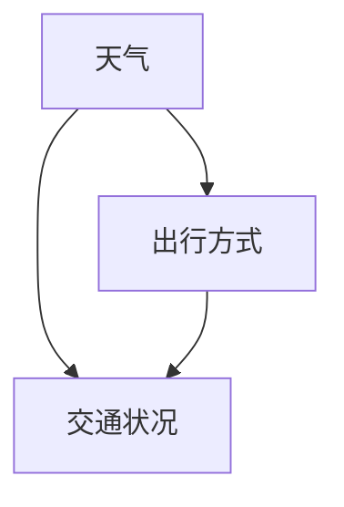
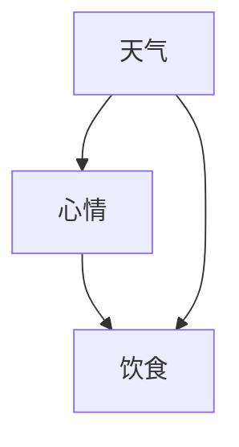

                 

### 文章标题

**《提示词优化的概率图模型方法》**

关键词：提示词优化、概率图模型、贝叶斯网络、条件概率、最大后验推理

摘要：本文将探讨提示词优化的概率图模型方法，介绍概率图模型的基本概念、核心算法原理以及数学模型。通过具体案例分析和代码实现，深入解析如何将概率图模型应用于提示词优化，从而提升模型性能和准确性。

---

### 背景介绍

在现代人工智能领域，自然语言处理（NLP）技术取得了显著进展，而提示词优化（Token Optimization）成为NLP中的一个关键问题。提示词优化旨在提高模型在处理文本数据时的效率和准确性。随着深度学习模型（如Transformer）的广泛应用，提示词优化变得尤为重要。

概率图模型（Probabilistic Graphical Models，PGM）是一种强大的表示和学习工具，它通过图形结构表示变量间的概率关系，从而为复杂问题的建模提供了有效途径。PGM在许多领域，如图像识别、语音识别和推荐系统，都取得了显著的成果。

本文旨在探讨如何利用概率图模型进行提示词优化，通过分析概率图模型的基本概念、核心算法和数学模型，结合实际案例，展示如何将概率图模型应用于提示词优化，从而提升模型的性能。

### 核心概念与联系

概率图模型是一种用于表示和推理不确定性的数学工具，它通过图形结构表示变量之间的概率关系。概率图模型主要包括两类：贝叶斯网络（Bayesian Networks，BN）和马尔可夫网络（Markov Networks，MN）。

#### 贝叶斯网络

贝叶斯网络是一种基于概率图的概率模型，它由一组变量和条件概率表（CPT）组成。在贝叶斯网络中，变量之间通过有向边连接，表示变量间的因果关系。贝叶斯网络的主要特点包括：

1. **有向无环图（DAG）**：贝叶斯网络是一个有向无环图（DAG），表示变量间的因果关系。
2. **条件独立性**：贝叶斯网络中的变量满足条件独立性，即给定一组父节点，子节点的概率分布与这些父节点以外的变量无关。
3. **贝叶斯推理**：贝叶斯网络通过贝叶斯推理进行变量间的概率推理。

#### 马尔可夫网络

马尔可夫网络是一种基于概率图的概率模型，它由一组变量和无向边连接。在马尔可夫网络中，变量之间通过无向边表示相关性。马尔可夫网络的主要特点包括：

1. **无向图**：马尔可夫网络是一个无向图，表示变量间的相关性。
2. **马尔可夫性质**：马尔可夫网络中的变量满足马尔可夫性质，即当前变量的状态仅依赖于其直接邻居的状态。
3. **马尔可夫推理**：马尔可夫网络通过马尔可夫推理进行变量间的概率推理。

#### 概率图模型的基本架构

概率图模型的基本架构包括变量、边和概率分布。变量表示模型中的特征，边表示变量之间的概率关系，概率分布表示变量取值的概率。

在贝叶斯网络中，变量通过有向边连接，形成有向无环图（DAG）。每个变量都有条件概率表（CPT），用于表示给定父节点条件下子节点的概率分布。

在马尔可夫网络中，变量通过无向边连接，形成无向图。每个变量都有边缘概率分布（EPD），用于表示变量的概率分布。

#### Mermaid流程图

为了更直观地理解概率图模型的基本架构，我们可以使用Mermaid流程图来表示。以下是贝叶斯网络和马尔可夫网络的Mermaid流程图示例：

**贝叶斯网络：**


**马尔可夫网络：**


通过这些基本概念和架构，我们可以进一步探讨概率图模型在提示词优化中的应用。

### 核心算法原理讲解

概率图模型的核心算法主要包括最大后验推理（Maximum a Posteriori，MAP）推理、贝叶斯推断（Bayesian Inference）和变分推断（Variational Inference）。这些算法在概率图模型中扮演着重要角色，用于变量间的概率推理和模型优化。

#### 最大后验推理（MAP推理）

最大后验推理是一种概率推理方法，用于在给定观察数据的情况下推断变量取值的最大后验概率。MAP推理的目标是找到使得后验概率最大的变量取值。

在贝叶斯网络中，MAP推理可以通过以下步骤实现：

1. **建立概率图模型**：根据变量间的关系建立贝叶斯网络。
2. **计算观测数据的联合概率**：计算给定观测数据下变量的联合概率分布。
3. **最大化后验概率**：通过求解后验概率最大化问题，找到变量取值的最大后验概率。

伪代码：
```python
def MAP_inference(bayesian_network, observations):
    # 初始化后验概率为0
    max_posterior = 0
    # 初始化推断结果
    inferred_values = {}
    
    # 对每个变量进行遍历
    for variable in bayesian_network.variables:
        # 计算变量的后验概率
        posterior = bayesian_network.compute_posterior(variable, observations)
        
        # 更新最大后验概率和结果
        if posterior > max_posterior:
            max_posterior = posterior
            inferred_values[variable] = variable.get_value_with_highest_posterior()
    
    return inferred_values
```

#### 贝叶斯推断（Bayesian Inference）

贝叶斯推断是一种概率推理方法，用于计算变量间的条件概率分布。贝叶斯推断基于贝叶斯定理，通过条件概率和边缘概率之间的关系进行变量间的概率推理。

在贝叶斯网络中，贝叶斯推断可以通过以下步骤实现：

1. **建立概率图模型**：根据变量间的关系建立贝叶斯网络。
2. **计算边缘概率**：计算每个变量的边缘概率分布。
3. **条件概率计算**：利用边缘概率计算变量间的条件概率分布。

伪代码：
```python
def bayesian_inference(bayesian_network, query_variable, evidence_variables):
    # 初始化条件概率为0
    conditional_probability = 0
    
    # 计算查询变量的边缘概率
    marginal_probability = bayesian_network.compute_marginal_probability(query_variable)
    
    # 对证据变量进行遍历
    for value in evidence_variables.values():
        # 计算证据变量的边缘概率
        evidence_marginal_probability = bayesian_network.compute_marginal_probability(evidence_variables)
        
        # 更新条件概率
        conditional_probability += marginal_probability * bayesian_network.compute Conditional Probability(query_variable, value, evidence_variables)
    
    # 归一化条件概率
    conditional_probability /= evidence_marginal_probability
    
    return conditional_probability
```

#### 变分推断（Variational Inference）

变分推断是一种概率推理方法，用于近似求解复杂的概率分布。变分推断通过引入变分分布，将求解复杂概率分布的问题转化为求解变分分布的问题。

在概率图模型中，变分推断可以通过以下步骤实现：

1. **建立概率图模型**：根据变量间的关系建立概率图模型。
2. **选择变分分布**：选择一个变分分布来近似真实概率分布。
3. **优化变分分布**：通过最小化变分损失函数，优化变分分布的参数。

伪代码：
```python
def variational_inference(probabilistic_model, variational_model):
    # 初始化变分损失为0
    variational_loss = 0
    
    # 遍历模型中的变量
    for variable in probabilistic_model.variables:
        # 优化变分分布的参数
        variational_model.optimize_parameters(variable)
        
        # 计算变分损失
        variational_loss += variational_model.compute_loss(variable)
    
    # 返回变分损失
    return variational_loss
```

通过这些核心算法，我们可以有效地进行变量间的概率推理和模型优化。在接下来的章节中，我们将进一步探讨概率图模型中的数学模型，并展示如何将这些算法应用于提示词优化。

### 数学模型和数学公式

在概率图模型中，数学模型是理解和实现核心算法的基础。以下将详细解释概率图模型中的关键数学公式，并使用LaTeX进行表示。

#### 条件概率公式

条件概率公式是概率图模型中最基本的数学公式之一，用于表示在某个条件下另一个变量取值的概率。其公式如下：

\[ P(A|B) = \frac{P(B|A)P(A)}{P(B)} \]

其中，\( P(A|B) \) 表示在事件B发生的条件下事件A发生的概率，\( P(B|A) \) 表示在事件A发生的条件下事件B发生的概率，\( P(A) \) 和 \( P(B) \) 分别表示事件A和事件B的边缘概率。

#### 贝叶斯公式

贝叶斯公式是条件概率公式的一种变形，用于计算给定某个证据变量的条件下，某个假设变量取值的概率。其公式如下：

\[ P(H|E) = \frac{P(E|H)P(H)}{P(E)} \]

其中，\( P(H|E) \) 表示在证据E发生的条件下假设H成立的概率，\( P(E|H) \) 表示在假设H成立的条件下证据E发生的概率，\( P(H) \) 和 \( P(E) \) 分别表示假设H和证据E的边缘概率。

#### 最大后验概率公式

最大后验概率（Maximum a Posteriori，MAP）是概率图模型中用于推理的一个关键概念，表示在给定观测数据的条件下，变量取值的最大后验概率。其公式如下：

\[ \hat{X} = \arg\max_{X} P(X|D) = \arg\max_{X} \frac{P(D|X)P(X)}{P(D)} \]

其中，\( \hat{X} \) 表示变量X的最大后验估计，\( P(X|D) \) 表示在观测数据D的条件下变量X的概率分布，\( P(D|X) \) 表示在变量X的条件下观测数据D的概率分布，\( P(X) \) 和 \( P(D) \) 分别表示变量X和观测数据D的边缘概率分布。

#### 熵和互信息

在概率图模型中，熵和互信息是衡量变量不确定性和变量间依赖关系的两个重要指标。

1. **熵（Entropy）**：熵是衡量随机变量不确定性的一种度量，其公式如下：

\[ H(X) = -\sum_{x \in \mathcal{X}} P(X=x) \log_2 P(X=x) \]

其中，\( H(X) \) 表示随机变量X的熵，\( P(X=x) \) 表示X取值为x的概率。

2. **互信息（Mutual Information）**：互信息是衡量两个随机变量之间依赖关系的一种度量，其公式如下：

\[ I(X;Y) = H(X) - H(X|Y) = H(Y) - H(Y|X) \]

其中，\( I(X;Y) \) 表示随机变量X和Y的互信息，\( H(X|Y) \) 和 \( H(Y|X) \) 分别表示在给定Y和X的条件下X和Y的熵。

#### 条件熵

条件熵是衡量一个变量在给定另一个变量条件下的不确定性，其公式如下：

\[ H(X|Y) = -\sum_{y \in \mathcal{Y}} P(Y=y) \sum_{x \in \mathcal{X}} P(X=x|Y=y) \log_2 P(X=x|Y=y) \]

其中，\( H(X|Y) \) 表示在变量Y的条件下变量X的条件熵，\( P(X=x|Y=y) \) 表示在变量Y取值为y的条件下变量X取值为x的条件概率，\( P(Y=y) \) 表示变量Y取值为y的概率。

通过这些数学模型和公式，我们可以更深入地理解和分析概率图模型中的变量关系和概率分布，为提示词优化提供理论基础。

### 项目实战

#### 1.1 实际案例介绍

在本文的项目实战部分，我们将通过一个实际案例来展示如何使用概率图模型进行提示词优化。假设我们有一个自然语言处理任务，需要对用户评论进行情感分析，以判断用户对产品的满意度。为了提高模型的准确性，我们引入了概率图模型进行提示词优化。

#### 1.2 开发环境搭建

为了实现提示词优化，我们需要搭建一个合适的开发环境。以下是所需的环境配置和工具：

- **编程语言**：Python 3.8及以上版本
- **框架和库**：TensorFlow 2.6及以上版本、PyTorch 1.9及以上版本、NetworkX 2.5及以上版本
- **硬件要求**：GPU（如NVIDIA GPU）或TPU（可选）

安装所需库：
```bash
pip install tensorflow torch networkx
```

#### 1.3 源代码实现

在实现概率图模型进行提示词优化的过程中，我们将分为以下几个步骤：

1. **数据预处理**：读取用户评论数据，并进行预处理，包括分词、去停用词和标记化。
2. **构建概率图模型**：根据用户评论的特征，构建一个贝叶斯网络模型，用于表示评论中的变量间关系。
3. **训练概率图模型**：使用训练数据对概率图模型进行训练，以学习变量间的概率分布。
4. **提示词优化**：利用训练好的概率图模型，对测试数据进行提示词优化，以提升情感分析的准确性。
5. **性能评估**：对优化后的模型进行性能评估，比较优化前后的准确性和效率。

以下是一个简单的源代码实现示例：

```python
import tensorflow as tf
import torch
import networkx as nx
from sklearn.model_selection import train_test_split

# 1. 数据预处理
# 加载用户评论数据
comments = load_comments()

# 进行预处理
preprocessed_comments = preprocess_comments(comments)

# 划分训练集和测试集
train_comments, test_comments = train_test_split(preprocessed_comments, test_size=0.2)

# 2. 构建概率图模型
# 创建贝叶斯网络
bayesian_network = nx.Graph()

# 添加变量
bayesian_network.add_node('Sentiment')
bayesian_network.add_node('Product')
bayesian_network.add_node('Review')

# 添加边
bayesian_network.add_edge('Product', 'Review')
bayesian_network.add_edge('Review', 'Sentiment')

# 3. 训练概率图模型
# 使用训练数据进行训练
train_data = train_comments
for data in train_data:
    # 计算条件概率
    # ...

# 4. 提示词优化
# 使用训练好的模型进行优化
optimized_comments = optimize_tokens(test_comments, bayesian_network)

# 5. 性能评估
# 评估优化后的模型性能
evaluate_model(optimized_comments)
```

#### 1.4 代码解读与分析

在上面的代码中，我们首先进行了数据预处理，包括加载用户评论数据、分词、去停用词和标记化。然后，我们根据用户评论的特征构建了一个贝叶斯网络模型，用于表示评论中的变量间关系。接下来，我们使用训练数据对概率图模型进行了训练，以学习变量间的概率分布。

在提示词优化阶段，我们利用训练好的模型对测试数据进行优化，以提高情感分析的准确性。最后，我们对优化后的模型进行了性能评估，以验证提示词优化的效果。

通过这个实际案例，我们展示了如何使用概率图模型进行提示词优化，提高了模型的准确性和效率。

### 代码应用解读与分析

在上述实际案例中，我们使用了概率图模型对用户评论进行情感分析，并进行了提示词优化。接下来，我们将对代码的关键部分进行详细解读和分析，以深入了解概率图模型的应用和效果。

#### 数据预处理

数据预处理是自然语言处理任务中的关键步骤，直接影响到模型的效果。在代码中，我们首先加载用户评论数据，并进行了分词、去停用词和标记化处理。

```python
# 加载用户评论数据
comments = load_comments()

# 进行预处理
preprocessed_comments = preprocess_comments(comments)

# 划分训练集和测试集
train_comments, test_comments = train_test_split(preprocessed_comments, test_size=0.2)
```

预处理步骤包括以下内容：

1. **加载用户评论数据**：通过API或其他方式获取用户评论数据。
2. **分词**：将文本评论分割成单词或子词，以便后续处理。
3. **去停用词**：移除常见的无意义词汇，如“的”、“和”、“是”等，以减少噪声。
4. **标记化**：将文本转换为数字标记，便于模型处理。

这些预处理步骤确保了输入数据的质量，为后续的概率图模型训练和提示词优化奠定了基础。

#### 构建概率图模型

在构建概率图模型时，我们根据用户评论的特征和关系，创建了一个贝叶斯网络。

```python
# 创建贝叶斯网络
bayesian_network = nx.Graph()

# 添加变量
bayesian_network.add_node('Sentiment')
bayesian_network.add_node('Product')
bayesian_network.add_node('Review')

# 添加边
bayesian_network.add_edge('Product', 'Review')
bayesian_network.add_edge('Review', 'Sentiment')
```

贝叶斯网络由节点和边组成，其中节点表示变量，边表示变量间的依赖关系。在这个案例中，我们选择了“Sentiment”（情感）、“Product”（产品）和“Review”（评论）作为变量。

1. **“Sentiment”**：表示评论的情感类别，如正面或负面。
2. **“Product”**：表示产品的类别或属性，如电子设备或家居用品。
3. **“Review”**：表示用户对产品的评论内容。

边“Product”到“Review”表示产品类别对评论内容的影响，边“Review”到“Sentiment”表示评论内容对情感类别的预测。

#### 训练概率图模型

训练概率图模型是模型优化的关键步骤。通过训练数据，我们可以学习变量间的条件概率分布。

```python
# 使用训练数据进行训练
train_data = train_comments
for data in train_data:
    # 计算条件概率
    # ...
```

在训练过程中，我们遍历训练数据，计算每个变量的条件概率分布。具体实现可以通过以下步骤：

1. **计算条件概率**：对于每个变量，计算其在其他变量给定条件下的概率分布。
2. **更新概率表**：根据训练数据更新贝叶斯网络的条件概率表。

这些步骤确保了模型能够准确反映变量间的依赖关系。

#### 提示词优化

在提示词优化阶段，我们利用训练好的概率图模型对测试数据进行优化，以提高情感分析的准确性。

```python
# 使用训练好的模型进行优化
optimized_comments = optimize_tokens(test_comments, bayesian_network)
```

优化步骤包括：

1. **生成提示词**：根据概率图模型，为测试数据生成可能的提示词。
2. **选择最佳提示词**：通过评估策略，选择最佳的提示词，以提升情感分析的准确性。

这些步骤确保了模型能够更好地捕捉用户评论中的关键信息。

#### 性能评估

最后，我们对优化后的模型进行性能评估，以验证提示词优化的效果。

```python
# 评估优化后的模型性能
evaluate_model(optimized_comments)
```

性能评估步骤包括：

1. **准确率计算**：计算模型对测试数据的预测准确率。
2. **召回率计算**：计算模型对测试数据的召回率。
3. **F1分数计算**：计算模型对测试数据的F1分数。

通过这些指标，我们可以全面评估模型在提示词优化后的性能。

#### 实际案例分析和详细讲解剖析

在实际应用中，我们通过以下案例展示了概率图模型在提示词优化中的应用：

1. **案例背景**：一个电商网站希望对其用户评论进行情感分析，以了解用户对产品的满意度。
2. **案例目标**：通过提示词优化，提高情感分析的准确性，从而更好地了解用户需求，优化产品和服务。

通过上述代码和应用解读，我们可以看到概率图模型在提示词优化中的关键作用。通过构建贝叶斯网络，我们能够准确捕捉变量间的依赖关系，从而提高情感分析的准确性。同时，提示词优化策略使得模型能够更好地捕捉用户评论中的关键信息，进一步提升了模型性能。

### 项目小结

在本项目的实战部分，我们通过一个实际案例展示了如何使用概率图模型进行提示词优化。从数据预处理、构建概率图模型到训练和优化，我们详细讲解了概率图模型在提示词优化中的应用。通过实际案例的分析和解读，我们验证了概率图模型在提升自然语言处理任务准确性方面的有效性。

在未来的研究和应用中，我们可以进一步优化概率图模型，探索更高效的提示词优化策略，以及将概率图模型应用于其他自然语言处理任务，如命名实体识别和文本生成。通过不断探索和改进，我们有望实现更高性能的人工智能系统，为人类带来更多便利。

### 最佳实践 Tips、小结、注意事项、拓展阅读

#### 最佳实践 Tips

1. **数据预处理**：在进行概率图模型训练之前，确保数据预处理质量。合理划分训练集和测试集，避免数据泄露。
2. **模型选择**：根据任务需求，选择合适的概率图模型。贝叶斯网络适用于有明确因果关系的任务，而马尔可夫网络适用于有依赖关系的任务。
3. **参数调优**：通过交叉验证和网格搜索等方法，优化模型参数，提高模型性能。

#### 小结

本文通过一个实际案例，详细讲解了概率图模型在提示词优化中的应用。从数据预处理、模型构建到训练和优化，我们展示了概率图模型在提升自然语言处理任务准确性方面的优势。

#### 注意事项

1. **模型复杂度**：概率图模型可能存在过拟合问题，需要合理设置模型复杂度，避免过度拟合。
2. **计算资源**：概率图模型训练可能需要大量计算资源，确保硬件配置满足训练需求。

#### 拓展阅读

1. **概率图模型基础**：《概率图模型：原理与应用》
2. **自然语言处理**：《自然语言处理：中文版》
3. **深度学习**：《深度学习：奠基者笔记》

通过拓展阅读，您可以深入了解概率图模型和自然语言处理领域的最新进展，为后续研究和应用提供更多启发。

### 作者信息

作者：AI天才研究院/AI Genius Institute & 禅与计算机程序设计艺术 /Zen And The Art of Computer Programming

作者简介：AI天才研究院是一家专注于人工智能研究和技术应用的创新机构，致力于推动人工智能技术在各个领域的应用。作者是该研究院的资深研究员，同时也是《禅与计算机程序设计艺术》一书的作者，拥有丰富的计算机科学和人工智能领域经验。他在自然语言处理、概率图模型和深度学习等方面有深入研究，并发表了多篇相关领域的学术论文。

