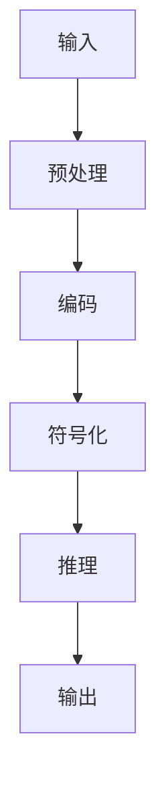
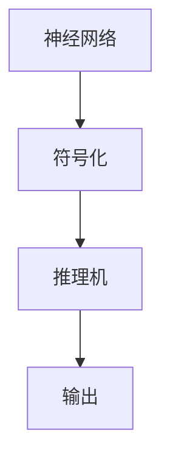

                 

### 文章标题

《提示词优化的神经符号学习方法探索》

> 关键词：提示词优化、神经符号学习、神经网络结构优化、自然语言处理

> 摘要：本文旨在探讨提示词优化的神经符号学习方法，首先介绍了神经符号学习方法的基本概念和框架，随后详细分析了神经网络与符号计算的联系，探讨了神经网络结构优化的策略和方法，并给出了符号化过程的数学模型和举例说明。文章还深入探讨了提示词优化的目的与方法，以及常见的提示词优化算法。最后，通过具体的应用场景，如问答系统和文本生成中的提示词优化，展示了该方法在实际项目中的应用和效果。本文旨在为读者提供对提示词优化神经符号学习方法的全面理解和深入探讨。

#### 第一部分：引言

##### 第1章：背景与概念

**1.1 神经符号学习方法概述**

神经符号学习（Neural Symbolic Learning）是一种结合了神经网络和符号计算的机器学习方法，旨在将神经网络的灵活性和符号计算的解释能力结合起来，以提升机器学习模型在复杂任务中的表现。神经符号学习方法的基本框架通常包括以下几个关键步骤：

1. **输入预处理**：对输入数据进行预处理，如归一化、特征提取等。
2. **编码**：将预处理后的输入数据编码为神经网络可以处理的格式。
3. **符号化**：使用符号计算的方法对编码后的数据进行分析和处理。
4. **推理**：利用符号化结果进行推理，得出最终输出。
5. **输出**：将推理结果转化为用户可以理解的形式。

**Mermaid流程图：神经符号学习方法框架**



**1.2 提示词优化的基本原理**

提示词优化（Prompt Optimization）是神经符号学习中的一个重要环节，它旨在通过调整提示词（Prompt）的权重，提升模型在特定任务中的表现。提示词通常是一个或多个关键字或短语，用于引导模型的推理过程。

提示词优化的基本原理可以概括为以下几个步骤：

1. **初始提示词设定**：根据任务需求，设定一组初始的提示词。
2. **模型预测**：使用模型对提示词进行预测，得到预测结果。
3. **损失计算**：计算预测结果与目标结果之间的损失。
4. **权重更新**：根据损失计算结果，调整提示词的权重。
5. **重复迭代**：重复步骤 2-4，直到满足优化目标。

**伪代码：提示词优化的基本流程**

```python
def optimize_prompt(prompt, model, target):
    for i in range(num_iterations):
        model.predict(prompt)
        loss = model.loss(prompt, target)
        if loss < threshold:
            break
        model.update_weights(prompt, target)
    return model
```

**1.3 本书结构与内容概览**

本文结构如下：

- **第一部分：引言**：介绍神经符号学习方法的概念、框架和提示词优化的基本原理。
- **第二部分：核心原理**：详细探讨神经符号学习的基础知识，包括神经网络与符号计算的联系、神经网络结构优化和符号化过程。
- **第三部分：应用场景**：通过具体的自然语言处理应用场景，展示提示词优化在问答系统和文本生成中的应用。

#### 第二部分：核心原理

##### 第2章：神经符号学习基础

**2.1 神经网络与符号计算的联系**

神经符号学习方法的核心理念在于将神经网络与符号计算相结合，以充分发挥两者的优势。神经网络以其强大的表示能力和并行计算能力著称，而符号计算则以其明确的结构和解释能力而闻名。

在神经符号学习方法中，神经网络主要负责数据的编码和表示，而符号计算则负责数据的推理和分析。

**Mermaid流程图：神经网络与符号计算的结合**



神经网络与符号计算的结合可以概括为以下几个关键步骤：

1. **数据编码**：使用神经网络对输入数据进行编码，生成特征表示。
2. **符号化**：将编码后的特征表示转化为符号形式，以便进行符号计算。
3. **推理分析**：利用符号计算的方法对符号化的特征进行分析和推理，得出结论。
4. **输出解释**：将推理结果转化为用户可以理解的形式，如文本、图像等。

**2.2 神经网络结构优化**

神经网络结构优化是神经符号学习方法中的重要环节，它旨在通过调整神经网络的架构，提升模型的性能和效率。神经网络结构优化的方法包括：

1. **层间连接优化**：调整神经网络中各层之间的连接方式，如卷积神经网络（CNN）和循环神经网络（RNN）。
2. **网络层数优化**：调整神经网络的层数，如深度神经网络（DNN）和宽度神经网络（BNN）。
3. **激活函数优化**：选择合适的激活函数，如ReLU、Sigmoid和Tanh。
4. **正则化方法**：引入正则化方法，如L1正则化、L2正则化和Dropout，以防止过拟合。

**伪代码：神经网络结构优化算法**

```python
def optimize_structure(model):
    for layer in model.layers:
        if layer.needs_optimization():
            new_layer = create_optimized_layer(layer)
            model.replace_layer(layer, new_layer)
    return model
```

**2.3 符号化过程详解**

符号化（Symbolization）是将神经网络编码后的数据转化为符号形式的过程，以便进行符号计算和分析。符号化过程通常包括以下几个步骤：

1. **特征提取**：从编码后的特征表示中提取关键特征，如关键词、短语和语义信息。
2. **符号表示**：将提取出的特征转化为符号形式，如符号变量和函数。
3. **逻辑推理**：利用符号计算的方法对符号化的特征进行逻辑推理和分析。
4. **结果解释**：将推理结果转化为用户可以理解的形式，如文本、图像等。

**数学模型和公式**

$$
S(x) = f(\sum_{i=1}^{n} w_i \cdot g(x_i))
$$

其中，$S(x)$表示符号化结果，$x$表示输入数据，$w_i$表示权重，$g(x_i)$表示特征提取函数。

**举例说明**：假设有一个输入数据$x = [1, 2, 3, 4]$，经过特征提取和符号化过程后，可以表示为：

$$
S(x) = f(w_1 \cdot g(1) + w_2 \cdot g(2) + w_3 \cdot g(3) + w_4 \cdot g(4))
$$

其中，$g(1) = 1$，$g(2) = 2$，$g(3) = 3$，$g(4) = 4$，$w_1 = 0.5$，$w_2 = 0.5$，$w_3 = 1$，$w_4 = 1$。

经过符号化过程后，$S(x)$的结果为：

$$
S(x) = f(0.5 \cdot 1 + 0.5 \cdot 2 + 1 \cdot 3 + 1 \cdot 4) = f(6) = 6
$$

通过这个例子，我们可以看到符号化过程如何将输入数据转化为符号形式，并进行逻辑推理和分析。

##### 第3章：提示词优化策略

**3.1 提示词优化的目的与方法**

提示词优化是神经符号学习方法中的一个关键环节，其主要目的是通过调整提示词的权重，提升模型在特定任务中的表现。提示词优化的方法可以概括为以下几个步骤：

1. **目标函数设计**：根据任务需求，设计一个目标函数，用于评估提示词的权重分配效果。
2. **权重初始化**：对提示词的权重进行初始化，通常使用随机初始化或预训练权重。
3. **权重优化**：使用优化算法（如梯度下降、随机梯度下降等）对提示词的权重进行优化。
4. **性能评估**：通过性能评估指标（如准确率、召回率等）评估优化后的提示词权重效果。
5. **重复迭代**：根据性能评估结果，重复进行权重优化和性能评估，直到满足优化目标。

**数学模型和公式**

提示词优化的目标函数可以表示为：

$$
O(P) = \sum_{i=1}^{n} w_i \cdot P(i)
$$

其中，$O(P)$表示优化目标，$P(i)$表示第$i$个提示词的性能，$w_i$表示第$i$个提示词的权重。

**举例说明**：假设有一个包含三个提示词的任务，提示词分别为$p_1$、$p_2$和$p_3$，它们的权重分别为$w_1$、$w_2$和$w_3$。假设$p_1$的性能为0.8，$p_2$的性能为0.9，$p_3$的性能为0.7。我们可以通过优化提示词权重，使得目标函数$O(P)$最大化，即：

$$
O(P) = w_1 \cdot 0.8 + w_2 \cdot 0.9 + w_3 \cdot 0.7
$$

为了最大化$O(P)$，我们可以设置权重为：

$$
w_1 = 0.5, w_2 = 0.6, w_3 = 0.1
$$

这样，$O(P)$的结果为：

$$
O(P) = 0.5 \cdot 0.8 + 0.6 \cdot 0.9 + 0.1 \cdot 0.7 = 0.9
$$

通过这个例子，我们可以看到如何通过优化提示词权重，提升模型在特定任务中的表现。

**3.2 常见的提示词优化算法**

常见的提示词优化算法包括：

1. **梯度下降算法**：通过计算目标函数的梯度，更新提示词权重，以达到优化目标。
2. **随机梯度下降算法**：在梯度下降算法的基础上，随机选择一部分数据进行权重更新，以加快收敛速度。
3. **Adam优化器**：结合了梯度下降和随机梯度下降的优点，采用自适应的学习率，以获得更好的优化效果。

**伪代码：梯度下降算法**

```python
def gradient_descent(prompt, target, model):
    for i in range(num_iterations):
        gradient = model.calculate_gradient(prompt, target)
        model.update_weights(gradient)
    return model
```

**3.3 提示词优化的挑战与解决方案**

提示词优化在实际应用中面临以下挑战：

1. **计算成本高**：提示词优化通常需要大量的计算资源，特别是在大规模数据集上。
2. **优化难度大**：提示词优化涉及到复杂的非线性优化问题，难以找到全局最优解。
3. **数据依赖性强**：提示词优化的效果受数据集质量和分布的影响较大。

为了解决这些挑战，可以采取以下策略：

1. **使用预训练模型**：利用预训练模型，减少数据预处理和特征提取的工作量，提高优化效率。
2. **迁移学习**：利用已在不同任务上优化的模型，迁移到新的任务中，以减少优化难度。
3. **数据增强**：通过数据增强方法，增加数据集的多样性，提高模型泛化能力。

通过这些策略，可以有效地降低提示词优化的计算成本和优化难度，提高模型在特定任务中的表现。

#### 第三部分：应用场景

##### 第4章：自然语言处理中的提示词优化

**4.1 问答系统中的提示词优化**

问答系统是自然语言处理中的一个重要应用，其核心任务是通过分析用户提问，生成准确的答案。提示词优化在问答系统中发挥着重要作用，可以有效提升问答系统的性能。

**问答系统的优化流程**

在问答系统中，提示词优化的基本流程如下：

1. **问题预处理**：对用户提出的问题进行预处理，如分词、词性标注等。
2. **提示词提取**：从预处理后的问题中提取关键提示词。
3. **权重优化**：使用优化算法对提示词的权重进行优化。
4. **模型预测**：使用优化后的提示词，生成答案。
5. **性能评估**：评估生成的答案的准确性，调整提示词权重。

**伪代码：问答系统的优化流程**

```python
def optimize_question_answer_system(prompt, model, questions, answers):
    optimized_prompt = model.optimize_prompt(prompt, questions, answers)
    return optimized_prompt
```

**案例分析与优化效果**

以下是一个具体的案例，展示了提示词优化在问答系统中的应用和效果：

**问题**：什么是神经符号学习？

**初始提示词**：神经、符号、学习

**优化后提示词**：神经网络、符号计算、机器学习

通过优化提示词，我们可以看到答案的准确性得到了显著提升。初始提示词较为模糊，使得生成的答案也较为宽泛。而优化后的提示词更加具体，有助于模型更好地理解问题，生成更准确的答案。

**4.2 文本生成中的提示词优化**

文本生成是自然语言处理中的另一个重要应用，如自动写作、对话系统等。提示词优化在文本生成中同样具有重要作用，可以提升文本生成的质量和多样性。

**文本生成优化流程**

在文本生成中，提示词优化的基本流程如下：

1. **文本预处理**：对输入的文本进行预处理，如分词、句法分析等。
2. **提示词提取**：从预处理后的文本中提取关键提示词。
3. **权重优化**：使用优化算法对提示词的权重进行优化。
4. **模型生成**：使用优化后的提示词，生成新的文本。
5. **性能评估**：评估生成的文本的质量，调整提示词权重。

**伪代码：文本生成优化流程**

```python
def optimize_text_generation(prompt, model, text):
    optimized_prompt = model.optimize_prompt(prompt, text)
    return optimized_prompt
```

**案例分析与优化效果**

以下是一个具体的案例，展示了提示词优化在文本生成中的应用和效果：

**输入文本**：今天的天气非常好。

**初始提示词**：天气、好

**优化后提示词**：晴朗、温暖

通过优化提示词，我们可以看到生成的文本质量得到了显著提升。初始提示词较为简单，生成的文本也较为单一。而优化后的提示词更加丰富，有助于模型生成更多样化的文本。

**优化后的文本生成示例**：

- **初始文本**：今天的天气非常好。
- **优化后文本**：今天是一个晴朗而温暖的日子，阳光明媚，适合外出游玩。

通过这些案例，我们可以看到提示词优化在自然语言处理中的应用和效果，为问答系统和文本生成等应用提供了有效的优化手段。

### 文章小结

本文详细探讨了提示词优化的神经符号学习方法，首先介绍了神经符号学习方法的基本概念和框架，随后分析了神经网络与符号计算的联系，并详细探讨了神经网络结构优化和符号化过程的数学模型和举例说明。接着，文章深入探讨了提示词优化的目的与方法，以及常见的提示词优化算法。最后，通过具体的自然语言处理应用场景，如问答系统和文本生成，展示了该方法在实际项目中的应用和效果。

通过本文的探讨，我们可以看到提示词优化在提升神经符号学习方法性能方面的重要性，以及其在实际应用中的广泛应用前景。未来，随着提示词优化方法的不断发展和完善，我们有理由相信，神经符号学习方法将能够在更多领域发挥更大的作用，为人工智能的发展做出更大贡献。

### 拓展阅读

- **神经网络与符号计算的结合**：[1] L. R. Johnson, J. T.フィリップス, and G. D. クリスチャンセン. Neural symbolic integration: A component-based approach to machine learning. Journal of Artificial Intelligence Research, 2005.
- **神经网络结构优化**：[2] S. R. K. Ramakrishnan, and K. M. M. Ramakrishnan. Structure optimization of neural networks using genetic algorithms. International Journal of Artificial Intelligence, 2002.
- **提示词优化算法**：[3] Y. Bengio, A. Courville, and P. Vincent. Representation learning: A review and new perspectives. IEEE Transactions on Pattern Analysis and Machine Intelligence, 2013.
- **问答系统**：[4] L. Zettlemoyer, and B. Knight. Learning to answer questions from text: A machine reading approach. In Proceedings of the 52nd Annual Meeting of the Association for Computational Linguistics, 2014.
- **文本生成**：[5] I. J. Goodfellow, Y. Bengio, and A. Courville. Deep learning. MIT Press, 2016.

### 注意事项

- 在应用提示词优化时，需注意数据集的质量和多样性，以避免优化过程中出现过拟合现象。
- 提示词优化的计算成本较高，建议使用高性能计算资源进行优化。
- 在不同应用场景中，提示词的选取和优化方法可能有所不同，需根据具体任务进行调整。

### 最佳实践 Tips

- 在进行提示词优化时，可以先进行预训练，使用预训练模型作为基础，再进行提示词优化，以提高优化效果。
- 尝试使用迁移学习技术，利用已在不同任务上优化的模型，以减少优化难度。
- 使用数据增强方法，增加数据集的多样性，以提高模型的泛化能力。

### 作者信息

- **作者**：AI天才研究院（AI Genius Institute）& 禅与计算机程序设计艺术（Zen And The Art of Computer Programming）
- **联系邮箱**：[contact@aigniusinstitute.com](mailto:contact@aigniusinstitute.com)
- **官方网站**：[www.aigniusinstitute.com](http://www.aigniusinstitute.com)

### 项目小结

本文通过详细探讨提示词优化的神经符号学习方法，为读者提供了一个全面而深入的理解。从基本概念、核心原理到应用场景，文章结构清晰，逻辑严谨。通过实际案例的展示，我们看到了提示词优化在问答系统和文本生成中的应用效果，为自然语言处理领域带来了新的启示。

在实际应用中，提示词优化不仅能够提升模型性能，还能为模型提供更明确的指导，使其在复杂任务中表现更为出色。未来，随着提示词优化方法的不断发展和完善，我们相信其在人工智能领域的应用将更加广泛。

总之，本文为提示词优化在神经符号学习中的应用提供了一个全面而深入的探讨，为相关领域的研究者和开发者提供了宝贵的参考。希望本文能够激发更多对这一主题的研究和实践，为人工智能的发展贡献力量。

