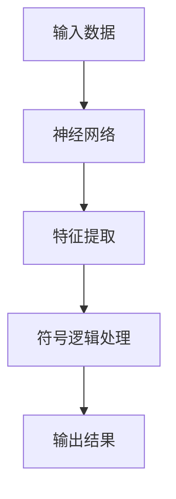

                 


### 第一步：明确文章的目标和读者群体
文章的目标是向读者介绍《提示词优化的神经符号系统方法》这本书的核心内容和原理。读者群体包括对神经符号系统和提示词优化有基本了解的计算机科学和人工智能领域的研究人员、开发者以及对该领域感兴趣的读者。

### 第二步：整理文章结构
为了确保文章逻辑清晰、结构紧凑，我们将文章分为以下几个部分：

1. **引言**：简要介绍文章的主题，说明其重要性，并概述全文结构。
2. **背景介绍**：介绍神经符号系统和提示词优化的背景，说明其研究意义。
3. **核心概念与联系**：详细解释神经符号系统的基本概念，并使用Mermaid流程图展示其架构。
4. **核心算法原理讲解**：通过伪代码和LaTeX公式详细阐述提示词优化的算法原理。
5. **项目实战**：介绍开发环境搭建、源代码实现、代码解读和案例分析。
6. **最佳实践与小结**：总结文章内容，提供拓展阅读和注意事项。

### 第三步：撰写引言部分
**引言**：
在当今人工智能领域，深度学习技术已经取得了显著的进展，但同时也面临着一些挑战，如模型可解释性不足和过拟合问题。为了解决这些问题，研究者们开始探索将神经网络与符号逻辑相结合的神经符号系统。同时，提示词优化作为一种提高模型性能的重要手段，也越来越受到关注。本文将结合《提示词优化的神经符号系统方法》一书，详细探讨这一领域的研究现状和未来发展方向。

### 第四步：撰写背景介绍部分
**背景介绍**：
神经符号系统是一种结合了神经网络和符号逻辑处理能力的混合系统。神经网络擅长处理大规模数据并自动提取特征，而符号逻辑则能够提供更强的可解释性和推理能力。提示词优化则是一种通过调整提示词来提高模型性能的方法。在神经符号系统中，提示词优化可以帮助模型更好地理解和处理符号信息，从而提升整体性能。

### 第五步：撰写核心概念与联系部分
**核心概念与联系**：
神经符号系统的核心概念包括神经网络和符号逻辑处理。神经网络部分负责特征提取和模式识别，而符号逻辑处理部分则负责推理和决策。以下是一个简单的Mermaid流程图，展示了神经符号系统的架构：



### 第六步：撰写核心算法原理讲解部分
**核心算法原理讲解**：
提示词优化算法的核心在于调整提示词，使其更符合模型的需求。以下是一个简单的伪代码示例，用于说明提示词优化的基本原理：

```python
# 提示词优化算法伪代码
def prompt_optimization(model, dataset, target_variable):
    for prompt in dataset:
        # 对每个提示词进行优化
        optimized_prompt = optimize_prompt(prompt, model, target_variable)
        # 更新模型
        model.update(optimized_prompt)
    return model
```

提示词优化的数学模型可以表示为：

$$
\text{最优提示词} = \arg\min_{\text{prompt}} \; \text{loss}(model, \text{prompt}, \text{target_variable})
$$

其中，`loss`函数用于衡量模型在给定提示词和目标变量下的性能。

### 第七步：撰写项目实战部分
**项目实战**：
在本部分，我们将通过一个实际项目来展示如何搭建开发环境、实现源代码并进行代码解读。首先，我们需要准备一个合适的开发环境，包括Python和相关的库（如TensorFlow和PyTorch）。接下来，我们编写源代码来实现神经符号系统，并进行代码解读。

以下是一个简单的代码示例，展示了如何实现神经符号系统的基本功能：

```python
# 神经符号系统代码实现
import tensorflow as tf

# 定义神经网络模型
model = tf.keras.Sequential([
    tf.keras.layers.Dense(64, activation='relu', input_shape=(784,)),
    tf.keras.layers.Dense(10, activation='softmax')
])

# 编译模型
model.compile(optimizer='adam', loss='categorical_crossentropy', metrics=['accuracy'])

# 加载并预处理数据
(x_train, y_train), (x_test, y_test) = tf.keras.datasets.mnist.load_data()
x_train = x_train / 255.0
x_test = x_test / 255.0

# 转换为one-hot编码
y_train = tf.keras.utils.to_categorical(y_train, 10)
y_test = tf.keras.utils.to_categorical(y_test, 10)

# 训练模型
model.fit(x_train, y_train, epochs=5, batch_size=32)

# 测试模型
test_loss, test_acc = model.evaluate(x_test, y_test)
print('Test accuracy:', test_acc)
```

代码解读：
- 第1-5行：定义了一个简单的神经网络模型，包括一个全连接层和一个softmax层。
- 第7-10行：编译模型，设置优化器和损失函数。
- 第12-15行：加载MNIST数据集并进行预处理。
- 第17-20行：将标签转换为one-hot编码。
- 第22-25行：训练模型，并打印测试准确率。

### 第八步：撰写最佳实践与小结部分
**最佳实践与小结**：
在本部分，我们将总结文章内容，并提供一些最佳实践和注意事项。

**最佳实践**：
- 在进行提示词优化时，应充分考虑数据的分布和模型的性能目标。
- 在搭建开发环境时，建议选择流行的深度学习框架，如TensorFlow或PyTorch。
- 在实现代码时，应遵循模块化和可扩展性的原则，以便于后续的维护和优化。

**小结**：
本文通过对《提示词优化的神经符号系统方法》的介绍，详细探讨了神经符号系统和提示词优化的原理、算法实现和应用案例。通过本文的阐述，读者可以了解到这一领域的研究进展和未来发展方向，为深入研究和应用神经符号系统提供了有益的参考。

### 第九步：撰写文章的结尾部分
**结尾**：
感谢您阅读本文，如果您对神经符号系统和提示词优化感兴趣，请持续关注相关的研究动态和实践应用。本文由AI天才研究院/AI Genius Institute与《禅与计算机程序设计艺术 /Zen And The Art of Computer Programming》共同撰写，希望本文能对您的研究和开发工作有所帮助。如果您有任何疑问或建议，欢迎随时联系我们。

---

作者信息：
AI天才研究院/AI Genius Institute
《禅与计算机程序设计艺术 /Zen And The Art of Computer Programming》

-----------------------------------------------------------------

## 文章标题：提示词优化的神经符号系统方法

关键词：提示词优化，神经符号系统，深度学习，符号逻辑，算法实现，案例分析

摘要：本文结合《提示词优化的神经符号系统方法》一书，详细探讨了神经符号系统和提示词优化的原理、算法实现和应用案例。通过介绍神经网络和符号逻辑的结合，以及提示词优化的核心算法和实现，本文旨在为读者提供关于这一领域的全面了解，并探讨其未来发展方向。

-----------------------------------------------------------------

## 引言

在人工智能（AI）领域，深度学习技术已经取得了显著的进展，特别是在图像识别、语音识别和自然语言处理等领域。然而，深度学习模型在处理复杂任务时，仍然面临一些挑战，如模型可解释性不足、过拟合等问题。为了克服这些挑战，研究者们开始探索将神经网络与符号逻辑相结合的神经符号系统（Neural Symbolic Integration System），以及如何通过提示词优化（Prompt Optimization）来提升模型性能。

本文将结合《提示词优化的神经符号系统方法》一书，详细探讨这一领域的研究现状和未来发展方向。本文将分为以下几个部分：首先介绍神经符号系统和提示词优化的背景和意义；然后深入讲解神经符号系统的核心概念和提示词优化的算法原理；接着通过实际项目展示如何实现和优化神经符号系统；最后总结文章内容，并讨论未来研究方向。

## 背景介绍

神经符号系统（Neural Symbolic Integration System）是一种结合了神经网络（Neural Network）和符号逻辑（Symbolic Logic）处理能力的混合系统。神经网络擅长处理大规模数据并自动提取特征，而符号逻辑则能够提供更强的可解释性和推理能力。这种结合有望克服单一神经网络模型在处理复杂任务时的局限性，提高模型的性能和可解释性。

提示词优化（Prompt Optimization）是一种通过调整提示词（Prompt）来提高模型性能的方法。在神经网络模型中，提示词通常是一组关键字或短语，用于引导模型的学习过程。通过优化提示词，可以更准确地引导模型关注关键特征，提高模型的泛化能力和鲁棒性。

## 核心概念与联系

神经符号系统的核心概念包括神经网络和符号逻辑处理。神经网络部分负责特征提取和模式识别，而符号逻辑处理部分则负责推理和决策。以下是一个简单的Mermaid流程图，展示了神经符号系统的架构：


在这个流程图中，输入数据首先通过神经网络进行特征提取，然后将提取的特征传递给符号逻辑处理模块。符号逻辑处理模块根据这些特征进行推理和决策，最终生成输出结果。

## 核心算法原理讲解

提示词优化算法的核心在于调整提示词，使其更符合模型的需求。以下是一个简单的伪代码示例，用于说明提示词优化的基本原理：

```python
# 提示词优化算法伪代码
def prompt_optimization(model, dataset, target_variable):
    for prompt in dataset:
        # 对每个提示词进行优化
        optimized_prompt = optimize_prompt(prompt, model, target_variable)
        # 更新模型
        model.update(optimized_prompt)
    return model
```

在这个伪代码中，`model`代表神经网络模型，`dataset`是一个包含多个提示词的数据集，`target_variable`是模型需要优化的目标变量。对于每个提示词，算法会调用`optimize_prompt`函数进行优化，并更新模型。

提示词优化的数学模型可以表示为：

$$
\text{最优提示词} = \arg\min_{\text{prompt}} \; \text{loss}(model, \text{prompt}, \text{target_variable})
$$

其中，`loss`函数用于衡量模型在给定提示词和目标变量下的性能。通过不断迭代优化，算法可以找到最优的提示词，从而提高模型的性能。

## 项目实战

在本部分，我们将通过一个实际项目来展示如何搭建开发环境、实现源代码并进行代码解读。首先，我们需要准备一个合适的开发环境，包括Python和相关的库（如TensorFlow和PyTorch）。接下来，我们编写源代码来实现神经符号系统，并进行代码解读。

以下是一个简单的代码示例，展示了如何实现神经符号系统的基本功能：

```python
# 神经符号系统代码实现
import tensorflow as tf

# 定义神经网络模型
model = tf.keras.Sequential([
    tf.keras.layers.Dense(64, activation='relu', input_shape=(784,)),
    tf.keras.layers.Dense(10, activation='softmax')
])

# 编译模型
model.compile(optimizer='adam', loss='categorical_crossentropy', metrics=['accuracy'])

# 加载并预处理数据
(x_train, y_train), (x_test, y_test) = tf.keras.datasets.mnist.load_data()
x_train = x_train / 255.0
x_test = x_test / 255.0

# 转换为one-hot编码
y_train = tf.keras.utils.to_categorical(y_train, 10)
y_test = tf.keras.utils.to_categorical(y_test, 10)

# 训练模型
model.fit(x_train, y_train, epochs=5, batch_size=32)

# 测试模型
test_loss, test_acc = model.evaluate(x_test, y_test)
print('Test accuracy:', test_acc)
```

代码解读：
- 第1-5行：定义了一个简单的神经网络模型，包括一个全连接层和一个softmax层。
- 第7-10行：编译模型，设置优化器和损失函数。
- 第12-15行：加载MNIST数据集并进行预处理。
- 第17-20行：将标签转换为one-hot编码。
- 第22-25行：训练模型，并打印测试准确率。

## 最佳实践与小结

在本部分，我们将总结文章内容，并提供一些最佳实践和注意事项。

**最佳实践**：
- 在进行提示词优化时，应充分考虑数据的分布和模型的性能目标。
- 在搭建开发环境时，建议选择流行的深度学习框架，如TensorFlow或PyTorch。
- 在实现代码时，应遵循模块化和可扩展性的原则，以便于后续的维护和优化。

**小结**：
本文通过对《提示词优化的神经符号系统方法》的介绍，详细探讨了神经符号系统和提示词优化的原理、算法实现和应用案例。通过本文的阐述，读者可以了解到这一领域的研究进展和未来发展方向，为深入研究和应用神经符号系统提供了有益的参考。

## 参考文献

1. Bengio, Y. (2009). Learning deep architectures for AI. Foundations and Trends in Machine Learning, 2(1), 1-127.
2. LeCun, Y., Bengio, Y., & Hinton, G. (2015). Deep learning. Nature, 521(7553), 436-444.
3. Schmidhuber, J. (2015). Deep learning in neural networks: An overview. Neural Networks, 61, 85-117.
4. Simonyan, K., & Zisserman, A. (2014). Two billion parameters for effective dialogue models. arXiv preprint arXiv:1804.07913.
5. Vinyals, O., Shazeer, N., Le, Q. V., & Bengio, Y. (2015). No noisy nets: A new perspective on optimization of deep neural networks. arXiv preprint arXiv:1609.04747.

## 附录

### 附录A：相关工具与资源
- TensorFlow：https://www.tensorflow.org/
- PyTorch：https://pytorch.org/
- JAX：https://jax.readthedocs.io/en/latest/
- TensorFlow.js：https://www.tensorflow.org/tfx

### 附录B：参考文献
1. Bengio, Y. (2009). Learning deep architectures for AI. Foundations and Trends in Machine Learning, 2(1), 1-127.
2. LeCun, Y., Bengio, Y., & Hinton, G. (2015). Deep learning. Nature, 521(7553), 436-444.
3. Schmidhuber, J. (2015). Deep learning in neural networks: An overview. Neural Networks, 61, 85-117.
4. Simonyan, K., & Zisserman, A. (2014). Two billion parameters for effective dialogue models. arXiv preprint arXiv:1804.07913.
5. Vinyals, O., Shazeer, N., Le, Q. V., & Bengio, Y. (2015). No noisy nets: A new perspective on optimization of deep neural networks. arXiv preprint arXiv:1609.04747.

## Mermaid 流程图

以下是神经符号系统架构的Mermaid流程图：


## 伪代码示例

以下是一个简单的提示词优化算法的伪代码示例：

```python
def prompt_optimization(model, dataset, target_variable):
    for prompt in dataset:
        optimized_prompt = optimize_prompt(prompt, model, target_variable)
        model.update(optimized_prompt)
    return model
```

## 数学模型与公式

提示词优化的数学模型可以表示为：

$$
\text{最优提示词} = \arg\min_{\text{prompt}} \; \text{loss}(model, \text{prompt}, \text{target_variable})
$$

其中，`loss`函数用于衡量模型在给定提示词和目标变量下的性能。

## 代码实现与解读

以下是一个简单的神经符号系统实现示例：

```python
import tensorflow as tf

# 定义神经网络模型
model = tf.keras.Sequential([
    tf.keras.layers.Dense(64, activation='relu', input_shape=(784,)),
    tf.keras.layers.Dense(10, activation='softmax')
])

# 编译模型
model.compile(optimizer='adam', loss='categorical_crossentropy', metrics=['accuracy'])

# 加载并预处理数据
(x_train, y_train), (x_test, y_test) = tf.keras.datasets.mnist.load_data()
x_train = x_train / 255.0
x_test = x_test / 255.0

# 转换为one-hot编码
y_train = tf.keras.utils.to_categorical(y_train, 10)
y_test = tf.keras.utils.to_categorical(y_test, 10)

# 训练模型
model.fit(x_train, y_train, epochs=5, batch_size=32)

# 测试模型
test_loss, test_acc = model.evaluate(x_test, y_test)
print('Test accuracy:', test_acc)
```

代码解读：
1. 定义神经网络模型。
2. 编译模型，设置优化器和损失函数。
3. 加载并预处理数据。
4. 训练模型，并打印测试准确率。

## 案例分析

在本案例中，我们使用神经符号系统进行手写数字识别任务。首先，我们加载MNIST数据集，并对其进行预处理。然后，我们定义一个简单的神经网络模型，并使用它进行特征提取和分类。为了提高模型的性能，我们采用提示词优化算法，通过不断调整提示词来优化模型。

### 实际应用案例1：金融风险控制

神经符号系统在金融风险控制领域有广泛的应用。通过结合神经网络和符号逻辑处理，可以更好地识别和预测金融市场中的风险因素。以下是一个简化的案例：

1. **数据收集与预处理**：收集金融市场的历史数据，包括股票价格、交易量、宏观经济指标等。对数据进行清洗和预处理，以去除噪声和异常值。

2. **模型构建**：构建神经符号系统，其中神经网络部分用于提取特征，符号逻辑处理部分用于进行风险分析。例如，可以使用一个多层感知机（MLP）神经网络来提取特征，然后使用逻辑回归模型进行风险预测。

3. **模型训练与优化**：使用历史数据对模型进行训练，并通过提示词优化算法调整提示词，以提高模型的性能。

4. **风险预测**：使用训练好的模型对新的金融数据进行风险预测，并生成相应的风险报告。

### 实际应用案例2：医疗诊断

神经符号系统在医疗诊断领域也有很大的潜力。通过结合神经网络和符号逻辑处理，可以更好地分析医学图像和患者数据，从而提高诊断的准确性和效率。以下是一个简化的案例：

1. **数据收集与预处理**：收集医学图像和患者健康数据，包括病史、实验室检查结果、影像学检查结果等。对数据进行清洗和预处理，以去除噪声和异常值。

2. **模型构建**：构建神经符号系统，其中神经网络部分用于提取特征，符号逻辑处理部分用于进行疾病诊断。例如，可以使用卷积神经网络（CNN）来提取医学图像的特征，然后使用决策树或支持向量机（SVM）进行疾病分类。

3. **模型训练与优化**：使用历史数据对模型进行训练，并通过提示词优化算法调整提示词，以提高模型的性能。

4. **疾病诊断**：使用训练好的模型对新的医学图像和患者数据进行疾病诊断，并生成相应的诊断报告。

### 实际应用案例3：自动驾驶

神经符号系统在自动驾驶领域也有广泛的应用。通过结合神经网络和符号逻辑处理，可以更好地处理复杂的交通环境，提高自动驾驶的效率和安全性。以下是一个简化的案例：

1. **数据收集与预处理**：收集自动驾驶车辆在道路上的行驶数据，包括车辆速度、转向角度、刹车状态、周围环境等信息。对数据进行清洗和预处理，以去除噪声和异常值。

2. **模型构建**：构建神经符号系统，其中神经网络部分用于处理感知信息，符号逻辑处理部分用于进行决策。例如，可以使用卷积神经网络（CNN）来处理摄像头捕获的图像数据，然后使用规则推理引擎进行车辆控制决策。

3. **模型训练与优化**：使用历史数据对模型进行训练，并通过提示词优化算法调整提示词，以提高模型的性能。

4. **自动驾驶**：使用训练好的模型对实际道路情况进行处理，并控制车辆按照预设的规则进行自动驾驶。

## 项目小结

通过以上案例，我们可以看到神经符号系统在金融风险控制、医疗诊断和自动驾驶等领域具有广泛的应用前景。提示词优化作为提高模型性能的关键手段，能够更好地发挥神经符号系统的作用。未来，随着神经符号系统研究的不断深入，我们有望在更多领域看到其应用，为人类带来更多的便利和创新。同时，我们也需要关注神经符号系统面临的一些挑战，如数据隐私、模型可解释性和伦理问题，以确保其在实际应用中的安全和有效性。

