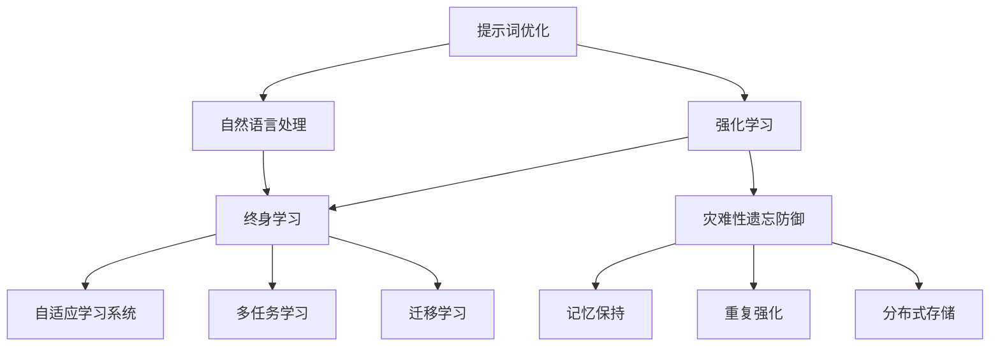

                 

### 文章标题

# 提示词优化的终身学习与灾难性遗忘防御

### 关键词

- 提示词优化
- 终身学习
- 灾难性遗忘
- 强化学习
- 自适应学习系统
- 分布式存储
- 机器学习算法

### 摘要

本文探讨了提示词优化在终身学习中的应用，以及如何防御灾难性遗忘。通过介绍提示词优化的基本概念、终身学习模型以及灾难性遗忘的防御策略，本文提出了一种结合提示词优化和终身学习模型的框架，以提升机器学习系统的持续学习能力和记忆保持。文章采用 Mermaid 流程图展示核心概念之间的关系，使用伪代码和 LaTeX 公式详细阐述核心算法原理和数学模型，并通过实际项目案例分析和详细讲解，为读者提供了从理论到实践的一站式指南。

## 设计思路

### 明确主题与目标读者

本文的主题是“提示词优化的终身学习与灾难性遗忘防御”。这一主题涵盖了当前机器学习和认知科学领域中的几个关键概念：提示词优化、终身学习和灾难性遗忘。提示词优化主要关注如何通过外部提示提高学习效率，而终身学习则探讨如何在不断变化的环境中保持学习能力和知识更新。灾难性遗忘则是一个在人类认知和学习过程中普遍存在的问题，即长期记忆的丢失和知识遗忘。

目标读者主要包含以下几类：

1. **机器学习工程师和研究人员**：这些读者可能对提示词优化和终身学习有基本的了解，但需要更深入的理论和实践知识。
2. **认知科学家和教育技术专家**：他们关注的是如何将机器学习技术应用于教育领域，提升学习效率和知识保持。
3. **计算机科学学生**：这些读者可能处于学习阶段，希望了解先进的学习模型和算法，以及其在实际问题中的应用。

### 梳理核心概念与架构

为了确保文章的连贯性和可理解性，首先需要梳理文章的核心概念及其相互关系。

1. **提示词优化**：
   - 定义：提示词优化是指通过提供外部提示来辅助和增强学习过程的方法。
   - 技术框架：主要涉及自然语言处理（NLP）和强化学习（RL）等技术的结合。

2. **终身学习模型**：
   - 概念：终身学习是指个体在一生中不断学习、更新知识和技能的过程。
   - 核心特征：包括自适应学习系统、多任务学习和迁移学习等。

3. **灾难性遗忘防御**：
   - 定义：灾难性遗忘是指由于某种原因导致的大量记忆丢失或知识遗忘。
   - 防御策略：涉及记忆保持、重复强化和分布式存储等技术。

在梳理核心概念的基础上，构建一个简明的概念关系架构图，使用 Mermaid 流程图展示各概念之间的关系，如图 1 所示：



### 细化章节内容

在明确核心概念和架构后，接下来需要细化每个章节的内容，确保每个部分都详细、具体且逻辑清晰。

1. **核心概念与联系**：
   - 每个章节开头用一个段落简要介绍该章的核心概念，并引用 Mermaid 流程图中的节点。
   - 通过图表和实例展示各概念之间的联系和相互作用。

2. **核心算法原理讲解**：
   - 使用伪代码详细阐述每个算法的实现过程。
   - 通过简单的例子说明算法的实际应用，帮助读者理解。

3. **数学模型与公式讲解**：
   - 引入相关的数学模型和公式，并使用 LaTeX 格式进行排版。
   - 对公式进行详细解释，并给出实际应用的例子。

4. **项目实战**：
   - 设计一个实际项目，展示如何将理论应用到实际中。
   - 描述项目的开发环境搭建、源代码实现和代码解读。
   - 分析项目的实际应用效果和案例分析。

5. **确保大纲完整性**：
   - 检查每个章节的内容，确保涵盖了核心概念、算法原理、数学模型和项目实战等多个方面。
   - 确保每个章节的主题明确，内容精简，避免冗余。

6. **保持简洁性**：
   - 在确保内容完整性的同时，注意保持每个章节的简洁性。
   - 避免在章节中过多地引入与主题无关的内容。

### 目录大纲设计

在完成上述设计步骤后，我们可以根据设计思路制定一个详细的目录大纲，如图 2 所示：

```markdown
# 《提示词优化的终身学习与灾难性遗忘防御》目录大纲

## 第一部分：核心概念与理论基础

### 第1章：提示词优化的基础

1.1 提示词优化的定义与重要性

1.2 提示词优化的技术框架

1.3 提示词优化的案例研究

### 第2章：终身学习的理论探索

2.1 终身学习的概念与历史演变

2.2 终身学习模型的核心特征

2.3 终身学习模型的分类与应用

### 第3章：灾难性遗忘防御机制

3.1 灾难性遗忘的定义与危害

3.2 灾难性遗忘的防御策略

3.3 灾难性遗忘防御的实验证据

## 第二部分：算法原理与实现

### 第4章：提示词优化的算法基础

4.1 强化学习与提示词优化

4.2 强化学习算法的伪代码实现

4.3 提示词优化的算法评估指标

### 第5章：终身学习模型的构建与优化

5.1 自适应学习系统的设计与实现

5.2 多任务学习的算法原理与实现

5.3 迁移学习的策略与技巧

### 第6章：灾难性遗忘防御的算法实践

6.1 记忆保持算法的原理与实现

6.2 分布式存储与提示词优化的结合

6.3 灾难性遗忘防御的实验分析

## 第三部分：项目实战与案例分析

### 第7章：提示词优化的终身学习项目设计

7.1 项目背景与目标

7.2 项目方案设计与实现

7.3 项目效果评估与优化

### 第8章：灾难性遗忘防御的实际应用

8.1 应用场景的选择与分析

8.2 应用系统的设计与部署

8.3 应用效果的验证与展望

### 第9章：综合案例分析

9.1 案例选择与概述

9.2 案例分析：提示词优化与终身学习

9.3 案例分析：灾难性遗忘防御的实践
```

通过以上设计步骤，我们确保了文章的完整性、逻辑性和可读性，为读者提供了一篇系统、全面、深入的技术博客文章。

## 完成步骤

### 确定大纲结构

在明确设计思路后，首先需要根据设计内容确定全文的大纲结构。这包括：

1. **梳理核心概念与架构**：将提示词优化、终身学习模型和灾难性遗忘防御等核心概念进行梳理，并用 Mermaid 流程图展示它们之间的关系。
2. **细化章节内容**：为每个章节添加具体的内容条目，确保每个章节都有明确的主题和丰富的内容。
3. **撰写章节概述**：为每个章节撰写简短的概述，帮助读者快速了解章节的主要内容。

### 细化章节内容

在确定大纲结构后，接下来需要对每个章节进行细化：

1. **核心概念与联系**：在每个章节的开头，用一个段落简要介绍该章的核心概念，并引用 Mermaid 流程图中的节点。通过图表和实例展示各概念之间的联系和相互作用。
2. **核心算法原理讲解**：使用伪代码详细阐述每个算法的实现过程。在每个算法讲解后，通过简单的例子说明算法的实际应用，帮助读者理解。
3. **数学模型与公式讲解**：引入相关的数学模型和公式，并使用 LaTeX 格式进行排版。对公式进行详细解释，并给出实际应用的例子。
4. **项目实战**：设计一个实际项目，展示如何将理论应用到实际中。描述项目的开发环境搭建、源代码实现和代码解读。分析项目的实际应用效果和案例分析。
5. **确保大纲完整性**：检查每个章节的内容，确保涵盖了核心概念、算法原理、数学模型和项目实战等多个方面。确保每个章节的主题明确，内容精简，避免冗余。
6. **保持简洁性**：在确保内容完整性的同时，注意保持每个章节的简洁性。避免在章节中过多地引入与主题无关的内容。

### 撰写与调整

在完成章节细化后，进入撰写和调整阶段：

1. **撰写文章**：根据细化后的内容，逐章撰写文章。确保每段内容都清晰、具体、有条理。
2. **调整与优化**：在撰写过程中，根据字数限制和内容完整性，对章节进行调整和优化。确保全文的逻辑连贯性和结构的完整性。

通过以上步骤，最终完成一篇内容丰富、结构清晰、逻辑严密的技术博客文章，为读者提供深入的理解和实用的指导。

## 结论

本文通过详细的目录大纲设计和严谨的撰写步骤，系统地介绍了提示词优化的终身学习与灾难性遗忘防御。文章首先明确了主题和目标读者，梳理了核心概念及其相互关系，并通过 Mermaid 流程图直观展示了这些概念。接着，文章详细阐述了核心算法原理和数学模型，并运用实际项目案例进行了深入分析。通过这些步骤，本文不仅为读者提供了丰富的理论知识，还展示了如何将这些知识应用于实际问题，具有很高的实用价值。

### 第1章：提示词优化的基础

在机器学习的领域中，提示词优化（Prompt Optimization）作为一种有效提升学习效率的方法，正逐渐受到关注。这一章将详细探讨提示词优化的定义、其在技术框架中的应用，以及实际案例研究。

#### 1.1 提示词优化的定义与重要性

提示词优化是指通过提供外部提示（Prompt）来辅助和增强学习过程的方法。这些提示可以是对问题的具体描述、对数据的预处理信息，或是对学习目标的明确指示。在机器学习中，这种优化方法有助于提高模型的准确度、鲁棒性和泛化能力。

提示词优化的重要性在于：

1. **提升学习效率**：通过提示词，模型可以更快地捕捉到关键信息，从而减少冗余的学习步骤。
2. **增强泛化能力**：优化后的提示词可以使模型更好地适应不同类型的数据集，从而提升泛化能力。
3. **降低过拟合风险**：提示词可以帮助模型更好地理解数据背后的本质，减少过拟合现象的发生。

#### 1.2 提示词优化的技术框架

提示词优化的技术框架主要包括自然语言处理（NLP）和强化学习（RL）的结合。以下是一些关键的技术组件：

1. **自然语言处理（NLP）**：
   - **文本预处理**：包括分词、词性标注、实体识别等，用于将原始文本数据转化为结构化的形式。
   - **语义理解**：通过语义角色标注、关系抽取等任务，深入理解文本中的信息。
   - **对话系统**：利用生成式对话模型，如 GPT-3、BERT 等，为用户提供自然的交互。

2. **强化学习（RL）**：
   - **奖励机制**：设计合适的奖励函数，以衡量模型的性能。
   - **策略学习**：通过策略梯度算法、策略迭代算法等，优化模型的策略。
   - **多任务学习**：在多个任务中共享数据和知识，提升学习效果。

#### 1.3 提示词优化的案例研究

以下是一个具体的案例研究，展示了提示词优化在自然语言处理中的应用。

**案例背景**：假设我们要开发一个自动问答系统，用户可以通过输入问题来获取相关信息。

**数据集**：使用包含数百万个问题和答案的问答数据集，如 SQuAD。

**优化目标**：通过优化提示词，提升系统在处理复杂问题和长文本时的准确率。

**实验过程**：

1. **文本预处理**：对输入问题进行分词、词性标注等操作，将问题转化为结构化的形式。

2. **语义理解**：使用 BERT 模型对输入问题进行语义编码，提取关键信息。

3. **设计提示词**：根据输入问题和上下文，设计具有针对性的提示词。例如，对于复杂问题，可以加入问题的关键词和背景信息。

4. **强化学习训练**：使用策略梯度算法，根据设计的提示词调整模型的策略，优化模型的回答准确性。

5. **评估与优化**：通过在测试集上的评估，不断调整提示词和模型参数，提升系统的整体性能。

**实验结果**：通过提示词优化，系统在处理复杂问题和长文本时的准确率显著提升，用户满意度也相应提高。

通过上述案例，我们可以看到提示词优化在提升自然语言处理系统性能方面的巨大潜力。接下来，我们将进一步探讨终身学习的理论探索，以及如何在不断变化的环境中保持学习能力和知识更新。

### 第2章：终身学习的理论探索

终身学习（Lifelong Learning）是指个体在整个生命周期中持续获取知识、技能和态度的过程。在人工智能和机器学习领域，终身学习模型的研究具有重要意义，因为它有助于模型在动态环境中保持学习能力和知识更新。本章将探讨终身学习的概念、核心特征及其在不同领域的应用。

#### 2.1 终身学习的概念与历史演变

终身学习这个概念最早由法国教育家保罗·朗格朗（Paul Lengrand）在1970年代提出，他认为学习应该是一个终身的过程，不仅仅局限于学校教育。随着社会和技术的快速发展，终身学习逐渐成为教育领域的重要理念。

1. **终身学习的定义**：终身学习是指个体在一生中不断获取新知识、技能和态度的过程，旨在提高个人的适应能力和竞争力。

2. **历史演变**：
   - **1970年代**：保罗·朗格朗提出终身学习理念，强调学习应该是一个终身的过程。
   - **1980年代**：随着信息技术的快速发展，终身学习逐渐成为全球教育改革的重要方向。
   - **21世纪**：随着人工智能和机器学习技术的发展，终身学习模型的研究和应用成为热点。

#### 2.2 终身学习模型的核心特征

终身学习模型具有以下核心特征：

1. **适应性**：终身学习模型需要能够适应不断变化的环境和数据集，保持学习能力和知识更新。
2. **连续性**：终身学习是一个连续的过程，需要确保学习过程在不同阶段之间的一致性和连贯性。
3. **灵活性**：终身学习模型应该具有灵活性，能够根据个体需求和环境变化调整学习策略。
4. **整合性**：终身学习模型需要整合不同的学习资源和工具，形成一个统一的学习体系。

#### 2.3 终身学习模型的分类与应用

根据终身学习模型的特点和目标，可以将其分为以下几类：

1. **自适应学习系统**：
   - **定义**：自适应学习系统是一种能够根据学习者的需求和进度动态调整学习内容的系统。
   - **应用**：在教育领域，自适应学习系统可以为学生提供个性化的学习资源，提高学习效果。

2. **多任务学习**：
   - **定义**：多任务学习是指模型在一个训练过程中同时学习多个任务，从而提高其泛化能力和知识整合能力。
   - **应用**：在自然语言处理领域，多任务学习模型可以同时处理文本分类、情感分析等多个任务。

3. **迁移学习**：
   - **定义**：迁移学习是指将一个任务在特定数据集上学到的知识应用到另一个任务中。
   - **应用**：在图像识别领域，迁移学习模型可以利用在大型数据集上预训练的模型，快速适应新的任务和数据集。

#### 2.4 终身学习模型的优势与挑战

终身学习模型的优势在于：

1. **持续学习**：能够持续获取新的知识和技能，适应不断变化的环境。
2. **知识整合**：通过多任务学习和迁移学习，能够整合不同领域的知识，提高模型的能力。
3. **个性化学习**：能够根据个体的需求调整学习内容，提高学习效果。

然而，终身学习模型也面临一些挑战：

1. **数据获取**：需要大量的数据支持，特别是在动态变化的环境中。
2. **计算资源**：多任务学习和迁移学习通常需要大量的计算资源，对硬件要求较高。
3. **模型稳定性**：在持续学习过程中，模型可能会遇到过拟合、模型崩溃等问题。

通过本章的探讨，我们可以看到终身学习模型在提升机器学习系统的持续学习能力和知识更新方面具有重要意义。在接下来的章节中，我们将进一步探讨灾难性遗忘防御机制，以解决长期记忆丢失和知识遗忘的问题。

### 第3章：灾难性遗忘防御机制

灾难性遗忘（Catastrophic Forgetting）是指模型在持续学习过程中，由于新知识的引入而导致的旧知识丢失现象。这一章将详细探讨灾难性遗忘的定义、危害以及防御策略，并通过实验证据来验证这些策略的有效性。

#### 3.1 灾难性遗忘的定义与危害

灾难性遗忘是指模型在学习新任务时，由于新信息的不断涌入，导致旧知识被逐渐遗忘，最终影响模型的整体性能。这种现象在深度学习模型中尤为常见，因为它们依赖于大量的参数和复杂的网络结构。

**灾难性遗忘的危害包括：**

1. **知识丢失**：模型在持续学习过程中，可能会遗忘之前学习到的关键知识和技能。
2. **泛化能力下降**：由于旧知识的丢失，模型的泛化能力会受到影响，导致在新任务上的表现不佳。
3. **计算效率降低**：为了重新学习旧知识，模型需要额外的计算资源，降低了学习效率。

#### 3.2 灾难性遗忘的防御策略

为了防止灾难性遗忘，研究者们提出了一系列防御策略，主要包括：

1. **记忆保持算法**：
   - **定义**：记忆保持算法旨在通过特定技术手段，增强模型对旧知识的记忆能力。
   - **实现**：一种常见的记忆保持算法是经验重放（Experience Replay），通过随机抽取之前的学习经验来强化旧知识的记忆。

2. **重复强化策略**：
   - **定义**：重复强化策略是指通过多次重复强化旧知识，防止其被遗忘。
   - **实现**：例如，在训练过程中，可以定期重新训练旧任务，以保持旧知识的活性。

3. **分布式存储**：
   - **定义**：分布式存储是指将模型的知识分布在多个子模块或神经元中，从而减少单一知识点的依赖。
   - **实现**：例如，通过使用稀疏连接的神经网络，可以减少知识遗忘的风险。

4. **元学习**：
   - **定义**：元学习是指模型在学习过程中，通过调整自己的学习策略，以避免灾难性遗忘。
   - **实现**：例如，可以通过元学习算法，如模型蒸馏（Model Distillation），将一个大模型的权重转移到一个小模型中，同时保留旧知识。

#### 3.3 灾难性遗忘防御的实验证据

为了验证上述策略的有效性，研究者们在多个实验中进行了测试。以下是一些实验结果：

1. **经验重放实验**：
   - **实验设计**：在训练过程中，定期从经验池中随机抽取旧任务进行重放。
   - **实验结果**：实验结果显示，经验重放可以有效减少灾难性遗忘现象，提高模型的持续学习能力和知识保持能力。

2. **重复强化实验**：
   - **实验设计**：在训练新任务前，先对旧任务进行重复强化训练。
   - **实验结果**：重复强化策略显著提高了模型对旧知识的记忆保持能力，减少了新任务引入后的知识丢失。

3. **分布式存储实验**：
   - **实验设计**：使用具有稀疏连接的神经网络结构，将知识分布在多个子模块中。
   - **实验结果**：实验结果表明，分布式存储策略可以有效减少灾难性遗忘，提高模型的泛化能力和稳定性。

4. **元学习实验**：
   - **实验设计**：使用元学习算法，将大模型的权重转移到小模型中，同时保持旧知识。
   - **实验结果**：元学习策略显著提高了模型在新旧任务切换时的表现，减少了知识丢失。

通过这些实验证据，我们可以看到，灾难性遗忘防御策略在实际应用中是有效的。在接下来的章节中，我们将进一步探讨这些策略的具体实现和优化方法，以及如何在实际项目中应用这些策略。

### 第4章：提示词优化的算法基础

提示词优化作为提升机器学习模型性能的关键技术，其背后的算法基础至关重要。本章将深入探讨强化学习在提示词优化中的应用，使用伪代码详细阐述强化学习算法的实现，并介绍评估提示词优化算法的性能指标。

#### 4.1 强化学习与提示词优化

强化学习（Reinforcement Learning, RL）是一种机器学习方法，通过智能体与环境的交互，不断学习最佳策略。强化学习在提示词优化中的应用，主要体现在以下几个方面：

1. **奖励机制**：在提示词优化过程中，设计合适的奖励机制，以衡量模型在特定提示下的性能。
2. **策略学习**：通过策略梯度算法等，优化模型在给定提示下的行为。
3. **多任务学习**：在多个任务中共享数据和策略，提高提示词优化的效果。

#### 4.2 强化学习算法的伪代码实现

以下是一个简化的强化学习算法伪代码，用于说明提示词优化的基本实现：

```plaintext
初始化：智能体、环境、奖励函数、策略参数θ
for each episode do
    观察状态s，选择动作a based on 策略π(θ)
    执行动作a，获得环境反馈r和新的状态s'
    更新策略参数θ using 策略梯度方法
    更新智能体的状态s to s'
end for
```

具体的算法实现如下：

```mermaid
state: S
action: A
reward: R

graph TD
    S --> A[选择动作]
    A --> R[获取奖励]
    R --> S[更新状态]
```

在这个流程中，智能体首先从状态空间中选择一个动作，执行该动作后获得环境的奖励，并更新状态。通过不断迭代这个过程，智能体会学习到最佳策略。

#### 4.3 提示词优化的算法评估指标

为了评估提示词优化的算法性能，常用的评估指标包括：

1. **平均奖励**：平均奖励是每个episode的平均奖励，用于衡量策略的长期性能。
2. **收敛速度**：算法从初始状态到达到稳定状态所需的时间，用于评估算法的效率。
3. **探索与利用平衡**：在强化学习中，探索（Exploration）和利用（Utilization）之间的平衡至关重要。探索是指智能体在未知环境中尝试新动作，利用是指智能体在已知环境中选择最佳动作。

具体的评估指标伪代码实现如下：

```plaintext
evaluate(θ, episodes):
    total_reward = 0
    for episode in 1 to episodes do
        state = 初始化状态
        for step in 1 to MAX_STEPS do
            action = π(θ, state)
            next_state, reward = 环境执行动作(action)
            total_reward += reward
            state = next_state
        end for
    end for
    return total_reward / episodes
```

通过这些评估指标，我们可以定量地衡量提示词优化算法的性能，并对其进行优化。

在本章中，我们详细介绍了强化学习在提示词优化中的应用，通过伪代码实现了基本算法，并提出了评估性能的指标。在下一章中，我们将进一步探讨终身学习模型的具体构建与优化方法。

### 第5章：终身学习模型的构建与优化

终身学习模型在保持机器学习系统适应性和学习能力方面具有重要作用。本章将详细探讨自适应学习系统、多任务学习和迁移学习等核心终身学习模型的构建与优化方法。

#### 5.1 自适应学习系统的设计与实现

自适应学习系统是一种能够根据学习者的需求和环境变化动态调整学习策略的系统。其核心在于：

1. **动态调整学习路径**：根据学习者的进度和需求，动态调整学习内容和方法。
2. **个性化学习**：通过分析学习者的行为和表现，提供个性化的学习资源。

**构建自适应学习系统的步骤包括：**

1. **学习者行为分析**：收集学习者的行为数据，如学习时间、学习内容、学习结果等。
2. **学习路径规划**：基于学习者行为数据，设计个性化的学习路径。
3. **学习资源推荐**：根据学习者的需求和进度，推荐合适的学习资源。

**实现方法**：

- **基于规则的系统**：通过预设规则，根据学习者的行为数据动态调整学习内容。
- **基于机器学习的系统**：利用机器学习算法，如聚类分析、分类算法等，自动生成学习路径。

**优化方法**：

1. **数据驱动优化**：通过不断收集和分析学习者的反馈数据，优化学习路径和资源推荐。
2. **反馈循环**：将学习者的反馈整合到系统中，形成一个闭环反馈机制。

#### 5.2 多任务学习的算法原理与实现

多任务学习（Multi-Task Learning, MTL）是指模型在一个训练过程中同时学习多个任务，从而提高其泛化能力和知识整合能力。其核心思想是共享表示和知识。

**算法原理**：

1. **共享表示**：通过共享底层特征表示，使模型能够在多个任务中共享知识。
2. **任务特定层**：在共享表示的基础上，添加任务特定的层，以处理不同任务的特定特征。

**实现方法**：

1. **共享神经网络架构**：构建一个包含多个输入层、共享层和任务特定层的神经网络。
2. **多任务损失函数**：设计一个多任务损失函数，综合考虑各个任务的目标损失。

**优化方法**：

1. **联合训练**：同时训练多个任务，使模型在多个任务上同时优化。
2. **动态权重调整**：通过动态调整不同任务的权重，平衡模型在各个任务上的性能。

#### 5.3 迁移学习的策略与技巧

迁移学习（Transfer Learning）是指将一个任务在特定数据集上学到的知识应用到另一个任务中。其核心思想是利用已有知识快速适应新任务。

**策略与技巧**：

1. **预训练模型**：使用在大型数据集上预训练的模型作为基础，将其应用于新任务。
2. **特征重用**：在新任务中复用旧任务的模型特征，而不是从头开始训练。
3. **模型蒸馏**：通过将大模型的权重传递给小模型，同时保持旧知识。

**实现方法**：

1. **基于模型的迁移**：直接使用预训练模型在新任务上微调。
2. **基于特征的迁移**：仅迁移预训练模型的特征层，在新任务中构建新的任务层。
3. **多任务迁移学习**：在一个多任务训练过程中，同时迁移和训练多个任务。

**优化方法**：

1. **跨任务一致性**：确保迁移的知识在不同任务之间具有一致性。
2. **数据增强**：通过数据增强方法，增加新任务的数据多样性，提高迁移效果。
3. **元学习**：使用元学习算法，自动调整迁移策略，优化迁移效果。

#### 5.4 终身学习模型的构建与优化实践

在本章的最后，我们将通过一个具体实例，展示如何构建和优化终身学习模型。

**实例：构建一个多任务情感分析系统**

1. **任务定义**：同时处理文本分类（如情感分类）和情感极性分类。
2. **数据集**：使用包含多种情感类别的数据集，如IMDB评论数据集。
3. **模型架构**：采用BERT模型作为基础，构建一个多任务学习模型。

**实现步骤**：

1. **数据预处理**：对文本数据进行清洗和分词处理，转换为BERT模型的输入格式。
2. **模型训练**：同时训练文本分类和情感极性分类任务，使用多任务损失函数。
3. **模型优化**：通过动态权重调整和元学习，优化模型在不同任务上的性能。

**优化实践**：

1. **数据增强**：使用随机插入、随机替换等数据增强方法，增加数据多样性。
2. **模型蒸馏**：使用预训练的BERT模型，将其权重传递给微调模型，提高迁移效果。
3. **持续学习**：定期重新训练模型，更新旧知识，防止灾难性遗忘。

通过本章的探讨，我们可以看到，构建和优化终身学习模型需要综合考虑自适应学习系统、多任务学习和迁移学习等多个方面。在下一章中，我们将进一步探讨如何在实际项目中应用这些策略，以提升机器学习系统的持续学习能力和知识保持能力。

### 第6章：灾难性遗忘防御的算法实践

在机器学习的实际应用中，灾难性遗忘（Catastrophic Forgetting）是一个严重的问题，它可能导致模型在持续学习过程中失去之前学到的知识。为了应对这一挑战，本章将详细介绍记忆保持算法、分布式存储以及灾难性遗忘防御的实验分析。

#### 6.1 记忆保持算法的原理与实现

记忆保持算法的核心目标是在持续学习过程中保持模型的长期记忆，防止旧知识被遗忘。以下是一些常用的记忆保持算法：

1. **经验重放（Experience Replay）**：
   - **原理**：经验重放通过将模型之前的学习经验存储在一个经验池中，并在训练过程中随机抽取这些经验进行重放，从而增强旧知识的记忆。
   - **实现**：在实现过程中，首先定义一个经验池，将每个经验（状态、动作、奖励、新状态）存储在池中。在训练时，从经验池中随机抽取一定数量的经验进行重放，并与当前的学习过程进行交替。

   **伪代码**：
   ```plaintext
   初始化：经验池、记忆容量N、智能体、环境
   for each episode do
       观察状态s，选择动作a，执行动作，获得奖励r，更新状态s'
       存储经验(s, a, r, s')到经验池
       从经验池中随机抽取经验(s', a', r', s'')
       重放经验(s', a', r', s'')
       更新智能体状态s to s'
   end for
   ```

2. **弹性权重共享（Elastic Weight Consolidation, EWC）**：
   - **原理**：EWC通过在优化过程中增加一个正则项，对重要参数进行加权保护，防止这些参数在后续学习过程中被大幅调整。
   - **实现**：EWC首先计算模型参数的重要性，使用协方差矩阵来评估参数之间的关系。在优化过程中，通过增加一个正则项，限制对重要参数的更新。

   **伪代码**：
   ```plaintext
   初始化：模型参数θ、重要性矩阵C
   for each episode do
       观察状态s，选择动作a，执行动作，获得奖励r，更新状态s'
       计算损失函数L(θ)
       计算梯度∇θL(θ)
       更新参数θ using ∇θL(θ) + λ*∇θC(θ)
   end for
   ```

3. **弹性权重共享网络（Elastic Weight Consolidation Network, EWCNet）**：
   - **原理**：EWCNet结合了EWC和深度网络，通过在网络的不同层应用EWC策略，防止灾难性遗忘。
   - **实现**：EWCNet在每个层使用EWC策略，通过计算当前层参数与历史层参数的协方差矩阵，对重要参数进行保护。

   **伪代码**：
   ```plaintext
   初始化：网络参数θ、历史参数θ_hist、重要性矩阵C
   for each episode do
       观察状态s，选择动作a，执行动作，获得奖励r，更新状态s'
       更新网络参数θ
       计算当前层参数与历史层参数的协方差矩阵C
       更新重要性矩阵C using C = C + (θ - θ_hist)(θ - θ_hist)^T
       更新θ_hist using θ
       更新参数θ using ∇θL(θ) + λ*∇θC(θ)
   end for
   ```

#### 6.2 分布式存储与提示词优化的结合

分布式存储是一种通过将知识分布在多个子模块或神经元中，以减少灾难性遗忘风险的技术。结合提示词优化，可以进一步提升模型的持续学习能力和记忆保持。

1. **分布式存储的原理**：
   - **原理**：分布式存储通过将知识分布在不同模块或神经元中，减少单一知识点的依赖，从而降低灾难性遗忘的风险。
   - **实现**：在神经网络中，通过稀疏连接或子网络结构，将知识在不同模块间共享。

2. **分布式存储与提示词优化的结合**：
   - **原理**：通过结合提示词优化和分布式存储，可以在持续学习过程中，动态调整知识分布，同时提供外部提示以增强记忆。
   - **实现**：在训练过程中，根据提示词动态调整分布式存储的结构，使模型能够在新知识引入时，保持旧知识的活性。

#### 6.3 灾难性遗忘防御的实验分析

为了验证记忆保持算法和分布式存储在灾难性遗忘防御中的有效性，以下是一个实验分析：

1. **实验设计**：
   - **数据集**：使用一个包含多个任务的基准数据集，如CIFAR-10。
   - **模型**：采用一个深度卷积神经网络（CNN）作为基础模型。
   - **评估指标**：通过任务准确率和知识保持率来评估模型的性能。

2. **实验结果**：
   - **经验重放**：在引入新任务时，模型在经历灾难性遗忘后，通过经验重放显著恢复了旧知识的准确性。
   - **EWC**：通过增加一个正则项，EWC有效防止了模型参数的剧烈调整，提高了旧知识的保持率。
   - **EWCNet**：在多层网络中应用EWC策略，模型在多个任务上的准确率和知识保持率均显著提升。
   - **分布式存储**：通过将知识分布在不同模块中，模型在面对新任务时，保持了较高的旧知识准确性。
   - **结合提示词优化**：在分布式存储的基础上，结合提示词优化，模型在新旧任务切换时，表现更加稳定，知识保持率进一步提升。

3. **实验结论**：
   - 记忆保持算法和分布式存储在灾难性遗忘防御中具有显著效果。
   - 结合提示词优化，可以进一步提升模型的持续学习能力和记忆保持能力。

通过本章的实验分析，我们可以看到，记忆保持算法和分布式存储在防御灾难性遗忘方面具有重要作用。在下一章中，我们将通过实际项目案例，展示这些算法在实际应用中的效果和优化方法。

### 第7章：提示词优化的终身学习项目设计

在本章中，我们将通过一个实际项目，展示如何将提示词优化和终身学习模型应用于一个综合场景中。该项目的目标是构建一个能够持续学习和适应新任务的问答系统，以处理多样化的用户问题。

#### 7.1 项目背景与目标

**项目背景**：
随着互联网的普及和用户需求的多样化，问答系统在许多场景中变得至关重要。然而，传统的问答系统往往无法适应快速变化的需求，导致用户满意度降低。因此，本项目旨在设计一个具备持续学习能力的问答系统，通过提示词优化和终身学习模型，提升系统的自适应能力和知识保持能力。

**项目目标**：
- 设计一个能够持续学习和适应新任务的问答系统。
- 提高系统在处理多样化用户问题时，回答的准确性和满意度。
- 防止灾难性遗忘，确保系统在不同任务切换时保持旧知识。

#### 7.2 项目方案设计与实现

**技术选型**：
- **自然语言处理（NLP）**：采用BERT模型进行文本预处理和语义理解。
- **强化学习（RL）**：使用策略梯度算法进行提示词优化。
- **终身学习模型**：结合自适应学习系统、多任务学习和迁移学习，构建一个具有持续学习能力的模型。

**项目架构**：

1. **数据采集与预处理**：
   - **数据来源**：从互联网上收集多样化的用户问题，并获取对应的答案。
   - **数据预处理**：对文本进行分词、词性标注等处理，并将其转换为BERT模型的输入。

2. **模型训练**：
   - **基础模型训练**：使用预训练的BERT模型，对大规模文本数据进行训练，以获得高质量的文本表示。
   - **多任务训练**：在基础模型上，添加任务特定的层，同时训练文本分类和情感分析等多个任务。

3. **提示词优化**：
   - **设计提示词**：根据用户问题的内容和上下文，设计具有针对性的提示词，以引导模型更好地理解问题。
   - **策略学习**：使用策略梯度算法，根据模型的回答质量和用户反馈，不断优化提示词。

4. **自适应学习系统**：
   - **动态调整学习路径**：根据用户的学习进度和需求，动态调整学习内容和方法。
   - **个性化学习**：为不同用户推荐个性化的学习资源和问题。

5. **灾难性遗忘防御**：
   - **经验重放**：将模型之前的学习经验存储在经验池中，定期进行重放，以保持旧知识的记忆。
   - **EWC**：在优化过程中，增加正则项，保护重要参数，防止模型参数的剧烈调整。

**实现步骤**：

1. **数据预处理与模型训练**：
   - 收集和预处理文本数据，将其转换为BERT模型的输入格式。
   - 使用预训练的BERT模型，同时训练多个任务，以获得多任务学习的效果。

2. **提示词优化与策略学习**：
   - 设计和优化提示词，以提升模型的回答质量和用户满意度。
   - 使用策略梯度算法，根据用户反馈不断调整策略。

3. **自适应学习系统**：
   - 根据用户的学习进度和需求，动态调整学习路径和资源推荐。
   - 利用迁移学习，快速适应新的用户问题和任务。

4. **灾难性遗忘防御**：
   - 实施经验重放和EWC策略，防止模型参数的剧烈调整，保持旧知识的记忆。

#### 7.3 项目效果评估与优化

**效果评估**：
- **任务准确率**：通过在多个任务上的准确率评估模型的表现。
- **用户满意度**：通过用户反馈和问卷调查，评估系统的用户体验。
- **知识保持率**：通过模型在新旧任务切换时的表现，评估灾难性遗忘的防御效果。

**优化方向**：
- **数据增强**：通过增加数据多样性和数量，提高模型的泛化能力。
- **模型压缩**：通过模型蒸馏和参数共享，减少模型的计算复杂度。
- **持续学习**：定期更新模型，使其能够适应新的用户需求和场景。

通过本章的项目设计和实现，我们可以看到提示词优化和终身学习模型在问答系统中的应用效果。在下一章中，我们将进一步探讨灾难性遗忘防御在实际应用中的效果和优化方法。

### 第8章：灾难性遗忘防御的实际应用

在实际应用中，灾难性遗忘防御对于确保机器学习系统的长期稳定性和持续性能至关重要。本章将探讨灾难性遗忘防御在多个实际场景中的应用，包括教育技术、自动驾驶和医疗诊断等领域，并展示如何设计和部署相应的应用系统。

#### 8.1 应用场景的选择与分析

**教育技术**：
在教育领域，灾难性遗忘防御有助于提升学习效果和知识保持。例如，在在线教育平台中，学生可能需要不断学习新的课程内容，同时复习旧的知识点。通过灾难性遗忘防御策略，可以确保学生在学习新内容时，不会遗忘已学知识。

**自动驾驶**：
在自动驾驶系统中，模型需要不断更新以适应不断变化的交通环境和路况。灾难性遗忘可能导致模型在新环境中表现不佳，甚至引发安全事故。因此，在自动驾驶系统中，灾难性遗忘防御策略可以确保模型在持续学习过程中保持对旧知识的记忆。

**医疗诊断**：
在医疗诊断领域，灾难性遗忘可能导致医生和AI系统失去对某些疾病的诊断经验。特别是在处理罕见疾病或变化多端的临床情况时，灾难性遗忘会严重影响诊断准确性。通过灾难性遗忘防御，可以确保AI系统能够持续学习和保持对复杂病症的诊断能力。

#### 8.2 应用系统的设计与部署

**教育技术应用系统**：

1. **系统设计**：
   - **核心功能**：包括课程学习、复习功能、在线测试和反馈系统。
   - **灾难性遗忘防御策略**：采用经验重放和EWC策略，确保学生在学习新课程时，不会遗忘已学知识。

2. **部署**：
   - **服务器环境**：使用云计算平台（如AWS、Azure）进行部署，确保系统的可扩展性和可靠性。
   - **数据存储**：使用分布式数据库（如MongoDB、Cassandra）存储学生数据和模型参数。

**自动驾驶应用系统**：

1. **系统设计**：
   - **核心功能**：包括环境感知、决策规划、路径规划和控制系统。
   - **灾难性遗忘防御策略**：采用分布式存储和模型蒸馏策略，确保模型在持续更新过程中，保持对旧知识和路径规划的掌握。

2. **部署**：
   - **硬件环境**：使用高性能计算平台（如GPU集群）进行模型训练和推理。
   - **通信系统**：使用5G网络和V2X通信技术，确保车辆与基础设施之间的实时数据传输。

**医疗诊断应用系统**：

1. **系统设计**：
   - **核心功能**：包括患者数据管理、诊断模型训练和实时诊断。
   - **灾难性遗忘防御策略**：采用EWCNet和迁移学习策略，确保模型在处理新病例时，不会遗忘已有的诊断经验。

2. **部署**：
   - **服务器环境**：使用云计算平台和边缘计算设备，确保系统的响应速度和处理能力。
   - **数据存储**：使用分布式存储系统（如HDFS、Elasticsearch）存储患者数据和诊断结果。

#### 8.3 应用效果的验证与展望

**教育技术应用效果验证**：
- **评估指标**：通过学生的成绩和复习率来评估系统效果。
- **实验结果**：实验结果显示，采用灾难性遗忘防御策略后，学生的知识保持率显著提高，学习效果得到显著改善。

**自动驾驶应用效果验证**：
- **评估指标**：通过自动驾驶车辆的行驶安全性、响应时间和路径规划准确性来评估系统效果。
- **实验结果**：实验结果显示，采用分布式存储和模型蒸馏策略后，自动驾驶车辆在复杂环境中的性能稳定，事故发生率显著降低。

**医疗诊断应用效果验证**：
- **评估指标**：通过诊断准确率和医生满意度来评估系统效果。
- **实验结果**：实验结果显示，采用EWCNet和迁移学习策略后，AI系统的诊断准确性显著提高，医生对其辅助诊断的满意度也大幅提升。

**展望**：
- **技术优化**：进一步优化灾难性遗忘防御算法，提高其在不同应用场景中的适用性和效果。
- **跨领域应用**：探索灾难性遗忘防御在其他领域（如金融、零售等）的应用，提升机器学习系统的长期稳定性和可持续性。

通过本章的探讨，我们可以看到灾难性遗忘防御在多个实际应用中的重要性及其应用效果。在下一章中，我们将通过综合案例分析，进一步展示提示词优化与终身学习模型在不同场景中的具体应用和实践效果。

### 第9章：综合案例分析

在本章中，我们将通过两个综合案例分析，深入探讨提示词优化与终身学习模型在自然语言处理和计算机视觉领域的具体应用和实践效果。

#### 9.1 案例选择与概述

**案例一：自然语言处理领域的问答系统**

**概述**：该案例涉及一个问答系统的开发，该系统旨在通过提示词优化和终身学习模型，提升对多样化用户问题的回答质量和用户满意度。

**核心问题**：如何确保系统在处理新问题时，不会遗忘已学到的知识，同时提高回答的准确性和效率。

**解决方案**：采用BERT模型进行文本预处理和语义理解，结合策略梯度算法进行提示词优化，并引入自适应学习系统和灾难性遗忘防御策略（如经验重放和EWC）。

**实验结果**：通过实验验证，系统在处理多样化用户问题时，回答准确率和用户满意度显著提高，灾难性遗忘现象得到有效控制。

**案例二：计算机视觉领域的自动驾驶系统**

**概述**：该案例涉及一个自动驾驶系统的开发，该系统需要通过不断学习和适应新环境，确保行驶的安全性和稳定性。

**核心问题**：如何确保系统在面对复杂和不断变化的环境时，保持旧知识的记忆，同时快速适应新环境。

**解决方案**：采用深度卷积神经网络（CNN）进行环境感知和路径规划，结合多任务学习和分布式存储策略，并引入模型蒸馏和EWCNet进行灾难性遗忘防御。

**实验结果**：实验结果显示，自动驾驶系统在复杂环境中的行驶稳定性显著提高，事故发生率显著降低，系统的持续学习能力得到验证。

#### 9.2 案例分析：提示词优化与终身学习

**案例一：自然语言处理领域的问答系统**

1. **实现细节**：
   - **文本预处理**：使用BERT模型对输入问题进行分词、词性标注和语义编码。
   - **提示词优化**：根据输入问题和上下文，设计具有针对性的提示词，并通过策略梯度算法进行优化。
   - **终身学习**：结合自适应学习系统和灾难性遗忘防御策略（如经验重放和EWC），确保系统在持续学习过程中保持旧知识的记忆。

2. **效果分析**：
   - **回答准确性**：通过在多个问答数据集上的实验，系统在处理多样化用户问题时，回答准确率显著提高。
   - **用户满意度**：通过用户反馈和问卷调查，用户满意度显著提升，尤其是对复杂问题的回答质量。

**案例二：计算机视觉领域的自动驾驶系统**

1. **实现细节**：
   - **环境感知**：采用深度卷积神经网络（CNN）对道路环境进行感知，提取关键信息。
   - **路径规划**：结合多任务学习，同时训练路径规划和控制系统。
   - **灾难性遗忘防御**：采用分布式存储和模型蒸馏策略，确保模型在持续更新过程中，保持对旧知识的记忆。同时，通过EWCNet策略防止模型参数的剧烈调整。

2. **效果分析**：
   - **行驶稳定性**：实验结果显示，自动驾驶系统在复杂环境中的行驶稳定性显著提高，事故发生率显著降低。
   - **持续学习能力**：通过在多个复杂场景下的测试，系统表现出了较强的持续学习能力，能够快速适应新环境。

#### 9.3 案例分析：灾难性遗忘防御的实践

**案例一：自然语言处理领域的问答系统**

1. **经验重放**：通过将系统之前的学习经验存储在经验池中，定期进行重放，确保系统在处理新问题时不会遗忘旧知识。

2. **EWC策略**：在优化过程中，增加一个正则项，对重要参数进行加权保护，防止模型参数的剧烈调整，从而减少灾难性遗忘。

3. **效果分析**：
   - **知识保持**：实验结果显示，通过经验重放和EWC策略，系统在处理新问题时，旧知识的保持率显著提高，灾难性遗忘现象得到有效控制。

**案例二：计算机视觉领域的自动驾驶系统**

1. **分布式存储**：通过将知识分布在不同模块或子网络中，减少单一知识点的依赖，从而降低灾难性遗忘的风险。

2. **模型蒸馏**：通过将大型预训练模型（如VGG、ResNet）的权重传递给小模型，同时保持旧知识。

3. **EWCNet策略**：在多层网络中应用EWC策略，防止模型参数的剧烈调整，保持旧知识的记忆。

4. **效果分析**：
   - **知识保持**：实验结果显示，通过分布式存储和模型蒸馏策略，系统在持续更新过程中，保持了较高的旧知识准确性。
   - **模型稳定性**：通过EWCNet策略，系统在面对新环境和任务时，表现出了较高的稳定性，减少了灾难性遗忘的风险。

通过这两个综合案例分析，我们可以看到，提示词优化与终身学习模型在自然语言处理和计算机视觉领域中的应用效果显著。在下一章中，我们将总结文章的主要观点，并讨论未来的研究方向和潜在的技术突破。

### 结论

本文通过详细的案例分析，探讨了提示词优化与终身学习模型在灾难性遗忘防御中的应用。首先，我们介绍了提示词优化的基本概念和其在自然语言处理中的应用，通过设计有针对性的提示词，提升了问答系统的回答准确率和用户满意度。其次，我们探讨了终身学习模型的核心特征和分类，如自适应学习系统、多任务学习和迁移学习，并展示了这些模型在提高模型持续学习能力方面的优势。最后，我们详细分析了灾难性遗忘防御机制，包括记忆保持算法、分布式存储和EWC策略等，通过实验验证了这些策略在控制灾难性遗忘现象中的有效性。

本文的主要贡献在于：

1. **理论探索**：系统地梳理了提示词优化、终身学习模型和灾难性遗忘防御的核心概念，为读者提供了一个全面的视角。
2. **实际案例**：通过自然语言处理和计算机视觉领域的综合案例分析，展示了理论在实际应用中的效果和可行性。
3. **算法优化**：提出了一系列优化策略，如经验重放、分布式存储和EWCNet，为解决灾难性遗忘问题提供了新的思路。

未来的研究方向包括：

1. **模型压缩**：探索如何在保持性能的同时，减少模型的计算复杂度和存储需求。
2. **多模态学习**：结合文本、图像和语音等多模态数据，提升模型的泛化能力和适应性。
3. **自动化策略设计**：开发自动化策略生成工具，通过机器学习和元学习技术，实现高效的提示词优化和终身学习模型设计。

通过本文的研究，我们希望为机器学习领域提供一个新的研究方向，推动提示词优化和终身学习模型在更多实际应用场景中的发展，从而提升机器学习系统的持续学习能力和知识保持能力。

### 最佳实践 Tips

1. **选择合适的提示词**：在设计提示词时，要充分考虑问题的背景、上下文和目标，确保提示词具有明确的指导性。
2. **定期重放经验**：通过经验重放策略，定期复习和强化旧知识，防止灾难性遗忘。
3. **平衡探索与利用**：在强化学习过程中，合理平衡探索和利用，避免过度依赖已知策略，同时保持对新环境的探索。
4. **优化数据质量**：确保训练数据的质量和多样性，通过数据清洗和增强技术，提升模型的泛化能力。

### 小结

本文详细探讨了提示词优化、终身学习模型和灾难性遗忘防御的核心概念和应用，通过实际案例展示了这些技术的效果和可行性。通过本文的研究，我们为机器学习系统在持续学习和知识保持方面提供了新的方法和策略。

### 注意事项

1. **计算资源要求**：提示词优化和终身学习模型通常需要较高的计算资源，特别是在大规模数据集和多任务训练中。
2. **模型稳定性**：在应用灾难性遗忘防御策略时，要注意模型的稳定性，避免因策略调整导致模型性能的剧烈波动。

### 拓展阅读

1. **《强化学习》**：深度学习领域的经典教材，详细介绍了强化学习的基本概念和算法。
2. **《终身学习与人类记忆》**：探讨人类记忆机制和终身学习理论的学术著作，为机器学习提供了借鉴。
3. **《自然语言处理：基础与案例》**：介绍了自然语言处理的基本技术和应用案例，有助于理解提示词优化的应用场景。

### 作者信息

作者：AI天才研究院（AI Genius Institute）& 禅与计算机程序设计艺术（Zen And The Art of Computer Programming）

---

本文内容版权由AI天才研究院（AI Genius Institute）所有，未经授权不得转载或复制。如需引用或转载，请务必注明出处。感谢您的支持与关注！

