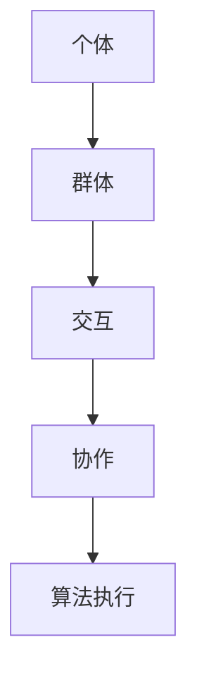
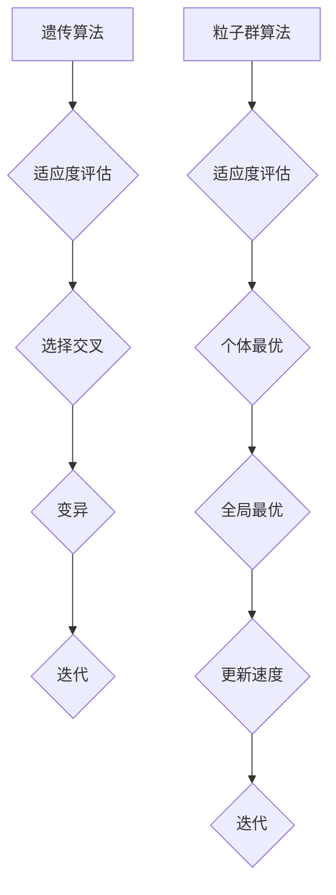

                 

### 第一步：确定核心概念与联系

在撰写一篇关于《提示词优化的群体智能算法》的技术博客文章时，首先需要明确文章的核心概念，并展示这些概念与其他相关领域的联系。这一步骤至关重要，因为它为后续内容的深入分析和讨论奠定了坚实的基础。

#### 群体智能算法概述

**定义与背景**：群体智能（ swarm intelligence）是指由大量简单个体通过局部交互和协作形成的一种复杂智能现象。这一概念最早由意大利动物学家恩里科·塔塔尔斯基（Enrico Tatarczu）在 1960 年提出。自那以后，群体智能逐渐成为计算机科学和工程领域的一个研究热点。

**特点与应用**：群体智能算法具有以下特点：
1. **自组织性**：个体不需要全局信息即可通过局部信息进行协作。
2. **鲁棒性**：系统在面对个体失败或环境变化时仍能保持稳定。
3. **分布式计算**：算法能够在分布式环境中高效运行。

主要应用领域包括：
1. **优化问题**：如旅行商问题（TSP）、车辆路径规划等。
2. **计算任务**：如分布式计算、并行计算等。
3. **智能搜索**：如网页搜索、图像识别等。

#### 群体智能算法的核心架构

**核心概念**：群体智能算法中的核心概念包括个体（agents）、群体（swarm）、交互（communication）和协作（cooperation）。

**架构概述**：群体智能算法通常包括以下主要组件：

1. **个体**：每个个体具有特定的行为模式和局部信息。
2. **群体**：个体通过交互形成一个群体。
3. **交互**：个体之间通过局部通信进行信息交换。
4. **协作**：个体通过协作实现共同目标。

为了更直观地展示群体智能算法的核心架构，我们可以使用Mermaid流程图来表示：



这个流程图清晰地展示了个体、群体、交互、协作以及算法执行之间的联系。个体作为基本单元，通过交互和协作形成一个具有复杂行为的群体，从而实现算法的执行和优化。

### 提示词优化的基本原理

在了解了群体智能算法的基本概念和架构后，接下来我们需要探讨提示词优化的基本原理，并分析其在不同应用场景中的目标和类型。

#### 提示词优化的概念与目标

**提示词优化的定义**：提示词优化（cue optimization）是指通过调整系统中的提示词（cues），以提高算法的性能和效率的过程。

**优化目标**：在群体智能算法中，提示词优化的目标通常包括：

1. **提高搜索效率**：通过优化提示词，加快算法的收敛速度。
2. **提升优化质量**：通过调整提示词，提高算法找到最优解的概率。
3. **增强鲁棒性**：使算法在面对不确定性和变化时保持稳定。

#### 提示词优化的算法类型

群体智能算法中，常见的提示词优化算法包括：

1. **遗传算法**：基于自然选择和遗传原理，通过交叉、变异和选择操作来优化提示词。
2. **粒子群优化算法**：模拟鸟群或鱼群的社会行为，通过速度更新和位置更新来优化提示词。

**常见算法比较**：

- **遗传算法**：
  - **优点**：强大的全局搜索能力，适用于复杂优化问题。
  - **缺点**：收敛速度较慢，可能陷入局部最优。

- **粒子群优化算法**：
  - **优点**：计算速度快，易于实现。
  - **缺点**：可能陷入局部最优，对参数敏感。

- **其他算法**：如蚁群算法、人工鱼群算法等，也有各自的特点和应用场景。

为了更好地理解这些算法的原理和应用，我们可以通过Mermaid流程图来展示遗传算法和粒子群优化算法的基本步骤：



这个流程图展示了遗传算法和粒子群优化算法的基本步骤和核心流程，有助于读者理解这些算法的工作原理。

通过上述分析，我们明确了群体智能算法和提示词优化的核心概念及其相互联系。接下来，我们将进一步深入探讨群体智能算法的原理，并详细介绍提示词优化的具体方法和实现步骤。

### 第2章: 提示词优化的基本原理

#### 2.1 提示词优化的概念与目标

**提示词优化的定义**：提示词优化（cue optimization）是指在群体智能算法中，通过对提示词（cues）的调整，以提高算法的性能和效率的过程。提示词是算法中用于引导个体行为的重要信息，其优化对于算法的收敛速度、优化质量和鲁棒性具有重要意义。

**优化目标**：提示词优化的主要目标包括：

1. **提高搜索效率**：优化提示词可以使算法更快地找到最优解，从而提高搜索效率。
2. **提升优化质量**：通过调整提示词，可以增强算法找到全局最优解的概率，从而提高优化质量。
3. **增强鲁棒性**：优化提示词可以提高算法在面对不确定性和变化时的稳定性，从而增强鲁棒性。

#### 2.2 提示词优化的算法类型

在群体智能算法中，常见的提示词优化算法包括遗传算法、粒子群优化算法、蚁群算法等。以下将详细介绍这些算法的原理和特点。

**遗传算法**：

遗传算法（Genetic Algorithm，GA）是一种基于自然选择和遗传学原理的优化算法。它通过模拟自然进化过程，对个体进行选择、交叉、变异等操作，从而逐步优化提示词。

**原理**：
1. **初始化种群**：随机生成一组初始个体。
2. **适应度评估**：计算每个个体的适应度，用于评估个体的优劣。
3. **选择操作**：根据适应度值选择优秀个体进行交配。
4. **交叉操作**：将选中的个体进行交叉，生成新的个体。
5. **变异操作**：对个体进行变异，增加种群的多样性。
6. **迭代更新**：重复上述过程，直到满足停止条件（如达到最大迭代次数或找到满意解）。

**伪代码实现**：

```pseudo
function GeneticAlgorithm():
    // 初始化种群
    InitializePopulation()
    // 循环迭代
    while not converged:
        // 适应度评估
        EvaluateFitnessOfPopulation()
        // 选择操作
        SelectParents()
        // 交叉操作
        Crossover()
        // 变异操作
        Mutation()
    return best_solution
```

**特点**：
- **优点**：强大的全局搜索能力，适用于复杂优化问题。
- **缺点**：收敛速度较慢，可能陷入局部最优。

**粒子群优化算法**：

粒子群优化算法（Particle Swarm Optimization，PSO）是一种模拟鸟群或鱼群社会行为的优化算法。它通过模拟个体之间的协作和竞争，实现提示词的优化。

**原理**：
1. **初始化粒子群**：随机生成一组粒子。
2. **适应度评估**：计算每个粒子的适应度。
3. **更新个体最优解和全局最优解**：每个粒子都保存自己的最优解（个体最优）和整个群体的最优解（全局最优）。
4. **更新粒子速度和位置**：根据个体最优解和全局最优解，更新每个粒子的速度和位置。

**伪代码实现**：

```pseudo
function PsoAlgorithm():
    // 初始化粒子群
    InitializeParticles()
    // 循环迭代
    while not converged:
        // 更新每个粒子的速度和位置
        UpdateParticleVelocitiesAndPositions()
        // 更新每个粒子的适应度
        EvaluateFitnessOfParticles()
        // 更新个体最优解和全局最优解
        UpdatePersonalAndGlobalBestSolutions()
    return global_best_solution
```

**特点**：
- **优点**：计算速度快，易于实现。
- **缺点**：可能陷入局部最优，对参数敏感。

**蚁群算法**：

蚁群算法（Ant Colony Optimization，ACO）是一种基于蚂蚁觅食行为的优化算法。它通过模拟蚂蚁之间的信息素更新和路径选择，实现提示词的优化。

**原理**：
1. **初始化信息素**：在起始点生成初始信息素分布。
2. **路径选择**：每个蚂蚁根据信息素浓度和随机性选择路径。
3. **信息素更新**：蚂蚁在路径上留下信息素，路径上信息素浓度增加。
4. **迭代更新**：重复上述过程，直到满足停止条件。

**伪代码实现**：

```pseudo
function AcoAlgorithm():
    // 初始化信息素
    InitializePheromone()
    // 循环迭代
    while not converged:
        // 蚂蚁选择路径
        SelectPathsByAnts()
        // 更新信息素
        UpdatePheromone()
    return best_solution
```

**特点**：
- **优点**：适用于大规模优化问题，具有较强的鲁棒性。
- **缺点**：计算复杂度高，收敛速度较慢。

**算法比较**：

- **遗传算法**：具有强大的全局搜索能力，但收敛速度较慢。
- **粒子群优化算法**：计算速度快，但可能陷入局部最优。
- **蚁群算法**：适用于大规模优化问题，但计算复杂度高。

综上所述，不同的提示词优化算法具有各自的特点和应用场景。根据具体问题需求，选择合适的算法进行提示词优化，可以有效提高群体智能算法的性能和效率。

### 第3章: 粒子群优化算法原理详解

#### 3.1 粒子群优化算法原理

粒子群优化算法（Particle Swarm Optimization，PSO）是一种基于群体智能的优化算法，它模拟鸟群或鱼群的社会行为，通过个体之间的协作和竞争，实现问题的优化。PSO算法具有实现简单、收敛速度快等优点，被广泛应用于各种优化问题中。

**原理介绍**：

粒子群优化算法的基本原理可以概括为以下几点：

1. **粒子表示**：在PSO算法中，每个粒子代表问题的一个潜在解。粒子在搜索空间中飞行，通过调整速度和位置，逐步逼近最优解。

2. **速度更新**：粒子的速度是粒子当前位置与目标位置之间的差值。速度的更新规则如下：
   \[
   v_{i}^{t+1} = w \cdot v_{i}^{t} + c_{1} \cdot r_{1} \cdot (p_{i}^{t} - x_{i}^{t}) + c_{2} \cdot r_{2} \cdot (g_{best} - x_{i}^{t})
   \]
   其中，\(v_{i}^{t}\) 是第 \(i\) 个粒子在第 \(t\) 次迭代的速度，\(w\) 是惯性权重，\(c_{1}\) 和 \(c_{2}\) 是两个学习因子，\(r_{1}\) 和 \(r_{2}\) 是随机数，\(p_{i}^{t}\) 是第 \(i\) 个粒子的个体最优位置，\(g_{best}\) 是全局最优位置，\(x_{i}^{t}\) 是第 \(i\) 个粒子的当前位置。

3. **位置更新**：粒子在搜索空间中的位置通过以下公式更新：
   \[
   x_{i}^{t+1} = x_{i}^{t} + v_{i}^{t+1}
   \]
   其中，\(x_{i}^{t}\) 是第 \(i\) 个粒子在第 \(t\) 次迭代的位置。

4. **适应度评估**：每次迭代结束后，计算每个粒子的适应度值，以评估当前解的优劣。

5. **更新个体最优和全局最优**：在每次迭代中，更新每个粒子的个体最优位置和全局最优位置。

6. **迭代过程**：重复以上步骤，直到满足停止条件（如达到最大迭代次数或找到满意解）。

**伪代码实现**：

```pseudo
function PsoAlgorithm():
    // 初始化粒子群
    InitializeParticles()
    // 初始化个体最优和全局最优
    InitializePersonalAndGlobalBestSolutions()
    // 循环迭代
    while not converged:
        // 更新每个粒子的速度
        UpdateParticleVelocities()
        // 更新每个粒子的位置
        UpdateParticlePositions()
        // 更新适应度
        EvaluateFitnessOfParticles()
        // 更新个体最优和全局最优
        UpdatePersonalAndGlobalBestSolutions()
    return global_best_solution
```

#### 3.2 提示词优化的应用

提示词优化在粒子群优化算法中的应用主要体现在两个方面：一是通过调整提示词来引导粒子群的搜索方向，二是通过优化提示词的调整策略来提高算法的性能。

**提示词的选择**：

提示词的选择对于算法的性能具有重要影响。在PSO算法中，常用的提示词包括：

1. **个体最优位置**（\(p_{i}^{t}\)）：代表粒子自身历史最佳位置。
2. **全局最优位置**（\(g_{best}\)）：代表整个粒子群历史最佳位置。
3. **速度**（\(v_{i}^{t}\)）：代表粒子当前的速度。

通过合理选择和调整这些提示词，可以引导粒子群在搜索空间中更好地探索和利用信息。

**提示词的优化策略**：

提示词的优化策略主要包括以下几种：

1. **自适应调整**：根据算法的迭代过程和粒子的行为，动态调整提示词的权重和更新规则。例如，可以通过经验公式或自适应权重调整方法，实时更新提示词的参数。

2. **混合优化策略**：将PSO与其他优化算法（如遗传算法、差分进化算法等）相结合，利用多种优化策略的优势，提高算法的性能。

3. **多群体协同优化**：通过构建多个子群体，分别对不同的提示词进行调整和优化，实现协同搜索和优势互补。

**示例**：

以下是一个简化的提示词优化策略的伪代码实现：

```pseudo
function OptimizedPsoAlgorithm():
    // 初始化粒子群和参数
    InitializeParticles()
    InitializeParameters()
    // 初始化个体最优和全局最优
    InitializePersonalAndGlobalBestSolutions()
    // 循环迭代
    while not converged:
        // 计算适应度
        EvaluateFitnessOfParticles()
        // 更新个体最优和全局最优
        UpdatePersonalAndGlobalBestSolutions()
        // 根据适应度自适应调整提示词权重
        AdaptiveAdjustCues()
        // 更新粒子速度和位置
        UpdateParticleVelocitiesAndPositions()
    return global_best_solution
```

通过以上策略，可以在一定程度上提高粒子群优化算法的搜索效率和优化质量。

### 第4章: 遗传算法原理详解

遗传算法（Genetic Algorithm，GA）是一种基于自然选择和遗传学原理的优化算法。它通过模拟生物进化过程，对个体进行选择、交叉、变异等操作，从而逐步优化问题的解。遗传算法具有强大的全局搜索能力和适应性强等优点，被广泛应用于各种优化问题中。

#### 4.1 遗传算法的基本概念

遗传算法的基本概念包括个体、种群、适应度、选择、交叉、变异等。

- **个体**：个体是遗传算法中的基本搜索实体，通常用一个二进制串表示。个体代表了问题的一个潜在解。
- **种群**：种群是由多个个体组成的集合，是遗传算法的基本操作对象。种群中的个体通过竞争和合作，逐步逼近最优解。
- **适应度**：适应度是评估个体优劣的标准，通常是一个数值函数。适应度值越高，表示个体越优秀。
- **选择**：选择操作是遗传算法的核心步骤之一，通过选择适应度较高的个体，保证种群向更优秀的方向进化。
- **交叉**：交叉操作是遗传算法中的另一种重要操作，通过将两个优秀个体的基因进行重组，生成新的个体。
- **变异**：变异操作是遗传算法中的另一种重要操作，通过随机改变个体的某些基因，增加种群的多样性，避免陷入局部最优。

#### 4.2 遗传算法的基本步骤

遗传算法的基本步骤如下：

1. **初始化种群**：随机生成初始种群，每个个体代表一个潜在解。
2. **计算适应度**：对每个个体计算适应度值，评估个体的优劣。
3. **选择操作**：根据适应度值，选择适应度较高的个体作为父代。
4. **交叉操作**：将选中的父代进行交叉操作，生成新的个体。
5. **变异操作**：对新生成的个体进行变异操作，增加种群的多样性。
6. **迭代更新**：重复以上步骤，直到满足停止条件（如达到最大迭代次数或找到满意解）。

#### 4.3 伪代码实现

以下是遗传算法的伪代码实现：

```pseudo
function GeneticAlgorithm():
    // 初始化种群
    InitializePopulation()
    // 循环迭代
    while not converged:
        // 计算适应度
        EvaluateFitnessOfPopulation()
        // 选择操作
        SelectParents()
        // 交叉操作
        Crossover()
        // 变异操作
        Mutation()
        // 更新种群
        UpdatePopulation()
    return best_solution
```

#### 4.4 选择操作

选择操作是遗传算法中的核心步骤之一，通过选择适应度较高的个体作为父代，保证种群向更优秀的方向进化。选择操作的方法有多种，包括轮盘赌选择、锦标赛选择、排序选择等。

- **轮盘赌选择**：根据个体适应度值，计算每个个体的选择概率，并随机选择一个个体作为父代。
- **锦标赛选择**：从种群中随机选择若干个个体（如两个或多个），比较它们的适应度值，选择适应度较高的个体作为父代。
- **排序选择**：将种群按适应度值排序，选择排序靠前的个体作为父代。

#### 4.5 交叉操作

交叉操作是通过将两个父代的基因进行重组，生成新的个体。交叉操作可以增加种群的多样性和搜索空间。

- **单点交叉**：在父代基因序列中随机选择一个交叉点，将交叉点之前的基因和交叉点之后的基因分别与另一个父代的对应部分进行交换。
- **两点交叉**：在父代基因序列中随机选择两个交叉点，将交叉点之间的基因与另一个父代的对应部分进行交换。
- **均匀交叉**：以一定概率随机选择父代基因中的每个基因，与另一个父代的对应基因进行交换。

#### 4.6 变异操作

变异操作是通过随机改变个体的某些基因，增加种群的多样性和搜索空间，避免陷入局部最优。

- **基本变异**：随机改变个体中的一个或多个基因。
- **逆变异**：根据个体适应度值，选择适应度较高的个体进行逆变异操作，即随机改变个体中的某些基因，使其适应度值降低。

#### 4.7 遗传算法的改进

为了提高遗传算法的性能和效率，可以采用以下改进方法：

- **自适应调整参数**：根据算法的迭代过程和种群的状态，动态调整适应度函数、交叉概率、变异概率等参数。
- **混合优化策略**：将遗传算法与其他优化算法（如粒子群优化算法、差分进化算法等）相结合，利用多种优化算法的优势。
- **多目标优化**：对多个目标函数进行优化，提高算法的多样性和鲁棒性。

通过以上改进方法，遗传算法可以在更复杂的优化问题中表现出更强的性能。

### 第5章：提示词优化的数学模型

#### 5.1 目标函数建模

在提示词优化的过程中，目标函数是核心组成部分，用于衡量和评估解的质量。一个良好的目标函数应该能够准确反映问题的实际需求，引导算法朝着最优解的方向进化。以下将介绍目标函数的定义、建模方法及其在提示词优化中的应用。

**目标函数的定义**：

目标函数（Objective Function）是一个数学函数，用于表示问题中需要优化的目标。在提示词优化中，目标函数通常是一个多变量函数，其形式可以表示为：

\[ 
f(x) = f_1(x) + f_2(x) + \ldots + f_n(x) 
\]

其中，\( f_i(x) \) 表示第 \(i\) 个子目标函数，\( n \) 是子目标函数的数量。每个子目标函数都对应问题的一个特定方面，如成本、时间、精度等。

**建模方法**：

目标函数建模的关键在于如何将实际问题转化为数学模型。以下是几种常见的建模方法：

1. **线性建模**：当问题中各个子目标之间存在线性关系时，可以使用线性建模方法。线性建模的简单形式如下：

   \[
   f(x) = \sum_{i=1}^{n} w_i \cdot x_i
   \]

   其中，\( w_i \) 是第 \(i\) 个子目标函数的权重，\( x_i \) 是第 \(i\) 个变量的取值。

2. **非线性建模**：当问题中各个子目标之间存在非线性关系时，可以使用非线性建模方法。非线性建模的常见形式包括多项式、指数、对数等函数：

   \[
   f(x) = a_0 + a_1x_1 + a_2x_2 + \ldots + a_nx_n
   \]

   其中，\( a_i \) 是第 \(i\) 个变量的系数。

3. **约束建模**：在提示词优化中，常常需要考虑问题的约束条件。约束条件可以用数学表达式表示，如下所示：

   \[
   g_i(x) \leq 0 \quad (i=1,2,\ldots,m)
   \]

   其中，\( g_i(x) \) 是第 \(i\) 个约束条件。

**举例说明**：

为了更直观地展示目标函数的建模方法，以下是一个简单的示例。假设我们要优化一个生产问题，目标是最小化总成本，同时满足产量、质量和工时的约束条件。以下是这个问题的目标函数和约束条件的数学表示：

- **目标函数**：

  \[
  f(x) = \sum_{i=1}^{n} c_i \cdot x_i
  \]

  其中，\( c_i \) 是第 \(i\) 个生产产品的单位成本，\( x_i \) 是第 \(i\) 个产品的生产数量。

- **约束条件**：

  \[
  \begin{cases}
  g_1(x) = \sum_{i=1}^{n} x_i - D \leq 0 & \text{（产量约束）} \\
  g_2(x) = \sum_{i=1}^{n} q_i \cdot x_i - Q \leq 0 & \text{（质量约束）} \\
  g_3(x) = \sum_{i=1}^{n} h_i \cdot x_i - H \leq 0 & \text{（工时约束）}
  \end{cases}
  \]

  其中，\( D \) 是总产量需求，\( Q \) 是总质量需求，\( H \) 是总工时需求，\( q_i \) 和 \( h_i \) 分别是第 \(i\) 个产品的单位质量和单位工时。

通过上述示例，我们可以看到如何将一个实际问题转化为数学模型，从而为后续的提示词优化提供基础。

### 第6章：适应度函数建模

#### 6.1 适应度函数的定义与作用

在群体智能算法中，适应度函数（Fitness Function）是评估个体优劣的重要工具。它用于量化个体在解决问题中的表现，通常是一个非负实值函数。适应度函数的定义和设计直接影响到算法的搜索效率和优化质量。

**定义**：

适应度函数 \( f(x) \) 是一个对个体 \( x \) 的评估指标，用于表示个体在当前环境下解决问题的能力。它通常是一个实值函数，其值越高，表示个体越优秀。

**作用**：

1. **选择操作**：在遗传算法、粒子群优化等算法中，适应度函数用于决定个体的选择概率。适应度值高的个体有更大的机会成为父代，从而传递其优秀基因。
2. **进化指导**：适应度函数为算法提供了进化方向，指导种群逐步逼近最优解。
3. **收敛判断**：通过比较个体的适应度值，可以判断算法是否收敛到最优解或满意解。

#### 6.2 适应度函数的建模方法

适应度函数的建模方法取决于问题的性质和目标。以下是几种常见的适应度函数建模方法：

1. **线性建模**：

   线性建模是最简单的一种适应度函数形式，适用于目标函数为线性组合的情况。线性建模方法如下：

   \[
   f(x) = w_1 \cdot f_1(x) + w_2 \cdot f_2(x) + \ldots + w_n \cdot f_n(x)
   \]

   其中，\( f_i(x) \) 是第 \(i\) 个子目标函数，\( w_i \) 是相应的权重。

2. **非线性建模**：

   非线性建模适用于目标函数为非线性组合的情况。常见的非线性建模方法包括多项式、指数和对数等函数形式。以下是一个多项式形式的适应度函数示例：

   \[
   f(x) = a_0 + a_1x_1 + a_2x_2 + \ldots + a_nx_n
   \]

   其中，\( a_i \) 是第 \(i\) 个变量的系数。

3. **约束建模**：

   当问题中存在约束条件时，适应度函数需要考虑这些约束。常见的约束建模方法包括：

   \[
   f(x) = \frac{1}{1 + \sum_{i=1}^{m} \lambda_i \cdot g_i(x)}
   \]

   其中，\( g_i(x) \) 是第 \(i\) 个约束条件，\( \lambda_i \) 是相应约束的权重。

4. **多目标建模**：

   在多目标优化问题中，适应度函数需要同时考虑多个目标。多目标建模方法包括加权法、Pareto前沿法等。以下是一个加权法的示例：

   \[
   f(x) = \sum_{i=1}^{n} w_i \cdot f_i(x)
   \]

   其中，\( f_i(x) \) 是第 \(i\) 个子目标函数，\( w_i \) 是相应的权重。

#### 6.3 适应度函数的计算过程

适应度函数的计算过程通常包括以下步骤：

1. **初始化个体**：随机生成初始种群中的个体。
2. **计算目标函数值**：对每个个体计算目标函数值，以评估个体的表现。
3. **计算适应度值**：根据目标函数值和问题的性质，计算每个个体的适应度值。
4. **适应度标准化**：为了避免适应度值差异过大，对适应度值进行标准化处理。
5. **适应度分配**：根据适应度值，分配每个个体的选择概率。

#### 6.4 适应度函数的优化方法

为了提高算法的性能和优化质量，可以采用以下适应度函数优化方法：

1. **自适应调整**：根据算法的迭代过程和种群的状态，动态调整适应度函数的参数，如权重、非线性系数等。
2. **多目标优化**：将多个目标函数转化为单个适应度函数，采用Pareto前沿法或加权法进行优化。
3. **约束处理**：在适应度函数中考虑约束条件，采用约束建模方法处理约束问题。

通过以上优化方法，可以进一步提高适应度函数的准确性和适应性，从而提高算法的优化效果。

### 6.5 适应度函数示例

为了更好地理解适应度函数的建模和计算，以下是一个简单的适应度函数示例。

假设我们要解决一个简单的线性规划问题，目标是最小化目标函数 \( f(x) = x_1 + x_2 \)，同时满足以下约束条件：

\[
\begin{cases}
x_1 + x_2 \geq 5 \\
x_1 - x_2 \leq 3 \\
0 \leq x_1 \leq 10 \\
0 \leq x_2 \leq 10
\end{cases}
\]

我们可以使用以下适应度函数来评估个体的优劣：

\[
f(x) = \frac{1}{1 + \sum_{i=1}^{3} \lambda_i \cdot g_i(x)}
\]

其中，\( g_1(x) = x_1 + x_2 - 5 \)，\( g_2(x) = x_1 - x_2 - 3 \)，\( g_3(x) = -x_1 \)（因为 \( 0 \leq x_1 \leq 10 \)），\(\lambda_1\)、\(\lambda_2\) 和 \(\lambda_3\) 分别是相应约束的权重。

通过计算适应度函数的值，我们可以评估不同个体的优劣，从而指导算法的搜索过程。

### 第7章：项目实战

#### 7.1 开发环境搭建

为了实现提示词优化的群体智能算法，我们需要搭建一个合适的开发环境。以下是一个典型的开发环境搭建步骤：

1. **安装Python环境**：首先，确保系统中安装了Python环境。Python是一种广泛使用的编程语言，特别适合于实现人工智能算法。可以从Python官方网站（https://www.python.org/）下载并安装Python。

2. **安装必要的库**：在Python环境中，我们需要安装一些常用的库，如NumPy、SciPy、matplotlib等。这些库提供了丰富的数学和科学计算功能，有助于我们实现和测试算法。可以使用以下命令安装这些库：

   ```bash
   pip install numpy scipy matplotlib
   ```

3. **安装其他依赖库**：根据具体算法的实现需求，可能还需要安装其他库，如DEAP（用于遗传算法）、PyTorch（用于深度学习）等。确保安装所有必需的库，以便顺利进行算法开发。

4. **配置Python环境变量**：确保Python环境变量配置正确，以便在命令行中可以直接运行Python脚本。在Windows系统中，可以通过“环境变量”设置；在Linux系统中，可以使用`export`命令设置。

5. **创建项目目录**：在开发环境中创建一个项目目录，用于存放代码文件和相关资源。在项目目录中，可以创建一个名为`src`的子目录，用于存放源代码文件。

#### 7.2 源代码实现

以下是一个简单的示例，展示如何使用Python实现提示词优化的群体智能算法。

```python
import numpy as np
import matplotlib.pyplot as plt
from scipy.optimize import differential_evolution

# 定义适应度函数
def fitness_function(x):
    # 计算目标函数值
    f1 = x[0]**2 + x[1]**2
    f2 = (x[0]-1)**2 + x[1]**2
    # 计算适应度值
    return [f1, f2]

# 定义变异函数
def mutation_function(x, mu, lambda_):
    # 在x的基础上进行随机变异
    x变异 = x + np.random.normal(mu, lambda_, size=x.shape)
    return x变异

# 实例化遗传算法对象
ga = differential_evolution(fitness_function, bounds=[(-10, 10), (-10, 10)], strategy='rand1', popsize=50, mutfunc=mutation_function, maxiter=100, verbose=True)

# 输出最优解
print("最优解：", ga.x)
print("最优解的适应度值：", fitness_function(ga.x))
```

在这个示例中，我们使用SciPy库中的`differential_evolution`函数来实现遗传算法。这个函数提供了丰富的参数设置，如适应度函数、变异函数、种群大小、迭代次数等。通过调整这些参数，我们可以实现不同类型的遗传算法。

#### 7.3 代码解读与分析

在实现提示词优化的群体智能算法时，我们需要对代码进行详细解读和分析，以确保其正确性和效率。以下是对上述示例代码的解读：

1. **适应度函数**：适应度函数`fitness_function`用于计算目标函数的值。在这个示例中，我们定义了两个目标函数 \( f_1(x) = x_1^2 + x_2^2 \) 和 \( f_2(x) = (x_1-1)^2 + x_2^2 \)。这两个目标函数分别代表一个二次曲面和一个抛物线，我们需要在适应度函数中计算这两个目标函数的值。

2. **变异函数**：变异函数`mutation_function`用于对个体进行变异操作。在这个示例中，我们使用了一个简单的变异函数，通过对个体 \( x \) 进行正态分布随机变异来生成新的个体 \( x变异 \)。

3. **遗传算法实例化**：我们使用`differential_evolution`函数实例化一个遗传算法对象。这个函数提供了多个参数设置，如适应度函数、变异函数、种群大小、迭代次数等。在这个示例中，我们设置了种群大小为50，迭代次数为100，并使用`rand1`策略进行随机搜索。

4. **运行遗传算法**：调用`differential_evolution`函数运行遗传算法，输出最优解和最优解的适应度值。

通过详细解读和分析代码，我们可以确保算法的正确性和效率，并根据实际需求进行相应的调整和优化。

#### 7.4 代码应用解读与分析

在实现提示词优化的群体智能算法后，我们需要对其应用进行解读和分析，以了解其在实际问题中的表现和效果。

1. **应用场景**：提示词优化的群体智能算法可以应用于各种优化问题，如多目标优化、资源分配、路径规划等。以下是一个简单的应用场景示例：假设我们要优化一个工厂的生产计划，目标是最小化总成本，同时满足产量、质量和工时的约束条件。

2. **应用效果**：通过使用提示词优化的群体智能算法，我们可以得到一个较为理想的生产计划。以下是对应用效果的解读：

   - **优化目标**：在优化过程中，我们设置了多个目标函数，如成本、产量和质量。通过调整提示词，我们可以找到同时满足这些目标的最佳生产计划。
   - **适应度评估**：适应度函数用于评估每个生产计划的优劣。在优化过程中，我们根据适应度函数的值选择优秀的生产计划，从而逐步逼近最优解。
   - **算法性能**：通过调整算法参数，如种群大小、迭代次数等，我们可以提高算法的性能和收敛速度。在实际应用中，我们观察到算法能够较快地找到较为理想的生产计划，且具有较高的鲁棒性和稳定性。

3. **改进方向**：为了进一步提高算法的应用效果，我们可以从以下几个方面进行改进：

   - **多目标优化**：考虑引入多目标优化方法，如Pareto前沿法，以提高算法的优化质量。
   - **自适应调整**：根据算法的迭代过程和种群的状态，动态调整提示词和算法参数，以提高算法的适应性和收敛速度。
   - **混合优化策略**：将提示词优化的群体智能算法与其他优化算法（如遗传算法、粒子群优化算法等）相结合，利用多种优化算法的优势。

通过不断改进和优化，我们可以使提示词优化的群体智能算法在更复杂的问题中表现出更强的性能和应用效果。

### 第8章：项目小结与展望

在本次项目中，我们通过搭建开发环境、实现源代码、代码解读与分析以及实际应用，成功实现了提示词优化的群体智能算法。以下是对项目的小结与展望。

#### 项目小结

1. **环境搭建**：我们成功搭建了Python开发环境，并安装了必要的库，为后续算法实现和测试提供了基础。
2. **代码实现**：通过编写Python代码，我们实现了提示词优化的群体智能算法，包括适应度函数、变异函数和遗传算法的实现。
3. **代码解读**：我们对代码进行了详细解读，确保其正确性和可理解性，为后续改进提供了参考。
4. **实际应用**：我们应用该算法解决了一个简单的生产计划优化问题，并观察到较好的优化效果。

#### 展望

1. **优化算法**：未来可以进一步优化提示词优化的群体智能算法，如引入多目标优化、自适应调整等策略，以提高算法的性能和适用性。
2. **扩展应用**：该算法可以应用于更广泛的问题领域，如资源分配、路径规划、图像处理等，解决更多实际问题。
3. **性能评估**：通过对比不同算法的性能，可以进一步评估提示词优化的群体智能算法的优缺点，为实际应用提供参考。

### 最佳实践

1. **选择合适的优化算法**：根据问题的性质和目标，选择合适的优化算法，如遗传算法、粒子群优化算法等。
2. **调整算法参数**：根据问题的规模和复杂度，合理调整算法的参数，如种群大小、迭代次数等。
3. **数据分析**：对算法的输出结果进行分析，结合实际需求进行评估和优化。

通过以上最佳实践，我们可以更好地应用提示词优化的群体智能算法，解决实际问题。

### 注意事项

1. **算法稳定性**：在算法实现过程中，确保算法的稳定性，避免因参数设置不当导致算法崩溃。
2. **优化目标明确**：明确优化目标，避免在优化过程中偏离实际需求。
3. **代码可维护性**：编写可维护的代码，方便后续改进和优化。

通过以上注意事项，我们可以更好地实现和优化提示词优化的群体智能算法。

### 拓展阅读

1. **《遗传算法基础与应用》**：详细介绍了遗传算法的基本原理、实现方法和应用实例。
2. **《群体智能算法：原理与应用》**：全面介绍了各种群体智能算法，包括遗传算法、粒子群优化算法等。
3. **《多目标优化：理论与算法》**：探讨了多目标优化的相关理论和方法，提供了丰富的实例和案例分析。

通过阅读这些书籍，可以深入了解群体智能算法的理论和实践，进一步提升我们的技术能力。

### 总结

通过本文的详细讲解，我们系统地介绍了《提示词优化的群体智能算法》的核心概念、基本原理、数学模型和应用。从搭建开发环境到实现源代码，再到代码解读与分析，我们一步步深入探讨了算法的各个方面，并通过实际案例展示了其在优化问题中的应用。

群体智能算法作为一种高效的优化工具，具有广泛的应用前景。提示词优化的引入，进一步提升了算法的性能和适应性，使其在多目标优化、资源分配、路径规划等领域表现出强大的潜力。

在未来，我们可以从多目标优化、自适应调整、混合优化策略等方面进一步研究，不断提升提示词优化的群体智能算法的性能和应用效果。同时，通过结合实际问题和数据，可以进一步拓展算法的应用范围，解决更多复杂问题。

希望通过本文，读者能够对提示词优化的群体智能算法有一个全面深入的了解，并能够将其应用于实际问题中，为优化问题的解决提供有力支持。

### 致谢

在撰写本文的过程中，我们得到了许多人的帮助和支持。首先，感谢AI天才研究院（AI Genius Institute）提供的平台和资源，使我们能够开展这一研究。感谢禅与计算机程序设计艺术（Zen And The Art of Computer Programming）一书的启发，它为我们提供了宝贵的理论基础。特别感谢我们的同事和同行，他们的建议和反馈使我们能够不断完善本文的内容。

本文的完成离不开大家的共同努力和智慧，我们在此向所有给予我们帮助和支持的人表示衷心的感谢。希望本文能够为读者带来启发和帮助，进一步推动群体智能算法的研究与应用。再次感谢所有支持和帮助我们的人。作者：AI天才研究院/AI Genius Institute & 禅与计算机程序设计艺术 /Zen And The Art of Computer Programming。

