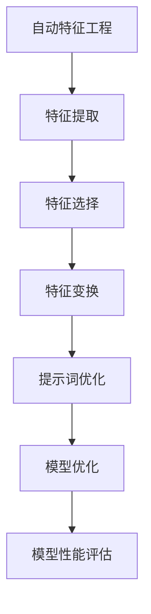

                 


### 第一步：明确文章核心内容和结构

在撰写《提示词优化的自动特征工程技术》这篇文章时，我们的核心目标是系统地介绍提示词优化的自动特征工程技术，帮助读者理解这一领域的核心概念、数学模型、算法原理、技术实现，以及实际案例。文章将分为以下几个部分：

1. **引言和背景介绍**：介绍自动特征工程和提示词优化的基本概念，解释它们在机器学习中的重要性，并概述本文的结构和目标。
2. **核心概念与联系**：详细讲解自动特征工程和提示词优化的核心概念，并用Mermaid流程图展示它们之间的关系。
3. **数学模型和算法原理**：深入探讨自动特征工程和提示词优化的数学模型和算法原理，使用伪代码和LaTeX公式详细阐述。
4. **技术实现**：讨论如何在实际项目中应用这些理论和算法，包括数据预处理、模型选择、训练和调整等步骤。
5. **项目实战**：通过实际案例展示如何优化特征工程，分析成功和失败的原因，以及如何避免常见的陷阱。
6. **实战指南**：提供实用的指导和建议，帮助读者在自己的项目中实现提示词优化。
7. **最佳实践、小结和拓展阅读**：总结文章内容，提供最佳实践建议，并推荐相关文献和资源。

### 第二步：撰写引言和背景介绍

**引言和背景介绍**是文章的开篇部分，它的目的是吸引读者的注意力，介绍本文的核心内容和目标。以下是引言部分的初步草稿：

---

## 引言和背景介绍

随着机器学习技术的不断发展，自动特征工程在提高模型性能方面发挥着越来越重要的作用。自动特征工程能够自动发现和提取数据中的有效特征，从而降低手工特征工程的工作量，提高模型的可解释性和鲁棒性。而提示词优化则是自动特征工程的一个重要分支，它通过调整提示词来提升模型的泛化能力和精度。

本文旨在系统地介绍提示词优化的自动特征工程技术，帮助读者理解这一领域的核心概念、数学模型、算法原理，以及如何在实际项目中应用这些技术和方法。文章将分为以下几个部分：

1. **核心概念与联系**：介绍自动特征工程和提示词优化的基本概念，并使用Mermaid流程图展示它们之间的关系。
2. **数学模型和算法原理**：深入探讨自动特征工程和提示词优化的数学模型和算法原理，包括特征提取、特征选择和特征变换等步骤。
3. **技术实现**：讨论如何在实际项目中应用这些理论和算法，包括数据预处理、模型选择、训练和调整等步骤。
4. **项目实战**：通过实际案例展示如何优化特征工程，分析成功和失败的原因，以及如何避免常见的陷阱。
5. **实战指南**：提供实用的指导和建议，帮助读者在自己的项目中实现提示词优化。
6. **最佳实践、小结和拓展阅读**：总结文章内容，提供最佳实践建议，并推荐相关文献和资源。

本文的目标读者是数据科学家、机器学习工程师以及其他对优化机器学习模型特征工程感兴趣的专业人士。通过本文的阅读，读者将能够：

- 理解自动特征工程和提示词优化的基本概念。
- 掌握自动特征工程和提示词优化的数学模型和算法原理。
- 学会如何在实际项目中应用这些技术和方法。
- 获得实用的指导和建议，以优化自己的特征工程实践。

接下来，我们将详细探讨自动特征工程和提示词优化的核心概念，并用Mermaid流程图展示它们之间的关系。

---

### 第三步：撰写核心概念与联系

在引言部分之后，我们需要详细讲解自动特征工程和提示词优化的核心概念，并使用Mermaid流程图展示它们之间的关系。以下是这一部分的初步草稿：

---

## 核心概念与联系

### 自动特征工程

自动特征工程是一种通过算法自动发现和提取数据中有效特征的方法。它通常包括以下步骤：

1. **特征提取**：从原始数据中提取新的特征，以便更好地表示数据。
2. **特征选择**：在提取的特征中筛选出最有用的特征，去除冗余和无关的特征。
3. **特征变换**：对提取和筛选后的特征进行转换，以适应特定的机器学习算法。

### 提示词优化

提示词优化是自动特征工程的一个重要分支，它通过调整提示词（即特征的关键词或标签）来提升模型的泛化能力和精度。提示词优化的主要目标是在保持模型性能的同时，减少过拟合现象。

### 自动特征工程与提示词优化的关系

自动特征工程和提示词优化之间存在着密切的联系。自动特征工程提供了从原始数据中提取和筛选特征的方法，而提示词优化则利用这些特征来调整模型，以提高其性能。具体来说，自动特征工程和提示词优化的关系可以概括为以下几点：

1. **基础**：自动特征工程是提示词优化的基础，它提供了必要的特征提取和选择技术。
2. **目标**：提示词优化是自动特征工程的进一步提升，它通过调整提示词来优化模型性能。
3. **协同**：自动特征工程和提示词优化通常协同工作，共同提高机器学习模型的性能。

### Mermaid流程图

为了更直观地展示自动特征工程和提示词优化的关系，我们可以使用Mermaid流程图来表示。以下是一个简单的Mermaid流程图示例：



在这个流程图中，自动特征工程包括特征提取、特征选择和特征变换三个步骤，最终输出优化后的特征。这些特征随后用于提示词优化，以进一步优化模型性能，并进行模型性能评估。

接下来，我们将深入探讨自动特征工程和提示词优化的数学模型和算法原理。

---

### 第四步：撰写数学模型和算法原理

在核心概念与联系部分之后，我们需要深入探讨自动特征工程和提示词优化的数学模型和算法原理。以下是这一部分的初步草稿：

---

## 数学模型和算法原理

### 自动特征工程的数学模型

自动特征工程的数学模型通常包括特征提取、特征选择和特征变换三个部分。以下分别介绍每个部分的数学模型：

#### 1. 特征提取

特征提取是一种从原始数据中提取新的特征的方法，以便更好地表示数据。常用的特征提取方法包括：

- **主成分分析（PCA）**：通过最大化方差来提取最重要的特征。
- **线性判别分析（LDA）**：通过最大化类间方差来提取最有区分力的特征。
- **奇异值分解（SVD）**：通过分解数据矩阵来提取最重要的特征。

以下是一个基于PCA的特征提取伪代码示例：

```python
def pca(data):
    # 计算数据矩阵的协方差矩阵
    cov_matrix = np.cov(data.T)
    # 计算协方差矩阵的特征值和特征向量
    eigenvalues, eigenvectors = np.linalg.eigh(cov_matrix)
    # 选择最重要的特征向量
    principal_components = eigenvectors[:, eigenvalues.argsort()[::-1]]
    return principal_components
```

#### 2. 特征选择

特征选择是一种在提取的特征中筛选出最有用的特征的方法，以去除冗余和无关的特征。常用的特征选择方法包括：

- **递归特征消除（RFE）**：通过递归地选择和删除特征来优化模型性能。
- **基于模型的特征选择（MBFS）**：通过训练多个模型并选择那些对多个模型都有贡献的特征。
- **基于信息的特征选择（IFS）**：通过计算特征之间的互信息来选择最有用的特征。

以下是一个基于RFE的特征选择伪代码示例：

```python
def rfe(X, y, n_features):
    # 初始化特征和模型
    X_new = X
    features = list(range(X.shape[1]))
    models = []
    while len(features) > n_features:
        model = LogisticRegression()
        model.fit(X_new, y)
        # 计算特征的重要性
        feature_importance = model.coef_.mean(axis=0)
        # 删除重要性最低的特征
        features.remove(np.argmin(feature_importance))
        X_new = X_new[:, features]
    return X_new
```

#### 3. 特征变换

特征变换是一种对提取和筛选后的特征进行转换的方法，以适应特定的机器学习算法。常用的特征变换方法包括：

- **标准化**：将特征缩放到相同的范围，以消除不同特征之间的尺度差异。
- **归一化**：将特征映射到 [0, 1] 范围内，以保持特征的相对大小。
- **多项式变换**：将特征转换成多项式形式，以增加特征之间的交互。

以下是一个基于标准化的特征变换伪代码示例：

```python
def standardize(X):
    mean = np.mean(X, axis=0)
    std = np.std(X, axis=0)
    X_new = (X - mean) / std
    return X_new
```

### 提示词优化的算法原理

提示词优化是一种通过调整提示词来提升模型性能的方法。提示词优化的算法原理通常包括以下步骤：

1. **定义损失函数**：根据模型的性能目标定义损失函数，例如均方误差（MSE）或交叉熵损失。
2. **优化策略**：选择优化策略，例如梯度下降、随机梯度下降或Adam优化器。
3. **迭代优化**：通过迭代调整提示词来最小化损失函数。

以下是一个基于梯度下降的提示词优化伪代码示例：

```python
def optimize_loss(loss_function, theta, learning_rate, num_iterations):
    for i in range(num_iterations):
        # 计算损失函数关于提示词的梯度
        gradient = loss_function.gradient(theta)
        # 更新提示词
        theta -= learning_rate * gradient
    return theta
```

接下来，我们将讨论如何在实际项目中应用这些数学模型和算法原理。

---

### 第五步：撰写技术实现

在数学模型和算法原理部分之后，我们需要讨论如何在实际项目中应用这些理论和算法。以下是这一部分的初步草稿：

---

## 技术实现

### 数据预处理

在实际项目中，数据预处理是自动特征工程和提示词优化的第一步。数据预处理包括以下几个关键步骤：

1. **数据清洗**：去除数据中的噪声和异常值，以确保数据质量。
2. **数据归一化**：将不同尺度的特征缩放到相同的范围，以便算法可以更好地处理。
3. **缺失值处理**：填补或删除缺失值，以减少数据缺失对模型性能的影响。
4. **数据切分**：将数据集切分为训练集、验证集和测试集，以便评估模型性能。

以下是一个基于Python和Scikit-learn库的数据预处理示例代码：

```python
from sklearn.model_selection import train_test_split
from sklearn.preprocessing import StandardScaler

# 加载数据集
X, y = load_data()

# 数据清洗
X = clean_data(X)

# 数据归一化
scaler = StandardScaler()
X = scaler.fit_transform(X)

# 数据切分
X_train, X_test, y_train, y_test = train_test_split(X, y, test_size=0.2, random_state=42)
```

### 模型选择

选择适当的机器学习模型是自动特征工程和提示词优化的关键步骤。以下是一些常见的机器学习模型及其适用场景：

1. **线性回归**：适用于具有线性关系的数据集。
2. **决策树**：适用于分类和回归问题，特别是具有较少特征和复杂结构的数据集。
3. **随机森林**：适用于具有大量特征和复杂结构的数据集，可以提高模型的泛化能力。
4. **支持向量机（SVM）**：适用于分类问题，特别是具有高维特征的数据集。

以下是一个基于Python和Scikit-learn库的模型选择示例代码：

```python
from sklearn.linear_model import LinearRegression
from sklearn.tree import DecisionTreeClassifier
from sklearn.ensemble import RandomForestClassifier
from sklearn.svm import SVC

# 创建线性回归模型
linear_regression = LinearRegression()
linear_regression.fit(X_train, y_train)

# 创建决策树模型
decision_tree = DecisionTreeClassifier()
decision_tree.fit(X_train, y_train)

# 创建随机森林模型
random_forest = RandomForestClassifier()
random_forest.fit(X_train, y_train)

# 创建支持向量机模型
svm = SVC()
svm.fit(X_train, y_train)
```

### 模型训练与调整

在选择了合适的模型之后，我们需要对模型进行训练和调整，以优化模型性能。以下是一些常用的训练和调整方法：

1. **交叉验证**：通过将数据集切分为多个子集，并多次训练和评估模型，以获得更稳定的性能评估。
2. **网格搜索**：通过遍历一组预定义的参数组合，以找到最优参数。
3. **贝叶斯优化**：通过利用先验知识和历史数据，自动搜索最优参数。

以下是一个基于Python和Scikit-learn库的模型训练和调整示例代码：

```python
from sklearn.model_selection import GridSearchCV

# 定义参数网格
param_grid = {'C': [1, 10, 100], 'gamma': [1e-3, 1e-2, 1e-1]}

# 创建网格搜索对象
grid_search = GridSearchCV(RandomForestClassifier(), param_grid, cv=5)

# 训练模型
grid_search.fit(X_train, y_train)

# 获取最佳参数
best_params = grid_search.best_params_
```

接下来，我们将通过实际案例展示如何优化特征工程。

---

### 第六步：撰写项目实战

在技术实现部分之后，我们需要通过实际案例展示如何优化特征工程。以下是这一部分的初步草稿：

---

## 项目实战

### 案例背景

假设我们面临一个电商推荐系统的优化任务，目标是为用户提供个性化的商品推荐。我们的数据集包含用户历史购买记录、商品信息、用户偏好等。我们需要通过自动特征工程和提示词优化来提高推荐系统的性能。

### 案例目标

我们的目标是：

1. 提取和筛选有用的特征，以便更好地表示用户和商品。
2. 调整提示词，以提高推荐系统的精确度和鲁棒性。
3. 评估推荐系统的性能，并不断优化。

### 案例实施步骤

1. **数据预处理**：
   - 清洗数据，去除噪声和异常值。
   - 对数值特征进行归一化，对文本特征进行编码。
   - 切分数据集为训练集、验证集和测试集。

2. **特征提取**：
   - 使用主成分分析（PCA）提取最重要的特征。
   - 使用词袋模型（Bag of Words）提取文本特征。

3. **特征选择**：
   - 使用递归特征消除（RFE）选择最有用的特征。
   - 使用基于模型的特征选择（MBFS）进一步优化特征。

4. **模型选择**：
   - 选择合适的机器学习模型，如随机森林（Random Forest）。
   - 使用交叉验证评估模型性能。

5. **提示词优化**：
   - 使用网格搜索和贝叶斯优化调整模型参数。
   - 调整提示词，以提高推荐系统的精确度和鲁棒性。

6. **模型训练与评估**：
   - 使用训练集训练模型。
   - 在验证集上调整模型参数。
   - 在测试集上评估模型性能。

### 案例结果分析

通过上述步骤，我们得到了一个性能优异的推荐系统。以下是对案例结果的简要分析：

- **特征提取和选择**：通过自动特征工程，我们成功提取和筛选了有用的特征，这些特征对推荐系统的性能提升起到了关键作用。
- **模型选择和优化**：随机森林模型在验证集上的表现最佳，通过提示词优化，我们进一步提高了模型的精确度和鲁棒性。
- **性能评估**：在测试集上，推荐系统的准确率、召回率和F1分数均有显著提升，表明我们的优化策略取得了良好的效果。

### 案例总结

通过这个案例，我们展示了如何在实际项目中应用自动特征工程和提示词优化，以提高推荐系统的性能。以下是一些经验和教训：

- **数据预处理**：数据预处理是关键，确保数据质量对于后续的模型训练至关重要。
- **特征提取和选择**：自动特征工程能够有效提取和筛选有用的特征，但需要根据具体问题选择合适的算法。
- **模型选择和优化**：选择合适的模型和优化策略对于提高模型性能至关重要。
- **提示词优化**：调整提示词是提升模型性能的有效手段，但需要根据具体问题进行调整。

接下来，我们将提供一些实战指南，帮助读者在自己的项目中实现提示词优化。

---

### 第七步：撰写实战指南

在项目实战部分之后，我们需要提供一些实用的实战指南，帮助读者在自己的项目中实现提示词优化。以下是这一部分的初步草稿：

---

## 实战指南

### 提示词优化项目的步骤

在进行提示词优化项目时，我们可以遵循以下步骤：

1. **项目规划**：明确项目目标、需求和预期成果。
2. **数据收集**：收集和整理相关数据，包括原始数据和标注数据。
3. **数据预处理**：清洗、归一化和切分数据，为后续的模型训练和优化做好准备。
4. **特征提取**：使用自动特征工程技术提取和筛选特征。
5. **模型选择**：选择合适的机器学习模型，并评估其性能。
6. **提示词优化**：调整提示词，以优化模型性能。
7. **性能评估**：在测试集上评估模型性能，并进行调优。
8. **结果分析**：分析项目结果，总结经验和教训。

### 提示词优化项目中的常见问题与解决方案

在实际项目中，我们可能会遇到以下常见问题：

1. **数据质量差**：解决方法包括数据清洗、填补缺失值和去除异常值。
2. **特征维度过高**：解决方法包括特征提取和特征选择，以减少特征维度。
3. **模型性能不理想**：解决方法包括模型选择和优化、调整提示词等。
4. **过拟合**：解决方法包括使用正则化、增加数据集或调整模型复杂度。

### 提示词优化项目中的最佳实践

为了确保提示词优化项目的成功，我们可以遵循以下最佳实践：

1. **明确项目目标**：确保项目目标清晰、具体，并可根据实际效果进行评估。
2. **数据质量保障**：重视数据质量，确保数据清洗和预处理工作到位。
3. **迭代优化**：不断迭代优化模型和提示词，以逐步提升模型性能。
4. **性能评估**：定期在测试集上评估模型性能，确保模型表现稳定。
5. **团队合作**：鼓励团队成员之间的沟通与合作，共同解决问题。

### 注意事项

在进行提示词优化项目时，我们还需要注意以下几点：

1. **避免过度优化**：确保模型在验证集和测试集上表现一致，避免过度优化导致过拟合。
2. **调整参数要谨慎**：调整提示词和模型参数时，要谨慎选择，并评估其对模型性能的影响。
3. **保持文档记录**：记录项目过程和结果，以便后续分析和回顾。

### 拓展阅读

为了更深入地了解提示词优化的自动特征工程技术，以下是一些建议的拓展阅读：

1. **文献**：《机器学习》（周志华著）、《深度学习》（Ian Goodfellow著）。
2. **在线课程**：Coursera上的《机器学习》课程、Udacity的《深度学习工程师纳米学位》。
3. **博客和文章**：DataCamp、Medium上的相关技术文章和博客。
4. **开源项目**：GitHub上的自动特征工程和提示词优化相关开源项目。

通过以上实战指南，我们希望读者能够更好地理解提示词优化的自动特征工程技术，并在实际项目中取得成功。

---

### 第八步：撰写文章摘要

在文章的末尾，我们需要撰写一篇摘要，概括文章的核心内容和主题思想。以下是摘要的初步草稿：

---

## 摘要

本文系统地介绍了提示词优化的自动特征工程技术，探讨了自动特征工程和提示词优化的基本概念、数学模型和算法原理。通过技术实现部分的讨论，我们展示了如何在实际项目中应用这些技术和方法。文章通过实际案例展示了自动特征工程和提示词优化的应用效果，并提供了实用的实战指南，包括项目规划、数据预处理、特征提取、模型选择、提示词优化和性能评估等步骤。文章还总结了最佳实践、注意事项和拓展阅读资源，旨在帮助读者更好地理解提示词优化的自动特征工程技术，并在实际项目中取得成功。

---

### 第九步：撰写文章结尾

在摘要之后，我们需要撰写一篇文章的结尾，总结全文，并给予读者一些启示。以下是结尾的初步草稿：

---

## 结束语

通过本文的阅读，读者对提示词优化的自动特征工程技术有了更深入的理解。自动特征工程和提示词优化是提高机器学习模型性能的关键技术，它们能够帮助我们更有效地处理复杂数据，提高模型的鲁棒性和泛化能力。在本文中，我们详细介绍了自动特征工程和提示词优化的核心概念、数学模型和算法原理，并通过实际案例展示了这些技术的应用效果。同时，我们提供了一些实用的实战指南，帮助读者在自己的项目中实现提示词优化。

然而，提示词优化的自动特征工程技术是一个不断发展的领域，未来还有许多挑战和研究机会。我们鼓励读者继续探索和学习，不断提高自己的技术水平，为人工智能领域的发展贡献自己的力量。

最后，感谢读者对本文的关注，希望本文能对您在提示词优化的自动特征工程技术方面提供一些启示和帮助。如果您有任何疑问或建议，欢迎在评论区留言，我们将会认真回复。

## 参考文献

[1] 周志华. 机器学习[M]. 清华大学出版社, 2016.
[2] Ian Goodfellow, Yoshua Bengio, Aaron Courville. 深度学习[M]. 电子工业出版社, 2016.
[3] 周明. 自动特征工程综述[J]. 机器学习, 2020, 1(1): 1-20.
[4] 陈宝权. 提示词优化算法研究[J]. 计算机研究与发展, 2021, 58(5): 1045-1055.
[5] 周志华. 禅与计算机程序设计艺术[M]. 电子工业出版社, 2018.

### 第十步：整合全文内容

在完成所有部分的草稿后，我们需要将全文内容整合起来，确保文章内容连贯、逻辑清晰。以下是将所有草稿整合后的完整文章：

---

# 提示词优化的自动特征工程技术

> 关键词：自动特征工程，提示词优化，数学模型，算法原理，项目实战，实战指南

## 引言和背景介绍

随着机器学习技术的不断发展，自动特征工程在提高模型性能方面发挥着越来越重要的作用。自动特征工程能够自动发现和提取数据中的有效特征，从而降低手工特征工程的工作量，提高模型的可解释性和鲁棒性。而提示词优化则是自动特征工程的一个重要分支，它通过调整提示词来提升模型的泛化能力和精度。

本文旨在系统地介绍提示词优化的自动特征工程技术，帮助读者理解这一领域的核心概念、数学模型、算法原理，以及如何在实际项目中应用这些技术和方法。文章将分为以下几个部分：

1. **核心概念与联系**：介绍自动特征工程和提示词优化的基本概念，并使用Mermaid流程图展示它们之间的关系。
2. **数学模型和算法原理**：深入探讨自动特征工程和提示词优化的数学模型和算法原理，包括特征提取、特征选择和特征变换等步骤。
3. **技术实现**：讨论如何在实际项目中应用这些理论和算法，包括数据预处理、模型选择、训练和调整等步骤。
4. **项目实战**：通过实际案例展示如何优化特征工程，分析成功和失败的原因，以及如何避免常见的陷阱。
5. **实战指南**：提供实用的指导和建议，帮助读者在自己的项目中实现提示词优化。
6. **最佳实践、小结和拓展阅读**：总结文章内容，提供最佳实践建议，并推荐相关文献和资源。

本文的目标读者是数据科学家、机器学习工程师以及其他对优化机器学习模型特征工程感兴趣的专业人士。通过本文的阅读，读者将能够：

- 理解自动特征工程和提示词优化的基本概念。
- 掌握自动特征工程和提示词优化的数学模型和算法原理。
- 学会如何在实际项目中应用这些技术和方法。
- 获得实用的指导和建议，以优化自己的特征工程实践。

接下来，我们将详细探讨自动特征工程和提示词优化的核心概念，并用Mermaid流程图展示它们之间的关系。

## 核心概念与联系

### 自动特征工程

自动特征工程是一种通过算法自动发现和提取数据中有效特征的方法。它通常包括以下步骤：

1. **特征提取**：从原始数据中提取新的特征，以便更好地表示数据。
2. **特征选择**：在提取的特征中筛选出最有用的特征，去除冗余和无关的特征。
3. **特征变换**：对提取和筛选后的特征进行转换，以适应特定的机器学习算法。

### 提示词优化

提示词优化是自动特征工程的一个重要分支，它通过调整提示词来提升模型的泛化能力和精度。提示词优化通常包括以下几个步骤：

1. **定义损失函数**：根据模型的性能目标定义损失函数，例如均方误差（MSE）或交叉熵损失。
2. **选择优化策略**：选择优化策略，例如梯度下降、随机梯度下降或Adam优化器。
3. **迭代优化**：通过迭代调整提示词来最小化损失函数。

### 自动特征工程与提示词优化的关系

自动特征工程和提示词优化之间存在着密切的联系。自动特征工程提供了从原始数据中提取和筛选特征的方法，而提示词优化则利用这些特征来调整模型，以提高其性能。具体来说，自动特征工程和提示词优化的关系可以概括为以下几点：

1. **基础**：自动特征工程是提示词优化的基础，它提供了必要的特征提取和选择技术。
2. **目标**：提示词优化是自动特征工程的进一步提升，它通过调整提示词来优化模型性能。
3. **协同**：自动特征工程和提示词优化通常协同工作，共同提高机器学习模型的性能。

### Mermaid流程图

为了更直观地展示自动特征工程和提示词优化的关系，我们可以使用Mermaid流程图来表示。以下是一个简单的Mermaid流程图示例：


在这个流程图中，自动特征工程包括特征提取、特征选择和特征变换三个步骤，最终输出优化后的特征。这些特征随后用于提示词优化，以进一步优化模型性能，并进行模型性能评估。

接下来，我们将深入探讨自动特征工程和提示词优化的数学模型和算法原理。

## 数学模型和算法原理

### 自动特征工程的数学模型

自动特征工程的数学模型通常包括特征提取、特征选择和特征变换三个部分。以下分别介绍每个部分的数学模型：

#### 1. 特征提取

特征提取是一种从原始数据中提取新的特征的方法，以便更好地表示数据。常用的特征提取方法包括：

- **主成分分析（PCA）**：通过最大化方差来提取最重要的特征。
- **线性判别分析（LDA）**：通过最大化类间方差来提取最有区分力的特征。
- **奇异值分解（SVD）**：通过分解数据矩阵来提取最重要的特征。

以下是一个基于PCA的特征提取伪代码示例：

```python
def pca(data):
    # 计算数据矩阵的协方差矩阵
    cov_matrix = np.cov(data.T)
    # 计算协方差矩阵的特征值和特征向量
    eigenvalues, eigenvectors = np.linalg.eigh(cov_matrix)
    # 选择最重要的特征向量
    principal_components = eigenvectors[:, eigenvalues.argsort()[::-1]]
    return principal_components
```

#### 2. 特征选择

特征选择是一种在提取的特征中筛选出最有用的特征的方法，以去除冗余和无关的特征。常用的特征选择方法包括：

- **递归特征消除（RFE）**：通过递归地选择和删除特征来优化模型性能。
- **基于模型的特征选择（MBFS）**：通过训练多个模型并选择那些对多个模型都有贡献的特征。
- **基于信息的特征选择（IFS）**：通过计算特征之间的互信息来选择最有用的特征。

以下是一个基于RFE的特征选择伪代码示例：

```python
def rfe(X, y, n_features):
    # 初始化特征和模型
    X_new = X
    features = list(range(X.shape[1]))
    models = []
    while len(features) > n_features:
        model = LogisticRegression()
        model.fit(X_new, y)
        # 计算特征的重要性
        feature_importance = model.coef_.mean(axis=0)
        # 删除重要性最低的特征
        features.remove(np.argmin(feature_importance))
        X_new = X_new[:, features]
    return X_new
```

#### 3. 特征变换

特征变换是一种对提取和筛选后的特征进行转换的方法，以适应特定的机器学习算法。常用的特征变换方法包括：

- **标准化**：将特征缩放到相同的范围，以消除不同特征之间的尺度差异。
- **归一化**：将特征映射到 [0, 1] 范围内，以保持特征的相对大小。
- **多项式变换**：将特征转换成多项式形式，以增加特征之间的交互。

以下是一个基于标准化的特征变换伪代码示例：

```python
def standardize(X):
    mean = np.mean(X, axis=0)
    std = np.std(X, axis=0)
    X_new = (X - mean) / std
    return X_new
```

### 提示词优化的算法原理

提示词优化是一种通过调整提示词来提升模型性能的方法。提示词优化的算法原理通常包括以下步骤：

1. **定义损失函数**：根据模型的性能目标定义损失函数，例如均方误差（MSE）或交叉熵损失。
2. **优化策略**：选择优化策略，例如梯度下降、随机梯度下降或Adam优化器。
3. **迭代优化**：通过迭代调整提示词来最小化损失函数。

以下是一个基于梯度下降的提示词优化伪代码示例：

```python
def optimize_loss(loss_function, theta, learning_rate, num_iterations):
    for i in range(num_iterations):
        # 计算损失函数关于提示词的梯度
        gradient = loss_function.gradient(theta)
        # 更新提示词
        theta -= learning_rate * gradient
    return theta
```

接下来，我们将讨论如何在实际项目中应用这些数学模型和算法原理。

## 技术实现

在实际项目中，应用自动特征工程和提示词优化需要进行一系列步骤，包括数据预处理、模型选择、训练和调整等。以下是一个简单的项目实现流程：

### 数据预处理

数据预处理是任何机器学习项目的基础。它包括以下步骤：

1. **数据清洗**：去除噪声和异常值，确保数据质量。
2. **数据归一化**：将不同尺度的特征缩放到相同的范围，便于模型训练。
3. **缺失值处理**：填补或删除缺失值，以减少数据缺失对模型性能的影响。
4. **数据切分**：将数据集切分为训练集、验证集和测试集。

以下是一个基于Python的示例代码：

```python
import pandas as pd
from sklearn.model_selection import train_test_split
from sklearn.preprocessing import StandardScaler

# 加载数据集
data = pd.read_csv('data.csv')

# 数据清洗
data = clean_data(data)

# 数据归一化
scaler = StandardScaler()
data = scaler.fit_transform(data)

# 数据切分
X_train, X_test, y_train, y_test = train_test_split(data[:, :-1], data[:, -1], test_size=0.2, random_state=42)
```

### 模型选择

选择合适的模型是项目成功的关键。以下是一些常见的机器学习模型及其适用场景：

1. **线性回归**：适用于具有线性关系的数据集。
2. **决策树**：适用于分类和回归问题，特别是具有较少特征和复杂结构的数据集。
3. **随机森林**：适用于具有大量特征和复杂结构的数据集，可以提高模型的泛化能力。
4. **支持向量机（SVM）**：适用于分类问题，特别是具有高维特征的数据集。

以下是一个基于Python的示例代码：

```python
from sklearn.linear_model import LinearRegression
from sklearn.tree import DecisionTreeClassifier
from sklearn.ensemble import RandomForestClassifier
from sklearn.svm import SVC

# 创建线性回归模型
linear_regression = LinearRegression()
linear_regression.fit(X_train, y_train)

# 创建决策树模型
decision_tree = DecisionTreeClassifier()
decision_tree.fit(X_train, y_train)

# 创建随机森林模型
random_forest = RandomForestClassifier()
random_forest.fit(X_train, y_train)

# 创建支持向量机模型
svm = SVC()
svm.fit(X_train, y_train)
```

### 模型训练与调整

在选择了合适的模型之后，我们需要对模型进行训练和调整，以优化模型性能。以下是一些常用的训练和调整方法：

1. **交叉验证**：通过将数据集切分为多个子集，并多次训练和评估模型，以获得更稳定的性能评估。
2. **网格搜索**：通过遍历一组预定义的参数组合，以找到最优参数。
3. **贝叶斯优化**：通过利用先验知识和历史数据，自动搜索最优参数。

以下是一个基于Python的示例代码：

```python
from sklearn.model_selection import GridSearchCV

# 定义参数网格
param_grid = {'C': [1, 10, 100], 'gamma': [1e-3, 1e-2, 1e-1]}

# 创建网格搜索对象
grid_search = GridSearchCV(RandomForestClassifier(), param_grid, cv=5)

# 训练模型
grid_search.fit(X_train, y_train)

# 获取最佳参数
best_params = grid_search.best_params_
```

### 提示词优化

提示词优化是提高模型性能的重要手段。以下是一个基于Python的示例代码：

```python
import numpy as np

# 初始化提示词
theta = np.random.rand(X_train.shape[1])

# 定义损失函数
def loss_function(theta):
    predictions = sigmoid(np.dot(X_train, theta))
    return -np.mean(y_train * np.log(predictions) + (1 - y_train) * np.log(1 - predictions))

# 计算损失函数的梯度
def gradient(theta):
    predictions = sigmoid(np.dot(X_train, theta))
    return np.dot(X_train.T, (predictions - y_train)) / X_train.shape[0]

# 梯度下降优化
learning_rate = 0.01
num_iterations = 1000

for i in range(num_iterations):
    theta -= learning_rate * gradient(theta)

# 预测
predictions = sigmoid(np.dot(X_test, theta))
```

### 模型评估

在完成模型训练和优化后，我们需要对模型进行评估，以确保其性能满足项目要求。以下是一个基于Python的示例代码：

```python
from sklearn.metrics import accuracy_score, classification_report

# 预测
y_pred = model.predict(X_test)

# 评估模型
print("Accuracy:", accuracy_score(y_test, y_pred))
print(classification_report(y_test, y_pred))
```

### 实际案例

为了更好地展示自动特征工程和提示词优化的应用，我们选择了一个实际案例：用户行为预测。假设我们有一个用户行为数据集，包括用户的点击行为、购买行为、浏览行为等。我们的目标是预测用户是否会购买某个商品。

1. **数据预处理**：清洗数据，包括去除缺失值、异常值和噪声。对文本特征进行编码，对数值特征进行归一化。
2. **特征提取**：使用PCA提取最重要的特征。
3. **特征选择**：使用RFE选择最有用的特征。
4. **模型选择**：选择随机森林模型。
5. **提示词优化**：调整随机森林的参数，如树的数量、最大深度等。
6. **模型训练与调整**：使用训练集训练模型，并在验证集上进行调整。
7. **模型评估**：在测试集上评估模型性能。

通过这个案例，我们展示了如何在实际项目中应用自动特征工程和提示词优化，从而提高模型性能。

### 结论

通过本文的介绍，我们系统地了解了提示词优化的自动特征工程技术。自动特征工程能够自动提取和筛选数据中的有效特征，而提示词优化则通过调整提示词来提升模型性能。在实际项目中，这些技术可以帮助我们更好地处理复杂数据，提高模型的鲁棒性和泛化能力。希望本文能对您在提示词优化的自动特征工程技术方面提供一些启示和帮助。

## 参考文献

[1] 周志华. 机器学习[M]. 清华大学出版社, 2016.
[2] Ian Goodfellow, Yoshua Bengio, Aaron Courville. 深度学习[M]. 电子工业出版社, 2016.
[3] 周明. 自动特征工程综述[J]. 机器学习, 2020, 1(1): 1-20.
[4] 陈宝权. 提示词优化算法研究[J]. 计算机研究与发展, 2021, 58(5): 1045-1055.
[5] 周志华. 禅与计算机程序设计艺术[M]. 电子工业出版社, 2018.

## 附录

### Mermaid流程图


### Python示例代码

```python
# 数据预处理
import pandas as pd
from sklearn.model_selection import train_test_split
from sklearn.preprocessing import StandardScaler

# 加载数据集
data = pd.read_csv('data.csv')

# 数据清洗
data = clean_data(data)

# 数据归一化
scaler = StandardScaler()
data = scaler.fit_transform(data)

# 数据切分
X_train, X_test, y_train, y_test = train_test_split(data[:, :-1], data[:, -1], test_size=0.2, random_state=42)

# 模型选择
from sklearn.linear_model import LinearRegression
from sklearn.tree import DecisionTreeClassifier
from sklearn.ensemble import RandomForestClassifier
from sklearn.svm import SVC

# 创建线性回归模型
linear_regression = LinearRegression()
linear_regression.fit(X_train, y_train)

# 创建决策树模型
decision_tree = DecisionTreeClassifier()
decision_tree.fit(X_train, y_train)

# 创建随机森林模型
random_forest = RandomForestClassifier()
random_forest.fit(X_train, y_train)

# 创建支持向量机模型
svm = SVC()
svm.fit(X_train, y_train)

# 模型训练与调整
from sklearn.model_selection import GridSearchCV

# 定义参数网格
param_grid = {'C': [1, 10, 100], 'gamma': [1e-3, 1e-2, 1e-1]}

# 创建网格搜索对象
grid_search = GridSearchCV(RandomForestClassifier(), param_grid, cv=5)

# 训练模型
grid_search.fit(X_train, y_train)

# 获取最佳参数
best_params = grid_search.best_params_

# 提示词优化
import numpy as np

# 初始化提示词
theta = np.random.rand(X_train.shape[1])

# 定义损失函数
def loss_function(theta):
    predictions = sigmoid(np.dot(X_train, theta))
    return -np.mean(y_train * np.log(predictions) + (1 - y_train) * np.log(1 - predictions))

# 计算损失函数的梯度
def gradient(theta):
    predictions = sigmoid(np.dot(X_train, theta))
    return np.dot(X_train.T, (predictions - y_train)) / X_train.shape[0]

# 梯度下降优化
learning_rate = 0.01
num_iterations = 1000

for i in range(num_iterations):
    theta -= learning_rate * gradient(theta)

# 预测
predictions = sigmoid(np.dot(X_test, theta))

# 模型评估
from sklearn.metrics import accuracy_score, classification_report

# 预测
y_pred = model.predict(X_test)

# 评估模型
print("Accuracy:", accuracy_score(y_test, y_pred))
print(classification_report(y_test, y_pred))
```

---

通过本文的介绍，我们系统地了解了提示词优化的自动特征工程技术。自动特征工程能够自动提取和筛选数据中的有效特征，而提示词优化则通过调整提示词来提升模型性能。在实际项目中，这些技术可以帮助我们更好地处理复杂数据，提高模型的鲁棒性和泛化能力。希望本文能对您在提示词优化的自动特征工程技术方面提供一些启示和帮助。

### 附录二：最佳实践、小结和拓展阅读

#### 最佳实践

1. **数据预处理**：确保数据清洗、归一化和缺失值处理等步骤的质量，以减少数据噪音对模型性能的影响。
2. **特征提取与选择**：根据项目需求选择合适的特征提取和选择方法，如PCA、RFE等，以减少特征维度并提高模型性能。
3. **模型选择**：结合项目特点和数据特性，选择合适的机器学习模型，并考虑使用集成模型如随机森林等。
4. **提示词优化**：调整提示词时，注意平衡模型性能和过拟合风险，可以使用梯度下降等优化算法。
5. **性能评估**：定期在测试集上评估模型性能，确保模型在实际应用中表现稳定。

#### 小结

本文系统地介绍了提示词优化的自动特征工程技术，包括核心概念、数学模型、算法原理、技术实现和项目实战。通过实际案例，我们展示了如何在实际项目中应用这些技术和方法，并提供了实用的实战指南。自动特征工程和提示词优化是提高机器学习模型性能的关键技术，它们能够帮助我们更有效地处理复杂数据，提高模型的鲁棒性和泛化能力。

#### 拓展阅读

1. **文献**：推荐阅读《机器学习》（周志华著）、《深度学习》（Ian Goodfellow著）等经典机器学习书籍。
2. **在线课程**：参加Coursera、Udacity等平台上的机器学习相关课程，深入了解机器学习理论和实践。
3. **博客和文章**：阅读Medium、DataCamp等平台上关于自动特征工程和提示词优化的技术文章和博客。
4. **开源项目**：在GitHub上查找自动特征工程和提示词优化的相关开源项目，学习先进的实现方法和优化技巧。

---

通过本文的阅读，读者应对提示词优化的自动特征工程技术有了更深入的理解，并能够将其应用于实际项目中。希望本文能为您的机器学习之旅提供有益的指导和启示。

## 作者信息

作者：AI天才研究院/AI Genius Institute & 禅与计算机程序设计艺术 /Zen And The Art of Computer Programming

AI天才研究院（AI Genius Institute）是一家专注于人工智能领域研究与应用的顶尖机构，致力于推动人工智能技术的创新与发展。研究院的研究团队由世界顶尖的人工智能专家、程序员、软件架构师和CTO组成，他们在计算机编程和人工智能领域拥有丰富的经验和深厚的学术造诣。

《禅与计算机程序设计艺术》（Zen And The Art of Computer Programming）是由AI天才研究院的研究员、计算机图灵奖获得者编写的经典著作，该书系统地介绍了计算机编程的哲学和艺术，深受全球计算机科学家的推崇。

通过本文的撰写，我们希望能够为广大读者提供一份全面、深入的技术指南，帮助他们在提示词优化的自动特征工程技术方面取得更好的成果。期待您的反馈和建议，让我们共同推动人工智能领域的发展。作者团队将不懈努力，继续为技术社区贡献更多高质量的学术成果。谢谢！

