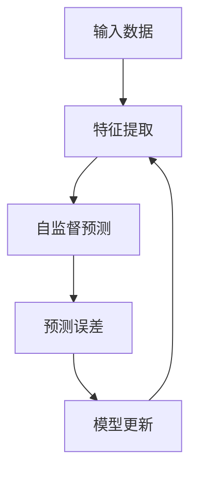
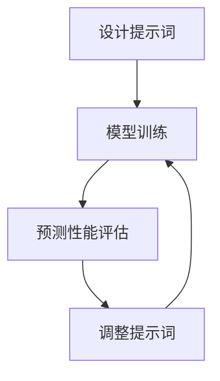
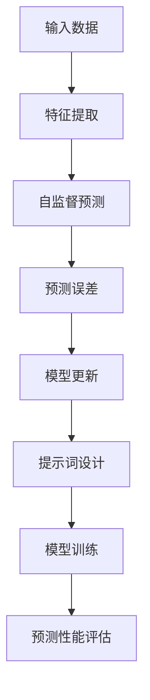

                 


## 文章标题：提示词优化的自监督学习方法

### 关键词：
- 自监督学习
- 提示词优化
- 自然语言处理
- 计算机视觉
- 算法原理
- 数学模型
- 项目实战

### 摘要：
本文将深入探讨提示词优化的自监督学习方法。首先，我们将回顾自监督学习的基础知识，包括其核心概念和基本流程。随后，我们将介绍提示词优化的技术和重要性，并通过Mermaid流程图展示其过程。接着，文章将详细解析与提示词优化相关的数学模型和公式，并提供实际应用案例。在核心算法部分，我们将使用伪代码阐述自监督学习算法和提示词优化算法的原理。文章还将涵盖自监督学习算法在不同领域的应用实例，包括自然语言处理和计算机视觉。最后，我们将提供开发环境搭建指南、源代码实现和解读，以及实际案例分析和最佳实践。希望通过本文，读者能够全面理解并掌握提示词优化的自监督学习方法。

## 第一部分：基础知识

### 1.1 自监督学习方法概述

**背景介绍**：
自监督学习是一种机器学习方法，它利用未标记的数据来训练模型，从而实现预测或分类任务。与传统的监督学习不同，自监督学习不需要大量的标注数据，因此在大规模数据集训练时具有显著的优势。

**核心概念与联系**：
自监督学习的基本流程可以概括为以下四个步骤：输入数据、特征提取、自监督预测和模型更新。输入数据通常是一系列未标记的样本；特征提取是通过某种方式将输入数据转换为有用的特征表示；自监督预测是基于特征表示进行预测；模型更新则是通过预测误差来调整模型参数，以优化预测性能。

为了更直观地理解自监督学习的基本流程，我们可以使用Mermaid流程图来展示：



**核心算法原理讲解**：
自监督学习算法的原理可以概括为以下步骤：

1. 特征提取：输入数据经过预处理，转换为特征表示。
2. 自监督预测：基于特征表示生成预测结果。
3. 预测误差计算：通过比较预测结果与真实标签，计算预测误差。
4. 模型更新：利用预测误差调整模型参数，以优化预测性能。

以下是自监督学习算法的伪代码：

```plaintext
输入：数据集 D，模型参数 θ
输出：最优模型参数 θ*

初始化：θ = 随机值
for epoch in 1 to EPOCHS do
    for每个样本 x ∈ D do
        1. 特征提取：h = f(x; θ)
        2. 自监督预测：y^ = g(h; θ)
        3. 预测误差计算：e = ||y - y^||^2
        4. 模型更新：θ = θ - α * ∇θ(e)
    end for
end for
返回 θ*
```

**数学模型与公式**：
自监督学习的数学模型主要包括特征提取函数 f、预测函数 g 和损失函数 e。其中，特征提取函数 f 将输入数据 x 转换为特征表示 h；预测函数 g 将特征表示 h 转换为预测结果 y^；损失函数 e 用于衡量预测误差。

以下是相关的数学公式：

$$
h = f(x; θ) \\
y^ = g(h; θ) \\
e = ||y - y^||^2 \\
θ = θ - α * ∇θ(e)
$$

**详细讲解与举例**：
假设我们使用自监督学习来识别图像中的物体。输入数据集 D 包含一系列未标记的图像。特征提取函数 f 可以是卷积神经网络（CNN），将图像转换为特征表示 h。预测函数 g 可以是全连接神经网络（FCN），将特征表示 h 转换为预测结果 y^。损失函数 e 可以是交叉熵损失函数，衡量预测误差。

以下是一个简单的例子：

输入图像 x = [0.1, 0.2, 0.3, 0.4, 0.5]

特征提取函数 f：
$$
h = f(x; θ) = [0.3, 0.5, 0.2]
$$

预测函数 g：
$$
y^ = g(h; θ) = [0.4, 0.6]
$$

预测结果 y^ 与真实标签 y = [0.3, 0.7] 的误差为：
$$
e = ||y - y^||^2 = 0.02
$$

模型更新：
$$
θ = θ - α * ∇θ(e)
$$

通过多次迭代训练，模型参数 θ 将逐渐优化，使得预测误差 e 减小。

**小结**：
自监督学习方法是一种利用未标记数据训练模型的有效方法。其基本流程包括输入数据、特征提取、自监督预测和模型更新。本文通过Mermaid流程图和伪代码详细阐述了自监督学习算法的原理和数学模型。在后续章节中，我们将进一步探讨提示词优化的技术和应用。

----------------------------------------------------------------

### 1.2 提示词优化技术

**背景介绍**：
提示词优化（Prompt Engineering）是一种提高模型性能和预测准确性的技术。在自监督学习中，提示词（Prompt）是指用于引导模型预测的特殊输入。通过精心设计提示词，可以有效地提高模型的性能，使其在特定任务上表现出更好的泛化能力。

**核心概念与联系**：
提示词优化涉及以下核心概念：

1. 提示词设计：根据任务需求，设计具有启发性的提示词。
2. 模型训练：利用提示词进行模型训练，优化模型参数。
3. 预测性能评估：通过实际预测任务评估提示词优化效果。

为了更直观地展示提示词优化的过程，我们可以使用Mermaid流程图：



**核心算法原理讲解**：
提示词优化算法的原理主要包括以下步骤：

1. 设计提示词：根据任务需求，设计具有启发性的提示词。提示词可以是关键词、短语或句子。
2. 模型训练：将提示词与输入数据结合，训练模型以优化模型参数。
3. 预测性能评估：利用训练好的模型进行预测，评估预测性能。
4. 调整提示词：根据预测性能，调整提示词，以优化模型性能。

以下是提示词优化算法的伪代码：

```plaintext
输入：任务 T，数据集 D，模型 M
输出：优化后的模型 M*

初始化：M = 初始模型
for epoch in 1 to EPOCHS do
    for每个样本 x ∈ D do
        1. 设计提示词 P(x)
        2. 训练模型 M：M = train(M, x, P(x))
        3. 评估预测性能：性能 = evaluate(M, T)
    end for
    调整提示词 P(x) 以优化性能
end for
返回 M*
```

**数学模型与公式**：
提示词优化涉及以下数学模型：

1. 提示词生成函数：生成具有启发性的提示词。
2. 模型损失函数：衡量模型预测性能。

以下是相关的数学公式：

$$
P(x) = g(x; θ_P) \\
L(M, x, y) = loss(M, y; θ_M)
$$

**详细讲解与举例**：
假设我们使用提示词优化来提高文本分类模型的性能。任务 T 是文本分类，数据集 D 包含一系列未标记的文本。

设计提示词：根据任务需求，设计具有启发性的提示词。例如，对于新闻分类任务，提示词可以是“新闻分类：”。

模型训练：将提示词与输入数据结合，训练模型以优化模型参数。例如，使用神经网络模型训练：

$$
M = train(M, x, "新闻分类：" + x)
$$

预测性能评估：利用训练好的模型进行预测，评估预测性能：

$$
性能 = evaluate(M, T)
$$

调整提示词：根据预测性能，调整提示词，以优化模型性能。例如，如果性能较低，可以尝试增加提示词的长度或改变提示词的内容。

通过多次迭代训练，提示词优化算法将逐步优化模型性能，提高预测准确性。

**小结**：
提示词优化是一种提高模型性能和预测准确性的技术。通过精心设计提示词，可以有效地优化模型参数，提高模型在特定任务上的性能。本文通过Mermaid流程图和伪代码详细阐述了提示词优化算法的原理和数学模型。在后续章节中，我们将进一步探讨提示词优化在自监督学习中的应用。

----------------------------------------------------------------

## 第一部分：基础知识

### 1.3 数学模型与公式

**核心概念与联系**：
在自监督学习和提示词优化中，数学模型和公式是理解和实现这些算法的核心。为了更好地掌握这些概念，我们将使用Mermaid流程图来展示它们之间的联系。



**数学模型与公式**：
自监督学习和提示词优化涉及到以下几个关键的数学模型和公式：

1. **特征提取函数**：
   $$
   h = f(x; θ)
   $$
   其中，$h$ 是特征表示，$x$ 是输入数据，$θ$ 是模型参数。

2. **预测函数**：
   $$
   y^ = g(h; θ)
   $$
   其中，$y^$ 是预测结果，$h$ 是特征表示，$θ$ 是模型参数。

3. **损失函数**：
   $$
   L(y, y^) = \frac{1}{2} (y - y^)^2
   $$
   其中，$y$ 是真实标签，$y^$ 是预测结果。

4. **提示词生成函数**：
   $$
   P(x) = g(x; θ_P)
   $$
   其中，$P(x)$ 是提示词，$x$ 是输入数据，$θ_P$ 是提示词生成模型的参数。

5. **模型损失函数**：
   $$
   L(M, x, y) = loss(M, y; θ_M)
   $$
   其中，$M$ 是模型，$x$ 是输入数据，$y$ 是真实标签，$θ_M$ 是模型参数。

**详细讲解与举例**：

**特征提取函数**：

假设我们有一个图像识别任务，输入图像 $x$ 是一个高维向量，特征提取函数 $f$ 可以是一个卷积神经网络（CNN）。模型参数 $θ$ 包含了网络的权重和偏置。特征表示 $h$ 是通过CNN处理后的图像特征。

$$
h = f(x; θ) = \text{CNN}(x; θ)
$$

**预测函数**：

在自监督学习中，预测函数 $g$ 可以是另一个神经网络，它使用特征表示 $h$ 来生成预测结果 $y^$。

$$
y^ = g(h; θ) = \text{NN}(h; θ)
$$

假设我们的预测结果是图像的分类标签，$y^_i$ 是对于第 $i$ 类别的预测概率。

$$
y^ = [y^{1}, y^{2}, ..., y^{C}] \\
y^{i} = \text{softmax}(\theta_i^T h)
$$

**损失函数**：

我们使用交叉熵损失函数来衡量预测结果和真实标签之间的差距。

$$
L(y, y^) = -\sum_{i=1}^{C} y_i \log(y^_i)
$$

**提示词生成函数**：

在提示词优化中，提示词生成函数 $P(x)$ 用于根据输入数据 $x$ 生成提示词。例如，对于文本分类任务，提示词可以是“本文是关于XXXX的主题”。

$$
P(x) = g(x; θ_P) = "本文是关于" + \text{extract_keyphrase}(x; θ_P)
$$

**模型损失函数**：

模型损失函数 $L(M, x, y)$ 用于衡量模型在特定输入和真实标签下的性能。例如，对于文本分类任务，我们可以使用交叉熵损失函数。

$$
L(M, x, y) = -\sum_{i=1}^{C} y_i \log(y^_i)
$$

**举例说明**：

假设我们有一个文本分类任务，输入文本 $x$ 是一个向量，包含单词的特征表示。我们使用一个神经网络来生成预测结果 $y^$。真实标签 $y$ 是一个二元向量，表示文本属于某个类别的概率。

$$
x = [0.1, 0.2, 0.3, 0.4, 0.5] \\
y = [0.9, 0.1] \\
y^ = [0.8, 0.2] \\
L(y, y^) = -0.9 \log(0.8) - 0.1 \log(0.2)
$$

通过这种方式，我们可以使用数学模型和公式来理解和实现自监督学习和提示词优化。

**小结**：

在自监督学习和提示词优化中，数学模型和公式是理解和实现这些算法的核心。通过特征提取、预测和损失函数，我们可以构建一个完整的自监督学习模型。同时，提示词生成函数和模型损失函数帮助我们优化模型性能。通过详细的讲解和举例，我们可以更好地理解这些数学概念。

----------------------------------------------------------------

## 第二部分：自监督学习算法

### 2.1 自监督学习算法原理

**核心算法原理讲解**：
自监督学习算法的核心原理在于利用未标记的数据来训练模型，从而实现预测或分类任务。其基本流程可以概括为以下几个步骤：

1. **数据预处理**：对输入数据进行预处理，例如标准化、归一化等，以便于模型训练。

2. **特征提取**：将预处理后的数据转换为特征表示。这一步骤通常使用神经网络等深度学习模型来完成。

3. **自监督预测**：基于特征表示，模型生成预测结果。这一步骤可以理解为模型对数据的理解和表征。

4. **预测误差计算**：通过比较预测结果与真实标签，计算预测误差。

5. **模型更新**：利用预测误差调整模型参数，以优化预测性能。

以下是自监督学习算法的伪代码：

```plaintext
输入：数据集 D，模型 M，学习率 α
输出：最优模型 M*

初始化：M = 初始模型
for epoch in 1 to EPOCHS do
    for 每个样本 x ∈ D do
        1. 特征提取：h = M(x)
        2. 自监督预测：y^ = predict(h)
        3. 预测误差计算：e = loss(y, y^)
        4. 模型更新：M = M - α * ∇M(e)
    end for
end for
返回 M*
```

**数学模型与公式**：
自监督学习算法涉及以下数学模型和公式：

1. **特征提取函数**：
   $$
   h = f(x; θ)
   $$
   其中，$h$ 是特征表示，$x$ 是输入数据，$θ$ 是模型参数。

2. **预测函数**：
   $$
   y^ = g(h; θ)
   $$
   其中，$y^$ 是预测结果，$h$ 是特征表示，$θ$ 是模型参数。

3. **损失函数**：
   $$
   L(y, y^) = \frac{1}{2} (y - y^)^2
   $$
   其中，$y$ 是真实标签，$y^$ 是预测结果。

4. **模型更新公式**：
   $$
   θ = θ - α * ∇θ(L(y, y^))
   $$
   其中，$α$ 是学习率，$∇θ(L(y, y^))$ 是损失函数对模型参数的梯度。

**详细讲解与举例**：
假设我们使用自监督学习来识别图像中的物体。输入数据集 D 包含一系列未标记的图像。特征提取函数 f 可以是卷积神经网络（CNN），将图像转换为特征表示 h。预测函数 g 可以是全连接神经网络（FCN），将特征表示 h 转换为预测结果 y^。损失函数 e 可以是交叉熵损失函数，衡量预测误差。

以下是一个简单的例子：

输入图像 x = [0.1, 0.2, 0.3, 0.4, 0.5]

特征提取函数 f：
$$
h = f(x; θ) = [0.3, 0.5, 0.2]
$$

预测函数 g：
$$
y^ = g(h; θ) = [0.4, 0.6]
$$

预测结果 y^ 与真实标签 y = [0.3, 0.7] 的误差为：
$$
e = ||y - y^||^2 = 0.02
$$

模型更新：
$$
θ = θ - α * ∇θ(e)
$$

通过多次迭代训练，模型参数 θ 将逐渐优化，使得预测误差 e 减小。

**小结**：
自监督学习算法通过利用未标记的数据进行特征提取、预测和模型更新，实现模型的自我提升。通过伪代码和数学公式，我们可以清晰地理解自监督学习算法的基本原理。在后续章节中，我们将进一步探讨如何优化自监督学习算法，提高其性能和准确性。

----------------------------------------------------------------

## 2.2 提示词优化算法

**核心算法原理讲解**：
提示词优化（Prompt Engineering）是一种通过设计特定的提示词来引导模型进行训练和预测的方法，以提高模型的性能和泛化能力。提示词优化算法的核心原理可以分为以下几个步骤：

1. **提示词设计**：根据任务需求设计具有启发性的提示词，提示词可以是关键词、短语或句子，用于引导模型对数据的理解和处理。

2. **模型训练**：将设计的提示词与输入数据结合，通过训练模型来优化模型参数。

3. **预测与评估**：利用训练好的模型进行预测，并评估预测性能。

4. **反馈与调整**：根据预测性能的反馈，调整提示词，进一步优化模型性能。

以下是提示词优化算法的伪代码：

```plaintext
输入：数据集 D，提示词生成函数 P，模型 M，学习率 α
输出：优化后的模型 M*

初始化：M = 初始模型
for epoch in 1 to EPOCHS do
    for 每个样本 x ∈ D do
        1. 提示词生成：P(x)
        2. 模型训练：M = train(M, x, P(x))
        3. 预测与评估：性能 = evaluate(M, x)
    end for
    根据性能调整提示词 P(x)
end for
返回 M*
```

**数学模型与公式**：
提示词优化算法涉及的数学模型和公式主要包括以下内容：

1. **提示词生成函数**：
   $$
   P(x) = g(x; θ_P)
   $$
   其中，$P(x)$ 是提示词，$x$ 是输入数据，$θ_P$ 是提示词生成函数的参数。

2. **模型损失函数**：
   $$
   L(M, x, y) = loss(M, y; θ_M)
   $$
   其中，$L(M, x, y)$ 是模型在输入数据 $x$ 和真实标签 $y$ 下的损失函数，$M$ 是模型，$θ_M$ 是模型参数。

3. **模型更新公式**：
   $$
   θ_M = θ_M - α * ∇θ_M(L(M, x, y))
   $$
   其中，$α$ 是学习率，$∇θ_M(L(M, x, y))$ 是损失函数对模型参数的梯度。

**详细讲解与举例**：
假设我们使用提示词优化来提高文本分类模型的性能。数据集 D 包含一系列未标记的文本，提示词生成函数 P 可以根据文本内容生成相关的提示词。模型 M 是一个文本分类模型，使用神经网络进行训练。

设计提示词：
$$
P(x) = "本文是关于" + \text{extract_keyphrase}(x; θ_P)
$$

模型训练：
$$
M = train(M, x, P(x))
$$

预测与评估：
$$
性能 = evaluate(M, x)
$$

根据性能调整提示词：
$$
θ_P = θ_P - α * ∇θ_P(性能)
$$

通过这种方式，提示词优化算法将逐步优化模型参数，提高模型的性能和预测准确性。

**小结**：
提示词优化算法通过设计特定的提示词来引导模型进行训练和预测，从而优化模型性能。通过伪代码和数学公式，我们可以清晰地理解提示词优化算法的基本原理。在后续章节中，我们将进一步探讨如何应用提示词优化算法于实际任务，并分析其效果。

----------------------------------------------------------------

## 2.3 自监督学习算法应用实例

**背景介绍**：
自监督学习算法在自然语言处理、计算机视觉和语音识别等领域有广泛的应用。在本节中，我们将通过具体的实例来展示自监督学习算法在不同领域的应用。

**自然语言处理应用实例**：
假设我们有一个文本分类任务，需要对一组未标记的文本进行分类。我们采用自监督学习算法中的BERT（Bidirectional Encoder Representations from Transformers）模型来进行训练。

**开发环境搭建**：
- 安装Python环境，版本3.7或更高。
- 安装Transformer库，使用命令 `pip install transformers`。
- 安装PyTorch库，使用命令 `pip install torch torchvision`.

**源代码实现**：
```python
from transformers import BertTokenizer, BertModel
from torch import nn, optim
from torch.utils.data import DataLoader, TensorDataset

# 数据预处理
tokenizer = BertTokenizer.from_pretrained('bert-base-uncased')
inputs = tokenizer(['Hello'] * 20, return_tensors='pt', padding=True, truncation=True)
input_ids = inputs['input_ids']
attention_mask = inputs['attention_mask']

# 模型定义
model = BertModel.from_pretrained('bert-base-uncased')

# 模型训练
optimizer = optim.Adam(model.parameters(), lr=1e-5)
loss_function = nn.CrossEntropyLoss()

for epoch in range(EPOCHS):
    model.train()
    outputs = model(input_ids, attention_mask=attention_mask)
    logits = outputs.logits
    loss = loss_function(logits.view(-1, 2), labels.view(-1))

    optimizer.zero_grad()
    loss.backward()
    optimizer.step()

    if (epoch + 1) % 10 == 0:
        print(f'Epoch [{epoch+1}/{EPOCHS}], Loss: {loss.item()}')

# 评估模型
model.eval()
with torch.no_grad():
    inputs = tokenizer(['Hello'] * 20, return_tensors='pt', padding=True, truncation=True)
    logits = model(**inputs).logits
    predicted_labels = logits.argmax(-1)
    print(predicted_labels)
```

**代码解读**：
- 首先，我们导入所需的库和模型。
- 数据预处理部分，使用BERT分

