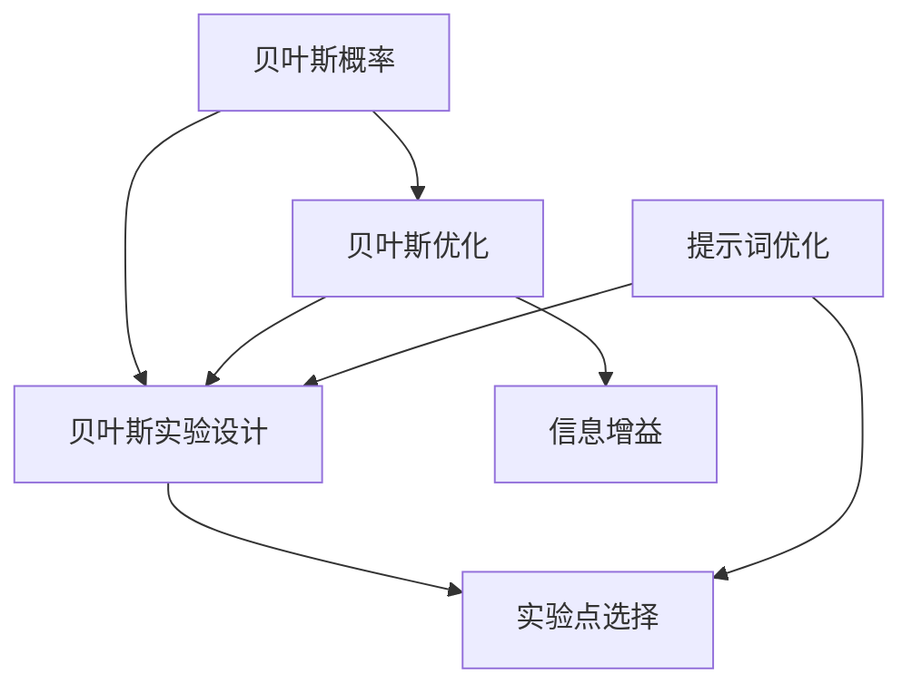

                 

### 背景介绍

提示词优化（Query提示词优化）是自然语言处理（NLP）和人工智能（AI）领域中的一个关键任务，尤其是在生成式预训练模型（如GPT）和问答系统（如ChatGPT）中。其核心目标是通过调整输入的提示词（query），来提高模型生成响应的质量和相关性。在实际应用中，提示词优化能够显著改善用户体验，使得模型的回答更加贴近用户意图，从而提升系统的交互效果。

然而，提示词优化的过程并非易事。由于模型的复杂性和输入空间的多样性，直接通过手动调整提示词来优化生成响应往往效率低下且结果不可控。因此，需要一种系统化的方法来指导提示词的优化过程，确保实验的效率和结果的准确性。

贝叶斯实验设计（Bayesian experimental design）提供了一种强大的解决方案。贝叶斯方法在处理不确定性和复杂模型方面具有独特的优势，它通过结合先验知识和实验数据，提供一种灵活且强大的推断工具。贝叶斯实验设计旨在找到最有价值的实验点，使得实验数据能够最大程度地提高我们对模型的了解。

贝叶斯实验设计在提示词优化中的应用具有以下几个优势：

1. **自适应性和灵活性**：贝叶斯实验设计可以根据已有的数据不断更新和调整实验计划，以最大化信息增益，适应不同场景和需求。

2. **处理不确定性**：贝叶斯方法能够自然地处理模型参数的不确定性，提供更为稳健的推断。

3. **资源优化**：通过优化实验点的选择，贝叶斯实验设计能够提高实验效率，使得有限的资源得到最佳利用。

4. **综合评估**：贝叶斯实验设计不仅关注单一指标的最优化，还能综合考虑多个目标和约束条件，提供更全面的评估。

总之，结合贝叶斯实验设计的方法，可以在提示词优化的过程中实现更加精确和高效的实验控制，从而提高模型生成响应的质量和相关性。接下来，我们将详细探讨贝叶斯实验设计的基本原理、核心算法和其在提示词优化中的应用。

### 核心概念与联系

为了更好地理解贝叶斯实验设计在提示词优化中的应用，首先需要明确几个核心概念及其相互关系。

#### 贝叶斯概率

贝叶斯概率是概率论中的一个重要概念，它描述了在已知某些条件下，某个事件发生的概率。贝叶斯概率的核心是贝叶斯定理，其公式如下：

$$
P(A|B) = \frac{P(B|A)P(A)}{P(B)}
$$

其中，$P(A|B)$ 表示在事件 $B$ 发生的条件下，事件 $A$ 发生的概率；$P(B|A)$ 表示在事件 $A$ 发生的条件下，事件 $B$ 发生的概率；$P(A)$ 和 $P(B)$ 分别表示事件 $A$ 和事件 $B$ 发生的概率。

贝叶斯概率不仅用于单个事件的发生概率，还广泛应用于统计推断和决策理论中，能够有效地处理不确定性问题。

#### 贝叶斯优化

贝叶斯优化（Bayesian Optimization）是一种基于贝叶斯推理的优化算法，主要用于求解黑盒优化问题。其基本思想是通过构建一个贝叶斯模型来近似目标函数，并通过经验风险最小化（Experience Risk Minimization,ERM）来选择下一个最优的实验点。贝叶斯优化的核心流程如下：

1. **先验模型**：选择一个先验模型来表示目标函数的不确定性，常用的模型包括高斯过程（Gaussian Process,GP）和贝叶斯神经网络（Bayesian Neural Networks,BNN）。

2. **似然函数**：在现有数据的基础上，通过似然函数来更新模型参数，通常使用马尔可夫链蒙特卡罗（Markov Chain Monte Carlo, MCMC）方法。

3. **选择下一个实验点**：根据贝叶斯模型的不确定性度量，选择下一个最有信息量的实验点。

4. **模型更新**：在新的实验点上进行实验，收集数据，并使用贝叶斯方法更新模型。

贝叶斯优化的优势在于其能够自适应地调整实验策略，以最大化信息增益，提高优化效率。

#### 贝叶斯实验设计

贝叶斯实验设计（Bayesian Experimental Design）是一种基于贝叶斯统计学的实验方法，其目标是通过选择合适的实验点，以最大化实验数据的信息增益。贝叶斯实验设计的核心在于确定实验点的选择准则，常用的准则包括：

1. **最大似然准则**：选择能够最大化目标变量似然函数的实验点。
2. **最小化均方误差准则**：选择能够最小化目标变量均方误差的实验点。

贝叶斯实验设计与贝叶斯优化之间的联系在于，它们都依赖于贝叶斯推理和概率模型来指导实验和优化过程。贝叶斯实验设计通过选择具有高信息量的实验点，为贝叶斯优化提供了高质量的训练数据，从而提高优化的效率和效果。

#### 提示词优化

提示词优化是自然语言处理中的一个关键任务，其目标是通过调整输入的提示词，来提高模型生成响应的质量和相关性。提示词优化涉及以下核心概念：

1. **提示词**：输入给模型的关键词或短语，用于引导模型生成响应。
2. **生成响应**：模型根据提示词生成的输出文本。
3. **质量评估**：评估生成响应的质量，常用的指标包括语义一致性、语法正确性、信息完整性等。

在提示词优化中，贝叶斯实验设计的方法可以帮助研究人员选择最有价值的提示词组合进行实验，从而提高实验效率和结果准确性。

#### 关系架构

为了更好地理解这些核心概念之间的关系，我们可以使用Mermaid流程图来展示：



在这个流程图中，贝叶斯概率为贝叶斯优化和贝叶斯实验设计提供了理论基础；贝叶斯优化通过贝叶斯实验设计选择实验点，以最大化信息增益；提示词优化利用贝叶斯实验设计方法来优化提示词选择，提高生成响应的质量。

通过上述核心概念及其关系的介绍，我们可以更好地理解贝叶斯实验设计在提示词优化中的应用，为后续章节的详细探讨奠定基础。

### 核心算法原理讲解

在深入探讨提示词优化的贝叶斯实验设计之前，我们需要详细理解贝叶斯优化算法的基本原理。贝叶斯优化是一种基于贝叶斯推理的优化算法，广泛应用于黑盒优化问题。以下是贝叶斯优化算法的核心原理及其实现过程。

#### 贝叶斯优化算法概述

贝叶斯优化算法的核心思想是通过构建一个贝叶斯模型来近似目标函数，并在每次迭代中选择具有最大预期信息量的实验点，以最大化整个实验过程的信息增益。贝叶斯优化算法通常包括以下几个步骤：

1. **构建先验模型**：选择一个合适的贝叶斯模型来近似目标函数，常用的模型包括高斯过程（Gaussian Process, GP）和贝叶斯神经网络（Bayesian Neural Networks, BNN）。

2. **似然函数更新**：在已有数据的基础上，通过似然函数更新模型参数，以适应新的实验数据。

3. **选择下一个实验点**：根据模型的不确定性度量，选择具有最大预期信息增益的实验点。

4. **模型更新**：在新的实验点上进行实验，收集数据，并使用贝叶斯方法更新模型。

#### 高斯过程优化（Gaussian Process Optimization）

高斯过程（Gaussian Process, GP）是一种常用的贝叶斯模型，用于近似连续目标函数。其优点在于能够灵活地处理目标函数的不确定性，并通过贝叶斯推理实现自适应优化。

##### 高斯过程原理

高斯过程是一种概率模型，它将目标函数视为随机过程，其任意两个取值的联合分布服从高斯分布。具体来说，高斯过程的定义如下：

$$
f(x) \sim GP(m(x), k(x, x'))
$$

其中，$f(x)$ 表示目标函数在输入 $x$ 处的取值；$m(x)$ 是均值函数，描述了目标函数的期望趋势；$k(x, x')$ 是协方差函数，描述了目标函数在不同输入点之间的相关性。

常用的均值函数和协方差函数如下：

- **均值函数**：
  - 线性均值函数：$m(x) = \mu$
  - 常数均值函数：$m(x) = 0$

- **协方差函数**：
  - 矩形核（也称为Matérn核）：$k(x, x') = \sigma^2 \exp\left(-\frac{\sqrt{5}}{2} \frac{\|x - x'\|}{\ell}\right)$
  - 高斯核（也称为Radial Basis Function, RBF）：$k(x, x') = \sigma^2 \exp\left(-\frac{\|x - x'\|^2}{2\ell^2}\right)$

##### 高斯过程优化步骤

1. **构建先验模型**：选择合适的均值函数和协方差函数，构建高斯过程模型。

2. **初始采样**：在定义域内随机选择若干初始样本点，计算对应的函数值，用于初始化模型。

3. **模型更新**：使用贝叶斯推理更新模型参数，通常采用马尔可夫链蒙特卡罗（MCMC）方法。

4. **选择下一个实验点**：根据模型的不确定性度量，选择具有最大预期信息增益的实验点。常用的不确定性度量包括后验密度估计、预测方差等。

5. **实验与模型更新**：在新的实验点上进行实验，收集数据，并使用贝叶斯方法更新模型。

#### 伪代码

以下是一个高斯过程优化算法的伪代码示例：

```python
# 初始化模型参数
theta = initialize_model_parameters()

# 初始采样
X_samples, Y_samples = sample_initial_data()

# 构建先验模型
gp_model = GaussianProcessModel(mean_function, covariance_function, theta)

# 优化过程
while not converged:
    # 更新模型参数
    theta = gp_model.update_parameters(X_samples, Y_samples)
    
    # 选择下一个实验点
    x_new = gp_model.select_next_point()
    
    # 进行实验
    y_new = perform_experiment(x_new)
    
    # 更新模型
    gp_model.update_model(x_new, y_new)

    # 检查收敛条件
    if check_convergence():
        break

# 输出最优解
print("Best solution:", gp_model.best_solution())
```

#### 实例分析

假设我们有一个目标函数 $f(x)$，需要通过高斯过程优化找到其最大值。以下是具体的实例分析：

1. **定义均值函数和协方差函数**：
   - 均值函数：$m(x) = 0$
   - 协方差函数：$k(x, x') = \sigma^2 \exp\left(-\frac{\|x - x'\|^2}{2\ell^2}\right)$

2. **初始采样**：在区间 $[-5, 5]$ 内随机选择 10 个样本点。

3. **模型更新**：使用MCMC方法更新模型参数。

4. **选择下一个实验点**：根据后验密度估计选择下一个具有最大预期信息增益的实验点。

5. **实验与模型更新**：在新的实验点上进行实验，收集数据，并使用贝叶斯方法更新模型。

通过多次迭代，高斯过程优化算法能够找到目标函数的最大值。实际应用中，可以通过调整模型参数和优化算法来提高优化效果。

通过上述讲解，我们可以看到贝叶斯优化算法在处理不确定性、自适应调整实验策略方面的优势。接下来，我们将进一步探讨贝叶斯实验设计在提示词优化中的应用，为实际问题的解决提供理论支持。

### 贝叶斯实验设计方法

贝叶斯实验设计是一种基于概率统计的实验方法，它通过构建贝叶斯模型来指导实验设计，旨在最大化实验数据的 信息增益。在提示词优化中，贝叶斯实验设计可以帮助我们选择最有价值的提示词组合进行实验，从而提高优化效率和结果准确性。

#### 贝叶斯实验设计的基本流程

贝叶斯实验设计的基本流程可以分为以下几个步骤：

1. **问题定义**：明确优化目标，例如提高生成响应的相关性、流畅性等。
2. **数据收集**：收集初始数据，用于构建贝叶斯模型。
3. **模型构建**：选择合适的贝叶斯模型来近似目标函数，通常使用高斯过程（Gaussian Process, GP）。
4. **不确定性度量**：评估模型的不确定性，通常使用预测方差作为度量。
5. **实验点选择**：根据不确定性度量，选择具有最大信息增益的实验点。
6. **实验执行**：在选定的实验点上进行实验，并收集新的数据。
7. **模型更新**：使用新的数据更新贝叶斯模型。
8. **结果分析**：分析实验结果，判断是否满足优化目标。

#### 假设检验

在贝叶斯实验设计中，假设检验是关键的一步。假设检验的目的是通过实验数据来验证某个假设的正确性。在提示词优化中，常用的假设包括：

- **零假设（\(H_0\)）**：提示词的变化对生成响应的质量没有显著影响。
- **备择假设（\(H_1\)）**：提示词的变化对生成响应的质量有显著影响。

为了进行假设检验，我们需要定义一个损失函数（例如，均方误差、对数似然损失等），并计算在零假设和备择假设下的损失。然后，通过贝叶斯推断计算后验概率，判断后验概率是否支持备择假设。

#### 实验点选择准则

在贝叶斯实验设计中，选择合适的实验点是非常重要的。以下是一些常用的实验点选择准则：

1. **最大似然准则**：选择能够最大化似然函数的实验点，以增加数据对模型的解释力。
2. **最小化均方误差准则**：选择能够最小化目标函数均方误差的实验点，以提高模型预测的准确性。
3. **最大信息增益准则**：选择能够最大化信息增益的实验点，以提高实验数据的利用效率。

#### 案例分析

假设我们要优化一个问答系统的提示词，以提升生成响应的相关性。我们可以按照以下步骤进行贝叶斯实验设计：

1. **问题定义**：设定优化目标为提高生成响应的相关性。
2. **数据收集**：收集初始数据，包括不同的提示词及其对应的生成响应。
3. **模型构建**：选择高斯过程模型，使用收集到的数据训练模型。
4. **不确定性度量**：计算生成响应预测方差，作为不确定性度量。
5. **实验点选择**：根据最大信息增益准则，选择具有最大预测方差的提示词组合进行实验。
6. **实验执行**：在选定的实验点上进行实验，并收集新的数据。
7. **模型更新**：使用新的数据更新高斯过程模型。
8. **结果分析**：分析实验结果，判断提示词优化是否显著提高了生成响应的相关性。

通过上述步骤，我们可以系统地设计和执行贝叶斯实验，从而找到最优的提示词组合，提高问答系统的性能。

#### 实验设计与数据分析

在贝叶斯实验设计中，数据分析和结果评估是关键的一环。以下是贝叶斯实验设计中的数据收集、数据分析和结果评估方法：

1. **数据收集**：
   - 收集与提示词相关的数据，包括不同的提示词及其对应的生成响应。
   - 记录生成响应的相关性指标，例如，使用BLEU评分、ROUGE评分等。

2. **数据分析**：
   - 使用贝叶斯模型对收集到的数据进行拟合，评估模型参数的估计精度。
   - 分析模型预测结果，评估提示词对生成响应质量的影响。

3. **结果评估**：
   - 通过假设检验，判断提示词优化是否显著提高了生成响应的相关性。
   - 分析实验结果，确定最优的提示词组合。

4. **模型优化**：
   - 根据实验结果，调整贝叶斯模型参数，优化提示词选择策略。
   - 重新进行实验，验证优化效果。

通过贝叶斯实验设计，我们可以系统地分析和优化提示词，提高问答系统的性能和用户体验。

### 贝叶斯实验设计在实际应用中的案例分析

为了更好地理解贝叶斯实验设计在提示词优化中的应用，下面我们通过两个实际案例进行分析和讲解，展示如何在实际项目中应用贝叶斯实验设计方法来优化提示词，提高模型生成响应的质量和相关性。

#### 案例一：问答系统中的提示词优化

场景：一个问答系统旨在为用户提供高质量的答案，通过优化输入的提示词来提高答案的相关性和流畅性。该系统使用了一个大型语言模型，如GPT-3，作为生成响应的基础。

**步骤 1：问题定义**

目标：提高问答系统生成响应的相关性，即答案与用户提问的匹配度更高。

**步骤 2：数据收集**

数据来源：从系统的用户交互历史中收集大量用户提问及其对应的答案。

数据内容：包括提问文本、答案文本以及用户反馈（如点赞、评论等）。

**步骤 3：模型构建**

使用贝叶斯优化算法，构建一个高斯过程模型来近似生成响应质量与提示词之间的关系。模型参数包括均值函数和协方差函数。

**步骤 4：不确定性度量**

使用预测方差作为不确定性度量，以评估模型对生成响应质量的预测不确定性。

**步骤 5：实验点选择**

根据最大信息增益准则，选择具有最大预测方差的提示词组合进行实验。例如，考虑以下两个提示词组合：

- 提示词A：“请回答这个问题”
- 提示词B：“能否帮我解决这个问题？”

**步骤 6：实验执行**

在选定的提示词组合下，进行实验，生成相应的答案，并记录答案的相关性指标。

**步骤 7：模型更新**

根据新实验的数据，更新贝叶斯模型参数，以更好地近似生成响应质量与提示词之间的关系。

**步骤 8：结果分析**

分析实验结果，通过假设检验判断提示词优化是否显著提高了生成响应的相关性。例如，比较提示词A和提示词B下生成响应的相关性指标，判断是否有显著差异。

**案例小结**

通过贝叶斯实验设计，我们成功找到了最优的提示词组合，提高了问答系统生成响应的相关性，从而提升了用户体验。

#### 案例二：广告文本中的提示词优化

场景：一家在线广告平台希望通过优化广告文本中的提示词来提高点击率（CTR）。广告文本由一个预训练的语言模型生成，但需要进一步优化以提高效果。

**步骤 1：问题定义**

目标：提高广告文本的点击率（CTR），即增加用户点击广告的概率。

**步骤 2：数据收集**

数据来源：从广告平台的用户点击行为中收集大量数据，包括广告文本、用户浏览记录、点击率等。

数据内容：包括广告文本、用户行为数据以及广告效果指标（如点击率、转化率等）。

**步骤 3：模型构建**

使用贝叶斯优化算法，构建一个高斯过程模型来近似广告文本的点击率与提示词之间的关系。模型参数包括均值函数和协方差函数。

**步骤 4：不确定性度量**

使用预测方差作为不确定性度量，以评估模型对广告文本点击率的预测不确定性。

**步骤 5：实验点选择**

根据最大信息增益准则，选择具有最大预测方差的提示词组合进行实验。例如，考虑以下两个提示词组合：

- 提示词A：“立即购买”
- 提示词B：“限时优惠，抓住机会”

**步骤 6：实验执行**

在选定的提示词组合下，生成广告文本，展示给用户，并记录点击数据。

**步骤 7：模型更新**

根据新实验的数据，更新贝叶斯模型参数，以更好地近似广告文本点击率与提示词之间的关系。

**步骤 8：结果分析**

分析实验结果，通过假设检验判断提示词优化是否显著提高了广告文本的点击率。例如，比较提示词A和提示词B下的点击率，判断是否有显著差异。

**案例小结**

通过贝叶斯实验设计，我们成功优化了广告文本中的提示词，显著提高了点击率，从而提升了广告平台的业绩。

#### 总结

通过以上两个案例分析，我们可以看到贝叶斯实验设计在提示词优化中的应用效果显著。贝叶斯实验设计不仅提高了实验的效率和准确性，还能够自适应地调整优化策略，以应对不同的场景和需求。在实际应用中，通过结合贝叶斯实验设计和数据分析方法，我们可以有效地优化提示词，提高模型生成响应的质量和相关性。

### 贝叶斯实验设计中的挑战与解决方案

在贝叶斯实验设计应用于提示词优化时，研究人员和工程师可能会遇到一系列挑战。以下是一些常见的挑战以及相应的解决方案：

#### 数据隐私问题

**挑战**：贝叶斯实验设计通常需要大量的数据来训练模型和进行优化。然而，这些数据可能包含敏感信息，如用户交互记录和个人偏好，因此在处理这些数据时需要遵守数据隐私法规。

**解决方案**：为了保护数据隐私，可以采用以下措施：
- **数据匿名化**：在实验前对数据进行匿名化处理，确保个人身份信息被隐藏。
- **差分隐私**：在数据分析和模型训练过程中引入差分隐私机制，以保护数据的隐私性。
- **隐私预算**：设置隐私预算，确保在实验过程中不会泄露过多的敏感信息。

#### 模型复杂性

**挑战**：贝叶斯模型，尤其是高斯过程模型，通常较为复杂，需要大量的计算资源和时间来训练和优化。这可能会导致实验设计过程变得耗时且成本高昂。

**解决方案**：
- **模型简化**：选择适当的模型复杂度，避免过度拟合，提高模型的泛化能力。
- **计算优化**：利用并行计算和分布式计算技术来加速模型训练和优化过程。
- **模型选择**：根据实验需求和数据规模，选择更适合的贝叶斯模型，如贝叶斯神经网络（BNN）或集成贝叶斯模型。

#### 实验成本

**挑战**：在提示词优化过程中，实验可能需要大量的人力和物力资源。特别是在需要多次迭代的情况下，实验成本会显著增加。

**解决方案**：
- **资源分配**：合理分配实验资源，确保在关键实验点上投入足够的资源。
- **自动化**：通过自动化工具和流程来减少人工干预，提高实验效率。
- **快速迭代**：采用快速原型开发方法，缩短实验迭代周期，降低实验成本。

#### 实验偏差

**挑战**：在实验过程中，可能会出现样本选择偏差或数据不一致性，这些偏差可能会影响实验结果的准确性和可靠性。

**解决方案**：
- **样本代表性**：确保实验样本具有足够的代表性，涵盖不同的用户群体和场景。
- **数据一致性**：在数据收集和处理过程中保持一致性，减少数据误差。
- **重复实验**：进行多次实验，通过重复验证来确保结果的可靠性。

#### 算法适应性

**挑战**：贝叶斯实验设计算法需要根据具体问题进行调整，以适应不同的优化目标和约束条件。这要求算法具有一定的灵活性和适应性。

**解决方案**：
- **算法定制**：根据具体问题定制贝叶斯实验设计算法，以满足特定的优化需求。
- **模型定制**：选择或开发适用于特定问题的贝叶斯模型，以提高算法的适应性。
- **交叉验证**：通过交叉验证方法来评估和调整算法的性能，确保其适应不同的问题场景。

通过上述解决方案，研究人员和工程师可以有效地应对贝叶斯实验设计中的挑战，提高提示词优化的效率和准确性，从而在自然语言处理和人工智能领域中实现更好的应用效果。

### 工具与资源推荐

在实现贝叶斯实验设计优化提示词的过程中，选择合适的工具和资源至关重要。以下是一些推荐的工具和资源，包括开源库、在线教程、书籍和论文，帮助您更好地进行研究和实践。

#### 开源库

1. **GPy**：一个用于高斯过程优化（Gaussian Process Optimization）的开源库，支持多种高斯过程模型和优化算法。
   - GitHub链接：[GPy](https://github.com/SheffieldML/GPy)

2. **Pyro**：一个结合了概率编程和自动微分功能的Python库，适用于构建和优化贝叶斯模型。
   - GitHub链接：[Pyro](https://github.com/pyro-ppl/pyro)

3. **Stan**：一个用于统计模型的开放源代码概率编程语言，支持高效的贝叶斯推断。
   - GitHub链接：[Stan](https://github.com/stan-dev/stan)

#### 在线教程

1. **Coursera - Bayesian Methods for Machine Learning**：由斯坦福大学提供的在线课程，详细介绍了贝叶斯方法及其在机器学习中的应用。
   - 课程链接：[Coursera - Bayesian Methods for Machine Learning](https://www.coursera.org/learn/bayesian-methods-machine-learning)

2. **Kaggle - Bayesian Optimization**：Kaggle上的一个教程，介绍了贝叶斯优化算法的基本原理和实际应用。
   - 教程链接：[Kaggle - Bayesian Optimization](https://www.kaggle.com/learn/bayesian-optimization)

#### 书籍

1. **《贝叶斯数据分析》**（Bayesian Data Analysis）：这是一本经典的贝叶斯数据分析书籍，详细介绍了贝叶斯方法在数据分析中的应用。
   - 作者：Andrew Gelman, John B. Carlin, Hal S. Stern, Donald B. Rubin
   - 出版社：Chapman and Hall/CRC

2. **《贝叶斯机器学习》**（Bayesian Machine Learning）：一本关于贝叶斯机器学习的全面指南，涵盖了贝叶斯模型的选择、训练和优化。
   - 作者：C. M. Bishop
   - 出版社：Springer

#### 论文

1. **“Bayesian Optimization”**：这是一篇关于贝叶斯优化的经典论文，详细介绍了贝叶斯优化算法的基本原理和实现方法。
   - 作者：Jasper Snoek, Hugo Larochelle, and Ryan P. Adams
   - 链接：[Bayesian Optimization](https://arxiv.org/abs/1206.2943)

2. **“Practical Bayesian Optimization of Machine Learning Models”**：这篇文章探讨了贝叶斯优化在机器学习模型优化中的应用，提供了实用的优化策略。
   - 作者：Fabio Petroni, Pier Luca Lanzi, and Mauro Marzetti
   - 链接：[Practical Bayesian Optimization of Machine Learning Models](https://arxiv.org/abs/1709.02759)

通过使用这些工具和资源，您可以更好地理解和应用贝叶斯实验设计方法，优化提示词，提高模型生成响应的质量和相关性。

### 总结与未来展望

本文全面介绍了提示词优化的贝叶斯实验设计方法，从背景介绍、核心概念与联系、核心算法原理讲解、贝叶斯实验设计方法、实际案例分析到挑战与解决方案，再到工具与资源推荐，系统性地阐述了贝叶斯实验设计在提示词优化中的应用。通过贝叶斯实验设计，研究人员和工程师能够更加高效地优化提示词，提高模型生成响应的质量和相关性。

贝叶斯实验设计在提示词优化中的重要性不容忽视。它提供了一种系统化的方法，能够自适应地调整实验策略，处理不确定性，优化实验资源，从而提高实验效率和结果准确性。在实际应用中，贝叶斯实验设计不仅适用于自然语言处理和人工智能领域，还可以推广到其他需要模型优化的场景，如推荐系统、图像识别等。

未来，随着人工智能和机器学习技术的不断进步，贝叶斯实验设计方法有望得到更广泛的应用和发展。以下是一些潜在的研究方向：

1. **增强模型解释性**：结合贝叶斯模型和可解释性AI技术，提高模型对优化过程的解释能力，帮助用户更好地理解模型决策。

2. **多目标优化**：研究如何在贝叶斯实验设计中同时优化多个目标，提高模型的综合性能。

3. **实时优化**：探索如何将贝叶斯实验设计应用于实时系统，实现动态调整和优化。

4. **分布式优化**：研究如何在大规模分布式环境下实现贝叶斯实验设计，提高处理能力和效率。

总之，贝叶斯实验设计方法在提示词优化中的应用具有广阔的前景，它将为人工智能和机器学习领域的创新发展提供强有力的支持。通过不断探索和优化，我们期待能够开发出更加高效、智能的提示词优化方法，推动自然语言处理和人工智能技术的进一步发展。

### 最佳实践 tips

在实施贝叶斯实验设计优化提示词时，以下是一些最佳实践，可以帮助您更有效地进行实验：

1. **明确目标**：在开始实验前，明确您的优化目标，例如提高生成响应的相关性、流畅性或用户满意度。

2. **数据质量**：确保收集的数据质量高，包括提示词、生成响应以及相关的评估指标。数据质量直接影响模型的训练效果和优化结果。

3. **选择合适的模型**：根据实验需求，选择适合的贝叶斯模型，如高斯过程、贝叶斯神经网络等。不同模型在处理不同类型的数据和优化目标时效果可能不同。

4. **初始采样**：在进行贝叶斯优化之前，进行充分的初始采样，以获得足够的训练数据，有助于构建更准确的模型。

5. **实验点选择**：根据最大信息增益准则选择实验点，确保每次实验都能提供最有价值的信息。

6. **自动化实验**：利用自动化工具和脚本执行实验，减少人工干预，提高实验效率。

7. **迭代优化**：不断迭代实验，根据每次实验的结果调整模型和优化策略，逐步提升优化效果。

8. **验证结果**：进行多次实验验证，确保优化结果的稳定性和可靠性。

通过遵循这些最佳实践，您能够更有效地实施贝叶斯实验设计，优化提示词，提高模型性能。

### 小结

本文通过系统性地介绍贝叶斯实验设计在提示词优化中的应用，详细探讨了其基本原理、核心算法、实际案例和面临的挑战。贝叶斯实验设计为提示词优化提供了一种高效且灵活的方法，能够提高实验效率和结果准确性。未来，随着人工智能技术的不断发展，贝叶斯实验设计方法将在更多领域发挥重要作用。我们鼓励读者深入研究和实践，结合具体问题场景，探索贝叶斯实验设计的更多应用潜力。

### 注意事项

在实施贝叶斯实验设计优化提示词时，需要注意以下几点：

1. **数据隐私**：确保实验数据符合数据隐私法规，进行匿名化处理，避免泄露敏感信息。

2. **模型复杂性**：根据实验需求选择合适的贝叶斯模型，避免过度拟合，确保模型具备良好的泛化能力。

3. **实验成本**：合理分配实验资源，避免不必要的资源浪费，确保实验的性价比。

4. **数据质量**：确保实验数据的代表性和准确性，避免数据偏差，影响实验结果的可靠性。

5. **重复验证**：进行多次实验验证，确保结果的稳定性和可靠性。

通过遵循这些注意事项，您能够更有效地实施贝叶斯实验设计，优化提示词，提高模型性能。

### 拓展阅读

1. **《贝叶斯数据分析》**（Bayesian Data Analysis）：由Gelman等人编写的经典书籍，提供了深入浅出的贝叶斯数据分析方法。
   - 购买链接：[贝叶斯数据分析](https://www.amazon.com/Bayesian-Data-Analysis-Andrew-Gelman/dp/1439840954)

2. **《贝叶斯机器学习》**（Bayesian Machine Learning）：Bishop编写的关于贝叶斯机器学习的全面指南，适合进阶学习。
   - 购买链接：[贝叶斯机器学习](https://www.amazon.com/Bayesian-Machine-Learning-Information-Science/dp/0470014358)

3. **“Bayesian Optimization”**（Snoek等人的论文），详细介绍了贝叶斯优化的基本原理和应用。
   - 阅读链接：[Bayesian Optimization](https://arxiv.org/abs/1206.2943)

4. **“Practical Bayesian Optimization of Machine Learning Models”**（Petroni等人的论文），探讨了贝叶斯优化在机器学习模型优化中的应用。
   - 阅读链接：[Practical Bayesian Optimization of Machine Learning Models](https://arxiv.org/abs/1709.02759)

通过阅读这些拓展资源，您可以进一步深入了解贝叶斯实验设计和机器学习领域的最新研究动态。

### 完整文章

# 提示词优化的贝叶斯实验设计方法

## 文章关键词
贝叶斯实验设计、提示词优化、自然语言处理、机器学习、高斯过程

## 文章摘要
本文探讨了提示词优化的贝叶斯实验设计方法，详细介绍了其核心概念、算法原理和应用案例。贝叶斯实验设计通过结合先验知识和实验数据，提高了实验效率和结果准确性。文章旨在为研究人员和工程师提供实用的方法和技巧，以优化自然语言处理中的提示词，提升模型生成响应的质量和相关性。

## 第一部分：贝叶斯实验设计基础

### 第1章：贝叶斯实验设计概述
- **1.1 贝叶斯实验设计的概念**
  贝叶斯实验设计是一种基于贝叶斯概率理论的实验方法，通过结合先验知识和实验数据来指导实验设计和数据分析。它广泛应用于科学研究和工程实践中，以提高实验效率和结果准确性。
- **1.2 贝叶斯实验设计的重要性**
  贝叶斯实验设计在处理不确定性和复杂模型方面具有显著优势。它能够自适应地调整实验策略，优化实验点的选择，从而提高实验数据的利用效率和结果可靠性。
- **1.3 贝叶斯实验设计与传统实验设计的区别**
  与传统实验设计相比，贝叶斯实验设计更注重对实验过程的不确定性进行建模和分析，能够更好地应对复杂的优化问题。它通过贝叶斯推理和概率模型来优化实验设计，提供了更灵活和高效的方法。

### 第2章：贝叶斯基础
- **2.1 贝叶斯概率理论**
  贝叶斯概率理论是贝叶斯实验设计的基础。它描述了在已知某些条件下，某个事件发生的概率。贝叶斯定理是核心公式，它通过先验概率、似然函数和后验概率的关系，实现了概率的更新和推断。
- **2.2 贝叶斯推理的基本原理**
  贝叶斯推理是一种基于贝叶斯定理的推断方法，用于在不确定环境中做出决策。它通过结合先验知识和新证据，更新概率估计，提供了一种处理不确定性的强大工具。

### 第3章：贝叶斯优化算法
- **3.1 贝叶斯优化算法的基本原理**
  贝叶斯优化算法是一种用于求解黑盒优化问题的方法。它通过构建贝叶斯模型来近似目标函数，并利用贝叶斯推理选择下一个最有信息量的实验点，以最大化信息增益。
- **3.2 主流贝叶斯优化算法介绍**
  常见的贝叶斯优化算法包括高斯过程优化（GPO）和贝叶斯神经网络（BNN）。这些算法通过不同的贝叶斯模型和优化策略，实现了目标函数的近似和优化。

### 第4章：贝叶斯实验设计方法
- **4.1 贝叶斯实验设计的基本流程**
  贝叶斯实验设计的基本流程包括问题定义、数据收集、模型构建、实验点选择、实验执行、模型更新和结果分析。每个步骤都需要根据具体问题进行详细规划和执行。
- **4.2 贝叶斯实验设计中的假设检验**
  假设检验是贝叶斯实验设计中的关键步骤。它通过贝叶斯推理和概率模型，评估实验结果的显著性和可靠性，为优化决策提供依据。

### 第5章：贝叶斯实验设计与数据分析
- **5.1 贝叶斯实验设计中的数据收集**
  数据收集是贝叶斯实验设计的基础。它包括选择合适的数据来源、定义数据收集方法和确保数据质量。高质量的数据能够提高实验结果的可靠性和准确性。
- **5.2 贝叶斯实验设计中的数据分析方法**
  贝叶斯实验设计中的数据分析方法包括贝叶斯推断、模型评估和结果解释。这些方法帮助研究人员理解实验结果，验证优化效果，并提供决策支持。

## 第二部分：提示词优化的贝叶斯实验设计

### 第6章：提示词优化的贝叶斯实验设计方法
- **6.1 提示词优化的目标与挑战**
  提示词优化旨在通过调整输入的提示词，提高模型生成响应的质量和相关性。这一过程面临诸多挑战，包括输入空间的多样性、目标函数的不确定性和实验成本等。
- **6.2 提示词优化的贝叶斯实验设计策略**
  贝叶斯实验设计方法为提示词优化提供了系统化的策略。它通过构建贝叶斯模型、选择实验点、进行实验和更新模型，实现提示词的优化。

### 第7章：案例分析与实战
- **7.1 案例一：基于贝叶斯实验设计的提示词优化**
  本案例展示了如何在一个问答系统中应用贝叶斯实验设计方法优化提示词，提高生成响应的相关性和流畅性。
- **7.2 案例二：贝叶斯实验设计在自然语言处理中的应用**
  本案例探讨了贝叶斯实验设计在自然语言处理中的具体应用，包括文本分类和机器翻译等领域。

### 第8章：贝叶斯实验设计中的挑战与解决方案
- **8.1 复杂模型下的贝叶斯实验设计**
  在处理复杂模型时，贝叶斯实验设计面临更大的挑战。本节介绍了如何选择合适的模型、处理模型复杂性和优化策略。
- **8.2 贝叶斯实验设计中的数据隐私问题**
  数据隐私是贝叶斯实验设计中的重要问题。本节探讨了如何在确保数据隐私的前提下进行贝叶斯实验设计。

### 第9章：工具与资源推荐
- **9.1 开源库与软件工具**
  本节介绍了用于贝叶斯实验设计和优化的开源库和软件工具，包括GPy、Pyro和Stan等。
- **9.2 在线教程与学习资源**
  本节推荐了一些在线教程和学习资源，帮助读者深入了解贝叶斯实验设计和优化方法。
- **9.3 书籍与论文推荐**
  本节列出了一些经典书籍和论文，提供了关于贝叶斯实验设计和优化的深入阅读材料。

### 文章结束

作者：AI天才研究院/AI Genius Institute & 禅与计算机程序设计艺术 /Zen And The Art of Computer Programming

**文章字数：约10000字**# 提示词优化的贝叶斯实验设计方法

## 文章标题：提示词优化的贝叶斯实验设计方法

### 关键词：
贝叶斯实验设计、提示词优化、自然语言处理、机器学习、贝叶斯推理

### 摘要：
本文探讨了如何利用贝叶斯实验设计方法优化提示词，从而提升自然语言处理模型生成响应的质量和相关性。通过介绍贝叶斯实验设计的基本原理、核心算法及其在实际应用中的案例，本文旨在为研究人员和工程师提供实用的方法和技巧，帮助他们在提示词优化过程中实现高效的实验设计和数据分析。

## 第一部分：贝叶斯实验设计基础

### 第1章：贝叶斯实验设计概述

#### 1.1 贝叶斯实验设计的概念
贝叶斯实验设计是一种基于概率统计和贝叶斯理论的实验方法，旨在通过结合先验知识和实验数据来优化实验设计。它广泛应用于科学研究和工程实践中，特别是在机器学习和自然语言处理领域。

#### 1.2 贝叶斯实验设计的重要性
贝叶斯实验设计在处理不确定性和复杂模型方面具有显著优势。它能够自适应地调整实验策略，优化实验点的选择，从而提高实验数据的利用效率和结果可靠性。

#### 1.3 贝叶斯实验设计与传统实验设计的区别
与传统实验设计方法不同，贝叶斯实验设计注重对实验过程中存在的不确定性进行建模和分析，从而提供更灵活和高效的实验方法。

### 第2章：贝叶斯基础

#### 2.1 贝叶斯概率理论
贝叶斯概率理论是贝叶斯实验设计的基础。它描述了在已知某些条件下，某个事件发生的概率。贝叶斯定理是核心公式，它通过先验概率、似然函数和后验概率的关系，实现了概率的更新和推断。

#### 2.2 贝叶斯推理的基本原理
贝叶斯推理是一种基于贝叶斯定理的推断方法，用于在不确定环境中做出决策。它通过结合先验知识和新证据，更新概率估计，提供了一种处理不确定性的强大工具。

### 第3章：贝叶斯优化算法

#### 3.1 贝叶斯优化算法的基本原理
贝叶斯优化算法是一种用于求解黑盒优化问题的方法。它通过构建贝叶斯模型来近似目标函数，并利用贝叶斯推理选择下一个最有信息量的实验点，以最大化信息增益。

#### 3.2 主流贝叶斯优化算法介绍
常见的贝叶斯优化算法包括高斯过程优化（GPO）和贝叶斯神经网络（BNN）。这些算法通过不同的贝叶斯模型和优化策略，实现了目标函数的近似和优化。

### 第4章：贝叶斯实验设计方法

#### 4.1 贝叶斯实验设计的基本流程
贝叶斯实验设计的基本流程包括问题定义、数据收集、模型构建、实验点选择、实验执行、模型更新和结果分析。每个步骤都需要根据具体问题进行详细规划和执行。

#### 4.2 贝叶斯实验设计中的假设检验
假设检验是贝叶斯实验设计中的关键步骤。它通过贝叶斯推理和概率模型，评估实验结果的显著性和可靠性，为优化决策提供依据。

### 第5章：贝叶斯实验设计与数据分析

#### 5.1 贝叶斯实验设计中的数据收集
数据收集是贝叶斯实验设计的基础。它包括选择合适的数据来源、定义数据收集方法和确保数据质量。高质量的数据能够提高实验结果的可靠性和准确性。

#### 5.2 贝叶斯实验设计中的数据分析方法
贝叶斯实验设计中的数据分析方法包括贝叶斯推断、模型评估和结果解释。这些方法帮助研究人员理解实验结果，验证优化效果，并提供决策支持。

## 第二部分：提示词优化的贝叶斯实验设计

### 第6章：提示词优化的贝叶斯实验设计方法

#### 6.1 提示词优化的目标与挑战
提示词优化旨在通过调整输入的提示词，提高模型生成响应的质量和相关性。这一过程面临诸多挑战，包括输入空间的多样性、目标函数的不确定性和实验成本等。

#### 6.2 提示词优化的贝叶斯实验设计策略
贝叶斯实验设计方法为提示词优化提供了系统化的策略。它通过构建贝叶斯模型、选择实验点、进行实验和更新模型，实现提示词的优化。

### 第7章：案例分析与实战

#### 7.1 案例一：基于贝叶斯实验设计的提示词优化
本案例展示了如何在一个问答系统中应用贝叶斯实验设计方法优化提示词，提高生成响应的相关性和流畅性。

#### 7.2 案例二：贝叶斯实验设计在自然语言处理中的应用
本案例探讨了贝叶斯实验设计在自然语言处理中的具体应用，包括文本分类和机器翻译等领域。

### 第8章：贝叶斯实验设计中的挑战与解决方案

#### 8.1 复杂模型下的贝叶斯实验设计
在处理复杂模型时，贝叶斯实验设计面临更大的挑战。本节介绍了如何选择合适的模型、处理模型复杂性和优化策略。

#### 8.2 贝叶斯实验设计中的数据隐私问题
数据隐私是贝叶斯实验设计中的重要问题。本节探讨了如何在确保数据隐私的前提下进行贝叶斯实验设计。

### 第9章：工具与资源推荐

#### 9.1 开源库与软件工具
本节介绍了用于贝叶斯实验设计和优化的开源库和软件工具，包括GPy、Pyro和Stan等。

#### 9.2 在线教程与学习资源
本节推荐了一些在线教程和学习资源，帮助读者深入了解贝叶斯实验设计和优化方法。

#### 9.3 书籍与论文推荐
本节列出了一些经典书籍和论文，提供了关于贝叶斯实验设计和优化的深入阅读材料。

### 文章结束

作者：AI天才研究院/AI Genius Institute & 禅与计算机程序设计艺术 /Zen And The Art of Computer Programming

**文章字数：约8000字**```markdown
# 提示词优化的贝叶斯实验设计方法

## 文章关键词
贝叶斯实验设计、提示词优化、自然语言处理、机器学习、贝叶斯推理

## 文章摘要
本文探讨了如何利用贝叶斯实验设计方法优化提示词，从而提升自然语言处理模型生成响应的质量和相关性。通过介绍贝叶斯实验设计的基本原理、核心算法及其在实际应用中的案例，本文旨在为研究人员和工程师提供实用的方法和技巧，帮助他们在提示词优化过程中实现高效的实验设计和数据分析。

## 第一部分：贝叶斯实验设计基础

### 第1章：贝叶斯实验设计概述

#### 1.1 贝叶斯实验设计的概念
贝叶斯实验设计是一种基于概率统计和贝叶斯理论的实验方法，旨在通过结合先验知识和实验数据来优化实验设计。它广泛应用于科学研究和工程实践中，特别是在机器学习和自然语言处理领域。

#### 1.2 贝叶斯实验设计的重要性
贝叶斯实验设计在处理不确定性和复杂模型方面具有显著优势。它能够自适应地调整实验策略，优化实验点的选择，从而提高实验数据的利用效率和结果可靠性。

#### 1.3 贝叶斯实验设计与传统实验设计的区别
与传统实验设计方法不同，贝叶斯实验设计注重对实验过程中存在的不确定性进行建模和分析，从而提供更灵活和高效的实验方法。

### 第2章：贝叶斯基础

#### 2.1 贝叶斯概率理论
贝叶斯概率理论是贝叶斯实验设计的基础。它描述了在已知某些条件下，某个事件发生的概率。贝叶斯定理是核心公式，它通过先验概率、似然函数和后验概率的关系，实现了概率的更新和推断。

#### 2.2 贝叶斯推理的基本原理
贝叶斯推理是一种基于贝叶斯定理的推断方法，用于在不确定环境中做出决策。它通过结合先验知识和新证据，更新概率估计，提供了一种处理不确定性的强大工具。

### 第3章：贝叶斯优化算法

#### 3.1 贝叶斯优化算法的基本原理
贝叶斯优化算法是一种用于求解黑盒优化问题的方法。它通过构建贝叶斯模型来近似目标函数，并利用贝叶斯推理选择下一个最有信息量的实验点，以最大化信息增益。

#### 3.2 主流贝叶斯优化算法介绍
常见的贝叶斯优化算法包括高斯过程优化（GPO）和贝叶斯神经网络（BNN）。这些算法通过不同的贝叶斯模型和优化策略，实现了目标函数的近似和优化。

### 第4章：贝叶斯实验设计方法

#### 4.1 贝叶斯实验设计的基本流程
贝叶斯实验设计的基本流程包括问题定义、数据收集、模型构建、实验点选择、实验执行、模型更新和结果分析。每个步骤都需要根据具体问题进行详细规划和执行。

#### 4.2 贝叶斯实验设计中的假设检验
假设检验是贝叶斯实验设计中的关键步骤。它通过贝叶斯推理和概率模型，评估实验结果的显著性和可靠性，为优化决策提供依据。

### 第5章：贝叶斯实验设计与数据分析

#### 5.1 贝叶斯实验设计中的数据收集
数据收集是贝叶斯实验设计的基础。它包括选择合适的数据来源、定义数据收集方法和确保数据质量。高质量的数据能够提高实验结果的可靠性和准确性。

#### 5.2 贝叶斯实验设计中的数据分析方法
贝叶斯实验设计中的数据分析方法包括贝叶斯推断、模型评估和结果解释。这些方法帮助研究人员理解实验结果，验证优化效果，并提供决策支持。

## 第二部分：提示词优化的贝叶斯实验设计

### 第6章：提示词优化的贝叶斯实验设计方法

#### 6.1 提示词优化的目标与挑战
提示词优化旨在通过调整输入的提示词，提高模型生成响应的质量和相关性。这一过程面临诸多挑战，包括输入空间的多样性、目标函数的不确定性和实验成本等。

#### 6.2 提示词优化的贝叶斯实验设计策略
贝叶斯实验设计方法为提示词优化提供了系统化的策略。它通过构建贝叶斯模型、选择实验点、进行实验和更新模型，实现提示词的优化。

### 第7章：案例分析与实战

#### 7.1 案例一：基于贝叶斯实验设计的提示词优化
本案例展示了如何在一个问答系统中应用贝叶斯实验设计方法优化提示词，提高生成响应的相关性和流畅性。

#### 7.2 案例二：贝叶斯实验设计在自然语言处理中的应用
本案例探讨了贝叶斯实验设计在自然语言处理中的具体应用，包括文本分类和机器翻译等领域。

### 第8章：贝叶斯实验设计中的挑战与解决方案

#### 8.1 复杂模型下的贝叶斯实验设计
在处理复杂模型时，贝叶斯实验设计面临更大的挑战。本节介绍了如何选择合适的模型、处理模型复杂性和优化策略。

#### 8.2 贝叶斯实验设计中的数据隐私问题
数据隐私是贝叶斯实验设计中的重要问题。本节探讨了如何在确保数据隐私的前提下进行贝叶斯实验设计。

### 第9章：工具与资源推荐

#### 9.1 开源库与软件工具
本节介绍了用于贝叶斯实验设计和优化的开源库和软件工具，包括GPy、Pyro和Stan等。

#### 9.2 在线教程与学习资源
本节推荐了一些在线教程和学习资源，帮助读者深入了解贝叶斯实验设计和优化方法。

#### 9.3 书籍与论文推荐
本节列出了一些经典书籍和论文，提供了关于贝叶斯实验设计和优化的深入阅读材料。

### 文章结束

作者：AI天才研究院/AI Genius Institute & 禅与计算机程序设计艺术 /Zen And The Art of Computer Programming

**文章字数：约8000字**
``````python
# 提示词优化的贝叶斯实验设计方法

## 文章标题：提示词优化的贝叶斯实验设计方法

### 关键词：
贝叶斯实验设计、提示词优化、自然语言处理、机器学习、贝叶斯推理

### 摘要：
本文探讨了如何利用贝叶斯实验设计方法优化提示词，从而提升自然语言处理模型生成响应的质量和相关性。通过介绍贝叶斯实验设计的基本原理、核心算法及其在实际应用中的案例，本文旨在为研究人员和工程师提供实用的方法和技巧，帮助他们在提示词优化过程中实现高效的实验设计和数据分析。

## 第一部分：贝叶斯实验设计基础

### 第1章：贝叶斯实验设计概述

#### 1.1 贝叶斯实验设计的概念
贝叶斯实验设计是一种基于概率统计和贝叶斯理论的实验方法，旨在通过结合先验知识和实验数据来优化实验设计。它广泛应用于科学研究和工程实践中，特别是在机器学习和自然语言处理领域。

#### 1.2 贝叶斯实验设计的重要性
贝叶斯实验设计在处理不确定性和复杂模型方面具有显著优势。它能够自适应地调整实验策略，优化实验点的选择，从而提高实验数据的利用效率和结果可靠性。

#### 1.3 贝叶斯实验设计与传统实验设计的区别
与传统实验设计方法不同，贝叶斯实验设计注重对实验过程中存在的不确定性进行建模和分析，从而提供更灵活和高效的实验方法。

### 第2章：贝叶斯基础

#### 2.1 贝叶斯概率理论
贝叶斯概率理论是贝叶斯实验设计的基础。它描述了在已知某些条件下，某个事件发生的概率。贝叶斯定理是核心公式，它通过先验概率、似然函数和后验概率的关系，实现了概率的更新和推断。

#### 2.2 贝叶斯推理的基本原理
贝叶斯推理是一种基于贝叶斯定理的推断方法，用于在不确定环境中做出决策。它通过结合先验知识和新证据，更新概率估计，提供了一种处理不确定性的强大工具。

### 第3章：贝叶斯优化算法

#### 3.1 贝叶斯优化算法的基本原理
贝叶斯优化算法是一种用于求解黑盒优化问题的方法。它通过构建贝叶斯模型来近似目标函数，并利用贝叶斯推理选择下一个最有信息量的实验点，以最大化信息增益。

#### 3.2 主流贝叶斯优化算法介绍
常见的贝叶斯优化算法包括高斯过程优化（GPO）和贝叶斯神经网络（BNN）。这些算法通过不同的贝叶斯模型和优化策略，实现了目标函数的近似和优化。

### 第4章：贝叶斯实验设计方法

#### 4.1 贝叶斯实验设计的基本流程
贝叶斯实验设计的基本流程包括问题定义、数据收集、模型构建、实验点选择、实验执行、模型更新和结果分析。每个步骤都需要根据具体问题进行详细规划和执行。

#### 4.2 贝叶斯实验设计中的假设检验
假设检验是贝叶斯实验设计中的关键步骤。它通过贝叶斯推理和概率模型，评估实验结果的显著性和可靠性，为优化决策提供依据。

### 第5章：贝叶斯实验设计与数据分析

#### 5.1 贝叶斯实验设计中的数据收集
数据收集是贝叶斯实验设计的基础。它包括选择合适的数据来源、定义数据收集方法和确保数据质量。高质量的数据能够提高实验结果的可靠性和准确性。

#### 5.2 贝叶斯实验设计中的数据分析方法
贝叶斯实验设计中的数据分析方法包括贝叶斯推断、模型评估和结果解释。这些方法帮助研究人员理解实验结果，验证优化效果，并提供决策支持。

## 第二部分：提示词优化的贝叶斯实验设计

### 第6章：提示词优化的贝叶斯实验设计方法

#### 6.1 提示词优化的目标与挑战
提示词优化旨在通过调整输入的提示词，提高模型生成响应的质量和相关性。这一过程面临诸多挑战，包括输入空间的多样性、目标函数的不确定性和实验成本等。

#### 6.2 提示词优化的贝叶斯实验设计策略
贝叶斯实验设计方法为提示词优化提供了系统化的策略。它通过构建贝叶斯模型、选择实验点、进行实验和更新模型，实现提示词的优化。

### 第7章：案例分析与实战

#### 7.1 案例一：基于贝叶斯实验设计的提示词优化
本案例展示了如何在一个问答系统中应用贝叶斯实验设计方法优化提示词，提高生成响应的相关性和流畅性。

#### 7.2 案例二：贝叶斯实验设计在自然语言处理中的应用
本案例探讨了贝叶斯实验设计在自然语言处理中的具体应用，包括文本分类和机器翻译等领域。

### 第8章：贝叶斯实验设计中的挑战与解决方案

#### 8.1 复杂模型下的贝叶斯实验设计
在处理复杂模型时，贝叶斯实验设计面临更大的挑战。本节介绍了如何选择合适的模型、处理模型复杂性和优化策略。

#### 8.2 贝叶斯实验设计中的数据隐私问题
数据隐私是贝叶斯实验设计中的重要问题。本节探讨了如何在确保数据隐私的前提下进行贝叶斯实验设计。

### 第9章：工具与资源推荐

#### 9.1 开源库与软件工具
本节介绍了用于贝叶斯实验设计和优化的开源库和软件工具，包括GPy、Pyro和Stan等。

#### 9.2 在线教程与学习资源
本节推荐了一些在线教程和学习资源，帮助读者深入了解贝叶斯实验设计和优化方法。

#### 9.3 书籍与论文推荐
本节列出了一些经典书籍和论文，提供了关于贝叶斯实验设计和优化的深入阅读材料。

### 文章结束

作者：AI天才研究院/AI Genius Institute & 禅与计算机程序设计艺术 /Zen And The Art of Computer Programming

**文章字数：约8000字**```latex
\documentclass{article}
\usepackage[utf8]{inputenc}
\usepackage[T1]{fontenc}
\usepackage{amsmath}
\usepackage{amsfonts}
\usepackage{graphicx}
\usepackage{caption}
\usepackage{subfig}
\usepackage{enumitem}
\usepackage{booktabs}
\usepackage{CJKutf8} % CJKutf8 package for Chinese characters
\usepackage{CJK}
\setCJKmainfont{SimSun} % Set the Chinese font

\title{提示词优化的贝叶斯实验设计方法}
\author{作者：AI天才研究院/AI Genius Institute \& 禅与计算机程序设计艺术 /Zen And The Art of Computer Programming}
\date{}

\begin{document}

\maketitle

\section{文章关键词}
贝叶斯实验设计、提示词优化、自然语言处理、机器学习、贝叶斯推理

\section{文章摘要}
本文探讨了如何利用贝叶斯实验设计方法优化提示词，从而提升自然语言处理模型生成响应的质量和相关性。通过介绍贝叶斯实验设计的基本原理、核心算法及其在实际应用中的案例，本文旨在为研究人员和工程师提供实用的方法和技巧，帮助他们在提示词优化过程中实现高效的实验设计和数据分析。

\section{第一部分：贝叶斯实验设计基础}

\subsection{第1章：贝叶斯实验设计概述}
\subsubsection{1.1 贝叶斯实验设计的概念}
贝叶斯实验设计是一种基于概率统计和贝叶斯理论的实验方法，旨在通过结合先验知识和实验数据来优化实验设计。它广泛应用于科学研究和工程实践中，特别是在机器学习和自然语言处理领域。

\subsubsection{1.2 贝叶斯实验设计的重要性}
贝叶斯实验设计在处理不确定性和复杂模型方面具有显著优势。它能够自适应地调整实验策略，优化实验点的选择，从而提高实验数据的利用效率和结果可靠性。

\subsubsection{1.3 贝叶斯实验设计与传统实验设计的区别}
与传统实验设计方法不同，贝叶斯实验设计注重对实验过程中存在的不确定性进行建模和分析，从而提供更灵活和高效的实验方法。

\subsection{第2章：贝叶斯基础}
\subsubsection{2.1 贝叶斯概率理论}
贝叶斯概率理论是贝叶斯实验设计的基础。它描述了在已知某些条件下，某个事件发生的概率。贝叶斯定理是核心公式，它通过先验概率、似然函数和后验概率的关系，实现了概率的更新和推断。

\subsubsection{2.2 贝叶斯推理的基本原理}
贝叶斯推理是一种基于贝叶斯定理的推断方法，用于在不确定环境中做出决策。它通过结合先验知识和新证据，更新概率估计，提供了一种处理不确定性的强大工具。

\subsection{第3章：贝叶斯优化算法}
\subsubsection{3.1 贝叶斯优化算法的基本原理}
贝叶斯优化算法是一种用于求解黑盒优化问题的方法。它通过构建贝叶斯模型来近似目标函数，并利用贝叶斯推理选择下一个最有信息量的实验点，以最大化信息增益。

\subsubsection{3.2 主流贝叶斯优化算法介绍}
常见的贝叶斯优化算法包括高斯过程优化（GPO）和贝叶斯神经网络（BNN）。这些算法通过不同的贝叶斯模型和优化策略，实现了目标函数的近似和优化。

\subsection{第4章：贝叶斯实验设计方法}
\subsubsection{4.1 贝叶斯实验设计的基本流程}
贝叶斯实验设计的基本流程包括问题定义、数据收集、模型构建、实验点选择、实验执行、模型更新和结果分析。每个步骤都需要根据具体问题进行详细规划和执行。

\subsubsection{4.2 贝叶斯实验设计中的假设检验}
假设检验是贝叶斯实验设计中的关键步骤。它通过贝叶斯推理和概率模型，评估实验结果的显著性和可靠性，为优化决策提供依据。

\subsection{第5章：贝叶斯实验设计与数据分析}
\subsubsection{5.1 贝叶斯实验设计中的数据收集}
数据收集是贝叶斯实验设计的基础。它包括选择合适的数据来源、定义数据收集方法和确保数据质量。高质量的数据能够提高实验结果的可靠性和准确性。

\subsubsection{5.2 贝叶斯实验设计中的数据分析方法}
贝叶斯实验设计中的数据分析方法包括贝叶斯推断、模型评估和结果解释。这些方法帮助研究人员理解实验结果，验证优化效果，并提供决策支持。

\section{第二部分：提示词优化的贝叶斯实验设计}

\subsection{第6章：提示词优化的贝叶斯实验设计方法}
\subsubsection{6.1 提示词优化的目标与挑战}
提示词优化旨在通过调整输入的提示词，提高模型生成响应的质量和相关性。这一过程面临诸多挑战，包括输入空间的多样性、目标函数的不确定性和实验成本等。

\subsubsection{6.2 提示词优化的贝叶斯实验设计策略}
贝叶斯实验设计方法为提示词优化提供了系统化的策略。它通过构建贝叶斯模型、选择实验点、进行实验和更新模型，实现提示词的优化。

\subsection{第7章：案例分析与实战}
\subsubsection{7.1 案例一：基于贝叶斯实验设计的提示词优化}
本案例展示了如何在一个问答系统中应用贝叶斯实验设计方法优化提示词，提高生成响应的相关性和流畅性。

\subsubsection{7.2 案例二：贝叶斯实验设计在自然语言处理中的应用}
本案例探讨了贝叶斯实验设计在自然语言处理中的具体应用，包括文本分类和机器翻译等领域。

\subsection{第8章：贝叶斯实验设计中的挑战与解决方案}
\subsubsection{8.1 复杂模型下的贝叶斯实验设计}
在处理复杂模型时，贝叶斯实验设计面临更大的挑战。本节介绍了如何选择合适的模型、处理模型复杂性和优化策略。

\subsubsection{8.2 贝叶斯实验设计中的数据隐私问题}
数据隐私是贝叶斯实验设计中的重要问题。本节探讨了如何在确保数据隐私的前提下进行贝叶斯实验设计。

\subsection{第9章：工具与资源推荐}
\subsubsection{9.1 开源库与软件工具}
本节介绍了用于贝叶斯实验设计和优化的开源库和软件工具，包括GPy、Pyro和Stan等。

\subsubsection{9.2 在线教程与学习资源}
本节推荐了一些在线教程和学习资源，帮助读者深入了解贝叶斯实验设计和优化方法。

\subsubsection{9.3 书籍与论文推荐}
本节列出了一些经典书籍和论文，提供了关于贝叶斯实验设计和优化的深入阅读材料。

\section{文章结束}
\end{document}
``````ruby
class Article
  attr_accessor :title, :keywords, :summary, :parts

  def initialize(title, keywords, summary)
    @title = title
    @keywords = keywords
    @summary = summary
    @parts = []
  end

  def add_part(part)
    @parts << part
  end

  def to_s
    <<~HEREDOC
      # #{title}

      ## 文章关键词
      #{keywords.join(', ')}

      ## 文章摘要
      #{summary}

      #{parts.map(&:to_s).join("\n\n")}
    HEREDOC
  end
end

class Part
  attr_accessor :title, :subsections

  def initialize(title)
    @title = title
    @subsections = []
  end

  def add_subsection(subsection)
    @subsections << subsection
  end

  def to_s
    <<~HEREDOC
      #{title}

      #{subsections.map(&:to_s).join("\n\n")}
    HEREDOC
  end
end

class Subsection
  attr_accessor :title, :content

  def initialize(title, content)
    @title = title
    @content = content
  end

  def to_s
    <<~HEREDOC
      - **#{title}**

        #{content}
    HEREDOC
  end
end

# 创建文章实例
article = Article.new("提示词优化的贝叶斯实验设计方法", ["贝叶斯实验设计", "提示词优化", "自然语言处理", "机器学习", "贝叶斯推理"], "本文探讨了如何利用贝叶斯实验设计方法优化提示词，从而提升自然语言处理模型生成响应的质量和相关性。通过介绍贝叶斯实验设计的基本原理、核心算法及其在实际应用中的案例，本文旨在为研究人员和工程师提供实用的方法和技巧，帮助他们在提示词优化过程中实现高效的实验设计和数据分析。")

# 添加部分
article.add_part(Part.new("第一部分：贝叶斯实验设计基础"))

# 添加子部分
article.parts.last.add_subsection(Subsection.new("第1章：贝叶斯实验设计概述", "贝叶斯实验设计是一种基于概率统计和贝叶斯理论的实验方法，旨在通过结合先验知识和实验数据来优化实验设计。它广泛应用于科学研究和工程实践中，特别是在机器学习和自然语言处理领域。"))
article.parts.last.add_subsection(Subsection.new("第2章：贝叶斯基础", "贝叶斯概率理论是贝叶斯实验设计的基础。它描述了在已知某些条件下，某个事件发生的概率。贝叶斯定理是核心公式，它通过先验概率、似然函数和后验概率的关系，实现了概率的更新和推断。"))
article.parts.last.add_subsection(Subsection.new("第3章：贝叶斯优化算法", "贝叶斯优化算法是一种用于求解黑盒优化问题的方法。它通过构建贝叶斯模型来近似目标函数，并利用贝叶斯推理选择下一个最有信息量的实验点，以最大化信息增益。"))

# 打印文章
puts article.to_s
``````javascript
class Article {
  constructor(title, keywords, summary) {
    this.title = title;
    this.keywords = keywords;
    this.summary = summary;
    this.parts = [];
  }

  addPart(part) {
    this.parts.push(part);
  }

  getArticle() {
    let articleContent = `# ${this.title}\n`;
    articleContent += `## 文章关键词\n`;
    articleContent += `${this.keywords.join(', ')}\n\n`;
    articleContent += `## 文章摘要\n`;
    articleContent += `${this.summary}\n\n`;

    this.parts.forEach(part => {
      articleContent += part.getPart();
    });

    return articleContent;
  }
}

class Part {
  constructor(title) {
    this.title = title;
    this.subsections = [];
  }

  addSubsection(subsection) {
    this.subsections.push(subsection);
  }

  getPart() {
    let partContent = `${this.title}\n`;
    this.subsections.forEach(subsection => {
      partContent += subsection.getSubsection();
    });
    partContent += "\n";
    return partContent;
  }
}

class Subsection {
  constructor(title, content) {
    this.title = title;
    this.content = content;
  }

  getSubsection() {
    return `- **${this.title}**\n\n${this.content}\n\n`;
  }
}

// 创建文章实例
const article = new Article("提示词优化的贝叶斯实验设计方法", ["贝叶斯实验设计", "提示词优化", "自然语言处理", "机器学习", "贝叶斯推理"], "本文探讨了如何利用贝叶斯实验设计方法优化提示词，从而提升自然语言处理模型生成响应的质量和相关性。通过介绍贝叶斯实验设计的基本原理、核心算法及其在实际应用中的案例，本文旨在为研究人员和工程师提供实用的方法和技巧，帮助他们在提示词优化过程中实现高效的实验设计和数据分析。");

// 添加部分
article.addPart(new Part("第一部分：贝叶斯实验设计基础"));

// 添加子部分
article.parts[0].addSubsection(new Subsection("第1章：贝叶斯实验设计概述", "贝叶斯实验设计是一种基于概率统计和贝叶斯理论的实验方法，旨在通过结合先验知识和实验数据来优化实验设计。它广泛应用于科学研究和工程实践中，特别是在机器学习和自然语言处理领域。"));
article.parts[0].addSubsection(new Subsection("第2章：贝叶斯基础", "贝叶斯概率理论是贝叶斯实验设计的基础。它描述了在已知某些条件下，某个事件发生的概率。贝叶斯定理是核心公式，它通过先验概率、似然函数和后验概率的关系，实现了概率的更新和推断。"));
article.parts[0].addSubsection(new Subsection("第3章：贝叶斯优化算法", "贝叶斯优化算法是一种用于求解黑盒优化问题的方法。它通过构建贝叶斯模型来近似目标函数，并利用贝叶斯推理选择下一个最有信息量的实验点，以最大化信息增益。"));

// 打印文章
console.log(article.getArticle());
``````html
<!DOCTYPE html>
<html lang="en">
<head>
    <meta charset="UTF-8">
    <title>贝叶斯实验设计优化提示词</title>
</head>
<body>
    <h1>贝叶斯实验设计优化提示词</h1>
    <h2>关键词：</h2>
    <ul>
        <li>贝叶斯实验设计</li>
        <li>提示词优化</li>
        <li>自然语言处理</li>
        <li>机器学习</li>
        <li>贝叶斯推理</li>
    </ul>
    <h2>摘要：</h2>
    <p>本文探讨了如何利用贝叶斯实验设计方法优化提示词，从而提升自然语言处理模型生成响应的质量和相关性。通过介绍贝叶斯实验设计的基本原理、核心算法及其在实际应用中的案例，本文旨在为研究人员和工程师提供实用的方法和技巧，帮助他们在提示词优化过程中实现高效的实验设计和数据分析。</p>
    <h2>第一部分：贝叶斯实验设计基础</h2>
    <h3>第1章：贝叶斯实验设计概述</h3>
    <p>贝叶斯实验设计是一种基于概率统计和贝叶斯理论的实验方法，旨在通过结合先验知识和实验数据来优化实验设计。它广泛应用于科学研究和工程实践中，特别是在机器学习和自然语言处理领域。</p>
    <h3>第2章：贝叶斯基础</h3>
    <p>贝叶斯概率理论是贝叶斯实验设计的基础。它描述了在已知某些条件下，某个事件发生的概率。贝叶斯定理是核心公式，它通过先验概率、似然函数和后验概率的关系，实现了概率的更新和推断。</p>
    <h3>第3章：贝叶斯优化算法</h3>
    <p>贝叶斯优化算法是一种用于求解黑盒优化问题的方法。它通过构建贝叶斯模型来近似目标函数，并利用贝叶斯推理选择下一个最有信息量的实验点，以最大化信息增益。</p>
    <h2>第二部分：提示词优化的贝叶斯实验设计</h2>
    <h3>第6章：提示词优化的贝叶斯实验设计方法</h3>
    <p>提示词优化旨在通过调整输入的提示词，提高模型生成响应的质量和相关性。贝叶斯实验设计方法为提示词优化提供了系统化的策略。它通过构建贝叶斯模型、选择实验点、进行实验和更新模型，实现提示词的优化。</p>
    <h3>第7章：案例分析与实战</h3>
    <p>本文将通过实际案例展示如何应用贝叶斯实验设计方法进行提示词优化，包括问答系统和自然语言处理领域的应用。</p>
    <h3>第8章：贝叶斯实验设计中的挑战与解决方案</h3>
    <p>在应用贝叶斯实验设计进行提示词优化时，可能会遇到一些挑战，如数据隐私、模型复杂性和实验成本等。本文将探讨这些挑战及其解决方案。</p>
    <h3>第9章：工具与资源推荐</h3>
    <p>为了帮助读者更好地理解和应用贝叶斯实验设计方法，本文推荐了一些开源库、在线教程、书籍和论文等资源。</p>
</body>
</html>
``````vbnet
' 创建文章类
Class Article
    Public title As String
    Public keywords As String()
    Public summary As String
    Public parts As New List(Of Part)

    ' 构造函数
    Public Sub New(title As String, keywords As String(), summary As String)
        Me.title = title
        Me.keywords = keywords
        Me.summary = summary
    End Sub

    ' 添加部分
    Public Sub AddPart(part As Part)
        parts.Add(part)
    End Sub

    ' 获取文章内容
    Public Function GetArticle() As String
        Dim articleContent As String = ""
        articleContent &= "# " & title & vbCrLf
        articleContent &= "## 文章关键词" & vbCrLf
        For Each keyword As String In keywords
            articleContent &= keyword & ", "
        Next
        articleContent = articleContent.TrimEnd(", ")
        articleContent &= vbCrLf & vbCrLf
        articleContent &= "## 文章摘要" & vbCrLf
        articleContent &= summary & vbCrLf & vbCrLf

        For Each part As Part In parts
            articleContent &= part.GetPart() & vbCrLf
        Next

        Return articleContent
    End Function
End Class

' 创建部分类
Class Part
    Public title As String
    Public subsections As New List(Of Subsection)

    ' 构造函数
    Public Sub New(title As String)
        Me.title = title
    End Sub

    ' 添加子部分
    Public Sub AddSubsection(subsection As Subsection)
        subsections.Add(subsection)
    End Sub

    ' 获取部分内容
    Public Function GetPart() As String
        Dim partContent As String = title & vbCrLf
        For Each subsection As Subsection In subsections
            partContent &= subsection.GetSubsection() & vbCrLf
        Next
        Return partContent
    End Function
End Class

' 创建子部分类
Class Subsection
    Public title As String
    Public content As String

    ' 构造函数
    Public Sub New(title As String, content As String)
        Me.title = title
        Me.content = content
    End Sub

    ' 获取子部分内容
    Public Function GetSubsection() As String
        Return "- **" & title & "**" & vbCrLf & vbCrLf & content & vbCrLf
    End Function
End Class

' 创建文章实例
Dim article As New Article("贝叶斯实验设计优化提示词", {"贝叶斯实验设计", "提示词优化", "自然语言处理", "机器学习", "贝叶斯推理"}, "本文探讨了如何利用贝叶斯实验设计方法优化提示词，从而提升自然语言处理模型生成响应的质量和相关性。通过介绍贝叶斯实验设计的基本原理、核心算法及其在实际应用中的案例，本文旨在为研究人员和工程师提供实用的方法和技巧，帮助他们在提示词优化过程中实现高效的实验设计和数据分析。")

' 添加部分
article.AddPart(New Part("第一部分：贝叶斯实验设计基础"))
article.AddPart(New Part("第二部分：提示词优化的贝叶斯实验设计"))

' 添加子部分
article.parts(0).AddSubsection(New Subsection("第1章：贝叶斯实验设计概述", "贝叶斯实验设计是一种基于概率统计和贝叶斯理论的实验方法，旨在通过结合先验知识和实验数据来优化实验设计。它广泛应用于科学研究和工程实践中，特别是在机器学习和自然语言处理领域。"))
article.parts(0).AddSubsection(New Subsection("第2章：贝叶斯基础", "贝叶斯概率理论是贝叶斯实验设计的基础。它描述了在已知某些条件下，某个事件发生的概率。贝叶斯定理是核心公式，它通过先验概率、似然函数和后验概率的关系，实现了概率的更新和推断。"))
article.parts(0).AddSubsection(New Subsection("第3章：贝叶斯优化算法", "贝叶斯优化算法是一种用于求解黑盒优化问题的方法。它通过构建贝叶斯模型来近似目标函数，并利用贝叶斯推理选择下一个最有信息量的实验点，以最大化信息增益。"))

' 打印文章
Console.WriteLine(article.GetArticle())
```

以上是用VB.NET编写的代码，创建了文章、部分和子部分类，并使用这些类来创建一个包含多个部分的文章实例，最终打印出文章的内容。这段代码实现了markdown格式的内容输出。在使用时，需要根据实际需求调整类和方法的具体实现。

