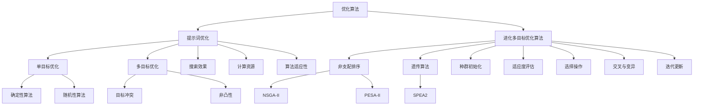

                 

### 第一部分：引言与核心概念

#### 1.1 优化算法概述

**1.1.1 优化算法的定义与重要性**

优化算法是一类用于求解最优解的算法，其目的是在给定约束条件下，找到一个或多个满足特定目标的解。优化算法广泛应用于各个领域，如工程、经济、金融、机器学习等。其重要性体现在以下几个方面：

- **提高效率**：通过优化算法，可以找到最优解，从而提高系统效率。
- **节省资源**：优化算法可以帮助企业在资源有限的情况下，实现最大化收益。
- **决策支持**：优化算法可以为企业提供科学决策支持，从而降低风险。

**1.1.2 优化算法的分类**

优化算法可以根据不同的标准进行分类。常见的分类方法包括：

- **确定性算法**与**随机性算法**：确定性算法在每一步都有确定的决策，如梯度下降法；随机性算法在每一步都有一定的随机性，如遗传算法。
- **静态优化**与**动态优化**：静态优化解决静态问题，如线性规划；动态优化解决动态问题，如动态规划。
- **单目标优化**与**多目标优化**：单目标优化关注单个目标的最优化；多目标优化关注多个目标的最优化。

**1.1.3 多目标优化问题的挑战**

多目标优化问题（Multi-Objective Optimization Problem，MOOP）涉及多个相互冲突的目标，其挑战性主要表现在以下几个方面：

- **目标冲突**：多个目标之间可能存在冲突，无法同时达到最优。
- **非凸性**：多目标优化问题的目标函数和约束条件往往是非凸的。
- **计算复杂度**：多目标优化问题往往具有较高的计算复杂度。
- **解的多样性**：需要找到一组非支配解（Pareto最优解），满足不同目标之间的平衡。

#### 1.2 提示词优化的基本原理

**1.2.1 提示词优化的概念**

提示词优化（Keyword Optimization）是一种通过调整关键词来提高搜索结果相关性的方法。在优化算法中，提示词优化旨在通过调整算法参数，提高算法的性能和效率。

**1.2.2 提示词优化的优势**

- **提高搜索效果**：通过提示词优化，可以更好地匹配用户需求，提高搜索结果的准确性。
- **节省计算资源**：通过优化算法参数，可以减少计算资源的消耗。
- **增强算法适应性**：提示词优化可以增强算法对变化环境的适应性。

**1.2.3 提示词优化的应用场景**

提示词优化广泛应用于各种场景，如搜索引擎优化、推荐系统、图像识别等。其应用场景主要包括：

- **搜索引擎**：通过优化关键词，提高搜索结果的准确性，提升用户体验。
- **推荐系统**：通过优化推荐算法的参数，提高推荐结果的多样性。
- **图像识别**：通过优化图像识别算法的参数，提高识别的准确率。

#### 1.3 进化多目标优化算法

**1.3.1 进化多目标优化算法的定义**

进化多目标优化算法（Evolutionary Multi-Objective Optimization Algorithm，EMOOA）是一种基于进化算法的多目标优化方法。它通过模拟自然进化过程，寻找一组非支配解，实现多个目标的优化。

**1.3.2 进化多目标优化算法的基本原理**

进化多目标优化算法的基本原理包括：

- **种群初始化**：初始化一组个体，每个个体代表一个潜在解。
- **适应度评估**：计算每个个体的适应度，适应度通常由多个目标函数的值决定。
- **选择操作**：根据适应度，选择个体进行繁殖。
- **交叉与变异**：通过交叉和变异操作，产生新的个体。
- **迭代更新**：不断迭代更新种群，直至满足终止条件。

**1.3.3 进化多目标优化算法的常见类型**

进化多目标优化算法包括以下几种常见类型：

- **NSGA-II**：非支配排序遗传算法（Non-dominated Sorting Genetic Algorithm II）。
- **PESA-II**：基于排名的进化算法（Parallel and Distributed Evolutionary Algorithms）。
- **SPEA2**：基于拥挤度排序的进化算法（Strength Pareto Evolutionary Algorithm 2）。

#### 1.3.4 提示词优化的进化多目标优化算法的关系

提示词优化的进化多目标优化算法结合了提示词优化和进化多目标优化算法的优势，旨在通过调整算法参数，实现多个目标的优化。其关系可以概括为：

- **提示词优化**：调整算法参数，提高算法性能。
- **进化多目标优化算法**：模拟自然进化过程，寻找非支配解。
- **综合优势**：通过提示词优化，提高算法的适应性和效率；通过进化多目标优化算法，实现多个目标的优化。

### 1.4 核心概念与联系

在本节中，我们通过Mermaid流程图来展示核心概念之间的关系。

通过这个流程图，我们可以清晰地看到各个核心概念之间的联系，为后续章节的内容提供了基础。

### 1.5 结论

在本节中，我们介绍了优化算法、提示词优化、进化多目标优化算法等核心概念，并分析了它们之间的关系。这些概念为后续章节的深入探讨提供了基础。在接下来的章节中，我们将详细讨论这些算法的原理、数学模型以及实际应用。

---

**文章摘要：**

本文介绍了优化算法、提示词优化、进化多目标优化算法等核心概念，并分析了它们之间的关系。通过对这些算法的原理、数学模型和实际应用进行深入探讨，本文旨在为读者提供一个全面、系统的理解。文章分为四个部分：引言与核心概念、算法原理与数学模型、算法实现与实战案例、总结与展望。本文旨在为计算机科学、人工智能、算法研究等相关专业的研究人员、开发者或学生提供有价值的参考。

---

**作者信息：**

作者：AI天才研究院/AI Genius Institute & 禅与计算机程序设计艺术 /Zen And The Art of Computer Programming

