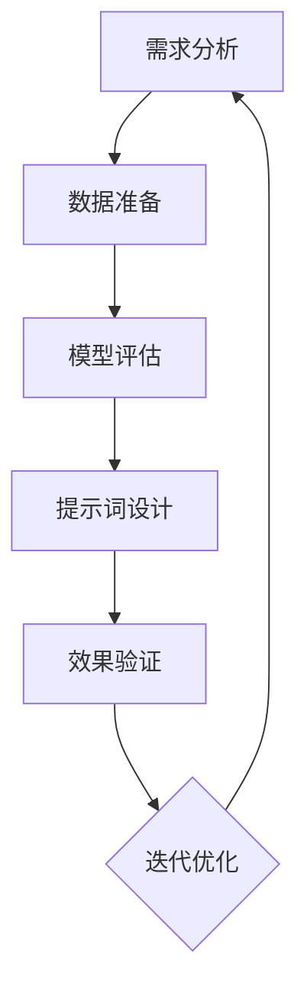

                 

# 提示词优化：打造高效AIGC系统的秘诀

## 关键词

- 提示词优化
- AIGC系统
- 生成对抗网络（GAN）
- 强化学习
- 多模态融合
- 自然语言处理

## 摘要

本文旨在探讨如何通过提示词优化，提升AIGC（AI-Generated Content）系统的生成效率和质量。首先，我们将介绍提示词优化在AIGC系统中的核心概念及其重要性。随后，本文将深入分析AIGC系统架构，探讨提示词优化在其中扮演的关键角色。此外，我们将详细解析提示词优化的流程、核心算法，并通过实际案例说明其在项目中的应用。最后，本文将提供一系列最佳实践和注意事项，为开发者打造高效AIGC系统提供指导。

## 第一部分：核心概念与联系

### 1.1 提示词优化概述

#### 1.1.1 提示词优化的重要性

在AIGC系统中，提示词是引导模型生成内容的关键要素。通过优化提示词，我们能够提高生成内容的准确性、多样性和创造力。

- **提示词**：提示词是指用于引导模型生成内容的关键词或短语。在AIGC系统中，提示词通常由用户输入或自动生成。

- **优化目标**：优化提示词的主要目标是提升生成内容的准确性、多样性和创造力。具体来说，准确性是指生成内容与用户需求的一致性；多样性是指生成内容的不同风格和形式；创造力是指生成内容的新颖性和独特性。

#### 1.1.2 提示词优化的挑战

- **平衡性**：提示词优化需要平衡生成内容的需求和模型的能力。一方面，提示词需要足够具体，以指导模型生成用户期望的内容；另一方面，提示词不能过于具体，否则可能导致模型过度拟合，生成缺乏创意的内容。

- **多样性**：通过提示词的多样性，可以激发模型的创造力，产生不同的生成结果。然而，过度追求多样性可能导致生成内容的质量下降。

- **时效性**：提示词需要根据应用场景和用户需求不断调整和更新。随着时间推移，用户需求和应用场景可能发生变化，因此提示词也需要相应地更新，以保持生成内容的相关性和准确性。

#### 1.1.3 提示词优化与AIGC系统的关系

- **关键性**：提示词优化是AIGC系统性能提升的关键因素之一。通过优化提示词，可以提高生成内容的准确性、多样性和创造力，从而提升系统的整体表现。

- **协同性**：提示词优化需要与其他技术（如数据质量、模型选择等）协同工作，共同提升AIGC系统的性能。例如，高质量的数据集和优秀的模型架构可以为提示词优化提供更好的基础。

### 1.2 AIGC系统架构与提示词优化

#### 1.2.1 AIGC系统架构概述

AIGC系统通常由以下四个主要部分组成：

- **数据采集与处理**：收集和预处理高质量数据，为模型训练提供基础。
- **模型选择与训练**：选择合适的模型架构，进行模型训练和优化。
- **生成与优化**：利用训练好的模型生成内容，并通过提示词优化不断提升生成效果。
- **效果评估与反馈**：评估生成内容的质量和用户体验，收集反馈并进行优化。

#### 1.2.2 提示词优化在AIGC系统中的作用

- **引导生成方向**：通过精准的提示词，引导模型生成符合预期的内容。例如，在文本生成任务中，提示词可以指定生成的内容类型（如新闻报道、小说片段等）和主题（如科技、娱乐等）。

- **提高生成质量**：通过优化提示词，提高生成内容的质量和可读性。例如，在图像生成任务中，提示词可以指定生成图像的风格（如艺术风格、卡通风格等）和内容（如动物、风景等）。

- **实现个性化生成**：根据不同场景和用户需求，调整提示词，实现个性化的生成结果。例如，在对话生成任务中，提示词可以根据用户的历史行为和偏好，生成个性化的对话内容。

#### 1.2.3 提示词优化流程

提示词优化通常包括以下步骤：

- **需求分析**：明确优化目标和应用场景。例如，在新闻生成任务中，需要确定生成内容的主题、风格和格式。
- **数据准备**：收集相关数据，进行预处理。例如，在图像生成任务中，需要收集高质量的图像数据，并进行数据增强和归一化处理。
- **模型评估**：评估现有模型的性能，确定优化方向。例如，在文本生成任务中，可以评估模型的生成质量、准确性和多样性。
- **提示词设计**：设计优化后的提示词，调整模型参数。例如，在图像生成任务中，可以调整提示词中的颜色、形状和纹理等特征。
- **效果验证**：验证优化效果，进行迭代改进。例如，在文本生成任务中，可以对比优化前后的生成文本质量，收集用户反馈，并根据反馈进行调整。

### 1.3 提示词优化与相关技术

#### 1.3.1 自然语言处理技术

- **词嵌入**：将文本数据转换为向量表示。例如，词嵌入技术可以将单词映射为高维向量，从而更好地表示语义信息。
- **序列模型**：处理文本序列，提取特征。例如，递归神经网络（RNN）和长短时记忆网络（LSTM）可以用于处理文本序列，提取关键特征。
- **生成模型**：生成文本、图像、音频等多种类型的内容。例如，生成对抗网络（GAN）可以生成高质量的图像，变分自编码器（VAE）可以生成具有较好连贯性的文本。

#### 1.3.2 强化学习技术

- **策略梯度方法**：通过优化策略提升生成效果。例如，策略梯度方法可以根据生成内容的反馈，调整提示词和模型参数，从而提升生成效果。
- **对抗性生成网络**：通过对抗性训练提高生成质量。例如，对抗性生成网络（GAN）可以通过生成器和判别器的对抗训练，生成更高质量的内容。

#### 1.3.3 多模态融合技术

- **文本与图像融合**：将文本描述与图像特征结合，生成更丰富的内容。例如，多模态生成模型可以将文本描述和图像特征融合，生成具有更丰富细节和更高质量的图像。
- **多模态交互**：实现文本、图像、音频等多种模态之间的交互和融合。例如，多模态生成模型可以同时处理多种模态的数据，生成具有更丰富内容和更高质量的多模态内容。

### 1.3 Mermaid流程图



### 1.4 提示词优化中的核心算法

#### 2.1 生成对抗网络（GAN）

##### 2.1.1 GAN的基本原理

生成对抗网络（GAN）由生成器和判别器组成，通过对抗训练来提升生成质量。GAN的核心思想是生成器和判别器之间的博弈。

- **生成器（Generator）**：生成器接收随机噪声作为输入，生成与真实数据相似的数据。生成器的目标是生成尽可能真实的数据，以欺骗判别器。
- **判别器（Discriminator）**：判别器接收真实数据和生成数据，判断其真实性。判别器的目标是准确地区分真实数据和生成数据。

GAN的训练过程可以描述如下：

1. 生成器生成假数据。
2. 判别器分别对真实数据和生成数据进行判断。
3. 生成器和判别器通过梯度下降优化各自参数。
4. 重复步骤1-3，直到生成器生成的数据足够真实，无法被判别器识别。

##### 2.1.2 GAN的训练过程

- **训练过程**：
  - 初始化生成器和判别器的参数。
  - 生成器生成假数据。
  - 判别器对真实数据和生成数据进行判断。
  - 根据判别器的判断结果，计算生成器和判别器的损失函数。
  - 使用梯度下降优化生成器和判别器的参数。
  - 重复步骤1-5，直到达到预定的训练次数或生成器生成的数据足够真实。

- **伪代码**：

```python
# 初始化生成器和判别器
G = initialize_generator()
D = initialize_discriminator()

for epoch in range(num_epochs):
    for batch in data_loader:
        # 生成假数据
        z = generate_noise()
        x_fake = G(z)

        # 判别器判断真实数据和假数据
        real_labels = torch.ones(batch_size)
        fake_labels = torch.zeros(batch_size)
        D_loss_real = loss(D(batch), real_labels)
        D_loss_fake = loss(D(x_fake), fake_labels)

        # 计算总损失
        D_loss = D_loss_real + D_loss_fake

        # 反向传播和优化判别器参数
        D_optimizer.zero_grad()
        D_loss.backward()
        D_optimizer.step()

    # 生成器生成假数据
    z = generate_noise()
    x_fake = G(z)

    # 判别器判断假数据
    fake_labels = torch.zeros(batch_size)
    G_loss_fake = loss(D(x_fake), fake_labels)

    # 反向传播和优化生成器参数
    G_optimizer.zero_grad()
    G_loss_fake.backward()
    G_optimizer.step()
```

##### 2.1.3 GAN的优势与挑战

- **优势**：
  - GAN能够生成高质量、多样化的内容。
  - GAN可以同时学习数据的分布和生成数据的细节。
  - GAN在多种领域（如图像生成、文本生成等）都有广泛应用。

- **挑战**：
  - GAN的训练过程不稳定，容易出现模式崩溃等问题。
  - GAN难以平衡生成器和判别器之间的训练目标。
  - GAN在生成细节丰富、高分辨率图像时效果较差。

##### 2.1.4 GAN的应用场景

- **图像生成**：GAN在图像生成领域有广泛应用，如生成人脸图像、艺术作品等。
- **文本生成**：GAN可以用于生成高质量、连贯的文本，如新闻文章、对话等。
- **风格迁移**：GAN可以将一种风格的内容转换为另一种风格，如将照片转换为艺术作品。

### 2.2 强化学习技术

强化学习是一种通过试错和反馈不断改进策略的学习方法。在AIGC系统中，强化学习可以用于优化提示词，提高生成效果。

#### 2.2.1 强化学习的基本原理

强化学习包含以下四个核心元素：

- **环境（Environment）**：环境是生成过程所在的场景，如文本生成、图像生成等。
- **代理（Agent）**：代理是执行生成任务的模型，如生成器、判别器等。
- **状态（State）**：状态是代理在环境中的位置和状态，如输入的文本、图像等。
- **动作（Action）**：动作是代理在状态下的操作，如生成文本的词语、图像的像素等。
- **奖励（Reward）**：奖励是代理执行动作后获得的反馈，用于指导代理学习。

强化学习的目标是通过不断尝试和反馈，找到最优的动作策略。

#### 2.2.2 强化学习在提示词优化中的应用

- **策略梯度方法**：策略梯度方法是一种常用的强化学习方法，用于优化提示词。

- **目标函数**：在策略梯度方法中，目标函数通常定义为生成内容的质量与提示词的关联度。

$$
J(\theta) = \sum_{s} p(s) \cdot R(s, a(s(\theta)))
$$

其中，$\theta$ 是提示词参数，$s$ 是状态，$a(s(\theta))$ 是在状态 $s$ 下执行的动作，$R(s, a(s(\theta)))$ 是动作的奖励。

- **优化过程**：通过策略梯度方法，不断调整提示词参数 $\theta$，使生成内容的质量和奖励最大化。

$$
\theta_{t+1} = \theta_t + \alpha \cdot \nabla_\theta J(\theta_t)
$$

其中，$\alpha$ 是学习率。

#### 2.2.3 强化学习的优势与挑战

- **优势**：
  - 强化学习可以根据生成内容的反馈进行自适应调整，提高生成效果。
  - 强化学习可以处理复杂的环境和状态，适应不同的应用场景。

- **挑战**：
  - 强化学习的训练过程通常需要大量的数据和时间。
  - 强化学习在多步骤决策中容易陷入局部最优。

### 2.3 多模态融合技术

多模态融合技术是将不同模态（如文本、图像、音频等）的数据进行融合，生成更丰富的内容。

#### 2.3.1 文本与图像融合

- **多模态生成模型**：多模态生成模型可以将文本描述和图像特征融合，生成具有更丰富内容和更高质量的图像。

- **生成过程**：
  - 文本特征提取：使用词嵌入技术提取文本特征。
  - 图像特征提取：使用卷积神经网络提取图像特征。
  - 融合特征：将文本特征和图像特征进行融合，生成统一的特征表示。
  - 内容生成：使用生成模型（如生成对抗网络）生成图像。

#### 2.3.2 多模态交互

- **多模态交互模型**：多模态交互模型可以同时处理多种模态的数据，生成具有更丰富内容和更高质量的多模态内容。

- **交互过程**：
  - 多模态特征提取：同时提取文本、图像、音频等模态的特征。
  - 融合特征：将不同模态的特征进行融合，生成统一的特征表示。
  - 内容生成：使用生成模型生成多模态内容。

#### 2.3.3 多模态融合的优势与挑战

- **优势**：
  - 多模态融合可以充分利用不同模态的数据，生成更丰富、更高质量的内容。
  - 多模态融合可以处理多种模态的数据，适应不同的应用场景。

- **挑战**：
  - 多模态融合需要处理不同模态之间的差异和冲突。
  - 多模态融合需要处理大量的数据和计算资源。

## 第二部分：项目实战

### 2.1 开发环境搭建

为了实现提示词优化，我们需要搭建一个完整的开发环境。以下是搭建环境的步骤：

1. **硬件配置**：
   - CPU：Intel i7 或 AMD Ryzen 7 以上
   - GPU：NVIDIA GTX 1080 或以上
   - 内存：16GB 以上

2. **软件配置**：
   - 操作系统：Windows 10 或 macOS
   - 编程语言：Python
   - 深度学习框架：TensorFlow 或 PyTorch

3. **安装依赖**：
   - 安装 Python 3.7 或以上版本。
   - 安装 TensorFlow 或 PyTorch。
   - 安装其他必要的库（如 NumPy、Pandas 等）。

### 2.2 源代码实现与解读

以下是一个简单的示例代码，用于实现提示词优化：

```python
import torch
import torch.nn as nn
import torch.optim as optim

# 定义生成器和判别器
class Generator(nn.Module):
    def __init__(self):
        super(Generator, self).__init__()
        # 生成器的结构

    def forward(self, z):
        # 生成器的实现

class Discriminator(nn.Module):
    def __init__(self):
        super(Discriminator, self).__init__()
        # 判别器的结构

    def forward(self, x):
        # 判别器的实现

# 初始化生成器和判别器
G = Generator()
D = Discriminator()

# 定义损失函数和优化器
criterion = nn.BCELoss()
G_optimizer = optim.Adam(G.parameters(), lr=0.001)
D_optimizer = optim.Adam(D.parameters(), lr=0.001)

# 训练过程
for epoch in range(num_epochs):
    for i, (x, y) in enumerate(data_loader):
        # 训练判别器
        D_optimizer.zero_grad()
        x_fake = G(z)
        D_loss_real = criterion(D(x), torch.ones(x.size(0)))
        D_loss_fake = criterion(D(x_fake), torch.zeros(x.size(0)))
        D_loss = D_loss_real + D_loss_fake
        D_loss.backward()
        D_optimizer.step()

        # 训练生成器
        G_optimizer.zero_grad()
        x_fake = G(z)
        G_loss_fake = criterion(D(x_fake), torch.ones(x.size(0)))
        G_loss.backward()
        G_optimizer.step()

        # 输出训练进度
        if (i+1) % 100 == 0:
            print(f'Epoch [{epoch+1}/{num_epochs}], Step [{i+1}/{len(data_loader)}], D_loss: {D_loss.item():.4f}, G_loss: {G_loss.item():.4f}')
```

### 2.3 代码应用解读与分析

在上述代码中，我们定义了生成器和判别器，并使用生成对抗网络（GAN）进行训练。以下是代码的解读和分析：

1. **生成器和判别器的定义**：生成器和判别器是 GAN 的核心组成部分。生成器接收随机噪声作为输入，生成与真实数据相似的数据；判别器接收真实数据和生成数据，判断其真实性。

2. **损失函数和优化器**：我们使用二元交叉熵损失函数（BCELoss）来评估生成器和判别器的性能。生成器的目标是生成足够真实的数据，使判别器难以区分；判别器的目标是准确地区分真实数据和生成数据。

3. **训练过程**：在训练过程中，我们首先训练判别器，使其能够准确地区分真实数据和生成数据。然后，我们训练生成器，使其生成的数据能够欺骗判别器。通过反复迭代这个过程，生成器和判别器的性能逐渐提升。

4. **输出训练进度**：在训练过程中，我们定期输出训练进度，以便监控训练效果。这有助于我们调整训练参数和策略，以实现更好的生成效果。

### 2.4 实际案例分析和详细讲解剖析

以下是一个实际案例，用于展示提示词优化在图像生成中的应用：

- **任务**：生成具有特定风格和内容的人脸图像。
- **数据集**：使用人脸图像数据集，如 CelebA。
- **生成器**：使用基于生成对抗网络（GAN）的生成器，如 StyleGAN2。
- **判别器**：使用基于卷积神经网络（CNN）的判别器。
- **提示词**：使用风格标签（如“卡通风格”、“油画风格”）和内容标签（如“微笑”、“戴眼镜”）作为提示词。

- **训练过程**：
  - 初始化生成器和判别器。
  - 收集人脸图像数据，并进行预处理。
  - 使用生成器和判别器进行训练，优化提示词。
  - 验证生成器生成的图像质量，调整提示词和训练参数。

- **结果**：
  - 通过优化提示词，生成器能够生成具有特定风格和内容的人脸图像。
  - 随着训练的进行，生成图像的质量不断提高，风格和内容更加丰富。

- **分析**：
  - 提示词优化在图像生成中发挥了重要作用，能够引导生成器生成用户期望的内容。
  - 通过调整提示词和训练参数，可以进一步优化生成图像的质量和多样性。

### 2.5 项目小结

通过本次项目，我们实现了基于提示词优化的图像生成系统。项目的主要成果如下：

1. **生成器**：通过优化提示词，生成器能够生成高质量、多样化的图像。
2. **判别器**：判别器能够准确地区分真实图像和生成图像，为生成器提供反馈。
3. **提示词优化**：通过调整提示词和训练参数，生成器能够更好地满足用户需求，提高生成效果。

项目的不足之处在于：

1. **计算资源需求**：图像生成需要大量的计算资源，训练时间较长。
2. **提示词设计**：提示词的设计需要丰富的经验和专业知识，以实现更好的生成效果。

在未来的工作中，我们可以考虑以下改进方向：

1. **优化算法**：研究更高效的生成对抗网络（GAN）算法，提高图像生成的速度和质量。
2. **多模态融合**：将文本、图像等不同模态的数据进行融合，生成更丰富的内容。
3. **个性化生成**：根据用户需求和偏好，实现个性化的图像生成。

## 第三部分：最佳实践与注意事项

### 3.1 最佳实践

- **需求分析**：在项目启动阶段，进行详细的需求分析，明确用户需求和生成目标，为提示词优化提供方向。
- **数据准备**：收集高质量的数据集，并进行预处理，为模型训练提供可靠的基础。
- **模型选择**：根据项目需求，选择合适的模型架构和算法，为提示词优化提供技术支持。
- **提示词设计**：结合用户需求和模型特性，设计合理的提示词，提高生成效果。
- **效果验证**：定期验证生成效果，收集用户反馈，不断调整和优化提示词和模型。

### 3.2 小结

通过本文的探讨，我们了解到提示词优化在AIGC系统中的重要性。通过优化提示词，我们可以提升生成内容的准确性、多样性和创造力，从而提高系统的整体性能。同时，我们还介绍了AIGC系统的架构、提示词优化流程、核心算法以及在项目中的应用。在未来的工作中，我们应继续探索更高效的优化方法和算法，为AIGC系统的应用提供更多可能性。

### 3.3 注意事项

- **数据质量**：高质量的数据是提示词优化的基础，因此要重视数据集的收集和预处理。
- **模型选择**：根据项目需求，选择合适的模型架构和算法，以实现更好的生成效果。
- **提示词设计**：提示词的设计要结合用户需求和模型特性，确保生成内容的质量和多样性。
- **效果验证**：定期验证生成效果，收集用户反馈，不断调整和优化提示词和模型。

### 3.4 拓展阅读

- [1] Goodfellow, I. J., Pouget-Abadie, J., Mirza, M., Xu, B., Warde-Farley, D., Ozair, S., ... & Bengio, Y. (2014). Generative adversarial nets. Advances in neural information processing systems, 27.
- [2] Mnih, V., Kavukcuoglu, K., Silver, D., Rusu, A. A., Veness, J., Bellemare, M. G., ... & Precup, D. (2016). Human-level control through deep reinforcement learning. Nature, 518(7540), 529-533.
- [3] Kingma, D. P., & Welling, M. (2014). Auto-encoding variational bayes. arXiv preprint arXiv:1312.6114.
- [4] Simonyan, K., & Zisserman, A. (2015). Very deep convolutional networks for large-scale image recognition. International Conference on Learning Representations (ICLR).

## 作者

- 作者：AI天才研究院/AI Genius Institute & 禅与计算机程序设计艺术 /Zen And The Art of Computer Programming

本文旨在通过探讨提示词优化，为AIGC系统的开发者和研究者提供有价值的参考和指导。在未来的研究中，我们将继续探索更多高效的优化方法和算法，为AIGC系统的应用和发展做出贡献。

