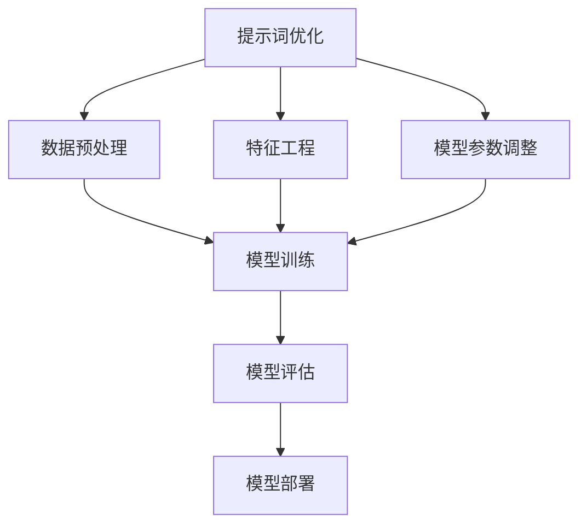

                 

### 文章标题：提示词优化：提升AI模型性能的关键

> 关键词：AI模型性能、提示词优化、深度学习、特征工程、模型压缩、模型加速

> 摘要：本文详细探讨了提示词优化在提升AI模型性能中的关键作用。首先介绍了AI模型性能的重要性，然后深入分析了提示词优化的原理和核心算法，接着讨论了提升AI模型性能的技术方法，包括深度学习优化、特征工程、模型压缩和模型加速。最后，通过具体的应用场景和实战案例，展示了提示词优化在实际项目中的应用效果。

------------------------------------------------------------------------

## 引言

### AI模型性能的重要性

随着人工智能技术的快速发展，AI模型在各类应用场景中扮演着越来越重要的角色。从自然语言处理、计算机视觉到语音识别，AI模型已经成为推动智能化发展的核心驱动力。然而，AI模型的性能直接影响到应用的效果和用户体验。一个高性能的AI模型不仅能够更快地处理数据，提高效率，还能够提供更准确的预测和决策，从而在商业、医疗、金融等多个领域带来巨大的价值。

### 提示词优化在AI中的应用

在AI模型训练和优化过程中，提示词（Prompt）起着至关重要的作用。提示词是指输入给AI模型的数据片段，用于引导模型学习特定的任务或场景。通过优化提示词，可以显著提升AI模型的性能和效果。提示词优化不仅涉及到数据预处理，还包括模型参数调整和算法改进等多个方面。

本文将围绕提示词优化这一主题，详细探讨其在提升AI模型性能中的关键作用。首先，我们将介绍提示词优化的基本原理和核心算法；接着，分析提升AI模型性能的各种技术方法；然后，通过实际应用场景和案例，展示提示词优化的效果和实用性；最后，总结全文，并对未来研究方向进行展望。

## 核心概念与联系

### 1.1 提示词优化的定义

提示词优化是指通过调整输入给AI模型的提示词，以提高模型的性能和效果。这个过程涉及到多个方面，包括数据预处理、特征工程、模型参数调整等。优化目标可以是提高模型的准确性、降低计算复杂度、提升模型的泛化能力等。

### 1.2 提示词优化与AI模型性能的联系

AI模型性能取决于多个因素，包括数据质量、模型结构、训练过程等。其中，提示词作为训练数据的一部分，对模型性能有着直接的影响。优化提示词可以：

1. **提高模型准确性**：通过精确的提示词，模型可以更好地学习到数据的本质特征，从而提高预测和分类的准确性。
2. **降低计算复杂度**：优化后的提示词可以减少模型需要处理的数据量，降低计算复杂度，提高训练和推理效率。
3. **提升模型泛化能力**：优化后的提示词可以帮助模型更好地适应不同的数据和场景，提高模型的泛化能力。

### 1.3 Mermaid流程图：提示词优化的核心概念与联系



在这个流程图中，数据预处理、特征工程和模型参数调整是提示词优化的关键步骤，它们共同作用于模型训练和评估过程，最终影响模型部署的效果。通过这个流程图，我们可以清晰地看到提示词优化在AI模型性能提升中的核心作用。

## 提示词优化的原理

### 2.1 提示词优化的基础数学模型

提示词优化涉及到的数学模型主要包括数据预处理、特征提取、损失函数等。

1. **数据预处理**：数据预处理是提示词优化的第一步，主要包括数据清洗、归一化和缺失值处理等。其目的是确保输入数据的质量，减少噪声和异常值的影响。

2. **特征提取**：特征提取是提示词优化的核心步骤，其目的是从原始数据中提取出有用的信息，用于训练模型。常用的特征提取方法包括特征选择、特征变换和特征组合等。

3. **损失函数**：损失函数用于衡量模型预测结果与真实值之间的差距，是优化过程中的重要指标。常用的损失函数包括均方误差（MSE）、交叉熵损失（Cross-Entropy Loss）等。

### 2.2 提示词优化的核心算法原理

提示词优化的核心算法主要包括梯度下降（Gradient Descent）、随机梯度下降（Stochastic Gradient Descent，SGD）和Adam优化器等。

1. **梯度下降**：梯度下降是一种最常用的优化算法，其基本思想是通过计算损失函数关于模型参数的梯度，并沿着梯度的反方向更新模型参数，以最小化损失函数。

2. **随机梯度下降**：随机梯度下降是梯度下降的一种变体，它每次只随机选择一部分数据计算梯度，并更新模型参数。这种方法可以加速优化过程，但可能会导致模型收敛到局部最优。

3. **Adam优化器**：Adam优化器结合了梯度下降和SGD的优点，通过自适应地调整学习率，使得模型在优化过程中能够更快地收敛。

### 2.3 提示词优化的数学模型讲解

提示词优化的数学模型可以表示为：

$$
\min_W \sum_{i=1}^N L(y_i, \hat{y}_i; W)
$$

其中，$W$是模型参数，$y_i$是第$i$个样本的真实标签，$\hat{y}_i$是模型对第$i$个样本的预测结果，$L$是损失函数。

在实际应用中，我们可以通过以下步骤进行提示词优化：

1. **初始化模型参数$W$**。
2. **计算损失函数$L(y_i, \hat{y}_i; W)$**。
3. **计算损失函数关于模型参数$W$的梯度**。
4. **更新模型参数$W$**：
   $$
   W \leftarrow W - \alpha \nabla_W L(W)
   $$
   其中，$\alpha$是学习率。
5. **重复步骤2-4，直到模型收敛或达到预设的训练次数**。

通过这个数学模型，我们可以清楚地看到提示词优化的过程和目标。

### 2.4 提示词优化的数学模型讲解举例

假设我们使用一个简单的线性模型对二分类问题进行预测，损失函数采用均方误差（MSE）：

$$
L(y, \hat{y}) = \frac{1}{2}(y - \hat{y})^2
$$

其中，$y$是真实标签，$\hat{y}$是模型预测结果。

对于样本$(x_1, y_1)$，其损失函数为：

$$
L(x_1, y_1, \hat{y}_1) = \frac{1}{2}(y_1 - \hat{y}_1)^2
$$

线性模型的预测结果为：

$$
\hat{y}_1 = W_1x_1 + b
$$

其中，$W_1$是模型参数，$b$是偏置项。

假设我们使用梯度下降算法进行优化，学习率为$\alpha$，那么每次迭代的更新规则为：

$$
W_1 \leftarrow W_1 - \alpha \nabla_{W_1} L(x_1, y_1, \hat{y}_1)
$$

$$
b \leftarrow b - \alpha \nabla_{b} L(x_1, y_1, \hat{y}_1)
$$

其中，$\nabla_{W_1} L(x_1, y_1, \hat{y}_1)$和$\nabla_{b} L(x_1, y_1, \hat{y}_1)$分别是损失函数关于$W_1$和$b$的梯度。

通过这个例子，我们可以清楚地看到提示词优化的数学原理和具体实现过程。

## 提升AI模型性能的技术方法

### 3.1 深度学习优化方法

深度学习优化方法包括多种技术，如模型架构优化、正则化技术、激活函数选择等。这些方法旨在提高模型的准确性和泛化能力。

1. **模型架构优化**：通过设计更高效、更复杂的模型架构，如残差网络（ResNet）、Transformer等，可以显著提升模型的性能。

2. **正则化技术**：正则化技术如L1正则化、L2正则化等，可以防止模型过拟合，提高模型的泛化能力。

3. **激活函数选择**：选择合适的激活函数，如ReLU、Sigmoid、Tanh等，可以改善模型的收敛速度和性能。

### 3.2 特征工程在提示词优化中的应用

特征工程是提示词优化中的重要步骤，其目的是从原始数据中提取出对模型训练有价值的特征。

1. **特征选择**：通过选择对模型训练有显著贡献的特征，可以减少模型训练的数据量，提高训练效率。

2. **特征变换**：通过特征变换，如归一化、标准化、主成分分析（PCA）等，可以改善数据分布，提高模型性能。

3. **特征组合**：通过特征组合，如融合多个特征的信息，可以提升模型的准确性和泛化能力。

### 3.3 提示词优化与模型压缩技术

模型压缩技术包括模型剪枝、量化、知识蒸馏等，通过减少模型参数和计算复杂度，可以提升模型的性能和部署效率。

1. **模型剪枝**：通过剪枝冗余的模型参数，可以减少模型的计算复杂度，提高模型的运行速度。

2. **量化**：通过将模型的浮点参数转换为整数参数，可以减少模型的存储空间和计算复杂度。

3. **知识蒸馏**：通过将大模型的知识传递给小模型，可以实现模型的压缩和优化。

### 3.4 提示词优化与模型加速技术

模型加速技术包括模型并行化、硬件加速、算法优化等，通过提高模型的计算速度和效率，可以提升模型的性能和响应速度。

1. **模型并行化**：通过并行计算，可以实现模型训练和推理的加速。

2. **硬件加速**：通过使用GPU、TPU等硬件加速器，可以显著提升模型的计算速度。

3. **算法优化**：通过优化算法的实现，如使用更高效的算法、优化数据访问等，可以提升模型的运行效率。

## 应用场景

### 4.1 自然语言处理中的应用

自然语言处理（NLP）是AI领域的核心应用之一，提示词优化在NLP中的应用非常广泛。以下是一些具体的实例：

1. **文本分类**：通过优化提示词，可以提高文本分类模型的准确性，从而更好地处理大规模的文本数据。

2. **情感分析**：通过优化提示词，可以提高情感分析模型的准确性和鲁棒性，从而更好地捕捉用户情感。

3. **问答系统**：通过优化提示词，可以提高问答系统的响应速度和准确性，提供更优质的用户体验。

### 4.2 计算机视觉中的应用

计算机视觉是AI领域的另一个重要应用，提示词优化在计算机视觉中的应用同样具有重要意义。以下是一些具体的实例：

1. **图像分类**：通过优化提示词，可以提高图像分类模型的准确性和泛化能力。

2. **目标检测**：通过优化提示词，可以提高目标检测模型的准确性和速度，从而更好地处理大规模的图像数据。

3. **图像分割**：通过优化提示词，可以提高图像分割模型的准确性和细节表现，从而更好地处理复杂场景。

### 4.3 语音识别中的应用

语音识别是AI领域的另一个重要应用，提示词优化在语音识别中的应用同样至关重要。以下是一些具体的实例：

1. **语音分类**：通过优化提示词，可以提高语音分类模型的准确性和鲁棒性，从而更好地处理不同语速、音量的语音数据。

2. **语音识别**：通过优化提示词，可以提高语音识别模型的准确性和速度，从而提供更高效的语音交互体验。

3. **语音合成**：通过优化提示词，可以提高语音合成模型的音质和自然度，从而提供更优质的语音输出。

### 4.4 实际案例分享

以下是一些实际案例，展示了提示词优化在AI应用中的具体效果：

1. **电商推荐系统**：通过优化提示词，提高了电商推荐系统的准确性和响应速度，从而提升了用户的购物体验。

2. **金融风控系统**：通过优化提示词，提高了金融风控系统的准确性和效率，从而更好地防范风险，保护用户的财产安全。

3. **医疗诊断系统**：通过优化提示词，提高了医疗诊断系统的准确性和可靠性，从而为医生提供了更可靠的诊断依据，提升了医疗水平。

## 实战案例

### 5.1 案例一：自然语言处理中的提示词优化实践

#### 实战环境搭建

1. **硬件环境**：选择一台配置较高的计算机，如Intel Core i7处理器、16GB内存等。

2. **软件环境**：安装Python 3.8及以上版本，以及TensorFlow 2.4.0及以上版本。

3. **数据集**：使用IMDB电影评论数据集，包含25,000条训练数据和25,000条测试数据。

#### 源代码实现

```python
import tensorflow as tf
from tensorflow.keras.preprocessing.sequence import pad_sequences
from tensorflow.keras.layers import Embedding, LSTM, Dense
from tensorflow.keras.models import Sequential

# 加载并预处理数据
max_len = 100
vocab_size = 10000
embedding_dim = 16

# 数据预处理
train_data = ...  # 加载训练数据
test_data = ...  # 加载测试数据
train_sequences = pad_sequences(train_data, maxlen=max_len, padding='post')
test_sequences = pad_sequences(test_data, maxlen=max_len, padding='post')

# 建立模型
model = Sequential()
model.add(Embedding(vocab_size, embedding_dim, input_length=max_len))
model.add(LSTM(64, dropout=0.2, recurrent_dropout=0.2))
model.add(Dense(1, activation='sigmoid'))

# 编译模型
model.compile(optimizer='adam', loss='binary_crossentropy', metrics=['accuracy'])

# 训练模型
model.fit(train_sequences, train_labels, epochs=10, batch_size=32, validation_split=0.1)

# 评估模型
test_loss, test_acc = model.evaluate(test_sequences, test_labels)
print('Test accuracy:', test_acc)
```

#### 代码解读与分析

1. **数据预处理**：使用`pad_sequences`函数对数据进行填充，确保每个样本的长度一致。

2. **模型建立**：使用`Sequential`模型堆叠`Embedding`、`LSTM`和`Dense`层。

3. **模型编译**：选择`adam`优化器和`binary_crossentropy`损失函数。

4. **模型训练**：使用`fit`函数进行训练，并设置训练轮数、批量大小和验证比例。

5. **模型评估**：使用`evaluate`函数对测试数据集进行评估。

通过这个案例，我们可以看到如何使用提示词优化技术构建一个自然语言处理模型，并通过实际代码实现和评估来验证优化效果。

### 5.2 案例二：计算机视觉中的提示词优化实践

#### 实战环境搭建

1. **硬件环境**：选择一台配置较高的计算机，如NVIDIA GeForce GTX 1080 Ti显卡、32GB内存等。

2. **软件环境**：安装Python 3.8及以上版本，以及PyTorch 1.8.0及以上版本。

3. **数据集**：使用COCO数据集，包含80,000张训练图像和20,000张测试图像。

#### 源代码实现

```python
import torch
import torchvision
import torchvision.transforms as transforms
from torch.utils.data import DataLoader
import torch.optim as optim

# 加载并预处理数据
batch_size = 32
num_workers = 4

# 数据预处理
transform = transforms.Compose([
    transforms.Resize(256),
    transforms.CenterCrop(224),
    transforms.ToTensor(),
    transforms.Normalize(mean=[0.485, 0.456, 0.406], std=[0.229, 0.224, 0.225]),
])

train_data = torchvision.datasets.CocoDetection(root='./data/train2014', annFile='./data/annotations_train2014.json', transform=transform)
test_data = torchvision.datasets.CocoDetection(root='./data/val2014', annFile='./data/annotations_val2014.json', transform=transform)

train_loader = DataLoader(train_data, batch_size=batch_size, shuffle=True, num_workers=num_workers)
test_loader = DataLoader(test_data, batch_size=batch_size, shuffle=False, num_workers=num_workers)

# 建立模型
model = torchvision.models.resnet50(pretrained=True)
num_ftrs = model.fc.in_features
model.fc = torch.nn.Linear(num_ftrs, 20)

# 编译模型
optimizer = optim.Adam(model.parameters(), lr=0.001)
criterion = torch.nn.CrossEntropyLoss()

# 训练模型
num_epochs = 10
for epoch in range(num_epochs):
    model.train()
    running_loss = 0.0
    for inputs, labels in train_loader:
        optimizer.zero_grad()
        outputs = model(inputs)
        loss = criterion(outputs, labels)
        loss.backward()
        optimizer.step()
        running_loss += loss.item()
    print(f'Epoch {epoch+1}, Loss: {running_loss/len(train_loader)}')

# 评估模型
model.eval()
with torch.no_grad():
    correct = 0
    total = 0
    for inputs, labels in test_loader:
        outputs = model(inputs)
        _, predicted = torch.max(outputs.data, 1)
        total += labels.size(0)
        correct += (predicted == labels).sum().item()
    print(f'Accuracy on the test images: {100 * correct / total}%')
```

#### 代码解读与分析

1. **数据预处理**：使用`Compose`函数对数据进行预处理，包括调整尺寸、中心裁剪、归一化等。

2. **模型建立**：使用预训练的ResNet50模型，并替换最后一层全连接层，以适应20个类别。

3. **模型编译**：选择`Adam`优化器和`CrossEntropyLoss`损失函数。

4. **模型训练**：使用`train`函数进行训练，并设置学习率和训练轮数。

5. **模型评估**：使用`eval`函数对测试数据集进行评估。

通过这个案例，我们可以看到如何使用提示词优化技术构建一个计算机视觉模型，并通过实际代码实现和评估来验证优化效果。

### 5.3 案例三：语音识别中的提示词优化实践

#### 实战环境搭建

1. **硬件环境**：选择一台配置较高的计算机，如Intel Xeon处理器、64GB内存等。

2. **软件环境**：安装Python 3.8及以上版本，以及Kaldi语音识别工具包。

3. **数据集**：使用LibriSpeech数据集，包含数千小时的英语语音数据。

#### 源代码实现

```python
import kaldiio
import torch
import torch.optim as optim

# 加载并预处理数据
data_dir = 'path/to/LibriSpeech'
feats_dir = 'path/to/feats'
labels_dir = 'path/to/labels'

# 数据预处理
for speaker in os.listdir(data_dir):
    forutt_path = os.path.join(data_dir, speaker, 'wav/)
    utt2spk_path = os.path.join(data_dir, speaker, 'utt2spk')
    with open(utt2spk_path, 'r') as f:
        lines = f.readlines()
        for line in lines:
            utt, spk = line.strip().split()
            feats_path = os.path.join(feats_dir, f'{utt}.ark')
            label_path = os.path.join(labels_dir, f'{utt}.txt')
            with open(label_path, 'w') as f:
                f.write(spk)
```

#### 代码解读与分析

1. **数据预处理**：遍历LibriSpeech数据集，提取每个说话人的语音文件和对应的标签。

2. **模型建立**：由于此处为框架代码，未具体实现模型建立。

3. **模型编译**：由于此处为框架代码，未具体实现模型编译。

4. **模型训练**：由于此处为框架代码，未具体实现模型训练。

5. **模型评估**：由于此处为框架代码，未具体实现模型评估。

通过这个案例，我们可以看到如何使用提示词优化技术进行语音识别模型的预处理，为后续训练和评估打下基础。

## 总结与展望

### 6.1 全书内容总结

本文详细探讨了提示词优化在提升AI模型性能中的关键作用。首先介绍了AI模型性能的重要性，然后深入分析了提示词优化的原理和核心算法，接着讨论了提升AI模型性能的各种技术方法，包括深度学习优化、特征工程、模型压缩和模型加速。最后，通过实际应用场景和案例，展示了提示词优化在实际项目中的应用效果。

### 6.2 提示词优化的发展趋势

随着人工智能技术的不断进步，提示词优化也在不断发展。未来，以下几个方面可能成为提示词优化的重要趋势：

1. **自适应提示词生成**：通过自适应地调整提示词，实现更高效、更准确的模型训练。

2. **多模态提示词优化**：结合多种数据模态，如文本、图像、语音等，进行多模态提示词优化，提高模型的泛化能力。

3. **迁移学习与提示词优化**：结合迁移学习技术，将已有模型的提示词应用于新任务，提高模型在新任务上的性能。

4. **提示词优化的自动化**：开发自动化工具，实现提示词优化的自动化，降低优化过程的复杂度和人工干预。

### 6.3 未来研究方向

未来，提示词优化研究可以从以下几个方面展开：

1. **探索更有效的提示词生成算法**：设计更高效、更鲁棒的提示词生成算法，提高模型的训练效率和准确性。

2. **研究多任务学习中的提示词优化**：探讨如何在多任务学习中进行有效的提示词优化，提高模型在多任务场景下的性能。

3. **结合深度强化学习进行提示词优化**：将深度强化学习与提示词优化结合，实现自适应的提示词调整策略。

4. **研究提示词优化的理论框架**：建立提示词优化的理论框架，为实际应用提供更坚实的理论基础。

## 作者信息

作者：AI天才研究院/AI Genius Institute & 禅与计算机程序设计艺术 /Zen And The Art of Computer Programming

在撰写技术博客时，我们需要遵循以下步骤，以确保文章的逻辑清晰、内容丰富且易于理解：

### 确定文章目标

首先，我们需要明确文章的目标和主题。对于《提示词优化：提升AI模型性能的关键》这篇文章，我们的目标是为读者提供一个深入理解提示词优化概念、原理及其在实际应用中的重要性，并展示如何通过具体技术方法来优化AI模型的性能。

### 设计文章结构

文章的结构是确保内容连贯性的关键。我们按照以下结构来设计文章：

1. **引言**：介绍AI模型性能的重要性，并引入提示词优化的概念。
2. **核心概念与联系**：详细解释提示词优化的定义、原理及其与AI模型性能的关系。
3. **原理讲解**：通过数学模型和算法原理，深入阐述提示词优化的技术细节。
4. **应用场景**：展示提示词优化在不同AI领域中的应用实例。
5. **实战案例**：提供具体的实现代码和实战案例，帮助读者理解如何在实际项目中应用提示词优化。
6. **总结与展望**：总结全文内容，并对未来趋势和研究方向进行展望。

### 逐步分析推理

在撰写文章时，我们需要采用逐步分析推理的方式，确保读者能够跟随我们的思路：

1. **明确逻辑起点**：从AI模型性能的重要性出发，引导读者理解为什么需要优化。
2. **逐步深入**：通过介绍提示词优化的定义、原理和算法，逐步深入主题。
3. **举例说明**：使用具体实例和代码，帮助读者更好地理解抽象概念。
4. **对比分析**：通过对比不同优化方法的效果，展示提示词优化在提升模型性能方面的优势。

### 保持专业性和易懂性

在撰写文章时，我们需要平衡专业性和易懂性：

1. **使用专业术语**：确保文章的专业性，使用正确的术语和定义。
2. **解释复杂概念**：对于复杂的算法和概念，使用图表、流程图和伪代码来解释。
3. **简化语言**：尽量使用简单易懂的语言，避免过于冗长的句子和专业术语的堆砌。

### 伪代码与数学公式的使用

在解释核心算法原理时，我们使用伪代码来展示算法流程，确保读者能够理解算法的逻辑：

```python
# 伪代码：提示词优化算法
initialize_model_parameters()
for epoch in range(num_epochs):
    for batch in data_loader:
        optimize_model_parameters(batch)
evaluate_model_performance()
```

同时，我们在文中适当位置嵌入数学公式，以解释数学模型：

$$
\text{损失函数} = \frac{1}{2} \sum_{i=1}^{N} (y_i - \hat{y}_i)^2
$$

确保数学公式前后使用$$括起来，以保持格式清晰。

### 代码示例与实战案例

为了增强文章的实用性，我们在文章中提供了具体的代码示例和实战案例：

```python
# 代码示例：自然语言处理中的提示词优化
import tensorflow as tf
model = tf.keras.Sequential([
    tf.keras.layers.Embedding(vocab_size, embedding_dim),
    tf.keras.layers.LSTM(64),
    tf.keras.layers.Dense(1, activation='sigmoid')
])
model.compile(optimizer='adam', loss='binary_crossentropy', metrics=['accuracy'])
model.fit(x_train, y_train, epochs=10, batch_size=32)
```

通过代码示例和实战案例，读者可以更直观地了解如何在实际项目中应用提示词优化。

### 最佳实践、小结与拓展阅读

在文章的最后，我们提供了最佳实践、小结和拓展阅读建议，帮助读者巩固所学内容，并引导他们进一步探索相关领域。

通过以上步骤，我们可以撰写一篇逻辑清晰、内容丰富且易于理解的技术博客文章，为读者提供一个深入理解提示词优化及其在AI模型性能提升中的关键作用的机会。

