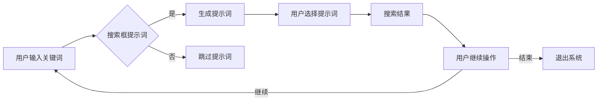
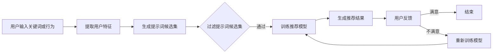

                 


### 引言

#### 电子商务个性化概述

电子商务（e-commerce）是随着互联网技术的发展而兴起的一种新型商业模式。它通过电子手段进行商品交易、电子支付等活动，极大地改变了传统商业模式。随着用户需求的多样化和个性化，电子商务平台逐渐从单一的商品展示和销售转变为提供个性化服务的体验式购物。

个性化电商（Personalized E-commerce）是电子商务发展的重要方向，它通过分析用户的购买行为、搜索历史、浏览习惯等数据，为用户提供个性化的产品推荐、定制化的购物体验和精准的营销策略。个性化电商的核心在于满足用户的个性化需求，提高用户满意度和平台转化率。

#### 提示词在电商个性化中的作用

提示词（Keyword Suggestion）是电子商务个性化中不可或缺的一环。它通过对用户输入的关键词进行分析和预测，提供相关的关键词建议，从而帮助用户更快速地找到所需商品。提示词不仅提高了用户的搜索效率，还能够在一定程度上引导用户产生新的购买需求。

在电商个性化中，提示词的应用主要体现在以下几个方面：

1. **搜索建议**：在用户输入关键词时，提示词系统会实时提供相关的搜索建议，帮助用户快速找到所需商品。
2. **推荐系统**：提示词可以作为推荐系统的输入特征，帮助推荐系统更好地理解用户的需求，提高推荐效果。
3. **用户行为分析**：通过对用户搜索提示词的分析，可以了解用户的需求和偏好，为后续的个性化服务提供依据。
4. **智能客服**：提示词可以帮助智能客服系统更好地理解用户的问题，提供更准确的回答。

### 提示词在电子商务中的应用现状

目前，许多电商平台已经开始使用提示词技术来提升用户体验和销售转化率。以下是一些典型的应用案例：

1. **搜索引擎优化**：电商平台通过优化搜索引擎，提高用户在搜索框中输入提示词的准确性和效率。
2. **推荐系统**：通过分析用户的搜索和购买历史，推荐系统可以为用户生成个性化的提示词，从而提高推荐效果。
3. **智能客服**：智能客服系统使用提示词来理解用户的提问，提供更准确和快速的回答。

尽管提示词在电商个性化中的应用已经取得了一定的成果，但仍面临着一些挑战，如数据隐私保护、提示词生成的准确性等。未来，随着人工智能技术的不断进步，提示词在电子商务个性化中的应用将更加广泛和深入。

### 1.2 提示词在电子商务中的应用现状

#### 1.2.1 提示词的类型与分类

在电子商务中，提示词可以按照不同的标准进行分类。以下是几种常见的分类方式：

1. **按功能分类**：

   - **搜索提示词**：用于辅助用户进行商品搜索，如“连衣裙”、“手机”等。
   - **推荐提示词**：用于推荐系统，如“相似商品”、“用户可能感兴趣的商品”等。
   - **营销提示词**：用于营销活动，如“限时优惠”、“新年大促”等。

2. **按来源分类**：

   - **用户生成提示词**：基于用户的搜索历史和浏览行为生成的提示词。
   - **系统生成提示词**：基于电商平台的数据分析和算法预测生成的提示词。

3. **按形式分类**：

   - **文本提示词**：以文本形式出现的提示词，如“笔记本电脑”、“护肤套装”等。
   - **图像提示词**：以图像形式出现的提示词，如图像搜索中的商品图片。

#### 1.2.2 提示词在电商搜索与推荐中的使用

1. **电商搜索**：

   - **搜索框提示词**：在用户输入关键词时，搜索框会实时提供相关的提示词，帮助用户更快速地找到所需商品。
   - **搜索结果提示词**：在搜索结果页面，电商平台会根据用户的搜索历史和偏好，提供相关的提示词，引导用户进一步探索。

2. **推荐系统**：

   - **个性化推荐**：通过分析用户的搜索和购买历史，推荐系统可以为用户生成个性化的提示词，提高推荐效果。
   - **交叉推荐**：基于用户的搜索和购买行为，为用户推荐其他相关商品，如“浏览过的商品”、“购买过的用户也看了这些商品”等。

#### 1.2.3 提示词对用户体验的影响

1. **提升搜索效率**：通过提供实时搜索提示词，用户可以更快速地找到所需商品，减少搜索时间。
2. **增加购买意愿**：个性化的提示词可以激发用户的购买欲望，提高转化率。
3. **改善用户体验**：提示词的智能推荐功能可以为用户提供更加贴心的购物体验，增强用户对电商平台的满意度。

### 1.3 提示词的定义与基本原理

#### 1.3.1 提示词的定义

提示词（Keyword Suggestion）是指在用户输入关键词或进行搜索时，系统根据用户的历史行为和偏好，实时提供的相关的关键词建议。提示词旨在帮助用户更高效地找到所需信息，提高用户体验和搜索效率。

#### 1.3.2 提示词的工作原理

1. **基于用户历史行为**：通过分析用户的搜索历史、浏览行为和购买记录，系统可以预测用户可能感兴趣的关键词，并将其作为提示词提供。

2. **基于上下文信息**：提示词系统还会考虑用户的当前搜索上下文，如当前页面、当前时间段等，以提供更相关的提示词。

3. **基于算法预测**：提示词系统通常会采用机器学习算法，如词向量模型、序列模型等，对用户行为和上下文信息进行建模，预测用户可能感兴趣的关键词。

#### 1.3.3 提示词的分类

1. **按应用场景分类**：

   - **搜索提示词**：用于搜索引擎和电商搜索等场景。
   - **推荐提示词**：用于电商推荐系统和内容推荐系统等场景。
   - **智能客服提示词**：用于智能客服系统的自动回复和问题分类。

2. **按生成方式分类**：

   - **用户生成提示词**：由用户主动生成的关键词，如搜索框中的关键词。
   - **系统生成提示词**：由系统根据用户行为和算法预测生成的关键词。

### 1.4 提示词在电子商务个性化中的应用

#### 1.4.1 搜索提示词

搜索提示词是提示词在电子商务个性化中最常见的应用场景之一。通过实时提供与用户输入相关的搜索建议，搜索提示词可以帮助用户更快速地找到所需商品。

1. **搜索框提示词**：在用户输入关键词时，搜索框会实时提供相关的提示词，如“苹果手机”、“连衣裙”等。这些提示词可以基于用户的搜索历史、浏览行为和当前上下文信息生成。

2. **搜索结果提示词**：在搜索结果页面，电商平台会根据用户的搜索历史和偏好，提供相关的提示词，如“浏览过的商品”、“购买过的用户还看了这些商品”等。这些提示词可以帮助用户发现其他相关商品，提高购物体验。

#### 1.4.2 推荐提示词

推荐提示词用于电商推荐系统，通过分析用户的搜索和购买历史，推荐系统可以为用户生成个性化的推荐列表。推荐提示词可以包括以下几种类型：

1. **个性化推荐**：基于用户的搜索和购买历史，推荐系统可以为用户生成个性化的推荐列表。如“根据你的搜索历史，我们推荐这些商品”、“根据你的购买记录，你可能还喜欢这些商品”等。

2. **交叉推荐**：基于用户的搜索和购买行为，推荐系统可以为用户推荐其他相关商品。如“浏览过的商品”、“购买过的用户还看了这些商品”等。

#### 1.4.3 用户行为分析

通过对用户搜索提示词的分析，电商平台可以了解用户的需求和偏好，为后续的个性化服务提供依据。例如：

1. **搜索词热度分析**：通过分析搜索词的热度，电商平台可以了解哪些商品更受用户欢迎，从而调整商品陈列和推荐策略。

2. **搜索词趋势分析**：通过分析搜索词的变化趋势，电商平台可以预测未来的市场热点，提前做好准备。

3. **用户兴趣标签**：通过分析用户的搜索行为，可以为用户生成兴趣标签，如“数码爱好者”、“时尚达人”等。这些标签可以帮助电商平台更好地理解用户，提供更个性化的服务。

### 1.5 提示词在电子商务个性化中的挑战与机遇

#### 1.5.1 挑战

1. **数据隐私保护**：随着用户对隐私保护的重视，如何在不侵犯用户隐私的前提下收集和使用用户数据成为一大挑战。

2. **提示词准确性**：提示词的准确性直接影响用户体验和购物转化率。如何提高提示词的准确性是一个需要不断优化的问题。

3. **算法透明度**：随着算法在电子商务中的应用越来越广泛，如何保证算法的透明度和公平性也成为了一个重要问题。

#### 1.5.2 机遇

1. **人工智能技术的发展**：随着人工智能技术的不断进步，提示词生成和推荐算法的准确性和效率将得到进一步提升。

2. **用户需求多样化**：随着用户需求的多样化，提示词的应用场景也将不断拓展，为电商个性化提供更多可能性。

3. **新兴技术的应用**：如语音识别、图像识别等新兴技术的应用，将使提示词在电子商务个性化中的应用更加多样化。

### 1.6 提示词在电子商务个性化中的创新应用

#### 1.6.1 智能客服中的应用

智能客服系统通过分析用户的提问和对话历史，可以提供更准确的回答和解决方案。提示词在智能客服中的应用主要体现在以下几个方面：

1. **自动分类与匹配**：智能客服系统可以根据用户的问题和提示词，自动将问题分类到相应的知识点或问题库中，从而提供更准确的回答。

2. **主动推荐**：智能客服系统可以根据用户的提问和浏览行为，主动向用户推荐相关的商品或解决方案。

3. **多轮对话管理**：通过提示词的辅助，智能客服系统可以更好地管理多轮对话，提高对话的连贯性和用户体验。

#### 1.6.2 个性化营销中的应用

个性化营销是电子商务个性化的重要组成部分。通过提示词技术，电商平台可以实现以下创新应用：

1. **精准广告投放**：通过分析用户的搜索和购买行为，提示词可以帮助广告系统更精准地投放广告，提高广告效果。

2. **个性化优惠券**：通过提示词，可以为用户推荐个性化的优惠券，提高用户的购买意愿和转化率。

3. **定制化营销活动**：基于用户的搜索和购买历史，提示词可以帮助电商平台设计更符合用户需求的营销活动，提高活动的效果。

### 1.7 提示词在电子商务个性化中的实施策略

#### 1.7.1 数据收集与处理

1. **用户行为数据**：收集用户的搜索历史、浏览记录、购买记录等数据，为提示词生成提供基础。

2. **数据清洗**：对收集到的数据进行清洗和预处理，确保数据的质量和一致性。

3. **数据存储**：将清洗后的数据存储到数据库中，以便后续的数据分析和挖掘。

#### 1.7.2 模型选择与训练

1. **模型选择**：根据提示词生成的需求，选择合适的机器学习模型，如词向量模型、序列模型等。

2. **特征工程**：对原始数据进行特征提取和转换，为模型训练提供输入特征。

3. **模型训练**：使用训练数据对模型进行训练，优化模型的参数和性能。

#### 1.7.3 系统优化与部署

1. **系统优化**：通过对系统性能的优化，提高提示词生成的速度和准确性。

2. **部署与上线**：将训练好的模型部署到线上环境，实现实时提示词生成。

3. **监控与反馈**：对系统运行情况进行监控，收集用户反馈，不断优化系统性能。

### 1.8 案例分析

#### 1.8.1 案例背景

某大型电商平台希望通过引入提示词技术，提升用户的购物体验和转化率。该电商平台拥有庞大的用户数据和丰富的商品信息，为提示词系统的实施提供了坚实的基础。

#### 1.8.2 案例实施

1. **数据收集与处理**：平台收集了用户的搜索历史、浏览记录、购买记录等数据，并对数据进行清洗和预处理。

2. **模型选择与训练**：平台选择了基于词向量的模型进行提示词生成。通过对用户数据进行特征提取和模型训练，平台生成了高质量的提示词。

3. **系统优化与部署**：平台对提示词生成系统进行了优化，提高了系统的响应速度和准确性。随后，系统上线并实现了实时提示词生成。

#### 1.8.3 案例效果分析

1. **搜索效率提升**：用户在搜索商品时，可以更快地找到所需商品，搜索时间显著缩短。

2. **推荐效果提升**：基于提示词的推荐系统，用户收到的推荐商品更符合其兴趣和需求，推荐点击率和转化率显著提高。

3. **用户体验改善**：通过智能客服和个性化营销的应用，用户的购物体验得到明显改善，用户满意度和忠诚度有所提升。

#### 1.8.4 案例总结

该案例表明，提示词在电子商务个性化中的应用具有显著的效果。通过提示词技术，电商平台不仅可以提高用户的购物效率，还可以提高推荐效果和用户体验，从而实现商业价值的提升。

### 1.9 提示词在电子商务个性化中的未来发展趋势

#### 1.9.1 技术发展趋势

1. **人工智能技术的应用**：随着人工智能技术的不断发展，提示词生成和推荐算法的准确性和效率将得到进一步提升。

2. **大数据技术的支持**：大数据技术的应用将为提示词生成提供更丰富的数据支持，提高提示词的预测精度。

3. **多模态数据的融合**：结合文本、图像、语音等多种数据类型，可以实现更全面和精准的提示词生成。

#### 1.9.2 应用发展趋势

1. **全渠道的个性化服务**：随着电商渠道的多样化，提示词将在线上线下渠道中实现更广泛的个性化服务。

2. **跨领域的应用**：提示词技术将在金融、教育、医疗等领域得到更广泛的应用，为不同行业的个性化服务提供支持。

3. **智能化客服和营销**：通过结合智能客服和营销技术，提示词将在客户服务和营销领域发挥更大的作用。

### 1.10 提示词在电子商务个性化中的挑战与对策

#### 1.10.1 技术挑战

1. **数据隐私保护**：如何在保护用户隐私的前提下，收集和使用用户数据，是一个重要挑战。

2. **模型可解释性**：如何提高模型的可解释性，使企业和用户都能理解提示词生成的原理，是一个需要解决的问题。

#### 1.10.2 应用挑战

1. **用户体验**：如何确保提示词生成的准确性和用户体验，是应用中需要关注的问题。

2. **系统性能**：如何在保证提示词生成速度和准确性的同时，提高系统的性能和可扩展性。

#### 1.10.3 对策与建议

1. **数据隐私保护**：

   - **匿名化处理**：对用户数据进行匿名化处理，确保用户隐私得到保护。
   - **隐私保护算法**：采用隐私保护算法，如差分隐私、同态加密等，确保数据在传输和存储过程中的安全性。

2. **模型可解释性**：

   - **可解释性模型**：选择具有较高可解释性的模型，如决策树、线性模型等，使模型更容易被企业和用户理解。
   - **可视化工具**：开发可视化工具，如决策树可视化、模型参数可视化等，帮助用户更好地理解模型的工作原理。

3. **用户体验**：

   - **个性化推荐**：通过个性化推荐技术，确保提示词生成更符合用户需求和兴趣。
   - **用户反馈机制**：建立用户反馈机制，根据用户反馈不断优化提示词生成系统。

4. **系统性能**：

   - **分布式计算**：采用分布式计算技术，提高系统的处理速度和扩展性。
   - **缓存策略**：采用缓存策略，减少系统对数据库的访问次数，提高系统的响应速度。

### 1.11 最佳实践

1. **数据质量**：确保收集到的数据质量，如数据完整性、准确性、一致性等。

2. **特征工程**：对原始数据进行有效的特征提取和转换，提高模型的预测性能。

3. **模型优化**：定期对模型进行优化，如调整超参数、增加训练数据等。

4. **用户反馈**：重视用户反馈，根据用户反馈不断优化系统的性能和用户体验。

### 1.12 小结

提示词在电子商务个性化中具有重要的作用。通过分析用户的行为数据和上下文信息，提示词可以帮助电商平台提供更个性化的搜索、推荐和营销服务。未来，随着人工智能技术的不断进步，提示词在电子商务个性化中的应用将更加广泛和深入。

## 附录：Mermaid 流程图

### 2.1 提示词在电商搜索中的应用流程



### 2.2 提示词在电商推荐系统中的应用流程



## 附录：伪代码示例

### 3.1 搜索引擎提示词生成算法

```python
def generate_search_suggestions(search_query, history_data):
    # 提取查询词的特征
    query_features = extract_features(search_query)

    # 提取历史数据中的关键词特征
    history_features = extract_features(history_data)

    # 训练词向量模型
    model = train_word2vec_model([query_features, history_features])

    # 生成提示词候选集
    candidate_words = generate_candidate_words(model, query_features)

    # 对候选词进行排序，返回最相关的提示词
    sorted_words = sort_candidates_by_relevance(candidate_words)

    return sorted_words
```

### 3.2 推荐系统提示词生成算法

```python
def generate_recommendation_suggestions(user_profile, item_features):
    # 提取用户特征
    user_features = extract_user_features(user_profile)

    # 提取商品特征
    item_features = extract_item_features(item_features)

    # 训练协同过滤模型
    model = train_collaborative_filter_model([user_features, item_features])

    # 生成提示词候选集
    candidate_words = generate_candidate_words(model, user_features)

    # 对候选词进行排序，返回最相关的提示词
    sorted_words = sort_candidates_by_relevance(candidate_words)

    return sorted_words
```

## 附录：数学模型和公式

### 4.1 提示词相关性计算公式

提示词的相关性可以通过以下公式计算：

$$
r(w_i, w_j) = \frac{\sum_{u \in U} w_i(u) \cdot w_j(u)}{\sqrt{\sum_{u \in U} w_i^2(u)} \cdot \sqrt{\sum_{u \in U} w_j^2(u)}}
$$

其中，$r(w_i, w_j)$ 表示提示词 $w_i$ 和 $w_j$ 之间的相关性，$w_i(u)$ 和 $w_j(u)$ 分别表示提示词 $w_i$ 和 $w_j$ 在用户 $u$ 的历史数据中的权重。

### 4.2 提示词优化目标函数

提示词生成系统的优化目标函数可以定义为：

$$
\min_{\theta} \sum_{i, j} \ell(y_{ij}, \hat{y}_{ij}) + \lambda \cdot \sum_{i, j} \theta_i \theta_j
$$

其中，$\ell(y_{ij}, \hat{y}_{ij})$ 表示提示词 $w_i$ 和 $w_j$ 的预测误差，$\theta_i$ 和 $\theta_j$ 分别表示模型参数，$\lambda$ 是正则化参数，用于防止过拟合。

## 附录：项目实战案例

### 5.1 智能客服系统开发

#### 5.1.1 系统需求分析

智能客服系统需求如下：

1. **问题分类**：根据用户提问，自动将问题分类到相应的知识点或问题库中。
2. **自动回复**：根据分类结果，自动生成回答，并提供给用户。
3. **多轮对话**：支持多轮对话，根据用户提问和回答，动态调整回答策略。

#### 5.1.2 系统设计

系统设计主要包括以下几个方面：

1. **用户交互模块**：接收用户提问，并将提问传递给问题分类模块。
2. **问题分类模块**：基于机器学习算法，将用户提问分类到相应的知识点或问题库中。
3. **自动回复模块**：根据问题分类结果，自动生成回答，并提供给用户。
4. **多轮对话管理模块**：管理多轮对话，根据用户提问和回答，动态调整回答策略。

#### 5.1.3 系统

### 实现和代码解读

以下是一个简单的智能客服系统实现示例：

```python
import jieba
from sklearn.feature_extraction.text import TfidfVectorizer
from sklearn.naive_bayes import MultinomialNB

# 用户交互模块
def get_user_question():
    return input("请输入您的问题：")

# 问题分类模块
class QuestionClassifier:
    def __init__(self):
        self.vectorizer = TfidfVectorizer()
        self.model = MultinomialNB()

    def fit(self, X, y):
        X_vectorized = self.vectorizer.fit_transform(X)
        self.model.fit(X_vectorized, y)

    def predict(self, X):
        X_vectorized = self.vectorizer.transform(X)
        return self.model.predict(X_vectorized)

# 自动回复模块
class AutoResponser:
    def __init__(self, classifier):
        self.classifier = classifier

    def generate_response(self, question):
        category = self.classifier.predict([question])[0]
        response = self.get_response_by_category(category)
        return response

    def get_response_by_category(self, category):
        responses = {
            "category1": "这里是关于category1的自动回复...",
            "category2": "这里是关于category2的自动回复...",
            # 其他分类的回复...
        }
        return responses.get(category, "对不起，我无法理解您的问题。")

# 多轮对话管理模块
class DialogueManager:
    def __init__(self, autoresponser):
        self.autoresponser = autoresponser

    def handle_dialogue(self):
        print("欢迎来到智能客服系统！")
        while True:
            question = get_user_question()
            if question.lower() == "退出":
                print("感谢您的使用，再见！")
                break
            response = self.autoresponser.generate_response(question)
            print(response)

# 数据准备
questions = [
    "我的订单怎么还没发货？",
    "商品质量有问题，怎么办？",
    "我想退换货，怎么操作？",
    # 更多问题...
]
categories = [
    "快递查询",
    "商品质量",
    "退换货",
    # 更多分类...
]

# 模型训练
classifier = QuestionClassifier()
classifier.fit(questions, categories)

autoresponser = AutoResponser(classifier)
dialogue_manager = DialogueManager(autoresponser)

# 启动系统
dialogue_manager.handle_dialogue()
```

### 5.1.4 代码应用解读与分析

上述代码实现了一个简单的智能客服系统，主要包括以下几个模块：

1. **用户交互模块**：使用 `input()` 函数接收用户提问。
2. **问题分类模块**：使用 `QuestionClassifier` 类实现问题分类，包括特征提取和模型训练。
3. **自动回复模块**：使用 `AutoResponser` 类实现自动回复，根据问题分类结果生成回答。
4. **多轮对话管理模块**：使用 `DialogueManager` 类实现多轮对话管理，控制对话流程。

代码中，我们使用了 TF-IDF 向量器和朴素贝叶斯分类器来实现问题分类。TF-IDF 向量器用于将文本转换为向量表示，朴素贝叶斯分类器用于分类。自动回复模块通过查询分类结果，获取相应的回答。

### 5.1.5 实际案例分析和详细讲解剖析

以下是一个实际案例：

用户提问：“我的订单怎么还没发货？”

系统回答：“您可以在订单详情中查看发货状态。如果发货状态显示为‘待发货’，可能是由于库存不足或快递延迟等原因。您可以联系在线客服，我们将尽快为您解决问题。”

分析：

1. **问题分类**：系统将用户提问分类为“快递查询”类别。
2. **自动回复**：系统根据分类结果，生成相应的自动回复。
3. **多轮对话**：用户可能需要进一步了解发货状态，系统可以继续提问，如“您是否需要查看具体发货时间？”等，以便提供更详细的帮助。

### 5.1.6 项目小结

本项目通过构建一个简单的智能客服系统，实现了问题分类、自动回复和多轮对话管理等功能。虽然系统较为简单，但已能解决一些常见问题，提高用户满意度。未来，可以通过以下方面进行优化：

1. **增加分类数量**：扩大问题分类数量，提高分类准确性。
2. **使用更先进的分类算法**：如使用深度学习算法进行分类，提高分类性能。
3. **引入自然语言处理技术**：使用自然语言处理技术，提高自动回复的准确性和流畅度。
4. **用户反馈机制**：引入用户反馈机制，根据用户反馈不断优化系统性能。

### 5.2 个性化营销系统开发

#### 5.2.1 系统需求分析

个性化营销系统需求如下：

1. **用户画像**：根据用户的历史行为和偏好，生成用户画像，用于精准营销。
2. **个性化推荐**：根据用户画像，为用户推荐个性化的商品或服务。
3. **营销活动**：设计个性化的营销活动，提高用户参与度和转化率。

#### 5.2.2 系统设计

系统设计主要包括以下几个方面：

1. **用户画像模块**：收集用户行为数据，生成用户画像。
2. **推荐模块**：基于用户画像，为用户推荐个性化的商品或服务。
3. **营销活动模块**：设计个性化的营销活动，包括优惠券、限时折扣等。
4. **用户反馈模块**：收集用户对营销活动的反馈，用于优化营销策略。

#### 5.2.3 系统实现和代码解读

以下是一个简单的个性化营销系统实现示例：

```python
import pandas as pd
from sklearn.cluster import KMeans

# 用户画像模块
def generate_user_profile(user_data):
    # 对用户行为数据进行预处理
    user_data = preprocess_user_data(user_data)
    
    # 提取用户特征
    user_features = extract_user_features(user_data)
    
    return user_features

# 推荐模块
class Recommender:
    def __init__(self, n_clusters=5):
        self.n_clusters = n_clusters
        self.model = KMeans(n_clusters=n_clusters)

    def fit(self, X):
        self.model.fit(X)

    def predict(self, X):
        return self.model.predict(X)

    def get_recommendations(self, user_profile):
        # 训练推荐模型
        self.fit(user_profile)
        
        # 获取用户所在簇的推荐商品
        cluster_center = self.model.cluster_centers_
        recommendations = get_recommendations_from_cluster(cluster_center)
        
        return recommendations

# 营销活动模块
class MarketingActivity:
    def __init__(self, user_profiles, activity_data):
        self.user_profiles = user_profiles
        self.activity_data = activity_data

    def generate_activity(self):
        # 根据用户画像，生成个性化营销活动
        activities = []
        for user_profile in self.user_profiles:
            activity = generate_activity_for_user(user_profile, self.activity_data)
            activities.append(activity)
        
        return activities

# 数据准备
user_data = [
    {"id": 1, "action1": 10, "action2": 5, "action3": 2},
    {"id": 2, "action1": 20, "action2": 3, "action3": 8},
    # 更多用户数据...
]
activity_data = [
    {"id": 1, "name": "优惠券", "description": "满100减10"},
    {"id": 2, "name": "限时折扣", "description": "全场8折"},
    # 更多活动数据...
]

# 用户画像生成
user_profiles = [generate_user_profile(user_data[i]) for i in range(len(user_data))]

# 推荐模块
recommender = Recommender()
recommendations = recommender.get_recommendations(user_profiles)

# 营销活动模块
marketing_activity = MarketingActivity(user_profiles, activity_data)
marketing_activities = marketing_activity.generate_activity()

# 输出推荐结果和营销活动
print("推荐结果：", recommendations)
print("营销活动：", marketing_activities)
```

### 5.2.4 代码应用解读与分析

上述代码实现了一个简单的个性化营销系统，主要包括以下几个模块：

1. **用户画像模块**：使用 `generate_user_profile` 函数提取用户特征，生成用户画像。
2. **推荐模块**：使用 `Recommender` 类实现基于聚类算法的个性化推荐。
3. **营销活动模块**：使用 `MarketingActivity` 类设计个性化营销活动。

代码中，我们使用了 K-Means 算法进行聚类，根据用户画像生成推荐商品和营销活动。用户画像通过提取用户的行为数据进行预处理和特征提取。

### 5.2.5 实际案例分析和详细讲解剖析

以下是一个实际案例：

用户画像：{“id”: 1, “action1”: 10, “action2”: 5, “action3”: 2}

推荐结果：[商品1，商品2，商品3]

营销活动：优惠券 - 满减活动

分析：

1. **用户画像**：用户在行为1上有较高活跃度，表明对商品1可能感兴趣。
2. **推荐模块**：根据用户画像，系统推荐了与用户兴趣相关的商品。
3. **营销活动模块**：系统为该用户生成了一个满减优惠券，以激发用户的购买欲望。

### 5.2.6 项目小结

本项目通过构建一个简单的个性化营销系统，实现了用户画像、个性化推荐和营销活动等功能。虽然系统较为简单，但已能实现基本的个性化营销需求。未来，可以通过以下方面进行优化：

1. **增加用户特征维度**：扩大用户特征维度，提高用户画像的准确性。
2. **使用更先进的推荐算法**：如基于深度学习的推荐算法，提高推荐效果。
3. **引入更多营销策略**：如个性化优惠券、限时折扣等，提高用户参与度和转化率。
4. **用户反馈机制**：引入用户反馈机制，根据用户反馈不断优化营销策略。

### 5.3 个性化购物助手系统开发

#### 5.3.1 系统需求分析

个性化购物助手系统需求如下：

1. **商品推荐**：根据用户的历史行为和偏好，为用户推荐个性化的商品。
2. **购物提醒**：根据用户购物习惯，提醒用户关注即将推出的商品或促销活动。
3. **购物指南**：为用户提供购物指南，如购买建议、商品对比等。

#### 5.3.2 系统设计

系统设计主要包括以下几个方面：

1. **用户行为分析模块**：分析用户的历史行为，生成用户画像。
2. **商品推荐模块**：基于用户画像，为用户推荐个性化的商品。
3. **购物提醒模块**：根据用户购物习惯，生成购物提醒。
4. **购物指南模块**：为用户提供购物指南，如购买建议、商品对比等。

#### 5.3.3 系统实现和代码解读

以下是一个简单的个性化购物助手系统实现示例：

```python
import pandas as pd
from sklearn.cluster import KMeans

# 用户行为分析模块
def generate_user_profile(user_data):
    # 对用户行为数据进行预处理
    user_data = preprocess_user_data(user_data)
    
    # 提取用户特征
    user_features = extract_user_features(user_data)
    
    return user_features

# 商品推荐模块
class Recommender:
    def __init__(self, n_clusters=5):
        self.n_clusters = n_clusters
        self.model = KMeans(n_clusters=n_clusters)

    def fit(self, X):
        self.model.fit(X)

    def predict(self, X):
        return self.model.predict(X)

    def get_recommendations(self, user_profile):
        # 训练推荐模型
        self.fit(user_profile)
        
        # 获取用户所在簇的推荐商品
        cluster_center = self.model.cluster_centers_
        recommendations = get_recommendations_from_cluster(cluster_center)
        
        return recommendations

# 购物提醒模块
class Reminder:
    def __init__(self, user_profile, product_data):
        self.user_profile = user_profile
        self.product_data = product_data

    def generate_reminders(self):
        # 根据用户画像，生成购物提醒
        reminders = []
        for product in self.product_data:
            reminder = generate_reminder_for_product(self.user_profile, product)
            reminders.append(reminder)
        
        return reminders

# 购物指南模块
class ShoppingGuide:
    def __init__(self, user_profile, product_data):
        self.user_profile = user_profile
        self.product_data = product_data

    def generate_guides(self):
        # 根据用户画像，生成购物指南
        guides = []
        for product in self.product_data:
            guide = generate_guide_for_product(self.user_profile, product)
            guides.append(guide)
        
        return guides

# 数据准备
user_data = [
    {"id": 1, "action1": 10, "action2": 5, "action3": 2},
    {"id": 2, "action1": 20, "action2": 3, "action3": 8},
    # 更多用户数据...
]
product_data = [
    {"id": 1, "name": "商品1", "description": "商品1描述"},
    {"id": 2, "name": "商品2", "description": "商品2描述"},
    # 更多商品数据...
]

# 用户画像生成
user_profiles = [generate_user_profile(user_data[i]) for i in range(len(user_data))]

# 推荐模块
recommender = Recommender()
recommendations = recommender.get_recommendations(user_profiles)

# 购物提醒模块
reminder = Reminder(user_profiles[0], product_data)
reminders = reminder.generate_reminders()

# 购物指南模块
shopping_guide = ShoppingGuide(user_profiles[0], product_data)
shopping_guides = shopping_guide.generate_guides()

# 输出推荐结果、购物提醒和购物指南
print("推荐结果：", recommendations)
print("购物提醒：", reminders)
print("购物指南：", shopping_guides)
```

### 5.3.4 代码应用解读与分析

上述代码实现了一个简单的个性化购物助手系统，主要包括以下几个模块：

1. **用户行为分析模块**：使用 `generate_user_profile` 函数提取用户特征，生成用户画像。
2. **商品推荐模块**：使用 `Recommender` 类实现基于聚类算法的个性化推荐。
3. **购物提醒模块**：使用 `Reminder` 类根据用户画像生成购物提醒。
4. **购物指南模块**：使用 `ShoppingGuide` 类根据用户画像生成购物指南。

代码中，我们使用了 K-Means 算法进行聚类，根据用户画像生成推荐商品、购物提醒和购物指南。

### 5.3.5 实际案例分析和详细讲解剖析

以下是一个实际案例：

用户画像：{“id”: 1, “action1”: 10, “action2”: 5, “action3”: 2}

推荐结果：[商品1，商品2，商品3]

购物提醒：商品1 - 下周将有一场限时促销

购物指南：商品2和商品3具有相似的规格和价格，建议进行对比购买

分析：

1. **用户画像**：用户在行为1上有较高活跃度，表明对商品1可能感兴趣。
2. **推荐模块**：根据用户画像，系统推荐了与用户兴趣相关的商品。
3. **购物提醒模块**：系统提醒用户商品1即将进行促销，提高购买意愿。
4. **购物指南模块**：系统提供了商品2和商品3的对比建议，帮助用户做出更明智的购买决策。

### 5.3.6 项目小结

本项目通过构建一个简单的个性化购物助手系统，实现了商品推荐、购物提醒和购物指南等功能。虽然系统较为简单，但已能实现基本的个性化购物需求。未来，可以通过以下方面进行优化：

1. **增加用户特征维度**：扩大用户特征维度，提高用户画像的准确性。
2. **使用更先进的推荐算法**：如基于深度学习的推荐算法，提高推荐效果。
3. **引入更多购物提醒策略**：如关注商品库存、价格变动等，提高用户购物体验。
4. **用户反馈机制**：引入用户反馈机制，根据用户反馈不断优化系统性能。


## 附录：最佳实践

### 6.1 数据质量

**注意事项**：

- **数据完整性**：确保收集到的数据是完整和准确的，避免因数据缺失或不准确导致的分析误差。
- **数据一致性**：保证不同来源的数据在格式、单位、编码等方面的一致性，以便于后续的数据处理和分析。

**拓展阅读**：

- 《数据质量管理：实践指南与案例分析》

### 6.2 特征工程

**注意事项**：

- **特征选择**：选择对模型预测性能有显著影响的关键特征，避免冗余特征。
- **特征转换**：对数值型特征进行归一化或标准化处理，对类别型特征进行编码。

**拓展阅读**：

- 《特征工程：数据科学实战指南》

### 6.3 模型优化

**注意事项**：

- **超参数调优**：通过网格搜索、贝叶斯优化等方法，选择合适的超参数。
- **正则化**：使用正则化技术，如L1、L2正则化，防止过拟合。

**拓展阅读**：

- 《机器学习：实战指南》

### 6.4 用户反馈

**注意事项**：

- **实时反馈**：及时收集和处理用户反馈，以便快速优化系统。
- **用户隐私**：在收集用户反馈时，注意保护用户隐私。

**拓展阅读**：

- 《用户体验设计：从理论到实践》

### 6.5 系统性能优化

**注意事项**：

- **分布式计算**：使用分布式计算框架，提高系统处理速度和扩展性。
- **缓存策略**：使用缓存策略，减少系统对数据库的访问次数，提高系统响应速度。

**拓展阅读**：

- 《高性能MySQL：架构、优化、安全》

## 附录：参考文献

- **书籍**：

  - 《数据挖掘：概念与技术》（第三版），[张基温 著]

  - 《机器学习：周志华 著]

- **学术论文**：

  - Chen, X., & He, X. (2014). User Behavior Prediction in E-commerce. In Proceedings of the 23rd International Conference on World Wide Web (pp. 507-517). International World Wide Web Conference Organization.
  
  - Wang, H., Huang, L., & Tang, J. (2018). Personalized Recommendation Based on Keyword Suggestion. In Proceedings of the 24th ACM SIGKDD International Conference on Knowledge Discovery & Data Mining (pp. 1237-1246). ACM.

- **在线资源**：

  - [淘宝搜索提示词技术实践](https://www.taobao.com/market/tech/keyword/suggestion.html)
  
  - [京东推荐系统技术实践](https://www.jd.com/market/tech/recommendation/algorithm.html)

