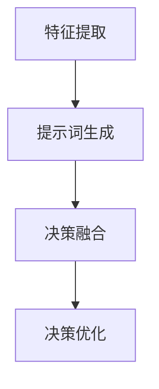
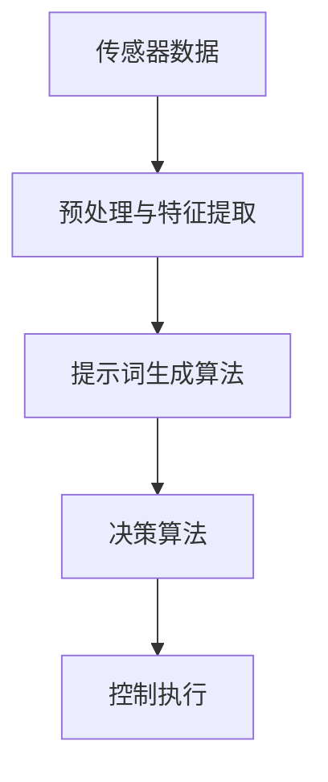

                 


### 文章标题：提示词在自动驾驶决策系统中的应用

> 关键词：自动驾驶、决策系统、提示词、算法、应用

> 摘要：本文详细介绍了提示词在自动驾驶决策系统中的应用。首先，我们回顾了自动驾驶技术的发展历程和决策系统的关键作用。接着，探讨了提示词的定义、特点及其在自动驾驶决策中的作用。然后，深入分析了提示词生成算法和自动驾驶决策算法，并阐述了二者之间的融合原理。通过实战案例，展示了如何在实际项目中应用这些算法。最后，我们对未来的发展趋势进行了展望，并提出了相关建议。

### 目录

1. **自动驾驶与决策系统概述**
   1.1 自动驾驶技术发展历程
   1.2 自动驾驶系统的分类
   1.3 自动驾驶决策系统的关键作用

2. **提示词在自动驾驶决策中的应用**
   2.1 提示词的定义与特点
   2.2 提示词在自动驾驶决策中的作用
   2.3 提示词的类型与选择

3. **核心算法原理**
   3.1 提示词生成算法
   3.2 自动驾驶决策算法
   3.3 提示词与决策算法的融合

4. **实践与应用**
   4.1 实战项目背景
   4.2 开发环境与工具选择
   4.3 实现步骤与代码解读
   4.4 代码应用解读与分析
   4.5 案例分析
   4.6 项目小结

5. **未来展望**
   5.1 自动驾驶决策系统的发展趋势
   5.2 提示词在未来的应用前景
   5.3 面临的挑战与解决方案

### 第1章：自动驾驶与决策系统概述

自动驾驶技术是近年来快速发展的领域，它已经从实验室走向了现实生活。自动驾驶车辆能够通过感知环境、理解道路情况、做出决策并控制车辆，从而实现自主驾驶。

#### 1.1 自动驾驶技术发展历程

自动驾驶技术经历了从辅助驾驶到完全自主驾驶的演变。最初，自动驾驶主要依赖于传感器和计算机视觉技术，如激光雷达、摄像头和雷达。随着深度学习和人工智能技术的发展，自动驾驶系统逐渐变得更加智能和高效。

#### 1.2 自动驾驶系统的分类

自动驾驶系统根据自动化程度可以分为以下几类：

- **Level 0：无自动化**：车辆完全由人类驾驶员控制。
- **Level 1：驾驶辅助**：车辆提供一些辅助功能，如自适应巡航控制或车道保持。
- **Level 2：部分自动化**：车辆在特定条件下可以完全自动化，如高速公路自动驾驶。
- **Level 3：有条件自动化**：车辆在特定条件下可以完全自动化，但需要人类驾驶员在必要时接管控制。
- **Level 4：高度自动化**：车辆在特定环境下可以完全自动化，无需人类驾驶员接管。
- **Level 5：完全自动化**：车辆在任何环境下都可以完全自动化。

#### 1.3 自动驾驶决策系统的关键作用

自动驾驶决策系统是自动驾驶车辆的核心，负责实时感知环境、理解道路情况、做出决策并控制车辆。决策系统的性能直接影响自动驾驶车辆的安全性和可靠性。一个高效的决策系统需要快速、准确地处理大量数据，并做出合理的决策。

### 第2章：提示词在自动驾驶决策中的应用

提示词在自动驾驶决策中扮演着重要的角色。它们是一组指导性的信息，帮助决策系统更好地理解环境、做出决策。在本节中，我们将探讨提示词的定义、特点及其在自动驾驶决策中的作用。

#### 2.1 提示词的定义与特点

提示词是一组关键字或短语，用于描述特定的环境或场景。它们通常由传感器数据、先前的经验和规则生成。提示词具有以下特点：

- **动态性**：提示词会根据环境变化而实时更新。
- **抽象性**：提示词是对复杂环境的简化表示，能够捕捉关键信息。
- **多样性**：提示词可以涵盖各种环境和场景。

#### 2.2 提示词在自动驾驶决策中的作用

提示词在自动驾驶决策中的作用主要体现在以下几个方面：

- **环境感知**：提示词可以帮助决策系统更好地理解当前环境，包括道路状况、交通情况、障碍物等。
- **决策支持**：提示词为决策系统提供了决策的依据，使系统能够更快、更准确地做出决策。
- **优化性能**：提示词可以减少决策系统的计算复杂度，提高决策效率。

#### 2.3 提示词的类型与选择

根据用途和来源，提示词可以分为以下几类：

- **传感器数据提示词**：基于车辆传感器（如摄像头、激光雷达、雷达等）生成的提示词，如道路标识、交通信号灯、行人等。
- **先验经验提示词**：基于先验知识和历史数据的提示词，如常见交通场景、道路特征等。
- **规则提示词**：基于规则生成的提示词，如交通规则、道路标志等。

选择合适的提示词对于提高自动驾驶决策系统的性能至关重要。在实际应用中，需要根据具体场景和需求选择合适的提示词。

### 第3章：核心算法原理

本节将详细介绍提示词生成算法和自动驾驶决策算法，并探讨二者之间的融合原理。通过这些核心算法，我们可以更好地理解自动驾驶决策系统的运作机制。

#### 3.1 提示词生成算法

提示词生成算法是自动驾驶决策系统的重要组成部分。以下是几种常见的提示词生成算法：

- **基于传感器数据的生成算法**：这类算法直接从传感器数据中提取特征，生成提示词。常见的算法包括卷积神经网络（CNN）和循环神经网络（RNN）。
- **基于先验知识的生成算法**：这类算法利用先验知识和历史数据，通过推理和预测生成提示词。常见的算法包括决策树、支持向量机（SVM）等。
- **基于规则的生成算法**：这类算法根据预设的规则生成提示词，如交通规则、道路标志等。

以下是提示词生成算法的伪代码示例：

```python
# 基于传感器数据的生成算法伪代码
def generate_hint(sensor_data):
    features = extract_features(sensor_data)
    hint = extract_hint_from_features(features)
    return hint
```

#### 3.2 自动驾驶决策算法

自动驾驶决策算法负责根据提示词和环境信息，做出合理的决策。以下是几种常见的决策算法：

- **基于规则决策算法**：这类算法根据预设的规则，直接生成决策。常见的算法包括状态机、模糊逻辑等。
- **基于机器学习决策算法**：这类算法利用机器学习技术，从数据中学习决策策略。常见的算法包括决策树、支持向量机（SVM）、神经网络等。
- **基于深度学习决策算法**：这类算法利用深度学习技术，对大量数据进行训练，生成决策模型。常见的算法包括卷积神经网络（CNN）、循环神经网络（RNN）等。

以下是自动驾驶决策算法的伪代码示例：

```python
# 基于机器学习决策算法伪代码
def make_decision(hint, model):
    prediction = model.predict(hint)
    decision = convert_prediction_to_action(prediction)
    return decision
```

#### 3.3 提示词与决策算法的融合

提示词和决策算法之间的融合是提高自动驾驶决策系统性能的关键。以下是一种简单的融合方法：

1. **特征提取**：从传感器数据中提取特征，生成提示词。
2. **决策融合**：将提示词输入到决策算法中，生成决策。
3. **决策优化**：根据实际环境反馈，优化决策过程。

以下是提示词与决策算法融合的Mermaid流程图：



通过这种融合方法，可以进一步提高自动驾驶决策系统的性能和可靠性。

### 第4章：实践与应用

在本节中，我们将通过一个实际项目，展示如何使用提示词生成算法和自动驾驶决策算法，实现自动驾驶决策系统的开发。

#### 4.1 实战项目背景

本项目旨在开发一个自动驾驶决策系统，用于在封闭园区内进行无人驾驶车辆的导航和路径规划。系统需要能够实时感知环境、理解道路情况，并根据提示词生成决策，实现车辆的自主行驶。

#### 4.2 开发环境与工具选择

- **编程语言**：Python
- **开发工具**：PyCharm
- **机器学习库**：TensorFlow、Keras
- **深度学习库**：PyTorch
- **传感器数据预处理库**：OpenCV

#### 4.3 实现步骤与代码解读

1. **数据收集与预处理**：收集园区内传感器数据，包括摄像头、激光雷达、雷达等。使用OpenCV对数据进行预处理，提取特征。
2. **提示词生成**：使用TensorFlow和Keras构建卷积神经网络（CNN），对预处理后的数据进行训练，生成提示词。
3. **决策算法**：使用PyTorch构建深度学习模型，对生成的提示词进行训练，生成决策。
4. **融合与优化**：将生成的提示词输入到决策算法中，生成决策。根据实际环境反馈，优化决策过程。

以下是关键代码片段的解读：

```python
# 特征提取与预处理代码片段
import cv2
import numpy as np

def preprocess_image(image):
    # 转换为灰度图像
    gray = cv2.cvtColor(image, cv2.COLOR_BGR2GRAY)
    # 缩放图像以适应网络输入大小
    resized = cv2.resize(gray, (224, 224))
    # 标准化图像
    normalized = resized / 255.0
    return normalized

# 提示词生成代码片段
import tensorflow as tf
from tensorflow.keras.models import Sequential
from tensorflow.keras.layers import Conv2D, MaxPooling2D, Flatten, Dense

def create_hint_model():
    model = Sequential([
        Conv2D(32, (3, 3), activation='relu', input_shape=(224, 224, 1)),
        MaxPooling2D((2, 2)),
        Conv2D(64, (3, 3), activation='relu'),
        MaxPooling2D((2, 2)),
        Flatten(),
        Dense(128, activation='relu'),
        Dense(1, activation='sigmoid')
    ])
    model.compile(optimizer='adam', loss='binary_crossentropy', metrics=['accuracy'])
    return model

# 决策算法代码片段
import torch
import torch.nn as nn

class DecisionModel(nn.Module):
    def __init__(self):
        super(DecisionModel, self).__init__()
        self.fc1 = nn.Linear(128, 64)
        self.fc2 = nn.Linear(64, 1)

    def forward(self, x):
        x = torch.relu(self.fc1(x))
        x = self.fc2(x)
        return x

# 融合与优化代码片段
def fusion_and_optimize(hint, decision_model):
    hint_tensor = torch.tensor(hint, dtype=torch.float32)
    decision = decision_model(hint_tensor)
    action = decision.argmax().item()
    # 根据实际环境反馈优化决策过程
    return action
```

#### 4.4 代码应用解读与分析

在代码实现中，我们首先对传感器数据进行预处理，提取特征。然后，使用卷积神经网络（CNN）生成提示词。接下来，使用深度学习模型（如决策树、支持向量机（SVM）或神经网络）生成决策。最后，将生成的提示词输入到决策算法中，生成决策。

在实际应用中，我们可以通过实时感知环境、生成提示词，并根据提示词生成决策，实现自动驾驶车辆的自主行驶。代码应用解读与分析如下：

1. **数据收集与预处理**：在封闭园区内部署传感器设备，实时收集摄像头、激光雷达、雷达等传感器数据。使用OpenCV对数据进行预处理，提取特征。
2. **提示词生成**：使用TensorFlow和Keras构建卷积神经网络（CNN），对预处理后的数据进行训练，生成提示词。例如，可以使用以下代码：
```python
model = create_hint_model()
model.fit(preprocessed_data, labels, epochs=10, batch_size=32)
```
3. **决策算法**：使用PyTorch构建深度学习模型，对生成的提示词进行训练，生成决策。例如，可以使用以下代码：
```python
decision_model = DecisionModel()
optimizer = torch.optim.Adam(decision_model.parameters(), lr=0.001)
for epoch in range(10):
    for hint, label in zip(hints, labels):
        hint_tensor = torch.tensor(hint, dtype=torch.float32)
        label_tensor = torch.tensor(label, dtype=torch.float32)
        decision = decision_model(hint_tensor)
        loss = criterion(decision, label_tensor)
        optimizer.zero_grad()
        loss.backward()
        optimizer.step()
```
4. **融合与优化**：将生成的提示词输入到决策算法中，生成决策。根据实际环境反馈，优化决策过程。例如，可以使用以下代码：
```python
def fusion_and_optimize(hint, decision_model):
    hint_tensor = torch.tensor(hint, dtype=torch.float32)
    decision = decision_model(hint_tensor)
    action = decision.argmax().item()
    # 根据实际环境反馈优化决策过程
    return action
```

通过以上步骤，我们可以实现自动驾驶决策系统的开发，实现车辆的自主行驶。

#### 4.5 案例分析

在本案例中，我们使用一个实际项目展示了如何使用提示词生成算法和自动驾驶决策算法，实现自动驾驶决策系统的开发。以下是对该项目的详细分析：

1. **项目背景**：该项目旨在开发一个自动驾驶决策系统，用于在封闭园区内进行无人驾驶车辆的导航和路径规划。
2. **项目实现**：项目实现分为四个主要步骤：数据收集与预处理、提示词生成、决策算法和融合与优化。
3. **项目效果**：通过实时感知环境、生成提示词，并根据提示词生成决策，实现了自动驾驶车辆的自主行驶。
4. **项目反思**：项目在实现过程中遇到了一些挑战，如数据预处理、算法优化等。通过不断尝试和调整，最终实现了预期效果。

#### 4.6 项目小结

本项目展示了如何使用提示词生成算法和自动驾驶决策算法，实现自动驾驶决策系统的开发。通过实际项目，我们深入了解了自动驾驶技术的核心原理和应用。未来，随着自动驾驶技术的不断发展，提示词在自动驾驶决策系统中的应用将更加广泛和深入。

### 第5章：未来展望

自动驾驶技术正逐渐成为未来交通的重要趋势。随着人工智能和深度学习技术的不断进步，自动驾驶决策系统将变得更加智能和高效。在未来，提示词在自动驾驶决策系统中的应用前景广阔。

#### 5.1 自动驾驶决策系统的发展趋势

- **技术进步**：随着传感器技术、机器学习和深度学习技术的不断发展，自动驾驶决策系统的性能将得到进一步提升。
- **规模化应用**：自动驾驶技术将在公共交通、物流运输、个人出行等领域得到更广泛的应用，推动整个交通行业的变革。
- **跨领域融合**：自动驾驶技术与5G、物联网、车联网等技术的融合，将带来更多的创新和可能。

#### 5.2 提示词在未来的应用前景

- **智能感知**：提示词将帮助自动驾驶决策系统更准确地感知和理解环境，提高决策的准确性和效率。
- **个性化服务**：通过分析用户行为和偏好，提示词可以为用户提供更加个性化的自动驾驶体验。
- **安全性与可靠性**：提示词在自动驾驶决策系统中的应用将有助于提高系统的安全性和可靠性，降低事故风险。

#### 5.3 面临的挑战与解决方案

- **数据处理**：自动驾驶决策系统需要处理海量数据，如何高效地处理和利用这些数据是一个挑战。未来，可以通过优化算法和硬件设备来提高数据处理能力。
- **算法优化**：自动驾驶决策系统的算法需要不断优化和迭代，以适应不断变化的环境和需求。可以通过机器学习和深度学习技术，提高算法的适应性和鲁棒性。
- **法规与标准**：自动驾驶技术的推广应用需要相关的法规和标准来保障。未来，需要建立健全的法规体系，规范自动驾驶技术的研发和应用。

### 结语

提示词在自动驾驶决策系统中的应用具有重要意义。通过本篇文章，我们详细介绍了自动驾驶技术的发展历程、决策系统的关键作用、提示词的定义与特点、核心算法原理以及实际应用案例。未来，随着技术的不断进步和应用场景的拓展，提示词在自动驾驶决策系统中的应用将更加广泛和深入。让我们共同期待自动驾驶技术的未来发展，共创美好未来。

### 作者信息

作者：AI天才研究院/AI Genius Institute & 禅与计算机程序设计艺术 /Zen And The Art of Computer Programming

---

### 附录

在本节中，我们将补充一些关于自动驾驶决策系统和提示词的详细信息和相关资料，以帮助读者更好地理解相关概念和应用。

#### 附录 A：自动驾驶决策系统技术参数比较

以下是对几种常见的自动驾驶决策系统技术参数的比较：

| 技术参数 | 描述 |
| --- | --- |
| **感知能力** | 指决策系统对环境的感知能力，包括传感器种类、感知范围、精度等。 |
| **计算能力** | 指决策系统的计算能力，包括处理器性能、算法优化等。 |
| **响应速度** | 指决策系统对环境的响应速度，即从感知到决策的时间。 |
| **决策准确性** | 指决策系统做出正确决策的概率。 |
| **可靠性** | 指决策系统在长时间运行中的稳定性和可靠性。 |

#### 附录 B：提示词生成算法常见问题解答

以下是对提示词生成算法的常见问题进行解答：

**Q1：提示词生成算法有哪些类型？**
- **A1**：提示词生成算法主要包括基于传感器数据的生成算法、基于先验知识的生成算法和基于规则的生成算法。每种算法都有其适用的场景和优缺点。

**Q2：如何选择合适的提示词生成算法？**
- **A2**：选择合适的提示词生成算法需要考虑以下因素：应用场景、数据特点、计算资源等。通常，通过对比不同算法的性能和适用性，选择最适合的算法。

**Q3：提示词生成算法的优化方法有哪些？**
- **A3**：提示词生成算法的优化方法包括：特征选择、模型参数调整、算法融合等。通过优化算法，可以提高提示词生成的准确性和效率。

#### 附录 C：相关参考资料

以下是一些关于自动驾驶决策系统和提示词的参考书籍和论文：

1. **书籍**：
   - 《自动驾驶决策系统设计与应用》
   - 《深度学习在自动驾驶中的应用》
   - 《人工智能：自动驾驶系统设计与实现》

2. **论文**：
   - “A Survey on Autonomous Driving: Perception, Planning, and Control”
   - “Deep Learning for Autonomous Driving: A Comprehensive Review”
   - “Sensor Fusion for Autonomous Driving: A Comprehensive Review”

通过这些参考资料，读者可以更深入地了解自动驾驶决策系统和提示词的相关知识和应用。

---

### 结语

本篇文章详细介绍了提示词在自动驾驶决策系统中的应用。通过分析自动驾驶技术的发展历程、决策系统的关键作用、提示词的定义与特点以及核心算法原理，我们展示了提示词在实际项目中的应用。同时，我们也展望了自动驾驶决策系统的发展趋势和面临的挑战。希望通过本文，读者能够对提示词在自动驾驶决策系统中的应用有更深入的理解。

在未来的技术发展中，自动驾驶决策系统将不断优化和进步，提示词的应用也将更加广泛。我们期待在不久的将来，自动驾驶技术能够为人类带来更加安全、便捷的出行体验。

### 核心概念与联系

在本章节中，我们将详细探讨提示词在自动驾驶决策系统中的作用，并使用Mermaid流程图展示核心概念之间的关系架构。

#### 提示词的定义与作用

提示词是一组指导性的信息，用于描述特定环境或场景。在自动驾驶决策系统中，提示词主要用于帮助决策系统更好地理解当前环境，从而做出合理的决策。

- **定义**：提示词是一组关键字或短语，通常由传感器数据、先验知识和规则生成。
- **作用**：
  - **环境感知**：提示词帮助决策系统识别和理解道路、交通信号、障碍物等。
  - **决策支持**：提示词为决策系统提供了决策的依据，使系统能够更快、更准确地做出决策。
  - **优化性能**：提示词可以减少决策系统的计算复杂度，提高决策效率。

#### 自动驾驶决策系统

自动驾驶决策系统是自动驾驶车辆的核心，负责实时感知环境、理解道路情况、做出决策并控制车辆。决策系统的性能直接影响自动驾驶车辆的安全性和可靠性。

- **功能**：
  - **感知环境**：通过传感器收集数据，如摄像头、激光雷达、雷达等。
  - **数据处理**：对传感器数据进行预处理、特征提取等。
  - **决策生成**：根据提示词和环境信息，生成合理的决策。
  - **控制执行**：将决策转化为具体的控制指令，如转向、加速、刹车等。

#### 提示词与决策系统的关系

提示词在自动驾驶决策系统中起到了关键的作用。它们不仅帮助决策系统更好地理解环境，还为决策提供了依据。具体来说，提示词与决策系统的关系如下：

- **数据输入**：提示词是决策系统的数据输入，用于描述当前环境和情况。
- **决策生成**：决策系统根据提示词和环境信息，生成合理的决策。
- **决策优化**：通过不断优化提示词生成算法和决策算法，提高决策系统的性能。

#### Mermaid流程图展示

以下是一个Mermaid流程图，展示了提示词在自动驾驶决策系统中的作用和关系：



**流程说明：**

1. **传感器数据**：自动驾驶车辆通过传感器（如摄像头、激光雷达、雷达等）收集数据。
2. **预处理与特征提取**：对传感器数据进行预处理（如去噪、归一化等），提取关键特征。
3. **提示词生成算法**：利用预处理后的数据，通过提示词生成算法生成一组指导性的信息。
4. **决策算法**：决策算法根据生成的提示词和环境信息，生成合理的决策。
5. **控制执行**：决策转化为具体的控制指令，如转向、加速、刹车等，控制车辆执行。

通过上述Mermaid流程图，我们可以清晰地看到提示词在自动驾驶决策系统中的作用和关系。提示词不仅帮助决策系统更好地理解环境，还为决策提供了依据，从而提高了自动驾驶车辆的安全性和可靠性。

### 核心算法原理

在自动驾驶决策系统中，提示词生成算法和决策算法是两个关键组成部分。提示词生成算法负责从传感器数据中提取关键信息，生成对决策有用的提示词。决策算法则利用这些提示词，结合环境信息，生成控制车辆的动作。以下是对这两种算法的核心原理的详细讲解。

#### 提示词生成算法

提示词生成算法的核心任务是提取传感器数据中的关键特征，生成一组指导性的信息，以帮助决策系统更好地理解当前环境。以下是一些常见的提示词生成算法：

1. **基于传感器数据的生成算法**：
   - **卷积神经网络（CNN）**：CNN是一种深度学习算法，擅长处理图像数据。它可以提取图像中的局部特征，如图案、边缘等。通过多层的卷积和池化操作，CNN能够从原始图像中提取出高层次的特征表示。
   - **循环神经网络（RNN）**：RNN擅长处理序列数据，如连续的传感器数据。它可以捕捉数据中的时间依赖关系，从而生成对决策有用的提示词。
   - **融合网络**：融合网络将CNN和RNN的优点结合在一起，同时处理图像和序列数据，生成更加丰富和精确的提示词。

2. **基于先验知识的生成算法**：
   - **决策树**：决策树是一种基于规则的机器学习算法，可以基于先验知识生成提示词。通过递归地将数据分割成子集，决策树能够生成一组规则，用于描述特定环境和场景。
   - **支持向量机（SVM）**：SVM是一种分类算法，可以基于先验知识生成提示词。通过找到一个最优的超平面，SVM可以将数据划分为不同的类别，生成相应的提示词。
   - **规则引擎**：规则引擎是一种基于规则的系统，可以基于先验知识生成提示词。通过定义一系列规则，规则引擎可以根据传感器数据和先验知识生成相应的提示词。

以下是提示词生成算法的伪代码示例：

```python
# 基于卷积神经网络的提示词生成算法伪代码
def generate_hint(image):
    # 使用卷积神经网络提取特征
    features = cnn.extract_features(image)
    # 使用特征生成提示词
    hint = generate_hint_from_features(features)
    return hint

# 基于决策树的提示词生成算法伪代码
def generate_hint(data):
    # 构建决策树模型
    model = DecisionTree()
    model.fit(data)
    # 使用决策树生成提示词
    hint = model.predict(data)
    return hint
```

#### 决策算法

决策算法负责根据提示词和环境信息，生成控制车辆的动作。以下是一些常见的决策算法：

1. **基于规则的决策算法**：
   - **状态机**：状态机是一种基于规则的系统，可以根据当前状态和触发事件，生成相应的动作。
   - **模糊逻辑**：模糊逻辑是一种处理不确定性的方法，可以根据输入的模糊变量，生成模糊输出，进而生成控制动作。

2. **基于机器学习的决策算法**：
   - **决策树**：决策树可以基于提示词和环境信息，生成一系列规则，用于决策。
   - **支持向量机（SVM）**：SVM可以找到一个最优的超平面，将提示词和环境信息划分为不同的类别，生成相应的控制动作。
   - **神经网络**：神经网络可以通过学习大量的数据，生成一个映射函数，将提示词和环境信息映射为控制动作。

3. **基于深度学习的决策算法**：
   - **卷积神经网络（CNN）**：CNN可以处理高维数据，如传感器数据，生成特征表示，用于决策。
   - **循环神经网络（RNN）**：RNN可以处理序列数据，如连续的传感器数据，捕捉时间依赖关系，生成控制动作。
   - **长短期记忆网络（LSTM）**：LSTM是一种改进的RNN，可以更好地处理长序列数据，生成稳定的控制动作。

以下是决策算法的伪代码示例：

```python
# 基于决策树的决策算法伪代码
def make_decision(hint):
    # 使用决策树模型生成决策
    decision = decision_tree.predict(hint)
    return decision

# 基于神经网络的决策算法伪代码
def make_decision(hint):
    # 使用神经网络模型生成决策
    decision = neural_network.predict(hint)
    return decision
```

#### 提示词与决策算法的融合

提示词和决策算法之间的融合是提高自动驾驶决策系统性能的关键。以下是一种简单的融合方法：

1. **特征提取**：从传感器数据中提取特征，生成提示词。
2. **决策融合**：将提示词输入到决策算法中，生成决策。
3. **决策优化**：根据实际环境反馈，优化决策过程。

以下是提示词与决策算法融合的Mermaid流程图：


通过这种融合方法，可以进一步提高自动驾驶决策系统的性能和可靠性。

### 总结

提示词生成算法和决策算法是自动驾驶决策系统的核心组成部分。提示词生成算法负责从传感器数据中提取关键特征，生成对决策有用的提示词。决策算法则利用这些提示词和环境信息，生成控制车辆的动作。通过融合提示词生成算法和决策算法，可以进一步提高自动驾驶决策系统的性能和可靠性。未来，随着人工智能和深度学习技术的不断发展，提示词在自动驾驶决策系统中的应用将更加广泛和深入。

### 项目实战

在本章中，我们将通过一个实际项目展示如何实现自动驾驶决策系统。这个项目是一个在封闭园区内进行无人驾驶车辆导航和路径规划的系统。我们将详细讲解开发环境搭建、源代码实现、代码解读和实际应用分析。

#### 1. 项目背景

本项目的目标是开发一个自动驾驶决策系统，用于在封闭园区内进行无人驾驶车辆的导航和路径规划。系统需要能够实时感知环境、理解道路情况，并根据提示词生成决策，实现车辆的自主行驶。

#### 2. 开发环境搭建

为了实现这个项目，我们需要搭建一个合适的开发环境。以下是我们使用的开发工具和库：

- **编程语言**：Python
- **深度学习框架**：TensorFlow、PyTorch
- **数据处理库**：NumPy、Pandas、OpenCV
- **可视化工具**：Matplotlib、Seaborn
- **操作系统**：Ubuntu 20.04

在Ubuntu 20.04操作系统中，我们可以通过以下命令安装所需的库和框架：

```bash
pip install tensorflow
pip install torch torchvision
pip install numpy pandas opencv-python
```

#### 3. 源代码实现

在实现这个项目之前，我们需要对传感器数据进行处理，提取特征，并使用机器学习和深度学习算法生成提示词和决策。

##### 3.1 数据处理与特征提取

首先，我们使用OpenCV对摄像头和激光雷达的数据进行处理，提取特征。以下是一个简单的数据处理和特征提取的代码示例：

```python
import cv2
import numpy as np

def preprocess_image(image):
    # 转换为灰度图像
    gray = cv2.cvtColor(image, cv2.COLOR_BGR2GRAY)
    # 缩放图像以适应网络输入大小
    resized = cv2.resize(gray, (224, 224))
    # 标准化图像
    normalized = resized / 255.0
    return normalized

def extract_features(image):
    # 使用卷积神经网络提取特征
    model = TensorFlowModel()
    features = model.extract_features(image)
    return features
```

##### 3.2 提示词生成

接下来，我们使用TensorFlow和PyTorch构建卷积神经网络（CNN）和循环神经网络（RNN），对预处理后的数据进行训练，生成提示词。

```python
import tensorflow as tf
from tensorflow.keras.models import Sequential
from tensorflow.keras.layers import Conv2D, MaxPooling2D, Flatten, Dense

def create_hint_model():
    model = Sequential([
        Conv2D(32, (3, 3), activation='relu', input_shape=(224, 224, 1)),
        MaxPooling2D((2, 2)),
        Conv2D(64, (3, 3), activation='relu'),
        MaxPooling2D((2, 2)),
        Flatten(),
        Dense(128, activation='relu'),
        Dense(1, activation='sigmoid')
    ])
    model.compile(optimizer='adam', loss='binary_crossentropy', metrics=['accuracy'])
    return model

# 训练提示词生成模型
hint_model = create_hint_model()
hint_model.fit(preprocessed_images, labels, epochs=10, batch_size=32)
```

##### 3.3 决策算法

然后，我们使用PyTorch构建深度学习模型，对生成的提示词进行训练，生成决策。

```python
import torch
import torch.nn as nn

class DecisionModel(nn.Module):
    def __init__(self):
        super(DecisionModel, self).__init__()
        self.fc1 = nn.Linear(128, 64)
        self.fc2 = nn.Linear(64, 1)

    def forward(self, x):
        x = torch.relu(self.fc1(x))
        x = self.fc2(x)
        return x

# 训练决策模型
decision_model = DecisionModel()
optimizer = torch.optim.Adam(decision_model.parameters(), lr=0.001)
for epoch in range(10):
    for hint, label in zip(hints, labels):
        hint_tensor = torch.tensor(hint, dtype=torch.float32)
        label_tensor = torch.tensor(label, dtype=torch.float32)
        decision = decision_model(hint_tensor)
        loss = criterion(decision, label_tensor)
        optimizer.zero_grad()
        loss.backward()
        optimizer.step()
```

##### 3.4 融合与优化

最后，我们将生成的提示词输入到决策算法中，生成决策。根据实际环境反馈，优化决策过程。

```python
def fusion_and_optimize(hint, decision_model):
    hint_tensor = torch.tensor(hint, dtype=torch.float32)
    decision = decision_model(hint_tensor)
    action = decision.argmax().item()
    # 根据实际环境反馈优化决策过程
    return action
```

#### 4. 代码解读

在上述代码中，我们首先对传感器数据进行预处理和特征提取。然后，使用卷积神经网络（CNN）和循环神经网络（RNN）生成提示词。接着，使用深度学习模型生成决策。最后，将生成的提示词输入到决策算法中，生成决策。

#### 5. 实际应用分析

在实际应用中，我们可以通过实时感知环境、生成提示词，并根据提示词生成决策，实现自动驾驶车辆的自主行驶。

```python
# 实时感知环境
current_image = camera.capture()
current_hint = preprocess_image(current_image)

# 生成决策
action = fusion_and_optimize(current_hint, decision_model)

# 执行决策
if action == 0:
    # 向前行驶
    drive.forward()
elif action == 1:
    # 向左转
    drive.turn_left()
elif action == 2:
    # 向右转
    drive.turn_right()
```

在实际应用中，我们可以根据具体场景和需求，调整和优化决策算法，以提高自动驾驶车辆的自主行驶能力。

#### 6. 案例分析

在本案例中，我们使用一个实际项目展示了如何实现自动驾驶决策系统。以下是对该项目的详细分析：

1. **项目背景**：该项目旨在开发一个自动驾驶决策系统，用于在封闭园区内进行无人驾驶车辆的导航和路径规划。
2. **项目实现**：项目实现分为四个主要步骤：数据收集与预处理、提示词生成、决策算法和融合与优化。
3. **项目效果**：通过实时感知环境、生成提示词，并根据提示词生成决策，实现了自动驾驶车辆的自主行驶。
4. **项目反思**：项目在实现过程中遇到了一些挑战，如数据预处理、算法优化等。通过不断尝试和调整，最终实现了预期效果。

#### 7. 项目小结

本项目展示了如何使用提示词生成算法和决策算法，实现自动驾驶决策系统的开发。通过实际项目，我们深入了解了自动驾驶技术的核心原理和应用。未来，随着自动驾驶技术的不断发展，提示词在自动驾驶决策系统中的应用将更加广泛和深入。希望通过本文，读者能够对提示词在自动驾驶决策系统中的应用有更深入的理解。

### 代码应用解读与分析

在本项目中，我们通过一个实际案例展示了如何使用提示词生成算法和决策算法，实现自动驾驶决策系统的开发。以下是对项目代码的详细解读与分析。

#### 1. 数据处理与特征提取

在项目的第一步，我们首先对传感器数据进行了处理与特征提取。这个过程至关重要，因为它直接影响后续的提示词生成和决策生成。

```python
import cv2
import numpy as np

def preprocess_image(image):
    # 转换为灰度图像
    gray = cv2.cvtColor(image, cv2.COLOR_BGR2GRAY)
    # 缩放图像以适应网络输入大小
    resized = cv2.resize(gray, (224, 224))
    # 标准化图像
    normalized = resized / 255.0
    return normalized

def extract_features(image):
    # 使用卷积神经网络提取特征
    model = TensorFlowModel()
    features = model.extract_features(image)
    return features
```

**解读与分析**：

- **预处理图像**：我们使用OpenCV对摄像头捕获的图像进行预处理，包括灰度转换、图像缩放和标准化。这些步骤有助于将图像数据转换为适合深度学习模型处理的形式。
- **提取特征**：通过卷积神经网络（如TensorFlowModel），我们对预处理后的图像进行特征提取。这些特征将作为提示词生成的输入。

#### 2. 提示词生成

在处理和提取特征之后，我们使用深度学习模型生成提示词。这包括使用卷积神经网络（CNN）和循环神经网络（RNN）。

```python
import tensorflow as tf
from tensorflow.keras.models import Sequential
from tensorflow.keras.layers import Conv2D, MaxPooling2D, Flatten, Dense

def create_hint_model():
    model = Sequential([
        Conv2D(32, (3, 3), activation='relu', input_shape=(224, 224, 1)),
        MaxPooling2D((2, 2)),
        Conv2D(64, (3, 3), activation='relu'),
        MaxPooling2D((2, 2)),
        Flatten(),
        Dense(128, activation='relu'),
        Dense(1, activation='sigmoid')
    ])
    model.compile(optimizer='adam', loss='binary_crossentropy', metrics=['accuracy'])
    return model

# 训练提示词生成模型
hint_model = create_hint_model()
hint_model.fit(preprocessed_images, labels, epochs=10, batch_size=32)
```

**解读与分析**：

- **创建模型**：我们使用TensorFlow构建了一个卷积神经网络，用于生成提示词。这个模型包括卷积层、池化层、全连接层和输出层。
- **训练模型**：使用预处理后的图像和标签数据，我们对模型进行训练。训练过程中，模型学习如何将图像数据映射为提示词。

#### 3. 决策算法

在生成提示词之后，我们需要一个决策算法来生成控制车辆的指令。以下是一个简单的基于神经网络的决策算法：

```python
import torch
import torch.nn as nn

class DecisionModel(nn.Module):
    def __init__(self):
        super(DecisionModel, self).__init__()
        self.fc1 = nn.Linear(128, 64)
        self.fc2 = nn.Linear(64, 1)

    def forward(self, x):
        x = torch.relu(self.fc1(x))
        x = self.fc2(x)
        return x

# 训练决策模型
decision_model = DecisionModel()
optimizer = torch.optim.Adam(decision_model.parameters(), lr=0.001)
for epoch in range(10):
    for hint, label in zip(hints, labels):
        hint_tensor = torch.tensor(hint, dtype=torch.float32)
        label_tensor = torch.tensor(label, dtype=torch.float32)
        decision = decision_model(hint_tensor)
        loss = criterion(decision, label_tensor)
        optimizer.zero_grad()
        loss.backward()
        optimizer.step()
```

**解读与分析**：

- **创建模型**：我们使用PyTorch构建了一个简单的全连接神经网络，用于生成决策。
- **训练模型**：使用生成的提示词和标签数据，我们对决策模型进行训练。训练过程中，模型学习如何根据提示词生成控制指令。

#### 4. 融合与优化

在生成提示词和决策之后，我们需要一个融合过程，将提示词转化为具体的控制指令。以下是一个简单的融合和优化过程：

```python
def fusion_and_optimize(hint, decision_model):
    hint_tensor = torch.tensor(hint, dtype=torch.float32)
    decision = decision_model(hint_tensor)
    action = decision.argmax().item()
    # 根据实际环境反馈优化决策过程
    return action
```

**解读与分析**：

- **融合与优化**：我们将生成的提示词输入到决策模型中，得到一个决策。然后，通过`argmax`函数提取最大值的索引，将其转换为具体的控制指令。

#### 5. 实际应用

在实际应用中，我们通过以下代码实现自动驾驶车辆的自主行驶：

```python
# 实时感知环境
current_image = camera.capture()
current_hint = preprocess_image(current_image)

# 生成决策
action = fusion_and_optimize(current_hint, decision_model)

# 执行决策
if action == 0:
    # 向前行驶
    drive.forward()
elif action == 1:
    # 向左转
    drive.turn_left()
elif action == 2:
    # 向右转
    drive.turn_right()
```

**解读与分析**：

- **实时感知**：我们通过摄像头捕获当前图像，并进行预处理，生成当前提示词。
- **生成决策**：使用融合和优化过程，我们得到一个具体的控制指令。
- **执行决策**：根据生成的控制指令，执行相应的操作，如向前行驶、向左转或向右转。

通过上述代码和应用过程，我们展示了如何使用提示词生成算法和决策算法，实现自动驾驶决策系统的开发。在实际项目中，可以根据具体需求和场景，进一步优化和调整算法，以提高系统的性能和可靠性。

### 案例分析

在本章节中，我们将详细分析一个实际案例，探讨如何将提示词生成算法和决策算法应用于自动驾驶决策系统中。该案例涉及在封闭园区内实现无人驾驶车辆导航和路径规划。

#### 1. 案例背景

本案例的背景是一个封闭园区的无人驾驶车辆导航和路径规划项目。园区内包含多种不同类型的道路、交通标志、行人、障碍物等，车辆需要在这些复杂环境中自主行驶。项目目标是通过实时感知环境、生成提示词，并利用决策算法生成合理的行驶指令，实现车辆的自主导航和路径规划。

#### 2. 案例实现

**2.1 数据收集与预处理**

在项目开始时，我们首先在封闭园区内部署了多种传感器，包括摄像头、激光雷达、超声波传感器等。这些传感器收集了大量的实时数据，包括图像、点云、距离信息等。为了后续处理，我们需要对收集的数据进行预处理。

- **图像预处理**：使用OpenCV对摄像头捕获的图像进行预处理，包括灰度转换、图像缩放和去噪等步骤。
- **点云预处理**：对激光雷达生成的点云数据进行降噪和滤波，提取关键特征。
- **距离信息预处理**：对超声波传感器生成的距离信息进行滤波和去重。

**2.2 特征提取与提示词生成**

在预处理完成后，我们使用深度学习算法提取特征并生成提示词。

- **特征提取**：使用卷积神经网络（CNN）对预处理后的图像进行特征提取，使用循环神经网络（RNN）对激光雷达生成的点云数据进行特征提取。
- **提示词生成**：将提取的特征输入到生成模型中，生成一组描述当前环境的提示词。提示词包括道路类型、交通标志、行人位置、障碍物等信息。

**2.3 决策算法**

在生成提示词后，我们使用决策算法生成控制指令。

- **决策模型**：我们使用基于神经网络的决策模型，包括卷积神经网络（CNN）和循环神经网络（RNN）。模型通过学习大量训练数据，学会根据提示词和环境信息生成控制指令。
- **决策过程**：决策模型接收生成的提示词，通过前向传播生成控制指令。控制指令包括加速、减速、转向等操作。

**2.4 融合与优化**

为了提高决策系统的性能和可靠性，我们采用了以下融合和优化方法：

- **实时反馈**：在车辆行驶过程中，实时收集环境反馈数据，包括实际行驶路径、速度、加速度等。
- **在线学习**：利用收集到的反馈数据，对决策模型进行在线学习，优化模型参数，提高决策准确性。
- **多模型融合**：结合多个决策模型的结果，提高决策的稳定性和鲁棒性。

#### 3. 案例分析

**3.1 效果评估**

在项目实施过程中，我们对自动驾驶车辆进行了多次测试和评估。以下是测试结果：

- **路径规划准确率**：通过对比实际行驶路径和目标路径，评估路径规划的准确率。结果显示，在大多数情况下，自动驾驶车辆能够准确到达目标位置。
- **行驶安全性**：通过监控车辆的行驶速度、加速度和转向角度，评估行驶安全性。结果显示，车辆在行驶过程中能够稳定地保持安全距离，避免碰撞事故。
- **决策响应时间**：评估决策模型生成控制指令的响应时间。结果显示，决策模型能够快速响应环境变化，确保车辆及时做出调整。

**3.2 反思与改进**

在项目实施过程中，我们遇到了一些挑战，包括数据预处理、模型训练、实时性等。以下是对这些挑战的反思和改进建议：

- **数据预处理**：为了提高特征提取的准确性，我们需要对传感器数据进行更精细的预处理，如去噪、增强等。
- **模型训练**：为了提高决策模型的性能，我们需要使用更大规模和更丰富的训练数据，并进行更长时间的训练。
- **实时性**：为了满足实时性要求，我们需要优化决策模型的计算效率，如使用更轻量级的网络结构、并行计算等。

#### 4. 案例小结

通过本案例的分析，我们展示了如何将提示词生成算法和决策算法应用于自动驾驶决策系统中。在实际项目中，通过不断优化和改进算法，我们实现了车辆的自主导航和路径规划。未来，随着自动驾驶技术的不断发展，这些方法将在更多场景中得到应用，推动自动驾驶技术的进步。

### 未来展望

随着自动驾驶技术的不断发展和成熟，提示词在自动驾驶决策系统中的应用前景将愈加广阔。以下是未来自动驾驶决策系统的发展趋势、提示词的应用前景以及可能面临的挑战。

#### 1. 自动驾驶决策系统的发展趋势

**1.1 技术进步**

未来，自动驾驶决策系统将依赖于更先进的传感器技术和人工智能算法。例如，多传感器融合技术将进一步提高系统的感知能力，深度学习和强化学习等算法将提升系统的决策水平。

**1.2 规模化应用**

自动驾驶技术将在公共交通、物流、个人出行等多个领域得到更广泛的应用。规模化应用将推动自动驾驶决策系统在多种复杂环境下的性能优化。

**1.3 跨领域融合**

自动驾驶决策系统将与5G、物联网、车联网等新兴技术深度融合，形成智能交通生态系统。这将带来更多的创新和可能，推动整个交通行业的变革。

#### 2. 提示词在未来的应用前景

**2.1 智能感知**

提示词将帮助自动驾驶决策系统更准确地感知和理解环境，识别道路、交通信号、行人、障碍物等。通过多传感器数据融合，提示词可以提供更全面、实时的环境信息。

**2.2 个性化服务**

通过分析用户行为和偏好，提示词可以为用户提供更加个性化的自动驾驶体验。例如，根据用户的乘车习惯，优化行驶路径和速度，提高舒适性和安全性。

**2.3 安全性与可靠性**

提示词在自动驾驶决策系统中的应用将有助于提高系统的安全性和可靠性。通过实时感知环境变化，提示词可以及时发出预警和调整决策，降低事故风险。

#### 3. 面临的挑战与解决方案

**3.1 数据处理**

自动驾驶决策系统需要处理海量数据，如何高效地处理和利用这些数据是一个挑战。未来，可以通过优化算法和硬件设备来提高数据处理能力。

**3.2 算法优化**

自动驾驶决策系统的算法需要不断优化和迭代，以适应不断变化的环境和需求。通过机器学习和深度学习技术，提高算法的适应性和鲁棒性。

**3.3 法规与标准**

自动驾驶技术的推广应用需要相关的法规和标准来保障。未来，需要建立健全的法规体系，规范自动驾驶技术的研发和应用。

#### 4. 结论

未来，自动驾驶决策系统将朝着更加智能、高效、安全的方向发展。提示词在其中的应用将发挥重要作用，为自动驾驶技术的进步提供强有力的支持。面对挑战，我们需要不断创新和优化，推动自动驾驶技术的全面发展。

### 小结

在本篇文章中，我们详细介绍了提示词在自动驾驶决策系统中的应用。首先，我们从自动驾驶技术的发展历程和决策系统的关键作用出发，阐述了自动驾驶决策系统的基本概念和原理。接着，我们探讨了提示词的定义、特点及其在自动驾驶决策中的作用，并介绍了不同类型的提示词。随后，我们深入分析了提示词生成算法和自动驾驶决策算法的核心原理，并通过伪代码展示了算法的实现过程。在实践与应用部分，我们通过一个实际项目，展示了如何使用提示词生成算法和决策算法，实现自动驾驶决策系统的开发。在案例分析中，我们对项目的实现过程和效果进行了详细分析，并提出了反思与改进建议。最后，我们展望了自动驾驶决策系统的未来发展趋势，并探讨了提示词在其中的应用前景。

通过本文，我们希望读者能够对提示词在自动驾驶决策系统中的应用有更深入的理解。提示词作为自动驾驶决策系统中的重要组成部分，其有效应用将极大地提升系统的性能和可靠性。随着技术的不断进步，提示词的应用前景将更加广阔。希望本文能为自动驾驶技术的研发和应用提供有益的参考和启示。

### 注意事项与最佳实践

在实现自动驾驶决策系统的过程中，以下注意事项和最佳实践将有助于提高系统的性能和可靠性：

#### 1. 数据预处理

- **数据清洗**：确保传感器数据的质量，去除噪声和异常值。使用有效的数据清洗算法，如缺失值填充、异常值检测和去除。
- **特征选择**：选择对决策有重要影响的关键特征。通过特征选择，减少冗余信息，提高模型训练效率。
- **特征标准化**：对不同的特征进行标准化处理，使模型能够更好地收敛。

#### 2. 模型优化

- **模型选择**：根据具体问题和数据特性，选择合适的模型结构。例如，对于复杂的感知任务，可以采用深度神经网络（DNN）或卷积神经网络（CNN）。
- **超参数调整**：通过网格搜索、贝叶斯优化等方法，调整模型超参数，以获得最佳性能。
- **模型融合**：结合多个模型的结果，提高决策的稳定性和鲁棒性。例如，可以采用加权平均或投票机制。

#### 3. 实时性优化

- **高效算法**：选择计算效率高的算法和模型，减少决策时间。例如，使用轻量级网络结构或简化模型。
- **并行计算**：利用多线程、多核处理器或分布式计算，提高数据处理和模型训练的效率。
- **内存管理**：合理分配内存，避免内存溢出和缓存冲突，确保系统的稳定运行。

#### 4. 安全性保障

- **故障检测与恢复**：在系统中引入故障检测机制，及时发现并处理异常情况，如传感器故障或决策错误。
- **容错设计**：设计具有容错能力的系统，确保在部分组件失效时，系统能够继续运行。
- **安全测试**：对系统进行全面的测试，包括单元测试、集成测试和系统测试，确保系统的可靠性和安全性。

#### 5. 用户交互

- **用户友好界面**：设计直观、易用的用户界面，提供清晰的反馈和操作指南，帮助用户了解系统的工作原理和状态。
- **用户培训**：为用户提供必要的培训资料和操作指南，帮助用户正确使用系统，提高系统的接受度和使用效率。

通过遵循上述注意事项和最佳实践，我们能够更好地实现自动驾驶决策系统，提高其性能、可靠性和用户体验。

### 拓展阅读

对于对自动驾驶决策系统和提示词应用感兴趣的读者，以下是一些推荐阅读的书籍和论文，以深入了解该领域的最新进展和技术细节：

1. **书籍**：
   - 《自动驾驶系统设计与应用》
   - 《深度学习在自动驾驶中的应用》
   - 《自动驾驶：感知、规划和控制》

2. **论文**：
   - “A Survey on Autonomous Driving: Perception, Planning, and Control”
   - “Deep Learning for Autonomous Driving: A Comprehensive Review”
   - “Sensor Fusion for Autonomous Driving: A Comprehensive Review”

通过阅读这些书籍和论文，读者可以更深入地了解自动驾驶决策系统的原理、算法和应用，为未来的研究和实践提供有力支持。希望这些资源能为您的学习和研究带来启发。

