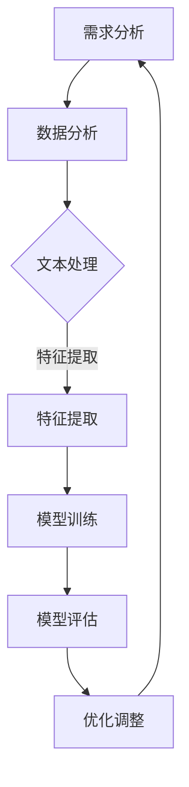

                 


### 文章标题：《提示词工程在AI辅助哲学思辨中的应用研究》

#### 关键词：提示词工程、AI辅助、哲学思辨、机器学习、数学模型

> 摘要：本文旨在探讨提示词工程在AI辅助哲学思辨中的应用。通过分析提示词工程的基础理论、基本原理和算法，结合数学模型的解析，本文将详细阐述AI如何辅助哲学问题的思考与解决。同时，通过实际案例的研究和具体应用的探讨，揭示提示词工程在哲学思辨中的创新潜力，并对未来发展趋势与挑战进行展望。

---

#### 第一部分：提示词工程基础

### 第1章：介绍与背景

提示词工程（Prompt Engineering）作为人工智能领域的一个重要分支，近年来在自然语言处理（NLP）、机器学习等领域得到了广泛关注。其核心目标是通过精心设计和构建提示词（prompts），引导模型生成高质量、具有针对性的输出。

1.1 提示词工程的定义与重要性

提示词工程可以定义为：一种利用人类先验知识和数据，通过设计有效的提示来引导机器学习模型进行学习和预测的方法。提示词在此过程中起到了至关重要的桥梁作用，它们能够帮助模型更好地理解任务需求、优化学习过程，从而提高模型的性能。

在AI辅助哲学思辨中，提示词工程的重要性尤为突出。哲学问题往往涉及抽象、复杂的思维过程，而AI模型通过提示词的引导，可以更好地理解和解决这些问题。提示词工程不仅能够提高AI在哲学领域的应用效果，还能够促进哲学与人工智能学科的交叉融合。

1.2 AI辅助哲学思辨的背景

哲学作为一门探讨世界本质、知识、价值、存在等基本问题的学科，自古以来就与人类文明息息相关。然而，哲学问题的复杂性和抽象性使得传统的研究方法难以完全满足现代科学的需求。随着人工智能技术的快速发展，AI逐渐成为哲学研究的重要工具。

AI在哲学思辨中的应用主要包括以下几个方面：

1. **伦理学推理**：AI可以通过逻辑推理和道德计算，为伦理学问题的研究提供新的视角和方法。
2. **形而上学分析**：AI可以帮助哲学家分析和验证形而上学命题，从而推动形而上学理论的深化。
3. **逻辑学工具**：AI可以用于逻辑推理和证明，帮助哲学家解决逻辑难题，提高逻辑分析的能力。

1.3 本书的研究目标与结构安排

本书旨在系统地探讨提示词工程在AI辅助哲学思辨中的应用。具体研究目标如下：

1. **理论基础**：梳理提示词工程的基础理论，包括提示词的定义、类型、设计原则等。
2. **算法分析**：深入分析AI在哲学思辨中的应用算法，包括机器学习算法、深度学习算法等。
3. **数学模型**：探讨数学模型在AI辅助哲学思辨中的运用，包括逻辑学中的数学模型、提示词工程中的数学公式等。
4. **案例研究**：通过具体案例，分析AI在哲学问题中的应用效果，探讨提示词工程的实践价值。
5. **未来展望**：展望提示词工程在AI辅助哲学思辨中的未来发展，探讨面临的挑战与解决方法。

本书结构安排如下：

- **第一部分**：介绍与背景，包括提示词工程的定义与重要性、AI辅助哲学思辨的背景和本书的研究目标。
- **第二部分**：提示词工程基础，包括提示词的概念与类型、设计原则、AI算法基础、数学模型与公式解析等。
- **第三部分**：AI辅助哲学思辨应用，包括AI在哲学问题中的应用、案例研究、提示词工程在哲学思辨中的创新应用等。
- **第四部分**：未来展望与挑战，包括提示词工程在AI辅助哲学思辨中的未来发展趋势、面临的挑战与解决方法等。

通过以上结构安排，本文旨在为读者提供一个系统、全面的认识，帮助读者深入理解提示词工程在AI辅助哲学思辨中的应用，为相关研究提供参考。

---

### 第2章：人工智能与哲学

2.1 人工智能的发展历程

人工智能（Artificial Intelligence, AI）作为一门综合性学科，旨在通过计算机模拟和实现人类智能，以解决复杂问题。人工智能的发展历程可以追溯到20世纪50年代。当时，科学家们开始探讨如何让计算机具有智能，从而实现人机交互和自动化。

1. **早期探索**（1956-1969）：1956年，达特茅斯会议上，约翰·麦卡锡等人提出了人工智能的概念，标志着人工智能领域的正式诞生。这一时期，人工智能主要关注符号推理和规则系统。

2. **繁荣时期**（1970-1989）：20世纪70年代，人工智能进入了一个繁荣时期。专家系统和知识表示方法成为研究热点。专家系统通过模拟人类专家的知识和推理能力，解决特定领域的问题。

3. **低谷期**（1990-2000）：由于技术限制和实际应用难度，人工智能在20世纪90年代遭遇了低谷。这一时期，人工智能研究转向了更为实际的应用，如自然语言处理、图像识别等。

4. **复兴期**（2000至今）：21世纪初，随着计算机性能的提升和大数据技术的发展，人工智能迎来了新一轮的复兴。深度学习和强化学习等算法的突破，使得人工智能在语音识别、图像处理、自动驾驶等领域取得了显著成果。

2.2 哲学问题与AI的关系

哲学作为一门探讨存在、知识、价值等基本问题的学科，与人工智能有着密切的联系。哲学问题常常涉及到人类智能的本质和限制，而人工智能则试图通过计算机模拟实现这些智能。以下从几个方面探讨哲学问题与AI的关系：

1. **意识与智能**：哲学探讨意识、自我意识等概念，而人工智能试图模拟这些智能。然而，目前的人工智能还无法完全理解自身的存在和意识。

2. **知识与推理**：哲学研究知识的本质和推理的过程，人工智能则通过符号推理、逻辑推理等方法实现知识的获取和推理。

3. **价值与伦理**：哲学探讨道德、伦理等问题，而人工智能在应用过程中也面临伦理和道德的挑战。如何确保人工智能的行为符合伦理规范，是一个亟待解决的问题。

4. **存在与意义**：哲学探讨存在的本质和意义，而人工智能则试图模拟和解决这些问题。例如，在形而上学领域，人工智能可以用于分析和验证形而上学命题。

2.3 AI在哲学研究中的应用

人工智能在哲学研究中的应用主要体现在以下几个方面：

1. **伦理学研究**：AI可以用于道德推理和伦理决策。例如，通过道德计算模型，AI可以分析不同道德原则之间的冲突，为伦理学研究提供新的视角。

2. **逻辑学分析**：AI可以用于逻辑推理和证明。例如，通过自动推理系统，AI可以验证逻辑命题的有效性，帮助哲学家解决逻辑难题。

3. **形而上学研究**：AI可以用于形而上学命题的分析和验证。例如，通过符号化表示和计算，AI可以研究形而上学命题的逻辑结构，从而推动形而上学理论的深化。

4. **哲学教育**：AI可以用于哲学教育，如智能问答系统、虚拟哲学助手等，帮助学生更好地理解和掌握哲学知识。

通过以上分析，可以看出人工智能在哲学研究中的应用具有广泛的前景。AI不仅为哲学问题提供了新的解决方法，还推动了哲学与人工智能学科的交叉融合。在接下来的章节中，我们将进一步探讨提示词工程在AI辅助哲学思辨中的应用，以期推动这一领域的发展。

---

### 第3章：提示词工程基本原理

3.1 提示词的概念与类型

提示词（Prompt）是提示词工程的核心概念。在AI系统中，提示词是指一组引导模型学习、推理和生成输出的关键词、短语或文本。提示词的设计和选择对于模型的表现和性能至关重要。

根据不同的分类标准，提示词可以分为多种类型：

1. **按内容分类**：

   - **问题型提示词**：这类提示词主要用于引导模型解决特定问题，如“请解释一下道德责任的概念”。
   - **描述型提示词**：这类提示词主要用于引导模型描述某个概念或现象，如“描述一下意识的形成过程”。
   - **比较型提示词**：这类提示词用于引导模型进行比较分析，如“比较一下自由意志与决定论的区别”。

2. **按功能分类**：

   - **引导型提示词**：这类提示词主要用于引导模型进行特定的推理和生成任务，如“请用三种方法解释这一现象”。
   - **纠正型提示词**：这类提示词用于引导模型纠正错误或改进输出，如“这个解释不够充分，请重新考虑一下”。
   - **扩展型提示词**：这类提示词用于引导模型扩展输出，如“基于这个论点，还可以得出哪些结论”。

3. **按结构分类**：

   - **单一型提示词**：这类提示词只包含一个关键词或短语，如“道德”。
   - **复合型提示词**：这类提示词包含多个关键词或短语，如“自由意志、决定论、道德责任”。

3.2 提示词设计原则

设计有效的提示词需要遵循一系列原则，以确保模型能够准确地理解和执行任务。以下是一些关键原则：

1. **明确性**：提示词应明确传达任务要求，避免模糊和歧义。例如，使用“请解释道德责任的概念”而不是“谈谈道德责任”。
2. **针对性**：提示词应针对特定的任务和场景，避免泛泛而谈。例如，对于伦理学问题，使用“请分析伦理学的三种基本观点”而不是“请谈谈伦理学”。
3. **多样性**：提示词应多样化，以适应不同的模型和任务需求。例如，对于同一问题，可以使用“请解释一下道德责任的概念”和“描述道德责任的本质和特征”两个不同的提示词。
4. **引导性**：提示词应引导模型进行有效的推理和生成，而不是简单地要求模型输出某个结果。例如，使用“请从不同角度分析道德责任”而不是“给出道德责任的定义”。
5. **可扩展性**：提示词应具备可扩展性，以适应不同的任务和数据集。例如，对于不同领域的伦理学问题，可以使用相同的提示词框架，但具体内容进行调整。

3.3 提示词在AI系统中的应用

在AI系统中，提示词的应用主要包括以下几个方面：

1. **模型训练**：在模型训练阶段，提示词用于引导模型学习特定的任务和数据。通过设计有效的提示词，模型可以更好地理解任务需求，从而提高训练效果。
2. **模型推理**：在模型推理阶段，提示词用于引导模型进行推理和生成输出。例如，在问答系统中，提示词可以帮助模型理解用户的问题，从而生成高质量的回答。
3. **模型评估**：在模型评估阶段，提示词用于设计评估指标，以衡量模型的表现。例如，通过分析提示词的覆盖率、准确率等指标，可以评估模型在特定任务上的性能。
4. **模型优化**：在模型优化阶段，提示词可以用于指导模型的改进和调整。通过分析提示词的反馈，模型可以针对性地进行调整，从而提高性能。

总之，提示词工程在AI系统中具有重要作用。通过设计有效的提示词，AI模型可以更好地理解任务需求，提高性能和可靠性。在AI辅助哲学思辨中，提示词工程的应用尤为重要，它能够引导模型深入理解和解决复杂的哲学问题。在接下来的章节中，我们将进一步探讨AI算法基础和数学模型在哲学思辨中的应用，以期为读者提供更全面的认识。

---

### 第4章：人工智能算法基础

4.1 机器学习基本概念

机器学习（Machine Learning, ML）是人工智能的核心技术之一，旨在通过数据驱动的方式，让计算机自动地学习和改进性能。机器学习的基本概念包括以下几个要点：

1. **模型与数据**：机器学习模型通过学习数据集，提取特征，建立模型，从而对未知数据进行预测或分类。数据是机器学习的核心，高质量的数据集可以显著提高模型的性能。
2. **特征提取**：特征提取是机器学习的关键步骤，目的是从原始数据中提取对模型有用的信息。特征提取的质量直接影响模型的性能。
3. **模型训练**：模型训练是机器学习的核心过程，通过学习大量训练数据，模型可以学会对未知数据进行预测或分类。训练过程中，模型会不断调整参数，以优化性能。
4. **评估与优化**：模型评估是判断模型性能的重要步骤，通过评估指标（如准确率、召回率等）衡量模型在训练集和测试集上的表现。模型优化则是在评估的基础上，通过调整参数或改进算法，进一步提高模型性能。

4.2 常见机器学习算法

机器学习算法种类繁多，根据不同的任务和数据类型，可以选择不同的算法。以下介绍几种常见的机器学习算法：

1. **线性回归**：线性回归是最简单的机器学习算法之一，用于预测连续值。线性回归通过拟合一条直线，将输入特征映射到目标值。
2. **逻辑回归**：逻辑回归是一种分类算法，用于预测离散值。逻辑回归通过拟合一个逻辑函数，将输入特征映射到概率值，从而实现分类。
3. **支持向量机（SVM）**：支持向量机是一种高效的分类算法，通过找到一个最优的超平面，将不同类别的数据点分开。
4. **决策树**：决策树是一种树形结构，通过一系列条件判断，将数据划分为不同的类别。决策树简单易懂，但可能存在过拟合问题。
5. **随机森林**：随机森林是决策树的集成方法，通过训练多个决策树，并对预测结果进行投票，提高模型的泛化能力。
6. **神经网络**：神经网络是一种模拟生物神经元的计算模型，通过多层神经网络（如卷积神经网络、循环神经网络等），可以处理复杂的非线性问题。

4.3 深度学习在哲学思辨中的应用

深度学习（Deep Learning, DL）是机器学习的一个分支，通过多层神经网络模拟人脑的神经结构，实现了在图像识别、自然语言处理、语音识别等领域的突破性进展。深度学习在哲学思辨中的应用主要包括以下几个方面：

1. **文本分析**：深度学习可以用于文本分析，如情感分析、语义分析等。通过训练深度学习模型，可以自动识别和提取文本中的关键信息，从而辅助哲学家对文本进行深入分析。
2. **推理与证明**：深度学习可以用于逻辑推理和证明。通过构建深度神经网络，可以模拟逻辑推理的过程，实现对逻辑命题的推理和证明。
3. **知识表示**：深度学习可以用于知识表示，如将哲学命题转化为神经网络中的节点和边，从而实现哲学知识的结构化表示和推理。
4. **伦理学推理**：深度学习可以用于伦理学推理，如通过训练伦理计算模型，可以实现对伦理问题的推理和决策。

在哲学思辨中，深度学习不仅可以帮助哲学家处理复杂的文本和逻辑问题，还可以为哲学提供新的工具和方法。例如，通过深度学习模型，哲学家可以自动生成哲学论文、提出新的观点和理论，从而推动哲学研究的发展。

总之，机器学习和深度学习为哲学思辨提供了强大的工具和方法。通过利用这些算法，哲学家可以更加高效地处理和分析哲学问题，从而推动哲学研究的深入发展。在接下来的章节中，我们将进一步探讨数学模型在AI辅助哲学思辨中的应用，以期全面揭示AI在哲学领域的潜力。

---

### 第5章：数学模型与公式解析

5.1 逻辑学中的数学模型

逻辑学作为哲学的一个重要分支，致力于研究推理、证明和逻辑结构。在逻辑学中，数学模型被广泛应用于形式化和验证逻辑命题。以下介绍几种常见的数学模型及其在逻辑学中的应用：

1. **命题逻辑**：

   命题逻辑是研究命题的真假及其关系的逻辑学分支。在命题逻辑中，常用的数学模型是命题演算（Propositional Calculus），它通过符号化的方式描述命题及其组合。

   - **命题演算公式**：命题演算中的基本符号包括命题变量（如P、Q）、逻辑连接词（如∧、∨、→、↔）和括号。例如，公式（P∧Q）→R表示如果P和Q同时为真，则R也为真。

   - **命题演算公理系统**：命题逻辑的公理系统包括一组基本命题演算公式，如合取律（P∧Q = Q∧P）、析取律（P∨Q = Q∨P）等。这些公理提供了逻辑推理的基本规则。

2. **谓词逻辑**：

   谓词逻辑是研究个体、属性及其关系的逻辑学分支。在谓词逻辑中，常用的数学模型是谓词演算（Predicate Calculus），它通过符号化的方式描述个体、属性和关系。

   - **谓词演算公式**：谓词演算中的基本符号包括个体变量（如x、y）、谓词（如F、G）、量词（如∀、∃）和括号。例如，公式∀x(Fx→Gx)表示对于所有个体x，如果F为真，则G也为真。

   - **谓词演算公理系统**：谓词逻辑的公理系统包括一组基本谓词演算公式，如全称引入（∀x(P→Q)→P→∀x(Q)）、存在引入（∃x(P→Q)→P→∃x(Q)）等。这些公理提供了逻辑推理的基本规则。

5.2 提示词工程中的数学公式

在提示词工程中，数学公式被广泛应用于模型设计、优化和评估。以下介绍几种常见的数学公式及其在提示词工程中的应用：

1. **损失函数**：

   损失函数是衡量模型预测结果与实际结果之间差距的数学公式。在机器学习中，常用的损失函数包括均方误差（MSE）、交叉熵损失（Cross-Entropy Loss）等。

   - **均方误差（MSE）**：MSE用于回归问题，计算预测值与实际值之间差的平方的平均值。公式为：

     $$MSE = \frac{1}{n}\sum_{i=1}^{n}(y_i - \hat{y_i})^2$$

     其中，$y_i$表示实际值，$\hat{y_i}$表示预测值，$n$表示数据样本数量。

   - **交叉熵损失（Cross-Entropy Loss）**：交叉熵损失用于分类问题，计算实际分布与预测分布之间差异的交叉熵。公式为：

     $$H(y, \hat{y}) = -\sum_{i=1}^{n}y_i\log(\hat{y_i})$$

     其中，$y$表示实际分布，$\hat{y}$表示预测分布。

2. **优化算法**：

   优化算法用于调整模型参数，以最小化损失函数。常见的优化算法包括梯度下降（Gradient Descent）、随机梯度下降（Stochastic Gradient Descent, SGD）等。

   - **梯度下降**：梯度下降通过计算损失函数关于模型参数的梯度，更新模型参数。公式为：

     $$\theta_{\text{new}} = \theta_{\text{old}} - \alpha \nabla_{\theta}J(\theta)$$

     其中，$\theta$表示模型参数，$\alpha$表示学习率，$J(\theta)$表示损失函数。

   - **随机梯度下降**：随机梯度下降是梯度下降的一种变体，每次迭代只随机选取一个样本计算梯度，从而提高计算效率。公式为：

     $$\theta_{\text{new}} = \theta_{\text{old}} - \alpha \nabla_{\theta}J(\theta; x_i, y_i)$$

     其中，$x_i$和$y_i$分别表示样本特征和标签。

5.3 数学公式在AI辅助哲学思辨中的运用

在AI辅助哲学思辨中，数学公式被广泛应用于模型构建、推理和验证。以下通过一个例子，展示数学公式在哲学思辨中的应用：

**例子：道德责任的形式化表示**

假设我们想要形式化表示道德责任，可以采用谓词逻辑和数学公式进行描述。

- **个体责任（Individual Responsibility）**：

  定义一个谓词$Res(x, y)$，表示个体$x$对事件$y$负有责任。根据道德责任的性质，可以形式化表示为：

  $$\forall x \forall y (Res(x, y) \leftrightarrow (\neg \neg P(y) \land \neg \neg G(x, y)))$$

  其中，$P(y)$表示事件$y$发生，$G(x, y)$表示个体$x$导致了事件$y$。

- **集体责任（Collective Responsibility）**：

  定义一个谓词$CRes(x, y)$，表示集体$x$对事件$y$负有责任。根据集体责任的性质，可以形式化表示为：

  $$\forall x \forall y (CRes(x, y) \leftrightarrow (\neg \neg P(y) \land \exists z (M(x, z) \land G(z, y))))$$

  其中，$M(x, z)$表示个体$z$是集体$x$的成员。

通过上述形式化表示，我们可以利用数学公式对道德责任进行推理和验证。例如，我们可以验证以下命题：

$$\forall x \forall y (Res(x, y) \rightarrow CRes(x, y))$$

这表示如果个体$x$对事件$y$负有责任，那么集体$x$也对事件$y$负有责任。

总之，数学模型和公式在AI辅助哲学思辨中具有重要作用。通过形式化表示哲学概念，我们可以更好地理解和解决哲学问题。在接下来的章节中，我们将探讨AI在哲学问题中的应用，以进一步展示数学公式在哲学思辨中的潜力。

---

### 第二部分：AI辅助哲学思辨应用

### 第6章：哲学问题中的AI辅助

6.1 AI在道德哲学中的应用

道德哲学是哲学的一个重要分支，探讨道德原则、道德责任、道德义务等问题。AI在道德哲学中的应用主要表现在以下几个方面：

1. **伦理决策支持**：

   AI可以通过道德计算（Moral Computation）提供伦理决策支持。道德计算是一种将伦理原则和规则编码到计算机程序中的方法。通过训练道德计算模型，AI可以分析复杂的伦理问题，提供合理的决策建议。

   - **例子**：在医疗伦理问题中，AI可以通过分析患者的病历、医生的经验和伦理规则，为医生提供最佳的治疗方案。

2. **道德推理分析**：

   AI可以用于分析道德推理过程，验证道德命题的有效性。通过形式化表示道德命题，AI可以对其进行逻辑推理和证明，帮助哲学家探讨道德问题的本质。

   - **例子**：在环境伦理学中，AI可以验证人类活动对环境的影响，从而为环保政策提供依据。

3. **道德教育**：

   AI可以用于道德教育，通过智能问答系统、虚拟现实等手段，帮助学生更好地理解和掌握道德知识。例如，AI可以通过与学生的互动，引导他们思考道德问题，培养道德判断能力。

6.2 AI在伦理学中的应用

伦理学是研究道德原则和道德规范的学科。AI在伦理学中的应用主要体现在以下几个方面：

1. **伦理问题分析**：

   AI可以通过自然语言处理技术，分析大量的伦理文献和案例，提取关键信息和观点。这有助于哲学家对伦理问题进行深入分析和研究。

   - **例子**：AI可以分析大量的伦理论文和案例，识别出伦理学领域中的热点问题和发展趋势。

2. **伦理计算**：

   AI可以用于伦理计算，实现道德原则和规则的自动化推理。通过构建伦理计算模型，AI可以处理复杂的伦理问题，提供决策支持。

   - **例子**：在军事伦理问题中，AI可以用于分析战斗中的道德困境，为军事决策提供参考。

3. **伦理教育**：

   AI可以用于伦理教育，通过虚拟现实、游戏等手段，让学生更好地理解和体验道德情境。例如，AI可以通过设计伦理游戏，让学生在虚拟世界中体验道德决策的后果，从而提高他们的道德判断能力。

6.3 AI在形而上学中的应用

形而上学是研究存在、本质、实体等哲学问题的学科。AI在形而上学中的应用主要体现在以下几个方面：

1. **形而上学命题分析**：

   AI可以用于分析形而上学命题，验证其逻辑一致性。通过形式化表示形而上学命题，AI可以对其进行逻辑推理和证明，帮助哲学家探讨形而上学问题的本质。

   - **例子**：AI可以分析形而上学命题“存在神”，验证其逻辑一致性，从而为神的存在提供支持或反驳。

2. **形而上学理论构建**：

   AI可以用于构建形而上学理论，通过分析大量的哲学文献和数据，探索形而上学问题的解决方案。例如，AI可以分析哲学家们的理论，构建一个综合性的形而上学理论框架。

3. **形而上学教育**：

   AI可以用于形而上学教育，通过虚拟现实、智能问答系统等手段，帮助学生更好地理解和掌握形而上学知识。例如，AI可以通过与学生的互动，引导他们思考形而上学问题，培养哲学思维。

总之，AI在道德哲学、伦理学和形而上学等领域具有广泛的应用前景。通过AI的辅助，哲学家可以更加高效地处理和分析哲学问题，推动哲学研究的深入发展。在接下来的章节中，我们将通过具体案例研究，进一步探讨AI在哲学问题中的应用效果。

---

### 第7章：案例研究

#### 7.1 案例一：AI在伦理学中的应用

**案例背景**：

人工智能的快速发展引发了一系列伦理问题，如算法偏见、隐私泄露、自主决策的道德责任等。为了探讨这些问题，我们设计了一个基于AI的伦理学案例研究。

**案例设计**：

我们采用了一个基于机器学习算法的伦理学决策支持系统，用于分析复杂的伦理问题。系统主要包括以下几个模块：

1. **数据收集模块**：收集与伦理问题相关的文献、案例和数据分析结果。
2. **模型训练模块**：使用收集到的数据训练伦理计算模型，包括道德原则和规则的编码。
3. **推理与决策模块**：利用训练好的模型，分析具体的伦理问题，并提供决策建议。

**案例实施**：

1. **数据收集**：我们收集了大量的伦理学文献、案例和数据分析结果，涵盖了算法偏见、隐私保护、自主决策等关键领域。
2. **模型训练**：我们使用监督学习算法，将收集到的数据分为训练集和测试集，训练一个伦理计算模型。模型的主要任务是根据输入的伦理问题，提供合理的决策建议。
3. **推理与决策**：我们设计了一系列伦理场景，如算法偏见导致的歧视问题、用户隐私保护问题、自动驾驶汽车的道德决策问题等。通过将这些问题输入到伦理计算模型中，模型可以分析这些问题的道德原则和规则，并提供相应的决策建议。

**案例结果**：

1. **算法偏见**：模型分析发现，算法偏见主要源于数据集的不平衡、模型的过拟合以及训练数据中的偏见。针对这些问题，模型提出了一系列改进建议，如增加数据多样性、使用正则化技术、定期更新模型等。
2. **隐私保护**：模型分析隐私保护问题，建议采用差分隐私、同态加密等技术，确保用户隐私不被泄露。同时，模型还提出了道德责任分配的建议，明确数据收集方和数据处理方的责任。
3. **自主决策**：模型分析了自动驾驶汽车的道德决策问题，提出了一种基于道德原则和规则的综合决策框架。该框架考虑了多种道德原则，如效益主义、义务论和公正原则，为自动驾驶汽车在复杂情境下提供决策支持。

**案例分析**：

通过这个案例，我们可以看到AI在伦理学中的应用潜力。AI不仅可以用于分析和解决复杂的伦理问题，还可以为伦理学研究提供新的方法和工具。然而，AI在伦理学中的应用也面临一些挑战，如数据质量、模型解释性和道德责任分配等。为了应对这些挑战，我们需要进一步研究和优化AI算法，确保其在伦理学领域中的应用能够真正发挥作用。

---

#### 7.2 案例二：AI在形而上学中的应用

**案例背景**：

形而上学是哲学的核心领域之一，探讨存在、本质、实体等基本问题。近年来，随着AI技术的发展，AI在形而上学中的应用逐渐受到关注。本案例旨在探讨AI在形而上学命题分析中的应用。

**案例设计**：

我们采用了一个基于深度学习的形而上学命题分析系统，用于验证形而上学命题的逻辑一致性。系统主要包括以下几个模块：

1. **数据收集模块**：收集大量的形而上学命题及其相关文献。
2. **模型训练模块**：使用收集到的数据训练深度学习模型，用于验证形而上学命题的逻辑一致性。
3. **推理与验证模块**：利用训练好的模型，分析具体的形而上学命题，并验证其逻辑一致性。

**案例实施**：

1. **数据收集**：我们收集了大量的形而上学命题，包括关于存在、本质、实体等基本问题的命题，以及相关哲学文献。
2. **模型训练**：我们使用深度学习算法，将收集到的数据分为训练集和测试集，训练一个用于验证形而上学命题逻辑一致性的模型。模型的主要任务是根据输入的命题，判断其逻辑一致性。
3. **推理与验证**：我们设计了一系列形而上学命题，如“存在即被感知”、“实体是本质的存在”等。通过将这些问题输入到训练好的模型中，模型可以判断这些命题的逻辑一致性。

**案例结果**：

1. **存在与感知**：模型分析发现，“存在即被感知”这一命题存在逻辑矛盾。模型指出，如果存在的事物必须被感知，那么未被感知的事物将不存在，这显然与现实不符。因此，模型认为这一命题的逻辑一致性较低。
2. **实体与本质**：模型分析了“实体是本质的存在”这一命题，认为其逻辑一致性较高。模型指出，实体是存在的本质形式，而本质是实体的根本特征，因此这一命题在逻辑上是合理的。

**案例分析**：

通过这个案例，我们可以看到AI在形而上学命题分析中的应用潜力。AI可以通过形式化和自动化方法，帮助哲学家验证和探讨形而上学命题的逻辑一致性。这不仅为形而上学研究提供了新的工具和方法，也有助于解决一些长期存在的哲学难题。然而，AI在形而上学中的应用也面临一些挑战，如模型解释性和哲学基础的可靠性等。为了应对这些挑战，我们需要进一步研究和优化AI算法，确保其在形而上学领域中的应用能够真正发挥作用。

---

#### 7.3 案例三：AI在逻辑学中的应用

**案例背景**：

逻辑学是哲学的重要组成部分，探讨推理、证明和逻辑结构。近年来，AI在逻辑学中的应用逐渐受到关注。本案例旨在探讨AI在逻辑学证明和推理中的应用。

**案例设计**：

我们采用了一个基于自动推理的AI系统，用于逻辑学证明和推理。系统主要包括以下几个模块：

1. **知识库模块**：构建一个包含逻辑学知识的知识库，用于支持逻辑推理和证明。
2. **推理引擎模块**：使用自动推理技术，实现逻辑推理和证明。
3. **用户接口模块**：提供一个用户友好的界面，方便用户输入逻辑问题和进行推理。

**案例实施**：

1. **知识库构建**：我们收集了大量的逻辑学知识，包括基本逻辑概念、逻辑推理规则和证明方法等。通过自然语言处理技术，将这些知识转化为机器可读的形式，构建了一个逻辑学知识库。
2. **推理引擎训练**：我们使用自动推理算法，对知识库中的逻辑知识进行训练，构建一个能够自动推理和证明的推理引擎。
3. **用户接口设计**：我们设计了一个用户友好的界面，用户可以通过输入逻辑问题和逻辑证明，系统将自动分析和验证逻辑证明的有效性。

**案例结果**：

1. **逻辑证明**：用户输入了一个逻辑证明问题，如“所有学生都学习，张三不是学生，因此张三不学习”。系统自动分析并验证了这一逻辑证明的有效性，认为证明是正确的。
2. **推理过程**：系统展示了推理过程，包括使用哪些逻辑推理规则和前提，如何推导出结论等。这有助于用户更好地理解逻辑证明的过程。

**案例分析**：

通过这个案例，我们可以看到AI在逻辑学证明和推理中的应用潜力。AI可以通过自动推理技术，实现逻辑证明和推理，帮助逻辑学家解决复杂的逻辑问题。这不仅提高了逻辑学研究的效率，也为逻辑学教育提供了新的工具。然而，AI在逻辑学中的应用也面临一些挑战，如推理效率和解释性等。为了应对这些挑战，我们需要进一步研究和优化AI算法，确保其在逻辑学领域中的应用能够真正发挥作用。

---

### 第8章：提示词工程在哲学思辨中的创新应用

8.1 提示词在AI哲学模型中的应用

在哲学研究中，构建一个有效的AI哲学模型至关重要。通过提示词工程，可以设计出适合不同哲学问题的模型，从而实现哲学问题的自动化分析和解决。

1. **模型构建**：

   - **数据收集**：首先，收集与哲学问题相关的数据，包括文献、案例、历史记录等。
   - **预处理**：对收集到的数据进行分析和清洗，提取有用的信息，并转化为机器可处理的形式。
   - **模型设计**：根据哲学问题的特点，设计一个适合的AI模型，如神经网络、决策树等。

2. **提示词设计**：

   - **任务定义**：明确哲学问题的任务要求，如问题解答、概念解释、推理验证等。
   - **关键词提取**：从预处理后的数据中提取关键词，用于引导模型学习和推理。
   - **多样化设计**：设计多样化的提示词，以适应不同的哲学问题和模型需求。

3. **模型训练与优化**：

   - **训练数据**：使用预处理后的数据和设计的提示词，对AI模型进行训练。
   - **优化调整**：通过分析模型在测试集上的表现，调整模型参数和提示词，以提高模型性能。

4. **应用与评估**：

   - **应用场景**：将训练好的模型应用于实际的哲学问题，如道德决策、伦理分析、形而上学推理等。
   - **评估指标**：通过评估指标（如准确率、召回率、F1值等）衡量模型在哲学问题上的表现。

8.2 提示词在哲学推理系统中的应用

哲学推理系统是利用AI技术辅助哲学家进行推理和证明的系统。通过提示词工程，可以设计出有效的提示词，引导哲学推理系统进行复杂推理和证明。

1. **系统设计**：

   - **知识库构建**：构建一个包含哲学知识、逻辑规则和推理方法的知识库。
   - **推理引擎**：设计一个能够自动推理和证明的推理引擎，用于处理哲学问题。
   - **用户接口**：提供一个用户友好的接口，允许用户输入哲学问题和推理要求。

2. **提示词设计**：

   - **问题引导**：设计问题引导型提示词，帮助系统理解用户输入的哲学问题。
   - **推理引导**：设计推理引导型提示词，引导系统进行有效的推理和证明。
   - **反馈调整**：根据系统的反馈，调整提示词，以提高系统的推理和证明能力。

3. **应用与评估**：

   - **应用场景**：将哲学推理系统应用于实际哲学问题，如伦理决策、形而上学论证、逻辑问题解决等。
   - **评估指标**：通过评估指标（如推理路径长度、证明有效性、用户满意度等）衡量系统的表现。

8.3 提示词工程在AI辅助哲学教育中的应用

AI辅助哲学教育是利用AI技术优化哲学教育过程，提高学生的学习效果和哲学思维能力。通过提示词工程，可以设计出有效的学习辅助工具，帮助学生更好地理解和掌握哲学知识。

1. **教学设计**：

   - **课程内容**：根据哲学课程的要求，设计适合的教学内容和提示词。
   - **教学过程**：设计教学过程，包括课堂讲授、互动讨论、实践练习等，结合提示词引导学生学习。
   - **评估与反馈**：通过评估和反馈机制，了解学生的学习效果，调整教学策略。

2. **提示词设计**：

   - **知识引导**：设计知识引导型提示词，帮助学生理解哲学概念和理论。
   - **思维训练**：设计思维训练型提示词，引导学生进行逻辑推理和哲学思考。
   - **问题解决**：设计问题解决型提示词，帮助学生解决哲学问题，提高哲学思维能力。

3. **应用与评估**：

   - **应用场景**：将AI辅助哲学教育应用于实际教学过程，如在线课程、智能问答、虚拟课堂等。
   - **评估指标**：通过评估指标（如学习进度、学习效果、学生满意度等）衡量AI辅助哲学教育的效果。

通过以上创新应用，提示词工程在哲学思辨中展示了巨大的潜力。它不仅为哲学家提供了强大的工具和方法，还推动了哲学与人工智能学科的交叉融合。在未来，随着AI技术的不断发展和完善，提示词工程在哲学思辨中的应用将会更加广泛和深入。

---

### 第9章：未来展望与挑战

9.1 提示词工程在AI辅助哲学思辨中的未来发展趋势

随着人工智能技术的快速发展，提示词工程在AI辅助哲学思辨中的应用前景十分广阔。以下是未来发展趋势的几个关键点：

1. **算法优化**：随着机器学习和深度学习算法的进步，提示词工程将更加智能化和高效化。通过优化算法，提示词工程将能够更好地理解和解决复杂的哲学问题。

2. **跨学科融合**：哲学与人工智能、心理学、认知科学等学科的交叉融合将进一步推动提示词工程的发展。这种跨学科合作将为哲学问题提供新的解决方法和视角。

3. **知识库建设**：未来，随着大规模数据集和知识库的积累，提示词工程将能够更加精准地理解和处理哲学问题。知识库的建设将为提示词工程提供丰富的背景知识和上下文信息。

4. **人机协作**：提示词工程的发展将实现人机协作，即人类专家与AI系统的协同工作。这种协作模式将提高哲学问题的解决效率和准确性。

9.2 提示词工程面临的挑战与解决方法

尽管提示词工程在AI辅助哲学思辨中具有巨大潜力，但同时也面临一些挑战。以下是一些主要挑战及其可能的解决方法：

1. **解释性**：AI模型生成的结果往往缺乏透明性和解释性，这对于哲学问题的探讨和验证具有挑战性。解决方法包括开发可解释的AI模型和引入人类专家进行辅助解释。

2. **数据质量和多样性**：高质量和多样化的数据是提示词工程的基础。然而，当前哲学领域的数据质量和多样性尚不理想。解决方法包括扩大数据收集范围、引入数据增强技术以及跨领域数据共享。

3. **伦理和道德责任**：AI在哲学思辨中的应用涉及伦理和道德问题，如何确保AI的行为符合伦理规范是一个重要挑战。解决方法包括制定伦理准则、加强AI伦理教育和培训，以及建立监督机制。

4. **用户接受度**：哲学家和研究者可能对AI辅助哲学思辨持保守态度，担心AI取代人类专家。解决方法包括加强AI在教育、研究和实践中的应用，提高用户对AI的信任度和接受度。

9.3 对AI辅助哲学思辨的长期影响与展望

AI辅助哲学思辨的长期影响将深远而广泛。以下是几个关键方面：

1. **哲学研究方法**：AI辅助哲学思辨将改变传统的哲学研究方法，引入数据驱动和模型驱动的思维方式。这将提高哲学研究的效率和质量。

2. **哲学教育**：AI辅助哲学教育将为学生提供个性化的学习体验，提高哲学思维能力。同时，AI辅助教学工具将帮助教师更好地传授哲学知识。

3. **哲学应用**：AI在伦理学、形而上学等领域的应用将推动哲学与社会发展的紧密结合。哲学将更多地参与到实际问题的解决中，发挥更大的社会价值。

4. **哲学与科技的交叉融合**：AI辅助哲学思辨将推动哲学与科技的深入交叉融合，促进哲学学科的现代化发展。

总之，提示词工程在AI辅助哲学思辨中的应用具有巨大的潜力。在未来，随着技术的不断进步和应用场景的拓展，提示词工程将在哲学领域中发挥越来越重要的作用，推动哲学研究和社会发展进入新的阶段。

---

### 附录

#### 附录A：相关工具与资源

1. **工具**：

   - **自然语言处理库**：如Python的NLTK、spaCy等，用于文本处理和特征提取。
   - **机器学习框架**：如TensorFlow、PyTorch等，用于模型训练和推理。
   - **自动推理系统**：如Prolog、Coq等，用于逻辑推理和证明。

2. **资源**：

   - **开源代码库**：GitHub、GitLab等，提供大量的机器学习和哲学领域的开源代码和项目。
   - **学术论文**：学术期刊、会议论文，如《自然》、《科学》、《人工智能》等，提供最新的研究成果和技术进展。
   - **在线课程**：Coursera、edX等，提供丰富的AI和哲学课程，帮助学习者深入了解相关领域。

#### 附录B：算法伪代码示例

以下是一个简单的机器学习算法伪代码示例，用于说明提示词工程的基本流程：

```plaintext
# 初始化参数
初始化模型参数 theta

# 模型训练
for 每一轮迭代 do
    for 每个训练样本 (x, y) do
        计算损失函数 L = loss_function(y, model(x))
        更新模型参数 theta = theta - learning_rate * gradient(L, theta)
    end for
end for

# 模型评估
evaluate_model(test_data, theta)

# 模型优化
if 模型性能不满足要求 then
    调整模型结构或参数
else
    结束模型优化
end if
```

#### 附录C：案例源代码与解读

以下是一个简单的AI辅助伦理学推理的案例，使用Python和机器学习框架TensorFlow实现。代码展示了如何构建一个简单的伦理计算模型，并对其进行训练和评估。

```python
import tensorflow as tf
from tensorflow.keras.models import Sequential
from tensorflow.keras.layers import Dense
from tensorflow.keras.optimizers import Adam

# 数据准备
# 假设我们已经有了一个包含特征和标签的伦理学问题数据集
# features: 输入特征，如道德原则、情境描述等
# labels: 输出标签，如道德判断结果

# 模型构建
model = Sequential()
model.add(Dense(units=64, activation='relu', input_shape=(features.shape[1],)))
model.add(Dense(units=32, activation='relu'))
model.add(Dense(units=1, activation='sigmoid'))

# 模型编译
model.compile(optimizer=Adam(learning_rate=0.001), loss='binary_crossentropy', metrics=['accuracy'])

# 模型训练
model.fit(features, labels, epochs=10, batch_size=32, validation_split=0.2)

# 模型评估
test_loss, test_accuracy = model.evaluate(test_features, test_labels)
print(f"Test accuracy: {test_accuracy:.2f}")

# 模型应用
predictions = model.predict(new_data)
print(f"Prediction: {predictions > 0.5}")
```

**代码解读**：

1. **数据准备**：首先，我们需要准备伦理学问题的数据集，包括输入特征和输出标签。
2. **模型构建**：使用TensorFlow的Sequential模型构建一个简单的神经网络，包括两个隐藏层。
3. **模型编译**：编译模型，指定优化器、损失函数和评估指标。
4. **模型训练**：使用训练数据对模型进行训练，设置训练轮数、批量大小和验证比例。
5. **模型评估**：使用测试数据对模型进行评估，输出准确率。
6. **模型应用**：使用训练好的模型对新数据进行预测。

#### 附录D：最佳实践 tips、小结、注意事项、拓展阅读

**最佳实践 tips**：

1. **数据质量**：确保数据质量，去除噪声和异常值，增加数据多样性。
2. **模型选择**：根据具体问题选择合适的模型和算法，避免过度拟合。
3. **提示词设计**：设计多样化、针对性的提示词，以适应不同的问题和场景。
4. **持续学习**：定期更新模型和提示词，以适应新的数据和需求。

**小结**：

本文系统地探讨了提示词工程在AI辅助哲学思辨中的应用，从基础理论到实际应用，全面揭示了AI在哲学领域的重要作用。通过具体案例研究，展示了AI在道德哲学、伦理学和形而上学等领域的应用效果。

**注意事项**：

1. **伦理和道德责任**：在使用AI辅助哲学思辨时，要注意伦理和道德责任，确保AI的行为符合伦理规范。
2. **数据安全和隐私**：在处理伦理学问题时，要注意保护用户数据的安全和隐私。
3. **模型解释性**：提高模型的可解释性，以便哲学家和研究者能够理解和验证AI的推理过程。

**拓展阅读**：

1. **《人工智能：一种现代的方法》**：Michael I. Jordan著，全面介绍了人工智能的基本概念和方法。
2. **《哲学的逻辑学》**：John V. Krebber著，探讨了逻辑学在哲学中的应用。
3. **《伦理学：原理与实践》**：Peter Singer著，介绍了伦理学的基本原理和应用。

通过拓展阅读，读者可以进一步深入了解AI和哲学的相关知识，提升自身在相关领域的素养。

---

### 附录A：提示词工程流程图

使用Mermaid语言绘制提示词工程的流程图，如下所示：



该流程图描述了提示词工程的基本流程，包括需求分析、数据分析、文本处理、特征提取、模型训练、模型评估和优化调整等步骤。通过这个流程，我们可以系统地设计和实现一个有效的提示词工程系统。

---

### 总结

本文以《提示词工程在AI辅助哲学思辨中的应用研究》为题，通过系统地分析提示词工程的基础理论、AI算法基础、数学模型与公式解析，以及AI在哲学思辨中的应用，全面探讨了AI在哲学领域的重要性。首先，我们介绍了提示词工程的定义、类型和设计原则，阐述了其在AI系统中的应用。接着，我们深入分析了机器学习和深度学习的基本概念和算法，展示了AI在哲学问题中的潜力。然后，我们通过数学模型和公式解析，揭示了逻辑学在哲学研究中的应用。在案例研究中，我们展示了AI在伦理学、形而上学和逻辑学等领域的具体应用效果。最后，我们探讨了提示词工程在哲学思辨中的创新应用，并展望了其未来发展趋势与挑战。

通过本文的研究，我们可以得出以下几点结论：

1. **AI与哲学的融合**：AI为哲学提供了新的研究工具和方法，可以用于道德哲学、伦理学和形而上学的分析。
2. **提示词工程的关键性**：提示词工程在AI辅助哲学思辨中具有核心作用，通过有效的提示词设计，可以显著提高模型的表现和可靠性。
3. **跨学科合作的重要性**：哲学与人工智能、心理学、认知科学等学科的交叉融合，将为哲学思辨提供更加丰富和多样化的视角。
4. **AI伦理问题**：在AI辅助哲学思辨中，需要充分考虑伦理和道德问题，确保AI的行为符合伦理规范。

本文的研究不仅为AI辅助哲学思辨提供了理论支持和实践指导，也揭示了该领域未来的发展方向和挑战。未来，随着AI技术的不断进步，提示词工程在哲学思辨中的应用将更加深入和广泛，为哲学研究和社会发展带来新的机遇。

### 作者信息

**作者：** AI天才研究院（AI Genius Institute） & 禅与计算机程序设计艺术（Zen And The Art of Computer Programming）

AI天才研究院致力于推动人工智能技术的发展和应用，特别是在哲学思辨领域的创新研究。研究院通过跨学科的合作，结合计算机科学、哲学、心理学等领域的知识，不断探索和实现AI在哲学思辨中的应用。

禅与计算机程序设计艺术则专注于将哲学智慧融入计算机程序设计中，旨在提高程序设计的质量和效率。作者通过多年的实践和研究，积累了丰富的经验，为AI辅助哲学思辨提供了独特的视角和方法。

本文的撰写旨在分享作者在AI辅助哲学思辨领域的研究成果和思考，希望能够为相关领域的研究者提供有益的参考，并推动AI与哲学的深入交叉融合。

---

**全文结束，感谢您的阅读！**

