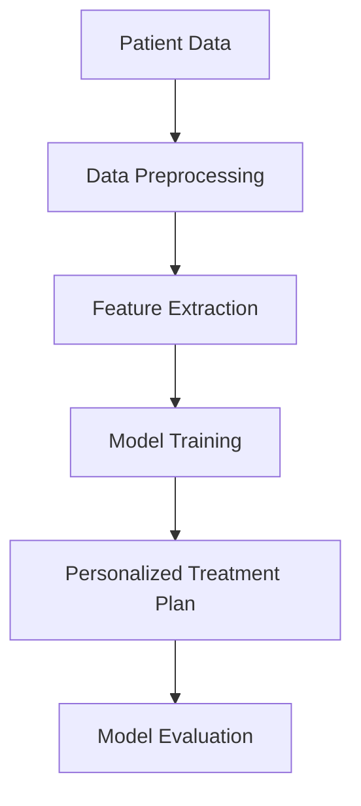

                 

### Step 1: Introduction to Prompt Engineering

Prompt Engineering is an emerging field that focuses on creating and optimizing input prompts for artificial intelligence (AI) systems, particularly for language models. A prompt is a set of instructions or questions given to an AI model to guide its output or behavior. In the context of personalized medical treatment, prompt engineering plays a crucial role in shaping the model's responses to patient-specific data, leading to more accurate and tailored treatment plans.

### Step 2: The Role of Prompt Engineering in Personalized Medical Treatment

Personalized medical treatment involves tailoring medical care to the individual characteristics of each patient, including genetic makeup, lifestyle, and environmental factors. This approach aims to improve treatment outcomes and reduce adverse effects. However, the complexity and variability of medical data pose significant challenges in developing effective personalized treatment plans. Prompt Engineering addresses these challenges by providing a structured approach to guiding AI models in processing and interpreting this data.

### Step 3: Core Concepts and Relationships

To understand the application of Prompt Engineering in personalized medical treatment, it's essential to grasp the core concepts and their interrelationships. Here's a simplified Mermaid flowchart illustrating these connections:

In this flowchart:
- **Patient Data** represents the raw data collected from various medical sources, such as electronic health records, lab tests, and medical images.
- **Data Preprocessing** involves cleaning, normalizing, and structuring the data to be suitable for further analysis.
- **Feature Extraction** focuses on identifying relevant characteristics from the preprocessed data that can be used to train the AI model.
- **Model Training** is the process of training the AI model using the extracted features to predict personalized treatment outcomes.
- **Personalized Treatment Plan** is the output generated by the model, which is tailored to the individual patient's needs.
- **Model Evaluation** assesses the performance of the trained model and iterates the process if necessary.

### Step 4: Methods and Algorithms in Prompt Engineering

The success of Prompt Engineering in personalized medical treatment relies on the choice of appropriate methods and algorithms. Here's a high-level overview of some key methods and algorithms:

- **Natural Language Processing (NLP)**: NLP techniques are used to process and understand human language data, enabling the integration of medical text into the AI model.
- **Machine Learning Algorithms**: Algorithms such as decision trees, support vector machines, and neural networks are used to train models based on patient data.
- **Reinforcement Learning**: This method is particularly useful for optimizing treatment plans over time by learning from feedback and adjusting the plan accordingly.

### Step 5: Data Preparation and Management

Effective data preparation and management are crucial for Prompt Engineering in personalized medical treatment. This involves:

- **Data Cleaning**: Removing errors, inconsistencies, and missing values from the data.
- **Data Integration**: Combining data from various sources to create a comprehensive patient profile.
- **Data Standardization**: Ensuring that all data is in a consistent format for model training.

### Step 6: System Architecture and Implementation

A robust system architecture is essential for implementing Prompt Engineering in personalized medical treatment. This typically includes:

- **Data Ingestion Layer**: Handles the collection and storage of patient data.
- **Data Processing Layer**: Processes the data through cleaning, normalization, and feature extraction.
- **Model Training and Evaluation Layer**: Trains the AI model using the processed data and evaluates its performance.
- **Treatment Planning Layer**: Generates personalized treatment plans based on the trained model.
- **User Interface**: Allows healthcare professionals to interact with the system and access treatment plans.

### Step 7: Case Studies and Practical Applications

To demonstrate the practicality of Prompt Engineering in personalized medical treatment, case studies can be conducted. These cases can involve:

- **Disease Diagnosis**: Using AI models to diagnose diseases based on patient symptoms and medical history.
- **Treatment Optimization**: Personalizing treatment plans for specific conditions, such as cancer or cardiovascular disease.
- **Patient Monitoring**: Continuously monitoring patient health and adjusting treatment plans as needed.

### Step 8: Future Trends and Challenges

As Prompt Engineering continues to evolve, it will face several challenges and opportunities. Some of these include:

- **Data Privacy**: Ensuring the privacy and security of patient data.
- **Algorithm Bias**: Addressing potential biases in AI models and their impact on treatment plans.
- **Interdisciplinary Collaboration**: Encouraging collaboration between healthcare professionals, AI experts, and data scientists to develop effective personalized treatment plans.

### Conclusion

Prompt Engineering holds significant promise for revolutionizing personalized medical treatment. By leveraging structured prompts and advanced AI models, healthcare professionals can make more informed decisions, leading to improved patient outcomes and a better healthcare experience overall. However, overcoming challenges such as data privacy and algorithm bias will be crucial for the successful implementation of Prompt Engineering in clinical practice.

---

### Author Information

Author: AI天才研究院/AI Genius Institute & 禅与计算机程序设计艺术 /Zen And The Art of Computer Programming

