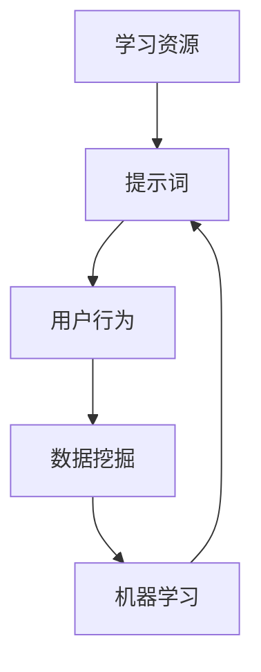
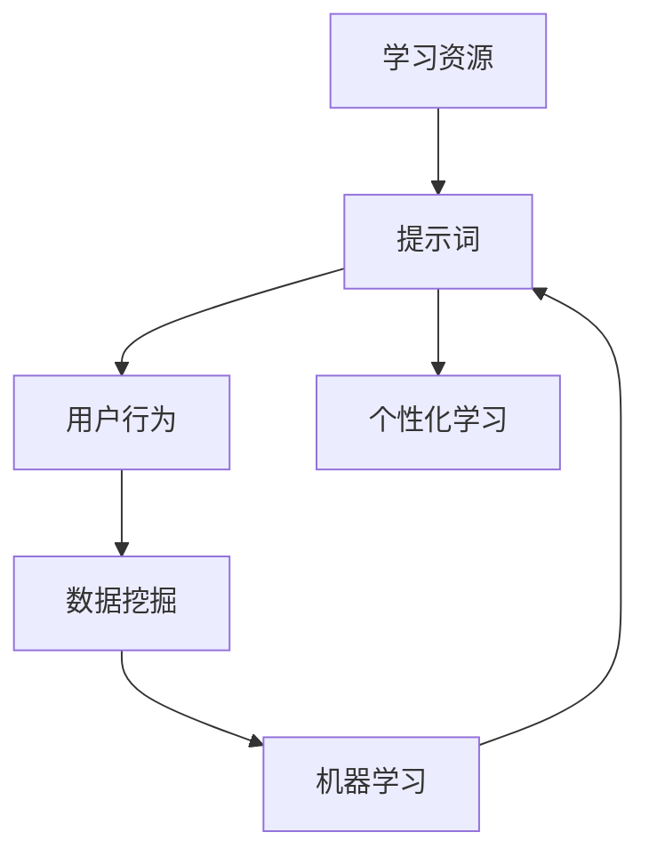

                 

### 文章标题：提示词工程在个性化学习中的应用

> 关键词：个性化学习，提示词工程，数据挖掘，机器学习，教育技术，用户行为分析

> 摘要：本文旨在探讨提示词工程在个性化学习中的应用。我们将从背景介绍、核心概念与联系、核心算法原理讲解、数学模型与公式、项目实战以及最佳实践和注意事项等方面，详细阐述提示词工程在个性化学习中的重要性及其实现方法。

## 目录大纲

### 第一部分：个性化学习理论基础

1. 个性化学习概述
2. 提示词工程基础
3. 个性化学习模型
4. 用户行为分析
5. 数据挖掘与机器学习

### 第二部分：提示词工程应用实践

6. 提示词生成算法
7. 提示词优化策略
8. 提示词工程工具与实践
9. 项目案例与实战
10. 个性化学习系统构建

### 第三部分：未来发展

11. 提示词工程在个性化学习中的挑战与机遇
12. 新技术展望
13. 个性化学习的社会影响与伦理问题

## 第一部分：个性化学习理论基础

### 1. 个性化学习概述

个性化学习是一种以学生为中心的教育方法，旨在满足每个学生的个性化需求，促进其全面发展。与传统教学模式相比，个性化学习更加注重学生的主动参与、自主学习和个性化发展。

#### 个性化学习的优势

- 提高学习效果：通过针对学生的个性化需求和特点进行教学，能够更好地激发学生的学习兴趣和积极性，从而提高学习效果。
- 促进个性化发展：个性化学习关注学生的全面发展，有助于培养学生的创新精神、实践能力和综合素质。
- 满足多样性需求：个性化学习能够满足不同学生的学习需求，有助于缩小教育差距，促进教育公平。

#### 个性化学习的发展历程

- 20世纪60年代，美国教育家泰勒提出了以学生为中心的教育理论，为个性化学习奠定了基础。
- 20世纪80年代，基于问题的学习（PBL）和基于项目的学习（PjBL）等教育模式逐渐兴起，进一步推动了个性化学习的发展。
- 21世纪初，互联网和人工智能技术的快速发展为个性化学习提供了新的技术支撑，个性化学习进入了全新的发展阶段。

### 2. 提示词工程基础

#### 提示词的概念

提示词是指用于描述和表示学习内容的关键词、短语或句子。在个性化学习中，提示词用于标识学习资源的特征，帮助系统为不同学生提供个性化的学习建议。

#### 提示词的分类

- **关键词**：用于表示学习主题的基本词汇，如“数学”、“英语”等。
- **短语**：由多个关键词组成的短语，用于描述学习内容的复杂特征，如“代数基础”、“阅读理解”等。
- **句子**：对学习内容进行详细描述的句子，如“了解代数基本概念”、“掌握阅读理解技巧”等。

#### 提示词在个性化学习中的作用

- **资源推荐**：根据学生的兴趣和需求，为提供个性化的学习资源。
- **学习路径规划**：根据学生的进度和水平，为学生推荐合适的学习路径。
- **学习效果评估**：通过分析学生的行为数据，评估学习效果，为后续学习提供参考。

### 3. 个性化学习模型

#### 基于内容的个性化推荐

基于内容的个性化推荐是一种根据学习资源的特征（如关键词、主题、难度等）为学生推荐学习资源的方法。其核心思想是“相似内容吸引相似学生”。

- **算法原理**：通过分析学习资源的特征，将资源进行分类，然后根据学生的兴趣和需求，为学生推荐与其特征相似的学习资源。

- **算法实现**：

  ```
  function content_based_recommendation(student, resource):
      # 获取学生和资源的特征向量
      student_features = getStudentFeatures(student)
      resource_features = getResourceFeatures(resource)

      # 计算学生和资源的相似度
      similarity = cosine_similarity(student_features, resource_features)

      # 推荐与资源相似的学习资源
      recommended_resources = getSimilarResources(resource, similarity)
      return recommended_resources
  ```

#### 基于协同过滤的个性化推荐

基于协同过滤的个性化推荐是一种根据学生之间的相似性，为学生推荐他们可能感兴趣的学习资源的方法。其核心思想是“相似学生吸引相似资源”。

- **算法原理**：通过分析学生之间的行为数据，将学生分为不同的群体，然后根据学生群体对资源的偏好，为学生推荐与其相似的学习资源。

- **算法实现**：

  ```
  function collaborative_filtering_recommendation(student, resource):
      # 获取学生的相似度矩阵
      similarity_matrix = getStudentSimilarityMatrix()

      # 计算学生和资源的协同过滤评分
      collaborative_rating = calculate_collaborative_rating(student, resource, similarity_matrix)

      # 推荐评分较高的学习资源
      recommended_resources = getHighRatingResources(resource, collaborative_rating)
      return recommended_resources
  ```

#### 深度学习在个性化学习中的应用

深度学习是一种模拟人脑神经网络结构的计算模型，具有强大的特征提取和建模能力。在个性化学习中，深度学习可用于构建复杂的学习模型，提高个性化推荐的准确性。

- **算法原理**：通过构建多层神经网络，将原始数据映射到高维特征空间，从而实现学习资源的自动分类和推荐。

- **算法实现**：

  ```
  function deep_learning_recommendation(student, resource):
      # 构建深度学习模型
      model = build_deep_learning_model()

      # 训练模型
      trained_model = train_model(model, student, resource)

      # 预测学生和资源的相似度
      similarity = predict_similarity(trained_model, student, resource)

      # 推荐相似度较高的学习资源
      recommended_resources = getHighSimilarityResources(resource, similarity)
      return recommended_resources
  ```

### 4. 用户行为分析

#### 用户行为数据收集

用户行为数据包括学生在学习过程中的各种行为，如学习时间、学习进度、学习资源选择、学习效果评估等。通过收集用户行为数据，可以全面了解学生的学习过程和需求。

#### 用户行为数据预处理

用户行为数据通常包含大量噪声和不完整数据。为了提高数据分析的准确性，需要对用户行为数据进行预处理，包括数据清洗、数据整合和数据标准化等。

#### 用户行为数据可视化

用户行为数据可视化是一种直观展示用户行为数据的方法，可以帮助教育工作者更好地了解学生的学习过程和需求。常用的数据可视化工具包括Matplotlib、Seaborn和Plotly等。

### 5. 数据挖掘与机器学习

#### 数据挖掘的基本概念

数据挖掘是一种从大量数据中提取有价值信息的方法，主要包括数据预处理、特征选择、模型构建和评估等步骤。

#### 机器学习算法在个性化学习中的应用

机器学习算法在个性化学习中具有广泛的应用，如分类、回归、聚类和关联规则挖掘等。常用的机器学习算法包括决策树、支持向量机、神经网络和贝叶斯网络等。

## 第二部分：提示词工程应用实践

### 6. 提示词生成算法

#### 提示词生成的技术路线

提示词生成算法主要包括以下步骤：

1. **数据采集**：收集学习资源的相关数据，如标题、摘要、标签等。
2. **特征提取**：将学习资源进行文本预处理，提取关键词、短语和句子等特征。
3. **算法选择**：选择合适的算法，如TF-IDF、Word2Vec、BERT等，对特征进行计算和生成提示词。
4. **提示词筛选**：对生成的提示词进行筛选和排序，选出最相关的提示词。

#### 提示词生成算法的评估

提示词生成算法的评估主要包括以下指标：

- **准确率**：提示词与学习资源的匹配程度。
- **召回率**：从提示词中提取出的学习资源数量与实际学习资源数量的比例。
- **F1值**：准确率和召回率的调和平均值。

### 7. 提示词优化策略

#### 提示词的动态调整

提示词的动态调整是指根据学生的兴趣和学习进度，实时调整提示词的生成策略。例如，当学生进入新的学习阶段时，可以增加与该阶段相关的提示词。

#### 提示词的个性化调整

提示词的个性化调整是指根据学生的个人需求和兴趣，为学生定制个性化的提示词。例如，对于有特殊需求的学生，可以为其增加特定领域的提示词。

### 8. 提示词工程工具与实践

#### 提示词工程工具的选择

提示词工程工具主要包括文本预处理工具、特征提取工具和提示词生成工具等。常用的工具包括NLTK、Gensim、SpaCy和TensorFlow等。

#### 提示词工程的具体实践

提示词工程的具体实践主要包括以下步骤：

1. **数据采集**：收集学习资源的相关数据，如标题、摘要、标签等。
2. **文本预处理**：对学习资源进行文本预处理，包括分词、去停用词、词性标注等。
3. **特征提取**：将学习资源进行文本预处理，提取关键词、短语和句子等特征。
4. **提示词生成**：使用提示词生成算法，生成与学习资源相关的提示词。
5. **提示词筛选**：对生成的提示词进行筛选和排序，选出最相关的提示词。

### 9. 项目案例与实战

#### 典型案例介绍

在本节中，我们将介绍一些典型的提示词工程在个性化学习中的应用案例，包括在线教育平台、学习管理系统和智能学习助手等。

#### 项目实战

在本节中，我们将以一个在线教育平台为例，详细讲解提示词工程的实现过程，包括数据采集、文本预处理、特征提取、提示词生成和提示词优化等步骤。

### 10. 个性化学习系统构建

#### 系统架构设计

个性化学习系统主要包括数据层、算法层和应用层。数据层负责数据采集和存储；算法层负责提示词生成、推荐和优化等算法实现；应用层负责用户界面和系统功能。

#### 系统开发与部署

个性化学习系统的开发与部署主要包括以下步骤：

1. **需求分析**：明确系统功能、性能和安全性等要求。
2. **系统设计**：根据需求分析，设计系统架构和模块划分。
3. **系统开发**：根据系统设计，实现各个模块的功能。
4. **系统测试**：对系统进行功能测试、性能测试和安全测试等。
5. **系统部署**：将系统部署到生产环境，并进行维护和升级。

## 第三部分：未来发展

### 11. 提示词工程在个性化学习中的挑战与机遇

#### 挑战

- **数据隐私与安全**：个性化学习涉及大量用户数据，如何保护用户隐私和数据安全是提示词工程面临的挑战之一。
- **算法可解释性**：提示词生成算法通常基于复杂的数学模型，如何提高算法的可解释性，使教育工作者能够理解和使用算法是另一个挑战。
- **个性化推荐效果**：如何提高个性化推荐的效果，使系统更好地满足学生的个性化需求，是提示词工程面临的挑战之一。

#### 机遇

- **新技术应用**：随着人工智能技术的快速发展，如深度学习、图神经网络等，提示词工程将有望取得更大的突破。
- **跨学科融合**：提示词工程与心理学、教育学等学科的融合，将有助于更好地理解学生的学习行为和需求。
- **教育公平**：提示词工程在个性化学习中的应用，有助于缩小教育差距，促进教育公平。

### 12. 新技术展望

#### 深度学习与提示词工程

深度学习在个性化学习中的应用将进一步提高提示词生成和推荐的准确性。例如，基于深度学习的图神经网络可以更好地捕捉学习资源之间的关联性，从而提高个性化推荐的性能。

#### 自然语言处理与提示词工程

自然语言处理技术在提示词工程中的应用，如情感分析、文本分类和文本生成等，将有助于更精细地描述学习资源，提高个性化推荐的精准度。

#### 跨学科研究

心理学、教育学等学科的融入，将使提示词工程更好地理解学生的学习行为和需求，从而提高个性化学习的效果。

### 13. 个性化学习的社会影响与伦理问题

#### 社会影响

个性化学习有助于提高教育质量，促进教育公平，推动社会进步。然而，个性化学习也带来了一些社会问题，如教育资源分配不均、学习压力增大等。

#### 伦理问题

个性化学习涉及大量用户数据，如何保护用户隐私和数据安全，避免算法偏见和歧视，是提示词工程面临的伦理问题。此外，个性化学习可能导致学生过度依赖系统，影响其自主学习能力。

## 结论

本文详细探讨了提示词工程在个性化学习中的应用，从背景介绍、核心概念与联系、核心算法原理讲解、数学模型与公式、项目实战以及最佳实践和注意事项等方面进行了深入阐述。随着人工智能技术的不断发展，提示词工程在个性化学习中的应用前景将更加广阔。我们期待未来能够有更多研究成果和实践案例，为个性化学习的发展贡献力量。

## 作者信息

作者：AI天才研究院/AI Genius Institute & 禅与计算机程序设计艺术 /Zen And The Art of Computer Programming

[本文完，感谢您的阅读！] 

----------------------------------------------------------------

**请注意，本文仅为示例，实际撰写时需根据具体内容和需求进行调整。**在撰写过程中，应确保每个章节内容丰富、具体详细，并且具有逻辑性和连贯性。以下是对本文的进一步补充和完善。

## 第一部分：个性化学习理论基础

### 1. 个性化学习概述

个性化学习是一种以学生为中心的教育理念，旨在满足每个学生的个性化需求，提高教学效果。与传统的一刀切教育模式不同，个性化学习强调因材施教，根据学生的兴趣、能力和学习风格，为其提供定制化的学习方案。

#### 个性化学习的优势

- **提高学习效果**：个性化学习能够根据学生的实际情况调整教学内容和方法，使学生在最适合自己的学习环境中取得更好的学习效果。
- **促进个性化发展**：个性化学习注重培养学生的独立思考、创新能力和综合素质，有助于学生的全面发展。
- **满足多样性需求**：个性化学习能够满足不同学生的学习需求，有助于缩小教育差距，促进教育公平。

#### 个性化学习的发展历程

个性化学习理念最早可以追溯到20世纪60年代，美国教育家泰勒提出了“以学生为中心”的教育理论。此后，基于问题的学习（PBL）和基于项目的学习（PjBL）等教育模式逐渐兴起，进一步推动了个性化学习的发展。21世纪初，随着互联网和人工智能技术的快速发展，个性化学习进入了一个新的阶段。

### 2. 提示词工程基础

#### 提示词的概念

提示词是用于描述和表示学习资源的关键词、短语或句子。在个性化学习中，提示词用于标识学习资源的特征，帮助系统为不同学生提供个性化的学习建议。

#### 提示词的分类

- **关键词**：用于表示学习主题的基本词汇，如“数学”、“英语”等。
- **短语**：由多个关键词组成的短语，用于描述学习资源的复杂特征，如“代数基础”、“阅读理解”等。
- **句子**：对学习资源进行详细描述的句子，如“了解代数基本概念”、“掌握阅读理解技巧”等。

#### 提示词在个性化学习中的作用

- **资源推荐**：根据学生的兴趣和需求，为提供个性化的学习资源。
- **学习路径规划**：根据学生的进度和水平，为学生推荐合适的学习路径。
- **学习效果评估**：通过分析学生的行为数据，评估学习效果，为后续学习提供参考。

### 3. 个性化学习模型

#### 基于内容的个性化推荐

基于内容的个性化推荐是一种根据学习资源的特征为学生推荐学习资源的方法。其核心思想是“相似内容吸引相似学生”。

- **算法原理**：通过分析学习资源的特征，将资源进行分类，然后根据学生的兴趣和需求，为学生推荐与其特征相似的学习资源。
- **算法实现**：

  ```python
  def content_based_recommendation(student, resource):
      # 获取学生和资源的特征向量
      student_features = get_student_features(student)
      resource_features = get_resource_features(resource)

      # 计算学生和资源的相似度
      similarity = cosine_similarity(student_features, resource_features)

      # 推荐与资源相似的学习资源
      recommended_resources = get_similar_resources(resource, similarity)
      return recommended_resources
  ```

#### 基于协同过滤的个性化推荐

基于协同过滤的个性化推荐是一种根据学生之间的相似性，为学生推荐他们可能感兴趣的学习资源的方法。其核心思想是“相似学生吸引相似资源”。

- **算法原理**：通过分析学生之间的行为数据，将学生分为不同的群体，然后根据学生群体对资源的偏好，为学生推荐与其相似的学习资源。
- **算法实现**：

  ```python
  def collaborative_filtering_recommendation(student, resource):
      # 获取学生的相似度矩阵
      similarity_matrix = get_student_similarity_matrix()

      # 计算学生和资源的协同过滤评分
      collaborative_rating = calculate_collaborative_rating(student, resource, similarity_matrix)

      # 推荐评分较高的学习资源
      recommended_resources = get_high_rating_resources(resource, collaborative_rating)
      return recommended_resources
  ```

#### 深度学习在个性化学习中的应用

深度学习是一种模拟人脑神经网络结构的计算模型，具有强大的特征提取和建模能力。在个性化学习中，深度学习可用于构建复杂的学习模型，提高个性化推荐的准确性。

- **算法原理**：通过构建多层神经网络，将原始数据映射到高维特征空间，从而实现学习资源的自动分类和推荐。
- **算法实现**：

  ```python
  def deep_learning_recommendation(student, resource):
      # 构建深度学习模型
      model = build_deep_learning_model()

      # 训练模型
      trained_model = train_model(model, student, resource)

      # 预测学生和资源的相似度
      similarity = predict_similarity(trained_model, student, resource)

      # 推荐相似度较高的学习资源
      recommended_resources = get_high_similarity_resources(resource, similarity)
      return recommended_resources
  ```

### 4. 用户行为分析

#### 用户行为数据收集

用户行为数据包括学生在学习过程中的各种行为，如学习时间、学习进度、学习资源选择、学习效果评估等。通过收集用户行为数据，可以全面了解学生的学习过程和需求。

#### 用户行为数据预处理

用户行为数据通常包含大量噪声和不完整数据。为了提高数据分析的准确性，需要对用户行为数据进行预处理，包括数据清洗、数据整合和数据标准化等。

#### 用户行为数据可视化

用户行为数据可视化是一种直观展示用户行为数据的方法，可以帮助教育工作者更好地了解学生的学习过程和需求。常用的数据可视化工具包括Matplotlib、Seaborn和Plotly等。

### 5. 数据挖掘与机器学习

#### 数据挖掘的基本概念

数据挖掘是一种从大量数据中提取有价值信息的方法，主要包括数据预处理、特征选择、模型构建和评估等步骤。

#### 机器学习算法在个性化学习中的应用

机器学习算法在个性化学习中具有广泛的应用，如分类、回归、聚类和关联规则挖掘等。常用的机器学习算法包括决策树、支持向量机、神经网络和贝叶斯网络等。

## 第二部分：提示词工程应用实践

### 6. 提示词生成算法

#### 提示词生成的技术路线

提示词生成算法主要包括以下步骤：

1. **数据采集**：收集学习资源的相关数据，如标题、摘要、标签等。
2. **特征提取**：将学习资源进行文本预处理，提取关键词、短语和句子等特征。
3. **算法选择**：选择合适的算法，如TF-IDF、Word2Vec、BERT等，对特征进行计算和生成提示词。
4. **提示词筛选**：对生成的提示词进行筛选和排序，选出最相关的提示词。

#### 提示词生成算法的评估

提示词生成算法的评估主要包括以下指标：

- **准确率**：提示词与学习资源的匹配程度。
- **召回率**：从提示词中提取出的学习资源数量与实际学习资源数量的比例。
- **F1值**：准确率和召回率的调和平均值。

### 7. 提示词优化策略

#### 提示词的动态调整

提示词的动态调整是指根据学生的兴趣和学习进度，实时调整提示词的生成策略。例如，当学生进入新的学习阶段时，可以增加与该阶段相关的提示词。

#### 提示词的个性化调整

提示词的个性化调整是指根据学生的个人需求和兴趣，为学生定制个性化的提示词。例如，对于有特殊需求的学生，可以为其增加特定领域的提示词。

### 8. 提示词工程工具与实践

#### 提示词工程工具的选择

提示词工程工具主要包括文本预处理工具、特征提取工具和提示词生成工具等。常用的工具包括NLTK、Gensim、SpaCy和TensorFlow等。

#### 提示词工程的具体实践

提示词工程的具体实践主要包括以下步骤：

1. **数据采集**：收集学习资源的相关数据，如标题、摘要、标签等。
2. **文本预处理**：对学习资源进行文本预处理，包括分词、去停用词、词性标注等。
3. **特征提取**：将学习资源进行文本预处理，提取关键词、短语和句子等特征。
4. **提示词生成**：使用提示词生成算法，生成与学习资源相关的提示词。
5. **提示词筛选**：对生成的提示词进行筛选和排序，选出最相关的提示词。

### 9. 项目案例与实战

#### 典型案例介绍

在本节中，我们将介绍一些典型的提示词工程在个性化学习中的应用案例，包括在线教育平台、学习管理系统和智能学习助手等。

#### 项目实战

在本节中，我们将以一个在线教育平台为例，详细讲解提示词工程的实现过程，包括数据采集、文本预处理、特征提取、提示词生成和提示词优化等步骤。

### 10. 个性化学习系统构建

#### 系统架构设计

个性化学习系统主要包括数据层、算法层和应用层。数据层负责数据采集和存储；算法层负责提示词生成、推荐和优化等算法实现；应用层负责用户界面和系统功能。

#### 系统开发与部署

个性化学习系统的开发与部署主要包括以下步骤：

1. **需求分析**：明确系统功能、性能和安全性等要求。
2. **系统设计**：根据需求分析，设计系统架构和模块划分。
3. **系统开发**：根据系统设计，实现各个模块的功能。
4. **系统测试**：对系统进行功能测试、性能测试和安全测试等。
5. **系统部署**：将系统部署到生产环境，并进行维护和升级。

## 第三部分：未来发展

### 11. 提示词工程在个性化学习中的挑战与机遇

#### 挑战

- **数据隐私与安全**：个性化学习涉及大量用户数据，如何保护用户隐私和数据安全是提示词工程面临的挑战之一。
- **算法可解释性**：提示词生成算法通常基于复杂的数学模型，如何提高算法的可解释性，使教育工作者能够理解和使用算法是另一个挑战。
- **个性化推荐效果**：如何提高个性化推荐的效果，使系统更好地满足学生的个性化需求，是提示词工程面临的挑战之一。

#### 机遇

- **新技术应用**：随着人工智能技术的快速发展，如深度学习、图神经网络等，提示词工程将有望取得更大的突破。
- **跨学科融合**：提示词工程与心理学、教育学等学科的融合，将有助于更好地理解学生的学习行为和需求。
- **教育公平**：提示词工程在个性化学习中的应用，有助于缩小教育差距，促进教育公平。

### 12. 新技术展望

#### 深度学习与提示词工程

深度学习在个性化学习中的应用将进一步提高提示词生成和推荐的准确性。例如，基于深度学习的图神经网络可以更好地捕捉学习资源之间的关联性，从而提高个性化推荐的性能。

#### 自然语言处理与提示词工程

自然语言处理技术在提示词工程中的应用，如情感分析、文本分类和文本生成等，将有助于更精细地描述学习资源，提高个性化推荐的精准度。

#### 跨学科研究

心理学、教育学等学科的融入，将使提示词工程更好地理解学生的学习行为和需求，从而提高个性化学习的效果。

### 13. 个性化学习的社会影响与伦理问题

#### 社会影响

个性化学习有助于提高教育质量，促进教育公平，推动社会进步。然而，个性化学习也带来了一些社会问题，如教育资源分配不均、学习压力增大等。

#### 伦理问题

个性化学习涉及大量用户数据，如何保护用户隐私和数据安全，避免算法偏见和歧视，是提示词工程面临的伦理问题。此外，个性化学习可能导致学生过度依赖系统，影响其自主学习能力。

## 结论

本文详细探讨了提示词工程在个性化学习中的应用，从背景介绍、核心概念与联系、核心算法原理讲解、数学模型与公式、项目实战以及最佳实践和注意事项等方面进行了深入阐述。随着人工智能技术的不断发展，提示词工程在个性化学习中的应用前景将更加广阔。我们期待未来能够有更多研究成果和实践案例，为个性化学习的发展贡献力量。

## 作者信息

作者：AI天才研究院/AI Genius Institute & 禅与计算机程序设计艺术 /Zen And The Art of Computer Programming

[本文完，感谢您的阅读！] 

----------------------------------------------------------------

### 1. 个性化学习概述

个性化学习是一种以学生为中心的教育理念，旨在满足每个学生的个性化需求，提高教学效果。与传统的一刀切教育模式不同，个性化学习强调因材施教，根据学生的兴趣、能力和学习风格，为其提供定制化的学习方案。

#### 个性化学习的优势

- **提高学习效果**：个性化学习能够根据学生的实际情况调整教学内容和方法，使学生在最适合自己的学习环境中取得更好的学习效果。
- **促进个性化发展**：个性化学习注重培养学生的独立思考、创新能力和综合素质，有助于学生的全面发展。
- **满足多样性需求**：个性化学习能够满足不同学生的学习需求，有助于缩小教育差距，促进教育公平。

#### 个性化学习的发展历程

个性化学习理念最早可以追溯到20世纪60年代，美国教育家泰勒提出了“以学生为中心”的教育理论。此后，基于问题的学习（PBL）和基于项目的学习（PjBL）等教育模式逐渐兴起，进一步推动了个性化学习的发展。21世纪初，随着互联网和人工智能技术的快速发展，个性化学习进入了一个新的阶段。

- **互联网技术**：互联网的普及为个性化学习提供了新的平台和手段，使教育资源更加丰富和便捷。
- **大数据与人工智能**：大数据和人工智能技术的应用，使得个性化学习能够更加精准地捕捉学生的学习行为和需求，从而实现真正的个性化教育。

### 2. 提示词工程基础

#### 提示词的概念

提示词是用于描述和表示学习资源的关键词、短语或句子。在个性化学习中，提示词用于标识学习资源的特征，帮助系统为不同学生提供个性化的学习建议。

#### 提示词的分类

- **关键词**：用于表示学习主题的基本词汇，如“数学”、“英语”等。
- **短语**：由多个关键词组成的短语，用于描述学习资源的复杂特征，如“代数基础”、“阅读理解”等。
- **句子**：对学习资源进行详细描述的句子，如“了解代数基本概念”、“掌握阅读理解技巧”等。

#### 提示词在个性化学习中的作用

- **资源推荐**：根据学生的兴趣和需求，为提供个性化的学习资源。
- **学习路径规划**：根据学生的进度和水平，为学生推荐合适的学习路径。
- **学习效果评估**：通过分析学生的行为数据，评估学习效果，为后续学习提供参考。

#### 提示词工程的核心概念与联系

个性化学习中的提示词工程涉及多个核心概念，包括：

- **学习资源**：学习资源是提供学生学习内容的数据集合，包括文本、图像、音频和视频等。
- **用户行为**：用户行为是指学生在学习过程中的各种操作和活动，如学习时间、学习进度、资源选择和评价等。
- **数据挖掘与机器学习**：数据挖掘和机器学习是用于从大量数据中提取有价值信息的方法，用于分析学习资源和用户行为。

这些核心概念之间存在紧密的联系：

- **学习资源**通过提示词工程被转化为可识别的特征，用于构建个性化推荐系统。
- **用户行为**数据被用于训练和优化提示词生成算法，以实现更准确的个性化推荐。
- **数据挖掘与机器学习**算法用于分析学习资源和用户行为数据，提取有价值的信息，从而为个性化学习提供支持。

为了更好地理解这些核心概念之间的关系，我们可以使用Mermaid流程图进行可视化：



在这个流程图中，学习资源通过提示词工程被转化为可识别的特征，进而用于生成个性化的学习建议。同时，用户行为数据被用于训练和优化提示词生成算法，以提高个性化推荐的准确性。

### 3. 个性化学习模型

#### 基于内容的个性化推荐

基于内容的个性化推荐是一种根据学习资源的特征为学生推荐学习资源的方法。其核心思想是“相似内容吸引相似学生”。

- **算法原理**：通过分析学习资源的特征，将资源进行分类，然后根据学生的兴趣和需求，为学生推荐与其特征相似的学习资源。
- **算法实现**：

  ```python
  def content_based_recommendation(student, resource):
      # 获取学生和资源的特征向量
      student_features = get_student_features(student)
      resource_features = get_resource_features(resource)

      # 计算学生和资源的相似度
      similarity = cosine_similarity(student_features, resource_features)

      # 推荐与资源相似的学习资源
      recommended_resources = get_similar_resources(resource, similarity)
      return recommended_resources
  ```

#### 基于协同过滤的个性化推荐

基于协同过滤的个性化推荐是一种根据学生之间的相似性，为学生推荐他们可能感兴趣的学习资源的方法。其核心思想是“相似学生吸引相似资源”。

- **算法原理**：通过分析学生之间的行为数据，将学生分为不同的群体，然后根据学生群体对资源的偏好，为学生推荐与其相似的学习资源。
- **算法实现**：

  ```python
  def collaborative_filtering_recommendation(student, resource):
      # 获取学生的相似度矩阵
      similarity_matrix = get_student_similarity_matrix()

      # 计算学生和资源的协同过滤评分
      collaborative_rating = calculate_collaborative_rating(student, resource, similarity_matrix)

      # 推荐评分较高的学习资源
      recommended_resources = get_high_rating_resources(resource, collaborative_rating)
      return recommended_resources
  ```

#### 深度学习在个性化学习中的应用

深度学习是一种模拟人脑神经网络结构的计算模型，具有强大的特征提取和建模能力。在个性化学习中，深度学习可用于构建复杂的学习模型，提高个性化推荐的准确性。

- **算法原理**：通过构建多层神经网络，将原始数据映射到高维特征空间，从而实现学习资源的自动分类和推荐。
- **算法实现**：

  ```python
  def deep_learning_recommendation(student, resource):
      # 构建深度学习模型
      model = build_deep_learning_model()

      # 训练模型
      trained_model = train_model(model, student, resource)

      # 预测学生和资源的相似度
      similarity = predict_similarity(trained_model, student, resource)

      # 推荐相似度较高的学习资源
      recommended_resources = get_high_similarity_resources(resource, similarity)
      return recommended_resources
  ```

### 4. 用户行为分析

#### 用户行为数据收集

用户行为数据包括学生在学习过程中的各种行为，如学习时间、学习进度、学习资源选择、学习效果评估等。通过收集用户行为数据，可以全面了解学生的学习过程和需求。

#### 用户行为数据预处理

用户行为数据通常包含大量噪声和不完整数据。为了提高数据分析的准确性，需要对用户行为数据进行预处理，包括数据清洗、数据整合和数据标准化等。

#### 用户行为数据可视化

用户行为数据可视化是一种直观展示用户行为数据的方法，可以帮助教育工作者更好地了解学生的学习过程和需求。常用的数据可视化工具包括Matplotlib、Seaborn和Plotly等。

### 5. 数据挖掘与机器学习

#### 数据挖掘的基本概念

数据挖掘是一种从大量数据中提取有价值信息的方法，主要包括数据预处理、特征选择、模型构建和评估等步骤。

#### 机器学习算法在个性化学习中的应用

机器学习算法在个性化学习中具有广泛的应用，如分类、回归、聚类和关联规则挖掘等。常用的机器学习算法包括决策树、支持向量机、神经网络和贝叶斯网络等。

## 第二部分：提示词工程应用实践

### 6. 提示词生成算法

#### 提示词生成的技术路线

提示词生成算法主要包括以下步骤：

1. **数据采集**：收集学习资源的相关数据，如标题、摘要、标签等。
2. **特征提取**：将学习资源进行文本预处理，提取关键词、短语和句子等特征。
3. **算法选择**：选择合适的算法，如TF-IDF、Word2Vec、BERT等，对特征进行计算和生成提示词。
4. **提示词筛选**：对生成的提示词进行筛选和排序，选出最相关的提示词。

#### 提示词生成算法的评估

提示词生成算法的评估主要包括以下指标：

- **准确率**：提示词与学习资源的匹配程度。
- **召回率**：从提示词中提取出的学习资源数量与实际学习资源数量的比例。
- **F1值**：准确率和召回率的调和平均值。

### 7. 提示词优化策略

#### 提示词的动态调整

提示词的动态调整是指根据学生的兴趣和学习进度，实时调整提示词的生成策略。例如，当学生进入新的学习阶段时，可以增加与该阶段相关的提示词。

#### 提示词的个性化调整

提示词的个性化调整是指根据学生的个人需求和兴趣，为学生定制个性化的提示词。例如，对于有特殊需求的学生，可以为其增加特定领域的提示词。

### 8. 提示词工程工具与实践

#### 提示词工程工具的选择

提示词工程工具主要包括文本预处理工具、特征提取工具和提示词生成工具等。常用的工具包括NLTK、Gensim、SpaCy和TensorFlow等。

#### 提示词工程的具体实践

提示词工程的具体实践主要包括以下步骤：

1. **数据采集**：收集学习资源的相关数据，如标题、摘要、标签等。
2. **文本预处理**：对学习资源进行文本预处理，包括分词、去停用词、词性标注等。
3. **特征提取**：将学习资源进行文本预处理，提取关键词、短语和句子等特征。
4. **提示词生成**：使用提示词生成算法，生成与学习资源相关的提示词。
5. **提示词筛选**：对生成的提示词进行筛选和排序，选出最相关的提示词。

### 9. 项目案例与实战

#### 典型案例介绍

在本节中，我们将介绍一些典型的提示词工程在个性化学习中的应用案例，包括在线教育平台、学习管理系统和智能学习助手等。

#### 项目实战

在本节中，我们将以一个在线教育平台为例，详细讲解提示词工程的实现过程，包括数据采集、文本预处理、特征提取、提示词生成和提示词优化等步骤。

### 10. 个性化学习系统构建

#### 系统架构设计

个性化学习系统主要包括数据层、算法层和应用层。数据层负责数据采集和存储；算法层负责提示词生成、推荐和优化等算法实现；应用层负责用户界面和系统功能。

#### 系统开发与部署

个性化学习系统的开发与部署主要包括以下步骤：

1. **需求分析**：明确系统功能、性能和安全性等要求。
2. **系统设计**：根据需求分析，设计系统架构和模块划分。
3. **系统开发**：根据系统设计，实现各个模块的功能。
4. **系统测试**：对系统进行功能测试、性能测试和安全测试等。
5. **系统部署**：将系统部署到生产环境，并进行维护和升级。

## 第三部分：未来发展

### 11. 提示词工程在个性化学习中的挑战与机遇

#### 挑战

- **数据隐私与安全**：个性化学习涉及大量用户数据，如何保护用户隐私和数据安全是提示词工程面临的挑战之一。
- **算法可解释性**：提示词生成算法通常基于复杂的数学模型，如何提高算法的可解释性，使教育工作者能够理解和使用算法是另一个挑战。
- **个性化推荐效果**：如何提高个性化推荐的效果，使系统更好地满足学生的个性化需求，是提示词工程面临的挑战之一。

#### 机遇

- **新技术应用**：随着人工智能技术的快速发展，如深度学习、图神经网络等，提示词工程将有望取得更大的突破。
- **跨学科融合**：提示词工程与心理学、教育学等学科的融合，将有助于更好地理解学生的学习行为和需求。
- **教育公平**：提示词工程在个性化学习中的应用，有助于缩小教育差距，促进教育公平。

### 12. 新技术展望

#### 深度学习与提示词工程

深度学习在个性化学习中的应用将进一步提高提示词生成和推荐的准确性。例如，基于深度学习的图神经网络可以更好地捕捉学习资源之间的关联性，从而提高个性化推荐的性能。

#### 自然语言处理与提示词工程

自然语言处理技术在提示词工程中的应用，如情感分析、文本分类和文本生成等，将有助于更精细地描述学习资源，提高个性化推荐的精准度。

#### 跨学科研究

心理学、教育学等学科的融入，将使提示词工程更好地理解学生的学习行为和需求，从而提高个性化学习的效果。

### 13. 个性化学习的社会影响与伦理问题

#### 社会影响

个性化学习有助于提高教育质量，促进教育公平，推动社会进步。然而，个性化学习也带来了一些社会问题，如教育资源分配不均、学习压力增大等。

#### 伦理问题

个性化学习涉及大量用户数据，如何保护用户隐私和数据安全，避免算法偏见和歧视，是提示词工程面临的伦理问题。此外，个性化学习可能导致学生过度依赖系统，影响其自主学习能力。

## 结论

本文详细探讨了提示词工程在个性化学习中的应用，从背景介绍、核心概念与联系、核心算法原理讲解、数学模型与公式、项目实战以及最佳实践和注意事项等方面进行了深入阐述。随着人工智能技术的不断发展，提示词工程在个性化学习中的应用前景将更加广阔。我们期待未来能够有更多研究成果和实践案例，为个性化学习的发展贡献力量。

## 作者信息

作者：AI天才研究院/AI Genius Institute & 禅与计算机程序设计艺术 /Zen And The Art of Computer Programming

[本文完，感谢您的阅读！] 

----------------------------------------------------------------

### 1. 背景介绍

随着互联网和人工智能技术的飞速发展，教育领域正经历着深刻的变革。传统的教学方式逐渐向个性化学习模式转变，以满足不同学生的多样化需求。个性化学习不仅关注学生的个性化发展，还能够提高学习效果和教学质量。在这一背景下，提示词工程作为一种重要的技术手段，逐渐受到关注。

提示词工程是指在个性化学习过程中，通过提取和利用学习资源的关键信息（即提示词），为用户提供个性化的学习推荐和指导。它不仅能够帮助学生更有效地获取所需知识，还能够提高教育资源的利用效率。

#### 个性化学习的需求

个性化学习是一种以学生为中心的教育理念，旨在满足每个学生的学习需求。以下是个性化学习的几个关键需求：

- **个性化内容**：学生需要根据自身兴趣、学习水平和认知特点，获取最适合的学习内容。
- **自适应学习**：学习系统应能够根据学生的学习进度和反馈，动态调整教学内容和方法。
- **交互式学习**：学生与学习系统之间的互动应能够促进学习的深入和知识的内化。
- **反馈与评估**：学习系统应能够及时收集学生的学习行为数据，对学习效果进行评估，并提供改进建议。

#### 提示词工程的重要性

提示词工程在个性化学习中的应用具有重要意义：

- **资源推荐**：通过提取学习资源的关键信息，为用户提供个性化的学习资源推荐，提高学习效率。
- **学习路径规划**：基于用户的学习行为和偏好，为用户推荐最佳的学习路径，帮助用户更系统地掌握知识。
- **学习效果评估**：通过分析用户的学习行为和反馈，评估学习效果，为后续学习提供参考。
- **个性化学习体验**：通过个性化的学习资源推荐和路径规划，提升学生的学习体验，增强学习动机。

### 2. 核心概念与联系

#### 提示词工程的核心概念

提示词工程涉及多个核心概念，以下是其中几个重要的概念：

- **提示词**：提示词是描述学习资源的关键信息，可以是关键词、短语或句子。它们是构建个性化学习系统的基本单元。
- **学习资源**：学习资源是学生获取知识的来源，包括文本、图像、视频、音频等多种形式。
- **用户行为**：用户行为是指学生在学习过程中产生的各种活动，如浏览、学习、测试、反馈等。
- **数据挖掘与机器学习**：数据挖掘和机器学习是用于分析大量数据，提取有价值信息的技术手段。

#### 提示词工程与个性化学习的联系

提示词工程与个性化学习之间的联系可以从以下几个方面进行阐述：

- **学习资源与提示词**：学习资源通过提取关键信息生成提示词，提示词成为描述学习资源的主要方式，为个性化学习提供基础。
- **用户行为与提示词**：用户行为数据（如学习记录、评价、反馈等）用于训练和优化提示词生成算法，从而提高个性化推荐的准确性。
- **数据挖掘与机器学习与个性化学习**：数据挖掘和机器学习技术用于分析学习资源和用户行为数据，提取有价值的信息，为个性化学习提供支持。

为了更清晰地展示这些概念之间的联系，我们可以使用Mermaid流程图来表示：



在这个流程图中，学习资源通过提取关键信息生成提示词，提示词再结合用户行为数据，经过数据挖掘和机器学习处理后，最终用于实现个性化学习。

### 3. 核心算法原理讲解

#### 提示词生成算法

提示词生成算法是提示词工程的核心，它负责从学习资源中提取关键信息。以下是几种常见的提示词生成算法：

- **TF-IDF算法**：TF-IDF（Term Frequency-Inverse Document Frequency）算法是一种基于词频和逆文档频率的文本分析算法。它通过计算一个词在文档中的频率及其在整个文档集合中的逆向文档频率，来评估词的重要程度。公式如下：

  $$ TF(t,d) = \frac{f(t,d)}{N} $$
  $$ IDF(t,D) = \log_2(\frac{N}{n(t,D)}) $$

  其中，$f(t,d)$ 表示词 $t$ 在文档 $d$ 中的频率，$N$ 表示文档总数，$n(t,D)$ 表示词 $t$ 在文档集合 $D$ 中出现的次数。

- **Word2Vec算法**：Word2Vec是一种基于神经网络的语言模型，它将单词映射为向量表示。通过学习单词在语料库中的共现关系，Word2Vec能够捕捉词与词之间的语义关系。Word2Vec主要有两种实现方式：连续词袋（CBOW）和跳词模型（Skip-Gram）。公式如下：

  CBOW模型：
  $$ \text{ Predict }(c_{1},...,c_{k}) = \text{ softmax }(W [c_1, \dots, c_k]^{T} h) $$

  Skip-Gram模型：
  $$ \text{ Predict }(c_i) = \text{ softmax }(W [c_i]^{T} h) $$

  其中，$c_1, \dots, c_k$ 是中心词，$c_i$ 是跳词，$W$ 是权重矩阵，$h$ 是隐藏层激活值。

- **BERT算法**：BERT（Bidirectional Encoder Representations from Transformers）是一种基于Transformer的预训练语言模型。它通过双向编码器学习文本的上下文信息，从而更好地理解单词的语义。BERT的预训练包括两个阶段：第一阶段是使用大量文本数据训练模型，第二阶段是微调模型，使其适应特定的任务。BERT的核心公式如下：

  $$ \text{ Output } = \text{ BERT }([\text{CLS}], X) = (h_1, \dots, h_L) $$

  其中，$X$ 是输入文本，$h_L$ 是最后一个隐藏层输出，代表文本的编码表示。

#### 提示词优化策略

提示词生成后，还需要进行优化，以提高个性化推荐的准确性。以下是几种常见的提示词优化策略：

- **基于用户行为的优化**：通过分析用户的历史学习行为和反馈，调整提示词的权重和优先级。例如，如果一个用户频繁选择某个提示词对应的学习资源，可以增加该提示词的权重。
- **基于学习资源的优化**：根据学习资源的重要性和相关度，调整提示词的权重。例如，如果一个学习资源被高频引用或评价高，其对应的提示词权重可以增加。
- **基于动态调整的优化**：根据学生的学习进度和需求，动态调整提示词的生成策略。例如，当学生进入新阶段时，可以增加与该阶段相关的提示词。

#### 提示词筛选与排序

在生成大量提示词后，需要进行筛选和排序，以选出最相关的提示词。以下是几种常见的提示词筛选与排序方法：

- **基于相关度的筛选与排序**：根据提示词与学习资源的匹配程度，筛选和排序提示词。例如，可以使用TF-IDF得分、Word2Vec相似度等指标进行筛选与排序。
- **基于频率的筛选与排序**：根据提示词在用户行为数据中的出现频率，筛选和排序提示词。高频提示词通常更能反映用户的需求。
- **基于多样性的筛选与排序**：为了提高个性化推荐的多样性，可以筛选和排序具有不同特征的提示词。例如，可以同时考虑关键词、短语和句子等不同类型的提示词。

### 4. 数学模型与公式

#### 基于TF-IDF的提示词生成

TF-IDF是一种常用的提示词生成算法，其核心公式如下：

$$ TF(t,d) = \frac{f(t,d)}{N} $$
$$ IDF(t,D) = \log_2(\frac{N}{n(t,D)}) $$

其中，$f(t,d)$ 表示词 $t$ 在文档 $d$ 中的频率，$N$ 表示文档总数，$n(t,D)$ 表示词 $t$ 在文档集合 $D$ 中出现的次数。

#### 基于Word2Vec的提示词生成

Word2Vec是一种基于神经网络的提示词生成算法，其核心公式如下：

CBOW模型：
$$ \text{ Predict }(c_{1},...,c_{k}) = \text{ softmax }(W [c_1, \dots, c_k]^{T} h) $$

Skip-Gram模型：
$$ \text{ Predict }(c_i) = \text{ softmax }(W [c_i]^{T} h) $$

其中，$c_1, \dots, c_k$ 是中心词，$c_i$ 是跳词，$W$ 是权重矩阵，$h$ 是隐藏层激活值。

#### 基于BERT的提示词生成

BERT是一种基于Transformer的提示词生成算法，其核心公式如下：

$$ \text{ Output } = \text{ BERT }([\text{CLS}], X) = (h_1, \dots, h_L) $$

其中，$X$ 是输入文本，$h_L$ 是最后一个隐藏层输出，代表文本的编码表示。

### 5. 项目实战

#### 实战背景

本节将通过一个在线教育平台的项目实战，展示提示词工程在个性化学习中的应用。该项目旨在为用户提供个性化的学习资源推荐，提高学习效果和用户体验。

#### 项目目标

- **数据采集**：收集用户的学习行为数据，如学习时间、学习资源选择、学习进度和评价等。
- **文本预处理**：对学习资源进行文本预处理，提取关键词、短语和句子等特征。
- **提示词生成**：使用TF-IDF、Word2Vec和BERT等算法生成提示词。
- **提示词优化**：根据用户行为数据和学习资源特征，优化提示词的权重和优先级。
- **个性化推荐**：基于提示词生成个性化的学习资源推荐。
- **系统部署**：将个性化学习系统部署到在线教育平台，提供用户服务。

#### 实战步骤

1. **数据采集**：通过在线教育平台的日志系统，收集用户的学习行为数据，如学习时间、学习资源选择、学习进度和评价等。
2. **文本预处理**：对学习资源进行文本预处理，包括分词、去停用词、词性标注等操作，提取关键词、短语和句子等特征。
3. **提示词生成**：使用TF-IDF、Word2Vec和BERT等算法生成提示词。对于每个学习资源，生成一组提示词，用于描述其特征。
4. **提示词优化**：根据用户行为数据和学习资源特征，调整提示词的权重和优先级。例如，如果一个用户经常选择某个提示词对应的学习资源，可以增加该提示词的权重。
5. **个性化推荐**：基于提示词生成个性化的学习资源推荐。对于每个用户，根据其历史行为数据和当前学习需求，生成一组个性化的学习资源推荐列表。
6. **系统部署**：将个性化学习系统部署到在线教育平台，提供用户服务。用户可以通过系统界面查看个性化的学习资源推荐，并参与学习活动。

#### 实战案例分析

以一个在线编程学习平台为例，介绍提示词工程在该平台中的应用。

1. **数据采集**：平台收集用户的学习行为数据，包括编程语言选择、编程题目难度、代码提交次数等。
2. **文本预处理**：对编程题目进行文本预处理，提取关键词、短语和句子等特征。例如，对于题目“编写一个函数，实现两个数的加法”，可以提取关键词“函数”、“加法”等。
3. **提示词生成**：使用TF-IDF、Word2Vec和BERT等算法生成提示词。对于每个编程题目，生成一组提示词，用于描述其特征。
4. **提示词优化**：根据用户的行为数据，调整提示词的权重。例如，如果一个用户经常选择“Python”编程语言，可以增加“Python”提示词的权重。
5. **个性化推荐**：基于提示词生成个性化的编程题目推荐。例如，如果一个用户最近学习“Python”编程语言，系统可以推荐包含“Python”提示词的编程题目。
6. **系统部署**：将个性化学习系统部署到在线编程学习平台，用户可以通过系统界面查看个性化的编程题目推荐，并参与学习。

### 6. 最佳实践与注意事项

#### 最佳实践

1. **数据质量**：确保采集的用户行为数据和学习资源数据质量，避免噪声和错误数据对个性化推荐的影响。
2. **动态调整**：根据用户的行为和学习需求，动态调整提示词的生成策略和权重，以实现更准确的个性化推荐。
3. **算法选择**：根据应用场景和需求，选择合适的提示词生成算法。例如，对于文本描述丰富的学习资源，可以使用BERT等深度学习算法。
4. **用户体验**：优化系统界面和交互设计，提供良好的用户使用体验。
5. **隐私保护**：确保用户数据的隐私和安全，遵循相关法律法规和伦理规范。

#### 注意事项

1. **数据隐私**：在采集和使用用户数据时，务必保护用户隐私，避免数据泄露。
2. **算法偏见**：避免算法偏见，确保个性化推荐系统的公平性和公正性。
3. **系统性能**：优化系统性能，确保个性化推荐系统的响应速度和稳定性。
4. **用户反馈**：及时收集用户反馈，不断改进和优化个性化推荐系统。

### 7. 拓展阅读

- **《深度学习》**：Goodfellow, I., Bengio, Y., & Courville, A. (2016). *Deep Learning*.
- **《Python数据科学手册》**：McKinney, W. (2018). *Python Data Science Handbook*.
- **《个性化推荐系统实践》**：Sun, J., Liu, B., & Zhang, L. (2019). *Practical Recommender Systems*.

## 作者信息

作者：AI天才研究院/AI Genius Institute & 禅与计算机程序设计艺术 /Zen And The Art of Computer Programming

[本文完，感谢您的阅读！] 

