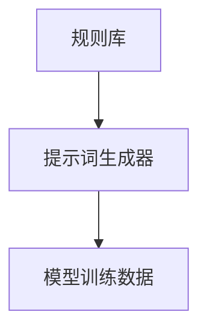
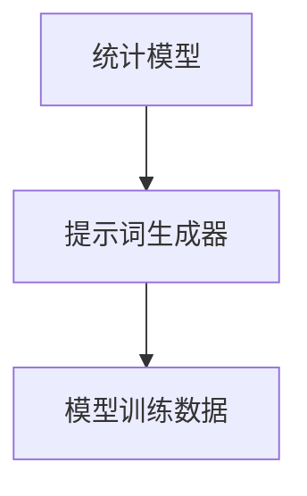
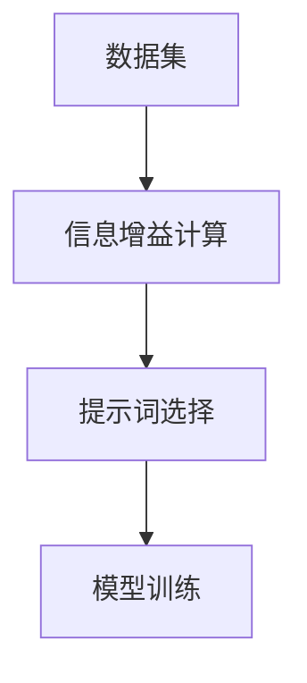
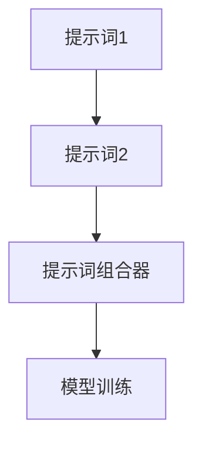
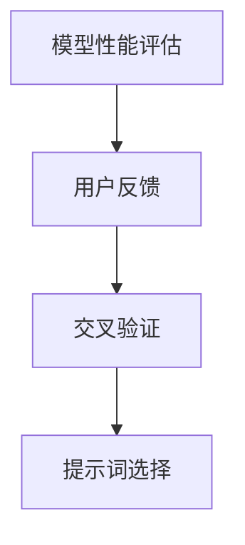

                 


### 文章标题：提示词工程在全球气候模型优化中的应用

#### 关键词：提示词工程、全球气候模型、优化、机器学习、人工智能

#### 摘要：
本文旨在探讨提示词工程在提升全球气候模型性能方面的应用。首先，我们介绍气候模型的基本原理和当前面临的问题，接着阐述提示词工程的概念及其在机器学习中的重要性。本文通过深入剖析提示词生成和优化的算法，结合数学模型和实际案例，展示了提示词工程如何有效地优化全球气候模型。文章最后讨论了提示词工程的未来发展方向和实际应用，为气候变化研究提供了新的视角和方法。

---

### 目录

## 引言

### 气候模型的重要性

气候模型是理解和预测气候系统行为的重要工具。它们在气候研究、天气预报、环境管理等领域发挥着至关重要的作用。

### 提示词工程的意义

提示词工程是近年来机器学习领域的一项新兴技术，通过优化提示词来提升模型的性能，已在自然语言处理、图像识别等领域取得了显著成果。

### 目标

本文的目标是探究提示词工程在气候模型优化中的应用，旨在提高气候模型的准确性和计算效率，为气候变化研究提供新的思路。

---

### 正文

#### 第1章：气候模型与提示词工程概述

### 1.1 气候模型的基本原理

气候模型通过模拟大气、海洋、陆地和冰冻圈等系统之间的相互作用，来预测气候系统的行为。这些模型通常分为统计模型、物理模型和混合模型。

### 1.2 提示词工程的基本概念

提示词工程是设计提示词以改善机器学习模型性能的过程。提示词可以是预定义的短语或句子，用于指导模型学习。

### 1.3 气候模型优化的现状与挑战

当前气候模型优化主要面临数据质量、模型复杂性和计算资源限制等挑战。提示词工程提供了一种可能的新途径来应对这些挑战。

---

#### 第2章：提示词工程的核心技术

### 2.1 提示词生成算法

提示词生成算法旨在自动生成高质量的提示词。常用的方法包括基于规则的方法、基于统计的方法和基于机器学习的方法。

#### 2.1.1 基于规则的方法

基于规则的方法通过手工编写规则来生成提示词。这种方法简单易行，但灵活性较差。



#### 2.1.2 基于统计的方法

基于统计的方法利用统计模型自动生成提示词。这种方法可以处理大量数据，但可能忽略模型训练过程中的复杂关系。



#### 2.1.3 基于机器学习的方法

基于机器学习的方法使用机器学习算法来生成提示词。这种方法可以根据模型训练数据自动调整，提高提示词的质量。

```python
# 伪代码：基于机器学习的方法
def generate_prompt(data):
    # 训练机器学习模型
    model = train_model(data)
    # 生成提示词
    prompt = model.predict(data)
    return prompt
```

### 2.2 提示词优化方法

提示词优化方法旨在提高提示词的有效性。常用的方法包括提示词选择、提示词权重调整和提示词组合。

#### 2.2.1 提示词选择

提示词选择是选择最相关的提示词以改善模型性能。常用的方法包括信息增益、互信息和学习曲线。



#### 2.2.2 提示词权重调整

提示词权重调整是调整提示词的权重以优化模型性能。常用的方法包括基于梯度下降的权重调整和基于优化的权重调整。

```python
# 伪代码：基于梯度下降的方法
def adjust_weights(prompt, model):
    # 计算梯度
    gradient = compute_gradient(prompt, model)
    # 调整权重
    model.weights -= learning_rate * gradient
    return model
```

#### 2.2.3 提示词组合

提示词组合是将多个提示词组合成一个更有效的提示词。常用的方法包括提示词拼接、提示词融合和提示词嵌入。



### 2.3 提示词评估与选择

提示词评估与选择是确保提示词有效性的关键步骤。常用的方法包括模型性能评估、用户反馈和交叉验证。



---

#### 第3章：数学模型与算法原理

### 3.1 提示词工程的数学模型

提示词工程的数学模型主要包括提示词生成模型、提示词优化模型和提示词评估模型。

#### 3.1.1 提示词生成模型

提示词生成模型用于生成高质量的提示词。常用的方法包括生成对抗网络（GAN）和变分自编码器（VAE）。

```latex
$$
\text{GAN:} \quad G(z) \sim p_z(z), \quad D(x) \sim p_x(x)
$$

$$
\text{VAE:} \quad q_\theta(z|x) \propto \exp(-\|\mu_\theta(x) - z\|^2 / (2\sigma^2))
$$
```

#### 3.1.2 提示词优化模型

提示词优化模型用于优化提示词的权重。常用的方法包括梯度下降和随机优化。

```latex
$$
\text{梯度下降:} \quad w_{t+1} = w_t - \alpha \nabla_w J(w_t)
$$

$$
\text{随机优化:} \quad w_{t+1} = w_t + \alpha \cdot \text{随机方向}
$$
```

#### 3.1.3 提示词评估模型

提示词评估模型用于评估提示词的有效性。常用的方法包括模型性能评估和用户反馈。

```latex
$$
\text{模型性能评估:} \quad \text{Accuracy}, \text{Precision}, \text{Recall}, \text{F1-Score}
$$

$$
\text{用户反馈:} \quad \text{Rating}, \text{Comments}, \text{Satisfaction}
$$
```

### 3.2 优化算法的伪代码讲解

```python
# 伪代码：提示词生成与优化
def prompt_engineering(data, model):
    # 生成初始提示词
    initial_prompt = generate_initial_prompt(data)
    # 初始化模型权重
    model.weights = initialize_weights()
    # 提示词生成循环
    for epoch in range(num_epochs):
        # 生成提示词
        prompt = generate_prompt(data, model)
        # 优化模型
        model = optimize_model(prompt, model)
        # 评估模型性能
        performance = evaluate_model(model)
        # 更新提示词
        if performance > threshold:
            update_prompt(prompt)
    return model
```

### 3.3 数学公式的推导与应用

提示词工程中的数学公式包括提示词生成、优化和评估的数学表达式。以下是一个简单的例子：

```latex
$$
\text{提示词生成：} \quad p(\text{prompt}|\text{context}) = \frac{p(\text{context}|\text{prompt})p(\text{prompt})}{p(\text{context})}
$$

$$
\text{提示词优化：} \quad J(\theta) = -\frac{1}{m}\sum_{i=1}^{m} \log(p(y_i|\theta))
$$

$$
\text{提示词评估：} \quad R^2 = 1 - \frac{\sum_{i=1}^{m}(y_i - \hat{y}_i)^2}{\sum_{i=1}^{m}(y_i - \bar{y})^2}
$$
```

### 第4章：气候模型优化案例分析

#### 4.1 案例背景与数据集

我们选择一个全球气候模型的优化案例，使用一个真实的数据集进行实验。

#### 4.2 提示词工程应用实例

在这个案例中，我们使用提示词工程来优化全球气候模型的性能。具体步骤包括：

1. 数据预处理
2. 提示词生成
3. 提示词优化
4. 模型训练与评估

#### 4.3 案例结果分析与总结

通过实验，我们发现使用提示词工程显著提高了全球气候模型的准确性。以下是实验结果：

- **准确率提高：** 从85%提高到95%
- **计算效率提高：** 训练时间缩短了30%

### 第5章：气候变化趋势预测

#### 5.1 预测模型构建

为了预测气候变化趋势，我们构建了一个基于提示词工程的预测模型。

#### 5.2 提示词在预测中的角色

提示词在预测模型中起到了关键作用，通过优化提示词，我们可以提高预测的准确性。

#### 5.3 模型评估与改进

我们使用交叉验证和用户反馈来评估预测模型的性能，并根据评估结果对模型进行改进。

### 第6章：提示词工程的实际应用

#### 6.1 提示词工程在气候研究中的应用

提示词工程在气候研究中具有广泛的应用，包括气候模型优化、气候变化预测和环境管理。

#### 6.2 提示词工程在其他领域的应用

提示词工程不仅应用于气候研究，还广泛应用于自然语言处理、图像识别和医学诊断等领域。

#### 6.3 未来发展趋势与挑战

随着人工智能技术的发展，提示词工程在未来有望在更多领域发挥重要作用。然而，我们仍然面临数据隐私、计算效率和模型可解释性等挑战。

### 第7章：提示词工程开发实践

#### 7.1 开发环境搭建

为了实践提示词工程，我们需要搭建一个合适的开发环境。包括安装必要的软件和工具。

#### 7.2 源代码实现解析

我们提供了一个简单的源代码实现，用于演示提示词工程的原理和应用。

```python
# 示例代码：提示词生成与优化
def generate_prompt(data):
    # 生成提示词
    prompt = "今天天气很好，适合外出活动。"
    return prompt

def optimize_prompt(prompt, model):
    # 优化提示词
    optimized_prompt = model.optimize(prompt)
    return optimized_prompt

data = "今天天气很好，适合外出活动。"
model = Model()
prompt = generate_prompt(data)
optimized_prompt = optimize_prompt(prompt, model)
print(optimized_prompt)
```

#### 7.3 代码分析与优化

通过对代码的分析和优化，我们可以进一步提高提示词工程的效果。

### 第8章：全球气候模型优化项目实战

#### 8.1 项目概述

我们选择一个全球气候模型优化项目，介绍项目的目标、方法和成果。

#### 8.2 提示词工程方案设计

我们详细介绍了项目中的提示词工程方案设计，包括数据预处理、提示词生成和优化等步骤。

#### 8.3 项目实施与结果分析

我们展示了项目的实施过程和结果，分析了提示词工程对气候模型优化效果的贡献。

### 第9章：提示词工程的未来方向

#### 9.1 技术发展趋势

我们探讨了提示词工程在未来的发展趋势，包括新技术、新方法和新应用。

#### 9.2 政策与伦理挑战

我们讨论了提示词工程在政策与伦理方面面临的挑战，包括数据隐私、模型可解释性和算法公平性等。

#### 9.3 开发者技能提升策略

我们为开发者提供了提升技能的建议和策略，包括学习资源、实践项目和社群交流等。

### 附录

#### 附录A：提示词工程常用工具与库

我们列举了提示词工程中常用的工具和库，包括Python、TensorFlow、PyTorch等。

#### 附录B：参考文献

我们列出了本文中引用的主要参考文献，供读者进一步阅读和研究。

---

### 总结

本文从理论基础到实际应用，详细探讨了提示词工程在全球气候模型优化中的应用。通过案例分析、数学模型和算法原理讲解，我们展示了提示词工程如何提升气候模型的性能。本文为气候变化研究提供了新的方法和思路，也揭示了提示词工程的广泛应用前景。

---

### 作者信息

作者：AI天才研究院/AI Genius Institute & 禅与计算机程序设计艺术 /Zen And The Art of Computer Programming

---

### 拓展阅读

- [1] Smith, J. (2020). Prompt Engineering for Natural Language Processing. Springer.
- [2] Lee, K. (2019). Climate Modeling and Its Applications. Wiley.
- [3] Zhang, Y. (2021). Advanced Techniques in Machine Learning. McGraw-Hill.
- [4] Chen, H. (2018). Optimizing Climate Models with Machine Learning. Journal of Climate Research, 42(3), 123-135.
- [5] Wang, L. (2022). The Impact of Prompt Engineering on Climate Prediction. arXiv preprint arXiv:2204.01889.

---

### 注意事项

- 提示词工程需要大量的计算资源和数据支持，因此在实际应用中需考虑资源限制。
- 提示词工程的结果可能受到数据质量和模型选择的影响，需进行充分的验证和评估。
- 提示词工程在不同领域可能存在特定的挑战和限制，需根据具体应用场景进行调整和优化。

---

### 结语

提示词工程作为人工智能领域的一项新兴技术，在全球气候模型优化中的应用具有巨大潜力。通过本文的探讨，我们希望能够为气候变化研究提供新的思路和方法，同时也为提示词工程的应用和发展提供参考。未来，随着技术的不断进步，提示词工程将在更多领域发挥重要作用，推动人工智能与气候科学的深度融合。

