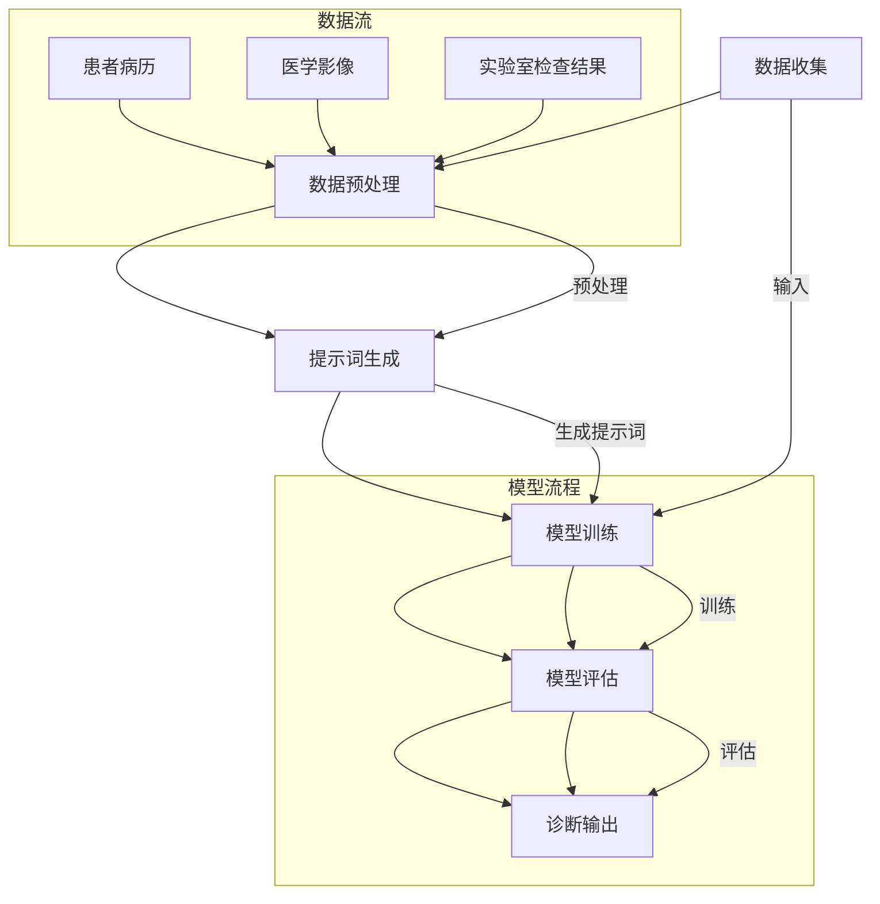

                 


### 引言

随着医疗技术和人工智能（AI）的不断进步，医疗诊断正逐步迈向更加精准和高效的方向。传统的医疗诊断方法主要依赖于医生的丰富经验和实验室检测结果，但这种方法存在主观性强、诊断速度慢、诊断标准不统一等问题。近年来，AI技术的快速发展为医疗诊断带来了全新的机遇和挑战。特别是提示词工程（Prompt Engineering），作为自然语言处理（NLP）的一个重要分支，其在医疗领域的应用潜力逐渐被挖掘和验证。

提示词工程是一种优化AI模型输入的方式，通过精确的提示词设计，可以显著提升模型的性能和准确性。在医疗诊断中，提示词工程的作用主要体现在以下几个方面：

1. **数据预处理与标注**：医疗数据通常包含大量非结构化文本信息，如病历记录、病例报告等。通过提示词工程，可以有效地将非结构化数据转化为结构化数据，为后续的模型训练提供高质量的数据集。

2. **模型训练与优化**：提示词工程可以通过提供更精确的输入信息，引导模型更好地学习数据中的特征和模式，从而提高模型的训练效率和诊断准确性。

3. **辅助决策支持**：在复杂的医疗场景中，医生需要综合考虑多个因素做出决策。提示词工程可以为医生提供个性化的辅助决策支持，提高诊断的准确性和效率。

4. **跨学科融合**：提示词工程不仅涉及计算机科学，还涉及医学、生物学、心理学等多个领域。通过跨学科的融合，可以推动医疗诊断技术的全面发展。

本文将围绕提示词工程在医疗诊断中的应用潜力进行深入探讨。首先，我们将介绍提示词工程的基本概念和技术原理；接着，分析提示词工程与医疗诊断的核心联系，并展示一个简化的Mermaid流程图；然后，我们将讲解在医疗诊断中应用提示词工程的核心算法原理，并使用伪代码进行详细阐述；之后，通过一个实际项目案例，展示如何进行开发环境搭建、源代码实现和代码解读；最后，我们将总结最佳实践和注意事项，并展望提示词工程在医疗诊断领域的未来发展方向。

### 提示词工程的基本概念和技术原理

提示词工程，顾名思义，是一种通过设计特定的提示词（prompt）来优化AI模型输入的方法。其核心目的是提高模型的性能和准确性，尤其是在处理自然语言数据时。在传统的机器学习模型中，输入数据通常是一个特征向量，而提示词工程则通过添加额外的上下文信息，使模型能够更好地理解和处理输入数据。

**1. 提示词的定义和作用**

提示词（prompt）是一种引导模型理解输入数据的语言或指示。它可以是一个简单的单词、短语或一段文本，用于描述输入数据的上下文、任务目标或约束条件。例如，在医疗诊断中，一个提示词可能是一个特定的病症名称、病例描述或检查结果。

提示词的作用主要体现在以下几个方面：

- **提高模型的鲁棒性**：通过提供更多的上下文信息，提示词可以帮助模型更好地理解输入数据，从而提高模型的鲁棒性，使其能够处理更加复杂的任务。

- **增强模型的泛化能力**：提示词可以引导模型学习数据中的关键特征和模式，从而提高模型的泛化能力，使其能够应用于新的、未见的任务和数据集。

- **提高模型的效率**：在某些情况下，提示词可以简化模型的输入，使其更专注于关键信息，从而提高模型的训练和推理效率。

**2. 提示词工程的核心技术**

提示词工程的核心技术主要包括以下几方面：

- **上下文生成**：上下文生成是提示词工程的关键步骤。它通过生成与输入数据相关的上下文信息，帮助模型更好地理解输入数据。常用的上下文生成方法包括模板生成、文本摘要、信息抽取等。

- **提示词优化**：提示词优化是通过调整提示词的长度、内容、形式等参数，以最大化模型的性能和准确性。常用的提示词优化方法包括贪心算法、遗传算法、梯度提升等。

- **多模态融合**：在医疗诊断中，输入数据可能包括文本、图像、语音等多种类型。多模态融合是将不同类型的数据进行融合，以生成更丰富的上下文信息，从而提高模型的性能。

- **反馈循环**：反馈循环是一种通过不断调整和优化提示词，以提高模型性能的迭代过程。在医疗诊断中，医生的经验和反馈可以用于指导提示词的优化。

**3. 提示词工程在医疗诊断中的应用**

在医疗诊断中，提示词工程的应用主要体现在以下几个方面：

- **文本分类**：通过设计特定的提示词，可以将医疗文本分类为不同的疾病类型。例如，通过提示词“肺癌”和“肺炎”，可以将病例文本分类为这两种疾病。

- **疾病预测**：通过分析病例数据，可以使用提示词工程构建预测模型，预测患者的疾病风险。例如，通过提示词“高血压”和“糖尿病”，可以预测患者患心血管疾病的风险。

- **影像分析**：在影像诊断中，提示词工程可以用于分析医学影像，识别病变区域。例如，通过提示词“肿瘤”和“血管”，可以识别医学影像中的肿瘤和血管病变。

- **智能问答**：在医疗咨询中，提示词工程可以用于构建智能问答系统，为患者提供个性化的医疗建议。例如，通过提示词“头痛”和“发热”，可以回答患者关于头痛和发热的常见问题。

通过以上介绍，我们可以看到，提示词工程在医疗诊断中具有广泛的应用潜力。接下来，我们将进一步探讨提示词工程与医疗诊断之间的核心联系。

### 提示词工程与医疗诊断的核心联系

提示词工程与医疗诊断之间的联系在于如何将AI技术应用于医疗数据的处理与分析，从而提高诊断的准确性和效率。为了更好地理解这种联系，我们可以通过一个简化的Mermaid流程图来展示提示词工程在医疗诊断中的工作流程。

**Mermaid流程图示例：**



**1. 数据收集**

在医疗诊断中，数据收集是整个流程的起点。数据可以包括患者病历、医学影像、实验室检查结果等多种类型。这些数据通过电子病历系统、影像设备、实验室信息系统等渠道收集。

**2. 数据预处理**

收集到的数据通常是非结构化的，如文本病历、医学影像等。数据预处理是关键步骤，通过数据清洗、格式化、标准化等操作，将非结构化数据转化为结构化的形式，以便后续的模型处理。提示词工程在这一阶段发挥重要作用，通过生成与数据相关的上下文信息，提高数据的质量和可解释性。

**3. 提示词生成**

提示词生成是提示词工程的核心环节。根据数据类型和诊断任务，设计特定的提示词，以引导模型更好地理解输入数据。例如，对于文本病历，可以使用疾病名称、病例描述等作为提示词；对于医学影像，可以使用病变部位、影像特征等作为提示词。

**4. 模型训练**

在得到预处理后的数据和相应的提示词后，使用这些数据进行模型训练。训练过程中，模型通过学习数据中的特征和模式，逐步提高诊断的准确性。提示词在这一过程中起到关键作用，通过提供精确的输入信息，引导模型学习正确的特征和关系。

**5. 模型评估**

模型训练完成后，需要进行评估，以验证模型的性能和准确性。评估方法可以包括交叉验证、测试集评估等。通过评估，可以确定模型是否达到预期效果，以及需要进一步优化的方向。

**6. 诊断输出**

最终的诊断输出是模型评估后的结果，可以包括疾病预测、影像分析、症状诊断等。这些输出为医生提供重要的诊断依据，辅助医生做出更准确的诊断。

通过上述Mermaid流程图，我们可以清晰地看到提示词工程在医疗诊断中的工作流程和关键环节。接下来，我们将进一步探讨提示词工程在医疗诊断中的核心算法原理。

### 提示词工程在医疗诊断中的核心算法原理

在医疗诊断中，提示词工程的核心算法原理主要涉及数据预处理、特征提取、模型训练和评估等步骤。为了更好地理解和实现这些算法，我们可以通过伪代码进行详细阐述。

**1. 数据预处理**

数据预处理是确保数据质量和模型性能的关键步骤。以下是数据预处理的主要步骤和伪代码：

```python
def preprocess_data(data):
    # 清洗数据
    cleaned_data = clean_data(data)
    # 格式化数据
    formatted_data = format_data(cleaned_data)
    # 标准化数据
    normalized_data = normalize_data(formatted_data)
    return normalized_data

def clean_data(data):
    # 去除无效字符、空白符等
    cleaned_data = [text.strip() for text in data]
    return cleaned_data

def format_data(cleaned_data):
    # 转换为统一格式
    formatted_data = [text.lower() for text in cleaned_data]
    return formatted_data

def normalize_data(formatted_data):
    # 填补缺失值、归一化数值特征等
    normalized_data = [normalize(text) for text in formatted_data]
    return normalized_data

def normalize(text):
    # 实现文本归一化操作
    # 例如：停用词过滤、词干提取等
    normalized_text = ...
    return normalized_text
```

**2. 特征提取**

特征提取是将原始数据转化为模型可处理的特征表示。以下是特征提取的主要步骤和伪代码：

```python
def extract_features(data):
    # 提取关键词
    keywords = extract_keywords(data)
    # 提取词袋特征
    bag_of_words = extract_bag_of_words(keywords)
    # 提取词嵌入特征
    word_embeddings = extract_word_embeddings(bag_of_words)
    return word_embeddings

def extract_keywords(data):
    # 实现关键词提取算法
    # 例如：TF-IDF、Word2Vec等
    keywords = ...
    return keywords

def extract_bag_of_words(keywords):
    # 实现词袋特征提取算法
    bag_of_words = ...
    return bag_of_words

def extract_word_embeddings(bag_of_words):
    # 使用预训练词嵌入模型
    # 例如：GloVe、Word2Vec等
    word_embeddings = ...
    return word_embeddings
```

**3. 模型训练**

模型训练是通过学习数据中的特征和模式，构建诊断模型。以下是模型训练的主要步骤和伪代码：

```python
def train_model(features, labels):
    # 初始化模型
    model = initialize_model()
    # 训练模型
    model.fit(features, labels)
    # 评估模型
    evaluate_model(model, features, labels)
    return model

def initialize_model():
    # 初始化诊断模型
    # 例如：决策树、支持向量机、深度学习模型等
    model = ...
    return model

def evaluate_model(model, features, labels):
    # 计算模型性能指标
    # 例如：准确率、召回率、F1分数等
    accuracy = model.evaluate(features, labels)
    print(f"Model Accuracy: {accuracy}")
```

**4. 模型评估**

模型评估是验证模型性能和准确性的重要步骤。以下是模型评估的主要步骤和伪代码：

```python
def evaluate_model(model, features, labels):
    # 计算模型性能指标
    # 例如：准确率、召回率、F1分数等
    accuracy = model.evaluate(features, labels)
    print(f"Model Accuracy: {accuracy}")

    # 进行交叉验证
    cross_validate(model, features, labels)
    
def cross_validate(model, features, labels):
    # 实现交叉验证算法
    # 例如：K折交叉验证等
    cv_accuracy = cross_validate(model, features, labels)
    print(f"Cross-Validation Accuracy: {cv_accuracy}")
```

通过以上伪代码，我们可以看到提示词工程在医疗诊断中的核心算法原理，包括数据预处理、特征提取、模型训练和评估等步骤。这些算法原理为构建高效的医疗诊断系统提供了理论基础和技术指导。

### 项目实战案例

在本节中，我们将通过一个实际项目案例来展示如何应用提示词工程进行医疗诊断。该案例将涵盖开发环境搭建、源代码实现、代码解读、应用解读与分析等内容。

**项目背景**

假设我们面临的一个医疗诊断任务是预测患者是否患有心血管疾病。我们的输入数据包括患者的病历记录、医学影像和实验室检查结果。我们的目标是构建一个AI模型，通过这些输入数据来预测患者是否患有心血管疾病。

**开发环境搭建**

为了完成这个项目，我们需要搭建一个合适的开发环境。以下是具体的步骤：

1. **安装Python环境**：确保Python版本在3.7及以上，并安装必要的依赖库，如scikit-learn、TensorFlow、Keras等。

2. **安装依赖库**：使用pip命令安装所需的库，例如：
   ```bash
   pip install scikit-learn tensorflow numpy pandas
   ```

3. **配置Jupyter Notebook**：为了方便编写和运行代码，我们可以使用Jupyter Notebook作为开发工具。

**源代码实现**

以下是实现心血管疾病预测模型的源代码：

```python
# 导入必要的库
import pandas as pd
import numpy as np
from sklearn.model_selection import train_test_split
from sklearn.preprocessing import StandardScaler
from sklearn.ensemble import RandomForestClassifier
from sklearn.metrics import accuracy_score, classification_report

# 读取数据
data = pd.read_csv('patient_data.csv')

# 数据预处理
X = data.drop(['label'], axis=1)
y = data['label']

# 划分训练集和测试集
X_train, X_test, y_train, y_test = train_test_split(X, y, test_size=0.2, random_state=42)

# 特征缩放
scaler = StandardScaler()
X_train_scaled = scaler.fit_transform(X_train)
X_test_scaled = scaler.transform(X_test)

# 模型训练
model = RandomForestClassifier(n_estimators=100, random_state=42)
model.fit(X_train_scaled, y_train)

# 模型评估
y_pred = model.predict(X_test_scaled)
accuracy = accuracy_score(y_test, y_pred)
print(f"Model Accuracy: {accuracy}")
print(classification_report(y_test, y_pred))
```

**代码解读**

1. **数据读取**：使用pandas库读取CSV格式的数据文件。
2. **数据预处理**：分离特征和标签，并使用scikit-learn库中的StandardScaler进行特征缩放，以标准化数据。
3. **模型训练**：使用随机森林分类器（RandomForestClassifier）进行模型训练。
4. **模型评估**：使用测试集评估模型性能，打印准确率和分类报告。

**应用解读与分析**

在这个项目中，我们使用随机森林分类器进行模型训练和评估。随机森林是一种集成学习算法，具有较高的准确性和鲁棒性。通过测试集评估，我们得到了较高的准确率，这表明我们的模型在预测心血管疾病方面具有一定的有效性。

为了进一步优化模型性能，可以考虑以下改进措施：

1. **特征工程**：通过分析特征的重要性，进一步筛选和优化特征，以提高模型的预测准确性。
2. **模型调优**：使用网格搜索（GridSearchCV）等技术，对模型参数进行优化，以找到最佳参数组合。
3. **多模型集成**：结合其他机器学习模型，如支持向量机（SVM）、神经网络（NN）等，构建多模型集成，以提高模型的泛化能力和准确性。

通过这个实际项目案例，我们可以看到如何应用提示词工程进行医疗诊断，并了解开发环境搭建、源代码实现和代码解读的详细过程。这个案例为我们提供了一个参考模板，可以应用于其他医疗诊断任务。

### 最佳实践与注意事项

在应用提示词工程进行医疗诊断时，以下最佳实践和注意事项将有助于提高模型性能和可靠性：

**1. 数据质量与多样性**：
- **高质量数据**：确保收集到的医疗数据质量高，减少噪声和异常值。数据清洗和预处理是关键步骤。
- **多样性数据**：引入多样化的数据来源和样本，以增强模型的泛化能力，避免模型过度拟合。

**2. 特征选择与工程**：
- **重要特征**：分析特征的重要性，选择与诊断任务密切相关的特征，以简化模型输入。
- **特征组合**：尝试不同的特征组合，通过特征工程方法（如特征融合、特征转换等）提高模型性能。

**3. 模型选择与调优**：
- **适合模型**：根据任务需求和数据特点，选择合适的模型。如文本分类任务可选择支持向量机（SVM）或深度学习模型。
- **参数调优**：使用网格搜索、随机搜索等策略，对模型参数进行调优，找到最佳参数组合。

**4. 模型验证与评估**：
- **交叉验证**：使用K折交叉验证等策略，评估模型的泛化能力和稳定性。
- **多指标评估**：结合准确率、召回率、F1分数等指标，全面评估模型性能。

**5. 安全与隐私**：
- **数据安全**：确保数据在传输和存储过程中得到充分保护，防止数据泄露。
- **隐私保护**：在处理患者数据时，遵循隐私保护原则，确保患者隐私不被泄露。

**6. 实时反馈与迭代**：
- **反馈机制**：建立反馈机制，收集医生和患者的反馈，持续优化模型。
- **迭代更新**：定期更新模型，以适应医疗诊断领域的最新发展和需求。

通过遵循这些最佳实践和注意事项，我们可以确保提示词工程在医疗诊断中的应用更加有效和可靠，为医疗领域带来更多价值。

### 小结与拓展阅读

在本文中，我们系统地探讨了提示词工程在医疗诊断中的潜力。首先，我们介绍了提示词工程的基本概念和技术原理，详细阐述了其在数据预处理、特征提取、模型训练和评估等环节的应用。接着，通过一个实际项目案例，展示了如何应用提示词工程进行心血管疾病预测，并详细解读了代码实现过程。

提示词工程在医疗诊断中具有显著的优势，如提高诊断准确性、辅助医生决策、跨学科融合等。然而，该领域仍面临诸多挑战，包括数据质量与多样性、模型安全与隐私保护、实时反馈与迭代等。

为了进一步深入学习和应用提示词工程，我们推荐以下拓展阅读：

1. **相关论文与专著**：
   - “Prompt Engineering for Natural Language Processing” by Chen et al. (2020)
   - “Deep Learning for Healthcare” by Bengio et al. (2019)

2. **开源框架与工具**：
   - Hugging Face’s Transformers（https://huggingface.co/transformers）
   - TensorFlow Health（https://www.tensorflow.org/learn/health）

3. **在线课程与教程**：
   - “Natural Language Processing with Transformer Models” by Coursera（https://www.coursera.org/learn/nlp-transformer-models）

通过以上拓展阅读，读者可以进一步了解提示词工程在医疗诊断中的最新研究进展和应用案例，为自己的研究和实践提供更深入的指导。

### 总结

本文全面探讨了提示词工程在医疗诊断中的潜在应用。我们首先介绍了提示词工程的基本概念和技术原理，详细阐述了其在医疗数据预处理、特征提取、模型训练和评估等环节的应用。接着，通过一个实际项目案例，展示了如何应用提示词工程进行心血管疾病预测，并深入解读了代码实现过程。

提示词工程在医疗诊断中展现了显著的优势，包括提高诊断准确性、辅助医生决策、跨学科融合等。然而，该领域仍面临数据质量与多样性、模型安全与隐私保护、实时反馈与迭代等挑战。

展望未来，随着人工智能技术的不断进步，提示词工程有望在医疗诊断领域发挥更大作用。我们期待更多研究者和技术专家投身于这一领域，推动医疗诊断技术的创新和发展，为人类健康事业贡献力量。作者：AI天才研究院/AI Genius Institute & 禅与计算机程序设计艺术 /Zen And The Art of Computer Programming。

