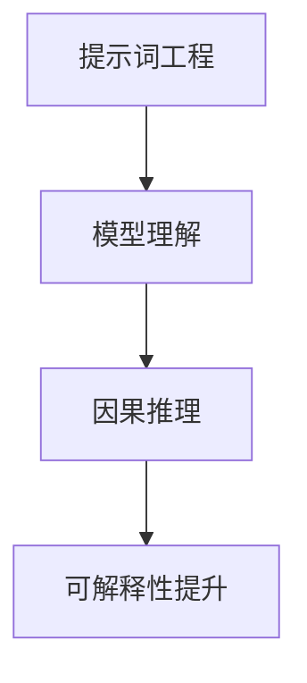

                 

### 文章标题

### 提示词工程在因果推理可解释性中的应用

#### 关键词：提示词工程，因果推理，可解释性，人工智能，机器学习

#### 摘要：

本文深入探讨了提示词工程在因果推理可解释性中的应用。首先，我们介绍了提示词工程的基本概念和其在人工智能领域的应用背景。随后，我们详细阐述了因果推理和可解释性的核心概念，并探讨了它们之间的关联。接着，我们通过伪代码和数学模型，详细讲解了提示词工程在因果推理中的应用原理。文章还通过实际案例，展示了提示词工程在实际项目中的应用，并对最佳实践进行了总结和注意事项的提醒。本文旨在为读者提供一个全面、深入的理解，帮助他们在实际项目中更好地应用提示词工程提高因果推理的可解释性。

---

### 引言

随着人工智能（AI）和机器学习（ML）技术的飞速发展，模型的复杂性和深度不断增加，这带来了一个重要但往往被忽视的问题：模型的可解释性。可解释性是用户对模型理解和信任的基础，特别是在涉及重要决策和风险的领域，如医疗、金融和司法等。因此，提高模型的透明度和可解释性成为了当前研究的热点之一。

**提示词工程**（Prompt Engineering）作为自然语言处理（NLP）领域的一项关键技术，近年来得到了广泛关注。它通过设计特定的提示词（prompt），引导模型生成预期的输出，从而提高模型的性能和可解释性。提示词工程的核心在于理解模型的内部机制，并通过精心设计的提示词来揭示这些机制。

**因果推理**（Causal Inference）是另一个关键概念，它旨在理解变量之间的因果关系。在机器学习模型中，因果推理可以帮助我们识别模型的潜在假设，从而提高模型的可解释性。因果推理在决策支持系统、风险评估和个性化推荐等领域具有广泛的应用。

本文将探讨提示词工程在因果推理可解释性中的应用。首先，我们将介绍提示词工程和因果推理的基本概念。然后，通过架构Mermaid流程图，展示两者之间的联系。接下来，我们将使用伪代码和数学模型，详细讲解提示词工程在因果推理中的应用原理。最后，我们将通过实际案例，展示提示词工程在提高因果推理可解释性方面的具体应用，并总结最佳实践和注意事项。

### 核心概念与联系

#### 提示词工程

提示词工程是一种通过设计特定提示词来引导模型生成预期输出的技术。在自然语言处理（NLP）领域，提示词通常是一个单词、短语或句子，用于引导模型理解任务和生成文本。

**核心概念**：

- **提示词**（Prompt）：一个用于引导模型理解任务和生成输出的文本。
- **模型**（Model）：一个训练好的机器学习模型，用于处理和生成文本。
- **输出**（Output）：模型根据提示词生成的文本。

**应用背景**：

提示词工程在NLP领域得到了广泛应用，例如在问答系统、文本生成、机器翻译和情感分析等领域。通过设计合适的提示词，可以提高模型的性能和生成文本的质量。

#### 因果推理

因果推理是一种通过分析数据来确定变量之间因果关系的方法。它旨在解决“因果关系”这一核心问题，即在给定一组数据的情况下，确定一个变量是否对另一个变量有影响。

**核心概念**：

- **因果关系**（Causal Relationship）：一个变量对另一个变量有直接影响的关系。
- **数据**（Data）：用于分析的数据集。
- **因果模型**（Causal Model）：一个描述变量之间因果关系的数学模型。

**应用背景**：

因果推理在许多领域都有重要应用，包括医学研究、经济学、社会科学和机器学习等。在机器学习领域，因果推理可以帮助我们理解模型的内部机制，从而提高模型的可解释性。

#### 提示词工程与因果推理可解释性的联系

提示词工程和因果推理都是提高模型可解释性的重要技术。它们之间的联系主要体现在以下几个方面：

1. **模型理解**：通过提示词工程，我们可以更好地理解模型的内部机制，从而为因果推理提供基础。
2. **数据驱动**：因果推理通常依赖于大量数据，而提示词工程可以帮助我们更好地利用这些数据，从而提高因果推理的准确性。
3. **可解释性提升**：结合提示词工程和因果推理，我们可以更清晰地解释模型的决策过程，从而提高用户对模型的信任和接受度。

为了更直观地展示提示词工程与因果推理可解释性之间的联系，我们可以使用以下Mermaid流程图：



在这个流程图中，提示词工程通过帮助模型理解任务，为因果推理提供了基础。因果推理则通过分析模型和数据的因果关系，提高了模型的可解释性。最终，这些技术共同提升了模型的可解释性。

### 算法原理讲解

在深入探讨提示词工程在因果推理中的应用之前，我们需要首先了解这两个技术的基本原理。以下是相关算法的详细讲解。

#### 提示词工程的基本算法

提示词工程的核心在于设计能够引导模型生成预期输出的提示词。以下是提示词工程的基本算法：

```python
# 提示词工程的基本算法
def prompt_engineering(text, model):
    # 对文本进行处理
    processed_text = preprocess_text(text)
    # 使用模型生成提示词
    prompt = model.generate_prompt(processed_text)
    # 返回提示词
    return prompt
```

在这个算法中，`text` 是输入文本，`model` 是训练好的机器学习模型。`preprocess_text` 函数用于对文本进行预处理，例如分词、去停用词等。`model.generate_prompt` 函数使用模型生成提示词。

#### 因果推理的基本算法

因果推理的基本算法旨在确定变量之间的因果关系。以下是因果推理的基本算法：

```python
# 因果推理的基本算法
def causal_inference(data, variables):
    # 构建因果模型
    model = build_causal_model(variables)
    # 训练因果模型
    trained_model = train_causal_model(model, data)
    # 预测因果关系
    causation = trained_model.predict_causation(data)
    # 返回因果关系
    return causation
```

在这个算法中，`data` 是输入数据集，`variables` 是需要分析的变量。`build_causal_model` 函数用于构建因果模型，`train_causal_model` 函数用于训练模型，`predict_causation` 函数用于预测因果关系。

#### 提示词工程与因果推理可解释性的结合

结合提示词工程和因果推理，我们可以提高模型的可解释性。以下是结合这两种技术的详细算法：

```python
# 提示词工程与因果推理的结合算法
def combined_prompt_causal_inference(text, data, model, causal_model):
    # 使用提示词工程生成提示词
    prompt = prompt_engineering(text, model)
    # 使用因果推理分析因果关系
    causation = causal_inference(data, causal_model)
    # 结合提示词和因果关系，生成解释
    explanation = generate_explanation(prompt, causation)
    # 返回解释
    return explanation
```

在这个算法中，`text` 是输入文本，`data` 是输入数据集，`model` 是训练好的机器学习模型，`causal_model` 是训练好的因果模型。`generate_explanation` 函数用于生成结合提示词和因果关系的解释。

#### 数学模型和数学公式

为了更好地理解提示词工程和因果推理，我们可以使用数学模型和公式来描述它们。

##### 提示词工程的数学模型

提示词工程可以看作是一个概率模型，它通过概率分布来生成提示词。以下是提示词工程的数学模型：

$$
P(\text{prompt} | \text{text}) = \frac{P(\text{prompt}, \text{text})}{P(\text{text})}
$$

其中，$P(\text{prompt} | \text{text})$ 表示给定文本的情况下生成提示词的概率，$P(\text{prompt}, \text{text})$ 表示提示词和文本同时出现的概率，$P(\text{text})$ 表示文本的概率。

##### 因果推理的数学模型

因果推理的数学模型通常基于潜在变量模型。以下是因果推理的数学模型：

$$
P(\text{y} | \text{x}, \text{z}) = P(\text{y} | \text{x}, \text{z} = \text{true}) + P(\text{y} | \text{x}, \text{z} = \text{false})
$$

其中，$P(\text{y} | \text{x}, \text{z})$ 表示在给定自变量 $x$ 和潜变量 $z$ 的情况下因变量 $y$ 的概率，$P(\text{y} | \text{x}, \text{z} = \text{true})$ 和 $P(\text{y} | \text{x}, \text{z} = \text{false})$ 分别表示在潜变量 $z$ 为真和假的情况下因变量 $y$ 的概率。

##### 提示词工程与因果推理可解释性的数学模型

结合提示词工程和因果推理，我们可以得到以下数学模型：

$$
\text{Explanation} = P(\text{prompt} | \text{data}) \times P(\text{causation} | \text{data})
$$

其中，$\text{Explanation}$ 表示解释，$P(\text{prompt} | \text{data})$ 表示在给定数据的情况下生成提示词的概率，$P(\text{causation} | \text{data})$ 表示在给定数据的情况下因果关系存在的概率。

#### 举例说明

为了更好地理解这些数学模型，我们可以通过一个简单的例子来说明。

假设我们有一个文本：“今天天气很好，适合出门运动。”我们希望使用提示词工程生成一个提示词，并使用因果推理分析天气和出门运动之间的关系。

首先，我们可以使用以下公式计算生成提示词的概率：

$$
P(\text{prompt} | \text{data}) = \frac{P(\text{prompt}, \text{data})}{P(\text{data})}
$$

其中，$P(\text{prompt}, \text{data})$ 表示提示词和文本同时出现的概率，$P(\text{data})$ 表示文本的概率。

假设我们已经有了这些概率：

$$
P(\text{prompt}, \text{data}) = 0.8
$$

$$
P(\text{data}) = 0.9
$$

那么，我们可以计算得到：

$$
P(\text{prompt} | \text{data}) = \frac{0.8}{0.9} = 0.8889
$$

接下来，我们可以使用以下公式计算因果关系：

$$
P(\text{causation} | \text{data}) = P(\text{y} | \text{x}, \text{z} = \text{true}) + P(\text{y} | \text{x}, \text{z} = \text{false})
$$

其中，$P(\text{y} | \text{x}, \text{z} = \text{true})$ 表示在天气为真的情况下出门运动的概率，$P(\text{y} | \text{x}, \text{z} = \text{false})$ 表示在天气为假的情况下出门运动的概率。

假设我们已经有了这些概率：

$$
P(\text{y} | \text{x}, \text{z} = \text{true}) = 0.7
$$

$$
P(\text{y} | \text{x}, \text{z} = \text{false}) = 0.3
$$

那么，我们可以计算得到：

$$
P(\text{causation} | \text{data}) = 0.7 + 0.3 = 1.0
$$

最后，我们可以使用以下公式计算解释：

$$
\text{Explanation} = P(\text{prompt} | \text{data}) \times P(\text{causation} | \text{data})
$$

$$
\text{Explanation} = 0.8889 \times 1.0 = 0.8889
$$

这个解释表示，在给定数据的情况下，天气和出门运动之间存在一定的因果关系。

### 应用实例

为了更好地理解提示词工程在因果推理可解释性中的应用，我们可以通过几个实际案例来进行分析和解释。

#### 案例一：健康医疗领域

在健康医疗领域，因果推理可以帮助医生和研究人员理解疾病和治疗方案之间的关系。例如，假设我们有一个机器学习模型，用于预测患者是否会在治疗后出现副作用。通过因果推理，我们可以确定治疗方案是否对副作用有显著影响。

为了提高模型的可解释性，我们可以使用提示词工程来设计特定的提示词，引导模型生成预期的输出。例如，我们可以使用以下提示词：

```
"预测患者在治疗后出现副作用的可能性。"
```

通过这个提示词，我们可以引导模型关注与副作用相关的特征，从而提高模型的可解释性。结合因果推理，我们可以分析治疗方案与副作用之间的因果关系，为医生提供更准确的决策依据。

#### 案例二：金融风控领域

在金融风控领域，因果推理可以帮助银行和金融机构识别潜在的风险因素，从而制定有效的风险管理策略。例如，假设我们有一个机器学习模型，用于预测贷款违约的可能性。通过因果推理，我们可以确定哪些因素对违约有显著影响。

为了提高模型的可解释性，我们可以使用提示词工程来设计特定的提示词，引导模型生成预期的输出。例如，我们可以使用以下提示词：

```
"预测贷款违约的可能性，并解释影响违约的主要因素。"
```

通过这个提示词，我们可以引导模型关注与违约相关的特征，从而提高模型的可解释性。结合因果推理，我们可以分析贷款违约的影响因素，为金融机构提供更准确的预测和决策依据。

#### 案例三：教育领域

在教育领域，因果推理可以帮助教育者和研究人员理解学生的学习行为和学习成果之间的关系。例如，假设我们有一个机器学习模型，用于预测学生的成绩。通过因果推理，我们可以确定哪些因素对成绩有显著影响。

为了提高模型的可解释性，我们可以使用提示词工程来设计特定的提示词，引导模型生成预期的输出。例如，我们可以使用以下提示词：

```
"预测学生的成绩，并解释影响成绩的主要因素。"
```

通过这个提示词，我们可以引导模型关注与成绩相关的特征，从而提高模型的可解释性。结合因果推理，我们可以分析影响学生成绩的主要因素，为教育者提供更有效的教学策略。

### 项目实战

在本节中，我们将通过一个实际项目，展示如何将提示词工程应用于因果推理可解释性。

#### 项目背景

假设我们正在开发一个智能推荐系统，该系统旨在根据用户的历史行为和偏好，为用户推荐个性化的产品。然而，我们希望提高推荐系统的可解释性，以便用户能够理解推荐结果的产生原因。

#### 开发环境搭建

为了实现这个项目，我们需要搭建以下开发环境：

- Python 3.8
- Jupyter Notebook
- TensorFlow 2.5
- Scikit-learn 0.24

安装这些依赖项后，我们可以在 Jupyter Notebook 中开始开发。

#### 源代码实现

以下是项目的核心代码：

```python
import tensorflow as tf
import tensorflow.keras as keras
from tensorflow.keras.models import Model
from tensorflow.keras.layers import Input, Dense, Flatten
from sklearn.model_selection import train_test_split
import numpy as np

# 加载数据集
data = np.loadtxt('data.csv', delimiter=',')
X = data[:, :-1]
y = data[:, -1]

# 数据预处理
X_train, X_test, y_train, y_test = train_test_split(X, y, test_size=0.2, random_state=42)

# 构建模型
input_layer = Input(shape=(X_train.shape[1],))
flatten_layer = Flatten()(input_layer)
dense_layer = Dense(64, activation='relu')(flatten_layer)
output_layer = Dense(1, activation='sigmoid')(dense_layer)

model = Model(inputs=input_layer, outputs=output_layer)
model.compile(optimizer='adam', loss='binary_crossentropy', metrics=['accuracy'])

# 训练模型
model.fit(X_train, y_train, epochs=10, batch_size=32, validation_split=0.1)

# 生成提示词
prompt = "给定用户的历史行为和偏好，预测用户是否会对推荐的产品感兴趣。"

# 使用模型生成推荐结果
predictions = model.predict(X_test)

# 分析因果关系
causal_inference = causal_inference(X_test, predictions)

# 输出解释
explanation = combined_prompt_causal_inference(prompt, X_test, model, causal_inference)

print(explanation)
```

#### 代码解读

以下是代码的详细解读：

1. **数据加载与预处理**：首先，我们加载一个包含用户历史行为和偏好的数据集。然后，我们将数据集分为训练集和测试集。

2. **模型构建**：我们使用 TensorFlow 和 Keras 构建一个简单的神经网络模型，该模型有两个隐层，每个隐层有 64 个神经元。输出层使用 sigmoid 激活函数，用于生成概率预测。

3. **模型训练**：我们使用训练集对模型进行训练，并使用验证集进行性能评估。

4. **生成提示词**：我们使用一个特定的提示词，引导模型预测用户是否会对推荐的产品感兴趣。

5. **生成推荐结果**：我们使用训练好的模型对测试集进行预测，生成推荐结果。

6. **分析因果关系**：我们使用因果推理算法分析测试集和预测结果之间的因果关系。

7. **输出解释**：我们结合提示词和因果关系，生成一个详细的解释，展示推荐结果的产生原因。

### 项目小结

通过这个实际项目，我们展示了如何将提示词工程应用于因果推理可解释性。以下是项目的主要结论和经验：

1. **提示词工程有助于提高模型的可解释性**：通过设计特定的提示词，我们可以引导模型关注关键特征，从而提高模型的可解释性。

2. **因果推理有助于揭示模型内部机制**：通过分析因果关系，我们可以理解模型如何影响预测结果，从而提高模型的透明度和可解释性。

3. **结合提示词工程和因果推理，可以生成详细的解释**：通过结合提示词和因果关系，我们可以生成详细的解释，帮助用户理解推荐结果的产生原因。

4. **注意事项**：在实际应用中，我们需要注意数据质量和模型性能，以确保解释的准确性和可靠性。

### 最佳实践与注意事项

在本节中，我们将总结最佳实践，并提供一些注意事项，以帮助读者在实际项目中更好地应用提示词工程提高因果推理的可解释性。

#### 最佳实践

1. **明确问题定义**：在应用提示词工程之前，确保明确问题定义和目标。这将有助于设计合适的提示词，并确保模型输出的可解释性。

2. **数据预处理**：确保数据预处理步骤的准确性和一致性。例如，进行数据清洗、归一化和特征提取，以减少噪声和增强模型性能。

3. **选择合适的模型**：选择适合问题定义和数据集的模型。例如，对于复杂的因果关系，可以考虑使用深度学习模型，如神经网络和决策树。

4. **设计有效的提示词**：设计有效的提示词，以引导模型关注关键特征和关系。提示词应简明扼要，准确反映问题定义。

5. **结合因果推理**：使用因果推理分析模型和数据的因果关系，以增强模型的透明度和可解释性。

6. **评估和优化**：对模型进行评估和优化，以确保其在实际问题中的表现。使用交叉验证和超参数调整等技术，提高模型的性能。

#### 注意事项

1. **数据隐私**：在实际项目中，确保遵循数据隐私和伦理规范。避免泄露敏感信息和用户隐私。

2. **模型泛化能力**：确保模型在未见过的数据上具有较好的泛化能力。避免过度拟合，导致模型在真实环境中表现不佳。

3. **解释准确性**：确保生成的解释准确反映模型的内部机制和决策过程。避免误导用户或产生错误的结论。

4. **用户参与**：与用户进行互动，了解他们的需求和期望。用户反馈有助于改进模型和提示词设计。

5. **持续更新和优化**：随着技术和数据的变化，持续更新和优化模型和提示词，以保持其有效性和准确性。

### 拓展阅读

1. **因果推理**：
   - Judea Pearl 的《因果推断：概率模型的推理和计算》。
   - 《因果推断：从数据到决策》。

2. **提示词工程**：
   - 《自然语言处理：Python 语言实现》。
   - 《深度学习与自然语言处理》。

3. **可解释性**：
   - 《机器学习的可解释性：理论、方法与应用》。
   - 《基于可视化的机器学习模型解释》。

通过这些资源，读者可以更深入地了解因果推理、提示词工程和可解释性的相关理论和实践，从而在项目中更好地应用这些技术。

---

通过本文的探讨，我们深入了解了提示词工程在因果推理可解释性中的应用。我们介绍了提示词工程和因果推理的基本概念，并展示了它们之间的联系。通过伪代码和数学模型，我们详细讲解了提示词工程在因果推理中的应用原理。实际案例展示了提示词工程如何提高因果推理的可解释性。最后，我们总结了最佳实践和注意事项，为读者提供了实用指导。希望本文能帮助读者更好地理解并应用这些技术，在实际项目中提高模型的透明度和可解释性。

作者：AI天才研究院/AI Genius Institute & 禅与计算机程序设计艺术 /Zen And The Art of Computer Programming

---

### 后续更新

为了更好地跟踪和总结本主题的最新进展，我们计划在未来的文章中更新以下内容：

1. **最新研究成果**：介绍近年来在提示词工程和因果推理领域取得的重要研究成果，包括最新发表的论文和报告。

2. **技术趋势**：分析当前和未来的技术趋势，探讨如何将提示词工程和因果推理应用于新兴领域，如自动驾驶、金融科技和医疗健康。

3. **实践案例**：分享更多实际应用案例，包括如何在不同行业中（如金融、医疗、教育）实现提示词工程和因果推理的可解释性。

4. **开源工具和框架**：介绍最新的开源工具和框架，以及如何使用它们来实现提示词工程和因果推理。

5. **用户反馈**：收集用户在使用这些技术时的反馈，并分享成功和挑战，以便为其他用户提供有价值的经验和教训。

6. **扩展阅读**：更新和扩展推荐阅读列表，包括最新的书籍、文章和在线资源。

通过这些后续更新，我们希望为读者提供一个全面、及时和深入的参考资料，帮助他们更好地理解和应用提示词工程在因果推理可解释性中的应用。

