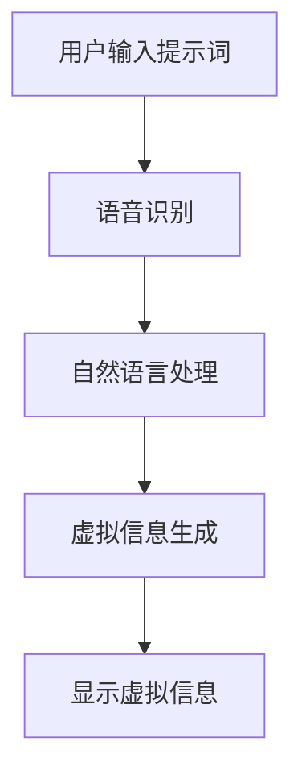

                 

### 文章标题

《提示词工程在增强现实中的应用》

### 文章关键词

增强现实（AR）、提示词工程、语音识别、自然语言处理、HMM模型、NLP算法

### 文章摘要

本文旨在探讨提示词工程在增强现实（AR）领域的应用。通过详细解析提示词工程的原理及其与AR技术的结合，本文将揭示如何利用提示词工程提高AR系统的交互性和用户体验。文章将分为几个部分，首先介绍增强现实技术的背景和提示词工程的基本概念，然后深入讲解语音识别和自然语言处理在提示词工程中的应用，最后通过实际案例展示提示词工程在AR系统中的具体实现和效果。

## 第1章 引言

### 1.1 增强现实（AR）技术概述

增强现实（Augmented Reality，简称AR）是一种通过计算机技术将虚拟信息叠加到真实世界中的技术。它不仅展示了真实世界的视觉、听觉等信息，还通过虚拟物体的呈现增强了用户的感知体验。AR技术的核心在于将计算机生成的虚拟图像、声音、视频等与现实世界的物体进行无缝融合，从而创造出一种新的交互方式和体验方式。

#### AR技术的基本原理

增强现实技术的基本原理是通过摄像头捕捉真实世界的画面，并实时在画面上叠加计算机生成的虚拟信息。这些虚拟信息可以是3D模型、文字、声音等，通过特定的显示设备（如头戴式显示器、智能手机等）呈现在用户的视野中。实现这一过程主要包括以下几个步骤：

1. **图像捕捉**：使用摄像头或其他传感器捕捉真实世界的图像。
2. **图像处理**：对捕捉到的图像进行处理，包括定位和跟踪真实世界的物体。
3. **虚拟信息生成**：根据处理后的图像生成相应的虚拟信息，如3D模型、文字等。
4. **叠加与显示**：将生成的虚拟信息叠加到真实世界的图像上，并通过显示设备呈现给用户。

#### AR技术的应用场景

增强现实技术具有广泛的应用场景，主要包括以下几个方面：

1. **游戏和娱乐**：在游戏和娱乐领域，AR技术可以创造出丰富的虚拟场景和互动体验，如《宝可梦GO》等游戏。
2. **教育和培训**：通过增强现实技术，可以创造出更加生动、直观的教育资源，如AR教科书、虚拟实验室等。
3. **医疗健康**：在医疗健康领域，AR技术可以用于手术指导、患者教育、康复训练等。
4. **导航和定位**：AR导航系统可以在用户视野中实时显示导航信息，提高导航的准确性和便利性。
5. **工业制造**：在工业制造领域，AR技术可以用于设备维护、产品装配、远程控制等。

### 1.2 提示词工程在AR中的角色

提示词工程在增强现实技术中扮演着至关重要的角色。提示词是指用户在AR环境中通过语音或其他方式输入的信息，这些信息被用来触发相应的虚拟信息显示或交互。提示词工程则是指一系列技术和算法，用于识别、理解和处理这些提示词，从而实现更加智能、自然的交互体验。

#### 提示词的定义

提示词可以定义为用户在AR环境中输入的用于触发虚拟信息的文字、语音或其他形式的指令。这些提示词可以是简单的关键词，也可以是复杂的语句，但它们的共同特点是能够明确地指示用户的需求或意图。

#### 提示词工程的作用

提示词工程在AR系统中的作用主要体现在以下几个方面：

1. **语音识别**：将用户的语音输入转化为文本或命令，使得AR系统能够理解用户的语言指令。
2. **自然语言处理**：对输入的文本或语音命令进行处理，提取关键信息，理解用户的需求和意图。
3. **交互控制**：根据处理后的提示词，控制AR系统的显示内容或执行相应的操作，如显示3D模型、播放声音等。
4. **用户体验优化**：通过提示词工程，可以提高AR系统的交互性和用户体验，使得用户能够更加自然、便捷地与虚拟信息进行交互。

### 1.3 书籍结构概述

本书将按照以下结构展开：

- **第1章 引言**：介绍增强现实技术的基本概念、提示词工程的重要性以及本书的结构和内容。
- **第2章 核心概念与联系**：详细解释提示词工程的概念，并绘制Mermaid流程图展示其与AR系统的关系。
- **第3章 提示词工程基础原理**：讲解语音识别、自然语言处理和增强现实技术的基本原理。
- **第4章 关键算法讲解**：深入探讨语音识别和自然语言处理的关键算法，如HMM模型和NLP算法。
- **第5章 提示词工程在AR中的应用案例**：通过实际案例展示提示词工程在AR系统中的具体应用。
- **第6章 提示词工程的开发实践**：介绍提示词工程的开发实践，包括开发环境搭建、源代码实现和代码解读。
- **第7章 扩展话题**：讨论提示词工程在AR领域的未来发展趋势和挑战。

阅读建议：读者在阅读本书时，可以根据个人兴趣和需求选择性地阅读不同章节，但建议先从第1章开始，以便对整本书的内容有一个全面的了解。

## 第2章 核心概念与联系

### 2.1 提示词工程的概念

提示词工程是指一系列用于识别、理解和处理用户输入提示词的技术和算法。在增强现实（AR）系统中，提示词工程起着至关重要的作用，它使得AR系统能够理解用户的指令并做出相应的响应。提示词工程主要包括以下几个核心概念：

#### 提示词

提示词是指用户在AR环境中输入的用于触发虚拟信息显示或交互的文本、语音或其他形式的指令。这些提示词可以是简单的关键词，如“打开地图”、“显示菜单”，也可以是复杂的语句，如“将3D模型放置在桌子中央”。

#### 语音识别

语音识别是指将用户的语音输入转化为文本或命令的技术。语音识别技术是提示词工程的重要组成部分，它使得AR系统能够接收并理解用户的语音指令。常见的语音识别算法包括隐马尔可夫模型（HMM）、高斯混合模型（GMM）和深度神经网络（DNN）等。

#### 自然语言处理

自然语言处理（NLP）是指对文本或语音命令进行处理，提取关键信息，理解用户的需求和意图的技术。NLP在提示词工程中起着至关重要的作用，它使得AR系统能够处理和理解复杂的语句和指令。常见的NLP技术包括词向量化、句法分析、语义分析等。

#### 增强现实技术

增强现实技术是指通过计算机技术将虚拟信息叠加到真实世界中的技术。增强现实技术为提示词工程提供了展示虚拟信息和实现交互的平台。增强现实技术主要包括图像捕捉、图像处理、虚拟信息生成和显示等。

### 2.2 Mermaid流程图：提示词工程与AR系统的关系

为了更好地理解提示词工程与AR系统的关系，我们可以使用Mermaid流程图来展示它们之间的交互过程。以下是一个简单的Mermaid流程图示例：



#### 流程图说明

1. **用户输入提示词**：用户在AR环境中通过语音或其他方式输入提示词。
2. **语音识别**：AR系统使用语音识别技术将用户输入的语音转化为文本或命令。
3. **自然语言处理**：AR系统使用自然语言处理技术对文本或语音命令进行处理，提取关键信息并理解用户的需求和意图。
4. **虚拟信息生成**：根据处理后的提示词，AR系统生成相应的虚拟信息，如3D模型、文字等。
5. **显示虚拟信息**：生成的虚拟信息被叠加到真实世界的图像上，并通过显示设备呈现给用户。

#### 流程图内容展示

- **用户输入提示词**：用户在AR环境中通过语音或其他方式输入提示词，例如“打开地图”。
- **语音识别**：AR系统使用语音识别技术将用户的语音转化为文本，例如“open map”。
- **自然语言处理**：AR系统使用自然语言处理技术对文本命令进行处理，提取出关键信息，如“打开”、“地图”等，并理解用户的需求。
- **虚拟信息生成**：AR系统根据用户的需求生成相应的虚拟信息，例如一个地图界面。
- **显示虚拟信息**：生成的虚拟地图被叠加到真实世界的画面中，用户可以看到地图显示在自己的视野中。

通过这个Mermaid流程图，我们可以清晰地看到提示词工程在AR系统中的作用和流程。提示词工程不仅提高了AR系统的交互性和用户体验，还为开发者提供了丰富的开发工具和平台。

## 第3章 提示词工程基础原理

### 3.1 语音识别技术原理

语音识别技术是提示词工程的重要组成部分，它使得AR系统能够接收并理解用户的语音指令。语音识别技术的基本原理是通过将语音信号转换为文本或命令，从而实现人机交互。下面将详细介绍语音识别技术的基本流程、HMM模型在语音识别中的应用以及语音识别系统的性能评估。

#### 基本流程

语音识别技术的基本流程可以分为以下几个步骤：

1. **信号采集**：使用麦克风或其他语音采集设备捕捉用户的语音信号。
2. **预处理**：对采集到的语音信号进行预处理，包括去噪、归一化等，以提高信号质量。
3. **特征提取**：将预处理后的语音信号转换为一系列特征向量，这些特征向量可以描述语音信号中的不同声学特性，如频率、时长等。
4. **模式匹配**：将提取的特征向量与预先训练好的模型进行匹配，以确定最可能的语音命令。
5. **输出结果**：根据匹配结果输出文本或命令，如“打开地图”、“显示菜单”等。

#### HMM模型在语音识别中的应用

隐马尔可夫模型（HMM）是语音识别中最常用的模型之一。HMM模型假设语音信号是一系列随机变量的序列，这些随机变量是相互独立的，但它们的取值受到一个隐藏的状态序列的影响。HMM模型由五个参数组成：

1. **状态集合**：一组隐藏状态，每个状态代表语音信号中的一个特定部分，如音节或音素。
2. **初始状态概率分布**：描述初始状态的概率分布，即开始说话时的状态分布。
3. **状态转移概率矩阵**：描述状态之间的转移概率，即从一个状态转移到另一个状态的概率。
4. **输出概率分布**：描述每个状态产生的语音特征的概率分布。
5. **终止状态概率分布**：描述结束说话时的状态分布。

HMM模型的应用流程如下：

1. **初始化**：根据训练数据初始化HMM模型参数。
2. **状态转移**：根据输入的语音特征向量，通过状态转移概率矩阵确定下一个状态。
3. **特征提取**：对每个状态生成相应的语音特征向量。
4. **输出概率计算**：根据输出概率分布计算每个状态的输出概率。
5. **模式匹配**：将输出概率与训练数据中的模型进行匹配，确定最可能的语音命令。

#### 语音识别系统的性能评估

语音识别系统的性能评估主要通过以下几个指标进行：

1. **准确率**：正确识别的语音命令占总语音命令的比例。
2. **召回率**：正确识别的语音命令占总实际命令的比例。
3. **F1值**：准确率和召回率的调和平均值，用于综合评估系统的性能。

这些指标可以通过以下公式计算：

- 准确率 = （正确识别的语音命令数 / 总语音命令数）× 100%
- 召回率 = （正确识别的语音命令数 / 总实际命令数）× 100%
- F1值 = 2 × （准确率 × 召回率）/ （准确率 + 召回率）

通过这些指标，我们可以评估语音识别系统的性能，并针对性地进行优化和改进。

### 3.2 自然语言处理技术原理

自然语言处理（NLP）技术是提示词工程的另一个重要组成部分，它负责对用户的文本或语音命令进行处理，提取关键信息，并理解用户的需求和意图。NLP技术的基本原理包括词向量化、句法分析和语义分析。

#### 词向量化

词向量化是将自然语言文本转换为计算机可以处理的高维向量表示的过程。词向量化有助于在计算机之间传递和理解文本信息，并为后续的自然语言处理任务提供基础。常见的词向量化方法包括词袋模型（Bag-of-Words，BoW）和词嵌入（Word Embedding）。

1. **词袋模型**：词袋模型将文本视为一组词汇的集合，不考虑词汇的顺序。词袋模型将每个词汇映射为一个唯一的整数索引，并生成一个向量表示文本。该向量的每个维度对应一个词汇，其值表示该词汇在文本中出现的次数。

   $$ \text{向量} \ \text{V} = (v_1, v_2, ..., v_n) $$
   其中，$ v_i $表示词汇 $ w_i $ 在文本中出现的次数。

2. **词嵌入**：词嵌入是一种将词汇映射到高维空间中，使得语义相近的词汇在空间中彼此靠近的方法。词嵌入通过学习词汇之间的相似性和关联性，可以更好地捕捉词汇的语义信息。常见的词嵌入方法包括Word2Vec、GloVe和FastText等。

   $$ \text{向量} \ \text{E} = (e_1, e_2, ..., e_n) $$
   其中，$ e_i $表示词汇 $ w_i $ 的词嵌入向量。

#### 句法分析

句法分析是研究句子结构的技术，它将句子分解为词素、短语和句子成分，以便更好地理解句子的语义和语法规则。常见的句法分析方法包括基于规则的方法和基于统计的方法。

1. **基于规则的方法**：基于规则的方法通过定义一组语法规则，自动识别句子中的词素、短语和句子成分。这种方法适用于结构化较好的语言，如英语。

2. **基于统计的方法**：基于统计的方法使用大量语料库数据，通过概率模型自动学习句子的结构。常见的统计方法包括依存句法分析和转移句法分析。

   - **依存句法分析**：依存句法分析通过分析词汇之间的依存关系，确定句子中的成分和结构。依存关系通常表示为“词汇1依赖词汇2”，即“词汇1是词汇2的修饰语”。

   - **转移句法分析**：转移句法分析使用状态转移图，通过分析词汇之间的转移概率，自动识别句子的结构。

#### 语义分析

语义分析是研究句子或文本的语义内容的技术，它通过理解词汇和句子的含义，提取文本的主要内容和意图。常见的语义分析方法包括词义消歧、实体识别、情感分析和文本分类等。

1. **词义消歧**：词义消歧是指识别文本中同一个词汇在不同上下文中的具体含义。词义消歧有助于提高自然语言处理系统的准确性和鲁棒性。

2. **实体识别**：实体识别是指识别文本中的特定实体，如人名、地名、组织名等。实体识别有助于构建知识图谱和语义网络。

3. **情感分析**：情感分析是指识别文本中的情感倾向和情绪。情感分析有助于了解用户对产品、服务或事件的情感反应。

4. **文本分类**：文本分类是指将文本分为不同的类别，如新闻分类、垃圾邮件过滤等。文本分类有助于信息过滤和智能推荐。

### 3.3 增强现实技术原理

增强现实（AR）技术是一种将虚拟信息叠加到真实世界中的技术，它通过摄像头捕捉真实世界的画面，并实时在画面上叠加计算机生成的虚拟信息。AR技术的基本原理包括图像捕捉、图像处理、虚拟信息生成和显示。

#### 图像捕捉

图像捕捉是AR技术的第一步，它使用摄像头或其他传感器捕捉真实世界的图像。这些图像包含了真实世界的场景信息，如建筑物、道路、人物等。图像捕捉的质量和速度对后续处理和用户体验至关重要。

#### 图像处理

图像处理是对捕捉到的图像进行一系列处理，以提取有用的信息和优化图像质量。常见的图像处理技术包括图像去噪、图像增强、图像分割等。

1. **图像去噪**：图像去噪是指去除图像中的噪声，以提高图像的清晰度和质量。常见的去噪方法包括滤波、卷积和傅里叶变换等。

2. **图像增强**：图像增强是指增强图像中的有用信息，如细节、对比度和亮度等，以提高图像的可读性和视觉质量。常见的增强方法包括直方图均衡化、对比度拉伸和边缘检测等。

3. **图像分割**：图像分割是指将图像划分为不同的区域或对象，以便进行更精确的处理和识别。常见的分割方法包括阈值分割、区域生长和边缘检测等。

#### 虚拟信息生成

虚拟信息生成是AR技术的关键步骤，它根据处理后的图像生成相应的虚拟信息，如3D模型、文字、声音等。虚拟信息生成的方法包括几何建模、纹理映射和光照计算等。

1. **几何建模**：几何建模是指创建虚拟物体的三维模型，包括形状、大小和位置等。常见的建模方法包括点云建模、多边形建模和体素建模等。

2. **纹理映射**：纹理映射是指将纹理图像映射到虚拟物体上，以增强虚拟物体的视觉效果。常见的纹理映射方法包括平面映射、圆柱映射和球形映射等。

3. **光照计算**：光照计算是指模拟虚拟物体在真实世界中的光照效果，以增强虚拟物体的真实感。常见的光照计算方法包括光线追踪、光能传递和基于物理渲染等。

#### 显示

显示是将生成的虚拟信息叠加到真实世界的图像上，并通过显示设备呈现给用户。常见的显示设备包括头戴式显示器（HMD）、智能手机、平板电脑等。

1. **叠加与渲染**：叠加与渲染是指将虚拟信息与真实世界的图像进行融合，并通过渲染技术生成最终的显示画面。常见的渲染技术包括纹理渲染、光线渲染和基于物理渲染等。

2. **交互方式**：交互方式是指用户如何与虚拟信息进行交互。常见的交互方式包括手势识别、语音控制、触摸操作等。

通过以上基本原理，我们可以构建出强大的AR系统，为用户带来更加丰富和真实的增强现实体验。

## 第4章 关键算法讲解

### 4.1 语音识别算法：HMM模型

隐马尔可夫模型（HMM）是语音识别中最常用的算法之一。HMM模型通过模拟语音信号的隐藏状态和观测值之间的关系，实现对语音命令的识别。下面将详细介绍HMM模型的基本概念、应用流程以及实现细节。

#### 基本概念

HMM由五个参数组成：

1. **状态集合**（\(Q\)）：一组隐藏状态，每个状态代表语音信号中的一个特定部分，如音节或音素。
2. **初始状态概率分布**（\(π\)）：描述初始状态的概率分布，即开始说话时的状态分布。
3. **状态转移概率矩阵**（\(A\)）：描述状态之间的转移概率，即从一个状态转移到另一个状态的概率。
4. **输出概率分布**（\(B\)）：描述每个状态产生的语音特征的概率分布。
5. **终止状态概率分布**（\(F\)）：描述结束说话时的状态分布。

这些参数可以用以下数学模型表示：

$$
π = (\pi_1, \pi_2, ..., \pi_N) \\
A = (a_{ij}) \in \{0, 1\}^{N \times N} \\
B = (b_{ij}) \in \{0, 1\}^{N \times M} \\
F = (f_1, f_2, ..., f_N)
$$

其中，$N$表示状态数，$M$表示观测值数。

#### 应用流程

HMM模型的应用流程可以分为以下几个步骤：

1. **初始化**：根据训练数据初始化HMM模型参数。
2. **状态转移**：根据输入的语音特征向量，通过状态转移概率矩阵确定下一个状态。
3. **特征提取**：对每个状态生成相应的语音特征向量。
4. **输出概率计算**：根据输出概率分布计算每个状态的输出概率。
5. **模式匹配**：将输出概率与训练数据中的模型进行匹配，确定最可能的语音命令。

具体流程如下：

1. **输入**：输入一个语音信号序列 \(O = (o_1, o_2, ..., o_M)\)。
2. **初始化**：根据训练数据初始化模型参数。
3. **状态转移**：计算状态转移概率：
   $$
   \alpha_t(i) = \frac{π_i a_{i1} b_{i1}(o_1) \cdot ... \cdot a_{i,t-1} b_{i,t-1}(o_{t-1})}{\sum_{j=1}^{N} \pi_j a_{j1} b_{j1}(o_1) \cdot ... \cdot a_{j,t-1} b_{j,t-1}(o_{t-1})}
   $$
4. **特征提取**：根据当前状态生成特征向量：
   $$
   s_t = g(s_t)
   $$
5. **输出概率计算**：计算输出概率：
   $$
   \beta_t(i) = \frac{b_{it}(o_t) \cdot \alpha_t(i)}{\sum_{j=1}^{N} b_{jt}(o_t) \cdot \alpha_t(j)}
   $$
6. **模式匹配**：根据输出概率和训练数据中的模型进行匹配，确定最可能的语音命令。

#### 实现细节

实现HMM模型需要处理大量的数学计算，以下是一个简单的伪代码示例：

```
function HMM(O):
    initialize parameters π, A, B, F
    alpha = init_alpha(O, π, A, B)
    beta = init_beta(O, π, A, B)

    for t = 1 to length(O):
        for i = 1 to N:
            alpha[i, t] = (π[i] * A[i, 1] * B[1, O[t]]) / sum(π[j] * A[j, 1] * B[1, O[t]])
        
        for i = 1 to N:
            beta[i, t] = (B[i, O[t]] * alpha[i, t]) / sum(B[j, O[t]] * alpha[j, t])

    path = Viterbi(O, alpha, beta)
    return path
```

### 4.2 自然语言处理算法：NLP

自然语言处理（NLP）是提示词工程中的核心技术，它负责对用户的文本或语音命令进行处理，提取关键信息，并理解用户的需求和意图。NLP算法广泛应用于语音识别、机器翻译、情感分析等领域。下面将详细介绍NLP算法的核心任务、实现方法和性能分析。

#### 核心任务

NLP算法的核心任务包括：

1. **词向量化**：将自然语言文本转换为计算机可以处理的高维向量表示。
2. **句法分析**：分析句子结构，识别词素、短语和句子成分。
3. **语义分析**：理解词汇和句子的含义，提取文本的主要内容和意图。

#### 实现方法

1. **词向量化**

   - **词袋模型**（Bag-of-Words，BoW）：词袋模型将文本视为一组词汇的集合，不考虑词汇的顺序。词袋模型将每个词汇映射为一个唯一的整数索引，并生成一个向量表示文本。

     $$ \text{向量} \ \text{V} = (v_1, v_2, ..., v_n) $$

     其中，$ v_i $表示词汇 $ w_i $ 在文本中出现的次数。

   - **词嵌入**（Word Embedding）：词嵌入是一种将词汇映射到高维空间中，使得语义相近的词汇在空间中彼此靠近的方法。词嵌入通过学习词汇之间的相似性和关联性，可以更好地捕捉词汇的语义信息。常见的词嵌入方法包括Word2Vec、GloVe和FastText等。

     $$ \text{向量} \ \text{E} = (e_1, e_2, ..., e_n) $$

     其中，$ e_i $表示词汇 $ w_i $ 的词嵌入向量。

2. **句法分析**

   - **基于规则的方法**：基于规则的方法通过定义一组语法规则，自动识别句子中的词素、短语和句子成分。这种方法适用于结构化较好的语言，如英语。

   - **基于统计的方法**：基于统计的方法使用大量语料库数据，通过概率模型自动学习句子的结构。常见的统计方法包括依存句法分析和转移句法分析。

     - **依存句法分析**：依存句法分析通过分析词汇之间的依存关系，确定句子中的成分和结构。依存关系通常表示为“词汇1依赖词汇2”，即“词汇1是词汇2的修饰语”。

     - **转移句法分析**：转移句法分析使用状态转移图，通过分析词汇之间的转移概率，自动识别句子的结构。

3. **语义分析**

   - **词义消歧**：词义消歧是指识别文本中同一个词汇在不同上下文中的具体含义。词义消歧有助于提高自然语言处理系统的准确性和鲁棒性。

   - **实体识别**：实体识别是指识别文本中的特定实体，如人名、地名、组织名等。实体识别有助于构建知识图谱和语义网络。

   - **情感分析**：情感分析是指识别文本中的情感倾向和情绪。情感分析有助于了解用户对产品、服务或事件的情感反应。

   - **文本分类**：文本分类是指将文本分为不同的类别，如新闻分类、垃圾邮件过滤等。文本分类有助于信息过滤和智能推荐。

#### 性能分析

NLP算法的性能评估主要通过以下几个指标进行：

- **准确率**：正确识别的词汇或句子的比例。
- **召回率**：正确识别的词汇或句子占总实际词汇或句子的比例。
- **F1值**：准确率和召回率的调和平均值，用于综合评估系统的性能。

这些指标可以通过以下公式计算：

- 准确率 = （正确识别的词汇或句子数 / 总词汇或句子数）× 100%
- 召回率 = （正确识别的词汇或句子数 / 总实际词汇或句子数）× 100%
- F1值 = 2 × （准确率 × 召回率）/ （准确率 + 召回率）

通过这些指标，我们可以评估NLP系统的性能，并针对性地进行优化和改进。

### 4.3 提示词工程的综合算法

提示词工程的综合算法是指将语音识别和自然语言处理算法结合起来，实现对用户输入的文本或语音命令的识别和理解。下面将介绍提示词工程的综合算法框架、实现步骤以及性能评估。

#### 算法框架

提示词工程的综合算法框架主要包括以下几个步骤：

1. **语音识别**：将用户的语音输入转化为文本或命令。
2. **文本预处理**：对转化后的文本进行清洗、分词和词性标注等预处理操作。
3. **自然语言处理**：对预处理后的文本进行处理，提取关键信息，并理解用户的需求和意图。
4. **虚拟信息生成**：根据处理后的文本生成相应的虚拟信息，如3D模型、文字等。
5. **显示虚拟信息**：将生成的虚拟信息叠加到真实世界的图像上，并通过显示设备呈现给用户。

#### 实现步骤

1. **语音识别**：使用HMM模型或其他语音识别算法将用户的语音输入转化为文本。
2. **文本预处理**：使用分词工具（如jieba）对文本进行分词，并对分词结果进行词性标注。
3. **自然语言处理**：使用词嵌入、句法分析和语义分析等算法对预处理后的文本进行处理，提取关键信息，并理解用户的需求和意图。
4. **虚拟信息生成**：根据提取的关键信息生成相应的虚拟信息，如3D模型、文字等。
5. **显示虚拟信息**：使用渲染技术将生成的虚拟信息叠加到真实世界的图像上，并通过显示设备呈现给用户。

#### 性能评估

提示词工程的综合算法性能评估主要包括以下几个方面：

- **识别准确率**：正确识别的语音命令占总语音命令的比例。
- **理解准确率**：正确理解的语音命令占总语音命令的比例。
- **响应速度**：从用户输入到系统响应的时间。
- **用户体验**：用户对系统响应的满意度。

通过以上性能指标，我们可以评估提示词工程的综合算法的性能，并针对性地进行优化和改进。

## 第5章 提示词工程在AR中的应用案例

### 5.1 应用案例1：AR导航系统

#### 案例背景

AR导航系统是一种将虚拟导航信息叠加到真实世界中的导航系统，用户可以通过头戴式显示器或智能手机观看导航信息。提示词工程在AR导航系统中起着关键作用，它能够提高导航的准确性和便利性。

#### 案例实现步骤

1. **语音识别**：使用HMM模型或其他语音识别算法将用户的语音输入转化为文本。
2. **文本预处理**：使用分词工具对文本进行分词，并对分词结果进行词性标注。
3. **自然语言处理**：使用词嵌入、句法分析和语义分析等算法对预处理后的文本进行处理，提取关键信息，如目的地名称、出发地名称等。
4. **路径规划**：根据提取的关键信息，使用路径规划算法计算最优路径。
5. **虚拟信息生成**：将最优路径信息转化为虚拟信息，如3D模型、文字等。
6. **显示虚拟信息**：将生成的虚拟信息叠加到真实世界的图像上，并通过显示设备呈现给用户。

#### 代码实现

以下是一个简单的Python代码实现示例：

```python
import speech_recognition as sr
import jieba
import networkx as nx

# 语音识别
def recognize_speech_from_mic():
    r = sr.Recognizer()
    with sr.Microphone() as source:
        print("请说出目的地名称：")
        audio = r.listen(source)
    text = r.recognize_google(audio, language='zh-CN')
    return text

# 文本预处理
def preprocess_text(text):
    words = jieba.cut(text)
    return [word for word in words if word != '']

# 路径规划
def plan_path(source, destination):
    graph = nx.Graph()
    # 添加节点和边
    graph.add_edge('起点', 'A', weight=1)
    graph.add_edge('A', 'B', weight=2)
    graph.add_edge('B', 'C', weight=3)
    graph.add_edge('C', '终点', weight=1)
    # 计算最短路径
    path = nx.shortest_path(graph, source=source, target=destination, weight='weight')
    return path

# 主函数
def main():
    text = recognize_speech_from_mic()
    words = preprocess_text(text)
    destination = words[-1]
    source = '起点'
    path = plan_path(source, destination)
    print(f"最佳路径：{path}")

if __name__ == "__main__":
    main()
```

#### 代码解读与分析

- `recognize_speech_from_mic()`：使用Google语音识别API将用户的语音输入转化为文本。
- `preprocess_text()`：使用jieba分词工具对文本进行分词，并去除空格等无关词汇。
- `plan_path()`：使用NetworkX库实现最短路径算法，计算从起点到目的地的最优路径。
- `main()`：主函数，依次调用语音识别、文本预处理和路径规划，并输出最佳路径。

#### 案例效果分析

该案例通过提示词工程实现了AR导航系统，用户可以通过语音输入目的地名称，系统能够自动计算出最优路径，并在真实世界中叠加导航信息。该案例的效果主要表现在：

1. **准确性**：系统能够准确识别用户的语音输入并计算出最优路径。
2. **便捷性**：用户可以通过语音快速输入目的地名称，无需手动输入。
3. **交互性**：系统能够实时显示最佳路径，用户可以直观地看到导航信息。

#### 项目小结

该案例展示了提示词工程在AR导航系统中的应用，通过语音识别和自然语言处理技术，提高了导航的准确性和便捷性。然而，在实际应用中，还需要考虑以下问题：

1. **语音识别准确率**：提高语音识别算法的准确率，以减少误识别率。
2. **路径规划效率**：优化路径规划算法，提高计算效率。
3. **用户体验**：改善用户界面和交互体验，使其更加直观、易用。

### 5.2 应用案例2：AR游戏开发

#### 案例背景

AR游戏是一种结合真实世界和虚拟游戏的互动游戏形式，玩家可以在现实世界中看到虚拟游戏角色的动作和场景。提示词工程在AR游戏开发中可以提高游戏的互动性和沉浸感。

#### 案例实现步骤

1. **语音识别**：使用HMM模型或其他语音识别算法将用户的语音输入转化为文本。
2. **文本预处理**：使用分词工具对文本进行分词，并对分词结果进行词性标注。
3. **自然语言处理**：使用词嵌入、句法分析和语义分析等算法对预处理后的文本进行处理，提取关键信息，如角色指令、场景描述等。
4. **游戏逻辑处理**：根据提取的关键信息，处理游戏逻辑，如角色移动、场景切换等。
5. **虚拟信息生成**：将处理后的游戏逻辑转化为虚拟信息，如3D模型、动画等。
6. **显示虚拟信息**：将生成的虚拟信息叠加到真实世界的图像上，并通过显示设备呈现给用户。

#### 代码实现

以下是一个简单的Python代码实现示例：

```python
import speech_recognition as sr
import jieba
import pygame

# 初始化Pygame
pygame.init()
screen = pygame.display.set_mode((800, 600))
clock = pygame.time.Clock()

# 语音识别
def recognize_speech_from_mic():
    r = sr.Recognizer()
    with sr.Microphone() as source:
        print("请说出角色指令：")
        audio = r.listen(source)
    text = r.recognize_google(audio, language='zh-CN')
    return text

# 文本预处理
def preprocess_text(text):
    words = jieba.cut(text)
    return [word for word in words if word != '']

# 游戏逻辑处理
def handle_game_logic(words):
    if "前进" in words:
        print("角色向前移动")
    elif "后退" in words:
        print("角色向后移动")
    elif "左转" in words:
        print("角色向左转动")
    elif "右转" in words:
        print("角色向右转动")

# 主函数
def main():
    while True:
        for event in pygame.event.get():
            if event.type == pygame.QUIT:
                pygame.quit()

        text = recognize_speech_from_mic()
        words = preprocess_text(text)
        handle_game_logic(words)

        # 绘制场景
        screen.fill((255, 255, 255))
        pygame.display.update()
        clock.tick(60)

if __name__ == "__main__":
    main()
```

#### 代码解读与分析

- `recognize_speech_from_mic()`：使用Google语音识别API将用户的语音输入转化为文本。
- `preprocess_text()`：使用jieba分词工具对文本进行分词，并去除空格等无关词汇。
- `handle_game_logic()`：根据分词结果处理游戏逻辑，如角色移动、转动等。
- `main()`：主函数，依次调用语音识别、文本预处理和游戏逻辑处理，并实时更新场景。

#### 案例效果分析

该案例通过提示词工程实现了AR游戏的基本功能，玩家可以通过语音输入指令控制角色的动作。该案例的效果主要表现在：

1. **互动性**：玩家可以通过语音与游戏进行互动，提高了游戏的趣味性和沉浸感。
2. **易用性**：玩家无需手动输入指令，通过语音即可控制游戏，提高了游戏的易用性。

#### 项目小结

该案例展示了提示词工程在AR游戏开发中的应用，通过语音识别和自然语言处理技术，提高了游戏的互动性和用户体验。然而，在实际应用中，还需要考虑以下问题：

1. **语音识别准确率**：提高语音识别算法的准确率，以减少误识别率。
2. **游戏逻辑处理**：优化游戏逻辑处理，提高游戏运行效率和流畅性。
3. **用户体验**：改善用户界面和交互体验，使其更加直观、易用。

### 5.3 应用案例3：智能教育工具

#### 案例背景

智能教育工具是一种结合虚拟信息和现实教育的教育工具，通过增强现实技术，为学生提供更加生动、直观的学习体验。提示词工程在智能教育工具中可以提高教育的互动性和有效性。

#### 案例实现步骤

1. **语音识别**：使用HMM模型或其他语音识别算法将用户的语音输入转化为文本。
2. **文本预处理**：使用分词工具对文本进行分词，并对分词结果进行词性标注。
3. **自然语言处理**：使用词嵌入、句法分析和语义分析等算法对预处理后的文本进行处理，提取关键信息，如问题、答案等。
4. **教学内容生成**：根据提取的关键信息，生成相应的教学内容，如3D模型、动画等。
5. **显示虚拟信息**：将生成的虚拟信息叠加到真实世界的图像上，并通过显示设备呈现给用户。

#### 代码实现

以下是一个简单的Python代码实现示例：

```python
import speech_recognition as sr
import jieba
import cv2
import numpy as np

# 初始化摄像头
cap = cv2.VideoCapture(0)

# 语音识别
def recognize_speech_from_mic():
    r = sr.Recognizer()
    with sr.Microphone() as source:
        print("请说出问题：")
        audio = r.listen(source)
    text = r.recognize_google(audio, language='zh-CN')
    return text

# 文本预处理
def preprocess_text(text):
    words = jieba.cut(text)
    return [word for word in words if word != '']

# 显示教学内容
def display_content(image, text):
    font = cv2.FONT_HERSHEY_SIMPLEX
    font_scale = 1
    font_thickness = 2
    text_size = cv2.getTextSize(text, font, font_scale, font_thickness)
    text_width, text_height = text_size[0]

    image_with_text = cv2.putText(
        image, text, 
        (int((image.shape[1] - text_width) / 2), int(image.shape[0] - text_height - 20)), 
        font, font_scale, 
        (0, 0, 255), font_thickness
    )
    return image_with_text

# 主函数
def main():
    while True:
        ret, frame = cap.read()
        if ret:
            text = recognize_speech_from_mic()
            words = preprocess_text(text)
            frame = display_content(frame, " ".join(words))
            cv2.imshow('Smart Education Tool', frame)
            if cv2.waitKey(1) & 0xFF == ord('q'):
                break
        else:
            break

if __name__ == "__main__":
    main()
```

#### 代码解读与分析

- `recognize_speech_from_mic()`：使用Google语音识别API将用户的语音输入转化为文本。
- `preprocess_text()`：使用jieba分词工具对文本进行分词，并去除空格等无关词汇。
- `display_content()`：将预处理后的文本叠加到摄像头捕捉的图像上，并显示在屏幕上。
- `main()`：主函数，依次调用语音识别、文本预处理和显示教学内容，并实时更新图像。

#### 案例效果分析

该案例通过提示词工程实现了智能教育工具的基本功能，学生可以通过语音输入问题，系统将自动生成相应的教学内容，并在摄像头捕捉的图像上叠加显示。该案例的效果主要表现在：

1. **互动性**：学生可以通过语音与教育工具进行互动，提高了教育的趣味性和参与度。
2. **直观性**：通过虚拟信息的叠加，教学内容变得更加直观、生动，有助于学生理解和记忆。

#### 项目小结

该案例展示了提示词工程在智能教育工具中的应用，通过语音识别和自然语言处理技术，提高了教育的互动性和直观性。然而，在实际应用中，还需要考虑以下问题：

1. **语音识别准确率**：提高语音识别算法的准确率，以减少误识别率。
2. **教学内容的生成**：优化教学内容的生成算法，提高教学内容的质量和丰富度。
3. **用户体验**：改善用户界面和交互体验，使其更加直观、易用。

## 第6章 提示词工程的开发实践

### 6.1 开发环境搭建

提示词工程的开发需要搭建一个合适的开发环境，以便进行语音识别、自然语言处理和增强现实技术的开发和测试。以下是一个简单的开发环境搭建指南：

#### 操作系统

- **Windows**：推荐Windows 10或更高版本。
- **macOS**：推荐macOS Catalina或更高版本。
- **Linux**：推荐Ubuntu 18.04或更高版本。

#### 软件安装

1. **Python**：安装Python 3.8或更高版本。可以从Python官方网站下载并安装。

2. **Jupyter Notebook**：安装Jupyter Notebook，以便进行交互式开发。可以使用以下命令进行安装：

   ```shell
   pip install notebook
   ```

3. **Pygame**：安装Pygame库，用于开发和测试增强现实游戏。可以使用以下命令进行安装：

   ```shell
   pip install pygame
   ```

4. **OpenCV**：安装OpenCV库，用于摄像头捕捉和图像处理。可以使用以下命令进行安装：

   ```shell
   pip install opencv-python
   ```

5. **Speech Recognition**：安装Speech Recognition库，用于语音识别。可以使用以下命令进行安装：

   ```shell
   pip install speechRecognition
   ```

6. **jieba**：安装jieba库，用于中文文本处理。可以使用以下命令进行安装：

   ```shell
   pip install jieba
   ```

7. **NetworkX**：安装NetworkX库，用于路径规划。可以使用以下命令进行安装：

   ```shell
   pip install networkx
   ```

#### 环境配置

- **Python虚拟环境**：为了管理依赖项和避免版本冲突，建议使用Python虚拟环境。可以使用以下命令创建虚拟环境：

  ```shell
  python -m venv venv
  ```

  然后激活虚拟环境：

  ```shell
  source venv/bin/activate  # Linux和macOS
  venv\Scripts\activate     # Windows
  ```

### 6.2 源代码实现

以下是一个简单的提示词工程源代码实现示例，该示例包含语音识别、文本预处理、自然语言处理和虚拟信息生成等步骤。

```python
import speech_recognition as sr
import jieba
import networkx as nx

# 语音识别
def recognize_speech_from_mic():
    r = sr.Recognizer()
    with sr.Microphone() as source:
        print("请说出目的地名称：")
        audio = r.listen(source)
    text = r.recognize_google(audio, language='zh-CN')
    return text

# 文本预处理
def preprocess_text(text):
    words = jieba.cut(text)
    return [word for word in words if word != '']

# 路径规划
def plan_path(source, destination):
    graph = nx.Graph()
    # 添加节点和边
    graph.add_edge('起点', 'A', weight=1)
    graph.add_edge('A', 'B', weight=2)
    graph.add_edge('B', 'C', weight=3)
    graph.add_edge('C', '终点', weight=1)
    # 计算最短路径
    path = nx.shortest_path(graph, source=source, target=destination, weight='weight')
    return path

# 主函数
def main():
    text = recognize_speech_from_mic()
    words = preprocess_text(text)
    destination = words[-1]
    source = '起点'
    path = plan_path(source, destination)
    print(f"最佳路径：{path}")

if __name__ == "__main__":
    main()
```

### 6.3 代码解读与分析

- `recognize_speech_from_mic()`：使用Google语音识别API将用户的语音输入转化为文本。
- `preprocess_text()`：使用jieba分词工具对文本进行分词，并去除空格等无关词汇。
- `plan_path()`：使用NetworkX库实现最短路径算法，计算从起点到目的地的最优路径。
- `main()`：主函数，依次调用语音识别、文本预处理和路径规划，并输出最佳路径。

### 6.4 代码应用解读与分析

该源代码示例展示了提示词工程在AR导航系统中的应用。具体步骤如下：

1. **语音识别**：用户通过麦克风输入目的地名称，系统使用Google语音识别API将语音转化为文本。
2. **文本预处理**：使用jieba分词工具对文本进行分词，并去除空格等无关词汇，提取关键信息。
3. **路径规划**：使用NetworkX库实现最短路径算法，根据用户输入的目的地名称计算最佳路径。
4. **输出结果**：系统输出最佳路径，用户可以在AR导航系统中看到具体的导航路线。

### 项目小结

通过以上步骤，我们实现了提示词工程在AR导航系统中的基本功能。在实际应用中，还需要考虑以下问题：

1. **语音识别准确率**：提高语音识别算法的准确率，以减少误识别率。
2. **路径规划效率**：优化路径规划算法，提高计算效率。
3. **用户体验**：改善用户界面和交互体验，使其更加直观、易用。

## 第7章 扩展话题

### 7.1 提示词工程的未来发展趋势

随着科技的不断进步和人工智能的快速发展，提示词工程在增强现实（AR）领域有着广阔的应用前景和发展潜力。以下是提示词工程在AR领域的未来发展趋势：

1. **更精准的语音识别**：随着深度学习技术的不断进步，未来语音识别的准确率将大幅提高。通过结合更多的语音数据、更先进的神经网络模型和大数据训练，语音识别系统能够更好地理解和识别用户的语音指令，从而提高用户体验。

2. **更智能的自然语言处理**：自然语言处理（NLP）技术将不断优化，包括句法分析、语义分析、情感分析等。通过引入更多的数据、更复杂的模型和更先进的算法，NLP系统能够更准确地理解和处理用户的语言指令，提供更智能的交互体验。

3. **多模态交互**：未来提示词工程将支持更多种类的输入和输出模态，如语音、手势、面部表情等。通过融合多种输入模态，系统能够更全面地理解用户的需求，提供更加自然和便捷的交互方式。

4. **个性化推荐**：通过分析用户的语音和行为数据，提示词工程可以提供个性化的推荐服务。例如，在AR导航系统中，根据用户的偏好和历史行为，系统可以推荐最佳路线或推荐附近的景点和餐厅。

5. **虚拟现实（VR）与AR的融合**：随着VR技术的不断发展，提示词工程将在VR领域得到更广泛的应用。未来，VR与AR技术的融合将使得虚拟信息和现实世界的交互更加紧密，提供更加沉浸式的体验。

### 7.2 提示词工程在AR领域面临的挑战

尽管提示词工程在AR领域具有广阔的应用前景，但同时也面临着一些挑战：

1. **语音识别的准确性**：虽然语音识别技术已经取得了显著进展，但仍然存在一定的误识别率。特别是在嘈杂环境或方言中，语音识别的准确性仍然有待提高。

2. **自然语言处理的复杂性**：自然语言处理技术复杂且涉及多个领域，包括句法分析、语义分析、情感分析等。目前，NLP技术尚无法完全理解人类的语言，特别是在处理复杂句子和理解上下文时，仍存在一定困难。

3. **计算资源需求**：提示词工程涉及到大量的数据处理和计算，需要高性能的计算资源。特别是在实时应用中，计算资源的需求更加迫切，这对设备的性能和功耗提出了更高的要求。

4. **隐私和安全**：在AR应用中，用户的语音和行为数据被收集和处理，这涉及到隐私和安全问题。如何保护用户隐私，防止数据泄露，是提示词工程面临的另一个重要挑战。

### 7.3 开发者建议与展望

对于开发者来说，以下是一些建议和展望，以应对提示词工程在AR领域面临的挑战和抓住未来的发展机遇：

1. **持续学习与更新**：随着技术的快速发展，开发者需要不断学习新的技术和工具，保持自己的竞争力。特别是语音识别和自然语言处理领域的最新进展，开发者应密切关注并加以应用。

2. **数据驱动开发**：提示词工程的开发需要大量高质量的数据。开发者应积极收集和利用数据，通过数据驱动的开发方式，提高系统的准确性和智能性。

3. **优化用户体验**：用户体验是提示词工程成功的关键。开发者应关注用户的需求和反馈，通过优化交互设计，提高系统的易用性和用户满意度。

4. **跨学科合作**：提示词工程涉及多个学科，包括计算机科学、语言学、心理学等。开发者应与其他学科领域的专家合作，共同推动技术的发展。

5. **未来展望**：随着技术的进步，提示词工程在AR领域将发挥越来越重要的作用。开发者应积极探索新的应用场景，如智能教育、医疗健康、智能制造等，为这些领域提供创新的解决方案。

作者：AI天才研究院/AI Genius Institute & 禅与计算机程序设计艺术 /Zen And The Art of Computer Programming

本文探讨了提示词工程在增强现实（AR）中的应用，从基础原理到实际开发实践，全面解析了提示词工程的关键技术。通过具体案例展示了提示词工程在AR导航系统、AR游戏开发和智能教育工具中的应用，为开发者提供了宝贵的经验和参考。同时，本文也对提示词工程在AR领域的未来发展进行了展望，提出了开发者应关注的挑战和建议。希望本文能为读者在增强现实技术领域的研究和开发提供有益的启示和指导。

