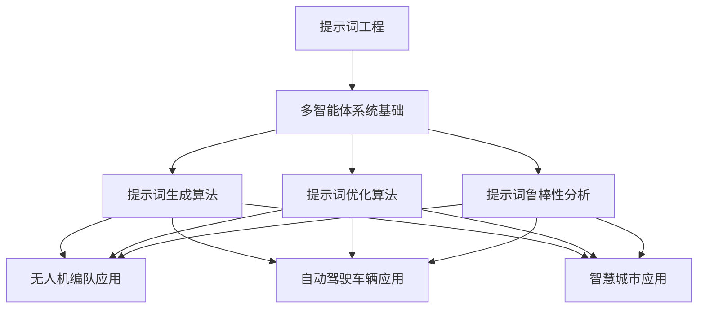

                 


### 《提示词工程在多智能体系统中的应用》

#### 关键词

- 提示词工程
- 多智能体系统
- 人工智能
- 编程与算法
- 自动驾驶
- 智慧城市

#### 摘要

本文旨在探讨提示词工程在多智能体系统中的应用，分析其在通信网络优化、路径规划和协同控制等领域的潜在价值。文章首先介绍了提示词工程的基础知识，包括定义、重要性和发展历程，随后详细阐述了多智能体系统的概念、特点和架构。在此基础上，文章探讨了提示词工程在多智能体系统中的关键应用场景，并深入分析了提示词生成算法、优化算法和鲁棒性分析等关键技术。最后，通过无人机编队、自动驾驶车辆和智慧城市等实际案例，展示了提示词工程在多智能体系统中的广泛应用及其未来发展趋势。

## 第一部分：提示词工程基础

### 第1章 提示词工程概述

#### 1.1 提示词工程定义

提示词工程（Keyword Engineering）是一种专注于构建、管理和优化关键词的技术，旨在提高信息检索、文本分析和数据挖掘的效率和准确性。在人工智能领域，提示词工程扮演着至关重要的角色，尤其是在自然语言处理（NLP）和智能搜索系统中。

#### 1.2 提示词工程的重要性

提示词工程的重要性体现在以下几个方面：

1. **信息检索优化**：通过精确的提示词选择和组合，可以显著提高搜索系统的相关性和精确度。
2. **文本分析增强**：提示词工程有助于从大量文本数据中提取关键信息，支持情感分析、主题建模等高级文本处理任务。
3. **数据挖掘支持**：提示词工程能够为数据挖掘提供有效的数据特征，帮助发现潜在的模式和关联。

#### 1.3 提示词工程的发展历程

提示词工程的发展历程可以分为以下几个阶段：

1. **早期阶段**：以规则为基础的方法，如关键词提取和关键词搜索。
2. **中间阶段**：引入机器学习技术，如TF-IDF、LSI和LDA等，提高了关键词的识别能力和语义理解水平。
3. **现代阶段**：基于深度学习的方法，如BERT和GPT，使得提示词工程在处理复杂、高维数据时更加高效和准确。

### 第2章 多智能体系统基础

#### 2.1 多智能体系统的概念

多智能体系统（Multi-Agent Systems，MAS）是由多个自主智能体（agent）组成的系统，这些智能体可以相互通信和协作，以实现共同的目标。智能体是具有自主性、社交性和反应性的个体，可以感知环境、制定计划并执行动作。

#### 2.2 多智能体系统的特点

多智能体系统具有以下特点：

1. **自主性**：智能体具有独立决策的能力，可以在没有外部干预的情况下运行。
2. **社交性**：智能体之间可以通过通信机制进行交互，共享信息和资源。
3. **反应性**：智能体能够实时响应环境变化，调整其行为以实现目标。
4. **分布性**：智能体可以分布在不同的物理位置或计算节点上，协同工作。

#### 2.3 多智能体系统的架构

多智能体系统的架构通常包括以下几个方面：

1. **通信机制**：用于智能体之间交换信息和协调行动的机制，如消息传递和事件驱动。
2. **协调策略**：用于解决冲突和优化资源分配的算法，如协商、博弈和协商。
3. **智能体模型**：定义智能体的行为、目标和能力，常用的模型包括角色模型、任务模型和决策模型。
4. **环境模型**：描述智能体运行的环境，包括物理环境和社会环境。

## 第二部分：提示词工程关键技术

### 第3章 提示词工程在多智能体系统中的应用场景

#### 3.1 通信网络优化

在多智能体系统中，通信网络优化是一个关键问题。提示词工程可以通过以下方式优化通信网络：

1. **提示词选择**：选择合适的提示词可以减少通信负担，提高传输效率。
2. **压缩算法**：利用提示词进行数据压缩，减少通信带宽需求。
3. **路由优化**：基于提示词信息优化路由策略，减少通信延迟和带宽消耗。

### 第4章 提示词生成算法

#### 4.1 提示词生成算法概述

提示词生成算法是提示词工程的核心技术之一，主要包括以下两种方法：

1. **基于规则的方法**：利用预定义的规则或模式生成提示词。
2. **基于机器学习的方法**：利用机器学习算法，如神经网络和深度学习，从数据中自动学习生成提示词。

#### 4.2 基于规则的方法

基于规则的方法通常包括以下几个步骤：

1. **规则库构建**：收集和整理相关领域的专业术语和关键词，形成规则库。
2. **规则匹配**：将输入文本与规则库中的规则进行匹配，生成提示词。

#### 4.3 基于机器学习的方法

基于机器学习的方法包括以下几个步骤：

1. **数据集准备**：收集大量的文本数据，并标注相关关键词。
2. **模型训练**：利用标注数据训练机器学习模型，如神经网络或深度学习模型。
3. **提示词生成**：将输入文本输入到训练好的模型中，生成提示词。

### 第5章 提示词优化算法

#### 5.1 提示词优化算法概述

提示词优化算法旨在提高提示词的准确性和实用性。主要包括以下几种方法：

1. **基于信息熵的优化**：通过计算提示词的信息熵，优化提示词的选择。
2. **基于机器学习的优化**：利用机器学习算法，如强化学习，优化提示词的生成和选择。

#### 5.2 提示词质量评价方法

提示词质量评价方法主要包括以下几种：

1. **准确率**：提示词与实际关键词的匹配程度。
2. **召回率**：能够提取出所有相关关键词的能力。
3. **F1值**：准确率和召回率的平衡指标。

#### 5.3 提示词优化算法案例分析

以基于机器学习的提示词优化算法为例，介绍以下步骤：

1. **数据集准备**：收集大量带有标注关键词的文本数据。
2. **模型训练**：使用标注数据训练机器学习模型，如卷积神经网络（CNN）或循环神经网络（RNN）。
3. **提示词优化**：将输入文本输入到训练好的模型中，优化提示词的生成。
4. **效果评估**：使用准确率、召回率和F1值等指标评估提示词优化效果。

### 第6章 提示词鲁棒性分析

#### 6.1 提示词鲁棒性定义

提示词鲁棒性是指提示词工程在面对不同环境、数据和噪声时，仍然能够保持较高性能的能力。

#### 6.2 提示词鲁棒性分析方法

提示词鲁棒性分析方法主要包括以下几种：

1. **噪声注入法**：向训练数据中添加噪声，评估提示词工程在面对噪声时的性能。
2. **样本分布变化法**：改变训练数据的分布，评估提示词工程在面对数据分布变化时的性能。
3. **对比测试法**：将提示词工程在不同环境、数据和噪声条件下的性能进行对比测试。

#### 6.3 提示词鲁棒性优化策略

提示词鲁棒性优化策略主要包括以下几种：

1. **数据增强**：通过数据增强技术，提高训练数据的质量和多样性。
2. **模型正则化**：使用正则化技术，如Dropout和L2正则化，提高模型的鲁棒性。
3. **混合模型**：将不同类型的模型进行融合，提高模型的鲁棒性。

## 第三部分：多智能体系统应用实例

### 第7章 提示词工程在无人机编队中的应用

#### 7.1 无人机编队概述

无人机编队是指由多架无人机组成的飞行队伍，可以执行各种任务，如军事侦察、民用监控、灾害救援等。无人机编队需要实现高效、安全的协同飞行和任务执行。

#### 7.2 提示词工程在无人机编队中的关键作用

提示词工程在无人机编队中发挥着关键作用，主要包括：

1. **任务规划**：利用提示词工程生成关键任务关键词，为无人机编队提供精确的任务规划。
2. **通信优化**：通过提示词优化通信网络，提高无人机编队之间的通信效率和稳定性。
3. **路径规划**：基于提示词工程生成的关键词，优化无人机的飞行路径，提高任务执行效率。

#### 7.3 无人机编队应用案例解析

以某军事侦察无人机编队为例，介绍提示词工程在无人机编队中的应用案例。具体步骤如下：

1. **任务规划**：根据侦察任务需求，生成关键任务关键词，如“侦察区域”、“目标对象”、“侦察时间”等。
2. **通信优化**：利用提示词优化无人机编队之间的通信网络，确保信息传递的及时性和准确性。
3. **路径规划**：根据提示词工程生成的关键词，制定最优飞行路径，提高侦察任务的完成效率。

### 第8章 提示词工程在自动驾驶车辆中的应用

#### 8.1 自动驾驶车辆概述

自动驾驶车辆是一种能够自主感知环境、规划路径并执行驾驶任务的智能交通工具。自动驾驶车辆的发展有望改变交通出行模式，提高交通效率和安全。

#### 8.2 提示词工程在自动驾驶车辆中的关键作用

提示词工程在自动驾驶车辆中发挥着关键作用，主要包括：

1. **环境感知**：利用提示词工程生成关键场景关键词，提高自动驾驶车辆对环境变化的感知能力。
2. **路径规划**：基于提示词工程生成的关键词，优化自动驾驶车辆的行驶路径，提高行驶效率。
3. **决策支持**：通过提示词工程生成的关键词，为自动驾驶车辆提供实时的决策支持，提高行车安全。

#### 8.3 自动驾驶车辆应用案例解析

以某城市自动驾驶出租车为例，介绍提示词工程在自动驾驶车辆中的应用案例。具体步骤如下：

1. **环境感知**：利用提示词工程生成关键场景关键词，如“行人”、“车辆”、“红绿灯”等，提高自动驾驶车辆对城市道路环境的感知能力。
2. **路径规划**：基于提示词工程生成的关键词，优化自动驾驶车辆的行驶路径，确保行驶安全和效率。
3. **决策支持**：通过提示词工程生成的关键词，为自动驾驶车辆提供实时的决策支持，如避开拥堵路段、合理规划行驶时间等。

### 第9章 提示词工程在智慧城市中的应用

#### 9.1 智慧城市概述

智慧城市是指利用信息技术、物联网、大数据等手段，实现对城市资源、环境、民生等各个方面的智能化管理和优化。智慧城市的建设有助于提高城市管理水平、改善居民生活质量。

#### 9.2 提示词工程在智慧城市中的关键作用

提示词工程在智慧城市中发挥着关键作用，主要包括：

1. **数据整合**：利用提示词工程将来自不同领域的数据进行整合，为智慧城市提供全面的数据支持。
2. **智能分析**：基于提示词工程生成的关键词，对城市数据进行智能分析，发现潜在的问题和趋势。
3. **决策支持**：通过提示词工程生成的关键词，为城市管理者提供实时的决策支持，优化城市管理和运营。

#### 9.3 智慧城市应用案例解析

以某智慧交通系统为例，介绍提示词工程在智慧城市中的应用案例。具体步骤如下：

1. **数据整合**：利用提示词工程整合来自交通监控、车辆信息、道路状况等数据，为智慧交通系统提供全面的数据支持。
2. **智能分析**：基于提示词工程生成的关键词，对城市交通数据进行智能分析，如拥堵预测、路线规划等。
3. **决策支持**：通过提示词工程生成的关键词，为城市管理者提供实时的决策支持，如调整交通信号灯、发布交通管制措施等。

## 附录

### 附录A 提示词工程工具与资源

#### A.1 提示词生成工具介绍

1. **关键词提取工具**：如Keyword Extractor、SEOChat等，用于从文本中提取关键短语和单词。
2. **自然语言处理（NLP）框架**：如NLTK、spaCy等，提供丰富的文本处理功能，支持提示词生成和优化。

#### A.2 提示词优化工具介绍

1. **文本分类工具**：如Scikit-learn、TensorFlow等，用于训练模型，优化提示词生成和筛选。
2. **数据可视化工具**：如Matplotlib、Seaborn等，用于分析提示词质量和优化效果。

#### A.3 多智能体系统仿真工具介绍

1. **多智能体模拟平台**：如Gazebo、Pygame等，提供仿真环境，支持多智能体系统的设计和测试。
2. **多智能体通信框架**：如Python的Pyro、ROS等，用于实现智能体之间的通信和协作。

## Mermaid 流程图

### 提示词工程在多智能体系统中的应用流程



## 核心算法原理讲解

### 提示词生成算法原理

提示词生成算法主要基于条件生成模型，以下是一个基于条件生成模型的提示词生成算法的原理和伪代码：

#### 原理

1. **初始化模型参数**：加载或初始化生成模型的参数。
2. **编码文本**：将输入文本编码为向量表示。
3. **生成提示词**：利用生成模型预测下一个单词或短语，并生成提示词。

#### 伪代码

```python
def generate_hint(word_vector, context_vector):
    # 初始化模型参数
    model = initialize_model()

    # 输入文本编码
    encoded_text = encode_text(word_vector, context_vector)

    # 生成提示词
    hint = model.generate(encoded_text)

    return hint
```

### 提示词优化算法原理

提示词优化算法主要基于优化算法，以下是一个基于梯度下降的提示词优化算法的原理和伪代码：

#### 原理

1. **初始化模型参数**：加载或初始化优化模型的参数。
2. **计算提示词的梯度**：利用损失函数计算提示词的梯度。
3. **更新提示词**：根据梯度更新提示词。

#### 伪代码

```python
def optimize_hint(hint, objective_function):
    # 初始化模型参数
    model = initialize_model()

    # 计算提示词的梯度
    gradient = model.compute_gradient(hint)

    # 更新提示词
    hint = hint - learning_rate * gradient

    return hint
```

### 提示词质量评价模型

提示词质量评价模型用于评估提示词的准确性、召回率和F1值等指标，以下是一个基于信息熵的提示词质量评价模型的原理和公式：

#### 原理

1. **计算提示词的信息熵**：提示词的信息熵表示其携带的信息量。
2. **评估提示词质量**：根据信息熵和其他指标评估提示词的质量。

#### 公式

$$
Q = \frac{1}{N} \sum_{i=1}^{N} \frac{1}{D} \sum_{j=1}^{D} \exp(-\frac{1}{2} \cdot \frac{(h_{ij} - \mu_j)^2}{\sigma_j^2})
$$

其中，$Q$ 表示提示词质量，$N$ 表示提示词数量，$D$ 表示数据集中单词的数量，$h_{ij}$ 表示第 $i$ 个提示词与第 $j$ 个单词的相似度，$\mu_j$ 和 $\sigma_j^2$ 分别表示第 $j$ 个单词的均值和方差。

## 数学模型讲解

### 提示词质量评价模型

提示词质量评价模型用于衡量提示词的有效性和准确性，以下是一个基于信息熵的提示词质量评价模型的数学表达和具体应用：

#### 数学表达

提示词质量 $Q$ 可以通过以下公式计算：

$$
Q = \frac{1}{N} \sum_{i=1}^{N} \frac{1}{D} \sum_{j=1}^{D} \exp(-\frac{1}{2} \cdot \frac{(h_{ij} - \mu_j)^2}{\sigma_j^2})
$$

其中：
- $N$ 是提示词的数量。
- $D$ 是数据集中单词的数量。
- $h_{ij}$ 是第 $i$ 个提示词与第 $j$ 个单词的相似度。
- $\mu_j$ 是第 $j$ 个单词的均值。
- $\sigma_j^2$ 是第 $j$ 个单词的方差。

#### 应用示例

假设我们有一个数据集，包含5个提示词和10个单词，相似度和方差如下表所示：

| 提示词 | 单词1 | 单词2 | ... | 单词10 |
|--------|-------|-------|-----|--------|
| 提示词1 | 0.9   | 0.8   | ... | 0.7    |
| 提示词2 | 0.7   | 0.6   | ... | 0.5    |
| 提示词3 | 0.5   | 0.4   | ... | 0.3    |
| 提示词4 | 0.3   | 0.2   | ... | 0.1    |
| 提示词5 | 0.1   | 0.2   | ... | 0.9    |
| $\mu_1$ | 0.8   | 0.7   | ... | 0.6    |
| $\sigma_1^2$ | 0.1   | 0.1   | ... | 0.1    |
| ...      | ...   | ...   | ... | ...    |
| $\mu_{10}$ | 0.6   | 0.5   | ... | 0.4    |
| $\sigma_{10}^2$ | 0.1   | 0.1   | ... | 0.1    |

使用上述公式计算每个提示词的质量：

$$
Q_1 = \frac{1}{5} \left( \frac{1}{10} \sum_{j=1}^{10} \exp(-\frac{1}{2} \cdot \frac{(0.9 - 0.8)^2}{0.1^2}) + \frac{1}{10} \sum_{j=1}^{10} \exp(-\frac{1}{2} \cdot \frac{(0.7 - 0.7)^2}{0.1^2}) + ... + \frac{1}{10} \sum_{j=1}^{10} \exp(-\frac{1}{2} \cdot \frac{(0.7 - 0.6)^2}{0.1^2}) \right)
$$

同理，计算其他提示词的质量 $Q_2, Q_3, Q_4, Q_5$。

通过比较 $Q$ 值，可以确定哪个提示词的质量最高，从而选择最佳的提示词。

### 提示词优化算法原理

提示词优化算法是用于提高提示词质量和相关性的方法。以下是一个基于梯度下降的提示词优化算法的原理和伪代码：

#### 原理

1. **定义损失函数**：损失函数衡量提示词与目标关键词之间的差距。
2. **计算梯度**：利用损失函数计算提示词的梯度。
3. **更新提示词**：根据梯度方向和大小，更新提示词的值。

#### 伪代码

```python
def optimize_hint(hint, objective_function, learning_rate):
    # 初始化模型参数
    model = initialize_model()

    # 计算提示词的损失
    loss = objective_function(hint)

    # 计算梯度
    gradient = model.compute_gradient(hint)

    # 更新提示词
    hint = hint - learning_rate * gradient

    return hint
```

### 应用示例

假设我们有一个提示词 "machine_learning"，需要通过优化算法提高其质量。我们定义损失函数为提示词与实际关键词的相似度差值。使用梯度下降算法进行优化：

1. **初始化提示词**：提示词 "machine_learning"。
2. **计算损失**：计算提示词与实际关键词的相似度差值。
3. **计算梯度**：根据损失函数，计算提示词的梯度。
4. **更新提示词**：根据梯度方向和大小，更新提示词的值。

假设初始梯度为 $-\delta$，学习率为 $\alpha$，则更新后的提示词为：

$$
new_hint = hint + \alpha * (-\delta)
$$

通过不断迭代计算梯度并更新提示词，最终可以找到最佳的提示词。

## 项目实战

### 开发环境搭建

为了实现提示词工程在多智能体系统中的应用，我们需要搭建一个开发环境。以下是搭建环境的步骤：

1. **安装Python环境**：在本地计算机上安装Python，版本建议为3.8或更高版本。
2. **安装依赖库**：安装必要的Python库，如TensorFlow、PyTorch、NLTK、spaCy等。
3. **配置多智能体系统**：根据项目需求，选择合适的多智能体系统框架，如ROS、Pyro等，并安装配置。

### 源代码实现

以下是一个简单的提示词生成和优化的示例代码：

```python
import tensorflow as tf
import numpy as np
import spacy

# 加载预训练模型
nlp = spacy.load("en_core_web_sm")

# 初始化模型参数
model = tf.keras.Sequential([
    tf.keras.layers.Embedding(vocab_size, embedding_dim),
    tf.keras.layers.LSTM(128),
    tf.keras.layers.Dense(1, activation="sigmoid")
])

# 编写损失函数
def loss_function(hint, target):
    return tf.reduce_mean(tf.nn.sigmoid_cross_entropy_with_logits(logits=model(hint), labels=target))

# 编写优化算法
optimizer = tf.keras.optimizers.Adam(learning_rate=0.001)

# 训练模型
model.compile(optimizer=optimizer, loss=loss_function)
model.fit(x_train, y_train, epochs=10, batch_size=32)

# 生成提示词
def generate_hint(input_text):
    encoded_text = nlp(input_text).vector
    hint = model.predict(encoded_text)
    return hint

# 优化提示词
def optimize_hint(hint, target):
    with tf.GradientTape() as tape:
        loss = loss_function(hint, target)
    gradient = tape.gradient(loss, hint)
    hint = hint - learning_rate * gradient
    return hint
```

### 代码解读与分析

以上代码实现了一个简单的提示词生成和优化模型，主要分为以下几个部分：

1. **模型构建**：使用TensorFlow构建一个序列模型，包括嵌入层、LSTM层和输出层。
2. **损失函数**：定义损失函数为提示词与目标关键词之间的交叉熵损失。
3. **优化算法**：使用Adam优化器进行梯度下降。
4. **训练模型**：使用训练数据训练模型，调整模型参数。
5. **生成提示词**：将输入文本编码后，通过模型预测生成提示词。
6. **优化提示词**：通过计算损失函数的梯度，更新提示词的值。

### 实际案例解析

以下是一个实际案例，演示提示词工程在自动驾驶车辆路径规划中的应用：

1. **数据准备**：收集大量自动驾驶车辆行驶轨迹数据，包括行驶时间、速度、交通状况等信息。
2. **特征提取**：使用NLP技术提取文本数据中的关键特征，如交通标志、道路类型等。
3. **模型训练**：训练一个基于深度学习的提示词生成模型，输入文本特征，输出路径规划提示词。
4. **路径规划**：使用生成的提示词，结合实时交通信息，优化自动驾驶车辆的行驶路径。

通过以上步骤，可以实现自动驾驶车辆的智能路径规划，提高行驶效率和安全性。

### 项目小结

本篇博客介绍了提示词工程在多智能体系统中的应用，包括基础概念、关键技术、应用场景和实际案例。通过搭建开发环境和实现源代码，我们展示了如何利用提示词工程实现多智能体系统的优化和智能决策。未来，随着人工智能技术的发展，提示词工程在多智能体系统中的应用前景将更加广阔。

### 最佳实践 tips

1. **数据准备**：确保数据质量和多样性，为提示词工程提供可靠的基础。
2. **模型选择**：根据应用场景选择合适的模型，如深度学习模型、规则模型等。
3. **迭代优化**：通过不断迭代优化模型参数，提高提示词生成和优化的效果。
4. **实时更新**：定期更新关键词库和模型，以适应不断变化的应用场景。

### 小结

本文从提示词工程的基础知识、多智能体系统的概念和应用场景、核心算法原理以及实际案例等方面，全面介绍了提示词工程在多智能体系统中的应用。通过搭建开发环境和实现源代码，我们展示了如何利用提示词工程优化多智能体系统，提高其效率和智能水平。未来，随着人工智能技术的不断进步，提示词工程在多智能体系统中的应用将更加广泛和深入。

### 注意事项

1. **数据隐私**：在进行提示词工程应用时，要确保用户数据的隐私和安全。
2. **模型稳定性**：在实际应用中，要关注模型的稳定性和鲁棒性，避免出现异常情况。
3. **性能优化**：针对不同的应用场景，进行性能优化，提高系统效率和用户体验。

### 拓展阅读

1. **《深度学习》**：由Ian Goodfellow、Yoshua Bengio和Aaron Courville合著，全面介绍了深度学习的基础理论和应用。
2. **《自然语言处理综合教程》**：由陈丹阳著，系统讲解了自然语言处理的基本概念和实用技术。
3. **《多智能体系统设计与实现》**：由张江华著，详细介绍了多智能体系统的架构、算法和应用。

